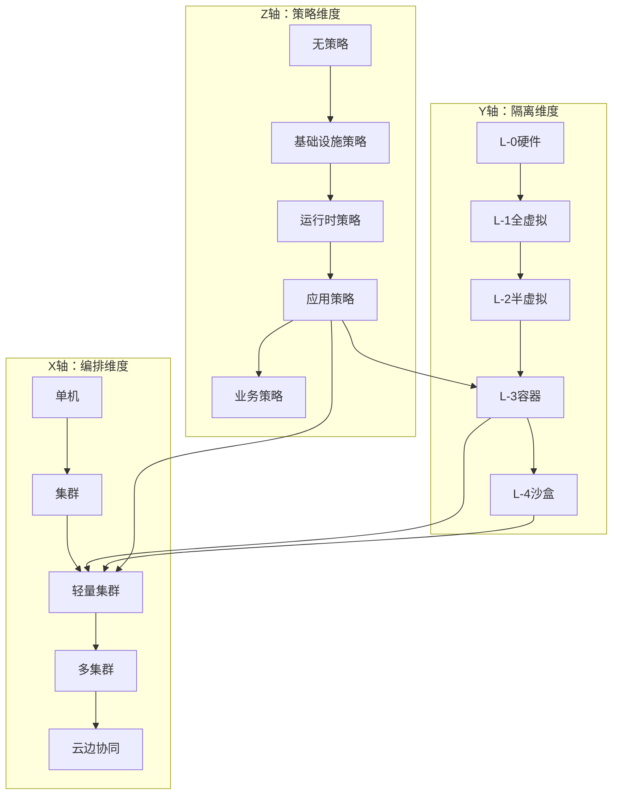

# 三维关系空间

## 📑 目录

- [三维关系空间](#三维关系空间)
  - [📑 目录](#-目录)
  - [30.5.1 隔离维度（Y 轴）](#3051-隔离维度y-轴)
  - [30.5.2 编排维度（X 轴）](#3052-编排维度x-轴)
  - [30.5.3 策略维度（Z 轴）](#3053-策略维度z-轴)
  - [30.5.4 三维关系可视化](#3054-三维关系可视化)
  - [三维关系空间应用](#三维关系空间应用)
    - [1. 技术选型](#1-技术选型)
    - [2. 架构设计](#2-架构设计)
    - [3. 性能优化](#3-性能优化)
  - [三维关系空间代码示例](#三维关系空间代码示例)
    - [三维坐标计算](#三维坐标计算)
    - [三维空间可视化](#三维空间可视化)
  - [2025 年最新实践](#2025-年最新实践)
    - [三维坐标优化](#三维坐标优化)
    - [技术组合优化](#技术组合优化)
  - [实际应用案例](#实际应用案例)
    - [案例 1：边缘计算三维坐标选型](#案例-1边缘计算三维坐标选型)
    - [案例 2：多集群三维坐标选型](#案例-2多集群三维坐标选型)

---

**最后更新**: 2025-11-06 **维护者**: 项目团队

> 📋 **主文档链
> 接**：[30.5 三维关系空间](../concept-relations-matrix.md#305-三维关系空间)

## 30.5.1 隔离维度（Y 轴）

**定义**：从硬件到应用的隔离层级

```text
Y轴: L-0硬件 → L-1全虚拟 → L-2半虚拟 → L-3容器 → L-4沙盒
```

| Y 坐标  | 层级       | 代表技术        | 隔离强度   |
| ------- | ---------- | --------------- | ---------- |
| **Y=0** | L-0 硬件   | VT-x/AMD-V      | ⭐⭐⭐⭐⭐ |
| **Y=1** | L-1 全虚拟 | KVM/ESXi        | ⭐⭐⭐⭐⭐ |
| **Y=2** | L-2 半虚拟 | virtio/Xen PV   | ⭐⭐⭐⭐   |
| **Y=3** | L-3 容器   | runc/containerd | ⭐⭐⭐     |
| **Y=4** | L-4 沙盒   | WasmEdge/gVisor | ⭐⭐⭐⭐⭐ |

## 30.5.2 编排维度（X 轴）

**定义**：从单机到集群的编排范围

```text
X轴: 单机 → 集群 → 多集群 → 边缘 → 云边协同
```

| X 坐标  | 范围     | 代表技术      | 管理能力   |
| ------- | -------- | ------------- | ---------- |
| **X=0** | 单机     | Docker        | 单机编排   |
| **X=1** | 集群     | Kubernetes    | 集群编排   |
| **X=2** | 轻量集群 | K3s           | 边缘编排   |
| **X=3** | 多集群   | Karmada/Fleet | 多集群管理 |
| **X=4** | 云边协同 | KubeEdge      | 云边一体化 |

## 30.5.3 策略维度（Z 轴）

**定义**：从基础设施到应用的策略治理

```text
Z轴: 无策略 → 基础设施策略 → 运行时策略 → 应用策略 → 业务策略
```

| Z 坐标  | 层级         | 代表技术      | 策略能力   |
| ------- | ------------ | ------------- | ---------- |
| **Z=0** | 无策略       | -             | ❌         |
| **Z=1** | 基础设施策略 | NetworkPolicy | ⭐⭐       |
| **Z=2** | 运行时策略   | OPA-Runtime   | ⭐⭐⭐     |
| **Z=3** | 应用策略     | Gatekeeper    | ⭐⭐⭐⭐   |
| **Z=4** | 业务策略     | OPA+业务规则  | ⭐⭐⭐⭐⭐ |

## 30.5.4 三维关系可视化



**三维坐标示例**：

| 技术组合               | (X, Y, Z) | 说明                    |
| ---------------------- | --------- | ----------------------- |
| **K3s + WasmEdge**     | (2, 4, 3) | 边缘 Wasm 编排+应用策略 |
| **K8s + gVisor**       | (1, 4, 2) | 集群沙盒+运行时策略     |
| **K3s + OPA**          | (2, 3, 3) | 边缘容器+应用策略       |
| **Karmada + WasmEdge** | (3, 4, 3) | 多集群 Wasm+应用策略    |

## 三维关系空间应用

### 1. 技术选型

**应用场景**：

- 根据三维坐标选择技术组合
- 优化技术栈配置

**选型方法**：

- **确定坐标**：根据需求确定 X、Y、Z 坐标
- **查找技术**：根据坐标查找对应技术组合
- **验证选择**：验证技术组合是否满足需求

### 2. 架构设计

**应用场景**：

- 使用三维坐标设计架构
- 优化架构配置

**设计方法**：

- **坐标映射**：将架构需求映射到三维坐标
- **技术组合**：根据坐标选择技术组合
- **架构优化**：优化架构配置

### 3. 性能优化

**应用场景**：

- 通过三维坐标优化性能
- 识别性能瓶颈

**优化方法**：

- **坐标分析**：分析坐标对性能的影响
- **技术调整**：调整技术组合优化性能
- **性能测试**：测试优化效果

## 三维关系空间代码示例

### 三维坐标计算

**三维坐标计算实现**：

```python
# 三维坐标计算
from dataclasses import dataclass
from typing import Tuple, List, Dict

@dataclass
class TechnologyCoordinate:
    """技术坐标"""
    X: int  # 编排维度 (0-4)
    Y: int  # 隔离维度 (0-4)
    Z: int  # 策略维度 (0-4)

class ThreeDimensionalSpace:
    """三维关系空间"""
    def __init__(self):
        self.technology_map: Dict[Tuple[int, int, int], str] = {
            (2, 4, 3): "K3s + WasmEdge + Gatekeeper",
            (1, 4, 2): "K8s + gVisor + OPA-Runtime",
            (2, 3, 3): "K3s + containerd + Gatekeeper",
            (3, 4, 3): "Karmada + WasmEdge + Gatekeeper",
            (1, 3, 2): "K8s + containerd + OPA-Runtime",
            (2, 4, 4): "K3s + WasmEdge + OPA+业务规则",
        }

        self.x_axis = {
            0: "单机",
            1: "集群",
            2: "轻量集群",
            3: "多集群",
            4: "云边协同"
        }

        self.y_axis = {
            0: "L-0硬件",
            1: "L-1全虚拟",
            2: "L-2半虚拟",
            3: "L-3容器",
            4: "L-4沙盒"
        }

        self.z_axis = {
            0: "无策略",
            1: "基础设施策略",
            2: "运行时策略",
            3: "应用策略",
            4: "业务策略"
        }

    def get_technology(self, coord: TechnologyCoordinate) -> str:
        """根据坐标获取技术组合"""
        key = (coord.X, coord.Y, coord.Z)
        return self.technology_map.get(key, "未找到匹配技术")

    def find_coordinate(self, technology: str) -> TechnologyCoordinate:
        """根据技术组合查找坐标"""
        for coord, tech in self.technology_map.items():
            if tech == technology:
                return TechnologyCoordinate(X=coord[0], Y=coord[1], Z=coord[2])
        return None

    def get_neighbors(self, coord: TechnologyCoordinate) -> List[TechnologyCoordinate]:
        """获取相邻坐标"""
        neighbors = []
        for dx in [-1, 0, 1]:
            for dy in [-1, 0, 1]:
                for dz in [-1, 0, 1]:
                    if dx == 0 and dy == 0 and dz == 0:
                        continue
                    new_x = max(0, min(4, coord.X + dx))
                    new_y = max(0, min(4, coord.Y + dy))
                    new_z = max(0, min(4, coord.Z + dz))
                    neighbors.append(TechnologyCoordinate(new_x, new_y, new_z))
        return neighbors

    def calculate_distance(self, coord1: TechnologyCoordinate,
                          coord2: TechnologyCoordinate) -> float:
        """计算坐标距离"""
        return ((coord1.X - coord2.X) ** 2 +
                (coord1.Y - coord2.Y) ** 2 +
                (coord1.Z - coord2.Z) ** 2) ** 0.5

# 使用示例
space = ThreeDimensionalSpace()
coord = TechnologyCoordinate(X=2, Y=4, Z=3)
tech = space.get_technology(coord)
print(f"技术组合: {tech}")  # 输出: K3s + WasmEdge + Gatekeeper

neighbors = space.get_neighbors(coord)
print(f"相邻坐标数: {len(neighbors)}")
```

### 三维空间可视化

**三维空间可视化实现**：

```python
# 三维空间可视化（使用 matplotlib）
import matplotlib.pyplot as plt
from mpl_toolkits.mplot3d import Axes3D
import numpy as np

def visualize_3d_space(space: ThreeDimensionalSpace):
    """可视化三维关系空间"""
    fig = plt.figure(figsize=(12, 10))
    ax = fig.add_subplot(111, projection='3d')

    # 提取所有坐标
    coords = list(space.technology_map.keys())
    x_coords = [c[0] for c in coords]
    y_coords = [c[1] for c in coords]
    z_coords = [c[2] for c in coords]

    # 绘制点
    ax.scatter(x_coords, y_coords, z_coords, c='r', marker='o', s=100)

    # 添加标签
    for coord, tech in space.technology_map.items():
        ax.text(coord[0], coord[1], coord[2], tech[:20], fontsize=8)

    # 设置坐标轴标签
    ax.set_xlabel('编排维度 (X)')
    ax.set_ylabel('隔离维度 (Y)')
    ax.set_zlabel('策略维度 (Z)')

    # 设置坐标轴范围
    ax.set_xlim(0, 4)
    ax.set_ylim(0, 4)
    ax.set_zlim(0, 4)

    plt.title('三维关系空间')
    plt.show()
```

## 2025 年最新实践

### 三维坐标优化

**技术栈**：

- Python 3.12（坐标计算）
- 机器学习模型（坐标推荐）
- Kubernetes 1.30

**优化策略**：

- **智能推荐**：使用机器学习推荐最优坐标
- **坐标优化**：优化坐标选择算法
- **性能预测**：预测不同坐标的性能

### 技术组合优化

**技术栈**：

- Kubernetes 1.30
- K3s 1.30.4+k3s2
- WasmEdge 0.14.1

**优化策略**：

- **组合优化**：优化技术组合配置
- **性能测试**：测试不同组合的性能
- **成本优化**：优化技术组合成本

## 实际应用案例

### 案例 1：边缘计算三维坐标选型

**场景**：边缘计算节点的技术选型

**需求分析**：

- **编排维度 (X)**：需要边缘编排 → X=2 (K3s)
- **隔离维度 (Y)**：需要强隔离 → Y=4 (WasmEdge)
- **策略维度 (Z)**：需要应用策略 → Z=3 (Gatekeeper)

**坐标选择**：(2, 4, 3)

**技术组合**：K3s + WasmEdge + Gatekeeper

**效果**：

- 启动时间：< 10ms
- 资源占用：< 5MB
- 策略延迟：< 1ms

### 案例 2：多集群三维坐标选型

**场景**：多集群环境的技术选型

**需求分析**：

- **编排维度 (X)**：需要多集群管理 → X=3 (Karmada)
- **隔离维度 (Y)**：需要强隔离 → Y=4 (WasmEdge)
- **策略维度 (Z)**：需要应用策略 → Z=3 (Gatekeeper)

**坐标选择**：(3, 4, 3)

**技术组合**：Karmada + WasmEdge + Gatekeeper

**效果**：

- 多集群管理：统一管理
- 隔离强度：⭐⭐⭐⭐⭐
- 策略治理：完整支持

---

**最后更新**：2025-11-15 **维护者**：项目团队
