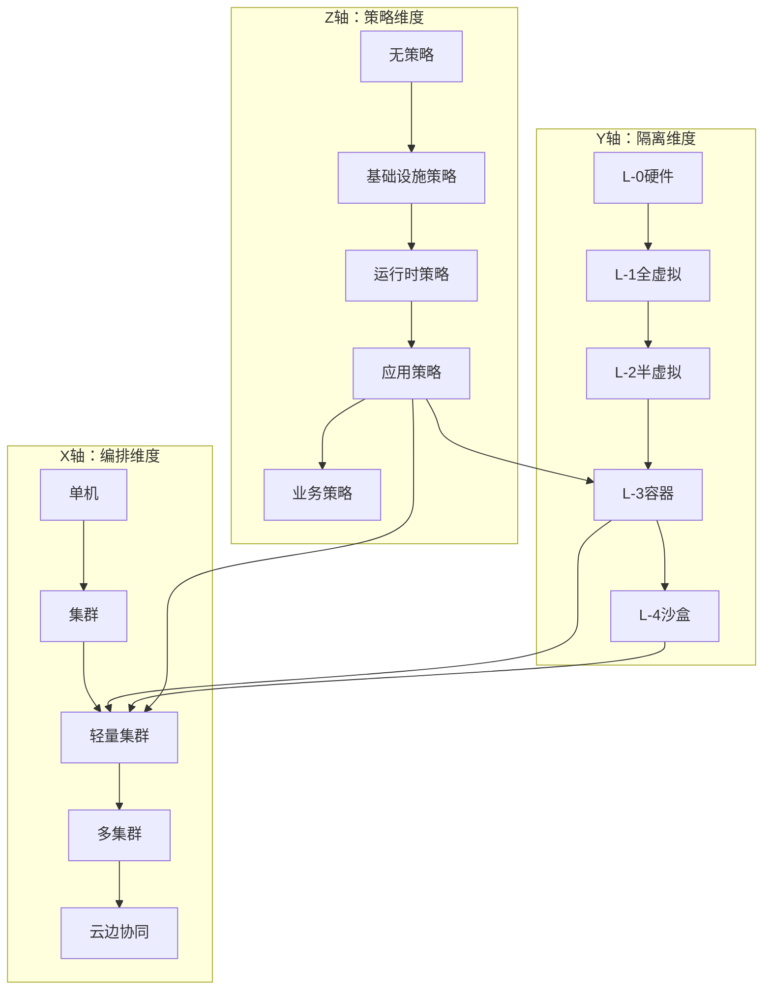

# 三维关系空间

## 📑 目录

- [三维关系空间](#三维关系空间)
  - [📑 目录](#-目录)
  - [30.5.1 隔离维度（Y 轴）](#3051-隔离维度y-轴)
  - [30.5.2 编排维度（X 轴）](#3052-编排维度x-轴)
  - [30.5.3 策略维度（Z 轴）](#3053-策略维度z-轴)
  - [30.5.4 三维关系可视化](#3054-三维关系可视化)

---

**最后更新**: 2025-11-06 **维护者**: 项目团队

> 📋 **主文档链
> 接**：[30.5 三维关系空间](../concept-relations-matrix.md#305-三维关系空间)

## 30.5.1 隔离维度（Y 轴）

**定义**：从硬件到应用的隔离层级

```text
Y轴: L-0硬件 → L-1全虚拟 → L-2半虚拟 → L-3容器 → L-4沙盒
```

| Y 坐标  | 层级       | 代表技术        | 隔离强度   |
| ------- | ---------- | --------------- | ---------- |
| **Y=0** | L-0 硬件   | VT-x/AMD-V      | ⭐⭐⭐⭐⭐ |
| **Y=1** | L-1 全虚拟 | KVM/ESXi        | ⭐⭐⭐⭐⭐ |
| **Y=2** | L-2 半虚拟 | virtio/Xen PV   | ⭐⭐⭐⭐   |
| **Y=3** | L-3 容器   | runc/containerd | ⭐⭐⭐     |
| **Y=4** | L-4 沙盒   | WasmEdge/gVisor | ⭐⭐⭐⭐⭐ |

## 30.5.2 编排维度（X 轴）

**定义**：从单机到集群的编排范围

```text
X轴: 单机 → 集群 → 多集群 → 边缘 → 云边协同
```

| X 坐标  | 范围     | 代表技术      | 管理能力   |
| ------- | -------- | ------------- | ---------- |
| **X=0** | 单机     | Docker        | 单机编排   |
| **X=1** | 集群     | Kubernetes    | 集群编排   |
| **X=2** | 轻量集群 | K3s           | 边缘编排   |
| **X=3** | 多集群   | Karmada/Fleet | 多集群管理 |
| **X=4** | 云边协同 | KubeEdge      | 云边一体化 |

## 30.5.3 策略维度（Z 轴）

**定义**：从基础设施到应用的策略治理

```text
Z轴: 无策略 → 基础设施策略 → 运行时策略 → 应用策略 → 业务策略
```

| Z 坐标  | 层级         | 代表技术      | 策略能力   |
| ------- | ------------ | ------------- | ---------- |
| **Z=0** | 无策略       | -             | ❌         |
| **Z=1** | 基础设施策略 | NetworkPolicy | ⭐⭐       |
| **Z=2** | 运行时策略   | OPA-Runtime   | ⭐⭐⭐     |
| **Z=3** | 应用策略     | Gatekeeper    | ⭐⭐⭐⭐   |
| **Z=4** | 业务策略     | OPA+业务规则  | ⭐⭐⭐⭐⭐ |

## 30.5.4 三维关系可视化



**三维坐标示例**：

| 技术组合               | (X, Y, Z) | 说明                    |
| ---------------------- | --------- | ----------------------- |
| **K3s + WasmEdge**     | (2, 4, 3) | 边缘 Wasm 编排+应用策略 |
| **K8s + gVisor**       | (1, 4, 2) | 集群沙盒+运行时策略     |
| **K3s + OPA**          | (2, 3, 3) | 边缘容器+应用策略       |
| **Karmada + WasmEdge** | (3, 4, 3) | 多集群 Wasm+应用策略    |

---

**最后更新**：2025-11-06 **维护者**：项目团队
