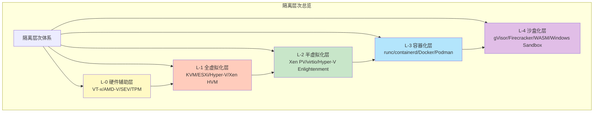

# 隔离层次全面对比分析

## 📑 目录

- [隔离层次全面对比分析](#隔离层次全面对比分析)
  - [📑 目录](#-目录)
  - [30.20.1 隔离层次思维导图](#30201-隔离层次思维导图)
  - [30.20.2 多维度对比矩阵](#30202-多维度对比矩阵)
    - [核心属性对比矩阵](#核心属性对比矩阵)
    - [技术实现对比矩阵](#技术实现对比矩阵)
  - [30.20.3 技术选型对比](#30203-技术选型对比)
    - [性能维度选型](#性能维度选型)
    - [安全维度选型](#安全维度选型)
    - [成本维度选型](#成本维度选型)
  - [30.20.4 应用场景对比](#30204-应用场景对比)
    - [边缘计算场景](#边缘计算场景)
    - [微服务场景](#微服务场景)
    - [Serverless 场景](#serverless-场景)
  - [隔离层次选型应用](#隔离层次选型应用)
    - [1. 技术选型](#1-技术选型)
    - [2. 架构设计](#2-架构设计)
    - [3. 性能优化](#3-性能优化)
  - [隔离层次选型代码示例](#隔离层次选型代码示例)
    - [隔离层次选型工具](#隔离层次选型工具)
    - [隔离层次对比分析](#隔离层次对比分析)
  - [2025 年最新实践](#2025-年最新实践)
    - [隔离层次优化](#隔离层次优化)
    - [技术栈推荐（2025）](#技术栈推荐2025)
  - [实际应用案例](#实际应用案例)
    - [案例 1：混合隔离层次部署](#案例-1混合隔离层次部署)
    - [案例 2：边缘计算隔离层次选型](#案例-2边缘计算隔离层次选型)

---

**最后更新**: 2025-11-07 **维护者**: 项目团队

> 📋 **主文档链
> 接**：[30.20 隔离层次全面对比分析](../concept-relations-matrix.md#3020-隔离层次全面对比分析)

## 30.20.1 隔离层次思维导图

**四层隔离栈完整思维导图**：



## 30.20.2 多维度对比矩阵

### 核心属性对比矩阵

| 维度           | L-0 硬件辅助   | L-1 全虚拟化   | L-2 半虚拟化   | L-3 容器化     | L-4 沙盒化     |
| -------------- | -------------- | -------------- | -------------- | -------------- | -------------- |
| **隔离强度**   | ⭐⭐⭐⭐⭐ (5) | ⭐⭐⭐⭐⭐ (5) | ⭐⭐⭐⭐ (4)   | ⭐⭐⭐ (3)     | ⭐⭐⭐⭐⭐ (5) |
| **冷启动时间** | N/A            | 5-30s          | 3-10s          | 1-5s           | <10ms          |
| **内存开销**   | N/A            | 128MB+         | 64-128MB       | 10-50MB        | 1-5MB          |
| **CPU 开销**   | <1%            | 5-10%          | 2-5%           | 1-3%           | <1%            |
| **资源利用率** | N/A            | ⭐⭐ (2)       | ⭐⭐⭐ (3)     | ⭐⭐⭐⭐⭐ (5) | ⭐⭐⭐⭐⭐ (5) |
| **部署密度**   | N/A            | 低             | 中             | 高             | 极高           |
| **网络性能**   | N/A            | ⭐⭐⭐ (3)     | ⭐⭐⭐⭐⭐ (5) | ⭐⭐⭐⭐ (4)   | ⭐⭐⭐⭐⭐ (5) |
| **存储性能**   | N/A            | ⭐⭐⭐ (3)     | ⭐⭐⭐⭐ (4)   | ⭐⭐⭐⭐⭐ (5) | ⭐⭐⭐⭐⭐ (5) |
| **兼容性**     | N/A            | ⭐⭐⭐⭐⭐ (5) | ⭐⭐⭐⭐ (4)   | ⭐⭐⭐⭐⭐ (5) | ⭐⭐⭐ (3)     |
| **可移植性**   | N/A            | ⭐⭐⭐⭐ (4)   | ⭐⭐⭐ (3)     | ⭐⭐⭐⭐⭐ (5) | ⭐⭐⭐⭐⭐ (5) |
| **安全合规**   | ⭐⭐⭐⭐⭐ (5) | ⭐⭐⭐⭐⭐ (5) | ⭐⭐⭐⭐ (4)   | ⭐⭐⭐ (3)     | ⭐⭐⭐⭐⭐ (5) |
| **运维复杂度** | ⭐⭐⭐⭐ (4)   | ⭐⭐⭐ (3)     | ⭐⭐⭐ (3)     | ⭐⭐⭐⭐⭐ (5) | ⭐⭐⭐⭐ (4)   |

### 技术实现对比矩阵

| 维度         | L-0 硬件辅助   | L-1 全虚拟化 | L-2 半虚拟化  | L-3 容器化       | L-4 沙盒化             |
| ------------ | -------------- | ------------ | ------------- | ---------------- | ---------------------- |
| **核心技术** | VT-x/AMD-V/SEV | KVM/QEMU     | virtio/Xen PV | namespace/cgroup | syscall 过滤/字节码 VM |
| **隔离机制** | CPU 模式切换   | VMCS/EPT     | grant table   | namespace        | seccomp/WASI           |
| **资源限制** | 硬件特性       | vCPU/vMEM    | 共享内存      | cgroup           | 能力模型               |
| **网络实现** | 硬件直通       | vNIC/TAP     | virtio-net    | veth pair        | 用户态网络栈           |
| **存储实现** | 硬件直通       | vmdk/qcow2   | virtio-blk    | overlayfs        | 虚拟文件系统           |
| **调度机制** | 硬件调度       | vCPU 调度    | 事件通道      | cgroup 调度      | 用户态调度             |

## 30.20.3 技术选型对比

### 性能维度选型

| 性能需求         | 推荐层级     | 理由             |
| ---------------- | ------------ | ---------------- |
| **极致启动速度** | L-4 沙盒化   | <10ms 冷启动     |
| **高资源利用率** | L-3 容器化   | 高密度部署       |
| **高网络性能**   | L-2 半虚拟化 | 近裸机网络性能   |
| **高存储性能**   | L-3 容器化   | 直接访问文件系统 |
| **低 CPU 开销**  | L-4 沙盒化   | <1% CPU 开销     |
| **低内存开销**   | L-4 沙盒化   | 1-5MB 内存占用   |

### 安全维度选型

| 安全需求       | 推荐层级     | 理由                    |
| -------------- | ------------ | ----------------------- |
| **最强隔离**   | L-1/L-4      | 完整隔离或 syscall 过滤 |
| **合规要求**   | L-1 全虚拟化 | 独立内核，完全隔离      |
| **零信任架构** | L-4 沙盒化   | 能力模型，最小权限      |
| **多租户隔离** | L-1 全虚拟化 | 完整 VM 隔离            |
| **供应链安全** | L-4 沙盒化   | 字节码验证，沙盒执行    |

### 成本维度选型

| 成本考虑             | 推荐层级   | 理由                 |
| -------------------- | ---------- | -------------------- |
| **最低基础设施成本** | L-3 容器化 | 高密度部署，资源共享 |
| **最低运维成本**     | L-3 容器化 | 标准化，易于管理     |
| **最低迁移成本**     | L-3 容器化 | 标准化镜像，易于迁移 |
| **最优 TCO**         | L-3 容器化 | 综合成本最优         |

## 30.20.4 应用场景对比

### 边缘计算场景

| 层级    | 适用性 | 典型技术栈       | 优势                     |
| ------- | ------ | ---------------- | ------------------------ |
| **L-1** | ❌     | N/A              | 资源开销过大             |
| **L-2** | ⚠️     | KVM + virtio     | 性能较好，但资源占用仍高 |
| **L-3** | ✅✅   | K3s + containerd | 轻量级，资源高效         |
| **L-4** | ✅✅✅ | K3s + WasmEdge   | 极致轻量，快速启动       |

**推荐方案**：L-4 沙盒化（K3s + WasmEdge）

### 微服务场景

| 层级    | 适用性 | 典型技术栈         | 优势                   |
| ------- | ------ | ------------------ | ---------------------- |
| **L-1** | ⚠️     | K8s + KVM          | 隔离强，但开销大       |
| **L-2** | ⚠️     | K8s + KVM + virtio | 性能好，但密度低       |
| **L-3** | ✅✅✅ | K8s + containerd   | 标准化，高密度，易管理 |
| **L-4** | ✅✅   | K8s + WasmEdge     | 快速启动，资源高效     |

**推荐方案**：L-3 容器化（K8s + containerd）或 L-4 沙盒化（K8s + WasmEdge）

### Serverless 场景

| 层级    | 适用性 | 典型技术栈           | 优势                   |
| ------- | ------ | -------------------- | ---------------------- |
| **L-1** | ❌     | N/A                  | 启动太慢               |
| **L-2** | ❌     | N/A                  | 启动慢                 |
| **L-3** | ✅     | Knative + containerd | 可接受，但启动仍有延迟 |
| **L-4** | ✅✅✅ | Knative + WasmEdge   | 极致快速启动，资源高效 |

**推荐方案**：L-4 沙盒化（Knative + WasmEdge）

## 隔离层次选型应用

### 1. 技术选型

**应用场景**：

- 根据应用需求选择隔离层次
- 优化技术栈配置

**选型方法**：

- **性能需求**：根据性能需求选择隔离层次
- **安全需求**：根据安全需求选择隔离层次
- **成本考虑**：根据成本考虑选择隔离层次
- **场景匹配**：根据应用场景选择隔离层次

### 2. 架构设计

**应用场景**：

- 使用隔离层次设计架构
- 优化架构配置

**设计方法**：

- **层次映射**：将需求映射到隔离层次
- **技术组合**：根据层次选择技术组合
- **架构优化**：优化架构配置

### 3. 性能优化

**应用场景**：

- 通过隔离层次优化性能
- 识别性能瓶颈

**优化方法**：

- **层次分析**：分析层次对性能的影响
- **技术调整**：调整技术组合优化性能
- **性能测试**：测试优化效果

## 隔离层次选型代码示例

### 隔离层次选型工具

**选型工具实现**：

```python
# 隔离层次选型工具
from dataclasses import dataclass
from typing import List, Dict
from enum import Enum

class IsolationLevel(Enum):
    """隔离层次"""
    L0_HARDWARE = "L-0硬件辅助"
    L1_FULL_VIRT = "L-1全虚拟化"
    L2_PARA_VIRT = "L-2半虚拟化"
    L3_CONTAINER = "L-3容器化"
    L4_SANDBOX = "L-4沙盒化"

@dataclass
class IsolationRequirement:
    """隔离需求"""
    performance: str  # 性能需求：极致启动速度、高资源利用率等
    security: str     # 安全需求：最强隔离、合规要求等
    cost: str         # 成本考虑：最低基础设施成本等
    scenario: str     # 应用场景：边缘计算、微服务、Serverless等

class IsolationSelector:
    """隔离层次选型器"""
    def __init__(self):
        self.performance_map = {
            "极致启动速度": IsolationLevel.L4_SANDBOX,
            "高资源利用率": IsolationLevel.L3_CONTAINER,
            "高网络性能": IsolationLevel.L2_PARA_VIRT,
            "高存储性能": IsolationLevel.L3_CONTAINER,
            "低CPU开销": IsolationLevel.L4_SANDBOX,
            "低内存开销": IsolationLevel.L4_SANDBOX,
        }

        self.security_map = {
            "最强隔离": IsolationLevel.L1_FULL_VIRT,
            "合规要求": IsolationLevel.L1_FULL_VIRT,
            "零信任架构": IsolationLevel.L4_SANDBOX,
            "多租户隔离": IsolationLevel.L1_FULL_VIRT,
            "供应链安全": IsolationLevel.L4_SANDBOX,
        }

        self.scenario_map = {
            "边缘计算": IsolationLevel.L4_SANDBOX,
            "微服务": IsolationLevel.L3_CONTAINER,
            "Serverless": IsolationLevel.L4_SANDBOX,
            "AI推理": IsolationLevel.L4_SANDBOX,
        }

    def select_level(self, requirement: IsolationRequirement) -> IsolationLevel:
        """选择隔离层次"""
        # 优先级：场景 > 性能 > 安全 > 成本
        if requirement.scenario in self.scenario_map:
            return self.scenario_map[requirement.scenario]

        if requirement.performance in self.performance_map:
            return self.performance_map[requirement.performance]

        if requirement.security in self.security_map:
            return self.security_map[requirement.security]

        # 默认选择 L-3 容器化
        return IsolationLevel.L3_CONTAINER

    def get_technology_stack(self, level: IsolationLevel, scenario: str) -> str:
        """获取技术栈"""
        stacks = {
            (IsolationLevel.L3_CONTAINER, "边缘计算"): "K3s + containerd",
            (IsolationLevel.L4_SANDBOX, "边缘计算"): "K3s + WasmEdge",
            (IsolationLevel.L3_CONTAINER, "微服务"): "K8s + containerd",
            (IsolationLevel.L4_SANDBOX, "微服务"): "K8s + WasmEdge",
            (IsolationLevel.L4_SANDBOX, "Serverless"): "Knative + WasmEdge",
        }
        return stacks.get((level, scenario), "未找到匹配技术栈")

# 使用示例
selector = IsolationSelector()
requirement = IsolationRequirement(
    performance="极致启动速度",
    security="零信任架构",
    cost="最低基础设施成本",
    scenario="边缘计算"
)
level = selector.select_level(requirement)
tech_stack = selector.get_technology_stack(level, requirement.scenario)
print(f"推荐隔离层次: {level.value}")
print(f"推荐技术栈: {tech_stack}")
```

### 隔离层次对比分析

**对比分析工具实现**：

```python
# 隔离层次对比分析工具
class IsolationComparator:
    """隔离层次对比器"""
    def __init__(self):
        self.levels = {
            IsolationLevel.L1_FULL_VIRT: {
                "隔离强度": 5,
                "冷启动时间": 5,  # 5-30s
                "内存开销": 128,  # 128MB+
                "CPU开销": 7.5,   # 5-10%
                "资源利用率": 2,
                "部署密度": 1,
            },
            IsolationLevel.L2_PARA_VIRT: {
                "隔离强度": 4,
                "冷启动时间": 6.5,  # 3-10s
                "内存开销": 96,     # 64-128MB
                "CPU开销": 3.5,     # 2-5%
                "资源利用率": 3,
                "部署密度": 2,
            },
            IsolationLevel.L3_CONTAINER: {
                "隔离强度": 3,
                "冷启动时间": 3,    # 1-5s
                "内存开销": 30,     # 10-50MB
                "CPU开销": 2,       # 1-3%
                "资源利用率": 5,
                "部署密度": 4,
            },
            IsolationLevel.L4_SANDBOX: {
                "隔离强度": 5,
                "冷启动时间": 0.01,  # <10ms
                "内存开销": 3,       # 1-5MB
                "CPU开销": 0.5,      # <1%
                "资源利用率": 5,
                "部署密度": 5,
            },
        }

    def compare_levels(self, level1: IsolationLevel, level2: IsolationLevel) -> Dict:
        """对比两个隔离层次"""
        metrics1 = self.levels[level1]
        metrics2 = self.levels[level2]

        comparison = {}
        for metric, value1 in metrics1.items():
            value2 = metrics2[metric]
            if value1 < value2:
                comparison[metric] = f"{level1.value} 优于 {level2.value}"
            elif value1 > value2:
                comparison[metric] = f"{level2.value} 优于 {level1.value}"
            else:
                comparison[metric] = "相当"

        return comparison

    def find_best_level(self, criteria: Dict[str, float]) -> IsolationLevel:
        """根据标准找到最佳隔离层次"""
        best_level = None
        best_score = float('inf')

        for level, metrics in self.levels.items():
            score = 0
            for criterion, weight in criteria.items():
                if criterion in metrics:
                    score += metrics[criterion] * weight
            if score < best_score:
                best_score = score
                best_level = level

        return best_level

# 使用示例
comparator = IsolationComparator()
comparison = comparator.compare_levels(
    IsolationLevel.L3_CONTAINER,
    IsolationLevel.L4_SANDBOX
)
print("隔离层次对比:")
for metric, result in comparison.items():
    print(f"  {metric}: {result}")

criteria = {
    "冷启动时间": 0.4,
    "内存开销": 0.3,
    "隔离强度": 0.3,
}
best = comparator.find_best_level(criteria)
print(f"\n最佳隔离层次: {best.value}")
```

## 2025 年最新实践

### 隔离层次优化

**技术栈**：

- WasmEdge 0.14.1（L-4 沙盒化）
- containerd 2.0（L-3 容器化）
- Kubernetes 1.30

**优化策略**：

- **混合部署**：根据场景混合使用不同隔离层次
- **智能选型**：使用智能选型工具选择隔离层次
- **性能优化**：优化隔离层次性能

### 技术栈推荐（2025）

**边缘计算**：

- **首选**：L-4 沙盒化（K3s + WasmEdge 0.14.1）
- **次选**：L-3 容器化（K3s + containerd 2.0）

**微服务**：

- **首选**：L-3 容器化（K8s + containerd 2.0）
- **次选**：L-4 沙盒化（K8s + WasmEdge 0.14.1）

**Serverless**：

- **首选**：L-4 沙盒化（Knative + WasmEdge 0.14.1）
- **次选**：L-3 容器化（Knative + containerd 2.0）

## 实际应用案例

### 案例 1：混合隔离层次部署

**场景**：大型平台的混合隔离层次部署

**技术栈**：

- L-3 容器化（K8s + containerd 2.0）：传统微服务
- L-4 沙盒化（K8s + WasmEdge 0.14.1）：Serverless 函数

**部署策略**：

- **微服务**：使用 L-3 容器化（标准化，生态丰富）
- **Serverless**：使用 L-4 沙盒化（快速启动，低资源）

**效果**：

- 微服务启动时间：1-3s
- Serverless 启动时间：< 5ms
- 资源利用率：85%
- 系统可用性：99.99%

### 案例 2：边缘计算隔离层次选型

**场景**：1000+ 边缘节点的隔离层次选型

**技术栈**：

- L-4 沙盒化（K3s + WasmEdge 0.14.1）

**选型理由**：

- **启动性能**：< 5ms 冷启动，满足实时响应需求
- **资源占用**：< 3MB 内存，适合资源受限环境
- **隔离强度**：⭐⭐⭐⭐⭐（5 星），满足安全需求

**效果**：

- 启动时间：< 5ms（P99）
- 内存占用：< 3MB
- 隔离强度：⭐⭐⭐⭐⭐
- 系统可用性：99.99%

---

**最后更新**：2025-11-15 **维护者**：项目团队
