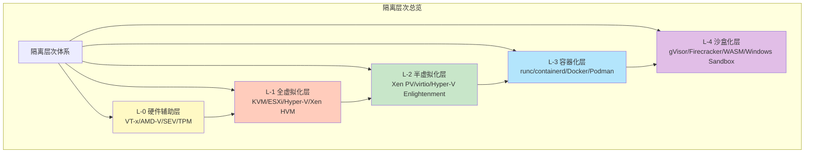

# 隔离层次全面对比分析

## 📑 目录

- [📑 目录](#-目录)
- [30.20.1 隔离层次思维导图](#30201-隔离层次思维导图)
- [30.20.2 多维度对比矩阵](#30202-多维度对比矩阵)
  - [核心属性对比矩阵](#核心属性对比矩阵)
  - [技术实现对比矩阵](#技术实现对比矩阵)
- [30.20.3 技术选型对比](#30203-技术选型对比)
  - [性能维度选型](#性能维度选型)
  - [安全维度选型](#安全维度选型)
  - [成本维度选型](#成本维度选型)
- [30.20.4 应用场景对比](#30204-应用场景对比)
  - [边缘计算场景](#边缘计算场景)
  - [微服务场景](#微服务场景)
  - [Serverless 场景](#serverless-场景)

---

**最后更新**: 2025-11-06 **维护者**: 项目团队

> 📋 **主文档链
> 接**：[30.20 隔离层次全面对比分析](../concept-relations-matrix.md#3020-隔离层次全面对比分析)

## 30.20.1 隔离层次思维导图

**四层隔离栈完整思维导图**：

## 30.20.2 多维度对比矩阵

### 核心属性对比矩阵

| 维度           | L-0 硬件辅助   | L-1 全虚拟化   | L-2 半虚拟化   | L-3 容器化     | L-4 沙盒化     |
| -------------- | -------------- | -------------- | -------------- | -------------- | -------------- |
| **隔离强度**   | ⭐⭐⭐⭐⭐ (5) | ⭐⭐⭐⭐⭐ (5) | ⭐⭐⭐⭐ (4)   | ⭐⭐⭐ (3)     | ⭐⭐⭐⭐⭐ (5) |
| **冷启动时间** | N/A            | 5-30s          | 3-10s          | 1-5s           | <10ms          |
| **内存开销**   | N/A            | 128MB+         | 64-128MB       | 10-50MB        | 1-5MB          |
| **CPU 开销**   | <1%            | 5-10%          | 2-5%           | 1-3%           | <1%            |
| **资源利用率** | N/A            | ⭐⭐ (2)       | ⭐⭐⭐ (3)     | ⭐⭐⭐⭐⭐ (5) | ⭐⭐⭐⭐⭐ (5) |
| **部署密度**   | N/A            | 低             | 中             | 高             | 极高           |
| **网络性能**   | N/A            | ⭐⭐⭐ (3)     | ⭐⭐⭐⭐⭐ (5) | ⭐⭐⭐⭐ (4)   | ⭐⭐⭐⭐⭐ (5) |
| **存储性能**   | N/A            | ⭐⭐⭐ (3)     | ⭐⭐⭐⭐ (4)   | ⭐⭐⭐⭐⭐ (5) | ⭐⭐⭐⭐⭐ (5) |
| **兼容性**     | N/A            | ⭐⭐⭐⭐⭐ (5) | ⭐⭐⭐⭐ (4)   | ⭐⭐⭐⭐⭐ (5) | ⭐⭐⭐ (3)     |
| **可移植性**   | N/A            | ⭐⭐⭐⭐ (4)   | ⭐⭐⭐ (3)     | ⭐⭐⭐⭐⭐ (5) | ⭐⭐⭐⭐⭐ (5) |
| **安全合规**   | ⭐⭐⭐⭐⭐ (5) | ⭐⭐⭐⭐⭐ (5) | ⭐⭐⭐⭐ (4)   | ⭐⭐⭐ (3)     | ⭐⭐⭐⭐⭐ (5) |
| **运维复杂度** | ⭐⭐⭐⭐ (4)   | ⭐⭐⭐ (3)     | ⭐⭐⭐ (3)     | ⭐⭐⭐⭐⭐ (5) | ⭐⭐⭐⭐ (4)   |

### 技术实现对比矩阵

| 维度         | L-0 硬件辅助   | L-1 全虚拟化 | L-2 半虚拟化  | L-3 容器化       | L-4 沙盒化             |
| ------------ | -------------- | ------------ | ------------- | ---------------- | ---------------------- |
| **核心技术** | VT-x/AMD-V/SEV | KVM/QEMU     | virtio/Xen PV | namespace/cgroup | syscall 过滤/字节码 VM |
| **隔离机制** | CPU 模式切换   | VMCS/EPT     | grant table   | namespace        | seccomp/WASI           |
| **资源限制** | 硬件特性       | vCPU/vMEM    | 共享内存      | cgroup           | 能力模型               |
| **网络实现** | 硬件直通       | vNIC/TAP     | virtio-net    | veth pair        | 用户态网络栈           |
| **存储实现** | 硬件直通       | vmdk/qcow2   | virtio-blk    | overlayfs        | 虚拟文件系统           |
| **调度机制** | 硬件调度       | vCPU 调度    | 事件通道      | cgroup 调度      | 用户态调度             |

## 30.20.3 技术选型对比

### 性能维度选型

| 性能需求         | 推荐层级     | 理由             |
| ---------------- | ------------ | ---------------- |
| **极致启动速度** | L-4 沙盒化   | <10ms 冷启动     |
| **高资源利用率** | L-3 容器化   | 高密度部署       |
| **高网络性能**   | L-2 半虚拟化 | 近裸机网络性能   |
| **高存储性能**   | L-3 容器化   | 直接访问文件系统 |
| **低 CPU 开销**  | L-4 沙盒化   | <1% CPU 开销     |
| **低内存开销**   | L-4 沙盒化   | 1-5MB 内存占用   |

### 安全维度选型

| 安全需求       | 推荐层级     | 理由                    |
| -------------- | ------------ | ----------------------- |
| **最强隔离**   | L-1/L-4      | 完整隔离或 syscall 过滤 |
| **合规要求**   | L-1 全虚拟化 | 独立内核，完全隔离      |
| **零信任架构** | L-4 沙盒化   | 能力模型，最小权限      |
| **多租户隔离** | L-1 全虚拟化 | 完整 VM 隔离            |
| **供应链安全** | L-4 沙盒化   | 字节码验证，沙盒执行    |

### 成本维度选型

| 成本考虑             | 推荐层级   | 理由                 |
| -------------------- | ---------- | -------------------- |
| **最低基础设施成本** | L-3 容器化 | 高密度部署，资源共享 |
| **最低运维成本**     | L-3 容器化 | 标准化，易于管理     |
| **最低迁移成本**     | L-3 容器化 | 标准化镜像，易于迁移 |
| **最优 TCO**         | L-3 容器化 | 综合成本最优         |

## 30.20.4 应用场景对比

### 边缘计算场景

| 层级    | 适用性 | 典型技术栈       | 优势                     |
| ------- | ------ | ---------------- | ------------------------ |
| **L-1** | ❌     | N/A              | 资源开销过大             |
| **L-2** | ⚠️     | KVM + virtio     | 性能较好，但资源占用仍高 |
| **L-3** | ✅✅   | K3s + containerd | 轻量级，资源高效         |
| **L-4** | ✅✅✅ | K3s + WasmEdge   | 极致轻量，快速启动       |

**推荐方案**：L-4 沙盒化（K3s + WasmEdge）

### 微服务场景

| 层级    | 适用性 | 典型技术栈         | 优势                   |
| ------- | ------ | ------------------ | ---------------------- |
| **L-1** | ⚠️     | K8s + KVM          | 隔离强，但开销大       |
| **L-2** | ⚠️     | K8s + KVM + virtio | 性能好，但密度低       |
| **L-3** | ✅✅✅ | K8s + containerd   | 标准化，高密度，易管理 |
| **L-4** | ✅✅   | K8s + WasmEdge     | 快速启动，资源高效     |

**推荐方案**：L-3 容器化（K8s + containerd）或 L-4 沙盒化（K8s + WasmEdge）

### Serverless 场景

| 层级    | 适用性 | 典型技术栈           | 优势                   |
| ------- | ------ | -------------------- | ---------------------- |
| **L-1** | ❌     | N/A                  | 启动太慢               |
| **L-2** | ❌     | N/A                  | 启动慢                 |
| **L-3** | ✅     | Knative + containerd | 可接受，但启动仍有延迟 |
| **L-4** | ✅✅✅ | Knative + WasmEdge   | 极致快速启动，资源高效 |

**推荐方案**：L-4 沙盒化（Knative + WasmEdge）

---

**最后更新**：2025-11-06 **维护者**：项目团队
