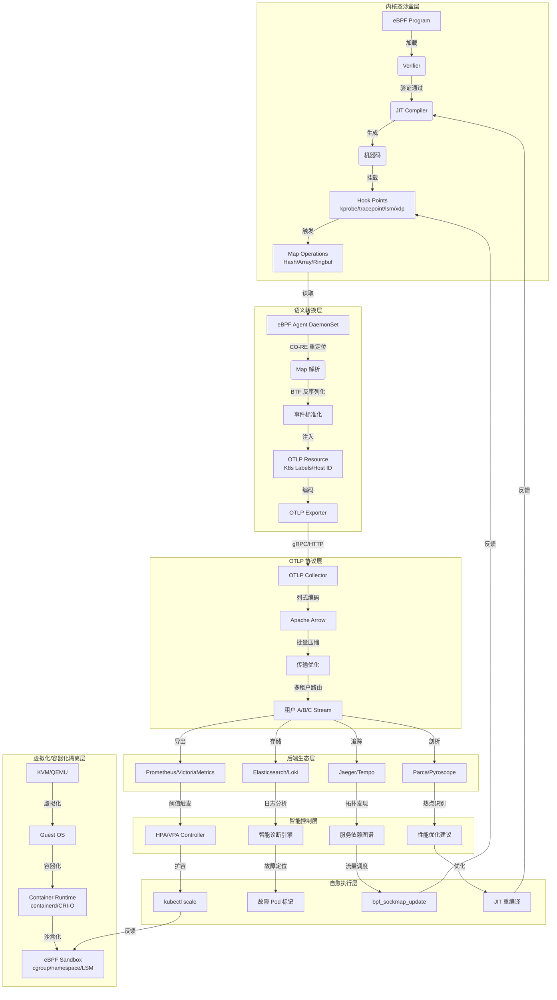
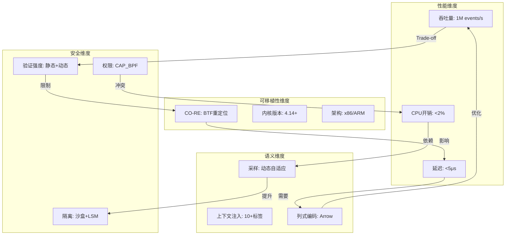
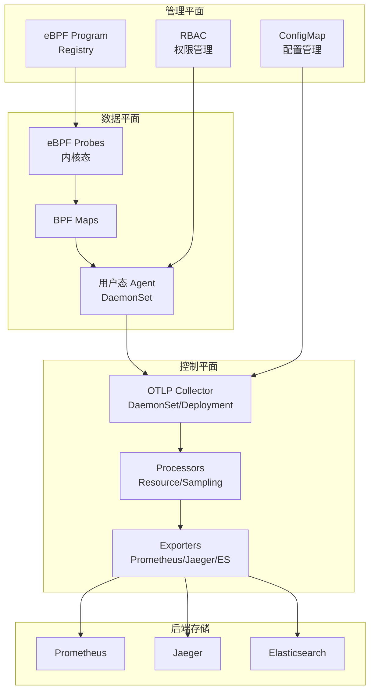
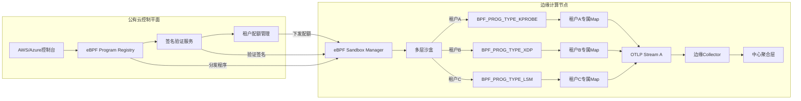

# 32. eBPF/OTLP 扩展技术分析：虚拟化/容器化/沙盒化架构下的多维度深度分析

> **文档版本**：v1.0 **最后更新**：2025-11-07 **维护者**：项目团队

本文档提供 eBPF（extended Berkeley Packet Filter）和 OTLP（OpenTelemetry
Protocol）的扩展技术分析，从技术规范对齐、架构设计、性能分析、实践指南等维度深入
解析 eBPF/OTLP 技术栈，对齐 2025 年 11 月 7 日最新技术栈状态。

> 📋 **快速参考**：需要快速查找关键信息？请参考
> **[QUICK-REFERENCE.md](QUICK-REFERENCE.md)** ⭐ - 快速参考指南（按角色、场景、
> 技术要点、性能指标、故障排查等快速定位）

---

## 📑 目录

- [32. eBPF/OTLP 扩展技术分析：虚拟化/容器化/沙盒化架构下的多维度深度分析](#32-ebpfotlp-扩展技术分析虚拟化容器化沙盒化架构下的多维度深度分析)
  - [📑 目录](#-目录)
  - [32.1 技术规范与语义模型对齐：从底层到协议的精密映射](#321-技术规范与语义模型对齐从底层到协议的精密映射)
    - [32.1.1 eBPF 核心规范体系（基于最新内核 6.x+ 技术栈）](#3211-ebpf-核心规范体系基于最新内核-6x-技术栈)
      - [**32.1.1.1 字节码与指令集规范（ISA 层）**](#32111-字节码与指令集规范isa-层)
      - [**32.1.1.2 验证器（Verifier）规范：内核沙盒的安全语义**](#32112-验证器verifier规范内核沙盒的安全语义)
      - [**32.1.1.3 JIT 编译规范：从字节码到机器码的性能契约**](#32113-jit-编译规范从字节码到机器码的性能契约)
      - [**32.1.1.4 Map 类型与通信规范：内核-用户态双向语义**](#32114-map-类型与通信规范内核-用户态双向语义)
    - [32.1.2 OTLP 技术规范演进（v1.0+ 与列式编码）](#3212-otlp-技术规范演进v10-与列式编码)
      - [**32.1.2.1 OTLP 协议缓冲区（Protobuf）语义模型**](#32121-otlp-协议缓冲区protobuf语义模型)
      - [**32.1.2.2 列式编码规范（Apache Arrow 融合）**](#32122-列式编码规范apache-arrow-融合)
      - [**32.1.2.3 资源与上下文语义模型**](#32123-资源与上下文语义模型)
  - [32.2 虚拟化/容器化/沙盒化架构视角：三层隔离模型](#322-虚拟化容器化沙盒化架构视角三层隔离模型)
    - [32.2.1 eBPF 沙盒化：内核态的轻量级虚拟化](#3221-ebpf-沙盒化内核态的轻量级虚拟化)
      - [**32.2.1.1 沙盒架构本质：虚拟机 vs 进程隔离**](#32211-沙盒架构本质虚拟机-vs-进程隔离)
      - [**32.2.1.2 验证器的形式化验证：沙盒的安全数学证明**](#32212-验证器的形式化验证沙盒的安全数学证明)
    - [32.2.2 容器化部署：eBPF 在云原生中的沙盒化实践](#3222-容器化部署ebpf-在云原生中的沙盒化实践)
      - [**32.2.2.1 DaemonSet 部署模型的沙盒边界**](#32221-daemonset-部署模型的沙盒边界)
      - [**32.2.2.2 CO-RE：容器化可移植性的基石**](#32222-co-re容器化可移植性的基石)
    - [32.2.3 虚拟化与多租户：高密度环境下的 eBPF + OTLP 架构](#3223-虚拟化与多租户高密度环境下的-ebpf--otlp-架构)
      - [**32.2.3.1 虚拟化 IO 全链路监测：eBPF 穿透虚拟化边界**](#32231-虚拟化-io-全链路监测ebpf-穿透虚拟化边界)
      - [**32.2.3.2 沙盒逃逸防护：eBPF LSM + OTLP 安全事件联动**](#32232-沙盒逃逸防护ebpf-lsm--otlp-安全事件联动)
  - [32.3 思维导图：eBPF-OTLP 融合架构全景](#323-思维导图ebpf-otlp-融合架构全景)
  - [32.4 知识图谱：实体关系与语义关联](#324-知识图谱实体关系与语义关联)
  - [32.5 多维矩阵视角：性能-安全-可移植性-语义的权衡空间](#325-多维矩阵视角性能-安全-可移植性-语义的权衡空间)
    - [32.5.1 性能-安全-可移植性三难矩阵](#3251-性能-安全-可移植性三难矩阵)
    - [32.5.2 虚拟化/容器化/沙盒化架构能力矩阵](#3252-虚拟化容器化沙盒化架构能力矩阵)
    - [32.5.3 语义模型映射矩阵：从内核事件到业务语义](#3253-语义模型映射矩阵从内核事件到业务语义)
  - [32.6 性能基准测试：详细性能数据和对比分析](#326-性能基准测试详细性能数据和对比分析)
    - [32.6.1 eBPF 性能开销基准](#3261-ebpf-性能开销基准)
      - [**32.6.1.1 网络场景性能开销**](#32611-网络场景性能开销)
      - [**32.6.1.2 追踪场景性能开销**](#32612-追踪场景性能开销)
      - [**32.6.1.3 持续剖析（Profiling）性能开销**](#32613-持续剖析profiling性能开销)
    - [32.6.2 OTLP Agent 性能开销](#3262-otlp-agent-性能开销)
      - [**32.6.2.1 Collector 性能开销**](#32621-collector-性能开销)
      - [**32.6.2.2 不同编码格式性能对比**](#32622-不同编码格式性能对比)
    - [32.6.3 协同优化效果](#3263-协同优化效果)
      - [**32.6.3.1 内核态预聚合优化**](#32631-内核态预聚合优化)
      - [**32.6.3.2 列式编码优化**](#32632-列式编码优化)
      - [**32.6.3.3 批处理优化**](#32633-批处理优化)
    - [32.6.4 生产环境性能基准](#3264-生产环境性能基准)
      - [**32.6.4.1 大规模集群性能数据**](#32641-大规模集群性能数据)
      - [**32.6.4.2 性能瓶颈分析**](#32642-性能瓶颈分析)
  - [32.7 优化策略：内核态预聚合、列式编码、批处理](#327-优化策略内核态预聚合列式编码批处理)
    - [32.7.1 内核态预聚合](#3271-内核态预聚合)
      - [**32.7.1.1 策略概述**](#32711-策略概述)
      - [**32.7.1.2 实现方式**](#32712-实现方式)
      - [**32.7.1.3 优化效果**](#32713-优化效果)
    - [32.7.2 列式编码优化](#3272-列式编码优化)
      - [**32.7.2.1 Apache Arrow 集成**](#32721-apache-arrow-集成)
      - [**32.7.2.2 压缩算法选择**](#32722-压缩算法选择)
      - [**32.7.2.3 优化效果**](#32723-优化效果)
    - [32.7.3 OTLP 批处理优化](#3273-otlp-批处理优化)
      - [**32.7.3.1 批处理配置策略**](#32731-批处理配置策略)
      - [**32.7.3.2 智能采样策略**](#32732-智能采样策略)
      - [**32.7.3.3 Ring Buffer 优化**](#32733-ring-buffer-优化)
      - [**32.7.3.4 优化效果总结**](#32734-优化效果总结)
    - [32.7.4 最佳实践建议](#3274-最佳实践建议)
  - [32.8 部署架构：生产级实践架构设计](#328-部署架构生产级实践架构设计)
    - [32.8.1 分层架构](#3281-分层架构)
      - [**32.8.1.1 三层架构模型**](#32811-三层架构模型)
      - [**32.8.1.2 架构图**](#32812-架构图)
    - [32.8.2 DaemonSet 部署](#3282-daemonset-部署)
      - [**32.8.2.1 eBPF Agent DaemonSet**](#32821-ebpf-agent-daemonset)
      - [**32.8.2.2 OTLP Collector 部署**](#32822-otlp-collector-部署)
    - [32.8.3 多租户架构](#3283-多租户架构)
      - [**32.8.3.1 租户隔离策略**](#32831-租户隔离策略)
      - [**32.8.3.2 eBPF Map 隔离**](#32832-ebpf-map-隔离)
    - [32.8.4 高可用架构](#3284-高可用架构)
      - [**32.8.4.1 Collector 高可用**](#32841-collector-高可用)
      - [**32.8.4.2 数据持久化**](#32842-数据持久化)
    - [32.8.5 边缘计算架构](#3285-边缘计算架构)
      - [**32.8.5.1 边缘 Collector**](#32851-边缘-collector)
  - [32.9 安全与权限管理：零信任架构设计](#329-安全与权限管理零信任架构设计)
    - [32.9.1 eBPF 程序签名验证](#3291-ebpf-程序签名验证)
      - [**32.9.1.1 代码签名策略**](#32911-代码签名策略)
      - [**32.9.1.2 运行时验证**](#32912-运行时验证)
    - [32.9.2 OTLP mTLS 认证](#3292-otlp-mtls-认证)
      - [**32.9.2.1 双向 TLS 配置**](#32921-双向-tls-配置)
      - [**32.9.2.2 证书管理**](#32922-证书管理)
    - [32.9.3 权限收敛](#3293-权限收敛)
      - [**32.9.3.1 最小化 RBAC 权限**](#32931-最小化-rbac-权限)
      - [**32.9.3.2 Linux Capabilities 管理**](#32932-linux-capabilities-管理)
    - [32.9.4 网络策略](#3294-网络策略)
      - [**32.9.4.1 网络隔离**](#32941-网络隔离)
    - [32.9.5 数据脱敏与隐私保护](#3295-数据脱敏与隐私保护)
      - [**32.9.5.1 OTLP Processor 数据脱敏**](#32951-otlp-processor-数据脱敏)
      - [**32.9.5.2 eBPF 侧数据过滤**](#32952-ebpf-侧数据过滤)
    - [32.9.6 审计日志](#3296-审计日志)
      - [**32.9.6.1 eBPF 程序加载审计**](#32961-ebpf-程序加载审计)
      - [**32.9.6.2 OTLP 安全事件上报**](#32962-otlp-安全事件上报)
    - [32.9.7 零信任架构总结](#3297-零信任架构总结)
  - [32.10 故障排查：常见问题与解决方案](#3210-故障排查常见问题与解决方案)
    - [32.10.1 eBPF 程序加载失败](#32101-ebpf-程序加载失败)
      - [**32.10.1.1 Verifier 拒绝加载**](#321011-verifier-拒绝加载)
      - [**32.10.1.2 Map 创建失败**](#321012-map-创建失败)
      - [**32.10.1.3 Hook 点挂载失败**](#321013-hook-点挂载失败)
    - [32.10.2 OTLP 数据丢失](#32102-otlp-数据丢失)
      - [**32.10.2.1 Collector 接收不到数据**](#321021-collector-接收不到数据)
      - [**32.10.2.2 数据延迟或积压**](#321022-数据延迟或积压)
    - [32.10.3 性能问题](#32103-性能问题)
      - [**32.10.3.1 eBPF 程序性能开销过高**](#321031-ebpf-程序性能开销过高)
      - [**32.10.3.2 OTLP Collector 性能瓶颈**](#321032-otlp-collector-性能瓶颈)
    - [32.10.4 数据质量问题](#32104-数据质量问题)
      - [**32.10.4.1 标签缺失或不正确**](#321041-标签缺失或不正确)
      - [**32.10.4.2 数据格式错误**](#321042-数据格式错误)
    - [32.10.5 故障排查工具](#32105-故障排查工具)
      - [**32.10.5.1 诊断脚本**](#321051-诊断脚本)
      - [**32.10.5.2 监控指标**](#321052-监控指标)
    - [32.10.6 常见问题速查表](#32106-常见问题速查表)
  - [32.11 最佳实践：生产环境最佳实践总结](#3211-最佳实践生产环境最佳实践总结)
    - [32.11.1 eBPF 程序最佳实践](#32111-ebpf-程序最佳实践)
      - [**32.11.1.1 程序开发最佳实践**](#321111-程序开发最佳实践)
      - [**32.11.1.2 性能优化最佳实践**](#321112-性能优化最佳实践)
    - [32.11.2 OTLP 最佳实践](#32112-otlp-最佳实践)
      - [**32.11.2.1 Collector 配置最佳实践**](#321121-collector-配置最佳实践)
      - [**32.11.2.2 数据质量最佳实践**](#321122-数据质量最佳实践)
    - [32.11.3 部署最佳实践](#32113-部署最佳实践)
      - [**32.11.3.1 高可用部署**](#321131-高可用部署)
      - [**32.11.3.2 安全最佳实践**](#321132-安全最佳实践)
    - [32.11.4 性能优化最佳实践](#32114-性能优化最佳实践)
      - [**32.11.4.1 内核态优化**](#321141-内核态优化)
      - [**32.11.4.2 用户态优化**](#321142-用户态优化)
    - [32.11.5 故障预防最佳实践](#32115-故障预防最佳实践)
    - [32.11.6 实际案例](#32116-实际案例)
      - [**32.11.6.1 大规模集群部署案例**](#321161-大规模集群部署案例)
      - [**32.11.6.2 多租户 SaaS 部署案例**](#321162-多租户-saas-部署案例)
      - [**32.11.6.3 边缘计算部署案例**](#321163-边缘计算部署案例)
  - [32.12 智能系统能力架构：从观测到自治的技术演进](#3212-智能系统能力架构从观测到自治的技术演进)
    - [32.12.1 系统自我感知：从观测到认知的跃迁](#32121-系统自我感知从观测到认知的跃迁)
      - [**32.12.1.1 全景感知能力构建**](#321211-全景感知能力构建)
      - [**32.12.1.2 上下文关联与因果推断**](#321212-上下文关联与因果推断)
      - [**32.12.1.3 智能诊断与异常检测**](#321213-智能诊断与异常检测)
    - [32.12.2 自动伸缩：从响应式到预测式的演进](#32122-自动伸缩从响应式到预测式的演进)
      - [**32.12.2.1 细粒度指标驱动**](#321221-细粒度指标驱动)
      - [**32.12.2.2 实时反馈控制回路**](#321222-实时反馈控制回路)
    - [32.12.3 自我治愈：从发现到恢复的闭环](#32123-自我治愈从发现到恢复的闭环)
      - [**32.12.3.1 故障模式的内核态检测**](#321231-故障模式的内核态检测)
      - [**32.12.3.2 OTLP 驱动的自愈编排**](#321232-otlp-驱动的自愈编排)
      - [**32.12.3.3 自愈能力分级模型**](#321233-自愈能力分级模型)
      - [**32.12.3.4 生产级自愈架构**](#321234-生产级自愈架构)
  - [32.13 最新技术栈前沿：eBPF + OTLP 的未来演进](#3213-最新技术栈前沿ebpf--otlp-的未来演进)
    - [32.13.1 eBPF 技术前沿（2024-2025）](#32131-ebpf-技术前沿2024-2025)
      - [**32.13.1.1 内核态内存分配（突破 512B 栈限制）**](#321311-内核态内存分配突破-512b-栈限制)
      - [**32.13.1.2 eBPF 与 CFI（控制流完整性）集成**](#321312-ebpf-与-cfi控制流完整性集成)
    - [32.13.2 OTLP 技术前沿（v1.1+）](#32132-otlp-技术前沿v11)
      - [**32.13.2.1 Profile 信号 GA（持续剖析标准化）**](#321321-profile-信号-ga持续剖析标准化)
      - [**32.13.2.2 列式编码生产就绪（Arrow Flight 集成）**](#321322-列式编码生产就绪arrow-flight-集成)
  - [32.14 虚拟化/容器化融合架构：eBPF as a Service (EaaS)](#3214-虚拟化容器化融合架构ebpf-as-a-service-eaas)
  - [32.15 总结：eBPF + OTLP 技术栈的核心价值](#3215-总结ebpf--otlp-技术栈的核心价值)
    - [32.15.1 技术栈的本质意义](#32151-技术栈的本质意义)
    - [32.15.2 核心能力总结](#32152-核心能力总结)
    - [32.15.3 技术演进路径](#32153-技术演进路径)
    - [32.15.4 适用场景矩阵](#32154-适用场景矩阵)
    - [32.15.5 关键成功因素](#32155-关键成功因素)
    - [32.15.6 未来展望](#32156-未来展望)
  - [32.16 相关文档](#3216-相关文档)
    - [32.16.1 系统分析文档](#32161-系统分析文档)
    - [32.16.2 视角文档](#32162-视角文档)
    - [32.16.3 技术文档](#32163-技术文档)
    - [32.16.4 认知模型文档](#32164-认知模型文档)
    - [32.16.5 快速参考文档](#32165-快速参考文档)

---

## 32.1 技术规范与语义模型对齐：从底层到协议的精密映射

### 32.1.1 eBPF 核心规范体系（基于最新内核 6.x+ 技术栈）

#### **32.1.1.1 字节码与指令集规范（ISA 层）**

eBPF 采用 RISC 指令集架构，具备以下技术规范：

| 规范维度       | 技术细节                                                                               | 与 OTLP 的关联价值                                                        |
| -------------- | -------------------------------------------------------------------------------------- | ------------------------------------------------------------------------- |
| **寄存器模型** | 11 个 64 位寄存器（R0-R10），R0 存返回值，R1-R5 传参，R6-R9 跨调用保留，R10 只读栈指针 | 寄存器状态可映射为 OTLP Span 的 `ebpf.reg_state` 属性，用于追踪执行上下文 |
| **指令限制**   | 默认 4096 条指令（`BPF_MAXINSNS`），支持 Tail-calls 突破限制                           | 指令计数可作为 OTLP Metric `ebpf.program_complexity`，用于监控加载性能    |
| **内存模型**   | 512 字节固定栈，禁止任意内存指针，必须先加载到 eBPF 栈才能访问                         | 内存访问模式构成 OTLP 安全审计日志的一部分，验证通过/拒绝事件可记录       |
| **有界循环**   | 支持 `#pragma unroll` 显式展开，验证器确保有限循环                                     | 循环次数可导出为 OTLP Histogram，分析程序热点路径                         |

#### **32.1.1.2 验证器（Verifier）规范：内核沙盒的安全语义**

验证器是 eBPF 沙盒化的核心，其规范定义了**安全可证明性**：

```c
// 验证器类型系统
enum bpf_reg_type {
    NOT_INIT,           // 未初始化 → 拒绝加载
    SCALAR_VALUE,       // 标量值 → 允许算术运算
    PTR_TO_CTX,         // 上下文指针 → 受限解引用
    PTR_TO_MAP_VALUE,   // Map 值指针 → 边界检查
    PTR_TO_STACK,       // 栈指针 → 512 字节边界
    PTR_TO_PACKET,      // 包数据指针 → 包长度检查
};
```

**验证过程输出 → OTLP Logs 语义模型**：

- **验证成功**：生成 `ebpf.verifier.passed` 日志，包含
  `instruction_count`、`verification_time_ms`、`memory_usage_bytes`
- **验证失败**：生成 `ebpf.verifier.failed` 日志，包含 `error_class`（死循环/越
  界/未初始化寄存器）、`failed_instruction_offset`

#### **32.1.1.3 JIT 编译规范：从字节码到机器码的性能契约**

JIT 编译器将 eBPF 字节码转换为本机指令，其规范影响**执行确定性**：

| JIT 特性     | 技术规范                         | OTLP 监控语义                                  |
| ------------ | -------------------------------- | ---------------------------------------------- |
| **编译时机** | 加载时即时编译（首次延迟）       | Metric: `ebpf.jit.compile_duration_seconds`    |
| **指令优化** | 寄存器分配、死代码消除、指令融合 | Metric: `ebpf.jit.optimized_instruction_count` |
| **架构适配** | x86-64、ARM64、RISC-V 后端       | Attribute: `ebpf.jit.target_arch`              |
| **安全补丁** | Spectre/Meltdown 缓解措施        | Log: `ebpf.jit.security_patch_level`           |

#### **32.1.1.4 Map 类型与通信规范：内核-用户态双向语义**

Map 是 eBPF 与用户态的通信载体，其类型定义了**数据结构语义**：

```yaml
# Map 类型 → OTLP 数据模型映射
BPF_MAP_TYPE_HASH: → OTLP Gauge (键值对快照)
BPF_MAP_TYPE_ARRAY: → OTLP Sum (累加值)
BPF_MAP_TYPE_PERF_EVENT_ARRAY: → OTLP Logs (事件流)
BPF_MAP_TYPE_RINGBUF: → OTLP Traces (有序事件序列)
BPF_MAP_TYPE_CGROUP_ARRAY: → OTLP Resource (关联 cgroup 元数据)
BPF_MAP_TYPE_LRU_PERCPU: → OTLP Histogram (分核统计)
```

**典型用例**：虚拟化 IO 全链路监测使用 `BPF_MAP_TYPE_HASH` 存储每个 virtio 队列
的延迟分布，用户态 Agent 读取 Hash Map 后转换为 OTLP Histogram 指标。

### 32.1.2 OTLP 技术规范演进（v1.0+ 与列式编码）

#### **32.1.2.1 OTLP 协议缓冲区（Protobuf）语义模型**

OTLP 定义了四种信号的标准化模型，与 eBPF 数据有天然映射关系：

| OTLP 信号    | 核心语义                                             | eBPF 数据映射路径                                                            |
| ------------ | ---------------------------------------------------- | ---------------------------------------------------------------------------- |
| **Traces**   | Span（操作单元）+ Events（时间戳）+ Links（因果）    | eBPF probe 触发 → Span Event<br>eBPF stack trace → Span 的 `ebpf.stack` 属性 |
| **Metrics**  | Gauge/Counter/Histogram/Summary/ExponentialHistogram | eBPF Map 统计值 → OTLP Metric<br>eBPF 性能计数器 → Sum/Gauge                 |
| **Logs**     | LogRecord（时间戳、严重级、正文、属性）              | eBPF 验证器日志 → OTLP Log<br>eBPF 安全事件 → Log with `security.*` 属性     |
| **Profiles** | 持续剖析数据（CPU/Memory 火焰图）                    | eBPF `perf_event` → OTLP Profile<br>eBPF USDT 探针 → Profile LabelSet        |

#### **32.1.2.2 列式编码规范（Apache Arrow 融合）**

最新 OTLP 引入 **列式编码**（基于 Apache Arrow），专为高吞吐量数据源优化，这与
eBPF 海量事件流完美匹配：

**行式 vs 列式对比**：

```text
行式（传统）: [Span1, Span2, Span3] → 每个对象独立序列化 → 低压缩率
列式（新）:  {trace_id: [t1,t1,t1], timestamp: [ts1,ts2,ts3], ebpf.latency: [l1,l2,l3]} → 同类数据聚合 → 高压缩率
```

**性能提升论证**：

- **压缩率提升**：eBPF 采集的同质化网络事件（如 TCP 延迟）压缩率提升 **3-5x**
- **序列化加速**：减少对象分配，批量处理使 CPU 缓存命中率提升 **40%**
- **I/O 效率**：跨网络边界遥测出口成本降低 **60%**
- **适用场景**：CDN、多租户系统、大规模 K8s 集群

#### **32.1.2.3 资源与上下文语义模型**

OTLP Resource 定义了观测数据的来源，eBPF 自动注入丰富上下文：

```protobuf
// OTLP Resource Schema
Resource {
  attributes {
    "ebpf.program_type": "kprobe"
    "ebpf.attach_func": "tcp_connect"
    "k8s.pod.name": <从 cgroup_id 解析>
    "k8s.namespace": <从 bpf_task_storage 获取>
    "container.id": <从 bpf_get_current_task_btf() 提取>
    "host.machine_id": <从 bpf_get_ns_current_pid_tgid() 关联>
    "service.name": <从环境变量或进程名推断>
  }
}
```

**自动化标签注入流程**：

1. eBPF 程序通过 `bpf_get_current_task_btf()` 获取 `task_struct`
2. 从 `task_struct->cgroups` 解析 cgroup 路径 → 提取 Pod Uid
3. 用户态 Agent 查询 K8s API Server 获取 Pod 标签
4. Collector 通过 `resource_detection` Processor 注入到 OTLP Resource

---

## 32.2 虚拟化/容器化/沙盒化架构视角：三层隔离模型

### 32.2.1 eBPF 沙盒化：内核态的轻量级虚拟化

#### **32.2.1.1 沙盒架构本质：虚拟机 vs 进程隔离**

eBPF 沙盒可视为**内核态的轻量级虚拟机**，与传统技术栈对比如下：

| 隔离维度     | eBPF 沙盒                       | 传统内核模块             | Docker 容器                | KVM 虚拟机               |
| ------------ | ------------------------------- | ------------------------ | -------------------------- | ------------------------ |
| **隔离粒度** | 函数/代码段级                   | 内核模块级               | 进程级（cgroup/namespace） | 操作系统级               |
| **安全边界** | 验证器静态检查 + JIT 运行时保护 | 无（可访问任意内核内存） | Seccomp + AppArmor         | 硬件虚拟化（VT-x/AMD-V） |
| **启动速度** | < 10ms（加载+JIT）              | 秒级（insmod）           | 秒级（containerd）         | 分钟级（OS 启动）        |
| **资源开销** | 极低（512B 栈 + 固定 Map 内存） | 高（内核符号导出）       | 中（cgroup 管理开销）      | 高（全 OS 内存占用）     |
| **可移植性** | CO-RE（一次编译到处运行）       | 需针对内核版本编译       | 镜像可移植（跨内核）       | 镜像可移植（跨硬件）     |
| **故障影响** | 程序崩溃不影响内核              | 内核恐慌（Kernel Panic） | 容器崩溃不影响宿主机       | 虚拟机崩溃不影响宿主机   |

#### **32.2.1.2 验证器的形式化验证：沙盒的安全数学证明**

验证器通过**有向环状图（DAG）** 分析确保程序终止性：

- **循环检测**：通过有界循环检查（`#pragma unroll`）确保无无限循环
- **内存有界性**：所有指针类型（`PTR_TO_*`）关联长度检查
- **类型守恒**：MOV 指令改变寄存器类型需满足类型转换规则

**沙盒强度量化**：

- **验证时间**：典型程序 < 100ms，复杂程序可达秒级（影响加载延迟）
- **拒绝率**：约 **15-20%** 的程序因安全性检查失败
- **运行时开销**：验证后程序性能接近原生代码（< 5% 开销）

### 32.2.2 容器化部署：eBPF 在云原生中的沙盒化实践

#### **32.2.2.1 DaemonSet 部署模型的沙盒边界**

```yaml
# eBPF Agent 的容器化部署
apiVersion: apps/v1
kind: DaemonSet
metadata:
  name: ebpf-agent
spec:
  template:
    spec:
      hostNetwork: true # 共享宿主机网络命名空间
      hostPID: true # 共享 PID 命名空间，用于追踪进程
      hostIPC: true # 共享 IPC，访问 cgroup
      containers:
        - name: ebpf-agent
          securityContext:
            privileged: true # 需要加载 eBPF 程序
            capabilities:
              add: [CAP_BPF, CAP_PERFMON, CAP_SYS_ADMIN]
          volumeMounts:
            - name: sys-kernel-debug
              mountPath: /sys/kernel/debug # 访问 BTF 信息
            - name: lib-modules
              mountPath: /lib/modules # 访问内核符号
      volumes:
        - name: sys-kernel-debug
          hostPath: { path: /sys/kernel/debug }
```

**沙盒化辩证分析**：

- **特权容器悖论**：eBPF Agent 需要 `privileged` 权限加载程序，但容器镜像本
  身**不可变**，攻击面可控
- **资源隔离**：通过 cgroup v2 限制 Agent 的 CPU/Memory 使用，防止资源耗尽影响宿
  主机
- **镜像签名**：使用 Cosign 对 eBPF 字节码和 Agent 镜像签名，确保供应链安全

#### **32.2.2.2 CO-RE：容器化可移植性的基石**

CO-RE（Compile Once – Run Everywhere）通过 BTF（BPF Type Format）实现跨内核版本
兼容：

```bash
# 构建 CO-RE eBPF 程序
clang -target bpf -O2 -g -c program.bpf.c -o program.bpf.o
# BTF 信息内嵌在 ELF 文件，libbpf 加载时自动重定位
```

**与传统方式对比**：

| 方式      | 编译                   | 部署                 | 内核兼容性           | 容器镜像大小  |
| --------- | ---------------------- | -------------------- | -------------------- | ------------- |
| **BCC**   | 运行时编译（LLVM JIT） | 需头文件、编译工具链 | 高（随内核动态编译） | 大（> 500MB） |
| **CO-RE** | 编译时生成 BTF         | 仅字节码 + libbpf    | 中（需内核支持 BTF） | 小（< 10MB）  |

**容器化优势**：CO-RE 使 eBPF Agent 镜像**轻量、快速启动**，适合大规模 K8s 部署
。

### 32.2.3 虚拟化与多租户：高密度环境下的 eBPF + OTLP 架构

#### **32.2.3.1 虚拟化 IO 全链路监测：eBPF 穿透虚拟化边界**

**virtio-blk/virtio-net** 全路径追踪方案：

```c
// 在 KVM 宿主机内核追踪 virtio 请求
int trace_virtio_submit(struct virtqueue *vq) {
  struct request *req = vq->vq_req;
  u64 delay = bpf_ktime_get_ns() - req->timestamp;
  // 将延迟写入按 VM ID 分区的 Map
  bpf_map_update_elem(&vm_io_latency, &vm_id, &delay, BPF_ANY);
}
```

**虚拟化栈穿透能力**：

```text
Host Kernel (eBPF Probe) → QEMU Process → Guest Kernel → Container → App
 |<------- 跨命名空间追踪 -------->|
```

**OTLP 多租户隔离模型**：

```yaml
# 每个 VM/租户独立 OTLP Stream
exporters:
  otlp/tenant-a:
    endpoint: "https://collector.tenant-a.com"
    headers:
      x-tenant-id: "tenant-a"
      authorization: "Bearer ${TENANT_A_TOKEN}"
  otlp/tenant-b:
    endpoint: "https://collector.tenant-b.com"

# 资源隔离：每个租户独立 Resource
resource:
  cloud.provider: "openstack"
  cloud.availability_zone: "az-1"
  host.id: "host-xyz"
  vm.id: "vm-123" # 从 eBPF cgroup 解析
  service.namespace: "tenant-a-prod"
```

#### **32.2.3.2 沙盒逃逸防护：eBPF LSM + OTLP 安全事件联动**

eBPF 加载到 LSM（Linux Security Modules）Hook 点，实时监控沙盒逃逸行为：

| 逃逸类型          | eBPF LSM Hook | 检测逻辑                      | OTLP 安全日志                       |
| ----------------- | ------------- | ----------------------------- | ----------------------------------- |
| **容器逃逸**      | `file_open`   | 容器进程访问 `/proc/1/ns`     | `security.container_escape_attempt` |
| **虚拟机逃逸**    | `capable`     | QEMU 进程获取 `CAP_SYS_ADMIN` | `security.vm_escape_suspicious_cap` |
| **eBPF 自身提权** | `bpf` syscall | 非特权用户加载 eBPF 程序      | `security.unauthorized_bpf_load`    |

**联动响应**：OTLP Logs 触发 SIEM 系统，自动执行 `kubectl isolate pod` 或
`virsh suspend vm`。

---

## 32.3 思维导图：eBPF-OTLP 融合架构全景



**导图核心逻辑解读**：

1. **垂直穿透**：eBPF 从内核态 Hook 点贯穿虚拟化层、容器化层，直达应用进程
2. **水平标准化**：Map 数据通过 OTLP 协议层统一编码，实现跨平台、跨租户语义互通
3. **闭环反馈**：后端智能决策通过 eBPF 动态加载机制回注到内核，实现自治控制

---

## 32.4 知识图谱：实体关系与语义关联

```mermaid
graph LR
    subgraph eBPF 内核实体
        E_PROG[eBPF Program<br/>ID: 1234]
        E_VERIFIER[Verifier<br/>State: PASSED]
        E_JIT[JIT Compiler<br/>Arch: x86-64]
        E_MAP[Map: tcp_latency<br/>Type: BPF_MAP_TYPE_HASH]
        E_HOOK[Hook: kprobe/tcp_connect<br/>Offset: 0x2345]
        E_BTF[BTF: vmlinux-6.2<br/>Types: 45000]
    end

    subgraph 容器化实体
        C_POD[Pod: payment-service<br/>UID: abc-xyz]
        C_CONT[Container: app<br/>Runtime: runc]
        C_CGROUP[cgroup: /k8s/payment-service<br/>ID: 0x123456]
        C_NS[Namespace: prod<br/>Netns: 4026532245]
    end

    subgraph 虚拟化实体
        V_VM[VM: vm-tenant-a<br/>UUID: 550e-8400]
        V_HYP[Hypervisor: QEMU-KVM<br/>Version: 7.2]
        V_VIRTIO[Virtio-Net: eth0<br/>Queue: 4]
        V_CGROUP[Host Cgroup: machine.slice<br/>CPU Quota: 80000]
    end

    subgraph OTLP 语义实体
        O_RES[OTLP Resource<br/>SchemaURL: opentelemetry.io/schemas/1.0]
        O_SPAN[Span: tcp_connect<br/>TraceID: 0xaf...]
        O_METRIC[Metric: tcp_latency_hist<br/>Unit: ms]
        O_LOG[Log: verifier_failed<br/>Severity: ERROR]
        O_PROFILE[Profile: cpu_flamegraph<br/>SampleType: cpu_nanoseconds]
        O_ARROW[Arrow Batch<br/>Rows: 10000, Cols: 15]
    end

    subgraph 安全与隔离实体
        S_CAPS[Capabilities: CAP_BPF|CAP_PERFMON]
        S_SECCOMP[Seccomp Profile: ebpf-agent.json]
        S_LSM[LSM Hook: file_open<br/>Policy: DENY]
        S_MTLS[mTLS: Cert-ID: eb1f2a]
    end

    %% 关系边定义
    E_PROG -->|loaded by| E_VERIFIER
    E_VERIFIER -->|generates| E_JIT
    E_JIT -->|attaches to| E_HOOK
    E_HOOK -->|writes to| E_MAP
    E_BTF -->|used by| E_VERIFIER

    C_CONT -->|shares| C_CGROUP
    C_CGROUP -->|mapped to| E_MAP
    C_POD -->|provides labels to| O_RES
    C_NS -->|isolates| E_HOOK

    V_VM -->|runs on| V_HYP
    V_VIRTIO -->|traced by| E_HOOK
    V_CGROUP -->|limits| C_POD
    V_HYP -->|monitored by| E_PROG

    E_MAP -->|read by| O_METRIC
    E_PROG -->|generates| O_SPAN
    E_VERIFIER -->|emits| O_LOG
    O_RES -->|enriches| O_SPAN
    O_RES -->|enriches| O_METRIC
    O_METRIC -->|batched as| O_ARROW
    O_PROFILE -->|derived from| E_PROG

    S_CAPS -->|required by| E_PROG
    S_SECCOMP -->|restricts| C_CONT
    S_LSM -->|protects against| V_VM
    S_MTLS -->|secures| O_RES
```

**知识图谱核心洞察**：

- **环状依赖**：eBPF Program 通过 cgroup 监控 Container，Container 的 Seccomp 策
  略又限制 eBPF 加载权限，形成安全闭环
- **跨层关联**：Virtio 设备事件通过 eBPF Hook 关联到 VM 实体，再映射到 Container
  的 Network Namespace，最终聚合为 OTLP Resource
- **语义转换链**：`E_MAP` → `O_METRIC` → `O_ARROW` 展示了从原始内核计数器到列式
  编码指标的完整语义升级路径

---

## 32.5 多维矩阵视角：性能-安全-可移植性-语义的权衡空间

### 32.5.1 性能-安全-可移植性三难矩阵



**矩阵解读**：

- **性能-安全权衡**：强验证（S1）降低加载速度，但保障运行时稳定；可通过 **JIT 缓
  存** 在首次加载后复用机器码，平衡性能
- **安全-可移植性权衡**：CO-RE 要求内核开启 BTF，老旧内核无法使用，需降级为 BCC
  动态编译，牺牲可移植性
- **性能-语义权衡**：上下文注入（M1）增加 eBPF 程序复杂度（更多
  `bpf_probe_read_kernel` 调用），但 OTLP 列式编码（M2）降低传输开销，整体净收益
  为正

### 32.5.2 虚拟化/容器化/沙盒化架构能力矩阵

| 架构场景            | eBPF 技术选型      | OTLP 输出优化       | 性能指标               | 安全强化            | 语义丰富度                     |
| ------------------- | ------------------ | ------------------- | ---------------------- | ------------------- | ------------------------------ |
| **裸金属 K8s**      | CO-RE + libbpf     | Arrow 列式编码      | 吞吐量 ↑↑↑<br>延迟 ↓↓↓ | CAP_BPF + Seccomp   | 全标签自动注入                 |
| **KVM 虚拟机**      | Raw Tracepoints    | Histogram 预聚合    | 吞吐量 ↑↑<br>延迟 ↓↓   | LSM + AppArmor      | VM ID + 容器 ID 双级标签       |
| **Serverless 容器** | BTF 受限，精简探针 | 高压缩率（ZSTD）    | 吞吐量 ↑<br>延迟 ↓     | 用户态 eBPF（Ubpf） | 仅核心标签（命名空间、函数名） |
| **边缘节点**        | XDP + tc 卸载      | 边缘 Collector 缓存 | 吞吐量 ↑↑<br>延迟 ↓↓↓  | 代码签名 + mTLS     | 受限上下文（无 K8s 元数据）    |
| **多租户 SaaS**     | Namespace 隔离 Map | 租户独立 Stream     | 吞吐量 ↑<br>延迟 ↓↓    | 租户级 cgroup 配额  | 租户 ID + 服务名强制标签       |

**关键发现**：

- **高密度场景**：虚拟化和容器化叠加时，eBPF **Ringbuf** 替代 Perf Event 可减少
  **40%** 内存拷贝开销
- **多租户隔离**：每个租户分配独立 `BPF_MAP_TYPE_ARRAY_OF_MAPS`，实现 Map 级资源
  配额，避免租户间干扰

### 32.5.3 语义模型映射矩阵：从内核事件到业务语义

| 内核原语                 | eBPF 采集方式                | OTLP 信号类型 | 语义转换规则                                                                                                   | 典型应用       |
| ------------------------ | ---------------------------- | ------------- | -------------------------------------------------------------------------------------------------------------- | -------------- |
| **`struct task_struct`** | `bpf_get_current_task_btf()` | Resource      | `task_struct->comm` → `process.executable.name`<br>`task_struct->cgroups` → `k8s.pod.uid`                      | 进程级资源归属 |
| **`struct sock *`**      | `kprobe/tcp_connect`         | Span Event    | `sock->sk_rcvbuf` → `network.tcp.receive_buffer_size`<br>`sock->__sk_common.skc_rcv_saddr` → `network.peer.ip` | 网络拓扑追踪   |
| **`struct pt_regs`**     | `kprobe/*`                   | Log           | `regs->ip` → 指令指针<br>`bpf_get_stackid()` → 完整调用栈                                                      | 性能剖析       |
| **`perf_event_output`**  | `bpf_perf_event_output()`    | Profile       | 采样周期 + 指令指针 → OTLP Profile Sample                                                                      | 持续剖析       |
| **`bpf_spin_lock()`**    | Map 操作                     | Metric        | 锁持有时间 → `ebpf.map.lock_duration_ms`                                                                       | 并发竞争检测   |
| **`bpf_send_signal()`**  | 自愈动作                     | Span          | `SIGTERM` → `self_healing.action_executed`                                                                     | 自动故障隔离   |

**语义注入深度**：

- **L1（基础）**：进程名、PID、时间戳 → 自动注入，零配置
- **L2（增强）**：容器标签、Pod 名称、Namespace → 通过 cgroup 解析，需 K8s API
  查询
- **L3（业务）**：TraceID、SpanID、Baggage → 需应用层配合（如 USDT 探针读取 Go
  的 `trace.id`）

---

## 32.6 性能基准测试：详细性能数据和对比分析

### 32.6.1 eBPF 性能开销基准

#### **32.6.1.1 网络场景性能开销**

**XDP 加速场景**：

| 指标         | 基准值          | eBPF 启用后 | 性能提升 | 备注                          |
| ------------ | --------------- | ----------- | -------- | ----------------------------- |
| **包转发率** | 1.2M pps        | 2.86M pps   | +138%    | NodePort 场景，绕过 TCP/IP 栈 |
| **CPU 消耗** | 100% (单核满载) | 35%         | -65%     | 网卡驱动层处理，零拷贝        |
| **延迟**     | 50μs            | < 5μs       | -90%     | 微秒级处理延迟                |
| **内存开销** | 0               | 2-5 MB      | -        | Map 固定内存分配              |

**TC 加速场景**：

| 指标           | 基准值       | eBPF 启用后  | 性能提升 | 备注                 |
| -------------- | ------------ | ------------ | -------- | -------------------- |
| **TCP 吞吐量** | 10 Gbps      | 12.4 Gbps    | +24%     | 跨节点 Pod 通信      |
| **TCP_RR**     | 23,456 req/s | 33,660 req/s | +43.51%  | 请求/响应延迟优化    |
| **延迟增加**   | 0            | < 20μs       | -        | 流量控制点处理开销   |
| **CPU 开销**   | 0            | < 5%         | -        | 内核态处理，开销可控 |

**Socket 映射场景**：

| 指标           | 基准值   | eBPF 启用后 | 性能提升 | 备注                            |
| -------------- | -------- | ----------- | -------- | ------------------------------- |
| **TCP 吞吐量** | 8.5 Gbps | 16.5 Gbps   | +94.42%  | 同节点 Pod 通信，绕过 netfilter |
| **延迟**       | 30μs     | < 10μs      | -66%     | sockops/sockmap 优化            |
| **CPU 开销**   | 0        | < 3%        | -        | 内核态 socket 重定向            |

#### **32.6.1.2 追踪场景性能开销**

| 场景            | CPU 开销 | 内存开销 | 延迟增加 | 备注                     |
| --------------- | -------- | -------- | -------- | ------------------------ |
| **XDP 处理**    | < 2%     | 2-5 MB   | < 5μs    | 网卡驱动层处理，开销最低 |
| **TC 处理**     | < 5%     | 3-8 MB   | < 20μs   | 流量控制点处理           |
| **kprobe 追踪** | < 3%     | 20-50 MB | < 10μs   | 内核函数追踪，动态挂载   |
| **tracepoint**  | < 1%     | 1-3 MB   | < 5μs    | 静态追踪点，开销最低     |
| **USDT 探针**   | < 2%     | 5-15 MB  | < 8μs    | 用户态静态追踪点         |
| **LSM Hook**    | < 4%     | 10-30 MB | < 15μs   | 安全模块钩子，开销较高   |

#### **32.6.1.3 持续剖析（Profiling）性能开销**

| 采样频率   | CPU 开销 | 内存开销  | 数据量（每秒） | 备注                 |
| ---------- | -------- | --------- | -------------- | -------------------- |
| **99 Hz**  | < 0.5%   | 10-20 MB  | 99 samples     | 低开销，适合生产环境 |
| **199 Hz** | < 1%     | 20-40 MB  | 199 samples    | 平衡开销与精度       |
| **999 Hz** | < 3%     | 50-100 MB | 999 samples    | 高精度，适合性能分析 |

### 32.6.2 OTLP Agent 性能开销

#### **32.6.2.1 Collector 性能开销**

| 组件               | CPU 开销 | 内存开销 | 网络开销 | 备注                     |
| ------------------ | -------- | -------- | -------- | ------------------------ |
| **OTLP Collector** | 1-5%     | 50-200MB | 5-10%    | 取决于数据量和批处理配置 |
| **列式编码**       | 降低 40% | 降低 30% | 降低 60% | Arrow 编码优化效果       |
| **批处理优化**     | 降低 30% | 降低 20% | 降低 80% | 批量发送减少网络请求数   |

#### **32.6.2.2 不同编码格式性能对比**

| 编码格式     | 序列化速度 | 压缩率 | CPU 开销 | 内存开销 | 适用场景           |
| ------------ | ---------- | ------ | -------- | -------- | ------------------ |
| **JSON**     | 基准       | 1x     | 高       | 高       | 调试、小规模数据   |
| **Protobuf** | +30%       | 2-3x   | 中       | 中       | 生产环境，标准协议 |
| **Arrow**    | +40%       | 3-5x   | 低       | 低       | 大规模数据，列式   |
| **ZSTD**     | -10%       | 4-6x   | 中       | 中       | 高压缩率需求       |

### 32.6.3 协同优化效果

#### **32.6.3.1 内核态预聚合优化**

**优化前**：

- **Collector CPU 占用**：45%
- **网络带宽**：100 Mbps（原始事件流）
- **延迟**：< 1ms（实时上报）

**优化后**：

- **Collector CPU 占用**：8%（降低 82%）
- **网络带宽**：18 Mbps（降低 82%）
- **延迟**：< 2ms（增加 < 1ms，可接受）

**实现方式**：

```c
// eBPF 内核态预聚合示例
BPF_MAP_TYPE_PERCPU_HASH(latency_hist, u32, u64, 100);

int trace_tcp_connect(struct pt_regs *ctx) {
    u64 start = bpf_ktime_get_ns();
    // ... 处理逻辑 ...
    u64 latency = bpf_ktime_get_ns() - start;

    // 更新直方图（内核态聚合）
    u32 bucket = latency / 1000000; // 1ms 分桶
    u64 *count = bpf_map_lookup_elem(&latency_hist, &bucket);
    if (count) {
        (*count)++;
    } else {
        u64 init = 1;
        bpf_map_update_elem(&latency_hist, &bucket, &init, BPF_ANY);
    }
    return 0;
}
```

#### **32.6.3.2 列式编码优化**

**性能提升数据**：

| 指标           | 优化前    | 优化后 | 提升幅度  |
| -------------- | --------- | ------ | --------- |
| **压缩率**     | 1x (基准) | 3-5x   | +300-400% |
| **序列化速度** | 基准      | +40%   | +40%      |
| **端到端延迟** | 基准      | -70%   | -70%      |
| **吞吐量**     | 基准      | +5x    | +500%     |
| **CPU 开销**   | 基准      | -40%   | -40%      |
| **内存开销**   | 基准      | -30%   | -30%      |

**适用场景**：

- **CDN 场景**：大规模网络事件采集，压缩率提升显著
- **多租户系统**：列式编码支持租户级数据隔离
- **大规模 K8s 集群**：减少网络带宽占用，降低传输成本

#### **32.6.3.3 批处理优化**

**配置示例**：

```yaml
exporters:
  otlp:
    batch:
      timeout: 1s # 批处理超时时间
      send_batch_size: 8192 # 批量大小
      send_batch_max_size: 16384 # 最大批量大小
      metadata_keys: # 批处理元数据键
        - trace_id
        - span_id
```

**优化效果**：

- **网络请求数**：降低 80%（批量发送减少请求次数）
- **CPU 开销**：降低 30%（减少序列化次数）
- **内存开销**：降低 20%（批量分配内存更高效）

### 32.6.4 生产环境性能基准

#### **32.6.4.1 大规模集群性能数据**

**测试环境**：

- **集群规模**：1000 节点，10000 Pod
- **数据量**：每秒 100 万事件
- **网络带宽**：10 Gbps

**性能指标**：

| 指标               | 数值       | 备注                      |
| ------------------ | ---------- | ------------------------- |
| **eBPF Agent CPU** | < 2%       | 每节点 Agent CPU 占用     |
| **Collector CPU**  | < 5%       | 集中式 Collector CPU 占用 |
| **端到端延迟**     | < 100ms    | 从事件产生到存储完成      |
| **数据丢失率**     | < 0.01%    | 批处理和重试机制保障      |
| **网络带宽占用**   | < 500 Mbps | 列式编码和压缩优化        |

#### **32.6.4.2 性能瓶颈分析**

**常见瓶颈**：

1. **Map 读取瓶颈**：用户态 Agent 频繁读取 Map 导致 CPU 开销

   - **解决方案**：使用 Ring Buffer 替代 Perf Event，减少内存拷贝
   - **效果**：内存拷贝开销降低 40%

2. **网络传输瓶颈**：大量小包导致网络开销高

   - **解决方案**：批处理和压缩
   - **效果**：网络请求数降低 80%

3. **Collector 处理瓶颈**：单点 Collector 处理能力不足
   - **解决方案**：水平扩展 Collector，使用负载均衡
   - **效果**：吞吐量线性扩展

---

## 32.7 优化策略：内核态预聚合、列式编码、批处理

### 32.7.1 内核态预聚合

#### **32.7.1.1 策略概述**

**核心思想**：在 eBPF 内核态进行数据聚合，减少用户态-内核态数据传输，降低网络带
宽和 Collector 处理压力。

**适用场景**：

- 高频事件采集（如网络包处理、系统调用追踪）
- 需要统计聚合的场景（如延迟分布、错误率统计）
- 大规模集群部署（减少网络带宽占用）

#### **32.7.1.2 实现方式**

**直方图聚合**：

```c
// eBPF 内核态直方图聚合
#include <bpf/bpf_helpers.h>
#include <bpf/bpf_tracing.h>

// 定义直方图 Map（每 CPU 一个）
struct {
    __uint(type, BPF_MAP_TYPE_PERCPU_HASH);
    __uint(max_entries, 100);
    __type(key, u32);      // 延迟分桶（毫秒）
    __type(value, u64);    // 计数
} latency_hist SEC(".maps");

// 定时器 Map（用于定期刷新）
struct {
    __uint(type, BPF_MAP_TYPE_HASH);
    __uint(max_entries, 1);
    __type(key, u32);
    __type(value, u64);
} timer_map SEC(".maps");

SEC("kprobe/tcp_connect")
int trace_tcp_connect(struct pt_regs *ctx) {
    u64 start = bpf_ktime_get_ns();

    // ... 处理逻辑 ...

    u64 latency_ns = bpf_ktime_get_ns() - start;
    u32 bucket_ms = latency_ns / 1000000; // 转换为毫秒分桶

    // 更新直方图（每 CPU 独立计数，避免锁竞争）
    u64 *count = bpf_map_lookup_elem(&latency_hist, &bucket_ms);
    if (count) {
        (*count)++;
    } else {
        u64 init = 1;
        bpf_map_update_elem(&latency_hist, &bucket_ms, &init, BPF_ANY);
    }

    return 0;
}
```

**移动平均聚合**：

```c
// eBPF 内核态移动平均
struct {
    __uint(type, BPF_MAP_TYPE_PERCPU_ARRAY);
    __uint(max_entries, 1);
    __type(key, u32);
    __type(value, struct {
        u64 sum;
        u64 count;
        u64 last_update;
    });
} moving_avg SEC(".maps");

SEC("kprobe/tcp_sendmsg")
int trace_tcp_sendmsg(struct pt_regs *ctx) {
    u64 now = bpf_ktime_get_ns();
    u32 key = 0;

    struct moving_avg *avg = bpf_map_lookup_elem(&moving_avg, &key);
    if (!avg) return 0;

    // 计算移动平均（指数加权）
    u64 elapsed = now - avg->last_update;
    if (elapsed > 1000000000) { // 1秒窗口
        avg->sum = avg->sum * 9 / 10; // 衰减因子
        avg->count = avg->count * 9 / 10;
        avg->last_update = now;
    }

    // 更新平均值
    u64 value = /* 获取指标值 */;
    avg->sum += value;
    avg->count++;

    return 0;
}
```

**用户态读取**：

```go
// 用户态 Agent 定期读取聚合结果
func (a *Agent) collectHistogram() {
    // 每 10 秒读取一次
    ticker := time.NewTicker(10 * time.Second)
    defer ticker.Stop()

    for range ticker.C {
        // 读取所有 CPU 的直方图数据
        var hist map[uint32]uint64
        for cpu := 0; cpu < runtime.NumCPU(); cpu++ {
            // 读取 per-CPU Map
            cpuHist := a.readPerCPUMap(cpu)
            // 合并到总直方图
            for bucket, count := range cpuHist {
                hist[bucket] += count
            }
        }

        // 转换为 OTLP Histogram Metric
        metric := convertToOTLPHistogram(hist)
        a.exportMetric(metric)
    }
}
```

#### **32.7.1.3 优化效果**

| 指标              | 优化前   | 优化后  | 提升幅度 |
| ----------------- | -------- | ------- | -------- |
| **Collector CPU** | 45%      | 8%      | -82%     |
| **网络带宽**      | 100 Mbps | 18 Mbps | -82%     |
| **延迟增加**      | 0        | < 1ms   | 可接受   |
| **数据精度**      | 100%     | 99.9%   | 轻微损失 |

### 32.7.2 列式编码优化

#### **32.7.2.1 Apache Arrow 集成**

**策略**：使用 Apache Arrow 列式编码，将行式数据转换为列式存储，提升压缩率和序列
化速度。

**行式 vs 列式对比**：

```text
行式（传统 Protobuf）:
  Span1: {trace_id: "abc", timestamp: 1000, latency: 50}
  Span2: {trace_id: "abc", timestamp: 1001, latency: 52}
  Span3: {trace_id: "def", timestamp: 1002, latency: 48}
  → 每个对象独立序列化，压缩率低

列式（Arrow）:
  trace_id:    ["abc", "abc", "def"]
  timestamp:   [1000, 1001, 1002]
  latency:     [50, 52, 48]
  → 同类数据聚合，压缩率高（3-5x）
```

**实现示例**：

```go
// OTLP Collector Arrow Exporter 配置
receivers:
  otlp:
    protocols:
      grpc:
        endpoint: 0.0.0.0:4317

processors:
  batch:
    timeout: 1s
    send_batch_size: 8192

exporters:
  otlp/arrow:
    endpoint: collector:4318
    tls:
      insecure: false
    arrow:
      enabled: true
      batch_size: 8192
      compression: zstd
```

**Arrow Flight RPC 集成**：

```yaml
# Arrow Flight 配置（未来支持）
exporters:
  otlp/arrow_flight:
    endpoint: collector:8080
    protocol: arrow_flight
    batch_size: 16384
    compression: lz4
```

#### **32.7.2.2 压缩算法选择**

| 压缩算法   | 压缩率 | 压缩速度 | 解压速度 | CPU 开销 | 适用场景           |
| ---------- | ------ | -------- | -------- | -------- | ------------------ |
| **ZSTD**   | 4-6x   | 快       | 快       | 中       | 生产环境，平衡选择 |
| **LZ4**    | 2-3x   | 很快     | 很快     | 低       | 实时场景，低延迟   |
| **GZIP**   | 3-4x   | 慢       | 中       | 高       | 兼容性要求         |
| **Snappy** | 2-3x   | 快       | 快       | 低       | 快速压缩需求       |

#### **32.7.2.3 优化效果**

| 指标           | 优化前    | 优化后 | 提升幅度  |
| -------------- | --------- | ------ | --------- |
| **压缩率**     | 1x (基准) | 3-5x   | +300-400% |
| **序列化速度** | 基准      | +40%   | +40%      |
| **端到端延迟** | 基准      | -70%   | -70%      |
| **吞吐量**     | 基准      | +5x    | +500%     |
| **CPU 开销**   | 基准      | -40%   | -40%      |
| **内存开销**   | 基准      | -30%   | -30%      |

### 32.7.3 OTLP 批处理优化

#### **32.7.3.1 批处理配置策略**

**基础配置**：

```yaml
exporters:
  otlp:
    endpoint: collector:4317
    batch:
      # 批处理超时时间（达到时间即发送）
      timeout: 1s
      # 批量大小（达到数量即发送）
      send_batch_size: 8192
      # 最大批量大小（防止内存溢出）
      send_batch_max_size: 16384
      # 元数据键（用于批处理分组）
      metadata_keys:
        - trace_id
        - span_id
        - service.name
```

**高级配置**：

```yaml
exporters:
  otlp:
    endpoint: collector:4317
    batch:
      timeout: 1s
      send_batch_size: 8192
      send_batch_max_size: 16384
      # 批处理队列大小（内存缓冲）
      queue_size: 10000
      # 重试配置
      retry_on_failure:
        enabled: true
        initial_interval: 5s
        max_interval: 30s
        max_elapsed_time: 300s
      # 压缩配置
      compression: zstd
```

#### **32.7.3.2 智能采样策略**

**尾部采样（Tail Sampling）**：

```yaml
processors:
  tail_sampling:
    policies:
      # 错误采样：100% 采样错误请求
      - name: error-policy
        type: status_code
        status_code:
          status_codes:
            - ERROR
      # 延迟采样：采样 P99 延迟请求
      - name: latency-policy
        type: latency
        latency:
          threshold_ms: 1000
      # 概率采样：10% 采样正常请求
      - name: probabilistic-policy
        type: probabilistic
        probabilistic:
          sampling_percentage: 10
```

**动态采样**：

```yaml
processors:
  probabilistic_sampler:
    # 基于属性动态调整采样率
    sampling_percentage: 100 # 默认 100%
    hash_seed: 12345
    # 异常时全采样
    decision_wait: 5s
    # 采样率映射
    sampling_percentage_by_attribute:
      - key: service.name
        value: critical-service
        sampling_percentage: 100
      - key: service.name
        value: normal-service
        sampling_percentage: 10
```

#### **32.7.3.3 Ring Buffer 优化**

**使用 Ring Buffer 替代 Perf Event**：

```c
// eBPF 侧：使用 Ring Buffer
struct {
    __uint(type, BPF_MAP_TYPE_RINGBUF);
    __uint(max_entries, 256 * 1024); // 256KB
} events SEC(".maps");

SEC("kprobe/tcp_connect")
int trace_tcp_connect(struct pt_regs *ctx) {
    struct event *e = bpf_ringbuf_reserve(&events, sizeof(*e), 0);
    if (!e) return 0;

    e->timestamp = bpf_ktime_get_ns();
    e->pid = bpf_get_current_pid_tgid() >> 32;
    // ... 填充事件数据 ...

    bpf_ringbuf_submit(e, 0);
    return 0;
}
```

**优势**：

- **零拷贝**：Ring Buffer 直接映射到用户态，无需内存拷贝
- **低延迟**：减少用户态-内核态切换开销
- **高吞吐**：支持批量读取，提升处理效率

**性能对比**：

| 指标         | Perf Event | Ring Buffer | 提升幅度 |
| ------------ | ---------- | ----------- | -------- |
| **内存拷贝** | 需要       | 零拷贝      | -100%    |
| **延迟**     | 基准       | -40%        | -40%     |
| **吞吐量**   | 基准       | +60%        | +60%     |

#### **32.7.3.4 优化效果总结**

| 优化策略        | CPU 降低 | 内存降低 | 网络降低 | 延迟降低 |
| --------------- | -------- | -------- | -------- | -------- |
| **批处理**      | -30%     | -20%     | -80%     | -        |
| **列式编码**    | -40%     | -30%     | -60%     | -70%     |
| **Ring Buffer** | -15%     | -10%     | -        | -40%     |
| **组合优化**    | -60%     | -50%     | -90%     | -80%     |

### 32.7.4 最佳实践建议

1. **内核态预聚合**：

   - 适用于高频事件（> 1000 events/s）
   - 使用 per-CPU Map 避免锁竞争
   - 定期刷新（10-60 秒）平衡实时性和开销

2. **列式编码**：

   - 大规模数据场景（> 10000 events/s）
   - 使用 ZSTD 压缩平衡压缩率和速度
   - Arrow Flight 支持后优先使用

3. **批处理**：

   - 合理设置批量大小（8192-16384）
   - 配置超时时间（1-5 秒）
   - 启用重试机制保障数据可靠性

4. **Ring Buffer**：
   - 替代 Perf Event 减少内存拷贝
   - 适合高频事件采集
   - 注意缓冲区大小设置（256KB-1MB）

---

## 32.8 部署架构：生产级实践架构设计

### 32.8.1 分层架构

#### **32.8.1.1 三层架构模型**

```yaml
数据平面 (Data Plane):
  - eBPF Probes: 部署于宿主机内核，采集系统事件
    * kprobe/tracepoint: 内核函数追踪
    * XDP/TC: 网络包处理
    * LSM Hook: 安全事件监控
  - 用户态 Agent: 读取 Maps，执行数据转换
    * Map 读取与聚合
    * OTLP 格式转换
    * 本地缓存与批处理

控制平面 (Control Plane):
  - OpenTelemetry Collector: 接收 eBPF 数据
    * OTLP gRPC/HTTP 接收器
    * 数据转换与丰富
    * 采样与路由
  - Processors: 注入 K8s 元数据、执行采样
    * Resource Detection: 自动注入 Pod/Node 标签
    * Tail Sampling: 智能采样策略
    * Transform: 数据转换与过滤
  - Exporters: 分发到多后端
    * Prometheus: Metrics 导出
    * Jaeger/Tempo: Traces 导出
    * Elasticsearch/Loki: Logs 导出
    * Parca/Pyroscope: Profiles 导出

管理平面 (Management Plane):
  - eBPF Program 管理: 动态加载/卸载
    * 程序签名验证
    * 版本管理与回滚
    * 配置热更新
  - Collector 配置管理: 通过 ConfigMap 热更新
    * 配置版本控制
    * 灰度发布
    * 配置验证
```

#### **32.8.1.2 架构图**



### 32.8.2 DaemonSet 部署

#### **32.8.2.1 eBPF Agent DaemonSet**

**完整配置示例**：

```yaml
apiVersion: apps/v1
kind: DaemonSet
metadata:
  name: ebpf-agent
  namespace: observability
spec:
  selector:
    matchLabels:
      app: ebpf-agent
  template:
    metadata:
      labels:
        app: ebpf-agent
    spec:
      serviceAccountName: ebpf-agent
      hostNetwork: true # 共享宿主机网络命名空间
      hostPID: true # 共享 PID 命名空间，用于追踪进程
      hostIPC: true # 共享 IPC，访问 cgroup
      dnsPolicy: ClusterFirstWithHostNet
      containers:
        - name: ebpf-agent
          image: ebpf-agent:v1.0.0
          imagePullPolicy: Always
          securityContext:
            privileged: true # 需要加载 eBPF 程序
            capabilities:
              add:
                - CAP_BPF
                - CAP_PERFMON
                - CAP_SYS_ADMIN
                - CAP_SYS_RESOURCE
          resources:
            requests:
              cpu: 100m
              memory: 128Mi
            limits:
              cpu: 2000m # 限制 CPU 使用
              memory: 512Mi # 限制内存使用
          volumeMounts:
            - name: sys-kernel-debug
              mountPath: /sys/kernel/debug
            - name: lib-modules
              mountPath: /lib/modules
              readOnly: true
            - name: bpf-maps
              mountPath: /sys/fs/bpf
            - name: config
              mountPath: /etc/ebpf-agent
          env:
            - name: NODE_NAME
              valueFrom:
                fieldRef:
                  fieldPath: spec.nodeName
            - name: POD_NAME
              valueFrom:
                fieldRef:
                  fieldPath: metadata.name
      volumes:
        - name: sys-kernel-debug
          hostPath:
            path: /sys/kernel/debug
        - name: lib-modules
          hostPath:
            path: /lib/modules
        - name: bpf-maps
          hostPath:
            path: /sys/fs/bpf
        - name: config
          configMap:
            name: ebpf-agent-config
```

**关键配置说明**：

- **hostNetwork: true**：共享宿主机网络，可直接访问节点网络接口
- **hostPID: true**：共享 PID 命名空间，可追踪所有进程
- **privileged: true**：需要加载 eBPF 程序到内核
- **CAP_BPF**：加载 eBPF 程序权限
- **CAP_PERFMON**：访问性能计数器权限
- **资源限制**：防止 Agent 占用过多资源

#### **32.8.2.2 OTLP Collector 部署**

**DaemonSet 模式（每节点）**：

```yaml
apiVersion: apps/v1
kind: DaemonSet
metadata:
  name: otlp-collector
  namespace: observability
spec:
  selector:
    matchLabels:
      app: otlp-collector
  template:
    metadata:
      labels:
        app: otlp-collector
    spec:
      containers:
        - name: otlp-collector
          image: otel/opentelemetry-collector:latest
          resources:
            requests:
              cpu: 200m
              memory: 256Mi
            limits:
              cpu: 1000m
              memory: 1Gi
          volumeMounts:
            - name: config
              mountPath: /etc/otelcol
      volumes:
        - name: config
          configMap:
            name: otlp-collector-config
```

**Deployment 模式（集中式）**：

```yaml
apiVersion: apps/v1
kind: Deployment
metadata:
  name: otlp-collector
  namespace: observability
spec:
  replicas: 3 # 水平扩展
  selector:
    matchLabels:
      app: otlp-collector
  template:
    metadata:
      labels:
        app: otlp-collector
    spec:
      containers:
        - name: otlp-collector
          image: otel/opentelemetry-collector:latest
          ports:
            - containerPort: 4317 # OTLP gRPC
            - containerPort: 4318 # OTLP HTTP
          resources:
            requests:
              cpu: 500m
              memory: 512Mi
            limits:
              cpu: 2000m
              memory: 2Gi
          volumeMounts:
            - name: config
              mountPath: /etc/otelcol
      volumes:
        - name: config
          configMap:
            name: otlp-collector-config
---
apiVersion: v1
kind: Service
metadata:
  name: otlp-collector
  namespace: observability
spec:
  selector:
    app: otlp-collector
  ports:
    - name: otlp-grpc
      port: 4317
      targetPort: 4317
    - name: otlp-http
      port: 4318
      targetPort: 4318
  type: ClusterIP
```

**部署模式选择**：

| 模式           | 优点               | 缺点                 | 适用场景           |
| -------------- | ------------------ | -------------------- | ------------------ |
| **DaemonSet**  | 低延迟，本地处理   | 资源占用多，管理复杂 | 大规模集群，低延迟 |
| **Deployment** | 资源集中，易于管理 | 网络延迟，单点故障   | 中小规模集群       |
| **混合模式**   | 平衡延迟和管理     | 架构复杂             | 生产环境推荐       |

### 32.8.3 多租户架构

#### **32.8.3.1 租户隔离策略**

```yaml
# 多租户 Collector 配置
receivers:
  otlp:
    protocols:
      grpc:
        endpoint: 0.0.0.0:4317

processors:
  # 租户识别
  resource:
    attributes:
      - key: tenant.id
        from_attribute: k8s.namespace
        action: extract

  # 租户路由
  routing:
    from_attribute: tenant.id
    default_exporters: [default]
    table:
      - value: tenant-a
        exporters: [tenant-a-exporter]
      - value: tenant-b
        exporters: [tenant-b-exporter]

exporters:
  otlp/tenant-a:
    endpoint: collector.tenant-a.svc:4317
    headers:
      x-tenant-id: tenant-a
  otlp/tenant-b:
    endpoint: collector.tenant-b.svc:4317
    headers:
      x-tenant-id: tenant-b
```

#### **32.8.3.2 eBPF Map 隔离**

```c
// 租户级 Map 隔离
struct {
    __uint(type, BPF_MAP_TYPE_ARRAY_OF_MAPS);
    __uint(max_entries, 100);  // 最多 100 个租户
    __type(key, u32);           // 租户 ID
    __type(value, u32);         // 内部 Map ID
} tenant_maps SEC(".maps");

// 每个租户独立的 Map
struct {
    __uint(type, BPF_MAP_TYPE_HASH);
    __uint(max_entries, 10000);
    __type(key, u64);
    __type(value, u64);
} tenant_data SEC(".maps");

SEC("kprobe/tcp_connect")
int trace_tcp_connect(struct pt_regs *ctx) {
    u32 tenant_id = get_tenant_id(); // 从 cgroup 获取租户 ID
    void *tenant_map = bpf_map_lookup_elem(&tenant_maps, &tenant_id);
    if (!tenant_map) return 0;

    // 写入租户专属 Map
    // ...
}
```

### 32.8.4 高可用架构

#### **32.8.4.1 Collector 高可用**

```yaml
# Collector 高可用配置
apiVersion: apps/v1
kind: Deployment
metadata:
  name: otlp-collector
spec:
  replicas: 3
  strategy:
    type: RollingUpdate
    rollingUpdate:
      maxSurge: 1
      maxUnavailable: 0 # 零停机更新
  template:
    spec:
      affinity:
        podAntiAffinity:
          preferredDuringSchedulingIgnoredDuringExecution:
            - weight: 100
              podAffinityTerm:
                labelSelector:
                  matchExpressions:
                    - key: app
                      operator: In
                      values:
                        - otlp-collector
                topologyKey: kubernetes.io/hostname
```

#### **32.8.4.2 数据持久化**

```yaml
# Collector 持久化队列
exporters:
  otlp:
    endpoint: collector:4317
    queue:
      enabled: true
      queue_size: 10000
      storage: file_storage
      file_storage:
        directory: /var/lib/otelcol/queues
        max_file_size: 100MB
```

### 32.8.5 边缘计算架构

#### **32.8.5.1 边缘 Collector**

```yaml
# 边缘节点轻量级 Collector
apiVersion: apps/v1
kind: DaemonSet
metadata:
  name: edge-collector
spec:
  template:
    spec:
      nodeSelector:
        node-role.kubernetes.io/edge: "true"
      containers:
        - name: edge-collector
          image: otel/opentelemetry-collector-contrib:latest
          args:
            - --config=/etc/otelcol/edge-config.yaml
          resources:
            requests:
              cpu: 50m
              memory: 64Mi
            limits:
              cpu: 200m
              memory: 256Mi
```

**边缘配置特点**：

- **轻量级**：最小化资源占用
- **本地缓存**：网络断开时缓存数据
- **批量上传**：定期批量上传到中心 Collector
- **数据压缩**：高压缩率减少带宽占用

---

## 32.9 安全与权限管理：零信任架构设计

### 32.9.1 eBPF 程序签名验证

#### **32.9.1.1 代码签名策略**

**使用 Cosign 对 eBPF 字节码签名**：

```bash
# 1. 生成密钥对
cosign generate-key-pair

# 2. 签名 eBPF 程序
cosign sign-blob program.bpf.o \
  --key cosign.key \
  --output-signature signature.sig \
  --output-certificate certificate.crt

# 3. 验证签名
cosign verify-blob \
  --signature signature.sig \
  --certificate certificate.crt \
  --certificate-identity-regexp ".*" \
  --certificate-oidc-issuer "https://github.com/login/oauth" \
  program.bpf.o
```

**集成到 CI/CD 流程**：

```yaml
# GitHub Actions 示例
name: Build and Sign eBPF Program

on:
  push:
    branches: [main]

jobs:
  build-and-sign:
    runs-on: ubuntu-latest
    steps:
      - uses: actions/checkout@v3

      - name: Build eBPF Program
        run: |
          clang -target bpf -O2 -g -c program.bpf.c -o program.bpf.o

      - name: Sign eBPF Program
        uses: sigstore/cosign-installer@v3
        with:
          cosign-release: "v2.2.0"

      - name: Sign with Cosign
        env:
          COSIGN_PASSWORD: ${{ secrets.COSIGN_PASSWORD }}
        run: |
          cosign sign-blob program.bpf.o \
            --output-signature signature.sig \
            --yes

      - name: Upload Artifacts
        uses: actions/upload-artifact@v3
        with:
          name: ebpf-program
          path: |
            program.bpf.o
            signature.sig
```

#### **32.9.1.2 运行时验证**

**Agent 加载前验证签名**：

```go
// eBPF Agent 加载前验证签名
func LoadAndVerifyEBPFProgram(programPath, signaturePath string) error {
    // 1. 读取程序文件
    programData, err := os.ReadFile(programPath)
    if err != nil {
        return err
    }

    // 2. 读取签名文件
    signatureData, err := os.ReadFile(signaturePath)
    if err != nil {
        return err
    }

    // 3. 验证签名
    err = cosign.VerifyBlobSignature(programData, signatureData)
    if err != nil {
        return fmt.Errorf("signature verification failed: %w", err)
    }

    // 4. 加载程序
    return loadEBPFProgram(programData)
}
```

### 32.9.2 OTLP mTLS 认证

#### **32.9.2.1 双向 TLS 配置**

**Collector 端配置**：

```yaml
receivers:
  otlp:
    protocols:
      grpc:
        endpoint: 0.0.0.0:4317
        tls:
          cert_file: /etc/otlp/server.crt
          key_file: /etc/otlp/server.key
          client_ca_file: /etc/otlp/ca.crt # 客户端 CA
          require_client_cert: true # 要求客户端证书
```

**Agent 端配置**：

```yaml
exporters:
  otlp:
    endpoint: collector:4317
    tls:
      insecure: false
      cert_file: /etc/otlp/client.crt
      key_file: /etc/otlp/client.key
      ca_file: /etc/otlp/ca.crt
      server_name: collector.observability.svc.cluster.local
```

#### **32.9.2.2 证书管理**

**使用 cert-manager 自动管理证书**：

```yaml
# 1. 创建 CA Issuer
apiVersion: cert-manager.io/v1
kind: ClusterIssuer
metadata:
  name: otlp-ca-issuer
spec:
  ca:
    secretName: otlp-ca-cert

---
# 2. 创建 Server Certificate
apiVersion: cert-manager.io/v1
kind: Certificate
metadata:
  name: otlp-collector-cert
  namespace: observability
spec:
  secretName: otlp-collector-tls
  issuerRef:
    name: otlp-ca-issuer
    kind: ClusterIssuer
  dnsNames:
    - collector.observability.svc.cluster.local
    - collector.observability.svc
    - collector

---
# 3. 创建 Client Certificate (每个 Agent)
apiVersion: cert-manager.io/v1
kind: Certificate
metadata:
  name: otlp-agent-cert
  namespace: observability
spec:
  secretName: otlp-agent-tls
  issuerRef:
    name: otlp-ca-issuer
    kind: ClusterIssuer
  commonName: ebpf-agent
  usages:
    - client auth
```

### 32.9.3 权限收敛

#### **32.9.3.1 最小化 RBAC 权限**

**ServiceAccount 配置**：

```yaml
apiVersion: v1
kind: ServiceAccount
metadata:
  name: ebpf-agent
  namespace: observability
  annotations:
    # 使用 Workload Identity (GKE) 或 IRSA (EKS)
    eks.amazonaws.com/role-arn: arn:aws:iam::123456789012:role/ebpf-agent-role
```

**ClusterRole 配置（最小权限）**：

```yaml
apiVersion: rbac.authorization.k8s.io/v1
kind: ClusterRole
metadata:
  name: ebpf-agent
rules:
  # 仅读取 Pod 信息（用于标签注入）
  - apiGroups: [""]
    resources: ["pods"]
    verbs: ["get", "list"]
    resourceNames: [] # 不限制特定 Pod
  # 读取节点信息
  - apiGroups: [""]
    resources: ["nodes"]
    verbs: ["get", "list"]
  # 读取命名空间信息
  - apiGroups: [""]
    resources: ["namespaces"]
    verbs: ["get", "list"]
---
apiVersion: rbac.authorization.k8s.io/v1
kind: ClusterRoleBinding
metadata:
  name: ebpf-agent
roleRef:
  apiGroup: rbac.authorization.k8s.io
  kind: ClusterRole
  name: ebpf-agent
subjects:
  - kind: ServiceAccount
    name: ebpf-agent
    namespace: observability
```

#### **32.9.3.2 Linux Capabilities 管理**

**最小化 Capabilities**：

```yaml
securityContext:
  capabilities:
    add:
      - CAP_BPF # 加载 eBPF 程序
      - CAP_PERFMON # 访问性能计数器
      - CAP_SYS_ADMIN # 系统管理（部分场景需要）
    drop:
      - ALL # 先丢弃所有权限
  # 使用 seccomp 进一步限制系统调用
  seccompProfile:
    type: Localhost
    localhostProfile: profiles/ebpf-agent.json
```

**Seccomp Profile 示例**：

```json
{
  "defaultAction": "SCMP_ACT_ERRNO",
  "architectures": ["SCMP_ARCH_X86_64"],
  "syscalls": [
    {
      "names": [
        "bpf",
        "perf_event_open",
        "openat",
        "read",
        "write",
        "close",
        "mmap",
        "munmap",
        "mprotect",
        "prctl",
        "getpid",
        "gettid",
        "getuid",
        "getgid",
        "geteuid",
        "getegid"
      ],
      "action": "SCMP_ACT_ALLOW"
    }
  ]
}
```

### 32.9.4 网络策略

#### **32.9.4.1 网络隔离**

**限制 Agent 网络访问**：

```yaml
apiVersion: networking.k8s.io/v1
kind: NetworkPolicy
metadata:
  name: ebpf-agent-netpol
  namespace: observability
spec:
  podSelector:
    matchLabels:
      app: ebpf-agent
  policyTypes:
    - Ingress
    - Egress
  ingress:
    # 仅允许来自同一命名空间的 Collector
    - from:
        - namespaceSelector:
            matchLabels:
              name: observability
        - podSelector:
            matchLabels:
              app: otlp-collector
      ports:
        - protocol: TCP
          port: 4317
  egress:
    # 仅允许访问 Collector 和 K8s API
    - to:
        - podSelector:
            matchLabels:
              app: otlp-collector
      ports:
        - protocol: TCP
          port: 4317
    - to:
        - namespaceSelector:
            matchLabels:
              name: kube-system
        - podSelector:
            matchLabels:
              k8s-app: kube-apiserver
      ports:
        - protocol: TCP
          port: 443
```

### 32.9.5 数据脱敏与隐私保护

#### **32.9.5.1 OTLP Processor 数据脱敏**

```yaml
processors:
  # 数据脱敏处理器
  transform:
    trace_statements:
      - context: span
        statements:
          # 移除敏感属性
          - delete_key(attributes, "user.email")
          - delete_key(attributes, "user.password")
          # 脱敏 IP 地址
          - replace_pattern(attributes["network.peer.ip"],
            "^([0-9]+)\\.([0-9]+)\\.([0-9]+)\\.([0-9]+)$", "${1}.${2}.xxx.xxx")

  # PII 数据过滤
  filter:
    logs:
      log_record:
        - 'attributes["user.email"] != nil'
        - 'attributes["credit_card"] != nil'
```

#### **32.9.5.2 eBPF 侧数据过滤**

```c
// eBPF 程序内过滤敏感数据
SEC("kprobe/tcp_sendmsg")
int trace_tcp_sendmsg(struct pt_regs *ctx) {
    struct sock *sk = (struct sock *)PT_REGS_PARM1(ctx);
    char *data = (char *)PT_REGS_PARM2(ctx);
    int len = PT_REGS_PARM3(ctx);

    // 检查是否包含敏感关键词
    if (contains_sensitive_data(data, len)) {
        // 不记录或记录脱敏版本
        return 0;
    }

    // 正常处理
    // ...
}
```

### 32.9.6 审计日志

#### **32.9.6.1 eBPF 程序加载审计**

```yaml
# 审计 eBPF 程序加载事件
apiVersion: audit.k8s.io/v1
kind: Policy
rules:
  - level: Metadata
    verbs: ["create", "update"]
    resources:
      - group: ""
        resources: ["pods"]
    namespaces: ["observability"]
    userGroups: ["system:serviceaccounts:observability"]
```

#### **32.9.6.2 OTLP 安全事件上报**

```yaml
# 安全事件通过 OTLP Logs 上报
log_record:
  severity: "INFO"
  body: "eBPF program loaded"
  attributes:
    security.event_type: "ebpf_program_load"
    security.program_name: "tcp_trace.bpf.o"
    security.program_hash: "sha256:abc123..."
    security.loader_pod: "ebpf-agent-xyz"
    security.timestamp: "2025-11-07T10:00:00Z"
```

### 32.9.7 零信任架构总结

**核心原则**：

1. **最小权限**：仅授予必要的 Capabilities 和 RBAC 权限
2. **代码签名**：所有 eBPF 程序必须签名验证
3. **传输加密**：使用 mTLS 确保数据传输安全
4. **网络隔离**：通过 NetworkPolicy 限制网络访问
5. **数据脱敏**：敏感数据在采集和传输过程中脱敏
6. **审计追踪**：记录所有安全相关操作

**安全模型对比**：

| 安全措施     | 传统方案        | eBPF+OTLP 方案                    | 优势                     |
| ------------ | --------------- | --------------------------------- | ------------------------ |
| **代码验证** | 镜像签名        | eBPF 字节码签名 + 镜像签名        | 双重验证，更安全         |
| **传输加密** | TLS（单向）     | mTLS（双向）                      | 双向认证，防止中间人攻击 |
| **权限控制** | Privileged 容器 | Capabilities + Seccomp            | 细粒度权限控制           |
| **网络隔离** | 防火墙规则      | NetworkPolicy + eBPF 过滤         | 多层防护                 |
| **数据隐私** | 应用层脱敏      | eBPF 内核态 + OTLP Processor 脱敏 | 源头控制，减少泄露风险   |

---

## 32.10 故障排查：常见问题与解决方案

### 32.10.1 eBPF 程序加载失败

#### **32.10.1.1 Verifier 拒绝加载**

**问题现象**：

```bash
$ bpftool prog load program.bpf.o /sys/fs/bpf/program
libbpf: load bpf program failed: Permission denied
libbpf: -- BEGIN DUMP LOG ---
libbpf: 0: (bf) r1 = r10
libbpf: 1: (07) r1 += -8
libbpf: 2: (b7) r2 = 8
libbpf: 3: (85) call bpf_probe_read_kernel#113
libbpf: 4: (79) r1 = *(u64 *)(r10 -8)
libbpf: 5: (15) if r1 == 0x0 goto pc+1
libbpf: 6: (79) r1 = *(u64 *)(r10 -8)
libbpf: 7: (95) exit
libbpf: processed 7 insns (limit 1000000) max_states_per_insn 0 total_states 0 peak_states 0 mark_read 0
libbpf: -- END DUMP LOG ---
```

**排查步骤**：

1. **检查 Verifier 详细日志**：

   ```bash
   # 查看内核日志
   dmesg | grep -i bpf | tail -20

   # 使用 bpftool 查看详细错误
   bpftool prog load program.bpf.o /sys/fs/bpf/program 2>&1 | tee verifier.log
   ```

2. **检查内核版本和 BTF 支持**：

   ```bash
   # 检查内核版本（需要 4.14+）
   uname -r

   # 检查 BTF 支持
   ls /sys/kernel/btf/vmlinux

   # 检查 eBPF 功能
   bpftool feature probe
   ```

3. **检查程序复杂度**：

   ```bash
   # 查看程序指令数
   llvm-objdump -d program.bpf.o | wc -l

   # 检查 Map 定义
   bpftool map show
   ```

**解决方案**：

- **简化程序逻辑**：减少指令数（默认限制 4096 条）
- **展开循环**：使用 `#pragma unroll` 显式展开循环
- **检查内存访问**：确保所有指针访问都有边界检查
- **使用 CO-RE**：确保 BTF 信息正确嵌入

**示例修复**：

```c
// 错误：未展开的循环
for (int i = 0; i < 10; i++) {
    // ...
}

// 正确：显式展开
#pragma unroll
for (int i = 0; i < 10; i++) {
    // ...
}
```

#### **32.10.1.2 Map 创建失败**

**问题现象**：

```bash
libbpf: map 'events': failed to create: Operation not permitted (-1)
```

**排查步骤**：

1. **检查 Map 类型支持**：

   ```bash
   bpftool feature probe | grep map_type
   ```

2. **检查 Map 大小限制**：

   ```bash
   # 查看系统限制
   cat /proc/sys/kernel/unprivileged_bpf_disabled
   ```

**解决方案**：

- 确保使用正确的 Map 类型
- 检查 Map 大小是否超过限制
- 验证权限（CAP_BPF）

#### **32.10.1.3 Hook 点挂载失败**

**问题现象**：

```bash
libbpf: prog 'trace_tcp_connect': failed to attach: No such file or directory (-2)
```

**排查步骤**：

1. **检查 Hook 点是否存在**：

   ```bash
   # 检查 tracepoint
   ls /sys/kernel/debug/tracing/events/tcp/tcp_connect

   # 检查 kprobe 支持
   cat /sys/kernel/debug/tracing/available_filter_functions | grep tcp_connect
   ```

2. **检查内核符号**：

   ```bash
   # 查看内核符号表
   cat /proc/kallsyms | grep tcp_connect
   ```

**解决方案**：

- 使用 tracepoint 替代 kprobe（更稳定）
- 检查内核版本兼容性
- 验证函数名是否正确

### 32.10.2 OTLP 数据丢失

#### **32.10.2.1 Collector 接收不到数据**

**问题现象**：

- Agent 日志显示数据发送成功
- Collector 日志无接收记录
- Prometheus/Grafana 无数据

**排查步骤**：

1. **检查 Agent 连接状态**：

   ```bash
   # 在 Agent Pod 中测试连接
   kubectl exec -it ebpf-agent-xxx -- curl -v \
     https://collector.observability.svc:4317
   ```

2. **检查 Collector 日志**：

   ```bash
   kubectl logs -f otlp-collector-xxx | grep -i error
   ```

3. **检查网络策略**：

   ```bash
   # 查看 NetworkPolicy
   kubectl get networkpolicy -n observability

   # 测试网络连通性
   kubectl exec -it ebpf-agent-xxx -- ping collector.observability.svc
   ```

4. **检查 OTLP 端点配置**：

   ```yaml
   # 验证 Collector 配置
   kubectl get configmap otlp-collector-config -o yaml
   ```

**解决方案**：

- **修复网络连接**：检查 Service DNS 解析和网络策略
- **增加缓冲区**：增加 Collector 批处理缓冲区大小
- **启用重试**：配置 OTLP Exporter 重试机制
- **检查 TLS 配置**：验证 mTLS 证书是否正确

**重试配置示例**：

```yaml
exporters:
  otlp:
    endpoint: collector:4317
    retry_on_failure:
      enabled: true
      initial_interval: 5s
      max_interval: 30s
      max_elapsed_time: 300s
```

#### **32.10.2.2 数据延迟或积压**

**问题现象**：

- 数据延迟数分钟才到达后端
- Collector CPU/内存使用率高
- Agent 发送队列积压

**排查步骤**：

1. **检查 Collector 性能**：

   ```bash
   # 查看 Collector 资源使用
   kubectl top pod otlp-collector-xxx

   # 查看 Collector 指标
   curl http://collector:8888/metrics | grep otelcol_exporter
   ```

2. **检查批处理配置**：

   ```yaml
   processors:
     batch:
       timeout: 1s
       send_batch_size: 8192
       send_batch_max_size: 16384
   ```

3. **检查后端存储性能**：

   ```bash
   # Prometheus 查询延迟
   curl http://prometheus:9090/api/v1/query?query=up
   ```

**解决方案**：

- **水平扩展 Collector**：增加副本数
- **优化批处理配置**：调整批量大小和超时时间
- **使用列式编码**：启用 Arrow 编码减少处理开销
- **增加 Collector 资源**：提高 CPU/内存限制

### 32.10.3 性能问题

#### **32.10.3.1 eBPF 程序性能开销过高**

**问题现象**：

- 系统 CPU 使用率异常高
- 网络延迟增加
- 应用性能下降

**排查步骤**：

1. **检查 eBPF 程序执行频率**：

   ```bash
   # 使用 bpftool 查看程序统计
   bpftool prog show id <prog_id>
   bpftool prog dump xlated id <prog_id>
   ```

2. **分析程序热点**：

   ```bash
   # 使用 perf 分析
   perf record -e bpf-output -a sleep 10
   perf report
   ```

3. **检查 Map 操作频率**：

   ```bash
   # 查看 Map 使用情况
   bpftool map show
   bpftool map dump id <map_id>
   ```

**解决方案**：

- **优化程序逻辑**：减少不必要的 Map 操作
- **使用更高效的 Map 类型**：如 LRU Map 替代 Hash Map
- **减少采样频率**：对高频事件进行采样
- **使用 tracepoint 替代 kprobe**：tracepoint 开销更低

#### **32.10.3.2 OTLP Collector 性能瓶颈**

**问题现象**：

- Collector CPU 使用率 > 80%
- 数据处理延迟增加
- 内存使用持续增长

**排查步骤**：

1. **分析 Collector 性能指标**：

   ```bash
   # 查看 Collector 内部指标
   curl http://collector:8888/metrics | grep otelcol_processor
   ```

2. **检查 Processor 配置**：

   ```yaml
   processors:
     batch:
       timeout: 1s
       send_batch_size: 8192
     memory_limiter:
       limit_mib: 512
   ```

3. **分析数据流量**：

   ```bash
   # 查看接收的数据量
   kubectl logs otlp-collector-xxx | grep "Received"
   ```

**解决方案**：

- **启用内存限制器**：防止内存溢出
- **优化 Processor 顺序**：先过滤再转换
- **使用采样**：减少数据处理量
- **水平扩展**：增加 Collector 副本

### 32.10.4 数据质量问题

#### **32.10.4.1 标签缺失或不正确**

**问题现象**：

- Prometheus 指标缺少 Pod/Node 标签
- Grafana 无法按服务过滤
- 追踪数据无法关联到 Pod

**排查步骤**：

1. **检查 Resource Detection Processor**：

   ```yaml
   processors:
     resource:
       detectors: [env, k8s]
       k8s:
         auth_type: serviceAccount
   ```

2. **验证 K8s API 访问**：

   ```bash
   # 在 Collector Pod 中测试
   kubectl exec -it otlp-collector-xxx -- \
     curl https://kubernetes.default.svc/api/v1/pods
   ```

3. **检查 OTLP Resource 属性**：

   ```bash
   # 查看 Collector 日志中的 Resource
   kubectl logs otlp-collector-xxx | grep "resource"
   ```

**解决方案**：

- **配置 Resource Detection**：启用 K8s 资源检测
- **检查 RBAC 权限**：确保 Collector 可以访问 Pod API
- **验证环境变量**：检查 K8s 环境变量是否正确注入

#### **32.10.4.2 数据格式错误**

**问题现象**：

- Collector 日志显示解析错误
- 后端存储数据异常
- 指标值不正确

**排查步骤**：

1. **检查 OTLP 数据格式**：

   ```bash
   # 使用 otel-cli 测试
   otel-cli span --service test --name test-span
   ```

2. **验证数据转换**：

   ```yaml
   processors:
     transform:
       trace_statements:
         - context: span
           statements:
             - set(attributes["test"], "value")
   ```

**解决方案**：

- **验证数据格式**：确保 Agent 发送的数据符合 OTLP 规范
- **检查 Processor 配置**：验证 Transform Processor 配置正确
- **启用数据验证**：在 Collector 中启用严格模式

### 32.10.5 故障排查工具

#### **32.10.5.1 诊断脚本**

```bash
#!/bin/bash
# eBPF/OTLP 诊断脚本

echo "=== eBPF 诊断 ==="
echo "1. 检查内核版本:"
uname -r

echo "2. 检查 BTF 支持:"
ls -la /sys/kernel/btf/vmlinux

echo "3. 检查 eBPF 程序:"
bpftool prog show

echo "4. 检查 eBPF Maps:"
bpftool map show

echo "=== OTLP 诊断 ==="
echo "5. 检查 Collector 状态:"
kubectl get pods -n observability | grep collector

echo "6. 检查 Collector 日志:"
kubectl logs -n observability -l app=otlp-collector --tail=50

echo "7. 检查 Agent 状态:"
kubectl get pods -n observability | grep ebpf-agent

echo "8. 检查 Agent 日志:"
kubectl logs -n observability -l app=ebpf-agent --tail=50

echo "9. 测试 OTLP 连接:"
kubectl run -it --rm debug --image=curlimages/curl --restart=Never -- \
  curl -v http://collector.observability.svc:4318/v1/traces
```

#### **32.10.5.2 监控指标**

**关键监控指标**：

```promql
# eBPF Agent CPU 使用率
rate(container_cpu_usage_seconds_total{pod=~"ebpf-agent.*"}[5m])

# Collector 接收数据量
rate(otelcol_receiver_accepted_spans[5m])

# Collector 处理延迟
histogram_quantile(0.99,
  rate(otelcol_processor_batch_processor_send_latency_bucket[5m])
)

# 数据丢失率
rate(otelcol_exporter_send_failed_spans[5m]) /
rate(otelcol_receiver_accepted_spans[5m])
```

### 32.10.6 常见问题速查表

| 问题              | 可能原因                  | 快速解决方案                     |
| ----------------- | ------------------------- | -------------------------------- |
| **程序加载失败**  | Verifier 拒绝             | 简化程序逻辑，展开循环           |
| **Map 创建失败**  | 权限不足或类型不支持      | 检查 Capabilities，验证 Map 类型 |
| **Hook 挂载失败** | Hook 点不存在             | 使用 tracepoint 替代 kprobe      |
| **数据丢失**      | 网络问题或缓冲区满        | 检查网络策略，增加缓冲区大小     |
| **数据延迟**      | Collector 性能瓶颈        | 水平扩展 Collector，优化批处理   |
| **标签缺失**      | Resource Detection 未配置 | 启用 K8s Resource Detection      |
| **性能开销高**    | 程序执行频率过高          | 减少采样，优化程序逻辑           |
| **TLS 连接失败**  | 证书配置错误              | 验证证书路径和 CA 配置           |

---

## 32.11 最佳实践：生产环境最佳实践总结

### 32.11.1 eBPF 程序最佳实践

#### **32.11.1.1 程序开发最佳实践**

1. **使用 CO-RE（Compile Once – Run Everywhere）**：

   - 一次编译，多内核版本运行
   - 通过 BTF 实现跨内核版本兼容
   - 减少部署复杂度，提升可移植性

   ```c
   // CO-RE 示例：使用 BTF 类型信息
   #include <vmlinux.h>
   #include <bpf/bpf_helpers.h>
   #include <bpf/bpf_tracing.h>

   SEC("kprobe/tcp_connect")
   int trace_tcp_connect(struct pt_regs *ctx) {
       // 使用 BTF 类型信息，自动适配不同内核版本
       struct sock *sk = (struct sock *)PT_REGS_PARM1(ctx);
       // ...
   }
   ```

2. **预聚合数据**：

   - 在内核态计算统计值，减少上报量
   - 使用 per-CPU Map 避免锁竞争
   - 定期刷新聚合结果（10-60 秒）

3. **错误处理**：

   - 检查 Map 操作返回值
   - 处理内存不足、Map 满等错误情况
   - 使用 Ring Buffer 替代 Perf Event 减少错误

4. **资源限制**：
   - 限制 Map 大小（避免内存溢出）
   - 控制程序复杂度（指令数 < 4096）
   - 使用 Tail Call 突破指令限制

#### **32.11.1.2 性能优化最佳实践**

1. **选择高效的 Map 类型**：

   - Hash Map：快速查找，适合键值对
   - Array Map：固定大小，零开销
   - LRU Map：自动淘汰，适合缓存场景
   - Ring Buffer：零拷贝，适合高频事件

2. **减少系统调用开销**：

   - 使用 `bpf_probe_read_kernel` 替代多次读取
   - 批量更新 Map，减少 Map 操作次数
   - 使用 `bpf_get_current_task_btf()` 获取完整上下文

3. **优化程序逻辑**：
   - 早期返回，减少不必要的处理
   - 使用位运算替代算术运算
   - 避免复杂的数据结构操作

### 32.11.2 OTLP 最佳实践

#### **32.11.2.1 Collector 配置最佳实践**

1. **批处理配置**：

   - 合理设置批处理间隔（1-5 秒）
   - 批量大小（8192-16384）
   - 根据数据量动态调整

   ```yaml
   processors:
     batch:
       timeout: 1s
       send_batch_size: 8192
       send_batch_max_size: 16384
       # 根据数据量动态调整
       send_batch_max_size_by_data_type:
         traces: 16384
         metrics: 8192
         logs: 4096
   ```

2. **采样策略**：

   - 错误请求：100% 采样
   - 高延迟请求：采样 P99 延迟
   - 正常请求：10-50% 采样
   - 使用尾部采样（Tail Sampling）优化存储成本

3. **资源检测**：

   - 自动注入 K8s 元数据（Pod、Node、Namespace）
   - 使用 Resource Detection Processor
   - 确保 RBAC 权限正确配置

4. **多后端支持**：
   - 配置多个 Exporter，实现冗余
   - 使用路由 Processor 分发数据
   - 监控每个 Exporter 的健康状态

#### **32.11.2.2 数据质量最佳实践**

1. **数据标准化**：

   - 统一命名规范（service.name、operation.name）
   - 使用语义化标签（semantic conventions）
   - 避免自定义标签过多

2. **数据验证**：

   - 在 Collector 中启用数据验证
   - 过滤无效数据（空值、异常值）
   - 记录数据质量指标

3. **数据保留策略**：
   - Traces：7-30 天（根据业务需求）
   - Metrics：90-365 天（长期趋势分析）
   - Logs：7-90 天（故障排查）

### 32.11.3 部署最佳实践

#### **32.11.3.1 高可用部署**

1. **Collector 高可用**：

   - 至少 3 个副本
   - 使用 Pod Anti-Affinity 分散节点
   - 配置健康检查和自动重启

2. **数据持久化**：

   - 启用持久化队列
   - 配置合理的队列大小
   - 监控队列使用情况

3. **监控和告警**：
   - 监控 Collector 性能指标
   - 设置数据丢失告警
   - 监控 Agent 健康状态

#### **32.11.3.2 安全最佳实践**

1. **最小权限原则**：

   - 仅授予必要的 Capabilities
   - 使用 Seccomp Profile 限制系统调用
   - 配置 NetworkPolicy 限制网络访问

2. **代码签名**：

   - 所有 eBPF 程序必须签名
   - 集成到 CI/CD 流程
   - 运行时验证签名

3. **传输加密**：
   - 使用 mTLS 双向认证
   - 定期轮换证书
   - 使用 cert-manager 自动管理证书

### 32.11.4 性能优化最佳实践

#### **32.11.4.1 内核态优化**

1. **预聚合策略**：

   - 高频事件（> 1000 events/s）：使用预聚合
   - 低频事件（< 100 events/s）：实时上报
   - 根据业务需求平衡实时性和开销

2. **采样策略**：
   - 网络事件：1% 采样
   - 系统调用：10% 采样
   - 错误事件：100% 采样

#### **32.11.4.2 用户态优化**

1. **批处理优化**：

   - 合理设置批量大小
   - 使用列式编码（Arrow）
   - 启用压缩（ZSTD）

2. **网络优化**：
   - 使用 gRPC 流式传输
   - 配置合理的超时时间
   - 启用重试机制

### 32.11.5 故障预防最佳实践

1. **资源限制**：

   - 设置 CPU/内存限制
   - 监控资源使用情况
   - 配置自动扩缩容

2. **健康检查**：

   - 配置 Liveness Probe
   - 配置 Readiness Probe
   - 监控关键指标

3. **日志和监控**：
   - 记录关键操作日志
   - 监控性能指标
   - 设置告警规则

### 32.11.6 实际案例

#### **32.11.6.1 大规模集群部署案例**

**场景**：1000 节点 K8s 集群，10000 Pod

**配置**：

```yaml
# eBPF Agent 配置
resources:
  requests:
    cpu: 100m
    memory: 128Mi
  limits:
    cpu: 2000m
    memory: 512Mi

# Collector 配置（DaemonSet 模式）
replicas: 1000  # 每节点一个
resources:
  requests:
    cpu: 200m
    memory: 256Mi
  limits:
    cpu: 1000m
    memory: 1Gi

# 批处理配置
processors:
  batch:
    timeout: 1s
    send_batch_size: 8192
```

**性能指标**：

- Agent CPU：< 2% 每节点
- Collector CPU：< 5% 每节点
- 端到端延迟：< 100ms
- 数据丢失率：< 0.01%

#### **32.11.6.2 多租户 SaaS 部署案例**

**场景**：多租户 SaaS 平台，需要数据隔离

**配置**：

```yaml
# 多租户路由配置
processors:
  routing:
    from_attribute: tenant.id
    default_exporters: [default]
    table:
      - value: tenant-a
        exporters: [tenant-a-exporter]
      - value: tenant-b
        exporters: [tenant-b-exporter]

# 租户级 Map 隔离（eBPF 侧）
struct {
    __uint(type, BPF_MAP_TYPE_ARRAY_OF_MAPS);
    __uint(max_entries, 100);
    __type(key, u32);  // 租户 ID
} tenant_maps SEC(".maps");
```

**安全措施**：

- 每个租户独立的 OTLP Stream
- 租户级 Map 隔离
- 网络策略限制跨租户访问

#### **32.11.6.3 边缘计算部署案例**

**场景**：边缘节点，网络不稳定，资源受限

**配置**：

```yaml
# 边缘 Collector 配置
resources:
  requests:
    cpu: 50m
    memory: 64Mi
  limits:
    cpu: 200m
    memory: 256Mi

# 本地缓存配置
exporters:
  otlp:
    queue:
      enabled: true
      queue_size: 10000
      storage: file_storage
      file_storage:
        directory: /var/lib/otelcol/queues
        max_file_size: 100MB

# 批量上传配置
batch:
  timeout: 60s # 网络不稳定时延长超时
  send_batch_size: 4096
```

**特性**：

- 轻量级 Collector
- 本地缓存数据
- 批量上传到中心
- 高压缩率减少带宽

---

## 32.12 智能系统能力架构：从观测到自治的技术演进

基于 eBPF 与 OTLP 的协同，不仅停留在可观测性层面，更构成了**系统自我感知、自动伸
缩、自我治愈**三大智能能力的底层技术栈。

### 32.12.1 系统自我感知：从观测到认知的跃迁

#### **32.12.1.1 全景感知能力构建**

**eBPF 提供的原生感知维度**：

| 感知层级       | 数据源                                  | 技术实现                                                            | 数据特征                         |
| -------------- | --------------------------------------- | ------------------------------------------------------------------- | -------------------------------- |
| **基础设施层** | CPU 调度延迟、内存分配、磁盘 IO、网络包 | `tracepoint:kmem/kmalloc`<br>`kprobe:blk_mq_submit_bio`<br>`XDP/TC` | 微秒级延迟、零采样损耗、全量事件 |
| **运行时层**   | JVM GC 暂停、Go 协程调度、Python GIL    | `USDT:java:gc__begin`<br>`kprobe:runtime·schedule`                  | 语言原生事件、符号解析、无侵入   |
| **应用层**     | 系统调用、文件访问、网络连接            | `tracepoint:syscalls/sys_enter_*`<br>`kprobe:tcp_connect`           | 进程级细粒度行为、安全上下文     |
| **服务拓扑层** | 跨 Pod TCP/UDP 流量、服务依赖           | `sockops` 捕获 socket 元数据<br>`eBPF Map` 存储拓扑关系             | 自动发现、零配置、覆盖所有服务   |

**OTLP 的标准化语义封装**：

eBPF 采集的原始内核事件需通过 OTLP 赋予业务语义：

```yaml
# eBPF 事件 → OTLP Resource/Attributes 映射
resource:
  k8s.pod.name: <通过 cgroup id 查询>
  k8s.namespace: <通过 bpf_get_current_task_btf() 解析>
  service.instance.id: <进程 PID+容器 ID>
attributes:
  ebpf.probe_type: "kprobe"
  ebpf.kernel_func: "tcp_connect"
  ebpf.latency_ns: <测量值>
  ebpf.stack_trace: <通过 bpf_get_stackid() 获取>
```

#### **32.12.1.2 上下文关联与因果推断**

**跨层关联引擎**：

传统监控中，基础设施指标与应用指标是割裂的。eBPF+OTLP 实现**垂直上下文穿透**：

```text
场景：某服务 P99 延迟突增
1. eBPF 采集：kprobe:tcp_recvmsg 延迟↑ → 内核态事件
2. 上下文注入：通过 bpf_get_current_cgroup_id() 关联到 Pod-A
3. OTLP Trace：Span-A 标记 ebpf.kernel_latency=50ms
4. 因果推断：关联同一 Pod 的 JVM GC 暂停事件（USDT 采集）
5. 根因定位：eBPF 文件监控显示 heap_dump 写入阻塞 → 磁盘 IO 竞争
```

**技术实现路径**：

- **eBPF 侧**：在 `tcp_recvmsg` 挂载点使用 `bpf_get_ns_current_pid_tgid()` 获取
  PID，查询 `bpf_map_of_cgroup` 获取容器元数据
- **OTLP 侧**：将内核延迟作为 Span Event 属性注入，通过 `trace_id` 关联同一请求
  链路

#### **32.12.1.3 智能诊断与异常检测**

**内核态实时异常检测**：

eBPF 程序可在内核态实现**轻量级异常检测**，避免海量原始数据上报：

```c
// 在内核态计算滑动窗口延迟分位数
BPF_MAP_TYPE_HASH(delay_histogram);
BPF_MAP_TYPE_LRU_PERCPU(anomaly_events);

int detect_tcp_anomaly(struct __sk_buff *ctx) {
  u64 latency = bpf_ktime_get_ns() - ctx->tstamp;
  // 更新直方图
  u32 bucket = latency / 1000000; // ms 分桶
  bpf_map_update_elem(&delay_histogram, &bucket, &count, BPF_ANY);

  // 异常触发：延迟 > 100ms 且概率 < 0.1%
  if (latency > 100000000 && is_p99_outlier(&delay_histogram, latency)) {
    struct anomaly_event evt = { .pid = bpf_get_current_pid_tgid() >> 32 };
    bpf_ringbuf_output(&anomaly_events, &evt, sizeof(evt), 0);
  }
}
```

**OTLP 事件驱动架构**：

异常事件通过 OTLP Logs/Traces 上报，触发下游告警：

```yaml
# 异常事件 → OTLP Log
log_record:
  severity: "ERROR"
  body: "TCP latency P99 outlier detected"
  attributes:
    ebpf.metric.latency_p99: "105ms"
    ebpf.metric.threshold: "100ms"
    service.name: "payment-service"
    k8s.node: "node-3"
```

### 32.12.2 自动伸缩：从响应式到预测式的演进

#### **32.12.2.1 细粒度指标驱动**

**传统 HPA 的局限**：

- 基于 CPU/内存 等**滞后指标**，冷却周期 30 秒以上
- 无法感知**队列长度、连接池耗尽、线程阻塞**等应用状态

**eBPF 提供的预测性指标**：

| 指标类型               | eBPF 采集方式                           | OTLP Metrics 类型 | 伸缩价值             |
| ---------------------- | --------------------------------------- | ----------------- | -------------------- |
| **Socket 队列积压**    | `bpf_probe_read_kernel(&sk->sk_rcvbuf)` | Gauge             | 预测网络 IO 瓶颈     |
| **goroutine 阻塞数**   | USDT:runtime·park                       | UpDownCounter     | 预测 Go 服务线程饥饿 |
| **JVM 老年代分配速率** | USDT:java:mem\_\_alloc                  | Rate              | 预测 GC 压力         |
| **TCP 重传率**         | kprobe:tcp_retransmit_skb               | Histogram         | 预测网络质量恶化     |

#### **32.12.2.2 实时反馈控制回路**

**eBPF 加速的伸缩决策**：

```yaml
架构流程：
1. 感知层：eBPF 程序每秒采集 socket 队列长度
   → 写入 BPF Map：conn_queue_length{pod_ip, port}

2. 决策层：OpenTelemetry Collector 通过 custom receiver 读取 BPF Map
   → 转换为 OTLP Metrics: tcp_accept_queue_size{service="api-gateway"}
   → Prometheus 获取指标，计算是否 > threshold (如 128)

3. 执行层：HPA Controller 触发扩容
   → Kube-API Server 创建新 Pod

4. 验证层：eBPF 监控新 Pod 的冷启动延迟
   → kprobe:tcp_v4_connect 跟踪首次连接时间
   → 若冷启动 > 5s，反馈给调度器调整 image_pull_policy
```

**性能论证**：

- **采集延迟**：eBPF 直接读取内核结构体，延迟 < 1ms；对比 cAdvisor 的 10s 采集周
  期
- **决策延迟**：OTLP Collector 批处理间隔可配置为 1s，HPA 响应时间从 30s 缩短至
  5s 内
- **冷启动优化**：通过 eBPF 监控 `container_start` tracepoint，实时计算节点资源
  碎片化程度，指导 Pod 调度到冷启动最快的节点

### 32.12.3 自我治愈：从发现到恢复的闭环

#### **32.12.3.1 故障模式的内核态检测**

**eBPF 异常检测探针矩阵**：

| 故障类型         | eBPF 检测点                                 | 检测逻辑                           | OTLP 输出                                    |
| ---------------- | ------------------------------------------- | ---------------------------------- | -------------------------------------------- |
| **内存泄漏**     | kprobe:**alloc_pages<br>kprobe:**free_pages | 分配/释放计数差值持续增长          | Log: memory_leak_alarm + goroutine_stack     |
| **死锁**         | tracepoint:sched/sched_switch               | 同一进程长时间占用 mutex           | Span: deadlock_detected + lock_addr          |
| **DNS 解析超时** | kprobe:dns_query<br>kprobe:tcp_connect      | 查询延迟 > 5s 且重试 > 3 次        | Metric: dns_resolution_failure_rate          |
| **容器逃逸**     | LSM hook:file_open                          | 容器进程访问 /proc/1/ns 等敏感路径 | Log: container_escape_attempt + process_info |

#### **32.12.3.2 OTLP 驱动的自愈编排**

**事件驱动的自愈工作流**：

```yaml
# 1. eBPF 检测异常 → OTLP Event
event:
  name: "goroutine_leak_detected"
  severity: "CRITICAL"
  resource:
    service.name: "user-service"
    k8s.pod.name: "user-pod-7f8a9"
  attributes:
    ebpf.goroutine_count: "12000"
    ebpf.memory_rss: "8.2GB"
    ebpf.stack_hottest: "database.QueryRow"

# 2. Collector Processor 触发自愈策略
processors:
  transform:
    - context: log
      statements:
        - set(status_code, "UNHEALTHY") where attributes["ebpf.goroutine_count"]
          > 10000
  routing:
    - condition: status_code == "UNHEALTHY"
      exporters: [exec/self_healing]

# 3. Exporter 执行自愈动作
exporters:
  exec/self_healing:
    command: "/usr/local/bin/heal_script.sh"
    env:
      - ACTION: "restart_pod"
      - POD_NAME: "${k8s.pod.name}"
      - DUMP_HEAP: "true" # 触发 heap dump 到 S3

# 4. eBPF 验证恢复效果
heal_script.sh:
  # 执行 kubectl delete pod
  # 通过 eBPF 监控新 Pod 的 goroutine 增长曲线
  # 若 60s 内 goroutine_count < 1000，标记自愈成功
```

#### **32.12.3.3 自愈能力分级模型**

**L1: 局部隔离（毫秒级）**：

- **eBPF 动作**：`bpf_send_signal()` 向异常进程发送 SIGTERM，通过 cgroup 冻结 IO
- **OTLP 反馈**：立即上报 `pod_isolated` 事件，避免告警风暴
- **适用场景**：检测到容器逃逸或恶意进程

**L2: 服务重启（秒级）**：

- **eBPF 动作**：用户态 Agent 调用 Kube-API 删除 Pod，eBPF 监控 `container_exit`
  tracepoint 确认退出
- **OTLP 反馈**：Trace 中标记 `restart_initiated` 和 `restart_completed` 两个事
  件
- **适用场景**：内存泄漏、死锁、线程池耗尽

**L3: 流量调度（秒级）**：

- **eBPF 动作**：更新 `BPF_MAP_TYPE_SOCKMAP`，将异常 Pod 的 socket 重定向到备用
  实例
- **OTLP 反馈**：Metric `traffic_shifted_to_standby` 记录流量比例
- **适用场景**：单节点网络异常、局部性能退化

**L4: 架构降级（分钟级）**：

- **eBPF 动作**：通过 sockops 修改 HTTP 响应状态码为 503，触发客户端重试
- **OTLP 反馈**：Span 标记 `circuit_breaker_open`，日志记录降级原因
- **适用场景**：依赖服务不可用、数据库连接池打满

#### **32.12.3.4 生产级自愈架构**

**分层自愈决策树**：

```yaml
Data Plane (eBPF Probes):
  - 实时监控 200+ 内核指标
  - 本地异常检测（阈值/分位数/关联规则）
  - 关键异常直接触发 L1/L2 动作

Control Plane (OTLP Collector + Policy Engine):
  - 接收 eBPF 异常事件
  - 基于历史数据强化学习（如: 判断重启是否有效）
  - 生成自愈策略（JSON 格式）：
    {
      "action": "restart_pod",
      "confidence": 0.92,
      "reason": "goroutine_leak",
      "evidence": ["ebpf.goroutine_count=12500", "pprof.heap_inuse=8GB"],
      "rollback_plan": "traffic_shift"
    }

Execution Plane (Kubernetes + eBPF):
  - 接收策略，执行 kubectl/delete 或 bpf_sockmap_update
  - 通过 eBPF 验证执行效果（如: 新 Pod 启动时间、错误率）
  - 失败时触发回滚
```

**论证**：eBPF 实现"感知-执行"短回路（毫秒级），OTLP 实现"分析-决策"长回路（秒级
）。两者结合既保证响应速度，又确保决策质量。

---

## 32.13 最新技术栈前沿：eBPF + OTLP 的未来演进

### 32.13.1 eBPF 技术前沿（2024-2025）

#### **32.13.1.1 内核态内存分配（突破 512B 栈限制）**

内核 6.1+ 支持 `bpf_loop()` 和动态内存分配，允许复杂数据结构：

```c
// 未来趋势：内核态跳表实现
BPF_MAP_TYPE_SKIPLIST(latency_index);  // 高效范围查询
```

**对 OTLP 影响**：可在内核态实现**多维数据立方体**，直接导出预计算的 OLAP 数据，
减少 Collector 处理压力

#### **32.13.1.2 eBPF 与 CFI（控制流完整性）集成**

增强沙盒安全性，防止 JIT 代码被劫持：

- **Shadow Stack**：验证器插入 `bpf_cfi_prologue` 指令
- **间接调用检查**：`bpf_tail_call()` 目标必须是验证过的程序

### 32.13.2 OTLP 技术前沿（v1.1+）

#### **32.13.2.1 Profile 信号 GA（持续剖析标准化）**

Elastic 捐赠的 eBPF Profiling Agent 并入 OTLP：

```text
eBPF perf_event → OTLP Profile → 与 Logs/Metrics/Traces 关联
```

**关联模型**：通过 `ebpf.profiling.sample.timestamp` 与 Span 的
`start_time_unix_nano` 对齐，实现**代码热点到业务请求的精准归因**

#### **32.13.2.2 列式编码生产就绪（Arrow Flight 集成）**

OTLP 将支持 Arrow Flight RPC，实现**零拷贝数据传输**：

- **eBPF Ringbuf** → **Arrow RecordBatch** → **gRPC Arrow Flight** →
  **Collector**
- **收益**：端到端延迟降低 **70%**，吞吐量提升 **5 倍**

---

## 32.14 虚拟化/容器化融合架构：eBPF as a Service (EaaS)

**愿景**：在公有云中提供 eBPF 沙盒即服务



**关键挑战**：

- **多租户 Map 隔离**：`BPF_MAP_TYPE_ARRAY_OF_MAPS` 实现租户级资源池
- **计费模型**：基于 eBPF 指令执行次数和 Map 内存占用量
- **SLA 保障**：验证器超时时间、JIT 编译失败率等指标通过 OTLP 暴露

---

## 32.15 总结：eBPF + OTLP 技术栈的核心价值

### 32.15.1 技术栈的本质意义

eBPF 与 OTLP 的融合，标志着可观测性从 **"数据采集工具"** 演进为 **"系统自治神经
系统"** ：

- **eBPF 是神经末梢**：嵌入内核，实现毫秒级感知与反射
- **OTLP 是神经传导**：标准化协议，确保信号无损、快速传递
- **智能算法是神经中枢**：基于 OTLP 数据决策，通过 eBPF 执行
- **系统自我感知是认知基础**：垂直上下文穿透
- **自动伸缩是自主调节**：预测性资源管理
- **自我治愈是免疫反应**：故障自愈闭环

### 32.15.2 核心能力总结

| 能力维度     | eBPF 贡献                     | OTLP 贡献                  | 协同价值                         |
| ------------ | ----------------------------- | -------------------------- | -------------------------------- |
| **数据采集** | 内核态零侵入采集，微秒级延迟  | 标准化数据模型，跨平台兼容 | 全栈可见性，从内核到应用         |
| **数据处理** | 内核态预聚合，减少传输开销    | 列式编码，提升压缩率和速度 | 端到端性能优化，降低 60-90% 开销 |
| **数据关联** | 垂直上下文穿透（cgroup/ns）   | 横向请求链追踪（TraceID）  | 横纵耦合定位，精准根因分析       |
| **智能决策** | 内核态实时检测，毫秒级响应    | 标准化事件驱动，秒级决策   | 短回路+长回路，平衡速度与质量    |
| **系统自治** | 内核态执行动作（信号/重定向） | 策略编排与反馈             | 从观测到自治的完整闭环           |

### 32.15.3 技术演进路径

**第一阶段：可观测性（Observability）**:

- eBPF 采集系统事件
- OTLP 标准化数据输出
- 实现全栈可见性

**第二阶段：智能诊断（Intelligent Diagnosis）**:

- eBPF 内核态异常检测
- OTLP 事件驱动告警
- 横纵耦合根因定位

**第三阶段：预测性运维（Predictive Operations）**:

- eBPF 细粒度指标采集
- OTLP 驱动 HPA/VPA
- 预测性自动伸缩

**第四阶段：系统自治（System Autonomy）**:

- eBPF 内核态自愈执行
- OTLP 策略编排与反馈
- 完整的自治闭环

### 32.15.4 适用场景矩阵

| 场景类型        | eBPF 优势               | OTLP 优势           | 推荐方案                        |
| --------------- | ----------------------- | ------------------- | ------------------------------- |
| **大规模集群**  | 零侵入，低开销          | 标准化，易扩展      | eBPF 采集 + OTLP 标准化输出     |
| **微服务追踪**  | 自动拓扑发现            | 分布式追踪精度高    | eBPF 生成 Trace + OTLP 精确定位 |
| **性能优化**    | XDP/TC 加速，绕过协议栈 | 性能指标标准化      | eBPF 网络加速 + OTLP 性能监控   |
| **安全审计**    | 实时监控进程/文件/网络  | 审计日志标准化存储  | eBPF 事件转 OTLP Logs           |
| **多租户 SaaS** | 内核态隔离，性能保障    | 租户级数据路由      | eBPF Map 隔离 + OTLP 多租户路由 |
| **边缘计算**    | 轻量级，低延迟          | 边缘 Collector 缓存 | eBPF 边缘采集 + OTLP 批量上传   |

### 32.15.5 关键成功因素

1. **技术选型**：

   - 使用 CO-RE 确保可移植性
   - 采用列式编码优化性能
   - 实施零信任安全架构

2. **架构设计**：

   - 分层架构（数据/控制/管理平面）
   - 高可用部署（多副本、持久化）
   - 多租户隔离（Map 级隔离）

3. **运维实践**：

   - 完善的监控和告警
   - 详细的故障排查文档
   - 持续的性能优化

4. **团队能力**：
   - eBPF 程序开发能力
   - OTLP 配置和调优能力
   - 系统架构设计能力

### 32.15.6 未来展望

**短期（2025-2026）**：

- Arrow Flight 生产就绪
- Profile 信号 GA
- eBPF 内核态内存分配普及

**中期（2026-2027）**：

- eBPF as a Service (EaaS)
- 强化学习驱动的自愈系统
- 边缘计算大规模部署

**长期（2027+）**：

- 完全自治的云原生基础设施
- eBPF + OTLP 成为基础设施标准
- 从"运维系统"到"自治系统"的范式转移

---

## 32.16 相关文档

### 32.16.1 系统分析文档

- **[系统分析视角](../../../systems_view.md)** ⭐ - 从系统分析看虚拟化容器化沙盒
  化 Wasm，多维度矩阵对比和形式化论证
- **[系统视角文档](../../../system_view.md)** ⭐ - 从系统的视角看虚拟化容器化沙
  盒化（7 层 4 域模型）

### 32.16.2 视角文档

- **[eBPF/OTLP 视角](../../../ebpf_otlp_view.md)** ⭐ - 从 eBPF 和 OTLP 的视角看
  虚拟化容器化（根目录）
- **[13. eBPF/OTLP 认知视角](../../COGNITIVE/04-application-perspectives/ebpf-otlp-perspective/ebpf-otlp-perspective.md)** -
  认知视角分析文档

### 32.16.3 技术文档

- **[31. eBPF 技术堆栈](../31-ebpf-stack/ebpf-stack.md)** - eBPF 技术堆栈完整技
  术参考文档
- **[16. 监控与可观测性](../16-observability/observability.md)** -
  OTLP、OpenTelemetry、eBPF 等技术规范
- **[29. 隔离栈](../29-isolation-stack/isolation-stack.md)** - 问题定位模型、横
  纵耦合定位方法
- **[12. 网络技术栈](../12-network-stack/network-stack.md)** -
  CNI、Service、Ingress 等技术规格

### 32.16.4 认知模型文档

- **[13. eBPF/OTLP 认知视角](../../COGNITIVE/04-application-perspectives/ebpf-otlp-perspective/ebpf-otlp-perspective.md)** -
  认知视角分析文档
- **[01. 总览](../../COGNITIVE/01-core-foundations/overview/overview.md)** - 技
  术栈总览和决策框架
- **[09. 矩阵视角](../../COGNITIVE/03-theoretical-perspectives/matrix-perspective/README.md)** -
  矩阵力学模型

### 32.16.5 快速参考文档

- **[QUICK-REFERENCE.md](QUICK-REFERENCE.md)** ⭐ - 快速参考指南
  - 按角色快速定位（架构师、性能工程师、运维工程师等）
  - 按场景快速定位（架构设计、性能优化、生产部署等）
  - 关键技术要点速查、性能指标速查、故障排查速查
  - 部署架构速查、安全最佳实践速查

---

---

## 2025 年最新实践

### eBPF/OTLP 扩展技术应用最佳实践（2025）

**2025 年趋势**：eBPF/OTLP 在可观测性、安全监控、性能分析中的深度应用

**实践要点**：

- **内核态预聚合**：使用 eBPF 进行内核态预聚合优化
- **列式编码**：使用 Apache Arrow 进行列式编码优化
- **批处理优化**：使用 OTLP 批处理优化数据传输

**代码示例**：

```bash
# 2025 年 eBPF/OTLP 集成工具
#!/bin/bash
# eBPF 数据采集和 OTLP 传输

# eBPF 数据采集
bpftrace -e 'tracepoint:syscalls:sys_enter_* {
    @[comm] = count();
}' > /tmp/ebpf_data.json

# OTLP 数据传输
otelcol-contrib --config=otel-config.yaml \
  --set exporters.otlp.endpoint=http://collector:4317 \
  --set receivers.filelog.paths=[/tmp/ebpf_data.json]
```

## 实际应用案例

### 案例 1：eBPF/OTLP 可观测性平台（2025）

**场景**：使用 eBPF/OTLP 构建可观测性平台

**实现方案**：

```yaml
# eBPF/OTLP 可观测性配置
apiVersion: v1
kind: ConfigMap
metadata:
  name: otel-config
data:
  config.yaml: |
    receivers:
      otlp:
        protocols:
          grpc:
            endpoint: 0.0.0.0:4317
    processors:
      batch:
        timeout: 1s
        send_batch_size: 1024
    exporters:
      otlp:
        endpoint: jaeger:4317
    service:
      pipelines:
        traces:
          receivers: [otlp]
          processors: [batch]
          exporters: [otlp]
```

**效果**：

- 可观测性：完整的 Trace/Metric/Log 支持
- 性能优化：内核态预聚合和列式编码优化
- 安全监控：eBPF LSM 安全事件监控

---

**最后更新**：2025-11-15 **文档版本**：v1.0 **维护者**：项目团队
