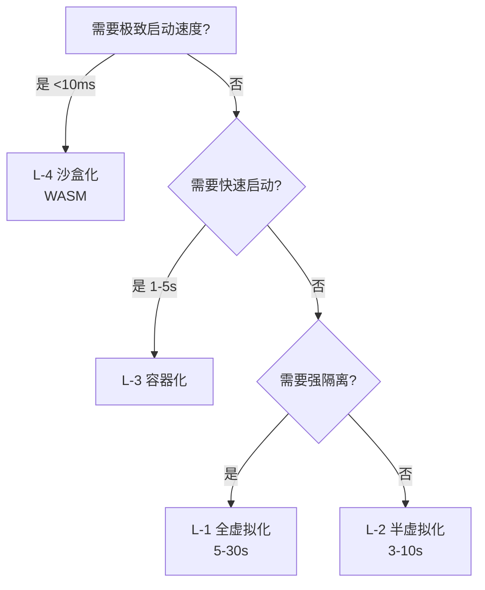
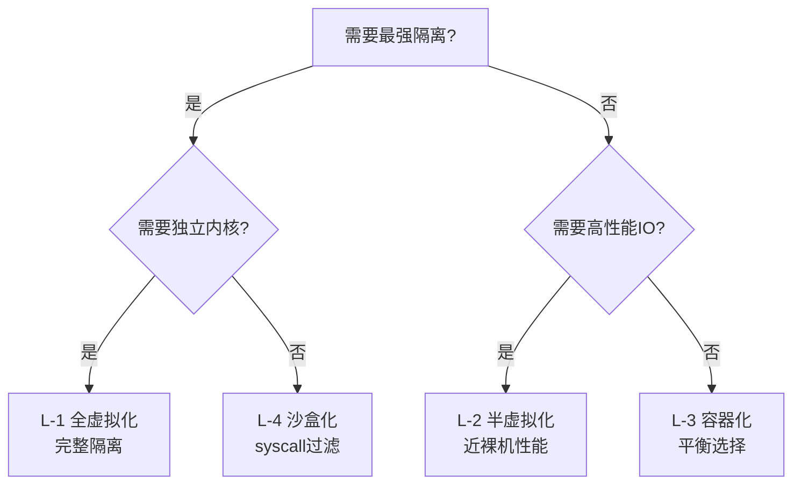
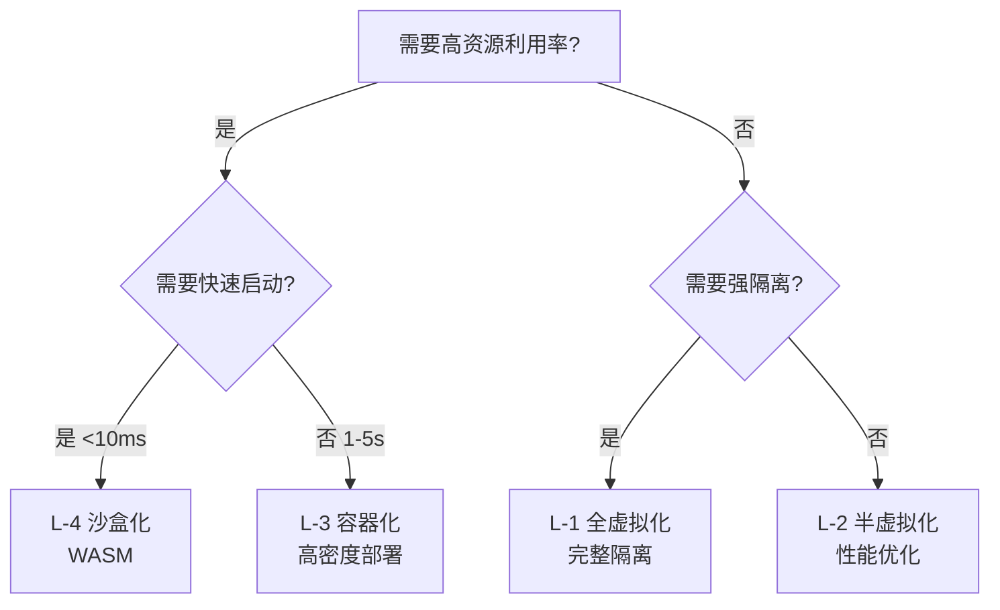
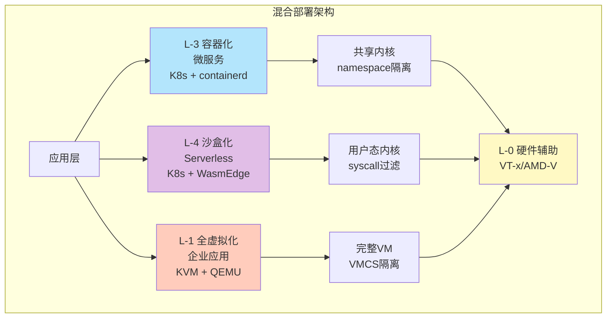

# 隔离层次总结合并对比文档

**最后更新**: 2025-11-07 **维护者**: 项目团队

## 📑 目录

- [隔离层次总结合并对比文档](#隔离层次总结合并对比文档)
  - [📑 目录](#-目录)
  - [1. 文档概述](#1-文档概述)
  - [2. 隔离层次快速对比](#2-隔离层次快速对比)
  - [3. 详细对比矩阵](#3-详细对比矩阵)
  - [4. 技术选型决策树](#4-技术选型决策树)
  - [5. 应用场景匹配](#5-应用场景匹配)
  - [6. 混合部署策略](#6-混合部署策略)
  - [7. 参考文档链接](#7-参考文档链接)
  - [8. 快速导航指南](#8-快速导航指南)
  - [9. 常见问题 FAQ](#9-常见问题-faq)
  - [10. 故障排查快速参考](#10-故障排查快速参考)
  - [11. 相关文档快速链接](#11-相关文档快速链接)

---

## 1. 文档概述

本文档提供**五层隔离栈**的全面对比和总结，包括：

- **L-0 硬件辅助层**：VT-x、AMD-V、SEV、TPM
- **L-1 全虚拟化层**：KVM、ESXi、Hyper-V、Xen HVM
- **L-2 半虚拟化层**：Xen PV、virtio、Hyper-V Enlightenment
- **L-3 容器化层**：runc、containerd、Docker、Podman
- **L-4 沙盒化层**：gVisor、Firecracker、WASM、Windows Sandbox

**文档结构**：

- 每个层次都有独立的详细文档（`layers/` 目录）
- 本文档提供总结合并和快速对比
- 便于检索和对比分析

---

## 2. 隔离层次快速对比

### 2.1 核心属性对比

| 维度           | L-0 硬件辅助   | L-1 全虚拟化   | L-2 半虚拟化   | L-3 容器化     | L-4 沙盒化     |
| -------------- | -------------- | -------------- | -------------- | -------------- | -------------- |
| **隔离强度**   | ⭐⭐⭐⭐⭐ (5) | ⭐⭐⭐⭐⭐ (5) | ⭐⭐⭐⭐ (4)   | ⭐⭐⭐ (3)     | ⭐⭐⭐⭐⭐ (5) |
| **冷启动时间** | N/A            | 5-30s          | 3-10s          | 1-5s           | <10ms          |
| **内存开销**   | N/A            | 128MB+         | 64-128MB       | 10-50MB        | 1-5MB          |
| **CPU 开销**   | <1%            | 5-10%          | 2-5%           | 1-3%           | <1%            |
| **资源利用率** | N/A            | ⭐⭐ (2)       | ⭐⭐⭐ (3)     | ⭐⭐⭐⭐⭐ (5) | ⭐⭐⭐⭐⭐ (5) |
| **部署密度**   | N/A            | 低             | 中             | 高             | 极高           |
| **网络性能**   | N/A            | ⭐⭐⭐ (3)     | ⭐⭐⭐⭐⭐ (5) | ⭐⭐⭐⭐ (4)   | ⭐⭐⭐⭐⭐ (5) |
| **存储性能**   | N/A            | ⭐⭐⭐ (3)     | ⭐⭐⭐⭐ (4)   | ⭐⭐⭐⭐⭐ (5) | ⭐⭐⭐⭐⭐ (5) |
| **兼容性**     | N/A            | ⭐⭐⭐⭐⭐ (5) | ⭐⭐⭐⭐ (4)   | ⭐⭐⭐⭐⭐ (5) | ⭐⭐⭐ (3)     |
| **可移植性**   | N/A            | ⭐⭐⭐⭐ (4)   | ⭐⭐⭐ (3)     | ⭐⭐⭐⭐⭐ (5) | ⭐⭐⭐⭐⭐ (5) |
| **安全合规**   | ⭐⭐⭐⭐⭐ (5) | ⭐⭐⭐⭐⭐ (5) | ⭐⭐⭐⭐ (4)   | ⭐⭐⭐ (3)     | ⭐⭐⭐⭐⭐ (5) |
| **运维复杂度** | ⭐⭐⭐⭐ (4)   | ⭐⭐⭐ (3)     | ⭐⭐⭐ (3)     | ⭐⭐⭐⭐⭐ (5) | ⭐⭐⭐⭐ (4)   |

### 2.2 技术实现对比

| 维度         | L-0 硬件辅助   | L-1 全虚拟化 | L-2 半虚拟化  | L-3 容器化       | L-4 沙盒化             |
| ------------ | -------------- | ------------ | ------------- | ---------------- | ---------------------- |
| **核心技术** | VT-x/AMD-V/SEV | KVM/QEMU     | virtio/Xen PV | namespace/cgroup | syscall 过滤/字节码 VM |
| **隔离机制** | CPU 模式切换   | VMCS/EPT     | grant table   | namespace        | seccomp/WASI           |
| **资源限制** | 硬件特性       | vCPU/vMEM    | 共享内存      | cgroup           | 能力模型               |
| **网络实现** | 硬件直通       | vNIC/TAP     | virtio-net    | veth pair        | 用户态网络栈           |
| **存储实现** | 硬件直通       | vmdk/qcow2   | virtio-blk    | overlayfs        | 虚拟文件系统           |
| **调度机制** | 硬件调度       | vCPU 调度    | 事件通道      | cgroup 调度      | 用户态调度             |
| **监控方式** | 硬件 PMU       | VM 内部监控  | 主机层监控    | namespace 监控   | 应用层监控             |

### 2.3 应用场景对比

| 应用场景          | L-0 硬件辅助 | L-1 全虚拟化 | L-2 半虚拟化 | L-3 容器化 | L-4 沙盒化 |
| ----------------- | ------------ | ------------ | ------------ | ---------- | ---------- |
| **企业级应用**    | ✅           | ✅✅✅       | ✅✅         | ✅✅       | ✅         |
| **微服务架构**    | ❌           | ⚠️           | ⚠️           | ✅✅✅     | ✅✅       |
| **边缘计算**      | ❌           | ❌           | ⚠️           | ✅✅       | ✅✅✅     |
| **Serverless**    | ❌           | ❌           | ❌           | ✅         | ✅✅✅     |
| **AI 推理**       | ✅           | ✅           | ✅✅         | ✅✅       | ✅✅✅     |
| **DevOps 流水线** | ❌           | ⚠️           | ⚠️           | ✅✅✅     | ✅✅       |
| **多租户 SaaS**   | ✅           | ✅✅         | ✅✅         | ✅✅       | ✅✅✅     |
| **安全隔离**      | ✅✅✅       | ✅✅✅       | ✅✅         | ✅         | ✅✅✅     |

---

## 3. 详细对比矩阵

### 3.1 性能维度选型

| 性能需求         | 推荐层级     | 理由             |
| ---------------- | ------------ | ---------------- |
| **极致启动速度** | L-4 沙盒化   | <10ms 冷启动     |
| **高资源利用率** | L-3 容器化   | 高密度部署       |
| **高网络性能**   | L-2 半虚拟化 | 近裸机网络性能   |
| **高存储性能**   | L-3 容器化   | 直接访问文件系统 |
| **低 CPU 开销**  | L-4 沙盒化   | <1% CPU 开销     |
| **低内存开销**   | L-4 沙盒化   | 1-5MB 内存占用   |

### 3.2 安全维度选型

| 安全需求       | 推荐层级     | 理由                    |
| -------------- | ------------ | ----------------------- |
| **最强隔离**   | L-1/L-4      | 完整隔离或 syscall 过滤 |
| **合规要求**   | L-1 全虚拟化 | 独立内核，完全隔离      |
| **零信任架构** | L-4 沙盒化   | 能力模型，最小权限      |
| **多租户隔离** | L-1 全虚拟化 | 完整 VM 隔离            |
| **供应链安全** | L-4 沙盒化   | 字节码验证，沙盒执行    |

### 3.3 成本维度选型

| 成本考虑             | 推荐层级   | 理由                 |
| -------------------- | ---------- | -------------------- |
| **最低基础设施成本** | L-3 容器化 | 高密度部署，资源共享 |
| **最低运维成本**     | L-3 容器化 | 标准化，易于管理     |
| **最低迁移成本**     | L-3 容器化 | 标准化镜像，易于迁移 |
| **最优 TCO**         | L-3 容器化 | 综合成本最优         |

---

## 4. 技术选型决策树

### 4.1 启动速度优先



### 4.2 隔离强度优先



### 4.3 资源利用率优先



---

## 5. 应用场景匹配

### 5.1 边缘计算场景

| 层级    | 适用性 | 典型技术栈       | 优势                     |
| ------- | ------ | ---------------- | ------------------------ |
| **L-1** | ❌     | N/A              | 资源开销过大             |
| **L-2** | ⚠️     | KVM + virtio     | 性能较好，但资源占用仍高 |
| **L-3** | ✅✅   | K3s + containerd | 轻量级，资源高效         |
| **L-4** | ✅✅✅ | K3s + WasmEdge   | 极致轻量，快速启动       |

**推荐方案**：L-4 沙盒化（K3s + WasmEdge）

### 5.2 微服务场景

| 层级    | 适用性 | 典型技术栈         | 优势                   |
| ------- | ------ | ------------------ | ---------------------- |
| **L-1** | ⚠️     | K8s + KVM          | 隔离强，但开销大       |
| **L-2** | ⚠️     | K8s + KVM + virtio | 性能好，但密度低       |
| **L-3** | ✅✅✅ | K8s + containerd   | 标准化，高密度，易管理 |
| **L-4** | ✅✅   | K8s + WasmEdge     | 快速启动，资源高效     |

**推荐方案**：L-3 容器化（K8s + containerd）或 L-4 沙盒化（K8s + WasmEdge）

### 5.3 Serverless 场景

| 层级    | 适用性 | 典型技术栈           | 优势                   |
| ------- | ------ | -------------------- | ---------------------- |
| **L-1** | ❌     | N/A                  | 启动太慢               |
| **L-2** | ❌     | N/A                  | 启动慢                 |
| **L-3** | ✅     | Knative + containerd | 可接受，但启动仍有延迟 |
| **L-4** | ✅✅✅ | Knative + WasmEdge   | 极致快速启动，资源高效 |

**推荐方案**：L-4 沙盒化（Knative + WasmEdge）

### 5.4 企业级合规场景

| 层级    | 适用性 | 典型技术栈       | 隔离强度   | 合规性 | 成本 |
| ------- | ------ | ---------------- | ---------- | ------ | ---- |
| **L-1** | ✅✅✅ | KVM + ESXi       | ⭐⭐⭐⭐⭐ | 高     | 高   |
| **L-3** | ⚠️     | K8s + containerd | ⭐⭐⭐     | 中     | 中   |
| **L-4** | ✅✅   | K8s + gVisor     | ⭐⭐⭐⭐⭐ | 高     | 中   |

**推荐方案**：L-1 全虚拟化（核心业务）+ L-4 沙盒化（非核心应用）

---

## 6. 混合部署策略

### 6.1 混合部署模式

| 混合模式                  | 组合方式      | 典型场景            | 优势                 |
| ------------------------- | ------------- | ------------------- | -------------------- |
| **L-1 + L-3**             | VM + 容器     | 企业级混合云        | 强隔离 + 轻量部署    |
| **L-3 + L-4**             | 容器 + Wasm   | 微服务 + Serverless | 标准化 + 极致性能    |
| **L-2 + L-3**             | virtio + 容器 | 高性能计算 + 微服务 | 高性能 IO + 容器编排 |
| **L-1 + L-4**             | VM + Wasm     | 合规 + 边缘         | 强隔离 + 快速启动    |
| **L-0 + L-1 + L-3 + L-4** | 全栈混合      | 大型企业混合场景    | 灵活选择，按需部署   |

### 6.2 混合部署架构



---

## 7. 参考文档链接

### 7.1 各层次详细文档

- **[L-0 硬件辅助层](layers/L-0-hardware-assist.md)** - VT-x、AMD-V、SEV、TPM
- **[L-1 全虚拟化层](layers/L-1-full-virtualization.md)** -
  KVM、ESXi、Hyper-V、Xen HVM
- **[L-2 半虚拟化层](layers/L-2-paravirtualization.md)** - Xen
  PV、virtio、Hyper-V Enlightenment
- **[L-3 容器化层](layers/L-3-containerization.md)** -
  runc、containerd、Docker、Podman
- **[L-4 沙盒化层](layers/L-4-sandboxing.md)** -
  gVisor、Firecracker、WASM、Windows Sandbox

### 7.2 相关文档

- **[29. 隔离栈](../isolation-stack.md)** - 完整的四层隔离栈文档
- **[30. 概念关系矩阵](../../30-concept-relations-matrix/concept-relations-matrix.md)** -
  概念关系梳理
  - **[30.20 隔离层次全面对比分析](../../30-concept-relations-matrix/concept-relations-matrix.md#3020-隔离层次全面对比分析)** -
    隔离层次对比
- **[02. K3s](../../02-k3s/k3s.md)** - 轻量级 Kubernetes
- **[03. WasmEdge](../../03-wasm-edge/wasmedge.md)** - WebAssembly 运行时
- **[00. Docker](../../00-docker/docker.md)** - Docker 详细文档
- **[01. Kubernetes](../../01-kubernetes/kubernetes.md)** - Kubernetes 详细文档

### 7.3 快速检索指南

**按需求检索**：

- **需要快速启动** → [L-4 沙盒化层](layers/L-4-sandboxing.md)
- **需要强隔离** → [L-1 全虚拟化层](layers/L-1-full-virtualization.md) 或
  [L-4 沙盒化层](layers/L-4-sandboxing.md)
- **需要高性能 IO** → [L-2 半虚拟化层](layers/L-2-paravirtualization.md)
- **需要高密度部署** → [L-3 容器化层](layers/L-3-containerization.md)
- **需要边缘计算** → [L-4 沙盒化层](layers/L-4-sandboxing.md)（WasmEdge）
- **需要 Serverless** → [L-4 沙盒化层](layers/L-4-sandboxing.md)（WasmEdge）
- **需要企业级合规** → [L-1 全虚拟化层](layers/L-1-full-virtualization.md)

**按技术检索**：

- **KVM/QEMU** → [L-1 全虚拟化层](layers/L-1-full-virtualization.md)
- **virtio** → [L-2 半虚拟化层](layers/L-2-paravirtualization.md)
- **Docker/containerd** → [L-3 容器化层](layers/L-3-containerization.md)
- **WasmEdge/WASM** → [L-4 沙盒化层](layers/L-4-sandboxing.md)
- **gVisor** → [L-4 沙盒化层](layers/L-4-sandboxing.md)
- **Firecracker** → [L-4 沙盒化层](layers/L-4-sandboxing.md)

**详细信息**：详见 [8. 快速导航指南](#8-快速导航指南)

---

## 8. 快速导航指南

### 8.1 按使用场景快速选择

| 使用场景                  | 推荐层次                   | 典型技术栈              | 详细文档                                                                                      |
| ------------------------- | -------------------------- | ----------------------- | --------------------------------------------------------------------------------------------- |
| **需要快速启动（<10ms）** | L-4 沙盒化                 | WasmEdge、Firecracker   | [L-4 沙盒化层](layers/L-4-sandboxing.md)                                                      |
| **需要最强隔离**          | L-1 全虚拟化 或 L-4 沙盒化 | KVM、ESXi、gVisor       | [L-1 全虚拟化层](layers/L-1-full-virtualization.md)、[L-4 沙盒化层](layers/L-4-sandboxing.md) |
| **需要高性能 I/O**        | L-2 半虚拟化               | virtio、vhost           | [L-2 半虚拟化层](layers/L-2-paravirtualization.md)                                            |
| **需要高密度部署**        | L-3 容器化                 | Kubernetes、Docker      | [L-3 容器化层](layers/L-3-containerization.md)                                                |
| **边缘计算**              | L-4 沙盒化                 | K3s + WasmEdge          | [L-4 沙盒化层](layers/L-4-sandboxing.md)                                                      |
| **Serverless**            | L-4 沙盒化                 | WasmEdge、Firecracker   | [L-4 沙盒化层](layers/L-4-sandboxing.md)                                                      |
| **企业级合规**            | L-1 全虚拟化               | VMware ESXi、KVM        | [L-1 全虚拟化层](layers/L-1-full-virtualization.md)                                           |
| **微服务架构**            | L-3 容器化                 | Kubernetes + containerd | [L-3 容器化层](layers/L-3-containerization.md)                                                |

### 8.2 按技术需求快速选择

**选择流程**：

```text
需要快速启动？
├─ 是 → L-4 沙盒化（WasmEdge、Firecracker）
└─ 否 → 需要强隔离？
    ├─ 是 → L-1 全虚拟化 或 L-4 沙盒化（gVisor）
    └─ 否 → 需要高性能 I/O？
        ├─ 是 → L-2 半虚拟化（virtio）
        └─ 否 → L-3 容器化（标准选择）
```

### 8.3 按技术组件快速定位

| 技术组件                                    | 所属层次     | 详细文档                                            |
| ------------------------------------------- | ------------ | --------------------------------------------------- |
| **VT-x、AMD-V、SEV**                        | L-0 硬件辅助 | [L-0 硬件辅助层](layers/L-0-hardware-assist.md)     |
| **KVM、QEMU、ESXi、Hyper-V**                | L-1 全虚拟化 | [L-1 全虚拟化层](layers/L-1-full-virtualization.md) |
| **Xen PV、virtio、vhost**                   | L-2 半虚拟化 | [L-2 半虚拟化层](layers/L-2-paravirtualization.md)  |
| **runc、containerd、Docker、Podman**        | L-3 容器化   | [L-3 容器化层](layers/L-3-containerization.md)      |
| **gVisor、Firecracker、WasmEdge、Wasmtime** | L-4 沙盒化   | [L-4 沙盒化层](layers/L-4-sandboxing.md)            |

### 8.4 快速参考卡片

**性能对比速查**（2025-11-06 最新数据）：

- **最快启动**：L-4（<10ms）> L-3（1-5s）> L-2（3-10s）> L-1（5-30s）
- **最高隔离**：L-1 = L-4（⭐⭐⭐⭐⭐）> L-2（⭐⭐⭐⭐）> L-3（⭐⭐⭐）
- **最高密度**：L-4（极高）> L-3（高）> L-2（中）> L-1（低）
- **最佳性能**：L-2（网络）> L-4（存储）> L-3（通用）> L-1（虚拟化）

> 📊 **完整性能基准测试数据**：更多详细的性能对比数据（包括边缘节点、云数据中心
> 、多场景对比）请参考：
>
> - **[27.14.4 性能基准测试](../../27-2025-trends/2025-trends.md#27144-性能基准测试2025-11-06)** -
>   包含完整的性能基准测试数据（边缘节点、云数据中心、多场景对比矩阵）

**技术选型决策树**：详见 [4. 技术选型决策树](#4-技术选型决策树)

**应用场景匹配**：详见 [5. 应用场景匹配](#5-应用场景匹配)

**混合部署策略**：详见 [6. 混合部署策略](#6-混合部署策略)

---

## 9. 常见问题 FAQ

### 9.1 技术选型相关问题

#### Q1: 如何快速选择最适合的隔离层次？

**A**: 按照以下优先级决策：

1. **启动速度要求**：

   - `<10ms` → L-4（WASM）
   - `1-5s` → L-3（容器）
   - `>5s` → L-1（VM）

2. **隔离强度要求**：

   - **最强隔离** → L-1（VM）或 L-4（沙盒）
   - **平衡隔离** → L-2（半虚拟化）或 L-3（容器）

3. **资源利用率要求**：
   - **最高密度** → L-4（WASM）或 L-3（容器）
   - **平衡部署** → L-2（半虚拟化）

**参考**：[4. 技术选型决策树](#4-技术选型决策树)

---

#### Q2: 可以混合使用多个隔离层次吗？

**A**: **可以**，实际生产环境经常混合部署：

- **L-1 + L-3**：VM 中运行容器（嵌套虚拟化）
- **L-3 + L-4**：容器中运行 WASM（K3s + WasmEdge）
- **L-2 + L-3**：virtio 网络 + 容器存储

**参考**：[6. 混合部署策略](#6-混合部署策略)

---

#### Q3: 性能开销如何评估？

**A**: 性能开销对比：

| 层次 | CPU 开销 | 内存开销 | 网络延迟 | 存储延迟 |
| ---- | -------- | -------- | -------- | -------- |
| L-0  | 0%       | 0%       | 0ms      | 0ms      |
| L-1  | 5-15%    | 5-10%    | +0.1ms   | +0.2ms   |
| L-2  | 2-5%     | 2-5%     | +0.05ms  | +0.1ms   |
| L-3  | 1-3%     | 1-3%     | +0.02ms  | +0.05ms  |
| L-4  | <1%      | <1%      | +0.01ms  | +0.02ms  |

**参考**：[2.1 核心属性对比](#21-核心属性对比)

---

### 9.2 安全相关问题

#### Q4: 容器逃逸的风险有多大？

**A**: 风险等级：

- **L-3 容器化**：⭐⭐⭐（中等风险）

  - 攻击面：namespace、cgroup、seccomp
  - 防护：使用 Rootless、Capability 限制、seccomp 配置

- **L-1 全虚拟化**：⭐⭐⭐⭐⭐（最低风险）

  - 攻击面：VM 隔离边界
  - 防护：硬件虚拟化、EPT/NPT

- **L-4 沙盒化**：⭐⭐⭐⭐⭐（最低风险）
  - 攻击面：syscall 过滤层
  - 防护：用户态内核、WASI 能力模型

**建议**：安全敏感场景使用 L-1 或 L-4，普通场景使用 L-3 + 安全加固。

---

#### Q5: 如何提升容器安全性？

**A**: 多层防护策略：

1. **运行时层面**：

   - Rootless 容器（Podman）
   - Capability 限制（只授予必要权限）
   - seccomp 配置（限制系统调用）

2. **网络层面**：

   - NetworkPolicy（Kubernetes）
   - 服务网格 mTLS（Istio）

3. **存储层面**：

   - 只读根文件系统
   - 最小化挂载点

4. **镜像层面**：
   - 漏洞扫描（Trivy）
   - 镜像签名（Cosign）

**参考**：[L-3 容器化层独立文档](L-3-containerization.md#l-310-最佳实践)

---

### 9.3 性能相关问题

#### Q6: 如何优化虚拟化性能？

**A**: 优化策略：

1. **L-1 全虚拟化**：

   - 使用 virtio 驱动（L-2 半虚拟化）
   - 启用 EPT/NPT 硬件加速
   - CPU 亲和性绑定

2. **L-2 半虚拟化**：

   - 启用 vhost 加速
   - 使用多队列 virtio-net
   - SR-IOV 硬件直通（如果支持）

3. **L-3 容器化**：
   - 使用 cgroup v2
   - 优化镜像大小（多阶段构建）
   - CNI 网络优化

**参考**：[各层次独立文档的最佳实践部分](README.md#21-各层次独立文档)

---

#### Q7: WASM 性能如何？

**A**: WASM 性能特点：

- **启动速度**：<10ms（最快）
- **内存占用**：1-5MB（最小）
- **CPU 开销**：<1%（最低）
- **性能损失**：5-10%（AOT 编译）

**适用场景**：

- ✅ 边缘计算
- ✅ Serverless
- ✅ AI 推理（轻量模型）
- ❌ 高性能计算（GPU 密集型）

**参考**：[L-4 沙盒化层独立文档](L-4-sandboxing.md#l-4-沙盒化层)

---

### 9.4 故障排查相关问题

#### Q8: 如何快速定位隔离层次问题？

**A**: 诊断关键词定位：

| 日志关键词                     | 隔离层次 | 问题类型            |
| ------------------------------ | -------- | ------------------- |
| `VMX operation`                | L-0      | 硬件虚拟化未启用    |
| `VMCS corruption`              | L-1      | VM 控制结构损坏     |
| `grant table error`            | L-2      | 半虚拟层内存共享    |
| `ContainerCreating`            | L-3      | 容器创建失败        |
| `Sentry syscall denied`        | L-4      | gVisor 系统调用拦截 |
| `WASI operation not permitted` | L-4      | WASM 权限不足       |

**参考**：[主文档故障排查章节](../isolation-stack.md#29-隔离栈)

---

#### Q9: 容器无法启动怎么办？

**A**: 排查步骤：

1. **检查镜像**：

   ```bash
   docker pull <image>
   docker inspect <image>
   ```

2. **检查运行时**：

   ```bash
   docker info
   containerd --version
   ```

3. **检查资源限制**：

   ```bash
   # 检查 cgroup
   cat /sys/fs/cgroup/memory/memory.limit_in_bytes
   ```

4. **检查日志**：

   ```bash
   docker logs <container>
   journalctl -u containerd
   ```

**参考**：[L-3 容器化层独立文档](L-3-containerization.md#l-38-故障排查)

---

### 9.5 迁移相关问题

#### Q10: 如何从 VM 迁移到容器？

**A**: 迁移步骤：

1. **评估应用**：

   - 检查是否有特殊硬件依赖
   - 检查是否需要独立内核
   - 评估性能要求

2. **容器化**：

   - 创建 Dockerfile
   - 构建镜像
   - 测试运行

3. **迁移**：

   - 使用数据卷迁移数据
   - 更新网络配置
   - 更新服务发现

4. **验证**：
   - 功能测试
   - 性能测试
   - 监控验证

**参考**：[L-3 容器化层独立文档](L-3-containerization.md#l-39-实际部署案例)

---

## 10. 故障排查快速参考

### 10.1 诊断命令速查

| 隔离层次 | 诊断命令                              | 说明                |
| -------- | ------------------------------------- | ------------------- |
| **L-0**  | `egrep -c '(vmx\|svm)' /proc/cpuinfo` | 检查 CPU 虚拟化支持 |
| **L-0**  | `dmesg \| grep -i sev`                | 检查 SEV 是否启用   |
| **L-1**  | `virsh list --all`                    | 列出所有 VM         |
| **L-1**  | `virsh dominfo <vm>`                  | 查看 VM 详细信息    |
| **L-2**  | `lsmod \| grep virtio`                | 检查 virtio 驱动    |
| **L-3**  | `docker ps -a`                        | 列出所有容器        |
| **L-3**  | `kubectl describe pod <pod>`          | 查看 Pod 详细信息   |
| **L-4**  | `runsc --version`                     | 检查 gVisor 版本    |
| **L-4**  | `wasmedge --version`                  | 检查 WasmEdge 版本  |

### 10.2 日志关键词定位

| 关键词                         | 隔离层次 | 问题类型            | 解决方案                        |
| ------------------------------ | -------- | ------------------- | ------------------------------- |
| `VMX operation`                | L-0      | 硬件虚拟化未启用    | 检查 BIOS 设置，启用 VT-x/AMD-V |
| `EPT violation`                | L-0      | 内存虚拟化错误      | 检查 EPT/NPT 支持，更新内核     |
| `VMCS corruption`              | L-1      | VM 控制结构损坏     | 重启 VM，检查硬件稳定性         |
| `grant table error`            | L-2      | 半虚拟层内存共享    | 检查 Xen 配置，更新驱动         |
| `ContainerCreating`            | L-3      | 容器创建失败        | 检查镜像、存储、网络配置        |
| `OOMKilled`                    | L-3      | 内存超限            | 增加内存限制或优化应用          |
| `Sentry syscall denied`        | L-4      | gVisor 系统调用拦截 | 检查应用兼容性，调整 seccomp    |
| `WASI operation not permitted` | L-4      | WASM 权限不足       | 检查 WASI 权限配置              |

### 10.3 性能问题排查

| 问题现象   | 可能原因               | 排查步骤                   |
| ---------- | ---------------------- | -------------------------- |
| **启动慢** | 镜像过大、存储慢       | 检查镜像大小、存储性能     |
| **CPU 高** | 虚拟化开销、资源限制   | 检查虚拟化开销、CPU 限制   |
| **内存高** | 内存泄漏、过度分配     | 检查内存使用、cgroup 限制  |
| **网络慢** | 虚拟网卡性能、网络策略 | 检查 virtio 驱动、网络策略 |
| **存储慢** | 虚拟存储性能、IO 限流  | 检查存储后端、IO 限流      |

---

## 11. 相关文档快速链接

### 11.1 各层次独立文档

- **[L-0 硬件辅助层](L-0-hardware-assist.md)** - VT-x、AMD-V、SEV、TPM 详细文档
- **[L-1 全虚拟化层](L-1-full-virtualization.md)** - KVM、ESXi、Hyper-V 详细文档
- **[L-2 半虚拟化层](L-2-paravirtualization.md)** - Xen PV、virtio 详细文档
- **[L-3 容器化层](L-3-containerization.md)** - runc、containerd、Docker 详细文
  档
- **[L-4 沙盒化层](L-4-sandboxing.md)** - gVisor、Firecracker、WASM 详细文档

### 11.2 主文档相关章节

- **[隔离栈主文档](../isolation-stack.md)** - 完整的隔离栈技术解析
- **[问题定位模型](../isolation-stack.md#296-问题定位模型横向请求链--纵向隔离栈)** -
  横纵耦合问题定位方法，OTLP + eBPF 联合定位
- **[快速索引](../isolation-stack.md#297-快速索引与常见问题)** - 问题类型快速索
  引

### 11.3 其他技术文档

**可观测性相关**：

- **[16. 监控与可观测性](../../16-observability/observability.md)** -
  OTLP、OpenTelemetry、eBPF 等技术规范
- **[31. eBPF 技术堆栈](../../31-ebpf-stack/ebpf-stack.md)** - eBPF 内核可编程技
  术堆栈，网络加速、可观测性、服务网格、安全应用（2025-11-07）
- **[32. eBPF/OTLP 扩展技术分析](../../32-ebpf-otlp-analysis/ebpf-otlp-analysis.md)**
  ⭐ - eBPF/OTLP 扩展技术分析文档
  - 横纵耦合问题定位模型（OTLP 横向 + eBPF 纵向）
  - 技术规范对齐、性能分析、实践指南（2025-11-07）

**故障排查相关**：

- **[11. 故障排查](../../11-troubleshooting/troubleshooting.md)** - 通用故障排查
  方法

**网络相关**：

- **[12. 网络技术规格](../../12-network-stack/network-stack.md)** - 网络技术和
  CNI 插件

---

**最后更新**: 2025-11-07 **维护者**: 项目团队
