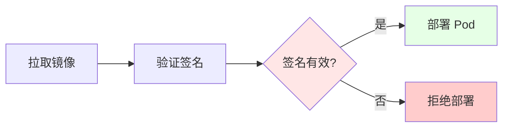

# 09. 安全与合规：零信任、镜像签名、策略治理

## 目录

- [目录](#目录)
- [09.1 文档定位](#091-文档定位)
- [09.2 零信任架构](#092-零信任架构)
  - [09.2.1 零信任概念](#0921-零信任概念)
  - [09.2.2 零信任原则](#0922-零信任原则)
  - [09.2.3 零信任实现](#0923-零信任实现)
- [09.3 镜像签名与验证](#093-镜像签名与验证)
  - [09.3.1 镜像签名方案](#0931-镜像签名方案)
  - [09.3.2 签名验证流程](#0932-签名验证流程)
  - [09.3.3 签名场景与决策](#0933-签名场景与决策)
- [09.4 策略治理](#094-策略治理)
  - [09.4.1 OPA 策略治理](#0941-opa-策略治理)
  - [09.4.2 Gatekeeper 集成](#0942-gatekeeper-集成)
  - [09.4.3 Kyverno 集成](#0943-kyverno-集成)
- [09.5 FIPS 与行业合规](#095-fips-与行业合规)
  - [09.5.1 FIPS 合规](#0951-fips-合规)
  - [09.5.2 行业合规要求](#0952-行业合规要求)
  - [09.5.3 合规场景与决策](#0953-合规场景与决策)
- [09.6 数据安全](#096-数据安全)
  - [09.6.1 数据加密](#0961-数据加密)
  - [09.6.2 数据脱敏](#0962-数据脱敏)
  - [09.6.3 OPA-Wasm 数据脱敏](#0963-opa-wasm-数据脱敏)
- [09.7 技术场景分析](#097-技术场景分析)
  - [09.7.1 生产环境安全场景](#0971-生产环境安全场景)
  - [09.7.2 合规场景](#0972-合规场景)
  - [09.7.3 零信任场景](#0973-零信任场景)
- [09.8 决策依据与思路](#098-决策依据与思路)
  - [09.8.1 安全策略决策树](#0981-安全策略决策树)
  - [09.8.2 镜像签名决策树](#0982-镜像签名决策树)
  - [09.8.3 策略治理决策树](#0983-策略治理决策树)
- [09.9 形式化总结](#099-形式化总结)
  - [09.9.1 零信任模型形式化](#0991-零信任模型形式化)
  - [09.9.2 安全策略模型形式化](#0992-安全策略模型形式化)
- [09.10 参考](#0910-参考)

---

## 09.1 文档定位

本文档深入解析安全与合规场景下的技术方案，包括零信任架构、镜像签名与验证、策略治
理和 FIPS/行业合规的技术原理、实现方式和最佳实践。

**文档结构**：

- **零信任架构**：零信任概念、原则和实现方案
- **镜像签名**：镜像签名方案、验证流程和场景决策
- **策略治理**：OPA、Gatekeeper、Kyverno 的策略治理方案
- **FIPS 合规**：FIPS 合规和行业合规要求
- **数据安全**：数据加密、脱敏和 OPA-Wasm 数据脱敏
- **技术场景**：生产环境、合规、零信任场景的架构设计

## 09.2 零信任架构

### 09.2.1 零信任概念

**定义**：零信任（Zero Trust）是一种安全架构，默认不信任任何实体，需要持续验证。

**核心原则**：

- **永不信任，始终验证**：默认不信任，需要持续验证
- **最小权限**：只授予必要的权限
- **微分段**：网络和资源分段隔离

### 09.2.2 零信任原则

**零信任原则**：

1. **身份验证**：所有实体必须验证身份
2. **设备验证**：所有设备必须验证
3. **网络验证**：所有网络通信必须验证
4. **资源验证**：所有资源访问必须验证

**零信任原则论证**：

- **身份验证**：确保只有授权用户访问
- **设备验证**：确保只有授权设备访问
- **网络验证**：确保网络通信安全
- **资源验证**：确保资源访问安全

### 09.2.3 零信任实现

**零信任实现方案**：

```yaml
零信任实现:
  身份验证: OIDC/OAuth2（用户身份）
  设备验证: 设备证书（设备身份）
  网络验证: mTLS（网络通信）
  资源验证: RBAC + OPA（资源访问）
  优势: 全面验证、最小权限、微分段
```

**零信任实现论证**：

- **身份验证**：使用 OIDC/OAuth2 验证用户身份
- **设备验证**：使用设备证书验证设备身份
- **网络验证**：使用 mTLS 加密网络通信
- **资源验证**：使用 RBAC + OPA 控制资源访问

## 09.3 镜像签名与验证

### 09.3.1 镜像签名方案

**镜像签名方案**：

- **Cosign**：Sigstore 项目的镜像签名工具
- **Notary**：Docker Content Trust 的签名工具
- **自定义签名**：使用自定义签名方案

**镜像签名方案论证**：

- **Cosign**：基于 OCI Artifact，标准签名格式，推荐使用
- **Notary**：Docker 官方工具，但功能有限
- **自定义签名**：灵活但需要自己维护

### 09.3.2 签名验证流程

**签名验证流程**：



**签名验证流程论证**：

1. **拉取镜像**：从镜像仓库拉取镜像
2. **验证签名**：使用公钥验证镜像签名
3. **准入控制**：通过 Kubernetes 准入控制验证签名
4. **部署决策**：签名有效则部署，无效则拒绝

### 09.3.3 签名场景与决策

**场景 1：生产环境**:

**决策依据**：

- ✅ 必须签名所有镜像
- ✅ 必须验证签名
- ✅ 签名验证失败必须拒绝部署

**决策思路**：

```yaml
生产环境签名策略:
  签名: 必须签名所有镜像（Cosign）
  验证: Kubernetes 准入控制（强制验证）
  失败处理: 签名验证失败必须拒绝部署
  优势: 完整性验证、来源验证、合规要求
```

**场景 2：合规场景**:

**决策依据**：

- ✅ 满足合规要求（如 EO 14028）
- ✅ 完整的签名审计
- ✅ 签名密钥管理

**决策思路**：

```yaml
合规场景签名策略:
  签名: 必须签名所有镜像 + SBOM（Cosign）
  验证: Kubernetes 准入控制（强制验证）
  审计: 完整的签名和验证记录
  密钥管理: Sigstore 密钥管理
  优势: 合规要求、完整审计、密钥管理
```

## 09.4 策略治理

### 09.4.1 OPA 策略治理

**OPA 策略治理**：使用 OPA 定义和执行安全策略。

**策略类型**：

- **准入控制策略**：Kubernetes 准入控制策略
- **授权策略**：API 授权策略
- **数据策略**：数据访问策略

**OPA 策略治理论证**：

- **策略即代码**：策略以代码形式定义，可版本控制
- **通用引擎**：支持多种场景（Kubernetes、API、微服务等）
- **声明式**：使用 Rego 语言，声明式定义策略

### 09.4.2 Gatekeeper 集成

**Gatekeeper**：Kubernetes 准入控制器，使用 OPA 策略。

**Gatekeeper 特点**：

- **准入控制**：Kubernetes 准入控制
- **OPA 集成**：使用 OPA 策略引擎
- **策略模板**：支持策略模板和约束

**Gatekeeper 集成论证**：

- **准入控制**：通过 Kubernetes 准入控制执行策略
- **OPA 集成**：使用 OPA 策略引擎，灵活定义策略
- **策略模板**：支持策略模板，便于复用

### 09.4.3 Kyverno 集成

**Kyverno**：Kubernetes 原生策略引擎，使用 YAML 定义策略。

**Kyverno 特点**：

- **原生集成**：Kubernetes 原生策略引擎
- **YAML 策略**：使用 YAML 定义策略，简单易用
- **策略类型**：支持验证、变更、生成策略

**Kyverno 集成论证**：

- **原生集成**：Kubernetes 原生策略引擎，无需额外组件
- **YAML 策略**：使用 YAML 定义策略，简单易用
- **策略类型**：支持验证、变更、生成策略，功能完整

## 09.5 FIPS 与行业合规

### 09.5.1 FIPS 合规

**FIPS 合规**：FIPS（Federal Information Processing Standards）是美国联邦信息处
理标准。

**FIPS 要求**：

- **加密算法**：使用 FIPS 批准的加密算法
- **随机数生成**：使用 FIPS 批准的随机数生成器
- **密钥管理**：使用 FIPS 批准的密钥管理方案

**FIPS 合规论证**：

- **加密算法**：使用 FIPS 批准的加密算法（如 AES-256）
- **随机数生成**：使用 FIPS 批准的随机数生成器
- **密钥管理**：使用 FIPS 批准的密钥管理方案

### 09.5.2 行业合规要求

**行业合规要求**：

- **HIPAA**：医疗保健行业合规
- **PCI DSS**：支付卡行业合规
- **GDPR**：数据保护合规
- **SOC 2**：服务组织控制合规

**行业合规论证**：

- **HIPAA**：医疗保健数据保护和隐私要求
- **PCI DSS**：支付卡数据安全标准
- **GDPR**：欧盟数据保护法规
- **SOC 2**：服务组织控制标准

### 09.5.3 合规场景与决策

**场景 1：FIPS 合规场景**:

**决策依据**：

- ✅ 必须使用 FIPS 批准的加密算法
- ✅ 必须使用 FIPS 批准的随机数生成器
- ✅ 必须使用 FIPS 批准的密钥管理方案

**决策思路**：

```yaml
FIPS 合规策略:
  加密算法: FIPS 批准算法（AES-256）
  随机数生成: FIPS 批准随机数生成器
  密钥管理: FIPS 批准密钥管理方案
  优势: FIPS 合规、安全性高
```

**场景 2：行业合规场景**:

**决策依据**：

- ✅ 满足行业合规要求（HIPAA、PCI DSS、GDPR、SOC 2）
- ✅ 数据保护和隐私要求
- ✅ 审计和报告要求

**决策思路**：

```yaml
行业合规策略:
  合规标准: HIPAA/PCI DSS/GDPR/SOC 2
  数据保护: 数据加密、访问控制
  审计: 完整的审计日志和报告
  优势: 行业合规、数据保护、审计能力
```

## 09.6 数据安全

### 09.6.1 数据加密

**数据加密方案**：

- **传输加密**：使用 TLS/mTLS 加密数据传输
- **存储加密**：使用加密存储（如加密 Volume）
- **应用加密**：在应用层加密敏感数据

**数据加密论证**：

- **传输加密**：使用 TLS/mTLS 加密数据传输，防止数据泄露
- **存储加密**：使用加密存储，防止存储数据泄露
- **应用加密**：在应用层加密敏感数据，多层防护

### 09.6.2 数据脱敏

**数据脱敏方案**：

- **静态脱敏**：在存储时脱敏数据
- **动态脱敏**：在访问时脱敏数据
- **策略脱敏**：使用策略定义脱敏规则

**数据脱敏论证**：

- **静态脱敏**：在存储时脱敏数据，保护存储数据
- **动态脱敏**：在访问时脱敏数据，保护访问数据
- **策略脱敏**：使用策略定义脱敏规则，灵活控制

### 09.6.3 OPA-Wasm 数据脱敏

**OPA-Wasm 数据脱敏**：使用 OPA-Wasm 进行细粒度数据脱敏。

**OPA-Wasm 数据脱敏方案**：

```yaml
OPA-Wasm 数据脱敏:
  策略: Rego 策略（编译到 Wasm）
  执行: WasmEdge（快速执行）
  场景: API 网关、数据访问
  优势: 细粒度控制、快速执行、策略即代码
```

**OPA-Wasm 数据脱敏论证**：

- **细粒度控制**：使用 Rego 策略定义脱敏规则，细粒度控制
- **快速执行**：Wasm 执行快，满足实时脱敏要求
- **策略即代码**：策略以代码形式定义，可版本控制

## 09.7 技术场景分析

### 09.7.1 生产环境安全场景

**场景描述**：生产环境需要全面的安全保护。

**架构挑战**：

1. **镜像安全**：确保镜像未被篡改
2. **访问控制**：控制资源访问
3. **数据安全**：保护敏感数据

**架构决策**：

```yaml
生产环境安全配置:
  镜像签名: Cosign（必须签名所有镜像）
  准入控制: Gatekeeper/Kyverno（强制策略）
  访问控制: RBAC + OPA（细粒度控制）
  数据加密: TLS/mTLS + 加密存储
  优势: 全面安全、多层防护
```

**决策依据**：

- ✅ **镜像安全**：镜像签名确保镜像完整性
- ✅ **访问控制**：准入控制和 RBAC 控制资源访问
- ✅ **数据安全**：数据加密保护敏感数据

### 09.7.2 合规场景

**场景描述**：需要满足合规要求（FIPS、行业合规）。

**架构挑战**：

1. **合规要求**：满足法规要求
2. **审计能力**：提供审计和报告能力
3. **数据保护**：保护敏感数据

**架构决策**：

```yaml
合规场景安全配置:
  FIPS 合规: FIPS 批准加密算法和密钥管理
  行业合规: 满足 HIPAA/PCI DSS/GDPR/SOC 2
  审计: 完整的审计日志和报告
  数据保护: 数据加密、访问控制、数据脱敏
  优势: 合规要求、审计能力、数据保护
```

**决策依据**：

- ✅ **合规要求**：满足 FIPS 和行业合规要求
- ✅ **审计能力**：提供完整的审计日志和报告
- ✅ **数据保护**：数据加密、访问控制、数据脱敏

### 09.7.3 零信任场景

**场景描述**：实现零信任架构，默认不信任，持续验证。

**架构挑战**：

1. **身份验证**：验证所有实体身份
2. **设备验证**：验证所有设备
3. **网络验证**：验证所有网络通信
4. **资源验证**：验证所有资源访问

**架构决策**：

```yaml
零信任场景安全配置:
  身份验证: OIDC/OAuth2（用户身份）
  设备验证: 设备证书（设备身份）
  网络验证: mTLS（网络通信）
  资源验证: RBAC + OPA（资源访问）
  优势: 全面验证、最小权限、微分段
```

**决策依据**：

- ✅ **身份验证**：OIDC/OAuth2 验证用户身份
- ✅ **设备验证**：设备证书验证设备身份
- ✅ **网络验证**：mTLS 加密网络通信
- ✅ **资源验证**：RBAC + OPA 控制资源访问

## 09.8 决策依据与思路

### 09.8.1 安全策略决策树

```yaml
安全策略决策:
  if 生产环境: 镜像签名 + 准入控制 + 数据加密
  elif 合规场景: FIPS 合规 + 行业合规 + 审计
  elif 零信任场景: 身份验证 + 设备验证 + 网络验证 + 资源验证
  else: 基础安全（镜像签名 + 准入控制）
```

### 09.8.2 镜像签名决策树

```yaml
镜像签名决策:
  if 生产环境: 必须签名所有镜像（Cosign）
  elif 合规场景: 必须签名所有镜像 + SBOM（Cosign）
  else: 可选签名（推荐）
```

### 09.8.3 策略治理决策树

```yaml
策略治理决策:
  if 复杂策略: OPA + Gatekeeper（灵活、强大）
  elif 简单策略: Kyverno（简单、易用）
  else: OPA + Gatekeeper（默认、推荐）
```

## 09.9 形式化总结

### 09.9.1 零信任模型形式化

**零信任验证函数**：

$$
ZT(E, D, N, R) = \begin{cases}
\text{allow} & \text{if } \text{verify}(E) \land \text{verify}(D) \land \text{verify}(N) \land \text{verify}(R) \\
\text{deny} & \text{otherwise}
\end{cases}
$$

其中：

- $E$ = 实体（Entity，用户/服务）
- $D$ = 设备（Device）
- $N$ = 网络（Network）
- $R$ = 资源（Resource）

### 09.9.2 安全策略模型形式化

**安全策略函数**：
$$S(P) = \{\text{sign}(P), \text{verify}(P), \text{enforce}(P)\}$$

其中：

- $P$ = 策略（Policy）
- $\text{sign}$ = 签名函数
- $\text{verify}$ = 验证函数
- $\text{enforce}$ = 执行函数

## 09.10 参考

**关联文档**：

- **[10. 技术决策模型](../../COGNITIVE/10-decision-models/decision-models.md)** -
  技术选型决策框架
- **[10. 快速参考指南](../../COGNITIVE/10-decision-models/QUICK-REFERENCE.md)** -
  设备访问（USB/PCI/GPU）和内核特性决策快速参考
- **[10. 一致性检查报告](../../COGNITIVE/10-decision-models/CONSISTENCY-REPORT.md)** -
  文档一致性检查与 Wikipedia 标准对齐
- **[06. OPA 策略即代码](../06-policy-opa/policy-opa.md)** - Open Policy Agent
- **[01. Kubernetes](../01-kubernetes/kubernetes.md)** - Kubernetes 架构与实践

> 完整参考列表见 [REFERENCES.md](../REFERENCES.md)
