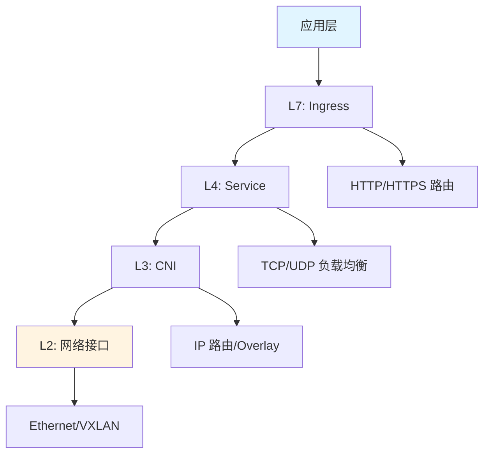
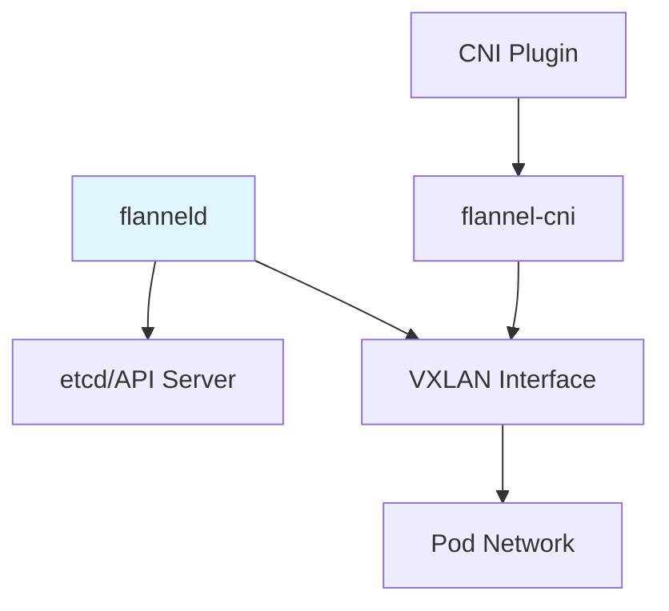
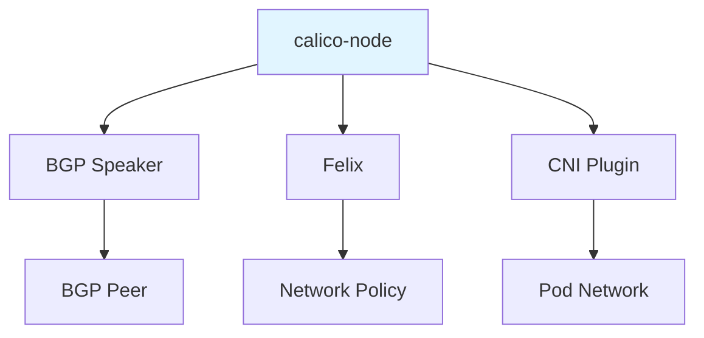
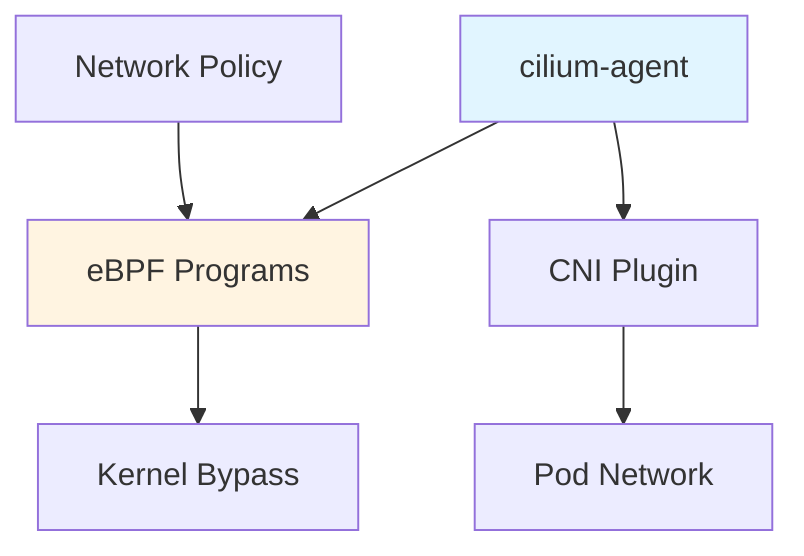
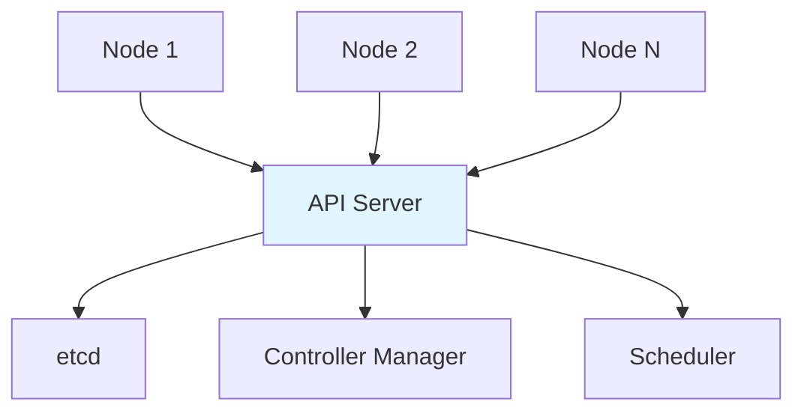
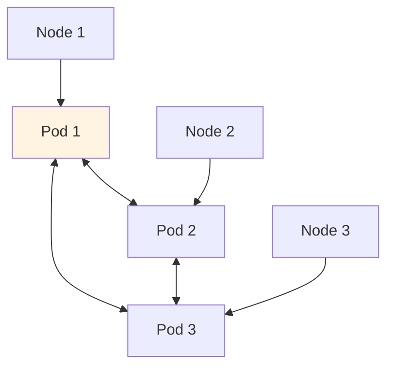
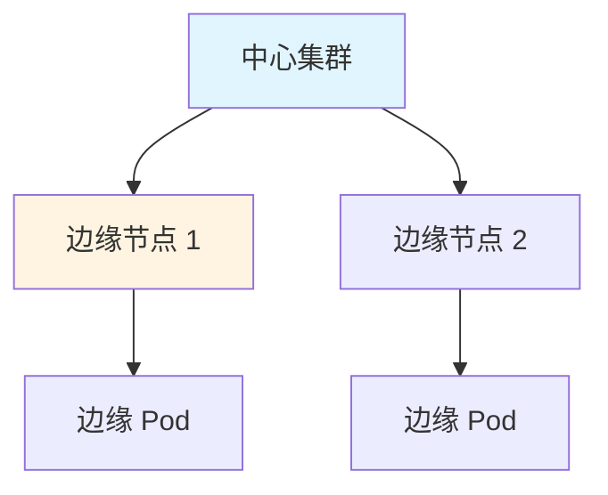
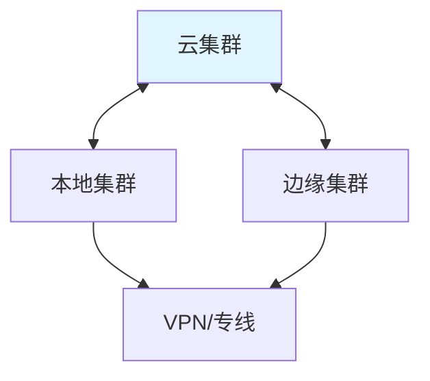

# 12. 网络技术规格堆栈：全面梳理

## 📑 目录

- [📑 目录](#-目录)
- [12.1 文档定位](#121-文档定位)
- [12.2 网络技术栈全景](#122-网络技术栈全景)
  - [12.2.1 网络层次结构](#1221-网络层次结构)
  - [12.2.2 技术组件矩阵](#1222-技术组件矩阵)
  - [12.2.3 技术栈组合](#1223-技术栈组合)
- [12.3 CNI 插件技术规格](#123-cni-插件技术规格)
  - [12.3.1 CNI 规范](#1231-cni-规范)
  - [12.3.2 Flannel 规格](#1232-flannel-规格)
  - [12.3.3 Calico 规格](#1233-calico-规格)
  - [12.3.4 Cilium 规格](#1234-cilium-规格)
  - [12.3.5 CNI 插件对比](#1235-cni-插件对比)
- [12.4 Service 技术规格](#124-service-技术规格)
  - [12.4.1 Service 类型](#1241-service-类型)
  - [12.4.2 ClusterIP 规格](#1242-clusterip-规格)
  - [12.4.3 NodePort 规格](#1243-nodeport-规格)
  - [12.4.4 LoadBalancer 规格](#1244-loadbalancer-规格)
  - [12.4.5 ExternalName 规格](#1245-externalname-规格)
- [12.5 Ingress 技术规格](#125-ingress-技术规格)
  - [12.5.1 Ingress 规范](#1251-ingress-规范)
  - [12.5.2 Nginx Ingress 规格](#1252-nginx-ingress-规格)
  - [12.5.3 Traefik Ingress 规格](#1253-traefik-ingress-规格)
  - [12.5.4 Ingress Controller 对比](#1254-ingress-controller-对比)
- [12.6 网络策略技术规格](#126-网络策略技术规格)
  - [12.6.1 NetworkPolicy 规范](#1261-networkpolicy-规范)
  - [12.6.2 Calico NetworkPolicy 规格](#1262-calico-networkpolicy-规格)
  - [12.6.3 Cilium NetworkPolicy 规格](#1263-cilium-networkpolicy-规格)
  - [12.6.4 网络策略对比](#1264-网络策略对比)
- [12.7 服务发现技术规格](#127-服务发现技术规格)
  - [12.7.1 DNS 服务发现](#1271-dns-服务发现)
  - [12.7.2 CoreDNS 规格](#1272-coredns-规格)
  - [12.7.3 环境变量服务发现](#1273-环境变量服务发现)
  - [12.7.4 服务发现对比](#1274-服务发现对比)
- [12.8 负载均衡技术规格](#128-负载均衡技术规格)
  - [12.8.1 kube-proxy 模式](#1281-kube-proxy-模式)
  - [12.8.2 iptables 模式规格](#1282-iptables-模式规格)
  - [12.8.3 IPVS 模式规格](#1283-ipvs-模式规格)
  - [12.8.4 负载均衡算法](#1284-负载均衡算法)
- [12.9 网络拓扑技术规格](#129-网络拓扑技术规格)
  - [12.9.1 控制平面拓扑](#1291-控制平面拓扑)
  - [12.9.2 数据平面拓扑](#1292-数据平面拓扑)
  - [12.9.3 边缘网络拓扑](#1293-边缘网络拓扑)
  - [12.9.4 混合云网络拓扑](#1294-混合云网络拓扑)
- [12.10 网络性能规格](#1210-网络性能规格)
  - [12.10.1 延迟规格](#12101-延迟规格)
  - [12.10.2 吞吐量规格](#12102-吞吐量规格)
  - [12.10.3 容量规格](#12103-容量规格)
  - [12.10.4 性能对比](#12104-性能对比)
- [12.11 网络协议栈](#1211-网络协议栈)
  - [12.11.1 协议层次](#12111-协议层次)
  - [12.11.2 L2/L3 协议](#12112-l2l3-协议)
  - [12.11.3 L4/L7 协议](#12113-l4l7-协议)
  - [12.11.4 协议栈对比](#12114-协议栈对比)
- [12.12 网络技术栈组合方案](#1212-网络技术栈组合方案)
  - [12.12.1 小规模集群组合](#12121-小规模集群组合)
  - [12.12.2 大规模集群组合](#12122-大规模集群组合)
  - [12.12.3 边缘计算组合](#12123-边缘计算组合)
  - [12.12.4 高性能组合](#12124-高性能组合)
- [12.13 网络接口规范](#1213-网络接口规范)
  - [12.13.1 CNI 接口规范](#12131-cni-接口规范)
  - [12.13.2 Service API 规范](#12132-service-api-规范)
  - [12.13.3 Ingress API 规范](#12133-ingress-api-规范)
- [12.14 实际部署案例](#1214-实际部署案例)
  - [12.14.1 案例 1：K3s 部署 Flannel CNI](#12141-案例-1k3s-部署-flannel-cni)
  - [12.14.2 案例 2：配置 Nginx Ingress Controller](#12142-案例-2配置-nginx-ingress-controller)
  - [12.14.3 案例 3：配置 NetworkPolicy 网络隔离](#12143-案例-3配置-networkpolicy-网络隔离)
- [12.15 网络最佳实践](#1215-网络最佳实践)
  - [12.15.1 CNI 插件最佳实践](#12151-cni-插件最佳实践)
  - [12.15.2 Service 和 Ingress 最佳实践](#12152-service-和-ingress-最佳实践)
  - [12.15.3 网络策略最佳实践](#12153-网络策略最佳实践)
  - [12.15.4 网络检查清单](#12154-网络检查清单)
- [12.16 网络故障排查](#1216-网络故障排查)
  - [12.16.1 常见问题](#12161-常见问题)
- [12.17 参考](#1217-参考)
  - [12.17.1 2025 年最新更新（2025-11-06）](#12171-2025-年最新更新2025-11-06)

---

## 12.1 文档定位

本文档全面梳理云原生容器技术栈中的网络技术、规格和堆栈组合方案，包括 CNI 插件
、Service、Ingress、网络策略、服务发现、负载均衡等网络技术的详细规格和技术栈组合
方案。

**文档结构**：

- **网络技术栈全景**：网络层次结构、技术组件矩阵、技术栈组合
- **CNI 插件技术规格**：Flannel、Calico、Cilium 等 CNI 插件的详细规格
- **Service 技术规格**：ClusterIP、NodePort、LoadBalancer 等 Service 类型规格
- **Ingress 技术规格**：Nginx、Traefik 等 Ingress Controller 规格
- **网络策略技术规格**：NetworkPolicy、Calico、Cilium 网络策略规格
- **服务发现技术规格**：DNS、CoreDNS、环境变量等服务发现机制
- **负载均衡技术规格**：kube-proxy 模式、iptables、IPVS、负载均衡算法
- **网络拓扑技术规格**：控制平面、数据平面、边缘网络、混合云网络拓扑
- **网络性能规格**：延迟、吞吐量、容量、性能对比
- **网络协议栈**：协议层次、L2/L3、L4/L7 协议
- **网络技术栈组合方案**：不同场景的网络技术栈组合

**相关文档**：

- **[29. 隔离栈 - 网络定位专题](../29-isolation-stack/isolation-stack.md#29612-网络定位专题横向生命线)** -
  网络作为横向生命线的定位方法，OTLP + eBPF 联合网络问题定位，网络在三栈里的"切
  片"视图，网络定位五步法
- **[29. 隔离栈 - 问题定位模型](../29-isolation-stack/isolation-stack.md#296-问题定位模型横向请求链--纵向隔离栈)** -
  横纵耦合的问题定位方法，OTLP + eBPF 联合定位
- **[11. 故障排查](../11-troubleshooting/troubleshooting.md)** - 常见网络故障排
  查方法

## 12.2 网络技术栈全景

### 12.2.1 网络层次结构

**网络层次结构**：



**网络层次定义**：

| 层次   | 定义       | 技术                 | 功能                       |
| ------ | ---------- | -------------------- | -------------------------- |
| **L7** | 应用层     | Ingress、Gateway API | HTTP/HTTPS 路由、SSL 终止  |
| **L4** | 传输层     | Service、kube-proxy  | TCP/UDP 负载均衡、服务发现 |
| **L3** | 网络层     | CNI 插件、路由协议   | IP 路由、网络隔离          |
| **L2** | 数据链路层 | 网络接口、隧道       | 帧传输、VXLAN 封装         |

### 12.2.2 技术组件矩阵

**网络技术组件矩阵**：

| 组件类别     | 技术                 | 定位              | 规格                      |
| ------------ | -------------------- | ----------------- | ------------------------- |
| **CNI 插件** | Flannel              | 简单 Overlay 网络 | VXLAN、支持 < 100 节点    |
| **CNI 插件** | Calico               | 高性能 BGP 网络   | BGP/IPIP、支持 > 500 节点 |
| **CNI 插件** | Cilium               | eBPF 高性能网络   | eBPF、支持 > 1000 节点    |
| **Service**  | ClusterIP            | 集群内部服务      | 虚拟 IP、DNS 解析         |
| **Service**  | NodePort             | 节点端口服务      | 30000-32767 端口范围      |
| **Service**  | LoadBalancer         | 外部负载均衡      | 云平台集成                |
| **Ingress**  | Nginx Ingress        | HTTP 路由         | 高并发、可配置            |
| **Ingress**  | Traefik              | 自动发现路由      | 零配置、自动发现          |
| **网络策略** | NetworkPolicy        | 标准网络策略      | L3/L4 策略                |
| **网络策略** | Calico NetworkPolicy | 增强网络策略      | L3/L4/L7 策略             |
| **网络策略** | Cilium NetworkPolicy | eBPF 网络策略     | L3/L4/L7、高性能          |
| **服务发现** | CoreDNS              | DNS 服务发现      | 集群 DNS、插件支持        |
| **服务发现** | 环境变量             | 环境变量服务发现  | Pod 环境变量注入          |
| **负载均衡** | kube-proxy iptables  | iptables 模式     | 默认模式、规则数多        |
| **负载均衡** | kube-proxy IPVS      | IPVS 模式         | 高性能、大规模集群        |

### 12.2.3 技术栈组合

**网络技术栈组合方案**：

| 场景           | CNI           | Service                | Ingress | 网络策略      | 负载均衡  | 说明     |
| -------------- | ------------- | ---------------------- | ------- | ------------- | --------- | -------- |
| **小规模集群** | Flannel       | ClusterIP              | Traefik | NetworkPolicy | iptables  | 简单易用 |
| **大规模集群** | Calico/Cilium | ClusterIP+LoadBalancer | Nginx   | Calico/Cilium | IPVS      | 高性能   |
| **边缘计算**   | Flannel       | ClusterIP              | Traefik | NetworkPolicy | iptables  | 轻量部署 |
| **高性能集群** | Cilium        | ClusterIP+LoadBalancer | Nginx   | Cilium        | IPVS+eBPF | 极高性能 |

## 12.3 CNI 插件技术规格

### 12.3.1 CNI 规范

**CNI（Container Network Interface）规范**：

**规范版本**：CNI v0.4.0、v1.0.0

**核心接口**：

| 接口      | 定义         | 输入                      | 输出     |
| --------- | ------------ | ------------------------- | -------- |
| **ADD**   | 添加网络接口 | 容器 ID、网络命名空间路径 | 接口配置 |
| **DEL**   | 删除网络接口 | 容器 ID、网络命名空间路径 | 无       |
| **CHECK** | 检查网络接口 | 容器 ID、网络命名空间路径 | 状态     |

**CNI 配置格式**：

```json
{
  "cniVersion": "0.4.0",
  "name": "mynet",
  "type": "bridge",
  "bridge": "cni0",
  "ipam": {
    "type": "host-local",
    "subnet": "10.244.0.0/16"
  }
}
```

**CNI 规范要点**：

- **插件化设计**：CNI 插件独立运行，可替换
- **标准化接口**：统一的 ADD/DEL/CHECK 接口
- **配置驱动**：通过 JSON 配置文件驱动
- **网络命名空间**：支持 Linux 网络命名空间隔离

### 12.3.2 Flannel 规格

**Flannel 技术规格**：

| 规格项         | 规格值              | 说明               |
| -------------- | ------------------- | ------------------ |
| **版本**       | v0.22.0+            | 最新稳定版本       |
| **支持模式**   | VXLAN、host-gw、UDP | 三种网络模式       |
| **IP 分配**    | 每个节点一个子网    | /24 子网（256 IP） |
| **默认网段**   | 10.244.0.0/16       | 可配置             |
| **节点数限制** | < 100 节点          | 推荐规模           |
| **网络策略**   | 支持 NetworkPolicy  | 需要额外组件       |
| **性能**       | 中等                | VXLAN 封装开销     |

**Flannel 架构**：



**Flannel 模式对比**：

| 模式        | 说明                   | 性能 | 网络要求           |
| ----------- | ---------------------- | ---- | ------------------ |
| **VXLAN**   | 默认模式，封装在 UDP   | 中等 | 无特殊要求         |
| **host-gw** | 主机网关模式，直接路由 | 高   | 节点在同一 L2 网络 |
| **UDP**     | UDP 封装，已弃用       | 低   | 无特殊要求         |

**Flannel 配置示例**：

```yaml
apiVersion: v1
kind: ConfigMap
metadata:
  name: kube-flannel-cfg
  namespace: kube-system
data:
  cni-conf.json: |
    {
      "Network": "10.244.0.0/16",
      "Backend": {
        "Type": "vxlan"
      }
    }
```

### 12.3.3 Calico 规格

**Calico 技术规格**：

| 规格项         | 规格值                 | 说明         |
| -------------- | ---------------------- | ------------ |
| **版本**       | v3.26.0+               | 最新稳定版本 |
| **支持模式**   | BGP、IPIP、VXLAN       | 三种网络模式 |
| **IP 分配**    | IPAM，每个 Pod 一个 IP | IP Pool 管理 |
| **默认网段**   | 192.168.0.0/16         | 可配置       |
| **节点数限制** | > 500 节点             | 大规模集群   |
| **网络策略**   | 原生支持 L3/L4/L7      | 完整网络策略 |
| **性能**       | 高                     | BGP 直接路由 |

**Calico 架构**：



**Calico 模式对比**：

| 模式      | 说明               | 性能 | 网络要求        |
| --------- | ------------------ | ---- | --------------- |
| **BGP**   | 默认模式，BGP 路由 | 高   | 支持 BGP 的网络 |
| **IPIP**  | IP over IP 隧道    | 中高 | 无特殊要求      |
| **VXLAN** | VXLAN 封装         | 中等 | 无特殊要求      |

**Calico 配置示例**：

```yaml
apiVersion: projectcalico.org/v3
kind: IPPool
metadata:
  name: default-pool
spec:
  cidr: 192.168.0.0/16
  ipipMode: Never
  natOutgoing: true
```

### 12.3.4 Cilium 规格

**Cilium 技术规格**：

| 规格项         | 规格值                 | 说明          |
| -------------- | ---------------------- | ------------- |
| **版本**       | v1.14.0+               | 最新稳定版本  |
| **支持模式**   | eBPF、Native Routing   | eBPF 内核加速 |
| **IP 分配**    | IPAM，每个 Pod 一个 IP | IP Pool 管理  |
| **默认网段**   | 10.0.0.0/8             | 可配置        |
| **节点数限制** | > 1000 节点            | 超大规模集群  |
| **网络策略**   | 原生支持 L3/L4/L7      | eBPF 实现     |
| **性能**       | 极高                   | eBPF 内核旁路 |

**Cilium 架构**：



**Cilium 特性**：

| 特性             | 说明              | 优势           |
| ---------------- | ----------------- | -------------- |
| **eBPF**         | 内核旁路，零拷贝  | 极高性能       |
| **L7 策略**      | HTTP/gRPC 策略    | 细粒度控制     |
| **Service Mesh** | 内置 Service Mesh | 无需 Sidecar   |
| **可观测性**     | 内置可观测性      | 网络流量可视化 |

**Cilium 配置示例**：

```yaml
apiVersion: v1
kind: ConfigMap
metadata:
  name: cilium-config
  namespace: kube-system
data:
  enable-bpf-masquerade: "true"
  enable-ipv4: "true"
  ipam: "cluster-pool"
  cluster-pool-ipv4-cidr: "10.0.0.0/8"
```

### 12.3.5 CNI 插件对比

**CNI 插件详细对比**：

| 规格项         | Flannel       | Calico   | Cilium      |
| -------------- | ------------- | -------- | ----------- |
| **复杂度**     | 低            | 中       | 高          |
| **性能**       | 中等          | 高       | 极高        |
| **节点数**     | < 100         | > 500    | > 1000      |
| **网络策略**   | 需要额外组件  | 原生支持 | 原生支持 L7 |
| **路由方式**   | VXLAN Overlay | BGP/IPIP | eBPF 路由   |
| **内存占用**   | ~50MB         | ~100MB   | ~200MB      |
| **CPU 占用**   | 低            | 中       | 中高        |
| **配置难度**   | 简单          | 中等     | 复杂        |
| **社区活跃度** | 高            | 高       | 极高        |
| **生产验证**   | 广泛          | 广泛     | 逐步增加    |

**CNI 插件选择决策树**：

```yaml
CNI 插件选择:
  if 节点数 < 100 and 简单易用: Flannel
  elif 节点数 > 500 and 高性能: Calico
  elif 节点数 > 1000 and 极高性能: Cilium
  elif 需要 L7 策略: Cilium
  elif 需要 BGP 路由: Calico
  else: Flannel（默认）
```

## 12.4 Service 技术规格

### 12.4.1 Service 类型

**Service 类型分类**：

| 类型             | 定义         | 访问方式        | 适用场景           |
| ---------------- | ------------ | --------------- | ------------------ |
| **ClusterIP**    | 集群内部 IP  | ClusterIP       | 集群内部服务       |
| **NodePort**     | 节点端口     | NodeIP:NodePort | 开发测试、简单部署 |
| **LoadBalancer** | 外部负载均衡 | LoadBalancer IP | 生产环境           |
| **ExternalName** | 外部名称映射 | DNS CNAME       | 外部服务映射       |

### 12.4.2 ClusterIP 规格

**ClusterIP Service 规格**：

| 规格项        | 规格值                              | 说明             |
| ------------- | ----------------------------------- | ---------------- |
| **类型**      | ClusterIP                           | 默认类型         |
| **IP 分配**   | 集群内虚拟 IP                       | Service CIDR     |
| **默认 CIDR** | 10.96.0.0/12                        | 可配置           |
| **DNS 解析**  | service.namespace.svc.cluster.local | 集群 DNS         |
| **负载均衡**  | kube-proxy                          | iptables/IPVS    |
| **会话保持**  | SessionAffinity                     | ClientIP         |
| **健康检查**  | Endpoints 检查                      | 自动剔除异常端点 |

**ClusterIP 配置示例**：

```yaml
apiVersion: v1
kind: Service
metadata:
  name: nginx-service
spec:
  type: ClusterIP
  selector:
    app: nginx
  ports:
    - port: 80
      targetPort: 8080
  sessionAffinity: ClientIP
  sessionAffinityConfig:
    clientIP:
      timeoutSeconds: 10800
```

### 12.4.3 NodePort 规格

**NodePort Service 规格**：

| 规格项       | 规格值          | 说明          |
| ------------ | --------------- | ------------- |
| **类型**     | NodePort        | 节点端口类型  |
| **端口范围** | 30000-32767     | 默认范围      |
| **访问方式** | NodeIP:NodePort | 任意节点      |
| **外部访问** | 需要开放防火墙  | 端口安全      |
| **负载均衡** | kube-proxy      | iptables/IPVS |

**NodePort 配置示例**：

```yaml
apiVersion: v1
kind: Service
metadata:
  name: nginx-nodeport
spec:
  type: NodePort
  selector:
    app: nginx
  ports:
    - port: 80
      targetPort: 8080
      nodePort: 30080
```

### 12.4.4 LoadBalancer 规格

**LoadBalancer Service 规格**：

| 规格项         | 规格值              | 说明             |
| -------------- | ------------------- | ---------------- |
| **类型**       | LoadBalancer        | 外部负载均衡类型 |
| **云平台集成** | 需要云平台支持      | AWS/GCP/Azure    |
| **IP 分配**    | 云平台负载均衡器 IP | 外部 IP          |
| **费用**       | 按使用计费          | 云平台费用       |
| **高可用**     | 云平台保证          | 自动故障转移     |

**LoadBalancer 配置示例**：

```yaml
apiVersion: v1
kind: Service
metadata:
  name: nginx-lb
  annotations:
    cloud-provider: aws
spec:
  type: LoadBalancer
  selector:
    app: nginx
  ports:
    - port: 80
      targetPort: 8080
```

### 12.4.5 ExternalName 规格

**ExternalName Service 规格**：

| 规格项       | 规格值       | 说明         |
| ------------ | ------------ | ------------ |
| **类型**     | ExternalName | 外部名称映射 |
| **DNS 解析** | CNAME 记录   | 外部服务     |
| **用途**     | 外部服务代理 | 数据库、API  |

**ExternalName 配置示例**：

```yaml
apiVersion: v1
kind: Service
metadata:
  name: external-db
spec:
  type: ExternalName
  externalName: database.example.com
```

## 12.5 Ingress 技术规格

### 12.5.1 Ingress 规范

**Ingress API 规范**：

**规范版本**：networking.k8s.io/v1

**核心资源**：

| 资源                   | 定义                | 功能       |
| ---------------------- | ------------------- | ---------- |
| **Ingress**            | HTTP/HTTPS 路由规则 | 路由配置   |
| **IngressClass**       | Ingress 控制器类型  | 控制器选择 |
| **Ingress Controller** | 路由执行组件        | 实际路由   |

**Ingress 配置示例**：

```yaml
apiVersion: networking.k8s.io/v1
kind: Ingress
metadata:
  name: example-ingress
spec:
  ingressClassName: nginx
  rules:
    - host: api.example.com
      http:
        paths:
          - path: /api
            pathType: Prefix
            backend:
              service:
                name: api-service
                port:
                  number: 80
```

### 12.5.2 Nginx Ingress 规格

**Nginx Ingress Controller 规格**：

| 规格项        | 规格值          | 说明                    |
| ------------- | --------------- | ----------------------- |
| **版本**      | v1.9.0+         | 最新稳定版本            |
| **性能**      | 极高            | 支持高并发              |
| **配置**      | ConfigMap、注解 | 灵活配置                |
| **SSL**       | TLS 终止        | 证书管理                |
| **负载均衡**  | 多种算法        | Round Robin、Least Conn |
| **WebSocket** | 支持            | WebSocket 代理          |

**Nginx Ingress 配置**：

```yaml
apiVersion: v1
kind: ConfigMap
metadata:
  name: nginx-config
  namespace: ingress-nginx
data:
  proxy-connect-timeout: "600"
  proxy-send-timeout: "600"
  proxy-read-timeout: "600"
```

### 12.5.3 Traefik Ingress 规格

**Traefik Ingress Controller 规格**：

| 规格项       | 规格值   | 说明                  |
| ------------ | -------- | --------------------- |
| **版本**     | v3.0.0+  | 最新稳定版本          |
| **性能**     | 高       | 支持中等并发          |
| **配置**     | 自动发现 | 零配置                |
| **SSL**      | 自动证书 | Let's Encrypt         |
| **负载均衡** | 多种算法 | Round Robin、Weighted |

**Traefik 自动发现**：

```yaml
apiVersion: v1
kind: Service
metadata:
  name: nginx-service
  annotations:
    traefik.ingress.kubernetes.io/rule-type: PathPrefix
spec:
  selector:
    app: nginx
  ports:
    - port: 80
```

### 12.5.4 Ingress Controller 对比

**Ingress Controller 详细对比**：

| 规格项     | Nginx Ingress  | Traefik  | 说明           |
| ---------- | -------------- | -------- | -------------- |
| **性能**   | 极高           | 高       | Nginx 性能更高 |
| **配置**   | ConfigMap/注解 | 自动发现 | Traefik 零配置 |
| **SSL**    | 手动配置       | 自动证书 | Traefik 自动化 |
| **复杂度** | 高             | 低       | Traefik 更简单 |
| **社区**   | 极高           | 高       | Nginx 更广泛   |

## 12.6 网络策略技术规格

### 12.6.1 NetworkPolicy 规范

**NetworkPolicy API 规范**：

**规范版本**：networking.k8s.io/v1

**核心规则**：

| 规则类型        | 定义       | 功能           |
| --------------- | ---------- | -------------- |
| **podSelector** | Pod 选择器 | 选择目标 Pod   |
| **ingress**     | 入站规则   | 允许的入站流量 |
| **egress**      | 出站规则   | 允许的出站流量 |
| **policyTypes** | 策略类型   | Ingress/Egress |

**NetworkPolicy 配置示例**：

```yaml
apiVersion: networking.k8s.io/v1
kind: NetworkPolicy
metadata:
  name: api-allow
spec:
  podSelector:
    matchLabels:
      app: api
  policyTypes:
    - Ingress
    - Egress
  ingress:
    - from:
        - podSelector:
            matchLabels:
              app: frontend
      ports:
        - protocol: TCP
          port: 8080
```

### 12.6.2 Calico NetworkPolicy 规格

**Calico NetworkPolicy 规格**：

| 规格项       | 规格值      | 说明         |
| ------------ | ----------- | ------------ |
| **支持层级** | L3/L4/L7    | 完整网络策略 |
| **规则类型** | 标准 + 扩展 | 更丰富的规则 |
| **性能**     | 高          | BGP 路由优化 |

**Calico NetworkPolicy 扩展**：

```yaml
apiVersion: projectcalico.org/v3
kind: NetworkPolicy
metadata:
  name: api-policy
spec:
  selector: app == 'api'
  ingress:
    - action: Allow
      source:
        selector: app == 'frontend'
      destination:
        ports:
          - 8080
```

### 12.6.3 Cilium NetworkPolicy 规格

**Cilium NetworkPolicy 规格**：

| 规格项       | 规格值   | 说明         |
| ------------ | -------- | ------------ |
| **支持层级** | L3/L4/L7 | 完整网络策略 |
| **实现方式** | eBPF     | 内核旁路     |
| **性能**     | 极高     | eBPF 零拷贝  |

**Cilium NetworkPolicy L7 规则**：

```yaml
apiVersion: "cilium.io/v2"
kind: CiliumNetworkPolicy
metadata:
  name: api-l7-policy
spec:
  endpointSelector:
    matchLabels:
      app: api
  ingress:
    - fromEndpoints:
        - matchLabels:
            app: frontend
      toPorts:
        - ports:
            - port: "8080"
              protocol: TCP
          rules:
            http:
              - method: "GET"
                path: "/api/v1"
```

### 12.6.4 网络策略对比

**网络策略详细对比**：

| 规格项     | NetworkPolicy | Calico | Cilium |
| ---------- | ------------- | ------ | ------ |
| **L3/L4**  | 支持          | 支持   | 支持   |
| **L7**     | 不支持        | 支持   | 支持   |
| **性能**   | 中            | 高     | 极高   |
| **实现**   | iptables      | BGP    | eBPF   |
| **复杂度** | 低            | 中     | 高     |

## 12.7 服务发现技术规格

### 12.7.1 DNS 服务发现

**DNS 服务发现机制**：

**DNS 解析格式**：

| 格式         | 示例                                | 说明       |
| ------------ | ----------------------------------- | ---------- |
| **完整域名** | service.namespace.svc.cluster.local | 完整 FQDN  |
| **短域名**   | service.namespace                   | 命名空间内 |
| **简化名**   | service                             | 同命名空间 |

**DNS 记录类型**：

| 记录类型     | 说明     | 示例                                             |
| ------------ | -------- | ------------------------------------------------ |
| **A 记录**   | IP 地址  | service.namespace.svc.cluster.local -> 10.96.0.1 |
| **SRV 记录** | 服务记录 | \_http.\_tcp.service.namespace.svc.cluster.local |
| **PTR 记录** | 反向解析 | 1.0.96.10.in-addr.arpa                           |

### 12.7.2 CoreDNS 规格

**CoreDNS 技术规格**：

| 规格项   | 规格值       | 说明         |
| -------- | ------------ | ------------ |
| **版本** | v1.11.0+     | 最新稳定版本 |
| **性能** | 高           | 支持高 QPS   |
| **插件** | 丰富插件生态 | 可扩展       |
| **配置** | Corefile     | 灵活配置     |

**CoreDNS 配置示例**：

```yaml
apiVersion: v1
kind: ConfigMap
metadata:
  name: coredns
  namespace: kube-system
data:
  Corefile: |
    .:53 {
        errors
        health {
           lameduck 5s
        }
        ready
        kubernetes cluster.local in-addr.arpa ip6.arpa {
           pods insecure
           fallthrough in-addr.arpa ip6.arpa
           ttl 30
        }
        prometheus :9153
        forward . /etc/resolv.conf {
           max_concurrent 1000
        }
        cache 30
        loop
        reload
        loadbalance
    }
```

### 12.7.3 环境变量服务发现

**环境变量服务发现**：

**环境变量格式**：

| 格式                  | 示例                      | 说明         |
| --------------------- | ------------------------- | ------------ |
| **SERVICE_HOST**      | NGINX_SERVICE_HOST        | Service IP   |
| **SERVICE_PORT**      | NGINX_SERVICE_PORT        | Service 端口 |
| **SERVICE_PORT_HTTP** | NGINX_SERVICE_PORT_80_TCP | 命名端口     |

**环境变量注入**：

```yaml
env:
  - name: NGINX_SERVICE_HOST
    valueFrom:
      fieldRef:
        fieldPath: status.hostIP
```

### 12.7.4 服务发现对比

**服务发现机制对比**：

| 机制         | 优势       | 劣势         | 适用场景 |
| ------------ | ---------- | ------------ | -------- |
| **DNS**      | 标准、灵活 | 延迟略高     | 生产环境 |
| **环境变量** | 零延迟     | 静态、不灵活 | 简单场景 |

## 12.8 负载均衡技术规格

### 12.8.1 kube-proxy 模式

**kube-proxy 模式分类**：

| 模式          | 定义          | 特点       |
| ------------- | ------------- | ---------- |
| **userspace** | 用户空间模式  | 已弃用     |
| **iptables**  | iptables 模式 | 默认模式   |
| **ipvs**      | IPVS 模式     | 高性能模式 |

### 12.8.2 iptables 模式规格

**iptables 模式规格**：

| 规格项       | 规格值         | 说明                |
| ------------ | -------------- | ------------------- |
| **性能**     | 中             | 规则数多时性能下降  |
| **规则数**   | O(n) 增长      | 每个 Service 多规则 |
| **适用场景** | < 1000 Service | 中小规模集群        |

### 12.8.3 IPVS 模式规格

**IPVS 模式规格**：

| 规格项       | 规格值         | 说明           |
| ------------ | -------------- | -------------- |
| **性能**     | 高             | 内核级负载均衡 |
| **规则数**   | O(1) 查找      | 哈希表查找     |
| **适用场景** | > 1000 Service | 大规模集群     |

**IPVS 配置**：

```yaml
apiVersion: kubeadm.k8s.io/v1beta3
kind: ClusterConfiguration
networking:
  serviceSubnet: "10.96.0.0/12"
---
apiVersion: kubeproxy.config.k8s.io/v1alpha1
kind: KubeProxyConfiguration
mode: "ipvs"
```

### 12.8.4 负载均衡算法

**负载均衡算法对比**：

| 算法                     | 定义     | 特点     | 适用场景   |
| ------------------------ | -------- | -------- | ---------- |
| **Round Robin**          | 轮询     | 简单     | 无状态服务 |
| **Least Connections**    | 最少连接 | 均衡负载 | 长连接服务 |
| **IP Hash**              | IP 哈希  | 会话保持 | 有状态服务 |
| **Weighted Round Robin** | 加权轮询 | 性能差异 | 异构节点   |

## 12.9 网络拓扑技术规格

### 12.9.1 控制平面拓扑

**控制平面网络拓扑**：



**控制平面拓扑特点**：

- **星型拓扑**：所有节点连接到 API Server
- **单点故障**：API Server 成为单点
- **高可用方案**：多 API Server + 负载均衡

### 12.9.2 数据平面拓扑

**数据平面网络拓扑**：



**数据平面拓扑特点**：

- **网状拓扑**：Pod 间直接通信
- **无 NAT**：Pod 间无 NAT 转换
- **直连通信**：保证低延迟

### 12.9.3 边缘网络拓扑

**边缘网络拓扑**：



**边缘网络特点**：

- **分层拓扑**：中心-边缘分层
- **网络分区**：接受网络分区
- **本地优先**：边缘本地可用

### 12.9.4 混合云网络拓扑

**混合云网络拓扑**：



**混合云网络特点**：

- **多集群连接**：VPN/专线连接
- **统一管理**：统一网络策略
- **服务发现**：跨集群服务发现

## 12.10 网络性能规格

> **💡 隔离层次关联**：不同隔离层次的网络性能差异很大（L-2 半虚拟化网络性能最高
> ，L-4 WASM 网络性能接近原生）。遇到网络性能问题时，推荐使用横纵耦合定位模型。
> 详细的技术解析请参考：
>
> - **[29. 隔离栈](../29-isolation-stack/isolation-stack.md)** - 完整的隔离栈技
>   术解析
> - **[29.6.12 网络定位专题](../29-isolation-stack/isolation-stack.md#29612-网络定位专题横向生命线)** -
>   网络作为横向生命线的定位方法
> - **[隔离层次对比文档](../29-isolation-stack/layers/isolation-comparison.md)** -
>   网络性能对比

**网络性能问题定位**：

> 遇到网络性能问题（延迟突增、丢包、吞吐量下降）时，推荐使用横纵耦合定位模型：
>
> - **横向定位**：使用 OTLP Trace 找到慢跳（详见
>   [29.6.12.2 OTLP 网络 trace](../29-isolation-stack/isolation-stack.md#296122-横向otlp-网络-trace)）
> - **纵向定位**：使用 eBPF 工具定位网络层问题（详见
>   [29.6.12.3 eBPF 网络显微镜](../29-isolation-stack/isolation-stack.md#296123-纵向ebpf-网络显微镜)）
> - **完整流程**：参考
>   [29.6.12.4 网络定位五步法](../29-isolation-stack/isolation-stack.md#296124-网络定位五步法接前述故障)

### 12.10.1 延迟规格

**网络延迟规格**：

| 场景             | 延迟    | 说明          |
| ---------------- | ------- | ------------- |
| **Pod 间同节点** | < 0.1ms | 本地通信      |
| **Pod 间跨节点** | < 1ms   | 网络通信      |
| **Service 访问** | < 2ms   | 负载均衡开销  |
| **Ingress 访问** | < 5ms   | HTTP 路由开销 |

### 12.10.2 吞吐量规格

**网络吞吐量规格**：

| 场景             | 吞吐量   | 说明            |
| ---------------- | -------- | --------------- |
| **Pod 间带宽**   | 10Gbps   | 节点网络带宽    |
| **Service 吞吐** | 1M QPS   | kube-proxy 吞吐 |
| **Ingress 吞吐** | 100K QPS | HTTP 路由吞吐   |

### 12.10.3 容量规格

**网络容量规格**：

| 资源             | 容量   | 说明          |
| ---------------- | ------ | ------------- |
| **Service 数量** | < 5000 | iptables 模式 |
| **Service 数量** | > 5000 | IPVS 模式     |
| **Ingress 数量** | < 1000 | 推荐规模      |
| **网络策略数量** | < 1000 | 推荐规模      |

### 12.10.4 性能对比

**网络性能详细对比**：

| 指标         | Flannel | Calico | Cilium |
| ------------ | ------- | ------ | ------ |
| **延迟**     | 中      | 低     | 极低   |
| **吞吐量**   | 中      | 高     | 极高   |
| **CPU 占用** | 低      | 中     | 中高   |
| **内存占用** | 低      | 中     | 中高   |

## 12.11 网络协议栈

### 12.11.1 协议层次

**网络协议栈层次**：

| 层次   | 协议            | 功能           |
| ------ | --------------- | -------------- |
| **L7** | HTTP/HTTPS/gRPC | 应用层协议     |
| **L4** | TCP/UDP         | 传输层协议     |
| **L3** | IP/ICMP         | 网络层协议     |
| **L2** | Ethernet/VXLAN  | 数据链路层协议 |

### 12.11.2 L2/L3 协议

**L2/L3 协议对比**：

| 协议         | 层次 | 用途     | 示例     |
| ------------ | ---- | -------- | -------- |
| **Ethernet** | L2   | 帧传输   | 物理网络 |
| **VXLAN**    | L2   | 虚拟网络 | Flannel  |
| **IP**       | L3   | 路由     | 所有网络 |
| **BGP**      | L3   | 路由协议 | Calico   |

### 12.11.3 L4/L7 协议

**L4/L7 协议对比**：

| 协议     | 层次 | 用途       | 示例    |
| -------- | ---- | ---------- | ------- |
| **TCP**  | L4   | 可靠传输   | Service |
| **UDP**  | L4   | 不可靠传输 | DNS     |
| **HTTP** | L7   | Web 协议   | Ingress |
| **gRPC** | L7   | RPC 协议   | 微服务  |

### 12.11.4 协议栈对比

**协议栈实现对比**：

| 实现        | L2    | L3     | L4   | L7   |
| ----------- | ----- | ------ | ---- | ---- |
| **Flannel** | VXLAN | IP     | -    | -    |
| **Calico**  | -     | BGP/IP | -    | 支持 |
| **Cilium**  | eBPF  | eBPF   | eBPF | eBPF |

## 12.12 网络技术栈组合方案

### 12.12.1 小规模集群组合

**小规模集群网络技术栈**：

```yaml
小规模集群网络栈:
  CNI: Flannel (VXLAN)
  Service: ClusterIP + NodePort
  Ingress: Traefik
  网络策略: NetworkPolicy
  负载均衡: kube-proxy iptables
  服务发现: CoreDNS
  说明: 简单易用，配置简单
```

### 12.12.2 大规模集群组合

**大规模集群网络技术栈**：

```yaml
大规模集群网络栈:
  CNI: Calico (BGP) 或 Cilium (eBPF)
  Service: ClusterIP + LoadBalancer
  Ingress: Nginx Ingress
  网络策略: Calico/Cilium NetworkPolicy
  负载均衡: kube-proxy IPVS
  服务发现: CoreDNS
  说明: 高性能，大规模支持
```

### 12.12.3 边缘计算组合

**边缘计算网络技术栈**：

```yaml
边缘计算网络栈:
  CNI: Flannel (host-gw)
  Service: ClusterIP
  Ingress: Traefik
  网络策略: NetworkPolicy
  负载均衡: kube-proxy iptables
  服务发现: CoreDNS
  说明: 轻量部署，本地优先
```

### 12.12.4 高性能组合

**高性能集群网络技术栈**：

```yaml
高性能集群网络栈:
  CNI: Cilium (eBPF)
  Service: ClusterIP + LoadBalancer
  Ingress: Nginx Ingress
  网络策略: Cilium NetworkPolicy (L7)
  负载均衡: Cilium eBPF + IPVS
  服务发现: CoreDNS
  说明: 极高性能，eBPF 内核旁路
```

## 12.13 网络接口规范

### 12.13.1 CNI 接口规范

**CNI 接口规范**：

| 接口      | 定义     | 输入                  | 输出     |
| --------- | -------- | --------------------- | -------- |
| **ADD**   | 添加网络 | 容器 ID、网络命名空间 | 接口配置 |
| **DEL**   | 删除网络 | 容器 ID、网络命名空间 | 无       |
| **CHECK** | 检查网络 | 容器 ID、网络命名空间 | 状态     |

### 12.13.2 Service API 规范

**Service API 规范**：

| API               | 版本 | 功能                       |
| ----------------- | ---- | -------------------------- |
| **Service**       | v1   | 服务发现、负载均衡         |
| **EndpointSlice** | v1   | 端点集合（替代 Endpoints） |

### 12.13.3 Ingress API 规范

**Ingress API 规范**：

| API              | 版本                 | 功能               |
| ---------------- | -------------------- | ------------------ |
| **Ingress**      | networking.k8s.io/v1 | HTTP/HTTPS 路由    |
| **IngressClass** | networking.k8s.io/v1 | Ingress 控制器类型 |

## 12.14 实际部署案例

### 12.14.1 案例 1：K3s 部署 Flannel CNI

**场景**：在 K3s 集群中部署 Flannel CNI

**部署步骤**：

```bash
# 1. K3s 默认自带 Flannel，但可以手动配置
cat > /etc/rancher/k3s/config.yaml <<EOF
flannel-backend: vxlan
EOF

# 2. 重启 K3s
systemctl restart k3s

# 3. 验证 Flannel 部署
kubectl get pods -n kube-system | grep flannel
kubectl get nodes -o wide
```

**Flannel 配置示例**：

```yaml
apiVersion: v1
kind: ConfigMap
metadata:
  name: kube-flannel-cfg
  namespace: kube-system
data:
  cni-conf.json: |
    {
      "name": "cbr0",
      "cniVersion": "0.3.1",
      "plugins": [
        {
          "type": "flannel",
          "delegate": {
            "hairpinMode": true,
            "isDefaultGateway": true
          }
        },
        {
          "type": "portmap",
          "capabilities": {
            "portMappings": true
          }
        }
      ]
    }
```

### 12.14.2 案例 2：配置 Nginx Ingress Controller

**场景**：在集群中部署 Nginx Ingress Controller

**部署步骤**：

```bash
# 1. 使用 Helm 部署 Nginx Ingress
helm repo add ingress-nginx https://kubernetes.github.io/ingress-nginx
helm repo update

helm install ingress-nginx ingress-nginx/ingress-nginx \
  --namespace ingress-nginx \
  --create-namespace \
  --set controller.service.type=LoadBalancer

# 2. 验证部署
kubectl get pods -n ingress-nginx
kubectl get svc -n ingress-nginx

# 3. 创建 Ingress 资源
kubectl apply -f - <<EOF
apiVersion: networking.k8s.io/v1
kind: Ingress
metadata:
  name: myapp-ingress
spec:
  ingressClassName: nginx
  rules:
    - host: myapp.example.com
      http:
        paths:
          - path: /
            pathType: Prefix
            backend:
              service:
                name: myapp
                port:
                  number: 80
EOF
```

### 12.14.3 案例 3：配置 NetworkPolicy 网络隔离

**场景**：使用 NetworkPolicy 实现 Pod 网络隔离

**NetworkPolicy 配置**：

```yaml
# 允许所有 Pod 访问 CoreDNS
apiVersion: networking.k8s.io/v1
kind: NetworkPolicy
metadata:
  name: allow-dns
spec:
  podSelector: {}
  policyTypes:
    - Egress
  egress:
    - to:
        - namespaceSelector:
            matchLabels:
              name: kube-system
      ports:
        - protocol: UDP
          port: 53

---
# 只允许特定 Pod 访问数据库
apiVersion: networking.k8s.io/v1
kind: NetworkPolicy
metadata:
  name: db-access
spec:
  podSelector:
    matchLabels:
      app: database
  policyTypes:
    - Ingress
  ingress:
    - from:
        - podSelector:
            matchLabels:
              app: backend
      ports:
        - protocol: TCP
          port: 5432
```

## 12.15 网络最佳实践

### 12.15.1 CNI 插件最佳实践

**CNI 插件选择**：

- ✅ **K3s 默认**：使用 Flannel（VXLAN 模式），简单可靠
- ✅ **网络策略需求**：使用 Calico 或 Cilium（支持 NetworkPolicy）
- ✅ **高性能需求**：使用 Cilium（eBPF 加速）
- ✅ **边缘场景**：使用 Flannel（资源占用低）

**CNI 配置建议**：

- ✅ 为 CNI 插件配置资源限制
- ✅ 定期检查 CNI Pod 健康状态
- ✅ 配置 CNI 日志级别（生产环境使用 INFO）
- ✅ 监控 CNI 插件性能指标

### 12.15.2 Service 和 Ingress 最佳实践

**Service 配置**：

- ✅ 使用 ClusterIP 作为默认 Service 类型
- ✅ 明确指定 Service 的 selector
- ✅ 使用 headless Service（StatefulSet 场景）
- ✅ 配置 Service sessionAffinity（需要会话保持的场景）

**Ingress 配置**：

- ✅ 使用 ingressClassName 明确指定 Ingress Controller
- ✅ 配置 Ingress 的 TLS 证书（生产环境必须）
- ✅ 使用 Ingress annotations 优化性能（如 Nginx 限流）
- ✅ 配置 Ingress 的 health check path

**性能优化**：

- ✅ 使用 IPVS 模式（kube-proxy）提升性能
- ✅ 配置 Ingress Controller 的 HPA（自动扩缩容）
- ✅ 使用 ExternalName Service 减少 DNS 查询

### 12.15.3 网络策略最佳实践

**策略设计**：

- ✅ 采用最小权限原则（默认拒绝所有流量）
- ✅ 先允许 DNS 访问（CoreDNS）
- ✅ 按命名空间隔离（namespaceSelector）
- ✅ 使用标签选择器精确匹配 Pod

**策略管理**：

- ✅ 文档化网络策略规则
- ✅ 定期审查网络策略
- ✅ 使用策略模板（Policy Template）
- ✅ 监控网络策略拒绝的流量

**安全建议**：

- ✅ 生产环境必须启用 NetworkPolicy
- ✅ 限制 Pod 的出站流量（Egress）
- ✅ 限制 Pod 的入站流量（Ingress）
- ✅ 禁止跨命名空间的默认访问

### 12.15.4 网络检查清单

**CNI 插件检查**：

- [ ] CNI 插件已正确安装和配置
- [ ] CNI Pod 运行正常（kubectl get pods -n kube-system | grep cni）
- [ ] 节点间网络连通性正常
- [ ] Pod 网络 IP 地址分配正常
- [ ] CNI 配置文件和二进制文件存在

**Service 检查**：

- [ ] Service 资源已创建（kubectl get svc）
- [ ] Service 的 Endpoints 正确（kubectl get endpoints）
- [ ] Service DNS 解析正常（nslookup service-name）
- [ ] Service 负载均衡正常工作
- [ ] NodePort/LoadBalancer 端口可访问（如适用）

**Ingress 检查**：

- [ ] Ingress Controller 已安装（kubectl get pods -n ingress-nginx）
- [ ] Ingress Controller Service 为 LoadBalancer 或 NodePort
- [ ] Ingress 资源已创建（kubectl get ingress）
- [ ] Ingress 路由规则正确
- [ ] TLS 证书配置正确（如适用）
- [ ] 外部访问 Ingress 正常

**网络策略检查**：

- [ ] CNI 插件支持 NetworkPolicy（Calico/Cilium）
- [ ] NetworkPolicy 资源已创建（kubectl get networkpolicy）
- [ ] 默认策略已配置（默认拒绝或允许）
- [ ] DNS 访问策略已配置
- [ ] 关键应用网络隔离已配置
- [ ] 网络策略规则测试通过

**网络性能检查**：

- [ ] Pod 间延迟 < 1ms（同节点）
- [ ] Pod 间延迟 < 10ms（跨节点）
- [ ] 网络吞吐量满足需求
- [ ] CNI 插件资源使用正常
- [ ] kube-proxy 模式正确（iptables/IPVS）

**网络监控检查**：

- [ ] 网络流量监控配置完成
- [ ] NetworkPolicy 拒绝流量有告警
- [ ] Service 和 Ingress 指标正常收集
- [ ] CNI 插件日志正常记录

---

## 12.16 网络故障排查

### 12.16.1 常见问题

**问题 1：Pod 无法访问 Service**:

```bash
# 检查 Service 和 Endpoints
kubectl get svc myapp
kubectl get endpoints myapp

# 检查 Pod 标签是否匹配
kubectl get pods -l app=myapp

# 检查 DNS 解析
kubectl run test-pod --image=busybox --rm -it -- nslookup myapp.default.svc.cluster.local

# 检查网络策略
kubectl get networkpolicy -A
```

**问题 2：跨节点 Pod 通信失败**:

```bash
# 检查 CNI 插件状态
kubectl get pods -n kube-system | grep -E 'flannel|calico|cilium'

# 检查节点路由表
ip route show

# 检查 CNI 配置
cat /etc/cni/net.d/*.conf

# 检查 Pod 网络接口
kubectl exec <pod-name> -- ip addr
```

**问题 3：Ingress 无法访问**:

```bash
# 检查 Ingress Controller
kubectl get pods -n ingress-nginx
kubectl logs -n ingress-nginx deployment/ingress-nginx-controller

# 检查 Ingress 资源
kubectl describe ingress myapp-ingress

# 检查 Service
kubectl get svc -n ingress-nginx

# 检查防火墙规则
iptables -L -n | grep ingress
```

## 12.17 参考

### 12.17.1 2025 年最新更新（2025-11-06）

- **[27. 2025 趋势 - 2025-11-06 最新更新](../27-2025-trends/2025-trends.md#2714-2025-年-11-月-6-日最新更新)** -
  技术版本更新、生产环境最佳实践、已知问题与解决方案
  - **OpenTelemetry 0.103.0**：OTLP 协议 v1.3.0 支持，新增 eBPF 自动注入
  - **网络定位专题**：OTLP + eBPF 联合网络问题定位，横向请求链 + 纵向隔离栈
  - **已知问题**：eBPF 探针在内核 5.4 以下不可用（已提供解决方案和临时方案）
  - **可观测性改进**：OpenTelemetry Collector 自动注入 eBPF 探针

**网络技术最佳实践（2025-11-06）**：

- **网络问题定位**：使用 OTLP + eBPF 进行横向和纵向联合定位
- **eBPF 自动注入**：OpenTelemetry Collector 自动注入 eBPF 探针（内核 5.4+）
- **网络可观测性**：统一标签关联，OTLP Trace 提供请求链路的完整视图

**关联文档**：

**网络定位与故障排查**：

- **[29. 隔离栈 - 网络定位专题](../29-isolation-stack/isolation-stack.md#29612-网络定位专题横向生命线)** -
  网络作为横向生命线的定位方法，OTLP + eBPF 联合网络问题定位
  - [网络在三栈里的"切片"视图](../29-isolation-stack/isolation-stack.md#296121-网络在三栈里的切片视图) -
    L-0/L-1/L-2/L-3 各层的网络实现
  - [OTLP 网络 trace](../29-isolation-stack/isolation-stack.md#296122-横向otlp-网络-trace) -
    如何用 OTLP 追踪网络请求
  - [eBPF 网络显微镜](../29-isolation-stack/isolation-stack.md#296123-纵向ebpf-网络显微镜) -
    如何用 eBPF 定位网络问题
  - [网络定位五步法](../29-isolation-stack/isolation-stack.md#296124-网络定位五步法接前述故障) -
    实战网络问题定位流程
  - [网络定位一键脚本](../29-isolation-stack/isolation-stack.md#296125-网络定位一键脚本) -
    自动化网络诊断工具
- **[29. 隔离栈 - 问题定位模型](../29-isolation-stack/isolation-stack.md#296-问题定位模型横向请求链--纵向隔离栈)** -
  横纵耦合的问题定位方法，OTLP + eBPF 联合定位
- **[11. 故障排查](../11-troubleshooting/troubleshooting.md)** - 常见网络故障排
  查方法

**技术规范与架构**：

- **[10. 技术决策模型](../../COGNITIVE/10-decision-models/decision-models.md)** -
  技术选型决策框架
- **[10. 快速参考指南](../../COGNITIVE/10-decision-models/QUICK-REFERENCE.md)** -
  设备访问（USB/PCI/GPU）和内核特性决策快速参考（包含 eBPF/epoll/io_uring 决策）
- **[10. 一致性检查报告](../../COGNITIVE/10-decision-models/CONSISTENCY-REPORT.md)** -
  文档一致性检查与 Wikipedia 标准对齐
- **[28. 架构框架](../28-architecture-framework/architecture-framework.md)** -
  多维度架构体系与技术规范（技术架构、网络架构等）
- **[01. Kubernetes](../01-kubernetes/kubernetes.md)** - Kubernetes 架构与实践
- **[02. K3s](../02-k3s/k3s.md)** - K3s 轻量级架构

**外部参考**：

[cni-spec]:
[Container Network Interface](https://github.com/containernetworking/cni)

[k8s-service]:
[Kubernetes Service](https://kubernetes.io/docs/concepts/services-networking/service/)

> 完整参考列表见 [REFERENCES.md](../REFERENCES.md)

---

**最后更新**：2025-11-06 **维护者**：项目团队
