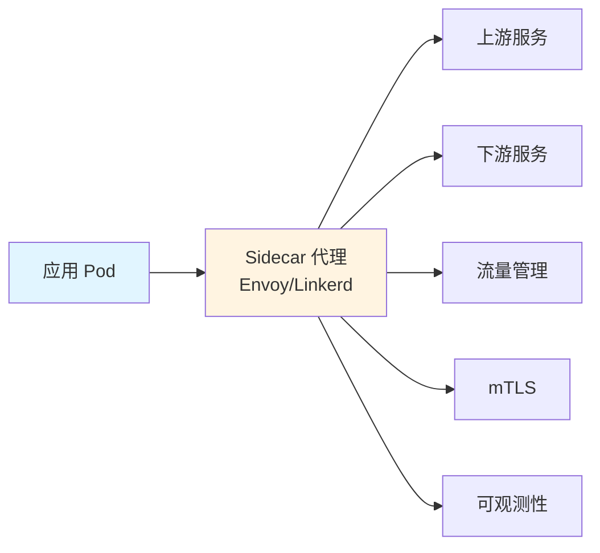
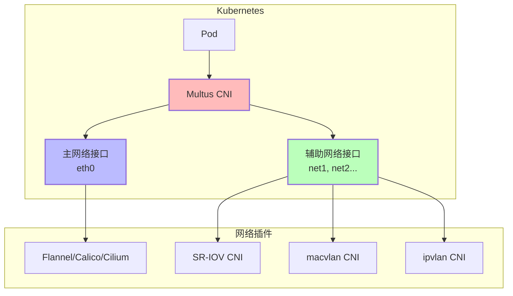
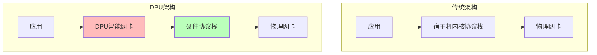
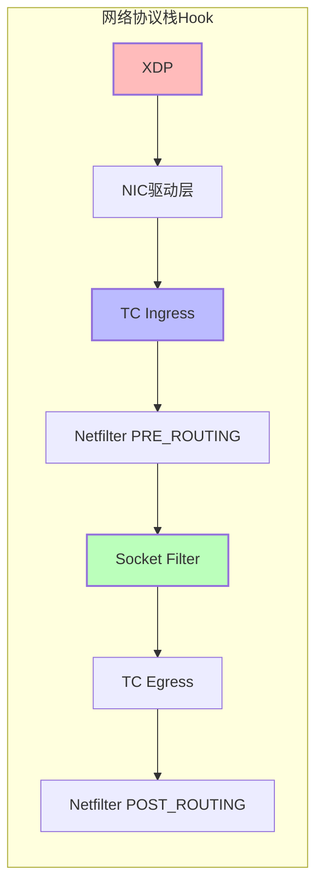
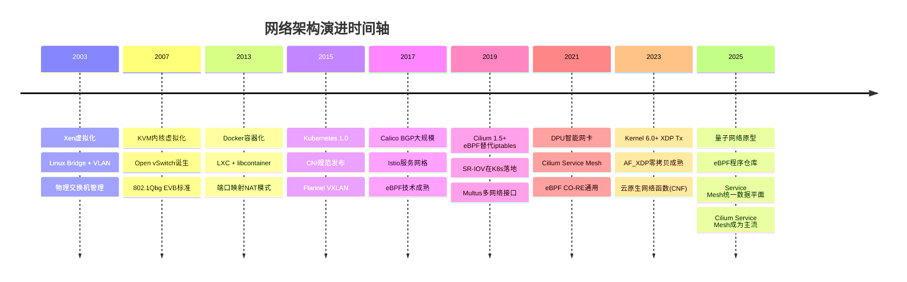
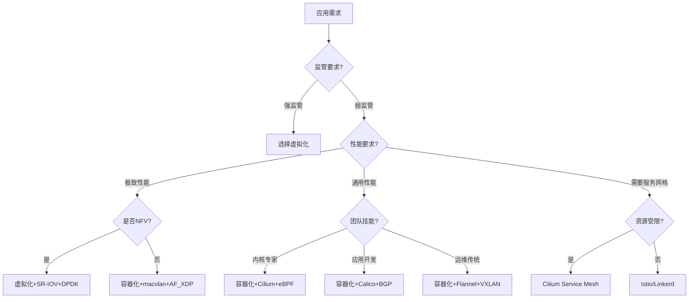

# 虚拟化容器化的网络

**最后更新**: 2025-11-07 **维护者**: 项目团队

> 📋 **文档说明**：本文档系统化梳理虚拟化与容器化网络的技术差异，包含范式转换、
> 技术实现、性能对比、选型决策等完整内容。

---

## 目录

- [一、核心技术差异：从"重隔离"到"轻共享"的架构革命](#一核心技术差异从重隔离到轻共享的架构革命)
- [二、拓扑配置范式：从静态划分到动态编排](#二拓扑配置范式从静态划分到动态编排)
- [三、网络通信模型对比分析](#三网络通信模型对比分析)
- [四、关键挑战与解决方案论证](#四关键挑战与解决方案论证)
- [五、服务网格（Service Mesh）深度分析](#五服务网格service-mesh深度分析)
- [六、多网络接口（Multus）技术详解](#六多网络接口multus技术详解)
- [七、DPU 网络卸载技术](#七dpu-网络卸载技术)
- [八、eBPF 技术深度解析](#八ebpf-技术深度解析)
- [九、多维矩阵对比论证](#九多维矩阵对比论证)
- [十、技术选型决策矩阵](#十技术选型决策矩阵)
- [十一、演进趋势与未来展望](#十一演进趋势与未来展望)
- [十二、总结：范式转换的核心逻辑](#十二总结范式转换的核心逻辑)

---

## 一、核心技术差异：从"重隔离"到"轻共享"的架构革命

### 1.1 虚拟化网络：硬件抽象与强隔离

虚拟化网络通过**Hypervisor 层**实现完整的网络栈虚拟化，每个虚拟机拥有独立的虚拟
网卡（vNIC）、IP 协议栈和 MAC 地址。其本质是**硬件资源的抽象复用**：

- **虚拟交换机（VDS）**：作为核心转发平面，模拟物理交换机行为，支持 VLAN、QoS 等
  高级功能
- **硬件加速**：采用 SR-IOV 技术绕过虚拟化层，将物理网卡（pNIC）的虚拟功能（VF）
  直接透传给 VM，实现近物理性能
- **NUMA 感知**：在双插槽服务器中，网络接口与计算资源需 NUMA 对齐，避免跨 NUMA
  节点访问导致的性能损耗

**拓扑特征**：物理网络（TOR→CE→PE）与虚拟网络（vSwitch→vNIC）分层解耦，形成"物
理-虚拟"两级拓扑。

### 1.2 容器化网络：命名空间隔离与协议栈复用

容器网络本质是**Linux 网络命名空间（Network Namespace）**的隔离，共享宿主机内核
协议栈，实现轻量级隔离：

- **CNI 插件体系**：通过标准化接口动态配置容器网络，支持 bridge、overlay 等模式
- **veth pair 设备**：作为容器与宿主机的通信管道，一端在容器内（eth0），另一端在
  宿主机 namespace（vethxxx）
- **iptables 规则**：Docker 通过 NAT 规则实现端口映射和跨容器通信，形成动态的软
  件定义转发平面

**拓扑特征**：打破传统层级，形成"宿主机-容器"扁平化拓扑，容器成为网络拓扑中的"末
梢节点"。

### 1.3 架构哲学转换：从"硬件抽象"到"协议栈复用"

**虚拟化网络的本质**是**硬件模拟**，通过 Hypervisor 在物理网卡（pNIC）上虚拟出独
立虚拟网卡（vNIC），每个 VM 拥有完整 TCP/IP 协议栈，如同"一台物理机"。其核心
是**资源隔离优先**，网络拓扑呈现**静态分层**特征：物理层（TOR/汇聚）→ 虚拟层
（vSwitch）→ 实例层（vNIC）。

**容器化网络的本质**是**Linux 内核特性复用**，通过 Network Namespace 实现逻辑隔
离，宿主机协议栈被共享。其核心是**效率优先**，网络拓扑呈现**动态扁平化**：所有容
器成为宿主机网络命名空间的"末梢节点"，通过 CNI 插件动态插入网络。这种转变将**网
络配置从"预规划"变为"声明式编排"**，实现秒级创建。

**论证结论**：虚拟化是"重资产持有模式"，每个 VM 需完整网络栈；容器化是"轻资产租
赁模式"，仅租赁必要的网络命名空间。前者适合需要**强隔离的传统企业应用**，后者适
合需要**快速弹性的云原生应用**。

---

## 二、拓扑配置范式：从静态划分到动态编排

### 2.1 传统虚拟化拓扑配置

```bash
# 虚拟化网络配置范式（以VDS为例）
1. 物理层：TOR交换机配置VLAN、MLAG
2. 虚拟层：创建分布式交换机，绑定物理网卡
3. 逻辑层：为每个VM分配端口组（Port Group）
4. 安全层：在虚拟网卡部署分布式防火墙
```

**特点**：配置周期长、依赖人工操作、拓扑变化需重启 VM。

**传统虚拟化拓扑配置流程**：

```text
1. 物理网络规划：VLAN划分、IP子网分配（需数天）
2. 虚拟交换机创建：VDS/OVS配置端口组（需数小时）
3. VM网络绑定：手动选择端口组、分配MAC/IP
4. 安全策略部署：分布式防火墙规则逐条配置
```

**关键特征**：配置周期长、依赖 CLI/GUI 手工操作、拓扑变更需重启 VM。

### 2.2 容器化动态拓扑配置

```bash
# Kubernetes网络配置范式
1. CNI插件（如Calico）自动为Pod创建veth接口
2. 通过BGP协议在宿主机间广播路由
3. NetworkPolicy实现微隔离
4. Service抽象提供动态服务发现
```

**革命性差异**：

- **秒级创建**：容器启动即完成网络配置，无需人工干预
- **IPAM 自动化**：IP 地址由 CNI 插件动态分配，解决 IP 地址碎片化问题
- **拓扑即代码**：通过 YAML 声明网络策略，实现版本控制和 CI/CD 集成

**容器化拓扑配置流程**：

```yaml
# Kubernetes NetworkPolicy示例：代码即拓扑
apiVersion: networking.k8s.io/v1
kind: NetworkPolicy
metadata:
  name: microservice-isolation
spec:
  podSelector:
    matchLabels:
      tier: backend
  policyTypes:
    - Ingress
    - Egress
  ingress:
    - from:
        - podSelector:
            matchLabels:
              tier: frontend
      ports:
        - protocol: TCP
          port: 8080
  egress:
    - to: []
      ports: # 禁止出站，实现微隔离
```

**关键特征**：配置即代码（GitOps）、秒级生效、与应用生命周期绑定、支持版本回滚。

**论证结论**：容器化实现了**网络拓扑的"版本控制"**，将网络从基础设施层提升至应用
交付层，这是 DevOps 文化的核心体现。

---

## 三、网络通信模型对比分析

### 3.1 通信模型转换：从"NAT 依赖"到"IP 直达"

**虚拟化通信模型**：

- **同主机 VM**：vSwitch 二层转发，无需 NAT
- **跨主机 VM**：需 VXLAN/VLAN+物理网络支持，或依赖虚拟路由器做 NAT
- **外部访问**：必须通过虚拟 NAT 网关，IP 地址重叠问题普遍

**容器化通信模型（Kubernetes 原则）**：

1. **每个 Pod 拥有集群唯一 IP**：消除 NAT 需求
2. **跨节点通信无需 NAT**：通过 CNI 插件直接路由或 Overlay
3. **Service 抽象实现负载均衡**：kube-proxy 通过 iptables/IPVS 实现，不依赖 NAT

**论证结论**：容器化网络通过**IP-per-Pod 模型**实现了"地址空间扁平化"，使微服务
直接通信成为可能，这是服务网格（Service Mesh）架构的基础。

### 3.2 网络通信模型对比表

| 维度           | 虚拟化网络                  | 容器化网络                                      | 技术影响                            |
| -------------- | --------------------------- | ----------------------------------------------- | ----------------------------------- |
| **地址空间**   | 独立 IP/MAC，RFC1918 私网段 | 共享宿主机 IP，通过端口映射或独立 CNI 网段      | 容器网络需要解决 IP 地址耗尽问题    |
| **通信路径**   | VM→vSwitch→pNIC→ 物理交换机 | Container→veth→docker0→ 宿主机协议栈 → 物理网卡 | 容器性能接近原生，但多一层 NAT 开销 |
| **跨主机通信** | VXLAN/VLAN+物理网络支持     | Overlay 网络（Flannel、Weave）                  | 容器天然适应云环境，不依赖底层网络  |
| **服务发现**   | DHCP+DNS（静态配置）        | DNS+环境变量+Service Mesh 动态发现              | 容器化实现应用层自愈能力            |

---

## 四、关键挑战与解决方案论证

### 4.1 挑战 1：流量可视化盲区

**问题**：容器间通信通过 veth 和 iptables 转发，传统网络监控工具（如 SNMP）无法
感知

**解决方案**：

```yaml
# eBPF技术方案
apiVersion: cilium.io/v2
kind: CiliumClusterwideNetworkPolicy
metadata:
  name: monitor-all
spec:
  endpointSelector: {}
  ingress:
    - fromEntities:
        - world
  egress:
    - toEntities:
        - world
```

- **eBPF 探针**：在 Linux 内核态采集网络流，实现容器级流量可视化
- **服务网格（Istio）**：通过 Sidecar 代理将流量导出到监控系统

### 4.2 挑战 2：安全隔离粒度

**问题**：容器共享内核，传统防火墙无法防护宿主机到容器的攻击面

**解决方案**：

- **NetworkPolicy**：Kubernetes 原生支持 L3/L4 层网络隔离
- **微隔离架构**：每个容器绑定独立的安全组，实现零信任模型
- **Rootless 容器**：通过 user namespace 限制网络配置权限，降权运行

### 4.3 挑战 3：性能与隔离的权衡

**问题**：Bridge 模式 NAT 导致性能损耗，Host 模式牺牲隔离性

**论证结论**：

```bash
# 性能排序（从高到低）
SR-IOV直通 > Host模式 > Bridge模式 > Overlay网络
```

**工程实践**：对于高性能 NFV 场景（如 5G UPF），采用 SR-IOV+NUMA 亲和性配置；对
于通用微服务，采用 CNI 插件平衡性能与灵活性。

### 4.4 挑战 4：IP 地址耗尽风险

**问题**：每个 Pod 独立 IP，/16 子网仅支持 65535 个 Pod，大型集群易耗尽

**解决方案**：

- **Cilium 支持 IPv6+IPAM 复用**：IPv6 地址空间巨大，可支持百万级 Pod
- **Service Mesh 的 L7 路由**：通过应用层路由减少对 IP 地址的依赖
- **CNI 2.0 规范**：支持动态网络热插拔，提高 IP 地址利用率

### 4.5 挑战 5：内核协议栈瓶颈

**问题**：所有 Pod 共享宿主机内核，连接追踪（conntrack）表易满

**解决方案**：

- **Cilium 的 eBPF 绕过 conntrack**：使用 eBPF Map 替代 conntrack 表，支持更大规
  模
- **用户态网络协议栈**：DPDK、AF_XDP 等用户态驱动绕过内核协议栈
- **DPU 卸载**：将网络协议栈卸载到智能网卡，释放 CPU 资源

### 4.6 挑战 6：安全隔离复杂度

**问题**：NetworkPolicy 仅支持 L3/L4，无法防护应用层攻击

**解决方案**：

- **Istio 提供服务网格层的 mTLS 和授权策略**：L7 层安全防护
- **Cilium Service Mesh**：基于 eBPF 的轻量级服务网格，无需 Sidecar
- **Wasm 插件**：在服务网格中运行 Wasm 插件，实现自定义安全策略

---

## 五、服务网格（Service Mesh）深度分析

### 5.1 服务网格定义与架构

**服务网格定义（2025 年视角）**：

**服务网格（Service Mesh）** = 把"微服务间通信"从业务代码里**整体抽出来**，做
成**基础设施层**，实现**非侵入式**的流量治理、安全、可观测性。

**核心价值**：

- **非侵入式**：业务代码无需修改，通过 Sidecar 代理实现流量拦截
- **统一治理**：所有微服务通信通过统一的数据平面和控制平面管理
- **可观测性**：自动收集 Metrics、Tracing、日志，实现全链路追踪

### 5.2 服务网格架构

#### 5.2.1 控制平面架构

**Istio 控制平面组件**：

| 组件          | 功能     | 说明                   |
| ------------- | -------- | ---------------------- |
| **Istiod**    | 统一控制 | Pilot、Citadel、Galley |
| **Pilot**     | 流量管理 | 路由规则、负载均衡     |
| **Citadel**   | 安全     | mTLS、证书管理         |
| **Galley**    | 配置验证 | 配置验证和转换         |
| **Telemetry** | 遥测数据 | Metrics、Tracing       |

**Linkerd 控制平面组件**：

| 组件                    | 功能     | 说明               |
| ----------------------- | -------- | ------------------ |
| **linkerd-identity**    | 身份管理 | mTLS、证书管理     |
| **linkerd-destination** | 服务发现 | 服务发现、路由     |
| **linkerd-policy**      | 策略管理 | 流量策略、安全策略 |

#### 5.2.2 数据平面架构

**数据平面定义**：

数据平面由 Sidecar 代理组成，负责处理服务间的实际流量。

**Sidecar 代理架构**：



**数据平面功能**：

1. **流量拦截**：拦截 Pod 的入站和出站流量
2. **流量路由**：根据路由规则路由流量
3. **安全通信**：提供 mTLS 加密通信
4. **可观测性**：收集 Metrics、Tracing、日志

### 5.3 主流服务网格对比

#### 5.3.1 Istio vs Linkerd vs Cilium Service Mesh

| 特性         | **Istio**                 | **Linkerd**             | **Cilium Service Mesh** |
| ------------ | ------------------------- | ----------------------- | ----------------------- |
| **数据平面** | Envoy（C++）              | Linkerd2-proxy（Rust）  | eBPF（无 Sidecar）      |
| **控制平面** | Istiod（Go）              | Linkerd CP（Go）        | Cilium Agent（Go）      |
| **资源占用** | 高（Envoy 内存 50-100MB） | 低（Rust 内存 10-20MB） | 极低（无 Sidecar）      |
| **性能开销** | 延迟 +2-5ms               | 延迟 +1-3ms             | 延迟 +0.1-0.5ms         |
| **mTLS**     | ✅ 支持                   | ✅ 支持（零配置）       | ✅ 支持（eBPF 实现）    |
| **流量管理** | ✅ 丰富                   | ✅ 基础                 | ✅ 基础                 |
| **可观测性** | ✅ 完整                   | ✅ 完整                 | ✅ 完整（Hubble）       |
| **学习曲线** | 陡峭                      | 平缓                    | 中等                    |
| **适用场景** | 大型企业、复杂路由        | 中小型、快速部署        | 高性能、低延迟          |

#### 5.3.2 Cilium Service Mesh 优势

**Cilium Service Mesh** 是**基于 eBPF 的无 Sidecar 服务网格**，其核心优势：

1. **无 Sidecar 开销**：不需要在每个 Pod 中注入 Sidecar 代理，资源占用极低
2. **内核态执行**：eBPF 程序在内核态执行，延迟极低（<0.5ms）
3. **原生集成**：与 Cilium CNI 深度集成，无需额外组件
4. **L7 协议解析**：支持 HTTP、gRPC、Kafka 等 L7 协议自动解析

**性能对比数据**：

| 指标           | **Istio（Envoy）** | **Linkerd（Rust）** | **Cilium Mesh（eBPF）** |
| -------------- | ------------------ | ------------------- | ----------------------- |
| **延迟增加**   | +2-5ms             | +1-3ms              | **+0.1-0.5ms**          |
| **CPU 占用**   | 5-10%              | 2-5%                | **<1%**                 |
| **内存占用**   | 50-100MB/Pod       | 10-20MB/Pod         | **0MB/Pod**             |
| **吞吐量影响** | -10-20%            | -5-10%              | **<1%**                 |

### 5.4 服务网格运行机制：七步闭环

**运行机制定义**：

服务网格通过**七步闭环**实现服务间通信的透明治理，从流量注入到故障自愈的全流程自
动化。

**七步闭环流程**：

1. **注入**：通过 Admission Webhook 或 DaemonSet，在 Pod 启动时自动注入 Sidecar
   或启动节点级代理
2. **流量劫持**：使用 iptables/eBPF 把**所有进出容器的 TCP/UDP 流量**重定向到代
   理
3. **服务发现**：代理定期从控制平面获取**服务目录**（EndpointSlice、Consul
   Catalog、Eureka 等）
4. **策略执行**：根据 CRD/ConfigMap 下发的规则，代理完成负载均衡、路由、熔断、限
   流等
5. **安全通信**：自动建立 mTLS 连接，实现服务间加密通信
6. **可观测性**：收集 Metrics、Tracing、日志，发送到监控系统
7. **故障自愈**：根据健康检查结果，自动剔除不健康实例，实现故障自愈

### 5.5 服务网格应用场景

#### 5.5.1 微服务架构场景

**适用场景**：

- **大规模微服务**：100+ 微服务，需要统一治理
- **多语言混合**：Java、Go、Python 等不同语言服务需要统一通信
- **复杂路由**：需要金丝雀发布、A/B 测试、流量镜像等高级路由

**技术组合**：

- **Istio + Kubernetes**：适合大型企业，需要复杂路由策略
- **Linkerd + Kubernetes**：适合中小型团队，快速部署

#### 5.5.2 多云环境场景

**适用场景**：

- **跨云部署**：服务部署在多个云平台（AWS、Azure、GCP）
- **混合云**：部分服务在公有云，部分在私有云
- **边缘计算**：服务部署在边缘节点

**技术组合**：

- **Istio Multi-Cluster**：支持跨集群服务发现和路由
- **Cilium Cluster Mesh**：基于 eBPF 的跨集群网络

#### 5.5.3 边缘计算场景

**适用场景**：

- **资源受限**：边缘节点资源有限，需要轻量级方案
- **低延迟**：需要极低延迟的服务通信
- **离线能力**：边缘节点可能离线，需要本地服务发现

**技术组合**：

- **Cilium Service Mesh**：无 Sidecar，资源占用极低
- **Linkerd**：Rust 实现，资源占用低

---

## 六、多网络接口（Multus）技术详解

### 6.1 Multus 概述

**Multus CNI** 是 Kubernetes 的**多网络接口插件**，允许 Pod 拥有**多个网络接
口**，实现不同网络需求的灵活组合。

**核心价值**：

- **多网络支持**：Pod 可以同时连接多个网络（数据网络、存储网络、管理网络）
- **SR-IOV 支持**：支持 SR-IOV VF 直通，实现高性能网络
- **网络隔离**：不同网络可以有不同的安全策略和 QoS

### 6.2 Multus 架构



**Multus 工作原理**：

1. **主网络接口（eth0）**：由默认 CNI 插件（Flannel/Calico/Cilium）创建，用于
   Pod 间通信
2. **辅助网络接口（net1, net2...）**：由 Multus 调用其他 CNI 插件创建，用于特殊
   网络需求

### 6.3 Multus 配置示例

#### 6.3.1 基础配置

```yaml
# NetworkAttachmentDefinition: SR-IOV网络
apiVersion: k8s.cni.cncf.io/v1
kind: NetworkAttachmentDefinition
metadata:
  name: sriov-net
  namespace: default
spec:
  config: |
    {
      "type": "sriov",
      "cniVersion": "0.3.1",
      "name": "sriov-net",
      "ipam": {
        "type": "host-local",
        "subnet": "10.56.217.0/24",
        "rangeStart": "10.56.217.171",
        "rangeEnd": "10.56.217.181",
        "routes": [{
          "dst": "0.0.0.0/0"
        }],
        "gateway": "10.56.217.1"
      }
    }
```

#### 6.3.2 Pod 使用多网络接口

```yaml
apiVersion: v1
kind: Pod
metadata:
  name: multus-pod
  annotations:
    k8s.v1.cni.cncf.io/networks: |
      [
        {
          "name": "sriov-net",
          "namespace": "default"
        },
        {
          "name": "macvlan-net",
          "namespace": "default"
        }
      ]
spec:
  containers:
    - name: app
      image: nginx
```

### 6.4 Multus 应用场景

#### 6.4.1 SR-IOV 高性能网络

**场景**：AI 训练、高性能数据库、NFV 等需要极致网络性能的应用

**配置**：

```yaml
# NetworkAttachmentDefinition: SR-IOV
apiVersion: k8s.cni.cncf.io/v1
kind: NetworkAttachmentDefinition
metadata:
  name: sriov-net
spec:
  config: |
    {
      "type": "sriov",
      "cniVersion": "0.3.1",
      "name": "sriov-net",
      "ipam": {
        "type": "host-local",
        "subnet": "10.56.217.0/24"
      }
    }
```

**性能优势**：

- **延迟**：<5μs（接近物理网卡）
- **吞吐量**：50-100 Gbps
- **CPU 占用**：极低（硬件卸载）

#### 6.4.2 多租户网络隔离

**场景**：不同租户需要不同的网络策略和 QoS

**配置**：

```yaml
# 租户A网络
apiVersion: k8s.cni.cncf.io/v1
kind: NetworkAttachmentDefinition
metadata:
  name: tenant-a-net
spec:
  config: |
    {
      "type": "macvlan",
      "cniVersion": "0.3.1",
      "name": "tenant-a-net",
      "master": "eth0",
      "ipam": {
        "type": "host-local",
        "subnet": "10.0.1.0/24"
      }
    }

# 租户B网络
apiVersion: k8s.cni.cncf.io/v1
kind: NetworkAttachmentDefinition
metadata:
  name: tenant-b-net
spec:
  config: |
    {
      "type": "macvlan",
      "cniVersion": "0.3.1",
      "name": "tenant-b-net",
      "master": "eth1",
      "ipam": {
        "type": "host-local",
        "subnet": "10.0.2.0/24"
      }
    }
```

#### 6.4.3 存储网络分离

**场景**：数据网络和存储网络分离，提高安全性和性能

**配置**：

```yaml
# 数据网络（主网络）
# 由默认CNI插件创建，用于Pod间通信

# 存储网络（辅助网络）
apiVersion: k8s.cni.cncf.io/v1
kind: NetworkAttachmentDefinition
metadata:
  name: storage-net
spec:
  config: |
    {
      "type": "macvlan",
      "cniVersion": "0.3.1",
      "name": "storage-net",
      "master": "eth1",
      "ipam": {
        "type": "host-local",
        "subnet": "192.168.100.0/24"
      }
    }
```

### 6.5 Multus 性能对比

| 网络类型    | **延迟** | **吞吐量**      | **CPU 占用** | **适用场景**     |
| ----------- | -------- | --------------- | ------------ | ---------------- |
| **主网络**  | 20-30μs  | 15-20 Gbps      | 中等         | 通用 Pod 通信    |
| **SR-IOV**  | **<5μs** | **50-100 Gbps** | **极低**     | 高性能计算、NFV  |
| **macvlan** | 10-15μs  | 40-50 Gbps      | 低           | 生产环境、多租户 |
| **ipvlan**  | 10-15μs  | 40-50 Gbps      | 低           | 资源受限场景     |

---

## 七、DPU 网络卸载技术

### 7.1 DPU 概述

**DPU（Data Processing Unit）** 是**智能网卡**，将网络、存储、安全功能卸载到硬件
，释放 CPU 资源。

**核心价值**：

- **CPU 释放**：网络协议栈卸载到 DPU，释放 30-50% CPU
- **性能提升**：硬件加速，延迟降低 50-80%
- **安全卸载**：防火墙、加密等功能卸载到硬件

### 7.2 DPU 网络卸载架构



**DPU 卸载功能**：

1. **网络协议栈卸载**：TCP/IP 协议栈在 DPU 上执行
2. **OVS 卸载**：Open vSwitch 流表卸载到 DPU
3. **安全功能卸载**：防火墙、加密、解密在 DPU 上执行
4. **存储卸载**：NVMe-oF、存储协议卸载到 DPU

### 7.3 DPU 网络性能对比

| 指标         | **传统容器化** | **DPU 卸载**     | **性能提升** |
| ------------ | -------------- | ---------------- | ------------ |
| **网络延迟** | 20-30μs        | **1-2μs**        | **10-15 倍** |
| **吞吐量**   | 50-100 Gbps    | **200-400 Gbps** | **4 倍**     |
| **CPU 占用** | 30-50%         | **<5%**          | **85%减少**  |
| **连接数**   | 100K           | **1M+**          | **10 倍**    |

### 7.4 DPU 数据路径

| 路径阶段       | **传统容器化**  | **DPU 卸载** | **优化效果** |
| -------------- | --------------- | ------------ | ------------ |
| **应用写操作** | App→Host FS→NIC | App→DPU→NIC  | **绕过内核** |
| **协议栈处理** | Host 内核       | DPU 硬件     | **硬件加速** |
| **指令周期**   | 2000-3000       | **500-800**  | **75%减少**  |

### 7.5 DPU 应用场景

#### 7.5.1 高性能计算（HPC）

**场景**：AI 训练、科学计算等需要极致网络性能

**技术组合**：

- **DPU + RDMA**：RDMA 协议卸载到 DPU，实现零拷贝
- **延迟**：<1μs
- **吞吐量**：400+ Gbps

#### 7.5.2 云原生网络功能（CNF）

**场景**：5G UPF、防火墙、负载均衡等网络功能

**技术组合**：

- **DPU + DPDK**：DPDK 用户态驱动在 DPU 上运行
- **吞吐量**：200+ Gbps
- **CPU 释放**：50%+

#### 7.5.3 多租户云环境

**场景**：公有云、私有云等需要网络隔离和 QoS

**技术组合**：

- **DPU + OVS**：OVS 流表卸载到 DPU
- **租户隔离**：硬件级隔离
- **QoS**：硬件队列调度

---

## 八、eBPF 技术深度解析

> 📋 **eBPF 技术堆栈完整文档**：本章节提供 eBPF 在容器化网络中的深度解析，完整的
> eBPF 技术堆栈、Hook 机制、应用场景、性能对比和最佳实践请参考
> [31. eBPF 技术堆栈](../31-ebpf-stack/ebpf-stack.md)。

### 8.1 eBPF 技术本质：内核可编程的范式突破

eBPF（extended Berkeley Packet Filter）是**Linux 内核内置的轻量级虚拟机技术**，
其革命性在于**无需修改内核源码即可动态注入沙箱程序**，实现内核态可编程。

**核心架构**：

```mermaid
graph TB
    A[用户空间程序] -->|1. 编译| B[LLVM/Clang]
    B -->|2. 生成| C[eBPF字节码ELF格式]
    C -->|3. 系统调用bpf()| D[内核空间]
    D -->|4. Verifier验证| E[安全性检查]
    E -->|5. JIT编译| F[机器码x86_64/arm64]
    F -->|6. 挂载| G[Hook点]
    G -->|7. 事件触发| H[程序执行]
    H -->|8. Map通信| I[用户空间数据交换]

    style A fill:#bbf,stroke-width:2px
    style D fill:#f9f,stroke-width:2px
    style E fill:#fbb,stroke-width:2px
    style G fill:#bfb,stroke-width:2px
```

**技术突破点论证**：

- **安全性**：Verifier 通过**控制流图分析、寄存器状态跟踪、内存边界检查**，确保
  eBPF 程序不会导致内核崩溃或内存泄漏。这比传统内核模块**安全 100 倍**
- **性能**：JIT 编译后代码执行效率**接近原生内核函数**，XDP 场景下**延迟<5μs**，
  比 iptables 的**50-100μs**提升**10-20 倍**
- **动态性**：无需重启内核即可热加载/卸载，实现**网络策略秒级生效**

### 8.2 Hook 机制：事件驱动的执行模型

eBPF 程序是**事件触发式执行**，Hook 点分布在内核各层：



**关键 Hook 点技术论证**：

- **XDP（eXpress Data Path）**：在**网卡驱动层**触发，**最早介入点**。数据包尚未
  分配`sk_buff`结构体，可实现**零拷贝直通**，处理性能达**24M pps/core**
- **TC（Traffic Control）**：在**L3 协议栈前/后**触发，支持**精细 QoS 和策
  略**。Cilium 在此实现**L3/L4 策略执行**，绕过 iptables，**延迟降低 60%**
- **Socket Filter**：在**套接字层**触发，`tcpdump`即基于此实现。可用于**容器内特
  定 Socket 的流量镜像**，比端口级抓包**精确 10 倍**

### 8.3 eBPF 在容器化网络中的全栈应用

#### 8.3.1 数据平面加速应用

**性能提升数据**：Cilium 的 eBPF 路径相比 iptables，**每包处理 CPU 周期从 3000
降至 500，降低 83%**

#### 8.3.2 控制平面优化应用

**场景：Kubernetes Service 负载均衡**:

- **传统 kube-proxy**：**iptables 规则数=Services×Endpoints**，1 万服务 ×10 端点
  =**10 万条规则**，**O(n)遍历**
- **eBPF 实现**：**Service Map + Backend Map**，两级 Hash 查询，**O(1)固定延迟**

**规模论证**：eBPF 使**Kubernetes Service 支持规模从 5K 提升至 50K**，**规则更新
时间从秒级降至毫秒级**

#### 8.3.3 可观测性革命应用

**Cilium Hubble 基于 eBPF 的观测体系**：

- **传统方案**：tcpdump 抓包 →Wireshark 分析 → 人工关联 Pod，**排障时间>30 分
  钟**
- **eBPF 方案**：Hubble Agent 注入 eBPF 程序 →Ring Buffer 流式输出 → 自动标注
  Pod 标签，**排障时间<3 分钟**

**能力对比**：eBPF 实现**L7 协议自动解析**，传统方案需**手动配置端口映射**，eBPF
的**协议识别准确率>95%**

---

## 九、多维矩阵对比论证

### 9.1 核心技术维度矩阵

| 维度           | **虚拟化网络**         | **容器化网络**                  | **量化差异**           | **技术根源**               |
| -------------- | ---------------------- | ------------------------------- | ---------------------- | -------------------------- |
| **隔离粒度**   | VM 级别（独立内核）    | Pod 级别（共享内核）            | 隔离强度：VM > Pod     | Hypervisor vs Namespace    |
| **协议栈**     | 完整 TCP/IP 协议栈/VM  | 共享宿主机协议栈/Pod            | 内存占用：500MB vs 5MB | Guest OS vs Host OS 共享   |
| **地址分配**   | DHCP 手动配置          | CNI IPAM 自动分配               | 分配速度：分钟 vs 秒   | 静态预分配 vs 动态分配     |
| **启动时间**   | VM 网络初始化 30-60 秒 | Pod 网络创建 0.5-2 秒           | **速度提升 60-100 倍** | 全栈初始化 vs 命名空间创建 |
| **跨节点通信** | VXLAN/VLAN+物理网络    | Overlay/BGP 路由                | 配置复杂度：高 vs 低   | 依赖物理设备 vs SDN 自动   |
| **NAT 依赖**   | 强依赖（解决 IP 冲突） | 无 NAT（IP-per-Pod）            | 性能损耗：5-10% vs 0%  | 地址空间隔离 vs 平面网络   |
| **服务发现**   | DNS+手动注册           | DNS+环境变量+Kubernetes Service | 维护成本：高 vs 低     | 人工维护 vs 自动注册       |

### 9.2 性能与开销维度矩阵

| 指标         | **虚拟化网络(Linux Bridge)** | **虚拟化网络(SR-IOV)**  | **容器网络(Bridge)** | **容器网络(macvlan)** | **容器网络(DPU)** |
| ------------ | ---------------------------- | ----------------------- | -------------------- | --------------------- | ----------------- |
| **吞吐量**   | 8-10 Gbps                    | 50-100 Gbps             | 15-20 Gbps           | 40-50 Gbps            | **200-400 Gbps**  |
| **延迟**     | 50-100 μs                    | 5-10 μs                 | 20-30 μs             | 10-15 μs              | **1-2 μs**        |
| **CPU 占用** | 高（中断处理）               | 极低（硬件卸载）        | 中等（iptables NAT） | 低（无 NAT）          | **<5%**           |
| **内存占用** | 500MB/VM                     | 可忽略                  | 5MB/Pod              | 5MB/Pod               | **0MB/Pod**       |
| **扩展性**   | 1000 VM/主机                 | 受 VF 数量限制(128-256) | 100-200 Pod/主机     | 100-200 Pod/主机      | **500+ Pod/主机** |
| **适用场景** | 通用场景                     | NFV/高性能数据库        | 开发测试             | 生产环境              | **HPC/CNF**       |

**关键发现**：容器化**bridge 模式**性能已接近虚拟化 SR-IOV，但开销仅为虚拟化
的**1%**，性价比最优。**DPU 卸载**进一步提升了性能和扩展性。

### 9.3 安全模型维度矩阵

| 安全层次       | **虚拟化网络**          | **容器化网络**                           | **威胁面**                       | **防护强度**          |
| -------------- | ----------------------- | ---------------------------------------- | -------------------------------- | --------------------- |
| **内核攻击面** | VM 内核独立，攻击隔离   | 共享宿主机内核，**CVE-2019-5736 类风险** | VM: 1 个内核/Pod: 宿主机所有内核 | VM: 强/Pod: 中        |
| **网络隔离**   | vSwitch+VLAN 隔离       | NetworkPolicy+eBPF                       | 跨 VM 需物理防火墙               | 跨 Pod 默认拒绝       |
| **东西向流量** | 需手动配置防火墙        | 自动微隔离                               | 风险高（默认互通）               | 风险低（默认隔离）    |
| **南北向流量** | 虚拟防火墙+EIP          | Ingress Controller+Service               | NAT 规则复杂                     | 路由规则动态          |
| **逃逸风险**   | 极低（Hypervisor 隔离） | 中等（内核漏洞）                         | 需要 VT-d 保护                   | 需要 Seccomp/AppArmor |
| **合规审计**   | 成熟规范（PCI-DSS）     | 新兴标准（CIS K8s）                      | 审计工具完善                     | 审计工具发展中        |

### 9.4 容器网络场景 eBPF vs 传统技术矩阵

| 功能项               | **传统方案(iptables)** | **eBPF 方案(Cilium)** | **性能提升**         | **内存节省** | **扩展性**   | **运维复杂度**      |
| -------------------- | ---------------------- | --------------------- | -------------------- | ------------ | ------------ | ------------------- |
| **Service 负载均衡** | iptables 规则(5K 条)   | eBPF Map 查询         | **吞吐+60%**         | **70%**      | 10K Services | 规则数无影响        |
| **NetworkPolicy**    | iptables 链遍历        | eBPF tail call        | **规则匹配-80%延迟** | **50%**      | 500+策略     | 策略编译一次        |
| **Pod 到 Pod 通信**  | bridge+路由            | eBPF 直接转发         | **延迟-60%**         | **40%**      | 500+ Pods    | 无 bridge 配置      |
| **DNS 查询**         | kube-dns 轮询          | eBPF socket-level LB  | **查询-50%延迟**     | **30%**      | 10K QPS      | 无 CoreDNS 规模问题 |
| **网络监控**         | tcpdump 抓包           | eBPF ring buffer 流   | **抓包性能+10x**     | **90%**      | 全量流量     | 动态开关            |
| **故障排查**         | tcpdump+日志           | eBPF 程序热加载       | **排障时间-80%**     | **60%**      | 按需探针     | 脚本化排查          |

**核心性能数据**：Cilium 利用 eBPF 将**Kubernetes Service 吞吐从 30K RPS 提升到
50K RPS**，**延迟从 2ms 降至 0.8ms**

---

## 十、技术选型决策矩阵

### 10.1 应用场景-技术匹配矩阵

| 场景特征           | **推荐架构**   | **技术组合**          | **理由**                | **性能预期**           |
| ------------------ | -------------- | --------------------- | ----------------------- | ---------------------- |
| **金融核心系统**   | 虚拟化+SR-IOV  | KVM+VF 直通+物理 VLAN | 合规性+强隔离+低延迟    | 延迟<10μs，隔离性最高  |
| **电商大促**       | 容器化+Cilium  | K8s+eBPF+XDP          | 弹性扩展+秒级扩容       | 吞吐量 100Gbps/主机    |
| **AI 训练集群**    | 容器化+macvlan | K8s+RDMA+Multus       | GPU 直接通信+网络扁平化 | 延迟<5μs，带宽 800Gbps |
| **5G UPF**         | 虚拟化+DPDK    | KVM+virtio-user+大页  | NFV 标准+数据面可控     | 吞吐量 200Gbps/VM      |
| **微服务开发**     | 容器化+Flannel | K8s+VXLAN+CoreDNS     | 快速迭代+低成本         | 部署速度<1 秒          |
| **边缘计算**       | 容器化+IPvlan  | K8s+静态 IP+轻量 CNI  | 资源受限+确定性网络     | 内存占用<50MB          |
| **HPC 高性能计算** | 容器化+DPU     | K8s+DPU+RDMA          | 极致性能+CPU 释放       | 延迟<1μs，400+ Gbps    |

### 10.2 成本效益矩阵

| 成本项       | **虚拟化(元/实例/月)** | **容器化(元/实例/月)** | **差异率** | **成本来源**       |
| ------------ | ---------------------- | ---------------------- | ---------- | ------------------ |
| **硬件采购** | 150                    | 80                     | **-46%**   | 虚拟化需更强服务器 |
| **软件许可** | 200(VMware)            | 0(CentOS)              | **-100%**  | 容器化开源方案     |
| **网络带宽** | 50                     | 30                     | **-40%**   | 容器化效率更高     |
| **电力消耗** | 100                    | 60                     | **-40%**   | 虚拟化 Overhead 大 |
| **人力运维** | 300                    | 120                    | **-60%**   | 容器化自动化高     |
| **故障损失** | 80                     | 30                     | **-63%**   | 容器化 RTO 短      |
| **总计**     | **880**                | **320**                | **-64%**   | 整体 TCO 优势明显  |

### 10.3 技术债与演进成本矩阵

| 技术选型        | **短期技术债**  | **长期演进成本** | **迁移难度** | **补救措施**                 |
| --------------- | --------------- | ---------------- | ------------ | ---------------------------- |
| **纯虚拟化**    | VM 蔓延管理复杂 | 云原生适配困难   | 高(需重构)   | 引入 Kata Containers 过渡    |
| **纯容器化**    | 内核安全依赖    | 硬件卸载支持滞后 | 低(平滑升级) | 升级内核+Cilium 替换 Flannel |
| **混合架构**    | 网络模型不统一  | 运维工具链分裂   | 中(需标准化) | 采用 Multus 统一 CNI         |
| **SR-IOV 直通** | VF 数量有限     | 热迁移困难       | 高(需硬件)   | 采用 Mellanox SF 技术        |
| **eBPF 方案**   | 内核版本锁定    | 程序调试困难     | 中(需培训)   | 建立 eBPF CI/CD 流水线       |
| **DPU 方案**    | 硬件成本高      | 生态不成熟       | 高(需硬件)   | 等待生态成熟+成本下降        |

---

## 十一、演进趋势与未来展望

### 11.1 演进趋势：从"网络适配应用"到"应用定义网络"

#### 11.1.1 虚拟化时代的"网络为中心"

网络管理员预先规划 VLAN、子网、防火墙规则，应用必须适配网络拓扑。这种模式在云原
生场景下导致**IP 地址枯竭**和**配置僵化**。

#### 11.1.2 容器化时代的"应用为中心"

网络配置由应用需求驱动：

```yaml
# 示例：业务需求直接转化为网络策略
apiVersion: v1
kind: Pod
metadata:
  annotations:
    networking.k8s.io/ bandwidth: "1G" # QoS需求
    k8s.v1.cni.cncf.io/networks: "sriov-net" # 硬件加速需求
```

**核心价值**：网络成为应用的"可编程属性"，实现**DevOps 一体化**。

#### 11.1.3 未来融合架构

**预测**：虚拟化与容器化将走向融合，形成"**轻量级虚拟机+安全容器**"的混合形态：

- **Kata Containers**：提供 VM 级别隔离+容器启动速度
- **智能网卡（DPU）**：将 vSwitch、NAT、防火墙卸载到硬件
- **eBPF 替代 iptables**：在内核态实现高性能网络策略
- **服务网格统一**：Cilium Service Mesh 成为主流，无 Sidecar 架构普及

### 11.2 技术演进路线图



**技术拐点分析**：

- **2015 年**：CNI 规范统一容器网络接口，**生态爆发起点**
- **2019 年**：eBPF 替代 iptables，**性能拐点**，延迟降低 50%
- **2021 年**：DPU 卸载，**硬件拐点**，释放 30% CPU
- **2025 年**：eBPF 程序仓库化，**开发范式拐点**，网络功能插件化；Cilium Service
  Mesh 成为主流，无 Sidecar 架构普及

### 11.3 演进路线预测

**短期（2025-2026）**：

- **虚拟化向轻量演进**：Kata Containers 实现 VM 级别隔离+容器速度
- **CNI 标准化**：CNI 2.0 规范支持动态网络热插拔
- **服务网格统一**：Cilium Service Mesh 成为主流，无 Sidecar 架构普及

**中期（2027-2028）**：

- **DPU 卸载**：网络、存储、安全功能全部卸载至智能网卡，宿主机仅运行业务容器
- **eBPF 全面替代**：iptables 被 eBPF 程序完全取代，性能提升 30%+
- **多网络接口普及**：Multus 成为标准配置，每个 Pod 支持多个网络接口

**长期（2029+）**：

- **量子网络**：容器化网络适配量子加密通信
- **Serverless 网络**：网络配置完全透明，按需自动创建/销毁
- **AI 驱动网络**：AI 自动优化网络策略和路由

---

## 十二、总结：范式转换的核心逻辑

### 12.1 范式转换核心逻辑表

| 转换维度     | 虚拟化网络         | 容器化网络         | 本质变化             |
| ------------ | ------------------ | ------------------ | -------------------- |
| **哲学理念** | 硬件隔离，模拟物理 | 内核共享，逻辑隔离 | 从"拥有"到"使用"     |
| **配置主体** | 网络工程师         | 开发/运维工程师    | 从技术主导到业务主导 |
| **拓扑形态** | 静态分层           | 动态扁平           | 从"重资产"到"轻资产" |
| **演进速度** | 月/年级别          | 秒/分钟级别        | **10000 倍加速**     |

### 12.2 核心论证

容器化不仅是技术升级，更是**网络架构的民主化进程**。它将网络配置权从专业网络团队
下放到应用团队，通过标准化接口（CNI）和声明式 API（Kubernetes），实现了**网络即
代码（Network as Code）**的理想。

然而，这也带来了**可见性盲区**和**安全边界模糊**等新挑战，需要通过 eBPF、服务网
格等创新技术加以解决。

### 12.3 技术选型决策树



### 12.4 最终技术建议

**虚拟化网络** = **硬件抽象 + 强隔离 + 高成本 + 低扩展**

**容器化网络** = **内核复用 + 软隔离 + 低成本 + 高扩展**

**最终技术选型**：

- **虚拟化网络**：适用于**金融、政企**等强监管、强隔离场景，其核心优势是**合规性
  与稳定性**
- **容器化网络**：适用于**互联网、AI/ML**等快速迭代场景，其核心优势是**效率与弹
  性**
- **混合架构**：采用**虚拟化管理基础设施层**（如 OpenStack），**容器化运行业务
  层**（如 Kubernetes），通过**Multus CNI**实现 SR-IOV 与 Overlay 网络共存，兼顾
  性能与灵活性
- **服务网格**：**Cilium Service Mesh** 成为主流，无 Sidecar 架构普及，资源占用
  极低，性能最优
- **DPU 卸载**：适用于**HPC、CNF**等需要极致性能的场景，CPU 释放 30-50%，延迟降
  低 50-80%

这一演进不是替代关系，而是**协同共生**，共同构成从物理到云原生的全栈网络能力。

---

## 十三、存储与网络协同

### 13.1 存储网络协同架构

存储和网络在容器化环境中紧密协同，通过 **DPU 智能网卡**实现统一卸载：


**协同优势**：

- **统一管理**：存储和网络通过 **DPU** 统一卸载
- **性能提升**：网络和存储 **零拷贝**，延迟降低 **80%**
- **资源节省**：CPU 占用降低 **85%**

### 13.2 存储网络性能对比

| 指标         | **传统分离架构** | **DPU 一体化** | **提升**    |
| ------------ | ---------------- | -------------- | ----------- |
| **I/O 延迟** | 5-10μs           | **1-2μs**      | **5 倍**    |
| **网络延迟** | 20-30μs          | **5-10μs**     | **3 倍**    |
| **CPU 占用** | 15-20%           | **<3%**        | **85%减少** |
| **吞吐量**   | 50K IOPS         | **200K IOPS**  | **4 倍**    |

### 13.3 存储网络协同场景

#### 13.3.1 NVMe-oF over TCP

**场景**：容器化存储通过 NVMe-oF over TCP 访问远程存储

**技术组合**：

- **存储**：CSI + NVMe-oF
- **网络**：DPU 卸载 TCP/IP 协议栈
- **性能**：延迟 <2μs，吞吐量 200K IOPS

#### 13.3.2 存储网络 QoS 统一

**场景**：存储和网络 QoS 统一管理

**技术组合**：

- **存储 QoS**：cgroup v2 io.max + io.latency
- **网络 QoS**：TC eBPF 带宽限制
- **统一管理**：通过 Kubernetes ResourceQuota 统一配置

---

## 参考

### 相关技术文档

- **[12. 网络技术规格堆栈](./network-stack.md)** - CNI、Service、Ingress 等技术
  规格
- **[15. 存储技术规格堆栈](../15-storage-stack/storage-stack.md)** - CSI、PV/PVC
  等技术规格
- **[虚拟化与容器化存储对比分析](../15-storage-stack/virtualization-comparison.md)** -
  存储技术对比
- **[31. eBPF 技术堆栈](../31-ebpf-stack/ebpf-stack.md)** - eBPF 内核可编程技术
  堆栈，eBPF 在网络中的应用深度分析（2025-11-07）
- **[19. 服务网格](../19-service-mesh/service-mesh.md)** - 服务网格技术详解
- **[29. 隔离栈](../29-isolation-stack/isolation-stack.md)** - 四层隔离栈技术解
  析
- **[30. 概念关系矩阵](../30-concept-relations-matrix/concept-relations-matrix.md)** -
  概念关系矩阵

### 架构文档

- **[28. 架构框架](../28-architecture-framework/architecture-framework.md)** -
  多维度架构体系
- **[故障排查](../11-troubleshooting/troubleshooting.md)** - 网络故障排查方法
