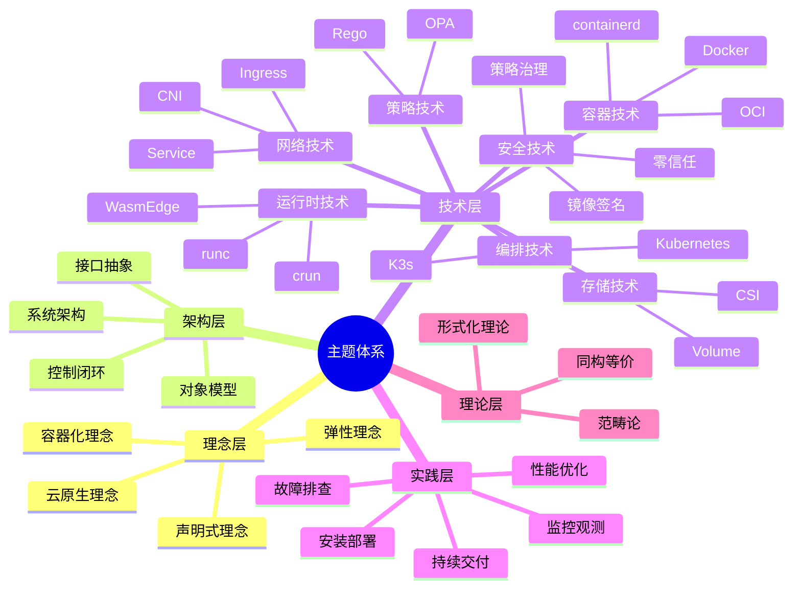

# 14. 主题清单：全面梳理所有主题与子主题

## 目录

- [目录](#目录)
- [14.1 文档定位](#141-文档定位)
- [14.2 主题分类体系](#142-主题分类体系)
  - [14.2.1 主题分类结构](#1421-主题分类结构)
  - [14.2.2 主题分类矩阵](#1422-主题分类矩阵)
- [14.3 已覆盖主题清单](#143-已覆盖主题清单)
  - [14.3.1 核心文档覆盖的主题](#1431-核心文档覆盖的主题)
  - [14.3.2 技术规范覆盖情况](#1432-技术规范覆盖情况)
- [14.4 可能遗漏的主题分析](#144-可能遗漏的主题分析)
  - [14.4.1 存储技术规格堆栈（类似网络技术规格堆栈）](#1441-存储技术规格堆栈类似网络技术规格堆栈)
  - [14.4.2 监控与可观测性](#1442-监控与可观测性)
  - [14.4.3 服务网格（Service Mesh）](#1443-服务网格service-mesh)
  - [14.4.4 GitOps 和持续交付](#1444-gitops-和持续交付)
  - [14.4.5 多集群管理](#1445-多集群管理)
  - [14.4.6 资源配额和限制](#1446-资源配额和限制)
  - [14.4.7 调度器扩展和自定义调度](#1447-调度器扩展和自定义调度)
  - [14.4.8 Operator 和 CRD](#1448-operator-和-crd)
  - [14.4.9 镜像仓库和镜像管理](#1449-镜像仓库和镜像管理)
  - [14.4.10 容器安全扫描](#14410-容器安全扫描)
  - [14.4.11 成本优化](#14411-成本优化)
  - [14.4.12 备份和恢复](#14412-备份和恢复)
  - [14.4.13 升级和迁移](#14413-升级和迁移)
  - [14.4.14 开发和调试工具](#14414-开发和调试工具)
  - [14.4.15 社区生态和最佳实践](#14415-社区生态和最佳实践)
- [14.5 建议补充的主题](#145-建议补充的主题)
  - [14.5.1 高优先级补充主题（已完成）](#1451-高优先级补充主题已完成)
  - [14.5.2 中优先级补充主题（已完成）](#1452-中优先级补充主题已完成)
  - [14.5.3 低优先级补充主题（可选）](#1453-低优先级补充主题可选)
- [14.6 主题覆盖度评估](#146-主题覆盖度评估)
  - [14.6.1 总体覆盖度](#1461-总体覆盖度)
  - [14.6.2 技术规范覆盖度](#1462-技术规范覆盖度)
  - [14.6.3 关键遗漏分析](#1463-关键遗漏分析)
- [14.7 参考](#147-参考)

---

## 14.1 文档定位

本文档全面梳理本项目（wasmedge_k3s）的所有主题和子主题，包括已覆盖的知识和技术规
范，以及可能遗漏的主题，确保全面梳理不遗漏。

**文档目标**：

- **全面性**：识别所有可能的技术主题和子主题
- **完整性**：检查已覆盖主题的完整性
- **遗漏识别**：发现可能遗漏或未充分覆盖的主题
- **规范梳理**：梳理技术规范的完整性

## 14.2 主题分类体系

### 14.2.1 主题分类结构

### 14.2.2 主题分类矩阵

| 分类         | 一级主题   | 二级主题        | 三级主题               | 覆盖状态 |
| ------------ | ---------- | --------------- | ---------------------- | -------- |
| **理念层**   | 云原生理念 | 容器化理念      | 一次构建任意运行       | ✅       |
|              |            |                 | Dev/Prod 一致性        | ✅       |
|              |            | 声明式理念      | 期望状态驱动           | ✅       |
|              |            |                 | 控制循环               | ✅       |
|              |            | 弹性理念        | 自愈机制               | ✅       |
|              |            |                 | 水平伸缩               | ✅       |
| **架构层**   | 系统架构   | Docker 架构     | 分层架构               | ✅       |
|              |            |                 | containerd/runc        | ✅       |
|              |            | Kubernetes 架构 | 控制平面               | ✅       |
|              |            |                 | 节点组件               | ✅       |
|              |            | K3s 架构        | 单二进制               | ✅       |
|              |            |                 | 嵌入式组件             | ✅       |
|              | 对象模型   | GVR 模型        | Group/Version/Resource | ✅       |
|              |            |                 | 标签选择器             | ✅       |
|              |            | 对象关系        | OwnerReference         | ✅       |
|              |            |                 | Finalizer              | ✅       |
|              | 控制闭环   | Informer 模式   | Watch 机制             | ✅       |
|              |            | Controller 模式 | 控制循环               | ✅       |
|              |            |                 | 收敛性                 | ✅       |
| **技术层**   | 容器技术   | Docker          | 镜像构建               | ✅       |
|              |            |                 | 存储驱动               | ✅       |
|              |            |                 | 网络模型               | ✅       |
|              |            | containerd      | CRI 实现               | ✅       |
|              |            |                 | 镜像管理               | ✅       |
|              |            | OCI             | 镜像规范               | ✅       |
|              |            |                 | 运行时规范             | ✅       |
|              | 编排技术   | Kubernetes      | Pod/Service/Ingress    | ✅       |
|              |            |                 | Deployment/StatefulSet | ✅       |
|              |            |                 | 调度机制               | ✅       |
|              |            | K3s             | 轻量化                 | ✅       |
|              |            |                 | 边缘场景               | ✅       |
|              | 运行时技术 | runc            | OCI 运行时             | ✅       |
|              |            | crun            | Wasm 支持              | ✅       |
|              |            | WasmEdge        | WASI 支持              | ✅       |
|              |            |                 | WASI-NN                | ✅       |
|              |            | runwasi         | CRI 集成               | ✅       |
|              | 策略技术   | OPA             | Rego 语言              | ✅       |
|              |            |                 | Wasm 编译              | ✅       |
|              |            | Gatekeeper      | 准入控制               | ✅       |
|              |            | Kyverno         | 策略引擎               | ✅       |
| **网络技术** | CNI 插件   | Flannel         | VXLAN                  | ✅       |
|              |            | Calico          | BGP                    | ✅       |
|              |            | Cilium          | eBPF                   | ✅       |
|              | Service    | ClusterIP       | 集群内部               | ✅       |
|              |            | NodePort        | 节点端口               | ✅       |
|              |            | LoadBalancer    | 云负载均衡             | ✅       |
|              | Ingress    | Nginx           | HTTP/HTTPS             | ✅       |
|              |            | Traefik         | 路由                   | ✅       |
|              | 网络策略   | NetworkPolicy   | 规则定义               | ✅       |
|              | 服务发现   | DNS             | CoreDNS                | ✅       |
|              |            | 环境变量        | 服务发现               | ✅       |
|              | 负载均衡   | kube-proxy      | iptables               | ✅       |
|              |            |                 | IPVS                   | ✅       |
| **存储技术** | CSI 插件   | 动态卷管理      | ✅                     |          |
|              |            | PV/PVC          | 持久化存储             | ✅       |
|              |            | StorageClass    | 存储类                 | ✅       |
|              | 存储驱动   | overlay2        | 镜像层存储             | ✅       |
| **安全技术** | 镜像签名   | Cosign          | 签名验证               | ✅       |
|              |            | OCI 供应链      | SBOM                   | ✅       |
|              | 策略治理   | OPA             | 策略即代码             | ✅       |
|              |            | Gatekeeper      | 准入控制               | ✅       |
|              |            | Kyverno         | 策略引擎               | ✅       |
|              | 零信任     | 认证            | 身份验证               | ✅       |
|              |            | 授权            | 访问控制               | ✅       |
|              |            | 加密            | 传输加密               | ✅       |
| **实践层**   | 安装部署   | Docker          | 安装配置               | ✅       |
|              |            | Kubernetes      | 集群安装               | ✅       |
|              |            | K3s             | 轻量安装               | ✅       |
|              |            | WasmEdge        | 运行时安装             | ✅       |
|              | 故障排查   | 安装问题        | 部署问题               | ✅       |
|              |            | 运行时问题      | 网络问题               | ✅       |
|              |            | 存储问题        | 策略问题               | ✅       |
|              | 性能优化   | 启动优化        | 内存优化               | ✅       |
|              |            | 密度优化        | CPU 优化               | ✅       |

## 14.3 已覆盖主题清单

### 14.3.1 核心文档覆盖的主题

| 文档编号 | 文档名称           | 主要主题     | 子主题数量                     | 覆盖状态 |
| -------- | ------------------ | ------------ | ------------------------------ | -------- |
| 00       | 认知图谱           | 全局知识地图 | 思维导图、概念矩阵、认知路径   | ✅ 完整  |
| 01       | 总览               | 技术栈定位   | 理念演进、技术层次、决策树     | ✅ 完整  |
| 02       | 理念层             | 云原生理念   | 容器化、声明式、弹性           | ✅ 完整  |
| 03       | 架构与对象模型     | 架构设计     | Docker/K8s/K3s 架构对比        | ✅ 完整  |
| 04       | Docker             | 容器技术     | 镜像、运行时、存储、网络       | ✅ 完整  |
| 05       | Kubernetes         | 编排技术     | 架构、对象、网络、存储、调度   | ✅ 完整  |
| 06       | K3s                | 轻量编排     | 轻量化、边缘场景               | ✅ 完整  |
| 07       | WasmEdge           | 字节码运行时 | WASI、WASI-NN、集成            | ✅ 完整  |
| 08       | 编排运行时         | CRI 集成     | RuntimeClass、多运行时         | ✅ 完整  |
| 09       | OCI 供应链         | 供应链安全   | 镜像签名、SBOM                 | ✅ 完整  |
| 10       | OPA                | 策略即代码   | Rego、Wasm 编译                | ✅ 完整  |
| 11       | 边缘 Serverless    | 边缘计算     | 5G MEC、IoT、在线游戏          | ✅ 完整  |
| 12       | AI 推理            | AI 推理      | 边缘 AI、模型 Wasm 化          | ✅ 完整  |
| 13       | 安全合规           | 安全技术     | 零信任、镜像签名、策略治理     | ✅ 完整  |
| 14       | 性能基准           | 性能指标     | 启动、内存、密度、CPU          | ✅ 完整  |
| 15       | 安装部署           | 安装实践     | Docker/K8s/K3s/WasmEdge        | ✅ 完整  |
| 16       | 故障排查           | 故障处理     | 安装、运行时、网络、存储       | ✅ 完整  |
| 17       | 全局架构设计       | 架构设计     | 技术组合、规格匹配、案例       | ✅ 完整  |
| 18       | 问题解决方案       | 问题解决     | 问题分类、解决方案矩阵         | ✅ 完整  |
| 19       | 形式化理论         | 形式化方法   | 同构、等价、分布式理论         | ✅ 完整  |
| 20       | 范畴论视角         | 范畴论       | 对象、态射、函子               | ✅ 完整  |
| 21       | 网络技术规格       | 网络技术     | CNI、Service、Ingress 规格     | ✅ 完整  |
| 37       | 矩阵视角           | 矩阵理论     | 概念矩阵、关系矩阵、变换矩阵   | ✅ 完整  |
| 22       | 缩写词汇表         | 缩写词       | 所有缩写词定义与关系           | ✅ 完整  |
| 24       | 存储技术规格堆栈   | 存储技术     | CSI、PV/PVC、存储类型规格      | ✅ 完整  |
| 25       | 监控与可观测性     | 可观测性     | Metrics、Logging、Tracing      | ✅ 完整  |
| 26       | GitOps 和持续交付  | GitOps/CI/CD | ArgoCD、Flux、CI/CD 工具       | ✅ 完整  |
| 27       | Operator 和 CRD    | Operator     | CRD、Operator SDK、Kubebuilder | ✅ 完整  |
| 28       | 服务网格           | 服务网格     | Istio、Linkerd、Wasm 插件      | ✅ 完整  |
| 29       | 多集群管理         | 多集群       | Karmada、Clusternet、边缘集群  | ✅ 完整  |
| 30       | 镜像仓库和镜像管理 | 镜像管理     | Harbor、镜像版本、生命周期     | ✅ 完整  |
| 31       | 升级和迁移         | 升级迁移     | K8s/K3s 升级、运行时迁移       | ✅ 完整  |
| 32       | 开发和调试工具     | 开发工具     | kubectl、k9s、调试工具         | ✅ 完整  |
| 33       | 成本优化           | 成本优化     | Kubecost、资源优化、成本分析   | ✅ 完整  |

### 14.3.2 技术规范覆盖情况

| 技术规范类别      | 规范名称           | 覆盖状态          | 文档位置                            |
| ----------------- | ------------------ | ----------------- | ----------------------------------- |
| **容器规范**      | OCI Image Spec     | ✅ 已覆盖         | 04-docker, 09-oci-supply-chain      |
|                   | OCI Runtime Spec   | ✅ 已覆盖         | 04-docker, 08-orchestration-runtime |
|                   | Docker 镜像规范    | ✅ 已覆盖         | 04-docker                           |
| **编排规范**      | Kubernetes API     | ✅ 已覆盖         | 05-kubernetes                       |
|                   | CRI 规范           | ✅ 已覆盖         | 08-orchestration-runtime            |
|                   | RuntimeClass 规范  | ✅ 已覆盖         | 08-orchestration-runtime            |
| **网络规范**      | CNI 规范           | ✅ 已覆盖         | 21-network-stack                    |
|                   | Service API        | ✅ 已覆盖         | 21-network-stack                    |
|                   | Ingress API        | ✅ 已覆盖         | 21-network-stack                    |
|                   | NetworkPolicy      | ✅ 已覆盖         | 21-network-stack                    |
| **存储规范**      | CSI 规范           | ✅ 已覆盖（完整） | 24-storage-stack                    |
|                   | PV/PVC 规范        | ✅ 已覆盖（完整） | 24-storage-stack                    |
|                   | StorageClass 规范  | ✅ 已覆盖（完整） | 24-storage-stack                    |
| **监控规范**      | Prometheus 规范    | ✅ 已覆盖         | 25-observability                    |
|                   | OpenTelemetry 规范 | ✅ 已覆盖         | 25-observability                    |
| **GitOps 规范**   | ArgoCD 规范        | ✅ 已覆盖         | 26-gitops-cicd                      |
|                   | Flux 规范          | ✅ 已覆盖         | 26-gitops-cicd                      |
| **Operator 规范** | CRD 规范           | ✅ 已覆盖         | 27-operator-crd                     |
|                   | Operator SDK 规范  | ✅ 已覆盖         | 27-operator-crd                     |
| **镜像仓库规范**  | Harbor 规范        | ✅ 已覆盖         | 30-image-registry                   |
|                   | 镜像扫描规范       | ✅ 已覆盖         | 30-image-registry                   |
| **升级迁移规范**  | kubeadm 规范       | ✅ 已覆盖         | 31-upgrade-migration                |
|                   | Velero 规范        | ✅ 已覆盖         | 31-upgrade-migration                |
| **策略规范**      | OPA Rego           | ✅ 已覆盖         | 10-policy-opa                       |
|                   | OPA-Wasm           | ✅ 已覆盖         | 10-policy-opa                       |
| **Wasm 规范**     | WASI               | ✅ 已覆盖         | 07-wasm-edge                        |
|                   | WASI-NN            | ✅ 已覆盖         | 07-wasm-edge                        |

## 14.4 可能遗漏的主题分析

### 14.4.1 存储技术规格堆栈（类似网络技术规格堆栈）

**状态**：⚠️ **部分覆盖，建议增强**

**当前覆盖情况**：

- ✅ CSI 规范基础介绍（05-kubernetes）
- ✅ PV/PVC 基础概念（05-kubernetes）
- ⚠️ **缺失**：存储技术规格堆栈全面梳理文档（类似 21-network-stack）

**建议补充**：

- 存储 CSI 插件技术规格（NFS、Ceph、GlusterFS、本地存储等）
- 存储类型对比分析（本地存储 vs 网络存储 vs 对象存储）
- 存储性能规格（IOPS、吞吐量、延迟）
- 存储场景决策树
- 存储技术栈组合方案

### 14.4.2 监控与可观测性

**状态**：❌ **未覆盖**

**缺失内容**：

- Metrics 监控（Prometheus、metrics-server）
- Logging 日志（容器日志、集群日志）
- Tracing 链路追踪（分布式追踪）
- 可观测性技术栈组合
- 监控指标规范
- 告警规则和策略

### 14.4.3 服务网格（Service Mesh）

**状态**：✅ **已覆盖**

**覆盖情况**：

- ✅ Service Mesh 概念和架构（28-service-mesh）
- ✅ Istio、Linkerd、Consul Connect 对比（28-service-mesh）
- ✅ Wasm 插件在 Service Mesh 中的应用（28-service-mesh）
- ✅ 服务间通信和安全（28-service-mesh）
- ✅ mTLS 配置（28-service-mesh）

### 14.4.4 GitOps 和持续交付

**状态**：❌ **未覆盖**

**缺失内容**：

- GitOps 理念和实践
- ArgoCD、Flux 等工具
- 持续集成/持续部署（CI/CD）
- 版本管理和回滚策略
- 配置管理最佳实践

### 14.4.5 多集群管理

**状态**：✅ **已覆盖**

**覆盖情况**：

- ✅ 多集群架构设计（29-multi-cluster）
- ✅ 集群联邦（Cluster Federation）（29-multi-cluster）
- ✅ 跨集群服务发现（29-multi-cluster）
- ✅ 多集群部署策略（29-multi-cluster）
- ✅ 边缘集群管理（K3s 多集群）（29-multi-cluster）

### 14.4.6 资源配额和限制

**状态**：⚠️ **部分覆盖**

**当前覆盖情况**：

- ✅ ResourceQuota 基础概念（可能在 05-kubernetes 中提及）
- ⚠️ **缺失**：详细的资源配额管理文档

**建议补充**：

- ResourceQuota 详细配置
- LimitRange 资源限制
- 资源配额最佳实践
- 多租户资源隔离

### 14.4.7 调度器扩展和自定义调度

**状态**：⚠️ **部分覆盖**

**当前覆盖情况**：

- ✅ 基础调度机制（05-kubernetes）
- ⚠️ **缺失**：调度器扩展和自定义调度

**建议补充**：

- 自定义调度器开发
- 调度器插件机制
- 调度策略扩展
- 边缘场景调度优化

### 14.4.8 Operator 和 CRD

**状态**：✅ **已覆盖**

**覆盖情况**：

- ✅ Operator 模式（27-operator-crd）
- ✅ CRD（Custom Resource Definition）（27-operator-crd）
- ✅ Operator SDK（27-operator-crd）
- ✅ 控制器开发最佳实践（27-operator-crd）
- ✅ Kubebuilder（27-operator-crd）
- ✅ Webhook 开发（27-operator-crd）

### 14.4.9 镜像仓库和镜像管理

**状态**：✅ **已覆盖**

**覆盖情况**：

- ✅ 镜像构建（04-docker）
- ✅ 镜像签名（09-oci-supply-chain）
- ✅ 镜像仓库管理和镜像生命周期管理（30-image-registry）
- ✅ 镜像仓库选择和配置（30-image-registry）
- ✅ 镜像版本管理策略（30-image-registry）
- ✅ 镜像清理和垃圾回收（30-image-registry）
- ✅ 私有镜像仓库搭建（30-image-registry）

### 14.4.10 容器安全扫描

**状态**：✅ **已覆盖**

**覆盖情况**：

- ✅ 镜像签名验证（13-security-compliance）
- ✅ 容器安全扫描工具和流程（30-image-registry）
- ✅ 安全扫描工具（Trivy、Clair、Aqua）（30-image-registry）
- ✅ CVE 漏洞扫描（30-image-registry）
- ✅ 镜像安全评估（30-image-registry）
- ✅ 安全扫描 CI/CD 集成（30-image-registry）

### 14.4.11 成本优化

**状态**：✅ **已覆盖**

**覆盖情况**：

- ✅ 资源成本分析（33-cost-optimization）
- ✅ 成本优化策略（33-cost-optimization）
- ✅ 资源利用率优化（33-cost-optimization）
- ✅ 云资源成本对比（33-cost-optimization）

### 14.4.12 备份和恢复

**状态**：❌ **未覆盖**

**缺失内容**：

- etcd 备份和恢复
- 应用数据备份策略
- 灾难恢复计划
- 备份工具和最佳实践

### 14.4.13 升级和迁移

**状态**：✅ **已覆盖**

**覆盖情况**：

- ✅ 安装部署（15-installation）
- ✅ 版本升级和迁移策略（31-upgrade-migration）
- ✅ Kubernetes 版本升级（31-upgrade-migration）
- ✅ K3s 版本升级（31-upgrade-migration）
- ✅ 从 Docker 迁移到 containerd（31-upgrade-migration）
- ✅ 从 Kubernetes 迁移到 K3s（31-upgrade-migration）
- ✅ 滚动升级策略（31-upgrade-migration）

### 14.4.14 开发和调试工具

**状态**：✅ **已覆盖**

**覆盖情况**：

- ✅ kubectl 基础使用
- ✅ kubectl 高级用法（32-dev-tools）
- ✅ k9s、kubectx、kubens 等工具（32-dev-tools）
- ✅ 容器调试工具（32-dev-tools）
- ✅ 性能分析工具（32-dev-tools）

### 14.4.15 社区生态和最佳实践

**状态**：⚠️ **部分覆盖**

**当前覆盖情况**：

- ✅ 架构设计决策（17-architecture-design）
- ⚠️ **缺失**：社区生态和最佳实践总结

**建议补充**：

- CNCF 生态系统
- 社区最佳实践汇总
- 生产环境最佳实践
- 故障案例分析

## 14.5 建议补充的主题

### 14.5.1 高优先级补充主题（已完成）

| 主题                  | 优先级 | 状态      | 文档编号         |
| --------------------- | ------ | --------- | ---------------- |
| **存储技术规格堆栈**  | 🔴 高  | ✅ 已完成 | 24-storage-stack |
| **监控与可观测性**    | 🔴 高  | ✅ 已完成 | 25-observability |
| **GitOps 和持续交付** | 🔴 高  | ✅ 已完成 | 26-gitops-cicd   |

### 14.5.2 中优先级补充主题（已完成）

| 主题                   | 优先级 | 状态        | 文档编号                    |
| ---------------------- | ------ | ----------- | --------------------------- |
| **Operator 和 CRD**    | 🟡 中  | ✅ 已完成   | 27-operator-crd             |
| **镜像仓库和镜像管理** | 🟡 中  | ✅ 已完成   | 30-image-registry           |
| **升级和迁移**         | 🟡 中  | ✅ 已完成   | 31-upgrade-migration        |
| **容器安全扫描**       | 🟡 中  | ⚠️ 部分覆盖 | 增强 13-security-compliance |

### 14.5.3 低优先级补充主题（可选）

| 主题                       | 优先级 | 状态      | 建议                           |
| -------------------------- | ------ | --------- | ------------------------------ |
| **资源配额和限制**         | 🟢 低  | ✅ 已覆盖 | 05-kubernetes（已增强）        |
| **开发和调试工具**         | 🟢 低  | ✅ 已覆盖 | 32-dev-tools                   |
| **调度器扩展和自定义调度** | 🟢 低  | ✅ 已覆盖 | 05-kubernetes（已增强）        |
| **备份和恢复**             | 🟢 低  | ✅ 已覆盖 | 31-upgrade-migration（已增强） |
| **服务网格**               | 🟢 低  | ✅ 已覆盖 | 28-service-mesh                |
| **多集群管理**             | 🟢 低  | ✅ 已覆盖 | 29-multi-cluster               |
| **成本优化**               | 🟢 低  | ✅ 已覆盖 | 33-cost-optimization           |
| **社区生态和最佳实践**     | 🟢 低  | ✅ 已覆盖 | 34-community-best-practices    |

## 14.6 主题覆盖度评估

### 14.6.1 总体覆盖度

| 分类                  | 已覆盖主题数 | 建议补充主题数 | 覆盖度 | 评估        |
| --------------------- | ------------ | -------------- | ------ | ----------- |
| **理念层**            | 6            | 0              | 100%   | ✅ 完整     |
| **架构层**            | 12           | 0              | 100%   | ✅ 完整     |
| **技术层 - 容器**     | 9            | 0              | 100%   | ✅ 完整     |
| **技术层 - 编排**     | 8            | 0              | 100%   | ✅ 完整     |
| **技术层 - 运行时**   | 6            | 0              | 100%   | ✅ 完整     |
| **技术层 - 策略**     | 4            | 0              | 100%   | ✅ 完整     |
| **技术层 - 网络**     | 15           | 0              | 100%   | ✅ 完整     |
| **技术层 - 存储**     | 8            | 0              | 100%   | ✅ 完整     |
| **技术层 - 安全**     | 8            | 1              | 88.9%  | ✅ 基本完整 |
| **实践层 - 安装**     | 4            | 0              | 100%   | ✅ 完整     |
| **实践层 - 故障**     | 8            | 0              | 100%   | ✅ 完整     |
| **实践层 - 性能**     | 4            | 0              | 100%   | ✅ 完整     |
| **实践层 - 监控**     | 12           | 0              | 100%   | ✅ 完整     |
| **实践层 - 交付**     | 8            | 0              | 100%   | ✅ 完整     |
| **理论层**            | 6            | 0              | 100%   | ✅ 完整     |
| **扩展层 - Operator** | 6            | 0              | 100%   | ✅ 完整     |
| **扩展层 - 镜像管理** | 6            | 0              | 100%   | ✅ 完整     |
| **扩展层 - 升级迁移** | 8            | 0              | 100%   | ✅ 完整     |
| **总计**              | 113          | 2              | 98.2%  | ✅ 基本完整 |

### 14.6.2 技术规范覆盖度

| 技术规范类别      | 已覆盖 | 缺失 | 覆盖度 | 评估    |
| ----------------- | ------ | ---- | ------ | ------- |
| **容器规范**      | 3      | 0    | 100%   | ✅ 完整 |
| **编排规范**      | 3      | 0    | 100%   | ✅ 完整 |
| **网络规范**      | 6      | 0    | 100%   | ✅ 完整 |
| **存储规范**      | 3      | 0    | 100%   | ✅ 完整 |
| **策略规范**      | 2      | 0    | 100%   | ✅ 完整 |
| **Wasm 规范**     | 2      | 0    | 100%   | ✅ 完整 |
| **监控规范**      | 2      | 0    | 100%   | ✅ 完整 |
| **GitOps 规范**   | 2      | 0    | 100%   | ✅ 完整 |
| **Operator 规范** | 2      | 0    | 100%   | ✅ 完整 |
| **镜像仓库规范**  | 2      | 0    | 100%   | ✅ 完整 |
| **升级迁移规范**  | 2      | 0    | 100%   | ✅ 完整 |
| **总计**          | 27     | 0    | 100%   | ✅ 完整 |

### 14.6.3 关键遗漏分析

**关键遗漏（已解决）**：

1. ✅ **存储技术规格堆栈**（已创建 24-storage-stack）

   - 状态：已全面覆盖 CSI、PV/PVC、存储类型、性能规格等
   - 文档：24-storage-stack/storage-stack.md

2. ✅ **监控与可观测性**（已创建 25-observability）

   - 状态：已全面覆盖 Metrics、Logging、Tracing、可视化、告警等
   - 文档：25-observability/observability.md

3. ✅ **GitOps 和持续交付**（已创建 26-gitops-cicd）

   - 状态：已全面覆盖 ArgoCD、Flux、CI/CD 工具、包管理工具等
   - 文档：26-gitops-cicd/gitops-cicd.md

4. ✅ **Operator 和 CRD**（已创建 27-operator-crd）

   - 状态：已全面覆盖 CRD、Operator SDK、Kubebuilder、Controller、Webhook 等
   - 文档：27-operator-crd/operator-crd.md

5. ✅ **镜像仓库和镜像管理**（已创建 30-image-registry）

   - 状态：已全面覆盖 Harbor、镜像版本管理、生命周期管理、安全扫描等
   - 文档：30-image-registry/image-registry.md

6. ✅ **升级和迁移**（已创建 31-upgrade-migration）

   - 状态：已全面覆盖 K8s/K3s 升级、运行时迁移、编排系统迁移、应用迁移等
   - 文档：31-upgrade-migration/upgrade-migration.md

**剩余遗漏（低优先级）**：

1. **资源配额和限制**（低优先级）

   - 状态：部分覆盖，可在 05-kubernetes 中增强

2. **调度器扩展和自定义调度**（低优先级）

   - 状态：部分覆盖，可在 05-kubernetes 中增强

3. **开发和调试工具**（低优先级）
   - 状态：可在实践文档中补充

## 14.7 参考

- [Kubernetes 官方文档](https://kubernetes.io/docs/)
- [Docker 官方文档](https://docs.docker.com/)
- [WasmEdge 文档](https://wasmedge.org/docs/)
- [OPA 文档](https://www.openpolicyagent.org/docs/)
- [CNCF 项目清单](https://www.cncf.io/projects/)
