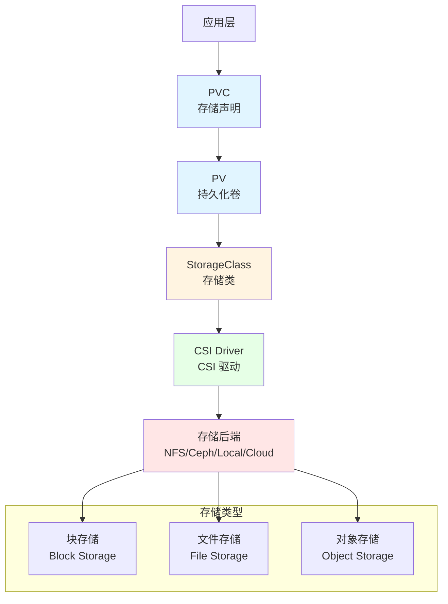

# 15. 存储技术规格堆栈：全面梳理

## 📑 目录

- [📑 目录](#-目录)
- [15.1 文档定位](#151-文档定位)
- [15.2 存储技术栈全景](#152-存储技术栈全景)
  - [15.2.1 存储层次结构](#1521-存储层次结构)
  - [15.2.2 技术组件矩阵](#1522-技术组件矩阵)
  - [15.2.3 技术栈组合](#1523-技术栈组合)
- [15.3 CSI 插件技术规格](#153-csi-插件技术规格)
  - [15.3.1 CSI 规范](#1531-csi-规范)
  - [15.3.2 NFS CSI 规格](#1532-nfs-csi-规格)
  - [15.3.3 Ceph CSI 规格](#1533-ceph-csi-规格)
  - [15.3.4 Longhorn CSI 规格](#1534-longhorn-csi-规格)
  - [15.3.5 本地存储 CSI 规格](#1535-本地存储-csi-规格)
  - [15.3.6 云存储 CSI 规格](#1536-云存储-csi-规格)
  - [15.3.7 CSI 插件对比](#1537-csi-插件对比)
- [15.4 存储类型技术规格](#154-存储类型技术规格)
  - [15.4.1 块存储规格](#1541-块存储规格)
  - [15.4.2 文件存储规格](#1542-文件存储规格)
  - [15.4.3 对象存储规格](#1543-对象存储规格)
  - [15.4.4 存储类型对比](#1544-存储类型对比)
- [15.5 PV/PVC 技术规格](#155-pvpvc-技术规格)
  - [15.5.1 PersistentVolume 规格](#1551-persistentvolume-规格)
  - [15.5.2 PersistentVolumeClaim 规格](#1552-persistentvolumeclaim-规格)
  - [15.5.3 StorageClass 规格](#1553-storageclass-规格)
  - [15.5.4 动态供给规格](#1554-动态供给规格)
  - [15.5.5 静态供给规格](#1555-静态供给规格)
- [15.6 存储卷模式技术规格](#156-存储卷模式技术规格)
  - [15.6.1 Filesystem 模式](#1561-filesystem-模式)
  - [15.6.2 Block 模式](#1562-block-模式)
  - [15.6.3 存储卷模式对比](#1563-存储卷模式对比)
- [15.7 存储访问模式技术规格](#157-存储访问模式技术规格)
  - [15.7.1 ReadWriteOnce](#1571-readwriteonce)
  - [15.7.2 ReadOnlyMany](#1572-readonlymany)
  - [15.7.3 ReadWriteMany](#1573-readwritemany)
  - [15.7.4 ReadWriteOncePod](#1574-readwriteoncepod)
  - [15.7.5 访问模式对比](#1575-访问模式对比)
- [15.8 存储拓扑技术规格](#158-存储拓扑技术规格)
  - [15.8.1 单节点存储拓扑](#1581-单节点存储拓扑)
  - [15.8.2 多节点存储拓扑](#1582-多节点存储拓扑)
  - [15.8.3 分布式存储拓扑](#1583-分布式存储拓扑)
  - [15.8.4 边缘存储拓扑](#1584-边缘存储拓扑)
- [15.9 存储性能规格](#159-存储性能规格)
  - [15.9.1 IOPS 规格](#1591-iops-规格)
  - [15.9.2 吞吐量规格](#1592-吞吐量规格)
  - [15.9.3 延迟规格](#1593-延迟规格)
  - [15.9.4 性能对比](#1594-性能对比)
- [15.10 存储技术栈组合方案](#1510-存储技术栈组合方案)
  - [15.10.1 小规模集群组合](#15101-小规模集群组合)
  - [15.10.2 大规模集群组合](#15102-大规模集群组合)
  - [15.10.3 边缘计算组合](#15103-边缘计算组合)
  - [15.10.4 高性能组合](#15104-高性能组合)
  - [15.10.5 云原生组合](#15105-云原生组合)
- [15.11 存储接口规范](#1511-存储接口规范)
  - [15.11.1 CSI 接口规范](#15111-csi-接口规范)
  - [15.11.2 Storage API 规范](#15112-storage-api-规范)
  - [15.11.3 VolumeSnapshot API 规范](#15113-volumesnapshot-api-规范)
- [15.12 实际部署案例](#1512-实际部署案例)
  - [15.12.1 案例 1：K3s 配置本地存储](#15121-案例-1k3s-配置本地存储)
  - [15.12.2 案例 2：配置 NFS 存储](#15122-案例-2配置-nfs-存储)
  - [15.12.3 案例 3：配置 Ceph RBD 存储](#15123-案例-3配置-ceph-rbd-存储)
- [15.13 存储最佳实践](#1513-存储最佳实践)
  - [15.13.1 CSI 驱动最佳实践](#15131-csi-驱动最佳实践)
  - [15.13.2 PV/PVC 最佳实践](#15132-pvpvc-最佳实践)
  - [15.13.3 存储性能最佳实践](#15133-存储性能最佳实践)
  - [15.13.4 存储检查清单](#15134-存储检查清单)
- [15.14 存储故障排查](#1514-存储故障排查)
  - [15.14.1 常见问题](#15141-常见问题)
- [15.15 参考](#1515-参考)
  - [15.15.1 2025 年最新更新（2025-11-06）](#15151-2025-年最新更新2025-11-06)
  - [15.15.2 隔离栈相关文档](#15152-隔离栈相关文档)
  - [15.15.3 存储相关文档](#15153-存储相关文档)

---

## 15.1 文档定位

本文档全面梳理云原生容器技术栈中的存储技术、规格和堆栈组合方案，包括 CSI 插件
、PV/PVC、StorageClass、存储类型、存储卷模式、访问模式等存储技术的详细规格和技术
栈组合方案。

**文档结构**：

- **存储技术栈全景**：存储层次结构、技术组件矩阵、技术栈组合
- **CSI 插件技术规格**：NFS、Ceph、Longhorn、本地存储、云存储等 CSI 插件的详细规
  格
- **存储类型技术规格**：块存储、文件存储、对象存储的详细规格
- **PV/PVC 技术规格**：PersistentVolume、PersistentVolumeClaim、StorageClass 规
  格
- **存储卷模式技术规格**：Filesystem、Block 模式规格
- **存储访问模式技术规
  格**：ReadWriteOnce、ReadOnlyMany、ReadWriteMany、ReadWriteOncePod
- **存储拓扑技术规格**：单节点、多节点、分布式、边缘存储拓扑
- **存储性能规格**：IOPS、吞吐量、延迟、性能对比
- **存储技术栈组合方案**：不同场景的存储技术栈组合
- **存储接口规范**：CSI、Storage API、VolumeSnapshot API 规范

## 15.2 存储技术栈全景

### 15.2.1 存储层次结构

**存储层次结构**：



**存储层次定义**：

| 层次       | 定义         | 技术                       | 功能                   |
| ---------- | ------------ | -------------------------- | ---------------------- |
| **应用层** | 应用使用存储 | PVC                        | 存储请求声明           |
| **编排层** | 存储编排     | PV、StorageClass           | 存储资源管理和动态分配 |
| **驱动层** | 存储驱动     | CSI Driver                 | 存储后端接口实现       |
| **存储层** | 存储后端     | NFS、Ceph、Local、Cloud    | 实际存储提供           |
| **类型层** | 存储类型     | 块存储、文件存储、对象存储 | 不同存储访问模式       |

### 15.2.2 技术组件矩阵

**存储技术组件矩阵**：

| 组件类别     | 技术           | 定位                    | 成熟度     | 生产验证   |
| ------------ | -------------- | ----------------------- | ---------- | ---------- |
| **CSI 驱动** | NFS CSI        | 文件存储 CSI 驱动       | ⭐⭐⭐⭐   | ⭐⭐⭐⭐   |
|              | Ceph CSI       | 分布式存储 CSI 驱动     | ⭐⭐⭐⭐⭐ | ⭐⭐⭐⭐⭐ |
|              | Longhorn CSI   | 轻量分布式存储 CSI 驱动 | ⭐⭐⭐⭐   | ⭐⭐⭐⭐   |
|              | Local Path     | 本地路径存储 CSI 驱动   | ⭐⭐⭐⭐   | ⭐⭐⭐⭐   |
|              | AWS EBS CSI    | AWS 块存储 CSI 驱动     | ⭐⭐⭐⭐⭐ | ⭐⭐⭐⭐⭐ |
|              | Azure Disk CSI | Azure 块存储 CSI 驱动   | ⭐⭐⭐⭐⭐ | ⭐⭐⭐⭐⭐ |
|              | GCP PD CSI     | GCP 块存储 CSI 驱动     | ⭐⭐⭐⭐⭐ | ⭐⭐⭐⭐⭐ |
| **存储类型** | 块存储         | Block Storage           | ⭐⭐⭐⭐⭐ | ⭐⭐⭐⭐⭐ |
|              | 文件存储       | File Storage            | ⭐⭐⭐⭐⭐ | ⭐⭐⭐⭐⭐ |
|              | 对象存储       | Object Storage          | ⭐⭐⭐⭐   | ⭐⭐⭐⭐   |
| **存储后端** | NFS            | 网络文件系统            | ⭐⭐⭐⭐⭐ | ⭐⭐⭐⭐⭐ |
|              | Ceph           | 分布式存储系统          | ⭐⭐⭐⭐⭐ | ⭐⭐⭐⭐⭐ |
|              | GlusterFS      | 分布式文件系统          | ⭐⭐⭐⭐   | ⭐⭐⭐⭐   |
|              | Longhorn       | 轻量分布式存储          | ⭐⭐⭐⭐   | ⭐⭐⭐⭐   |
|              | Local Disk     | 本地磁盘存储            | ⭐⭐⭐⭐⭐ | ⭐⭐⭐⭐⭐ |
|              | Cloud Storage  | 云存储服务              | ⭐⭐⭐⭐⭐ | ⭐⭐⭐⭐⭐ |

### 15.2.3 技术栈组合

**存储技术栈组合方案**：

| 场景           | 存储类型   | CSI 驱动       | 存储后端    | 特点                     |
| -------------- | ---------- | -------------- | ----------- | ------------------------ |
| **小规模集群** | 文件存储   | NFS CSI        | NFS Server  | 简单易用、配置简单       |
| **大规模集群** | 分布式存储 | Ceph CSI       | Ceph        | 高性能、高可用、可扩展   |
| **边缘计算**   | 本地存储   | Local Path     | Local Disk  | 轻量级、低延迟           |
| **高性能场景** | 块存储     | Cloud CSI/本地 | SSD/NVMe    | 高性能、低延迟           |
| **云原生场景** | 云存储     | Cloud CSI      | EBS/PD/Disk | 与云平台集成、自动化管理 |

## 15.3 CSI 插件技术规格

### 15.3.1 CSI 规范

**CSI（Container Storage Interface）规范**：

**定义**：CSI 是容器编排系统（如 Kubernetes）与存储系统之间的标准化接口，用于解
耦存储实现和编排系统。

**核心组件**：

1. **CSI Driver**：存储驱动的实现，运行在 Kubernetes 集群中
2. **CSI Node Plugin**：节点插件，处理节点级别的存储操作
3. **CSI Controller Plugin**：控制器插件，处理集群级别的存储操作

**CSI 操作**：

| 操作                    | 功能           | 调用组件   |
| ----------------------- | -------------- | ---------- |
| **CreateVolume**        | 创建存储卷     | Controller |
| **DeleteVolume**        | 删除存储卷     | Controller |
| **NodePublishVolume**   | 在节点上挂载卷 | Node       |
| **NodeUnpublishVolume** | 在节点上卸载卷 | Node       |
| **NodeStageVolume**     | 在节点上准备卷 | Node       |
| **NodeUnstageVolume**   | 在节点上清理卷 | Node       |

**CSI 规范版本**：

- **CSI v1.0**：2019 年发布，基础 CSI 规范
- **CSI v1.1**：增加快照支持
- **CSI v1.2**：增加克隆支持
- **CSI v1.3**：增加存储容量跟踪
- **CSI v1.5**：增加存储卷健康监控
- **CSI v1.8**：增加存储卷服务（2024 年最新）

### 15.3.2 NFS CSI 规格

**NFS CSI Driver 规格**：

**技术特点**：

- ✅ 支持动态供给和静态供给
- ✅ 支持 ReadWriteMany 访问模式
- ✅ 支持存储卷快照和克隆
- ✅ 支持存储卷扩展

**版本信息**：

- **最新版本**：v4.0.0+（2024）
- **GitHub Stars**：500+
- **生产验证**：✅ 广泛使用

**配置示例**：

```yaml
apiVersion: storage.k8s.io/v1
kind: StorageClass
metadata:
  name: nfs-storage
provisioner: nfs.csi.k8s.io
parameters:
  server: nfs-server.example.com
  share: /exports
  mountOptions: "nfsvers=4.1"
allowVolumeExpansion: true
```

**适用场景**：

- ✅ 小规模集群
- ✅ 共享存储需求
- ✅ 多 Pod 读写同一存储

### 15.3.3 Ceph CSI 规格

**Ceph CSI Driver 规格**：

**技术特点**：

- ✅ 支持 RBD（块存储）和 CephFS（文件存储）
- ✅ 支持动态供给和静态供给
- ✅ 支持存储卷快照和克隆
- ✅ 支持存储卷扩展
- ✅ 支持多后端存储

**版本信息**：

- **最新版本**：v3.10.0+（2024）
- **GitHub Stars**：1.5K+
- **生产验证**：✅ 大规模生产使用

**配置示例**：

```yaml
apiVersion: storage.k8s.io/v1
kind: StorageClass
metadata:
  name: ceph-rbd
provisioner: rbd.csi.ceph.com
parameters:
  clusterID: ceph-cluster
  pool: k8s-pool
  imageFormat: "2"
  imageFeatures: layering
allowVolumeExpansion: true
```

**适用场景**：

- ✅ 大规模集群
- ✅ 高性能需求
- ✅ 高可用需求
- ✅ 分布式存储场景

### 15.3.4 Longhorn CSI 规格

**Longhorn CSI Driver 规格**：

**技术特点**：

- ✅ 轻量级分布式存储
- ✅ 支持动态供给
- ✅ 支持存储卷快照和备份
- ✅ 支持存储卷复制
- ✅ 易于部署和管理

**版本信息**：

- **最新版本**：v1.6.0+（2024）
- **GitHub Stars**：5K+
- **生产验证**：✅ 中等规模生产使用

**配置示例**：

```yaml
apiVersion: storage.k8s.io/v1
kind: StorageClass
metadata:
  name: longhorn
provisioner: driver.longhorn.io
allowVolumeExpansion: true
reclaimPolicy: Delete
volumeBindingMode: Immediate
```

**适用场景**：

- ✅ 中小规模集群
- ✅ 边缘计算场景
- ✅ 简单分布式存储需求

### 15.3.5 本地存储 CSI 规格

**Local Path Provisioner 规格**：

**技术特点**：

- ✅ 使用节点本地磁盘
- ✅ 支持动态供给
- ✅ 轻量级部署
- ✅ 低延迟

**版本信息**：

- **最新版本**：v0.0.24+（2024）
- **GitHub Stars**：1K+
- **生产验证**：✅ 边缘场景广泛使用

**配置示例**：

```yaml
apiVersion: storage.k8s.io/v1
kind: StorageClass
metadata:
  name: local-path
provisioner: rancher.io/local-path
volumeBindingMode: WaitForFirstConsumer
reclaimPolicy: Delete
```

**适用场景**：

- ✅ 边缘计算
- ✅ 单节点存储
- ✅ 低延迟需求
- ✅ K3s 场景

### 15.3.6 云存储 CSI 规格

**云存储 CSI Driver 规格**：

**AWS EBS CSI**：

- ✅ 支持 EBS 块存储
- ✅ 动态供给和快照
- ✅ 最新版本：v1.29.0+（2024）

**Azure Disk CSI**：

- ✅ 支持 Azure Managed Disk
- ✅ 动态供给和快照
- ✅ 最新版本：v1.29.0+（2024）

**GCP PD CSI**：

- ✅ 支持 Persistent Disk
- ✅ 动态供给和快照
- ✅ 最新版本：v1.16.0+（2024）

**配置示例（AWS EBS）**：

```yaml
apiVersion: storage.k8s.io/v1
kind: StorageClass
metadata:
  name: ebs-sc
provisioner: ebs.csi.aws.com
parameters:
  type: gp3
  encrypted: "true"
allowVolumeExpansion: true
```

**适用场景**：

- ✅ 云原生应用
- ✅ 与云平台深度集成
- ✅ 自动化存储管理

### 15.3.7 CSI 插件对比

**CSI 插件对比矩阵**：

| CSI 驱动        | 存储类型 | 访问模式支持 | 快照支持 | 克隆支持 | 扩展支持 | 成熟度     | 推荐场景         |
| --------------- | -------- | ------------ | -------- | -------- | -------- | ---------- | ---------------- |
| **NFS CSI**     | 文件存储 | RWO/RWX/ROX  | ✅       | ✅       | ✅       | ⭐⭐⭐⭐   | 小规模、共享存储 |
| **Ceph CSI**    | 块/文件  | RWO/RWX      | ✅       | ✅       | ✅       | ⭐⭐⭐⭐⭐ | 大规模、高性能   |
| **Longhorn**    | 块存储   | RWO          | ✅       | ✅       | ✅       | ⭐⭐⭐⭐   | 中小规模、简单   |
| **Local Path**  | 本地存储 | RWO          | ❌       | ❌       | ❌       | ⭐⭐⭐⭐   | 边缘、单节点     |
| **AWS EBS CSI** | 块存储   | RWO          | ✅       | ✅       | ✅       | ⭐⭐⭐⭐⭐ | AWS 云原生       |
| **Azure Disk**  | 块存储   | RWO          | ✅       | ✅       | ✅       | ⭐⭐⭐⭐⭐ | Azure 云原生     |
| **GCP PD CSI**  | 块存储   | RWO          | ✅       | ✅       | ✅       | ⭐⭐⭐⭐⭐ | GCP 云原生       |

## 15.4 存储类型技术规格

### 15.4.1 块存储规格

**块存储（Block Storage）规格**：

**定义**：块存储是将存储划分为固定大小的块，通过块设备接口访问的存储类型。

**特点**：

- ✅ 高性能、低延迟
- ✅ 支持 ReadWriteOnce 访问模式
- ✅ 适合数据库、高性能应用
- ❌ 不支持多 Pod 同时读写

**典型实现**：

- **Ceph RBD**：Ceph 块设备
- **AWS EBS**：AWS 弹性块存储
- **Azure Disk**：Azure 托管磁盘
- **GCP PD**：GCP 持久化磁盘
- **Longhorn**：Longhorn 块存储

**性能规格**：

| 存储后端          | IOPS      | 吞吐量          | 延迟    |
| ----------------- | --------- | --------------- | ------- |
| **Ceph RBD**      | 10K-100K+ | 500MB/s-1GB/s+  | 0.1-1ms |
| **AWS EBS gp3**   | 3K-16K    | 125MB/s-1GB/s   | < 1ms   |
| **Azure Premium** | 500-20K   | 60MB/s-500MB/s  | < 1ms   |
| **GCP PD SSD**    | 750-30K   | 48MB/s-480MB/s  | < 1ms   |
| **Longhorn**      | 1K-10K    | 100MB/s-500MB/s | 1-5ms   |

### 15.4.2 文件存储规格

**文件存储（File Storage）规格**：

**定义**：文件存储是通过文件系统接口访问的存储类型，支持多个客户端同时访问。

**特点**：

- ✅ 支持 ReadWriteMany 访问模式
- ✅ 支持多 Pod 同时读写
- ✅ 适合共享存储、内容管理
- ⚠️ 性能相对块存储较低

**典型实现**：

- **NFS**：网络文件系统
- **CephFS**：Ceph 文件系统
- **GlusterFS**：Gluster 文件系统

**性能规格**：

| 存储后端      | IOPS      | 吞吐量        | 延迟   |
| ------------- | --------- | ------------- | ------ |
| **NFS v4**    | 1K-10K    | 100MB/s-1GB/s | 1-10ms |
| **CephFS**    | 10K-100K+ | 500MB/s-5GB/s | 1-5ms  |
| **GlusterFS** | 5K-50K    | 200MB/s-2GB/s | 2-10ms |

### 15.4.3 对象存储规格

**对象存储（Object Storage）规格**：

**定义**：对象存储是通过 HTTP/HTTPS API 访问的存储类型，以对象为单位存储数据。

**特点**：

- ✅ 高可扩展性
- ✅ 适合大数据、归档存储
- ✅ 支持版本控制和生命周期管理
- ⚠️ 不适合频繁读写场景

**典型实现**：

- **AWS S3**：AWS 对象存储
- **Azure Blob**：Azure 对象存储
- **GCP GCS**：GCP 对象存储
- **MinIO**：开源对象存储
- **Ceph RGW**：Ceph 对象网关

**性能规格**：

| 存储后端     | 请求延迟 | 吞吐量         | 适用场景       |
| ------------ | -------- | -------------- | -------------- |
| **AWS S3**   | 10-100ms | 100MB/s-5GB/s  | 大数据、归档   |
| **MinIO**    | 5-50ms   | 500MB/s-10GB/s | 私有云、边缘   |
| **Ceph RGW** | 10-100ms | 1GB/s-10GB/s+  | 大规模对象存储 |

### 15.4.4 存储类型对比

**存储类型对比矩阵**：

| 特性         | 块存储     | 文件存储    | 对象存储    |
| ------------ | ---------- | ----------- | ----------- |
| **访问模式** | RWO        | RWO/RWX/ROX | 通过 API    |
| **性能**     | ⭐⭐⭐⭐⭐ | ⭐⭐⭐⭐    | ⭐⭐⭐      |
| **延迟**     | 最低       | 中等        | 较高        |
| **扩展性**   | ⭐⭐⭐⭐   | ⭐⭐⭐⭐⭐  | ⭐⭐⭐⭐⭐  |
| **多客户端** | ❌         | ✅          | ✅          |
| **典型场景** | 数据库     | 共享存储    | 大数据归档  |
| **CSI 支持** | ✅         | ✅          | ⚠️ 部分支持 |

## 15.5 PV/PVC 技术规格

### 15.5.1 PersistentVolume 规格

**PersistentVolume（PV）规格**：

**定义**：PV 是集群级别的存储资源，由管理员预先配置或通过 StorageClass 动态创建
。

**PV 状态**：

| 状态          | 说明   | 转换条件       |
| ------------- | ------ | -------------- |
| **Available** | 可用   | 创建后或释放后 |
| **Bound**     | 已绑定 | 被 PVC 绑定    |
| **Released**  | 已释放 | PVC 删除后     |
| **Failed**    | 失败   | 存储后端错误   |
| **Pending**   | 等待中 | 动态创建中     |

**PV 配置示例**：

```yaml
apiVersion: v1
kind: PersistentVolume
metadata:
  name: nfs-pv
spec:
  capacity:
    storage: 10Gi
  accessModes:
    - ReadWriteMany
  persistentVolumeReclaimPolicy: Retain
  storageClassName: nfs-storage
  nfs:
    server: nfs-server.example.com
    path: /exports/data
```

### 15.5.2 PersistentVolumeClaim 规格

**PersistentVolumeClaim（PVC）规格**：

**定义**：PVC 是用户对存储的请求，Kubernetes 会根据 PVC 的要求绑定或创建 PV。

**PVC 绑定模式**：

| 模式                     | 说明                 | 适用场景          |
| ------------------------ | -------------------- | ----------------- |
| **Immediate**            | 立即绑定             | 存储已就绪        |
| **WaitForFirstConsumer** | 等待首个消费者       | 需要 Pod 调度决定 |
| **VolumeBindingMode**    | 卷绑定模式（已弃用） | -                 |

**PVC 配置示例**：

```yaml
apiVersion: v1
kind: PersistentVolumeClaim
metadata:
  name: my-pvc
spec:
  accessModes:
    - ReadWriteOnce
  storageClassName: fast-ssd
  resources:
    requests:
      storage: 20Gi
```

### 15.5.3 StorageClass 规格

**StorageClass 规格**：

**定义**：StorageClass 是存储类的抽象，定义了存储的动态供给策略和参数。

**StorageClass 参数**：

- **provisioner**：CSI 驱动名称
- **parameters**：存储驱动特定参数
- **allowVolumeExpansion**：是否允许卷扩展
- **reclaimPolicy**：回收策略（Delete/Retain）
- **volumeBindingMode**：绑定模式

**StorageClass 配置示例**：

```yaml
apiVersion: storage.k8s.io/v1
kind: StorageClass
metadata:
  name: fast-ssd
provisioner: ebs.csi.aws.com
parameters:
  type: gp3
  iops: "4000"
  throughput: "500"
allowVolumeExpansion: true
reclaimPolicy: Delete
volumeBindingMode: WaitForFirstConsumer
```

### 15.5.4 动态供给规格

**动态供给（Dynamic Provisioning）规格**：

**定义**：动态供给是通过 StorageClass 自动创建 PV 的机制。

**工作流程**：

1. 用户创建 PVC，指定 StorageClass
2. StorageClass 触发 CSI Driver 创建存储
3. CSI Driver 创建 PV 并绑定到 PVC
4. Pod 使用 PVC 挂载存储

**优势**：

- ✅ 自动化存储管理
- ✅ 无需预先配置 PV
- ✅ 灵活的资源分配

### 15.5.5 静态供给规格

**静态供给（Static Provisioning）规格**：

**定义**：静态供给是管理员预先创建 PV，然后由 PVC 绑定的机制。

**工作流程**：

1. 管理员创建 PV
2. 用户创建 PVC，要求匹配 PV 规格
3. Kubernetes 匹配 PV 和 PVC 并绑定
4. Pod 使用 PVC 挂载存储

**优势**：

- ✅ 精确控制存储资源
- ✅ 适合特殊存储需求
- ✅ 可预测的资源分配

## 15.6 存储卷模式技术规格

### 15.6.1 Filesystem 模式

**Filesystem 模式规格**：

**定义**：Filesystem 模式将存储卷格式化为文件系统后挂载到 Pod。

**特点**：

- ✅ 支持文件系统操作
- ✅ 支持目录和文件管理
- ✅ 适合大多数应用场景
- ✅ 支持大多数访问模式

**使用场景**：

- ✅ Web 应用
- ✅ 内容管理
- ✅ 日志存储
- ✅ 配置文件存储

### 15.6.2 Block 模式

**Block 模式规格**：

**定义**：Block 模式将存储卷作为原始块设备挂载到 Pod。

**特点**：

- ✅ 高性能、低延迟
- ✅ 适合数据库、高性能应用
- ⚠️ 需要应用自行管理文件系统
- ⚠️ 仅支持 ReadWriteOnce

**使用场景**：

- ✅ 数据库（MySQL、PostgreSQL）
- ✅ 高性能计算
- ✅ 块设备直接访问场景

### 15.6.3 存储卷模式对比

**存储卷模式对比**：

| 特性         | Filesystem 模式 | Block 模式 |
| ------------ | --------------- | ---------- |
| **性能**     | ⭐⭐⭐⭐        | ⭐⭐⭐⭐⭐ |
| **延迟**     | 中等            | 最低       |
| **易用性**   | ⭐⭐⭐⭐⭐      | ⭐⭐⭐     |
| **访问模式** | RWO/RWX/ROX     | RWO        |
| **典型场景** | 大多数应用      | 数据库     |
| **文件系统** | 自动格式化      | 需应用管理 |

## 15.7 存储访问模式技术规格

### 15.7.1 ReadWriteOnce

**ReadWriteOnce（RWO）规格**：

**定义**：RWO 表示存储卷可以被单个节点以读写模式挂载。

**特点**：

- ✅ 支持单 Pod 读写
- ✅ 高性能、低延迟
- ✅ 适合数据库、高性能应用
- ❌ 不支持多 Pod 同时挂载

**支持存储类型**：

- ✅ 块存储（Ceph RBD、AWS EBS、Azure Disk、GCP PD）
- ✅ 本地存储（Local Path）
- ✅ 大多数 CSI 驱动

### 15.7.2 ReadOnlyMany

**ReadOnlyMany（ROX）规格**：

**定义**：ROX 表示存储卷可以被多个节点以只读模式挂载。

**特点**：

- ✅ 支持多 Pod 只读访问
- ✅ 适合配置共享、内容分发
- ❌ 不支持写入操作

**支持存储类型**：

- ✅ 文件存储（NFS、CephFS）
- ⚠️ 部分块存储（需驱动支持）

### 15.7.3 ReadWriteMany

**ReadWriteMany（RWX）规格**：

**定义**：RWX 表示存储卷可以被多个节点以读写模式挂载。

**特点**：

- ✅ 支持多 Pod 同时读写
- ✅ 适合共享存储、内容管理
- ⚠️ 性能相对较低
- ⚠️ 需要存储后端支持并发访问

**支持存储类型**：

- ✅ 文件存储（NFS、CephFS、GlusterFS）
- ❌ 块存储不支持（除特殊实现）

### 15.7.4 ReadWriteOncePod

**ReadWriteOncePod（RWOP）规格**：

**定义**：RWOP 表示存储卷可以被单个 Pod 以读写模式挂载（Kubernetes 1.22+）。

**特点**：

- ✅ 确保存储卷只能被一个 Pod 使用
- ✅ 适合需要独占存储的场景
- ✅ 防止意外共享存储

**支持版本**：

- ✅ Kubernetes 1.22+
- ✅ 需要 CSI 驱动支持

### 15.7.5 访问模式对比

**存储访问模式对比**：

| 访问模式 | 挂载节点数 | 读写权限 | 性能       | 典型场景 |
| -------- | ---------- | -------- | ---------- | -------- |
| **RWO**  | 1          | 读写     | ⭐⭐⭐⭐⭐ | 数据库   |
| **ROX**  | 多个       | 只读     | ⭐⭐⭐⭐   | 配置共享 |
| **RWX**  | 多个       | 读写     | ⭐⭐⭐     | 共享存储 |
| **RWOP** | 1 Pod      | 读写     | ⭐⭐⭐⭐⭐ | 独占存储 |

## 15.8 存储拓扑技术规格

### 15.8.1 单节点存储拓扑

**单节点存储拓扑规格**：

**定义**：存储卷只能挂载到特定节点，通常是本地存储。

**特点**：

- ✅ 低延迟、高性能
- ✅ 适合边缘计算
- ❌ 不可迁移、不可扩展

**典型实现**：

- **Local Path Provisioner**：本地路径存储
- **HostPath**：主机路径存储

**适用场景**：

- ✅ 边缘计算
- ✅ 单节点集群
- ✅ 临时数据存储

### 15.8.2 多节点存储拓扑

**多节点存储拓扑规格**：

**定义**：存储卷可以在多个节点之间迁移，但同一时间只能挂载到一个节点。

**特点**：

- ✅ 支持 Pod 迁移
- ✅ 适合有状态应用
- ✅ 适合动态调度

**典型实现**：

- **Ceph RBD**：Ceph 块设备
- **AWS EBS**：AWS 弹性块存储
- **Azure Disk**：Azure 托管磁盘

### 15.8.3 分布式存储拓扑

**分布式存储拓扑规格**：

**定义**：存储卷可以在多个节点同时访问，支持并发读写。

**特点**：

- ✅ 高可用、可扩展
- ✅ 支持多 Pod 访问
- ⚠️ 性能可能受网络影响

**典型实现**：

- **NFS**：网络文件系统
- **CephFS**：Ceph 文件系统
- **GlusterFS**：Gluster 文件系统

### 15.8.4 边缘存储拓扑

**边缘存储拓扑规格**：

**定义**：在边缘节点上使用本地存储，支持离线访问。

**特点**：

- ✅ 低延迟、高性能
- ✅ 支持离线访问
- ✅ 适合边缘计算
- ⚠️ 容量受限

**典型实现**：

- **Local Path Provisioner**：K3s 内置
- **HostPath**：主机路径
- **边缘存储设备**：USB、SD 卡等

## 15.9 存储性能规格

> **💡 隔离层次关联**：不同隔离层次的存储性能差异很大（L-2 半虚拟化存储性能最高
> ，L-4 WASM 存储性能接近原生）。存储性能优化需要考虑隔离层次的选择。详细的技术
> 解析请参考：
>
> - **[29. 隔离栈](../29-isolation-stack/isolation-stack.md)** - 完整的隔离栈技
>   术解析
> - **[隔离层次对比文档](../29-isolation-stack/layers/isolation-comparison.md)** -
>   存储性能对比和技术选型

### 15.9.1 IOPS 规格

**IOPS（Input/Output Operations Per Second）规格**：

**定义**：IOPS 是存储系统每秒能处理的输入输出操作数。

**IOPS 对比**：

| 存储类型        | 典型 IOPS 范围 | 最佳场景     |
| --------------- | -------------- | ------------ |
| **本地 SSD**    | 10K-100K+      | 高性能数据库 |
| **Ceph RBD**    | 10K-100K+      | 分布式存储   |
| **AWS EBS gp3** | 3K-16K         | 云原生应用   |
| **NFS v4**      | 1K-10K         | 共享存储     |
| **Longhorn**    | 1K-10K         | 中小规模集群 |

### 15.9.2 吞吐量规格

**吞吐量（Throughput）规格**：

**定义**：吞吐量是存储系统每秒能传输的数据量，通常以 MB/s 或 GB/s 表示。

**吞吐量对比**：

| 存储类型        | 典型吞吐量范围  | 最佳场景     |
| --------------- | --------------- | ------------ |
| **本地 SSD**    | 500MB/s-5GB/s+  | 大数据处理   |
| **CephFS**      | 500MB/s-5GB/s+  | 分布式文件   |
| **AWS EBS gp3** | 125MB/s-1GB/s   | 云原生应用   |
| **NFS v4**      | 100MB/s-1GB/s   | 共享存储     |
| **Longhorn**    | 100MB/s-500MB/s | 中小规模集群 |

### 15.9.3 延迟规格

**延迟（Latency）规格**：

**定义**：延迟是存储操作从发起到完成的响应时间。

**延迟对比**：

| 存储类型        | 典型延迟范围 | 最佳场景     |
| --------------- | ------------ | ------------ |
| **本地 SSD**    | 0.1-1ms      | 低延迟应用   |
| **Ceph RBD**    | 0.1-1ms      | 分布式块存储 |
| **AWS EBS gp3** | < 1ms        | 云原生应用   |
| **NFS v4**      | 1-10ms       | 共享存储     |
| **Longhorn**    | 1-5ms        | 中小规模集群 |

### 15.9.4 性能对比

**存储性能综合对比**：

| 存储方案        | IOPS       | 吞吐量     | 延迟       | 综合评分   |
| --------------- | ---------- | ---------- | ---------- | ---------- |
| **本地 SSD**    | ⭐⭐⭐⭐⭐ | ⭐⭐⭐⭐⭐ | ⭐⭐⭐⭐⭐ | ⭐⭐⭐⭐⭐ |
| **Ceph RBD**    | ⭐⭐⭐⭐⭐ | ⭐⭐⭐⭐⭐ | ⭐⭐⭐⭐⭐ | ⭐⭐⭐⭐⭐ |
| **AWS EBS gp3** | ⭐⭐⭐⭐   | ⭐⭐⭐⭐   | ⭐⭐⭐⭐⭐ | ⭐⭐⭐⭐   |
| **NFS v4**      | ⭐⭐⭐     | ⭐⭐⭐     | ⭐⭐⭐     | ⭐⭐⭐     |
| **Longhorn**    | ⭐⭐⭐     | ⭐⭐⭐     | ⭐⭐⭐⭐   | ⭐⭐⭐     |

## 15.10 存储技术栈组合方案

### 15.10.1 小规模集群组合

**小规模集群存储组合**：

**技术栈**：

- **存储类型**：文件存储
- **CSI 驱动**：NFS CSI
- **存储后端**：NFS Server
- **StorageClass**：nfs-storage

**配置示例**：

```yaml
apiVersion: storage.k8s.io/v1
kind: StorageClass
metadata:
  name: nfs-storage
provisioner: nfs.csi.k8s.io
parameters:
  server: nfs-server.example.com
  share: /exports
reclaimPolicy: Delete
allowVolumeExpansion: true
```

**特点**：

- ✅ 简单易用、配置简单
- ✅ 支持多 Pod 共享存储
- ✅ 成本低
- ⚠️ 性能相对较低

### 15.10.2 大规模集群组合

**大规模集群存储组合**：

**技术栈**：

- **存储类型**：分布式存储
- **CSI 驱动**：Ceph CSI
- **存储后端**：Ceph 集群
- **StorageClass**：ceph-rbd、cephfs

**配置示例**：

```yaml
apiVersion: storage.k8s.io/v1
kind: StorageClass
metadata:
  name: ceph-rbd
provisioner: rbd.csi.ceph.com
parameters:
  clusterID: ceph-cluster
  pool: k8s-pool
  imageFormat: "2"
  imageFeatures: layering
allowVolumeExpansion: true
```

**特点**：

- ✅ 高性能、高可用
- ✅ 可扩展性强
- ✅ 支持快照和克隆
- ⚠️ 配置相对复杂

### 15.10.3 边缘计算组合

**边缘计算存储组合**：

**技术栈**：

- **存储类型**：本地存储
- **CSI 驱动**：Local Path Provisioner
- **存储后端**：本地磁盘
- **StorageClass**：local-path

**配置示例**：

```yaml
apiVersion: storage.k8s.io/v1
kind: StorageClass
metadata:
  name: local-path
provisioner: rancher.io/local-path
volumeBindingMode: WaitForFirstConsumer
reclaimPolicy: Delete
```

**特点**：

- ✅ 低延迟、高性能
- ✅ 轻量级部署
- ✅ 适合边缘场景
- ⚠️ 不支持跨节点迁移

### 15.10.4 高性能组合

**高性能存储组合**：

**技术栈**：

- **存储类型**：块存储
- **CSI 驱动**：Cloud CSI 或 Ceph CSI
- **存储后端**：SSD/NVMe
- **StorageClass**：fast-ssd

**配置示例**：

```yaml
apiVersion: storage.k8s.io/v1
kind: StorageClass
metadata:
  name: fast-ssd
provisioner: ebs.csi.aws.com
parameters:
  type: gp3
  iops: "16000"
  throughput: "1000"
allowVolumeExpansion: true
```

**特点**：

- ✅ 超高性能、超低延迟
- ✅ 适合数据库、高性能应用
- ⚠️ 成本较高

### 15.10.5 云原生组合

**云原生存储组合**：

**技术栈**：

- **存储类型**：云存储
- **CSI 驱动**：云厂商 CSI（AWS EBS、Azure Disk、GCP PD）
- **存储后端**：云存储服务
- **StorageClass**：云存储类

**配置示例（AWS EBS）**：

```yaml
apiVersion: storage.k8s.io/v1
kind: StorageClass
metadata:
  name: ebs-gp3
provisioner: ebs.csi.aws.com
parameters:
  type: gp3
  encrypted: "true"
allowVolumeExpansion: true
volumeBindingMode: WaitForFirstConsumer
```

**特点**：

- ✅ 与云平台深度集成
- ✅ 自动化管理
- ✅ 高可用、可扩展
- ✅ 按需付费

## 15.11 存储接口规范

### 15.11.1 CSI 接口规范

**CSI 接口规范**：

**定义**：CSI（Container Storage Interface）是容器编排系统与存储系统之间的标准化
接口。

**核心接口**：

- **Identity Service**：身份服务
- **Controller Service**：控制器服务
- **Node Service**：节点服务

**最新规范**：

- **CSI v1.8**：2024 年最新版本
- **支持特性**：快照、克隆、扩展、健康监控、卷服务

### 15.11.2 Storage API 规范

**Storage API 规范**：

**Kubernetes Storage API**：

- **PersistentVolume**：v1 API
- **PersistentVolumeClaim**：v1 API
- **StorageClass**：storage.k8s.io/v1 API
- **VolumeSnapshot**：snapshot.storage.k8s.io/v1 API（需要 CSI 驱动支持）

### 15.11.3 VolumeSnapshot API 规范

**VolumeSnapshot API 规范**：

**定义**：VolumeSnapshot API 用于创建和管理存储卷快照。

**核心资源**：

- **VolumeSnapshotClass**：快照类，定义快照策略
- **VolumeSnapshot**：快照对象
- **VolumeSnapshotContent**：快照内容

**配置示例**：

```yaml
apiVersion: snapshot.storage.k8s.io/v1
kind: VolumeSnapshotClass
metadata:
  name: ceph-snapshot-class
driver: rbd.csi.ceph.com
deletionPolicy: Delete
```

## 15.12 实际部署案例

### 15.12.1 案例 1：K3s 配置本地存储

**场景**：在 K3s 集群中配置本地存储（Local Path Provisioner）

**部署步骤**：

```bash
# 1. K3s 自带 Local Path Provisioner，可以直接使用
kubectl get storageclass

# 2. 创建使用本地存储的 PVC
kubectl apply -f - <<EOF
apiVersion: v1
kind: PersistentVolumeClaim
metadata:
  name: local-pvc
spec:
  storageClassName: local-path
  accessModes:
    - ReadWriteOnce
  resources:
    requests:
      storage: 10Gi
EOF

# 3. 在 Pod 中使用 PVC
kubectl apply -f - <<EOF
apiVersion: v1
kind: Pod
metadata:
  name: app-with-storage
spec:
  containers:
    - name: app
      image: nginx:latest
      volumeMounts:
        - name: data
          mountPath: /data
  volumes:
    - name: data
      persistentVolumeClaim:
        claimName: local-pvc
EOF
```

### 15.12.2 案例 2：配置 NFS 存储

**场景**：在集群中配置 NFS CSI 驱动

**部署步骤**：

```bash
# 1. 安装 NFS CSI Driver
helm repo add csi-driver-nfs https://raw.githubusercontent.com/kubernetes-csi/csi-driver-nfs/master/charts
helm repo update

helm install csi-driver-nfs csi-driver-nfs/csi-driver-nfs \
  --namespace kube-system \
  --set kubeletDir=/var/lib/rancher/k3s/agent/kubelet

# 2. 创建 StorageClass
kubectl apply -f - <<EOF
apiVersion: storage.k8s.io/v1
kind: StorageClass
metadata:
  name: nfs-csi
provisioner: nfs.csi.k8s.io
parameters:
  server: nfs-server.example.com
  share: /exports
reclaimPolicy: Delete
volumeBindingMode: Immediate
EOF

# 3. 创建 PVC
kubectl apply -f - <<EOF
apiVersion: v1
kind: PersistentVolumeClaim
metadata:
  name: nfs-pvc
spec:
  storageClassName: nfs-csi
  accessModes:
    - ReadWriteMany
  resources:
    requests:
      storage: 100Gi
EOF
```

### 15.12.3 案例 3：配置 Ceph RBD 存储

**场景**：在集群中配置 Ceph RBD CSI 驱动

**部署步骤**：

```bash
# 1. 创建 Ceph 认证 Secret
kubectl create secret generic csi-rbd-secret \
  --from-literal=userID=admin \
  --from-literal=userKey=$(ceph auth get-key client.admin) \
  --type=kubernetes.io/rbd

# 2. 部署 Ceph CSI Driver
kubectl apply -f https://raw.githubusercontent.com/ceph/ceph-csi/master/deploy/rbd/kubernetes/csi-rbdplugin.yaml

# 3. 创建 StorageClass
kubectl apply -f - <<EOF
apiVersion: storage.k8s.io/v1
kind: StorageClass
metadata:
  name: ceph-rbd
provisioner: rbd.csi.ceph.com
parameters:
  clusterID: ceph-cluster
  pool: rbd
  imageFormat: "2"
  imageFeatures: layering
  csi.storage.k8s.io/provisioner-secret-name: csi-rbd-secret
  csi.storage.k8s.io/provisioner-secret-namespace: default
  csi.storage.k8s.io/controller-expand-secret-name: csi-rbd-secret
  csi.storage.k8s.io/controller-expand-secret-namespace: default
  csi.storage.k8s.io/node-stage-secret-name: csi-rbd-secret
  csi.storage.k8s.io/node-stage-secret-namespace: default
reclaimPolicy: Delete
allowVolumeExpansion: true
volumeBindingMode: Immediate
EOF
```

## 15.13 存储最佳实践

### 15.13.1 CSI 驱动最佳实践

**CSI 驱动选择**：

- ✅ **K3s 默认**：使用 Local Path Provisioner（简单、轻量）
- ✅ **共享存储需求**：使用 NFS CSI（适合共享文件存储）
- ✅ **高性能需求**：使用 Ceph RBD（块存储、高性能）
- ✅ **云环境**：使用云厂商 CSI（AWS EBS、Azure Disk、GCE PD）

**CSI 驱动配置**：

- ✅ 为 CSI Driver Pod 配置资源限制
- ✅ 定期检查 CSI Driver 健康状态
- ✅ 配置 CSI Driver 的日志级别
- ✅ 监控 CSI Driver 的性能指标

### 15.13.2 PV/PVC 最佳实践

**StorageClass 配置**：

- ✅ 为不同应用场景创建不同的 StorageClass
- ✅ 设置合理的 reclaimPolicy（Retain/Delete）
- ✅ 配置 allowVolumeExpansion（支持卷扩容）
- ✅ 选择合适的 volumeBindingMode（Immediate/WaitForFirstConsumer）

**PV/PVC 管理**：

- ✅ 使用动态供给（StorageClass）而非静态供给
- ✅ 明确指定 PVC 的 accessMode（RWO/RWX/ROX）
- ✅ 设置合理的 PVC 大小（避免过度分配）
- ✅ 定期清理未使用的 PVC（避免资源浪费）

**存储安全**：

- ✅ 使用 StorageClass 的 secret（如需要）
- ✅ 配置存储加密（加密存储卷）
- ✅ 限制 PVC 的命名空间访问
- ✅ 审计存储使用情况

### 15.13.3 存储性能最佳实践

**性能优化**：

- ✅ 根据应用需求选择存储类型（块存储 vs 文件存储）
- ✅ 使用本地存储提升性能（StatefulSet + Local PV）
- ✅ 配置存储后端性能参数（如 Ceph 的 pg_num）
- ✅ 监控存储 IOPS、吞吐量、延迟

**容量管理**：

- ✅ 设置存储配额（ResourceQuota）
- ✅ 定期监控存储使用情况
- ✅ 配置存储告警（存储空间不足）
- ✅ 规划存储扩容策略

### 15.13.4 存储检查清单

**CSI 驱动检查**：

- [ ] CSI Driver 已正确安装（kubectl get pods -n kube-system | grep csi）
- [ ] CSI Driver Pod 运行正常
- [ ] StorageClass 资源已创建（kubectl get storageclass）
- [ ] CSI Driver 与存储后端连接正常
- [ ] CSI Driver 日志正常记录

**StorageClass 检查**：

- [ ] StorageClass 的 provisioner 正确
- [ ] StorageClass 的 reclaimPolicy 配置合理
- [ ] StorageClass 的 volumeBindingMode 正确
- [ ] StorageClass 支持卷扩容（如需要）
- [ ] 默认 StorageClass 已设置（如需要）

**PV/PVC 检查**：

- [ ] PVC 已创建（kubectl get pvc）
- [ ] PVC 状态为 Bound
- [ ] PV 已自动创建（动态供给）或已存在（静态供给）
- [ ] PV 的 accessMode 正确
- [ ] PV 的大小满足需求

**存储挂载检查**：

- [ ] Pod 可以正常挂载 PVC
- [ ] 卷挂载路径正确
- [ ] 存储读写权限正确
- [ ] Pod 可以正常访问存储数据
- [ ] 节点上的挂载点正确

**存储性能检查**：

- [ ] 存储 IOPS 满足需求
- [ ] 存储吞吐量满足需求
- [ ] 存储延迟在合理范围内
- [ ] 存储后端健康状态正常（如 Ceph health）

**存储安全检查**：

- [ ] 存储加密已配置（如需要）
- [ ] 存储访问权限正确
- [ ] 存储密钥管理安全
- [ ] 存储审计日志正常记录

**存储监控检查**：

- [ ] 存储使用率监控配置完成
- [ ] 存储性能指标正常收集
- [ ] 存储告警规则已配置
- [ ] 存储备份策略已制定（如需要）

---

## 15.14 存储故障排查

### 15.14.1 常见问题

**问题 1：PVC 无法绑定**:

```bash
# 检查 PVC 状态
kubectl get pvc
kubectl describe pvc <pvc-name>

# 检查 PV 状态
kubectl get pv
kubectl describe pv <pv-name>

# 检查 StorageClass
kubectl get storageclass
kubectl describe storageclass <storageclass-name>

# 检查 CSI Driver
kubectl get pods -n kube-system | grep csi
kubectl logs -n kube-system <csi-driver-pod>
```

**问题 2：Pod 无法挂载卷**:

```bash
# 检查 Pod 状态
kubectl describe pod <pod-name>

# 检查卷挂载
kubectl get pod <pod-name> -o yaml | grep -A 10 volumes

# 检查节点上的挂载点
kubectl debug node/<node-name> -it --image=busybox -- mount | grep kubelet

# 检查 CSI Driver 日志
kubectl logs -n kube-system <csi-node-pod> -c csi-driver
```

**问题 3：存储性能问题**:

```bash
# 检查存储 IO 性能
kubectl exec <pod-name> -- fio --name=randwrite --ioengine=libaio --iodepth=16 \
  --rw=randwrite --bs=4k --size=1G --filename=/data/test

# 检查存储后端性能
# 如果是 NFS，检查 NFS 服务器性能
# 如果是 Ceph，检查 Ceph 集群健康状态
ceph health

# 检查存储使用情况
kubectl exec <pod-name> -- df -h /data
```

## 15.15 参考

### 15.15.1 2025 年最新更新（2025-11-06）

- **[27. 2025 趋势 - 2025-11-06 最新更新](../27-2025-trends/2025-trends.md#2714-2025-年-11-月-6-日最新更新)** -
  技术版本更新、生产环境最佳实践、已知问题与解决方案
  - **Kubernetes 1.30.5**：修复 RuntimeClass 内存泄漏问题
  - **containerd 1.7.1**：shim v2 连接池优化，减少资源占用 20%
  - **存储优化**：边缘节点存储性能优化，Wasm 运行时存储开销降低

**存储栈最佳实践（2025-11-06）**：

- **边缘存储**：使用轻量级存储方案配合 WasmEdge，减少存储开销
- **存储性能**：结合 RuntimeClass 优化存储性能，根据运行时选择存储后端
- **存储迁移**：存储迁移时注意 RuntimeClass 配置兼容性

### 15.15.2 隔离栈相关文档

- **[29. 隔离栈](../29-isolation-stack/isolation-stack.md)** - 完整的隔离栈技术
  解析，包括存储性能优化
- **[隔离层次对比文档](../29-isolation-stack/layers/isolation-comparison.md)** -
  存储性能对比和技术选型

### 15.15.3 存储相关文档

- **[11. 故障排查](../11-troubleshooting/troubleshooting.md)** - 存储故障排查方
  法
- **[12. 网络栈](../12-network-stack/network-stack.md)** - 网络技术规格（存储网
  络）
- **[10. 安装部署](../10-installation/installation.md)** - K3s 存储配置
