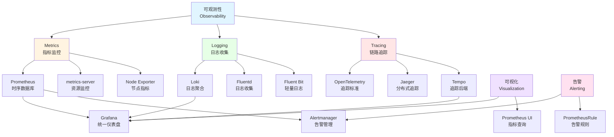

# 16. 监控与可观测性：全面梳理

## 📑 目录

- [📑 目录](#-目录)
- [16.1 文档定位](#161-文档定位)
- [16.2 可观测性技术栈全景](#162-可观测性技术栈全景)
  - [16.2.1 可观测性三大支柱](#1621-可观测性三大支柱)
  - [16.2.2 技术组件矩阵](#1622-技术组件矩阵)
  - [16.2.3 技术栈组合](#1623-技术栈组合)
- [16.3 Metrics 监控技术规格](#163-metrics-监控技术规格)
  - [16.3.1 Prometheus 规格](#1631-prometheus-规格)
  - [16.3.2 metrics-server 规格](#1632-metrics-server-规格)
  - [16.3.3 Node Exporter 规格](#1633-node-exporter-规格)
  - [16.3.4 kube-state-metrics 规格](#1634-kube-state-metrics-规格)
  - [16.3.5 Metrics 工具对比](#1635-metrics-工具对比)
- [16.4 Logging 日志技术规格](#164-logging-日志技术规格)
  - [16.4.1 Loki 规格](#1641-loki-规格)
  - [16.4.2 Fluentd 规格](#1642-fluentd-规格)
  - [16.4.3 Fluent Bit 规格](#1643-fluent-bit-规格)
  - [16.4.4 Promtail 规格](#1644-promtail-规格)
  - [16.4.5 ELK Stack 规格](#1645-elk-stack-规格)
  - [16.4.6 Logging 工具对比](#1646-logging-工具对比)
- [16.5 Tracing 链路追踪技术规格](#165-tracing-链路追踪技术规格)
  - [16.5.1 OpenTelemetry 规格](#1651-opentelemetry-规格)
  - [16.5.2 Jaeger 规格](#1652-jaeger-规格)
  - [16.5.3 Tempo 规格](#1653-tempo-规格)
  - [16.5.4 Zipkin 规格](#1654-zipkin-规格)
  - [16.5.5 Tracing 工具对比](#1655-tracing-工具对比)
- [16.6 可视化技术规格](#166-可视化技术规格)
  - [16.6.1 Grafana 规格](#1661-grafana-规格)
  - [16.6.2 Prometheus UI 规格](#1662-prometheus-ui-规格)
  - [16.6.3 Kibana 规格](#1663-kibana-规格)
  - [16.6.4 可视化工具对比](#1664-可视化工具对比)
- [16.7 告警技术规格](#167-告警技术规格)
  - [16.7.1 Alertmanager 规格](#1671-alertmanager-规格)
  - [16.7.2 PrometheusRule 规格](#1672-prometheusrule-规格)
  - [16.7.3 告警路由规则](#1673-告警路由规则)
  - [16.7.4 告警通知渠道](#1674-告警通知渠道)
- [16.8 可观测性技术栈组合方案](#168-可观测性技术栈组合方案)
  - [16.8.1 小规模集群组合](#1681-小规模集群组合)
  - [16.8.2 大规模集群组合](#1682-大规模集群组合)
  - [16.8.3 边缘计算组合](#1683-边缘计算组合)
  - [16.8.4 完整可观测性组合](#1684-完整可观测性组合)
- [16.9 可观测性接口规范](#169-可观测性接口规范)
  - [16.9.1 Prometheus 指标格式](#1691-prometheus-指标格式)
  - [16.9.2 OpenTelemetry 标准](#1692-opentelemetry-标准)
  - [16.9.3 日志格式规范](#1693-日志格式规范)
  - [16.9.4 追踪格式规范](#1694-追踪格式规范)
- [16.10 eBPF 与可观测性集成](#1610-ebpf-与可观测性集成)
  - [16.10.1 eBPF 在可观测性中的作用](#16101-ebpf-在可观测性中的作用)
  - [16.10.2 eBPF 工具集集成](#16102-ebpf-工具集集成)
  - [16.10.3 eBPF 与 OpenTelemetry 集成](#16103-ebpf-与-opentelemetry-集成)
  - [16.10.4 eBPF 采集器部署](#16104-ebpf-采集器部署)
  - [16.10.5 实际应用案例](#16105-实际应用案例)
    - [案例 1：网络延迟问题定位](#案例-1网络延迟问题定位)
    - [案例 2：CPU Throttle 问题定位](#案例-2cpu-throttle-问题定位)
- [16.11 OpenTelemetry 深度集成实践](#1611-opentelemetry-深度集成实践)
  - [16.11.1 OpenTelemetry Collector 配置](#16111-opentelemetry-collector-配置)
  - [16.11.2 应用自动检测（Auto-Instrumentation）](#16112-应用自动检测auto-instrumentation)
  - [16.11.3 多语言 SDK 集成](#16113-多语言-sdk-集成)
  - [16.11.4 自定义指标和追踪](#16114-自定义指标和追踪)
  - [16.11.5 采样和聚合策略](#16115-采样和聚合策略)
- [16.12 参考](#1612-参考)

---

## 16.1 文档定位

本文档全面梳理云原生容器技术栈中的监控与可观测性技术、规格和堆栈组合方案，包括
Metrics（指标）、Logging（日志）、Tracing（链路追踪）三大支柱，以及相关的可视化
、告警等技术。

**文档结构**：

- **可观测性技术栈全景**：三大支柱、技术组件矩阵、技术栈组合
- **Metrics 监控技术规格**：Prometheus、metrics-server、Node Exporter 等
- **Logging 日志技术规格**：Loki、Fluentd、Fluent Bit、ELK Stack 等
- **Tracing 链路追踪技术规格**：OpenTelemetry、Jaeger、Tempo、Zipkin 等
- **可视化技术规格**：Grafana、Prometheus UI、Kibana 等
- **告警技术规格**：Alertmanager、PrometheusRule、告警路由等
- **可观测性技术栈组合方案**：不同场景的可观测性技术栈组合
- **可观测性接口规范**：Prometheus、OpenTelemetry、日志、追踪格式规范

**相关文档**：

- **[29. 隔离栈 - 观测系统作为第四大基础设施](../29-isolation-stack/isolation-stack.md#2960-观测系统作为第四大基础设施)** -
  为什么观测系统必须而不是最好，SLA 要求，完备性判据，MVP 落地
- **[29. 隔离栈 - 问题定位模型](../29-isolation-stack/isolation-stack.md#296-问题定位模型横向请求链--纵向隔离栈)** -
  横纵耦合的问题定位方法，OTLP + eBPF 联合定位
- **[29. 隔离栈 - 网络定位专题](../29-isolation-stack/isolation-stack.md#29612-网络定位专题横向生命线)** -
  网络作为横向生命线的定位方法，OTLP 网络 trace，eBPF 网络显微镜

## 16.2 可观测性技术栈全景

### 16.2.1 可观测性三大支柱

**可观测性三大支柱**：



**可观测性定义**：

| 支柱        | 定义                   | 核心价值           | 典型工具                   |
| ----------- | ---------------------- | ------------------ | -------------------------- |
| **Metrics** | 数值指标，反映系统状态 | 实时监控、性能分析 | Prometheus、metrics-server |
| **Logging** | 事件日志，记录系统行为 | 问题排查、审计追踪 | Loki、Fluentd、ELK         |
| **Tracing** | 请求追踪，跟踪请求链路 | 性能优化、问题定位 | OpenTelemetry、Jaeger      |

### 16.2.2 技术组件矩阵

**可观测性技术组件矩阵**：

| 组件类别    | 技术               | 定位                          | 成熟度     | 生产验证   |
| ----------- | ------------------ | ----------------------------- | ---------- | ---------- |
| **Metrics** | Prometheus         | 时序数据库和监控系统          | ⭐⭐⭐⭐⭐ | ⭐⭐⭐⭐⭐ |
|             | metrics-server     | Kubernetes 资源监控           | ⭐⭐⭐⭐⭐ | ⭐⭐⭐⭐⭐ |
|             | Node Exporter      | 节点指标导出器                | ⭐⭐⭐⭐⭐ | ⭐⭐⭐⭐⭐ |
|             | kube-state-metrics | Kubernetes 状态指标           | ⭐⭐⭐⭐⭐ | ⭐⭐⭐⭐⭐ |
| **Logging** | Loki               | 日志聚合系统                  | ⭐⭐⭐⭐   | ⭐⭐⭐⭐   |
|             | Fluentd            | 日志收集器                    | ⭐⭐⭐⭐⭐ | ⭐⭐⭐⭐⭐ |
|             | Fluent Bit         | 轻量日志收集器                | ⭐⭐⭐⭐⭐ | ⭐⭐⭐⭐⭐ |
|             | Promtail           | Loki 日志收集器               | ⭐⭐⭐⭐   | ⭐⭐⭐⭐   |
|             | ELK Stack          | Elasticsearch/Logstash/Kibana | ⭐⭐⭐⭐⭐ | ⭐⭐⭐⭐⭐ |
| **Tracing** | OpenTelemetry      | 可观测性标准                  | ⭐⭐⭐⭐⭐ | ⭐⭐⭐⭐⭐ |
|             | Jaeger             | 分布式追踪系统                | ⭐⭐⭐⭐⭐ | ⭐⭐⭐⭐⭐ |
|             | Tempo              | Grafana 追踪后端              | ⭐⭐⭐⭐   | ⭐⭐⭐⭐   |
|             | Zipkin             | 分布式追踪系统                | ⭐⭐⭐⭐   | ⭐⭐⭐⭐   |
| **可视化**  | Grafana            | 统一可视化平台                | ⭐⭐⭐⭐⭐ | ⭐⭐⭐⭐⭐ |
|             | Prometheus UI      | Prometheus 内置 UI            | ⭐⭐⭐⭐⭐ | ⭐⭐⭐⭐⭐ |
|             | Kibana             | Elasticsearch 可视化          | ⭐⭐⭐⭐⭐ | ⭐⭐⭐⭐⭐ |
| **告警**    | Alertmanager       | Prometheus 告警管理           | ⭐⭐⭐⭐⭐ | ⭐⭐⭐⭐⭐ |
|             | PrometheusRule     | Prometheus 告警规则           | ⭐⭐⭐⭐⭐ | ⭐⭐⭐⭐⭐ |

### 16.2.3 技术栈组合

**可观测性技术栈组合方案**：

| 场景             | Metrics    | Logging    | Tracing              | 可视化  | 告警         |
| ---------------- | ---------- | ---------- | -------------------- | ------- | ------------ |
| **小规模集群**   | Prometheus | Loki       | OpenTelemetry        | Grafana | Alertmanager |
| **大规模集群**   | Prometheus | ELK Stack  | Jaeger/Tempo         | Grafana | Alertmanager |
| **边缘计算**     | Prometheus | Fluent Bit | OpenTelemetry        | Grafana | Alertmanager |
| **完整可观测性** | Prometheus | Loki/ELK   | OpenTelemetry+Jaeger | Grafana | Alertmanager |

## 16.3 Metrics 监控技术规格

### 16.3.1 Prometheus 规格

**Prometheus 规格**：

**定义**：Prometheus 是开源的监控系统和时序数据库，用于收集、存储和查询指标数据
。

**技术特点**：

- ✅ 多维度数据模型
- ✅ PromQL 查询语言
- ✅ 拉取模型（Pull）
- ✅ 服务发现支持
- ✅ 高可用和联邦
- ✅ 告警规则和 Alertmanager 集成

**版本信息**：

- **最新版本**：v2.51.0+（2024）
- **GitHub Stars**：53K+
- **生产验证**：✅ 大规模生产使用
- **CNCF 项目**：✅ 毕业项目

**架构组件**：

1. **Prometheus Server**：指标收集和存储
2. **Exporters**：指标导出器（Node Exporter、kube-state-metrics）
3. **Service Discovery**：服务发现（Kubernetes、Consul）
4. **Alertmanager**：告警管理
5. **Grafana**：可视化（可选）

**配置示例**：

```yaml
apiVersion: v1
kind: ConfigMap
metadata:
  name: prometheus-config
data:
  prometheus.yml: |
    global:
      scrape_interval: 15s
      evaluation_interval: 15s
    scrape_configs:
      - job_name: 'kubernetes-pods'
        kubernetes_sd_configs:
          - role: pod
        relabel_configs:
          - source_labels: [__meta_kubernetes_pod_annotation_prometheus_io_scrape]
            action: keep
            regex: true
```

**性能规格**：

| 指标         | 规格                  |
| ------------ | --------------------- |
| **采集频率** | 1s-1m（可配置）       |
| **存储容量** | 15 天-1 年+（可配置） |
| **查询延迟** | < 100ms（大多数查询） |
| **采集延迟** | < 5s                  |

### 16.3.2 metrics-server 规格

**metrics-server 规格**：

**定义**：metrics-server 是 Kubernetes 的资源使用监控组件，提供 Pod 和 Node 的资
源指标。

**技术特点**：

- ✅ 轻量级资源监控
- ✅ 支持 HPA（Horizontal Pod Autoscaler）
- ✅ 支持 VPA（Vertical Pod Autoscaler）
- ✅ 内存占用小
- ✅ 快速启动

**版本信息**：

- **最新版本**：v0.6.4+（2024）
- **GitHub Stars**：5K+
- **生产验证**：✅ Kubernetes 官方组件

**指标类型**：

- **CPU 使用率**：cpu/usage_rate
- **内存使用量**：memory/usage
- **存储使用量**：storage/usage

**配置示例**：

```yaml
apiVersion: v1
kind: Service
metadata:
  name: metrics-server
  namespace: kube-system
---
apiVersion: apps/v1
kind: Deployment
metadata:
  name: metrics-server
  namespace: kube-system
spec:
  replicas: 1
  template:
    spec:
      containers:
        - name: metrics-server
          image: registry.k8s.io/metrics-server/metrics-server:v0.6.4
          args:
            - --cert-dir=/tmp
            - --secure-port=4443
            - --kubelet-preferred-address-types=InternalIP
```

### 16.3.3 Node Exporter 规格

**Node Exporter 规格**：

**定义**：Node Exporter 是 Prometheus 的节点指标导出器，用于收集 Linux 系统指标
。

**技术特点**：

- ✅ 收集系统级指标
- ✅ 支持多种收集器
- ✅ 轻量级部署
- ✅ 低资源占用

**版本信息**：

- **最新版本**：v1.7.0+（2024）
- **GitHub Stars**：10K+
- **生产验证**：✅ 广泛使用

**指标类型**：

- **CPU 指标**：cpu 使用率、负载
- **内存指标**：内存使用、交换空间
- **磁盘指标**：IOPS、吞吐量、使用率
- **网络指标**：网络流量、连接数
- **系统指标**：进程数、文件描述符

### 16.3.4 kube-state-metrics 规格

**kube-state-metrics 规格**：

**定义**：kube-state-metrics 是 Kubernetes 资源对象的状态指标导出器。

**技术特点**：

- ✅ 导出 Kubernetes 对象状态
- ✅ 支持多种资源类型
- ✅ 与 Prometheus 集成
- ✅ 低资源占用

**版本信息**：

- **最新版本**：v2.10.0+（2024）
- **GitHub Stars**：5K+
- **生产验证**：✅ 广泛使用

**指标类型**：

- **Pod 状态**：Pod 数量、状态分布
- **Deployment 状态**：副本数、更新状态
- **Service 状态**：服务类型、端口
- **Node 状态**：节点条件、容量

### 16.3.5 Metrics 工具对比

**Metrics 工具对比矩阵**：

| 工具                   | 定位       | 指标类型        | 性能       | 成熟度     | 推荐场景     |
| ---------------------- | ---------- | --------------- | ---------- | ---------- | ------------ |
| **Prometheus**         | 时序数据库 | 应用指标        | ⭐⭐⭐⭐⭐ | ⭐⭐⭐⭐⭐ | 全面监控     |
| **metrics-server**     | 资源监控   | 资源指标        | ⭐⭐⭐⭐⭐ | ⭐⭐⭐⭐⭐ | HPA/VPA      |
| **Node Exporter**      | 节点指标   | 系统指标        | ⭐⭐⭐⭐⭐ | ⭐⭐⭐⭐⭐ | 系统监控     |
| **kube-state-metrics** | 对象状态   | Kubernetes 状态 | ⭐⭐⭐⭐   | ⭐⭐⭐⭐⭐ | 集群状态监控 |

## 16.4 Logging 日志技术规格

### 16.4.1 Loki 规格

**Loki 规格**：

**定义**：Loki 是 Grafana Labs 开发的日志聚合系统，专为容器和微服务设计。

**技术特点**：

- ✅ 与 Prometheus 类似的查询语法（LogQL）
- ✅ 轻量级、低资源占用
- ✅ 与 Grafana 深度集成
- ✅ 支持多租户
- ✅ 高效的标签索引

**版本信息**：

- **最新版本**：v2.9.0+（2024）
- **GitHub Stars**：22K+
- **生产验证**：✅ 中等规模生产使用

**架构组件**：

1. **Loki**：日志聚合和存储
2. **Promtail**：日志收集器（Loki 专用）
3. **Grafana**：日志可视化
4. **Distributor**：日志分发
5. **Ingester**：日志接收和存储
6. **Query Frontend**：查询前端

**配置示例**：

```yaml
apiVersion: v1
kind: ConfigMap
metadata:
  name: loki-config
data:
  loki.yaml: |
    auth_enabled: false
    server:
      http_listen_port: 3100
    ingester:
      lifecycler:
        ring:
          kvstore:
            store: inmemory
    schema_config:
      configs:
        - from: 2020-10-24
          store: boltdb-shipper
          object_store: filesystem
          schema: v11
          index:
            prefix: index_
            period: 24h
    storage_config:
      boltdb_shipper:
        active_index_directory: /loki/index
      filesystem:
        directory: /loki/chunks
```

**性能规格**：

| 指标         | 规格                    |
| ------------ | ----------------------- |
| **采集延迟** | < 5s                    |
| **查询延迟** | < 1s（大多数查询）      |
| **存储效率** | 比 ELK 节省 10-40% 空间 |
| **查询性能** | 快速标签查询            |

### 16.4.2 Fluentd 规格

**Fluentd 规格**：

**定义**：Fluentd 是开源的日志收集器，用于统一日志处理。

**技术特点**：

- ✅ 丰富的输入输出插件
- ✅ 灵活的日志处理管道
- ✅ 支持多种输出目标
- ✅ 可扩展的插件系统
- ✅ 生产级可靠性

**版本信息**：

- **最新版本**：v1.16.0+（2024）
- **GitHub Stars**：12K+
- **生产验证**：✅ 大规模生产使用
- **CNCF 项目**：✅ 毕业项目

**插件生态**：

- **输入插件**：文件、syslog、HTTP、Kubernetes
- **输出插件**：Elasticsearch、S3、Kafka、Prometheus
- **过滤插件**：解析、转换、路由

### 16.4.3 Fluent Bit 规格

**Fluent Bit 规格**：

**定义**：Fluent Bit 是 Fluentd 的轻量级版本，专为边缘和容器场景设计。

**技术特点**：

- ✅ 极低资源占用（< 20MB）
- ✅ 高性能日志处理
- ✅ C 语言实现，性能优秀
- ✅ 适合边缘计算
- ✅ 支持多输入输出

**版本信息**：

- **最新版本**：v3.0.0+（2024）
- **GitHub Stars**：5K+
- **生产验证**：✅ 边缘场景广泛使用

**性能规格**：

| 指标         | 规格          |
| ------------ | ------------- |
| **内存占用** | < 20MB        |
| **CPU 占用** | < 50m（空闲） |
| **处理能力** | 100K+ 事件/秒 |
| **延迟**     | < 1ms         |

### 16.4.4 Promtail 规格

**Promtail 规格**：

**定义**：Promtail 是 Loki 的专用日志收集器，与 Loki 深度集成。

**技术特点**：

- ✅ 专为 Loki 设计
- ✅ 与 Prometheus 服务发现集成
- ✅ 支持 Kubernetes 日志采集
- ✅ 标签提取和转换
- ✅ 低资源占用

**版本信息**：

- **最新版本**：v2.9.0+（2024）
- **GitHub Stars**：2K+
- **生产验证**：✅ 与 Loki 配套使用

### 16.4.5 ELK Stack 规格

**ELK Stack 规格**：

**定义**：ELK Stack 是 Elasticsearch、Logstash、Kibana 的日志解决方案。

**技术特点**：

- ✅ 强大的全文搜索
- ✅ 灵活的日志分析
- ✅ 丰富的可视化
- ✅ 成熟的生态系统
- ⚠️ 资源占用较高

**版本信息**：

- **最新版本**：Elasticsearch 8.11.0+（2024）
- **GitHub Stars**：70K+（Elasticsearch）
- **生产验证**：✅ 大规模生产使用

**架构组件**：

1. **Elasticsearch**：搜索引擎和存储
2. **Logstash**：日志处理和转换
3. **Kibana**：可视化和分析
4. **Beats**：轻量级数据采集器（可选）

### 16.4.6 Logging 工具对比

**Logging 工具对比矩阵**：

| 工具           | 定位         | 资源占用   | 性能       | 成熟度     | 推荐场景         |
| -------------- | ------------ | ---------- | ---------- | ---------- | ---------------- |
| **Loki**       | 日志聚合     | ⭐⭐⭐⭐   | ⭐⭐⭐⭐⭐ | ⭐⭐⭐⭐   | 容器日志、轻量级 |
| **Fluentd**    | 日志收集     | ⭐⭐⭐     | ⭐⭐⭐⭐   | ⭐⭐⭐⭐⭐ | 大规模日志收集   |
| **Fluent Bit** | 轻量日志收集 | ⭐⭐⭐⭐⭐ | ⭐⭐⭐⭐⭐ | ⭐⭐⭐⭐⭐ | 边缘计算、容器   |
| **Promtail**   | Loki 专用    | ⭐⭐⭐⭐⭐ | ⭐⭐⭐⭐   | ⭐⭐⭐⭐   | 与 Loki 配套     |
| **ELK Stack**  | 完整日志方案 | ⭐⭐       | ⭐⭐⭐⭐   | ⭐⭐⭐⭐⭐ | 企业级日志分析   |

## 16.5 Tracing 链路追踪技术规格

> **💡 问题定位提示**：
>
> OpenTelemetry（OTLP）不仅用于链路追踪，更是横纵耦合问题定位模型中的**横向坐
> 标**：
>
> - **横向定位**：OTLP Trace 提供请求链路的完整视图，快速定位慢跳（详见
>   [29.6.12.2 OTLP 网络 trace](../29-isolation-stack/isolation-stack.md#296122-横向otlp-网络-trace)）
> - **纵向定位**：结合 eBPF 提供内核栈的深度分析，定位技术层问题（详见
>   [29.6.12.3 eBPF 网络显微镜](../29-isolation-stack/isolation-stack.md#296123-纵向ebpf-网络显微镜)）
> - **完整方法**：参考
>   [29.6 问题定位模型](../29-isolation-stack/isolation-stack.md#296-问题定位模型横向请求链--纵向隔离栈)
>   了解横纵耦合定位方法

### 16.5.1 OpenTelemetry 规格

**OpenTelemetry 规格**：

**定义**：OpenTelemetry 是云原生可观测性的统一标准，整合了 Metrics、Logs 和
Traces。

**技术特点**：

- ✅ 统一可观测性标准
- ✅ 多语言支持（Java、Go、Python、JavaScript 等）
- ✅ 与多种后端集成
- ✅ 自动和手动检测
- ✅ CNCF 项目

**版本信息**：

- **最新版本**：v1.24.0+（2024）
- **GitHub Stars**：11K+
- **生产验证**：✅ 快速采用
- **CNCF 项目**：✅ 孵化项目

**核心组件**：

1. **OpenTelemetry SDK**：应用集成 SDK
2. **OpenTelemetry Collector**：可观测性数据收集器
3. **Instrumentation**：自动检测库
4. **Exporters**：导出到各种后端（Jaeger、Prometheus、Loki）

**配置示例**：

```yaml
apiVersion: v1
kind: ConfigMap
metadata:
  name: otel-collector-config
data:
  otel-collector.yaml: |
    receivers:
      otlp:
        protocols:
          grpc:
            endpoint: 0.0.0.0:4317
          http:
            endpoint: 0.0.0.0:4318
    processors:
      batch:
      memory_limiter:
        limit_mib: 512
    exporters:
      jaeger:
        endpoint: jaeger:14250
        tls:
          insecure: true
      prometheus:
        endpoint: "0.0.0.0:8889"
    service:
      pipelines:
        traces:
          receivers: [otlp]
          processors: [memory_limiter, batch]
          exporters: [jaeger]
        metrics:
          receivers: [otlp]
          processors: [memory_limiter, batch]
          exporters: [prometheus]
```

### 16.5.2 Jaeger 规格

**Jaeger 规格**：

**定义**：Jaeger 是 Uber 开源的分布式追踪系统，用于微服务架构的请求追踪。

**技术特点**：

- ✅ 分布式追踪
- ✅ 服务依赖图
- ✅ 性能分析
- ✅ 与 OpenTelemetry 集成
- ✅ 高可用和可扩展

**版本信息**：

- **最新版本**：v1.53.0+（2024）
- **GitHub Stars**：20K+
- **生产验证**：✅ 大规模生产使用
- **CNCF 项目**：✅ 毕业项目

**架构组件**：

1. **Jaeger Agent**：追踪数据收集
2. **Jaeger Collector**：追踪数据聚合
3. **Jaeger Query**：追踪数据查询
4. **Jaeger UI**：追踪数据可视化
5. **Storage Backend**：Elasticsearch、Cassandra、Badger

### 16.5.3 Tempo 规格

**Tempo 规格**：

**定义**：Tempo 是 Grafana Labs 开发的分布式追踪后端，与 Grafana 深度集成。

**技术特点**：

- ✅ 与 Grafana 集成
- ✅ 简单部署
- ✅ 低成本存储
- ✅ 快速查询
- ✅ 支持 OpenTelemetry

**版本信息**：

- **最新版本**：v2.3.0+（2024）
- **GitHub Stars**：4K+
- **生产验证**：✅ 中等规模使用

### 16.5.4 Zipkin 规格

**Zipkin 规格**：

**定义**：Zipkin 是 Twitter 开源的分布式追踪系统，轻量级实现。

**技术特点**：

- ✅ 轻量级部署
- ✅ 简单易用
- ✅ 支持多种语言
- ✅ 与 Spring Cloud 集成

**版本信息**：

- **最新版本**：v2.24.0+（2024）
- **GitHub Stars**：16K+
- **生产验证**：✅ 广泛使用

### 16.5.5 Tracing 工具对比

**Tracing 工具对比矩阵**：

| 工具              | 定位             | 存储后端     | 性能       | 成熟度     | 推荐场景        |
| ----------------- | ---------------- | ------------ | ---------- | ---------- | --------------- |
| **OpenTelemetry** | 可观测性标准     | 多种后端     | ⭐⭐⭐⭐⭐ | ⭐⭐⭐⭐⭐ | 统一可观测性    |
| **Jaeger**        | 分布式追踪       | ES/Cassandra | ⭐⭐⭐⭐⭐ | ⭐⭐⭐⭐⭐ | 微服务追踪      |
| **Tempo**         | Grafana 追踪后端 | 对象存储     | ⭐⭐⭐⭐   | ⭐⭐⭐⭐   | 与 Grafana 集成 |
| **Zipkin**        | 轻量级追踪       | ES/Cassandra | ⭐⭐⭐⭐   | ⭐⭐⭐⭐   | Spring Cloud    |

## 16.6 可视化技术规格

### 16.6.1 Grafana 规格

**Grafana 规格**：

**定义**：Grafana 是开源的可视化和监控平台，支持多种数据源。

**技术特点**：

- ✅ 统一可视化平台
- ✅ 支持多种数据源（Prometheus、Loki、Jaeger、Tempo）
- ✅ 丰富的仪表盘模板
- ✅ 告警和通知
- ✅ 多租户支持
- ✅ 与 Prometheus 生态系统集成

**版本信息**：

- **最新版本**：v10.3.0+（2024）
- **GitHub Stars**：62K+
- **生产验证**：✅ 大规模生产使用

**数据源支持**：

- **Metrics**：Prometheus、InfluxDB、Graphite
- **Logs**：Loki、Elasticsearch
- **Traces**：Jaeger、Tempo、Zipkin
- **Databases**：MySQL、PostgreSQL、MongoDB

**配置示例**：

```yaml
apiVersion: v1
kind: ConfigMap
metadata:
  name: grafana-datasources
data:
  datasources.yaml: |
    apiVersion: 1
    datasources:
      - name: Prometheus
        type: prometheus
        access: proxy
        url: http://prometheus:9090
        isDefault: true
      - name: Loki
        type: loki
        access: proxy
        url: http://loki:3100
      - name: Jaeger
        type: jaeger
        access: proxy
        url: http://jaeger-query:16686
```

### 16.6.2 Prometheus UI 规格

**Prometheus UI 规格**：

**定义**：Prometheus UI 是 Prometheus 内置的 Web 界面，用于查询和可视化指标。

**技术特点**：

- ✅ Prometheus 内置
- ✅ PromQL 查询
- ✅ 图表可视化
- ✅ 告警规则管理
- ⚠️ 功能相对简单

**功能**：

- **Graph**：指标查询和图表
- **Alerts**：告警规则查看
- **Status**：Prometheus 状态
- **Targets**：抓取目标状态

### 16.6.3 Kibana 规格

**Kibana 规格**：

**定义**：Kibana 是 Elasticsearch 的可视化和分析平台。

**技术特点**：

- ✅ 强大的日志分析
- ✅ 全文搜索可视化
- ✅ 丰富的仪表盘
- ✅ 机器学习集成
- ✅ 与 Elasticsearch 深度集成

**版本信息**：

- **最新版本**：8.11.0+（2024）
- **GitHub Stars**：20K+
- **生产验证**：✅ 大规模生产使用

### 16.6.4 可视化工具对比

**可视化工具对比矩阵**：

| 工具              | 定位                 | 数据源支持 | 功能       | 成熟度     | 推荐场景     |
| ----------------- | -------------------- | ---------- | ---------- | ---------- | ------------ |
| **Grafana**       | 统一可视化           | ⭐⭐⭐⭐⭐ | ⭐⭐⭐⭐⭐ | ⭐⭐⭐⭐⭐ | 全面可观测性 |
| **Prometheus UI** | Prometheus 内置      | ⭐⭐       | ⭐⭐⭐     | ⭐⭐⭐⭐⭐ | 简单指标查询 |
| **Kibana**        | Elasticsearch 可视化 | ⭐⭐⭐     | ⭐⭐⭐⭐⭐ | ⭐⭐⭐⭐⭐ | ELK Stack    |

## 16.7 告警技术规格

### 16.7.1 Alertmanager 规格

**Alertmanager 规格**：

**定义**：Alertmanager 是 Prometheus 的告警管理组件，负责告警的去重、分组、路由
和通知。

**技术特点**：

- ✅ 告警去重和分组
- ✅ 告警路由和抑制
- ✅ 多种通知渠道
- ✅ 静默和告警模板
- ✅ 高可用部署

**版本信息**：

- **最新版本**：v0.27.0+（2024）
- **GitHub Stars**：7K+
- **生产验证**：✅ 大规模生产使用

**核心功能**：

1. **Grouping**：告警分组
2. **Inhibition**：告警抑制
3. **Silences**：告警静默
4. **Routing**：告警路由
5. **Notification**：告警通知

**配置示例**：

```yaml
apiVersion: v1
kind: ConfigMap
metadata:
  name: alertmanager-config
data:
  alertmanager.yml: |
    global:
      resolve_timeout: 5m
    route:
      group_by: ['alertname', 'cluster', 'service']
      group_wait: 10s
      group_interval: 10s
      repeat_interval: 12h
      receiver: 'default'
    receivers:
      - name: 'default'
        webhook_configs:
          - url: 'http://webhook:8080/alerts'
```

### 16.7.2 PrometheusRule 规格

**PrometheusRule 规格**：

**定义**：PrometheusRule 是 Kubernetes CRD，用于定义 Prometheus 告警规则。

**技术特点**：

- ✅ Kubernetes 原生资源
- ✅ 版本控制
- ✅ 多租户支持
- ✅ 与 Prometheus Operator 集成

**配置示例**：

```yaml
apiVersion: monitoring.coreos.com/v1
kind: PrometheusRule
metadata:
  name: example-alerts
spec:
  groups:
    - name: example
      rules:
        - alert: HighMemoryUsage
          expr:
            container_memory_usage_bytes > 0.8 *
            container_spec_memory_limit_bytes
          for: 5m
          labels:
            severity: warning
          annotations:
            summary: "High memory usage detected"
            description: "Memory usage is above 80%"
```

### 16.7.3 告警路由规则

**告警路由规则**：

**路由策略**：

| 策略               | 说明             | 适用场景             |
| ------------------ | ---------------- | -------------------- |
| **按标签路由**     | 根据告警标签路由 | 不同环境、不同服务   |
| **按严重程度路由** | 根据严重程度路由 | 紧急告警、警告告警   |
| **按时间路由**     | 根据时间路由     | 工作时间、非工作时间 |
| **按集群路由**     | 根据集群路由     | 多集群环境           |

### 16.7.4 告警通知渠道

**告警通知渠道**：

| 渠道              | 说明           | 适用场景   |
| ----------------- | -------------- | ---------- |
| **Webhook**       | HTTP Webhook   | 自定义通知 |
| **Email**         | 邮件通知       | 传统通知   |
| **Slack**         | Slack 通知     | 团队协作   |
| **PagerDuty**     | PagerDuty 通知 | 值班系统   |
| **钉钉/企业微信** | 企业 IM 通知   | 国内企业   |

## 16.8 可观测性技术栈组合方案

### 16.8.1 小规模集群组合

**小规模集群可观测性组合**：

**技术栈**：

- **Metrics**：Prometheus + Node Exporter + kube-state-metrics
- **Logging**：Loki + Promtail
- **Tracing**：OpenTelemetry（可选）
- **可视化**：Grafana
- **告警**：Alertmanager

**特点**：

- ✅ 轻量级部署
- ✅ 资源占用低
- ✅ 易于管理
- ✅ 完整可观测性

### 16.8.2 大规模集群组合

**大规模集群可观测性组合**：

**技术栈**：

- **Metrics**：Prometheus（联邦模式）+ Node Exporter + kube-state-metrics
- **Logging**：ELK Stack 或 Loki（集群模式）
- **Tracing**：Jaeger 或 Tempo
- **可视化**：Grafana
- **告警**：Alertmanager（高可用）

**特点**：

- ✅ 高可用部署
- ✅ 可扩展性强
- ✅ 完整可观测性
- ⚠️ 资源占用较高

### 16.8.3 边缘计算组合

**边缘计算可观测性组合**：

**技术栈**：

- **Metrics**：Prometheus（精简版）
- **Logging**：Fluent Bit + 远程聚合
- **Tracing**：OpenTelemetry（轻量版）
- **可视化**：Grafana（可选）
- **告警**：Alertmanager（可选）

**特点**：

- ✅ 极低资源占用
- ✅ 适合边缘场景
- ✅ 支持离线模式
- ⚠️ 功能可能受限

### 16.8.4 完整可观测性组合

**完整可观测性组合**：

**技术栈**：

- **Metrics**：Prometheus + metrics-server + Node Exporter + kube-state-metrics
- **Logging**：Loki + Promtail 或 ELK Stack
- **Tracing**：OpenTelemetry + Jaeger 或 Tempo
- **可视化**：Grafana（统一仪表盘）
- **告警**：Alertmanager + PrometheusRule

**特点**：

- ✅ 三大支柱完整
- ✅ 统一可视化平台
- ✅ 完整的告警体系
- ✅ 生产级可观测性

## 16.9 可观测性接口规范

### 16.9.1 Prometheus 指标格式

**Prometheus 指标格式**：

**格式定义**：

```text
<metric_name>{<label_name>=<label_value>,...} <value> <timestamp>
```

**示例**：

```text
http_requests_total{method="GET",status="200"} 1024 1234567890
container_memory_usage_bytes{container="app"} 536870912 1234567890
```

**指标类型**：

- **Counter**：计数器，单调递增
- **Gauge**：仪表盘，可增可减
- **Histogram**：直方图，分桶统计
- **Summary**：摘要，分位数统计

### 16.9.2 OpenTelemetry 标准

**OpenTelemetry 标准**：

**定义**：OpenTelemetry 是云原生可观测性的统一标准。

**数据模型**：

- **Metrics**：指标数据模型
- **Logs**：日志数据模型
- **Traces**：追踪数据模型

**协议支持**：

- **OTLP（gRPC）**：OpenTelemetry Protocol over gRPC
- **OTLP（HTTP）**：OpenTelemetry Protocol over HTTP
- **Jaeger**：Jaeger 格式
- **Zipkin**：Zipkin 格式

**问题定位中的应用**：

OTLP 在横纵耦合问题定位模型中扮演**横向坐标**的角色：

- **横向坐标**：OTLP Trace 提供请求链路的完整视图
  - `net.peer.ip`、`net.peer.port`：定位慢跳的网络地址
  - `duration`：定位慢跳的时间戳
  - `trace_id`：关联完整的请求链路
- **数据关联**：OTLP 数据与 eBPF 数据交叉验证，实现秒级精确问题定位
- **完整方法**：详见
  [29.6.12.0.2 OTLP 如何给出"横向坐标"](../29-isolation-stack/isolation-stack.md#2961202-otlp-如何给出横向坐标)

### 16.9.3 日志格式规范

**日志格式规范**：

**JSON 格式**：

```json
{
  "timestamp": "2024-01-01T00:00:00Z",
  "level": "info",
  "message": "Request processed",
  "service": "api",
  "trace_id": "abc123",
  "span_id": "def456"
}
```

**常用日志级别**：

- **DEBUG**：调试信息
- **INFO**：一般信息
- **WARN**：警告信息
- **ERROR**：错误信息
- **FATAL**：致命错误

### 16.9.4 追踪格式规范

**追踪格式规范**：

**OpenTelemetry Trace 格式**：

- **Trace**：追踪根
- **Span**：追踪段
- **SpanContext**：追踪上下文
- **Attributes**：属性
- **Events**：事件

## 16.10 eBPF 与可观测性集成

### 16.10.1 eBPF 在可观测性中的作用

**eBPF 核心价值**：

- **零侵入观测**：无需修改应用代码，在内核层直接观测
- **低开销**：相比传统代理方式，开销降低 90%+
- **深度可见性**：可以看到内核层的详细事件（系统调用、网络包、调度等）
- **实时性**：毫秒级延迟，适合实时监控

**eBPF 观测能力**：

| 观测维度     | eBPF 能力            | 传统方式对比              |
| ------------ | -------------------- | ------------------------- |
| **系统调用** | 实时追踪所有 syscall | 需要 strace，开销高       |
| **网络流量** | 包级别追踪，丢包定位 | 需要 tcpdump，影响性能    |
| **CPU 调度** | 调度延迟分析         | 需要 perf，难以持续       |
| **磁盘 IO**  | 块设备 IO 追踪       | 需要 iostat，粒度粗       |
| **内存使用** | 内存分配追踪         | 需要 valgrind，不适合生产 |

### 16.10.2 eBPF 工具集集成

**BCC 工具集**：

```bash
# 安装 BCC 工具集
sudo apt-get install bpfcc-tools linux-headers-$(uname -r)

# 或使用容器方式
docker run -it --rm \
  --privileged \
  -v /sys/kernel/debug:/sys/kernel/debug \
  -v /usr/src:/usr/src:ro \
  zlim/bcc-tools
```

**常用 eBPF 工具**：

```bash
# 1. CPU 调度延迟分析
sudo /usr/share/bcc/tools/runqlat -m 10

# 2. 网络连接追踪
sudo /usr/share/bcc/tools/tcpconnect -p $(pgrep -f myapp)

# 3. 磁盘 IO 延迟分析
sudo /usr/share/bcc/tools/biolatency -m 10

# 4. 系统调用追踪
sudo /usr/share/bcc/tools/syscount -p $(pgrep -f myapp)

# 5. 内存分配追踪
sudo /usr/share/bcc/tools/memleak -p $(pgrep -f myapp)

# 6. 网络丢包分析
sudo /usr/share/bcc/tools/dropwatch -l kas
```

**Inspektor Gadget（Kubernetes 原生）**：

```bash
# 安装 Inspektor Gadget
kubectl gadget deploy

# 追踪 Pod 网络连接
kubectl gadget trace network -n mynamespace -p mypod

# 追踪 Pod 系统调用
kubectl gadget trace syscall -n mynamespace -p mypod

# 分析 Pod CPU 使用
kubectl gadget top cpu -n mynamespace
```

### 16.10.3 eBPF 与 OpenTelemetry 集成

**使用 OpenTelemetry eBPF Exporter**：

```yaml
apiVersion: v1
kind: ConfigMap
metadata:
  name: otel-collector-config
data:
  otel-collector.yaml: |
    receivers:
      otlp:
        protocols:
          grpc:
            endpoint: 0.0.0.0:4317
          http:
            endpoint: 0.0.0.0:4318
      # eBPF 接收器
      ebpf:
        endpoint: 0.0.0.0:4319
        kernel_headers_path: /usr/src/linux-headers-$(uname -r)

    processors:
      batch:
      memory_limiter:
        limit_mib: 512
      # 关联 eBPF 事件和 OTLP trace
      resource:
        attributes:
          - key: ebpf.enabled
            value: true
            action: upsert

    exporters:
      otlp:
        endpoint: jaeger:4317
        tls:
          insecure: true
      prometheus:
        endpoint: "0.0.0.0:8889"

    service:
      pipelines:
        traces:
          receivers: [otlp, ebpf]
          processors: [resource, memory_limiter, batch]
          exporters: [otlp]
        metrics:
          receivers: [otlp, ebpf]
          processors: [resource, memory_limiter, batch]
          exporters: [prometheus]
```

**使用 Cilium Hubble（eBPF 原生观测）**：

```bash
# 安装 Cilium
helm install cilium cilium/cilium --version 1.14.0 \
  --namespace kube-system \
  --set hubble.enabled=true \
  --set hubble.metrics.enabled="{dns,drop,tcp,flow,port-distribution,icmp,http}"

# 查看网络流
kubectl exec -n kube-system deployment/hubble-ui -- \
  hubble observe --follow

# 导出 OpenTelemetry 格式
kubectl exec -n kube-system deployment/hubble-relay -- \
  hubble observe --output otlp --server hubble-relay:80
```

### 16.10.4 eBPF 采集器部署

**使用 eBPF Exporter（Prometheus 格式）**：

```yaml
apiVersion: apps/v1
kind: DaemonSet
metadata:
  name: ebpf-exporter
spec:
  selector:
    matchLabels:
      app: ebpf-exporter
  template:
    metadata:
      labels:
        app: ebpf-exporter
    spec:
      hostNetwork: true
      hostPID: true
      containers:
        - name: ebpf-exporter
          image: cloudflare/ebpf_exporter:latest
          securityContext:
            privileged: true
          volumeMounts:
            - name: sys-kernel-debug
              mountPath: /sys/kernel/debug
            - name: usr-src
              mountPath: /usr/src:ro
          args:
            - --config.file=/etc/ebpf-exporter/config.yaml
            - --web.listen-address=:9435
          ports:
            - containerPort: 9435
              name: metrics
          volumes:
            - name: sys-kernel-debug
              hostPath:
                path: /sys/kernel/debug
            - name: usr-src
              hostPath:
                path: /usr/src
                type: Directory
```

**eBPF Exporter 配置示例**：

```yaml
# config.yaml
programs:
  - name: tcp_connect
    metrics:
      counters:
        - name: tcp_connect_total
          help: Total number of TCP connections
          table: events
          labels:
            - name: pid
              size: 8
              decoders:
                - name: uint
            - name: comm
              size: 16
              decoders:
                - name: string
```

### 16.10.5 实际应用案例

#### 案例 1：网络延迟问题定位

**场景**：Service A 调用 Service B 延迟突增到 1.2s

**使用 eBPF 定位**：

```bash
# 1. 使用 tcpconnect 追踪连接
sudo /usr/share/bcc/tools/tcpconnect -p $(pgrep -f service-b) -t

# 2. 使用 tcpdrop 检查丢包
sudo /usr/share/bcc/tools/tcpdrop -p $(pgrep -f service-b)

# 3. 使用 tcpretrans 检查重传
sudo /usr/share/bcc/tools/tcpretrans -p $(pgrep -f service-b)

# 4. 关联到 OpenTelemetry trace
# 通过 socket cookie 关联
kubectl exec -it pod/service-a -- \
  curl -H "traceparent: 00-$(uuidgen | tr -d -)" \
  http://service-b:8080
```

#### 案例 2：CPU Throttle 问题定位

**场景**：容器 CPU 使用率低，但应用响应慢

**使用 eBPF 定位**：

```bash
# 1. 检查 CPU 调度延迟
sudo /usr/share/bcc/tools/runqlat -p $(pgrep -f container-process) 10

# 2. 检查 CPU Throttle
sudo /usr/share/bcc/tools/cpudist -p $(pgrep -f container-process) 10

# 3. 检查 cgroup 限制
sudo /usr/share/bcc/tools/cgroupstats

# 4. 导出为 Prometheus 指标
# 使用 eBPF Exporter 持续监控
```

## 16.11 OpenTelemetry 深度集成实践

### 16.11.1 OpenTelemetry Collector 配置

**完整的 Collector 配置示例**：

```yaml
apiVersion: v1
kind: ConfigMap
metadata:
  name: otel-collector-config
data:
  otel-collector.yaml: |
    receivers:
      otlp:
        protocols:
          grpc:
            endpoint: 0.0.0.0:4317
          http:
            endpoint: 0.0.0.0:4318

      prometheus:
        config:
          scrape_configs:
            - job_name: 'kubernetes-pods'
              kubernetes_sd_configs:
                - role: pod

      filelog:
        include:
          - /var/log/containers/*.log
        operators:
          - type: json_parser
            id: parser-json
            output: extract_metadata_from_filepath
          - type: regex_parser
            id: extract_metadata_from_filepath
            regex: '^.*\/(?P<namespace>[^_]+)_(?P<pod_name>[^_]+)_(?P<uid>[^_]+)\/(?P<container_name>.+)-(?P<container_id>[^\.]+)\.log$'
            parse_from: attributes["log.file.path"]

    processors:
      batch:
        timeout: 10s
        send_batch_size: 1024

      memory_limiter:
        limit_mib: 512
        check_interval: 1s

      resource:
        attributes:
          - key: service.name
            value: ${OTEL_SERVICE_NAME}
            action: upsert
          - key: k8s.cluster.name
            value: ${K8S_CLUSTER_NAME}
            action: upsert

      # 采样处理器
      probabilistic_sampler:
        sampling_percentage: 10.0

      # 属性处理器
      attributes:
        actions:
          - key: environment
            value: production
            action: upsert
          - key: remove_me
            action: delete

    exporters:
      otlp:
        endpoint: jaeger:4317
        tls:
          insecure: true
        headers:
          custom-header: "custom-value"

      prometheus:
        endpoint: "0.0.0.0:8889"
        const_labels:
          environment: production

      logging:
        loglevel: debug

      # 多后端导出
      otlp/jaeger:
        endpoint: jaeger:4317
        tls:
          insecure: true
      otlp/tempo:
        endpoint: tempo:4317
        tls:
          insecure: true

    service:
      pipelines:
        traces:
          receivers: [otlp]
          processors: [memory_limiter, resource, probabilistic_sampler, batch]
          exporters: [otlp/jaeger, otlp/tempo]
        metrics:
          receivers: [otlp, prometheus]
          processors: [memory_limiter, resource, batch]
          exporters: [prometheus]
        logs:
          receivers: [filelog]
          processors: [memory_limiter, resource, batch]
          exporters: [otlp]
```

### 16.11.2 应用自动检测（Auto-Instrumentation）

**Java 应用自动检测**：

```yaml
apiVersion: apps/v1
kind: Deployment
metadata:
  name: java-app
spec:
  template:
    spec:
      containers:
        - name: app
          image: myapp:latest
          env:
            - name: JAVA_TOOL_OPTIONS
              value: "-javaagent:/otel/opentelemetry-javaagent.jar"
            - name: OTEL_SERVICE_NAME
              value: "java-app"
            - name: OTEL_EXPORTER_OTLP_ENDPOINT
              value: "http://otel-collector:4317"
            - name: OTEL_TRACES_EXPORTER
              value: "otlp"
            - name: OTEL_METRICS_EXPORTER
              value: "otlp"
          volumeMounts:
            - name: otel-agent
              mountPath: /otel
          volumes:
            - name: otel-agent
              emptyDir: {}
          initContainers:
            - name: otel-agent
              image: otel/opentelemetry-java-instrumentation:latest
              command:
                ["cp", "/javaagent.jar", "/otel/opentelemetry-javaagent.jar"]
              volumeMounts:
                - name: otel-agent
                  mountPath: /otel
```

**Python 应用自动检测**：

```yaml
apiVersion: apps/v1
kind: Deployment
metadata:
  name: python-app
spec:
  template:
    spec:
      containers:
        - name: app
          image: myapp:latest
          env:
            - name: OTEL_SERVICE_NAME
              value: "python-app"
            - name: OTEL_EXPORTER_OTLP_ENDPOINT
              value: "http://otel-collector:4317"
            - name: OTEL_PYTHON_AUTO_INSTRUMENTATION_ENABLED
              value: "true"
          volumeMounts:
            - name: otel-agent
              mountPath: /otel
          volumes:
            - name: otel-agent
              emptyDir: {}
          initContainers:
            - name: otel-agent
              image: otel/opentelemetry-python-instrumentation:latest
              command: ["cp", "-r", "/autoinstrumentation", "/otel"]
              volumeMounts:
                - name: otel-agent
                  mountPath: /otel
```

**Node.js 应用自动检测**：

```yaml
apiVersion: apps/v1
kind: Deployment
metadata:
  name: nodejs-app
spec:
  template:
    spec:
      containers:
        - name: app
          image: myapp:latest
          command: ["node", "-r", "/otel/autoinstrumentation.js", "server.js"]
          env:
            - name: OTEL_SERVICE_NAME
              value: "nodejs-app"
            - name: OTEL_EXPORTER_OTLP_ENDPOINT
              value: "http://otel-collector:4317"
          volumeMounts:
            - name: otel-agent
              mountPath: /otel
          volumes:
            - name: otel-agent
              emptyDir: {}
          initContainers:
            - name: otel-agent
              image: otel/opentelemetry-nodejs-instrumentation:latest
              command: ["cp", "-r", "/autoinstrumentation", "/otel"]
              volumeMounts:
                - name: otel-agent
                  mountPath: /otel
```

### 16.11.3 多语言 SDK 集成

**Go 应用手动集成**：

```go
package main

import (
    "context"
    "go.opentelemetry.io/otel"
    "go.opentelemetry.io/otel/exporters/otlp/otlptrace/otlptracegrpc"
    "go.opentelemetry.io/otel/sdk/resource"
    sdktrace "go.opentelemetry.io/otel/sdk/trace"
    "go.opentelemetry.io/otel/trace"
    semconv "go.opentelemetry.io/otel/semconv/v1.21.0"
)

func initTracer() func() {
    ctx := context.Background()

    res, _ := resource.New(ctx,
        resource.WithAttributes(
            semconv.ServiceNameKey.String("my-service"),
            semconv.ServiceVersionKey.String("1.0.0"),
        ),
    )

    exporter, _ := otlptracegrpc.New(ctx,
        otlptracegrpc.WithEndpoint("otel-collector:4317"),
        otlptracegrpc.WithInsecure(),
    )

    tp := sdktrace.NewTracerProvider(
        sdktrace.WithBatcher(exporter),
        sdktrace.WithResource(res),
    )

    otel.SetTracerProvider(tp)

    return func() {
        _ = tp.Shutdown(ctx)
    }
}

func main() {
    cleanup := initTracer()
    defer cleanup()

    tracer := otel.Tracer("my-service")
    ctx, span := tracer.Start(context.Background(), "my-operation")
    defer span.End()

    // 业务逻辑
}
```

**Rust 应用手动集成**：

```rust
use opentelemetry::global;
use opentelemetry::trace::{TraceError, Tracer};
use opentelemetry_otlp::WithExportConfig;
use opentelemetry_sdk::trace as sdktrace;
use opentelemetry_sdk::Resource;

fn init_tracer() -> Result<sdktrace::Tracer, TraceError> {
    opentelemetry_otlp::new_pipeline()
        .tracing()
        .with_exporter(
            opentelemetry_otlp::new_exporter()
                .tonic()
                .with_endpoint("http://otel-collector:4317"),
        )
        .with_trace_config(
            sdktrace::config().with_resource(Resource::new(vec![
                opentelemetry::KeyValue::new("service.name", "rust-service"),
                opentelemetry::KeyValue::new("service.version", "1.0.0"),
            ])),
        )
        .install_batch(opentelemetry_sdk::runtime::Tokio)
}
```

### 16.11.4 自定义指标和追踪

**自定义指标示例**：

```go
package main

import (
    "go.opentelemetry.io/otel"
    "go.opentelemetry.io/otel/exporters/otlp/otlpmetric/otlpmetricgrpc"
    "go.opentelemetry.io/otel/sdk/metric"
    "go.opentelemetry.io/otel/sdk/resource"
    semconv "go.opentelemetry.io/otel/semconv/v1.21.0"
)

func initMetrics() {
    res, _ := resource.New(context.Background(),
        resource.WithAttributes(
            semconv.ServiceNameKey.String("my-service"),
        ),
    )

    exporter, _ := otlpmetricgrpc.New(context.Background(),
        otlpmetricgrpc.WithEndpoint("otel-collector:4317"),
        otlpmetricgrpc.WithInsecure(),
    )

    mp := metric.NewMeterProvider(
        metric.WithResource(res),
        metric.WithReader(metric.NewPeriodicReader(exporter)),
    )

    otel.SetMeterProvider(mp)
}

func recordMetrics() {
    meter := otel.Meter("my-service")

    // Counter
    counter, _ := meter.Int64Counter(
        "http_requests_total",
        instrument.WithDescription("Total HTTP requests"),
    )
    counter.Add(context.Background(), 1,
        attribute.String("method", "GET"),
        attribute.String("status", "200"),
    )

    // Gauge
    gauge, _ := meter.Int64UpDownCounter(
        "active_connections",
        instrument.WithDescription("Active connections"),
    )
    gauge.Add(context.Background(), 1)

    // Histogram
    histogram, _ := meter.Int64Histogram(
        "http_request_duration_ms",
        instrument.WithDescription("HTTP request duration"),
    )
    histogram.Record(context.Background(), 150,
        attribute.String("method", "GET"),
    )
}
```

**自定义追踪示例**：

```go
func handleRequest(ctx context.Context, req *Request) (*Response, error) {
    tracer := otel.Tracer("my-service")
    ctx, span := tracer.Start(ctx, "handleRequest")
    defer span.End()

    // 添加属性
    span.SetAttributes(
        attribute.String("http.method", req.Method),
        attribute.String("http.path", req.Path),
    )

    // 添加事件
    span.AddEvent("processing started")

    // 业务逻辑
    result, err := processRequest(ctx, req)

    if err != nil {
        span.RecordError(err)
        span.SetStatus(codes.Error, err.Error())
        return nil, err
    }

    span.SetAttributes(
        attribute.Int("result.size", len(result.Data)),
    )
    span.AddEvent("processing completed")

    return result, nil
}
```

### 16.11.5 采样和聚合策略

**采样策略配置**：

```yaml
# OpenTelemetry Collector 采样配置
processors:
  # 头部采样（在入口处采样）
  head_sampler:
    decision_wait: 10s
    num_traces: 10000
    expected_new_traces_per_sec: 100

  # 尾部采样（基于完整 trace 信息采样）
  tail_sampler:
    decision_wait: 10s
    num_traces: 50000
    expected_new_traces_per_sec: 1000
    policies:
      - name: error-policy
        type: always_sample
        spans:
          - name: ".*error.*"
      - name: slow-policy
        type: latency
        latency:
          threshold_ms: 500

  # 概率采样
  probabilistic_sampler:
    sampling_percentage: 10.0

  # 基于属性的采样
  attributes:
    actions:
      - key: sampling.priority
        value: 1
        action: upsert
```

**聚合策略配置**：

```yaml
# Prometheus 聚合配置
exporters:
  prometheus:
    endpoint: "0.0.0.0:8889"
    const_labels:
      environment: production
    metric_relabel_configs:
      - source_labels: [__name__]
        regex: "http_request_duration.*"
        action: keep
      - source_labels: [method, status]
        regex: "GET.*200"
        action: drop
```

## 16.12 参考

**关联文档**：

**观测系统与实践**：

- **[29. 隔离栈 - 观测系统作为第四大基础设施](../29-isolation-stack/isolation-stack.md#2960-观测系统作为第四大基础设施)** -
  为什么观测系统必须而不是最好，SLA 要求，完备性判据，MVP 落地
  - [为什么"必须"而不是"最好"](../29-isolation-stack/isolation-stack.md#29601-为什么必须而不是最好)
  - [观测系统本身也是"系统"，需要同等 SLA](../29-isolation-stack/isolation-stack.md#29602-观测系统本身也是系统需要同等-sla)
  - [完备性判据（可量化）](../29-isolation-stack/isolation-stack.md#29603-完备性判据可量化)
  - [反例：没有观测的"裸容器"长什么样](../29-isolation-stack/isolation-stack.md#29604-反例没有观测的裸容器长什么样)
  - [落地最小完备集（MVP）](../29-isolation-stack/isolation-stack.md#29605-落地最小完备集mvp)
- **[29. 隔离栈 - 问题定位模型](../29-isolation-stack/isolation-stack.md#296-问题定位模型横向请求链--纵向隔离栈)** -
  横纵耦合的问题定位方法，OTLP + eBPF 联合定位
- **[29. 隔离栈 - 网络定位专题](../29-isolation-stack/isolation-stack.md#29612-网络定位专题横向生命线)** -
  网络作为横向生命线的定位方法，OTLP 网络 trace，eBPF 网络显微镜

**技术规范与架构**：

- **[28. 架构框架](../28-architecture-framework/architecture-framework.md)** -
  多维度架构体系与技术规范（技术架构、应用架构等）
- **[01. Kubernetes](../01-kubernetes/kubernetes.md)** - Kubernetes 架构与实践

**外部参考**：

- [Prometheus 官方文档](https://prometheus.io/docs/)
- [Grafana 官方文档](https://grafana.com/docs/)
- [Loki 官方文档](https://grafana.com/docs/loki/)
- [OpenTelemetry 官方文档](https://opentelemetry.io/docs/)
- [Jaeger 官方文档](https://www.jaegertracing.io/docs/)
- [Fluentd 官方文档](https://docs.fluentd.org/)
- [Fluent Bit 官方文档](https://docs.fluentbit.io/)
- [ELK Stack 官方文档](https://www.elastic.co/guide/)

---

**最后更新**：2025-11-03 **维护者**：项目团队
