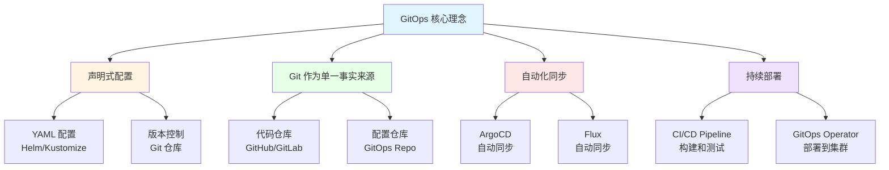

# 26. GitOps 和持续交付：全面梳理

## 目录

- [目录](#目录)
- [26.1 文档定位](#261-文档定位)
- [26.2 GitOps 技术栈全景](#262-gitops-技术栈全景)
  - [26.2.1 GitOps 核心理念](#2621-gitops-核心理念)
  - [26.2.2 技术组件矩阵](#2622-技术组件矩阵)
  - [26.2.3 技术栈组合](#2623-技术栈组合)
- [26.3 GitOps 工具技术规格](#263-gitops-工具技术规格)
  - [26.3.1 ArgoCD 规格](#2631-argocd-规格)
  - [26.3.2 Flux 规格](#2632-flux-规格)
  - [26.3.3 Fleet 规格](#2633-fleet-规格)
  - [26.3.4 GitOps 工具对比](#2634-gitops-工具对比)
- [26.4 CI/CD 技术规格](#264-cicd-技术规格)
  - [26.4.1 GitHub Actions 规格](#2641-github-actions-规格)
  - [26.4.2 GitLab CI 规格](#2642-gitlab-ci-规格)
  - [26.4.3 Jenkins 规格](#2643-jenkins-规格)
  - [26.4.4 Tekton 规格](#2644-tekton-规格)
  - [26.4.5 CI/CD 工具对比](#2645-cicd-工具对比)
- [26.5 包管理技术规格](#265-包管理技术规格)
  - [26.5.1 Helm 规格](#2651-helm-规格)
  - [26.5.2 Kustomize 规格](#2652-kustomize-规格)
  - [26.5.3 Carvel 规格](#2653-carvel-规格)
  - [26.5.4 包管理工具对比](#2654-包管理工具对比)
- [26.6 版本管理技术规格](#266-版本管理技术规格)
  - [26.6.1 Semantic Versioning](#2661-semantic-versioning)
  - [26.6.2 镜像版本管理](#2662-镜像版本管理)
  - [26.6.3 配置版本管理](#2663-配置版本管理)
  - [26.6.4 回滚策略](#2664-回滚策略)
- [26.7 多环境管理技术规格](#267-多环境管理技术规格)
  - [26.7.1 环境分层](#2671-环境分层)
  - [26.7.2 配置管理](#2672-配置管理)
  - [26.7.3 环境同步](#2673-环境同步)
  - [26.7.4 蓝绿部署](#2674-蓝绿部署)
  - [26.7.5 金丝雀部署](#2675-金丝雀部署)
- [26.8 GitOps 技术栈组合方案](#268-gitops-技术栈组合方案)
  - [26.8.1 小规模集群组合](#2681-小规模集群组合)
  - [26.8.2 大规模集群组合](#2682-大规模集群组合)
  - [26.8.3 多集群组合](#2683-多集群组合)
  - [26.8.4 边缘计算组合](#2684-边缘计算组合)
- [26.9 最佳实践](#269-最佳实践)
  - [26.9.1 Git 分支策略](#2691-git-分支策略)
  - [26.9.2 配置管理最佳实践](#2692-配置管理最佳实践)
  - [26.9.3 部署流程最佳实践](#2693-部署流程最佳实践)
  - [26.9.4 安全最佳实践](#2694-安全最佳实践)
- [26.10 参考](#2610-参考)

---

## 26.1 文档定位

本文档全面梳理云原生容器技术栈中的 GitOps 和持续交付技术、规格和最佳实践，包括
GitOps 工具（ArgoCD、Flux）、CI/CD 工具（GitHub Actions、GitLab
CI、Jenkins、Tekton）、包管理工具（Helm、Kustomize）等技术。

**文档结构**：

- **GitOps 技术栈全景**：GitOps 核心理念、技术组件矩阵、技术栈组合
- **GitOps 工具技术规格**：ArgoCD、Flux、Fleet 等 GitOps 工具详细规格
- **CI/CD 技术规格**：GitHub Actions、GitLab CI、Jenkins、Tekton 等 CI/CD 工具规
  格
- **包管理技术规格**：Helm、Kustomize、Carvel 等包管理工具规格
- **版本管理技术规格**：语义化版本、镜像版本管理、配置版本管理、回滚策略
- **多环境管理技术规格**：环境分层、配置管理、环境同步、蓝绿部署、金丝雀部署
- **GitOps 技术栈组合方案**：不同场景的 GitOps 技术栈组合
- **最佳实践**：Git 分支策略、配置管理、部署流程、安全最佳实践

## 26.2 GitOps 技术栈全景

### 26.2.1 GitOps 核心理念

**GitOps 核心理念**：



**GitOps 核心原则**：

1. **声明式配置**：使用 YAML 定义期望状态
2. **Git 作为单一事实来源**：所有配置存储在 Git 仓库
3. **自动化同步**：自动检测变化并同步到集群
4. **持续部署**：从 Git 到集群的自动化部署流程

**GitOps 工作流程**：

1. **开发**：开发者提交代码和配置到 Git
2. **CI**：持续集成，构建和测试
3. **GitOps**：GitOps 工具自动同步配置到集群
4. **监控**：监控部署状态和健康

### 26.2.2 技术组件矩阵

**GitOps 技术组件矩阵**：

| 组件类别        | 技术           | 定位                    | 成熟度     | 生产验证   |
| --------------- | -------------- | ----------------------- | ---------- | ---------- |
| **GitOps 工具** | ArgoCD         | 声明式 GitOps 工具      | ⭐⭐⭐⭐⭐ | ⭐⭐⭐⭐⭐ |
|                 | Flux           | CNCF GitOps 工具        | ⭐⭐⭐⭐⭐ | ⭐⭐⭐⭐⭐ |
|                 | Fleet          | Rancher 多集群 GitOps   | ⭐⭐⭐⭐   | ⭐⭐⭐⭐   |
| **CI/CD 工具**  | GitHub Actions | GitHub CI/CD            | ⭐⭐⭐⭐⭐ | ⭐⭐⭐⭐⭐ |
|                 | GitLab CI      | GitLab CI/CD            | ⭐⭐⭐⭐⭐ | ⭐⭐⭐⭐⭐ |
|                 | Jenkins        | 传统 CI/CD              | ⭐⭐⭐⭐⭐ | ⭐⭐⭐⭐⭐ |
|                 | Tekton         | Kubernetes 原生 CI/CD   | ⭐⭐⭐⭐   | ⭐⭐⭐⭐   |
| **包管理工具**  | Helm           | Kubernetes 包管理       | ⭐⭐⭐⭐⭐ | ⭐⭐⭐⭐⭐ |
|                 | Kustomize      | Kubernetes 原生配置管理 | ⭐⭐⭐⭐⭐ | ⭐⭐⭐⭐⭐ |
|                 | Carvel         | VMware 配置管理工具     | ⭐⭐⭐     | ⭐⭐⭐     |

### 26.2.3 技术栈组合

**GitOps 技术栈组合方案**：

| 场景                | GitOps 工具 | CI/CD 工具     | 包管理工具     | 特点                |
| ------------------- | ----------- | -------------- | -------------- | ------------------- |
| **小规模集群**      | ArgoCD      | GitHub Actions | Helm/Kustomize | 简单易用、配置简单  |
| **大规模集群**      | ArgoCD      | GitLab CI      | Helm           | 功能丰富、可扩展    |
| **多集群**          | Fleet       | GitHub Actions | Helm           | 多集群管理          |
| **边缘计算**        | Flux        | GitHub Actions | Kustomize      | 轻量级、适合边缘    |
| **Kubernetes 原生** | Flux        | Tekton         | Kustomize      | Kubernetes 原生工具 |

## 26.3 GitOps 工具技术规格

### 26.3.1 ArgoCD 规格

**ArgoCD 规格**：

**定义**：ArgoCD 是专为 Kubernetes 设计的声明式 GitOps 持续交付工具。

**技术特点**：

- ✅ 声明式 GitOps
- ✅ Web UI 和 CLI
- ✅ 多集群支持
- ✅ RBAC 集成
- ✅ 应用健康监控
- ✅ 同步状态监控
- ✅ 回滚和同步策略

**版本信息**：

- **最新版本**：v2.10.0+（2024）
- **GitHub Stars**：15K+
- **生产验证**：✅ 大规模生产使用
- **CNCF 项目**：✅ 毕业项目

**核心组件**：

1. **ArgoCD Server**：API 服务器和 Web UI
2. **ArgoCD Application Controller**：应用控制器，同步应用
3. **ArgoCD Repo Server**：仓库服务器，获取 Git 仓库内容
4. **ArgoCD Dex**：身份认证服务器（可选）

**配置示例**：

```yaml
apiVersion: argoproj.io/v1alpha1
kind: Application
metadata:
  name: my-app
  namespace: argocd
spec:
  project: default
  source:
    repoURL: https://github.com/example/repo.git
    targetRevision: main
    path: apps/my-app
  destination:
    server: https://kubernetes.default.svc
    namespace: default
  syncPolicy:
    automated:
      prune: true
      selfHeal: true
    syncOptions:
      - CreateNamespace=true
```

**架构特点**：

- ✅ 声明式配置管理
- ✅ 自动化同步
- ✅ 健康检查和状态监控
- ✅ 多环境支持
- ✅ 回滚能力

### 26.3.2 Flux 规格

**Flux 规格**：

**定义**：Flux 是 CNCF 的 GitOps 工具，专为 Kubernetes 设计。

**技术特点**：

- ✅ CNCF 项目
- ✅ Kubernetes 原生
- ✅ 声明式配置
- ✅ 自动化同步
- ✅ 多租户支持
- ✅ Helm 和 Kustomize 支持

**版本信息**：

- **最新版本**：v2.2.0+（2024）
- **GitHub Stars**：6K+
- **生产验证**：✅ 大规模生产使用
- **CNCF 项目**：✅ 孵化项目

**核心组件**：

1. **Source Controller**：Git 和 Helm 仓库控制器
2. **Kustomize Controller**：Kustomize 应用控制器
3. **Helm Controller**：Helm 应用控制器
4. **Image Automation Controller**：镜像自动化控制器
5. **Notification Controller**：通知控制器

**配置示例**：

```yaml
apiVersion: source.toolkit.fluxcd.io/v1beta2
kind: GitRepository
metadata:
  name: my-app
  namespace: flux-system
spec:
  interval: 1m
  url: https://github.com/example/repo.git
  ref:
    branch: main
---
apiVersion: kustomize.toolkit.fluxcd.io/v1
kind: Kustomization
metadata:
  name: my-app
  namespace: flux-system
spec:
  interval: 5m
  path: ./apps/my-app
  prune: true
  sourceRef:
    kind: GitRepository
    name: my-app
  validation: client
```

### 26.3.3 Fleet 规格

**Fleet 规格**：

**定义**：Fleet 是 Rancher 的多集群 GitOps 工具，用于管理大量 Kubernetes 集群。

**技术特点**：

- ✅ 多集群管理
- ✅ 边缘集群支持
- ✅ 轻量级部署
- ✅ 配置漂移检测
- ✅ 批量部署

**版本信息**：

- **最新版本**：v0.10.0+（2024）
- **GitHub Stars**：500+
- **生产验证**：✅ 多集群场景使用

**适用场景**：

- ✅ 多集群管理
- ✅ 边缘集群管理
- ✅ K3s 集群管理
- ✅ 大规模集群部署

### 26.3.4 GitOps 工具对比

**GitOps 工具对比矩阵**：

| 工具       | 定位          | 多集群支持 | Web UI  | 成熟度     | 推荐场景        |
| ---------- | ------------- | ---------- | ------- | ---------- | --------------- |
| **ArgoCD** | 声明式 GitOps | ✅         | ✅      | ⭐⭐⭐⭐⭐ | 大多数场景      |
| **Flux**   | CNCF GitOps   | ⚠️ 部分    | ⚠️ 社区 | ⭐⭐⭐⭐⭐ | Kubernetes 原生 |
| **Fleet**  | 多集群 GitOps | ✅         | ✅      | ⭐⭐⭐⭐   | 多集群、边缘    |

## 26.4 CI/CD 技术规格

### 26.4.1 GitHub Actions 规格

**GitHub Actions 规格**：

**定义**：GitHub Actions 是 GitHub 的内置 CI/CD 平台。

**技术特点**：

- ✅ 与 GitHub 深度集成
- ✅ 丰富的 Action 市场
- ✅ 免费额度（开源项目）
- ✅ 矩阵构建支持
- ✅ 缓存支持

**版本信息**：

- **最新版本**：持续更新（2024）
- **使用量**：数百万仓库
- **生产验证**：✅ 大规模使用

**工作流示例**：

```yaml
name: CI/CD

on:
  push:
    branches: [main]
  pull_request:
    branches: [main]

jobs:
  build:
    runs-on: ubuntu-latest
    steps:
      - uses: actions/checkout@v4
      - name: Build Docker image
        run: |
          docker build -t myapp:${{ github.sha }} .
      - name: Push to registry
        run: |
          docker push myapp:${{ github.sha }}
      - name: Deploy to Kubernetes
        run: |
          kubectl set image deployment/myapp myapp=myapp:${{ github.sha }}
```

### 26.4.2 GitLab CI 规格

**GitLab CI 规格**：

**定义**：GitLab CI 是 GitLab 的内置 CI/CD 平台。

**技术特点**：

- ✅ 与 GitLab 深度集成
- ✅ 完整的 DevOps 平台
- ✅ 自托管支持
- ✅ 流水线可视化
- ✅ 安全扫描集成

**版本信息**：

- **最新版本**：持续更新（2024）
- **使用量**：数十万项目
- **生产验证**：✅ 大规模使用

### 26.4.3 Jenkins 规格

**Jenkins 规格**：

**定义**：Jenkins 是开源的 CI/CD 服务器，支持丰富的插件生态。

**技术特点**：

- ✅ 丰富的插件生态
- ✅ 灵活的流水线配置
- ✅ 自托管部署
- ✅ 与各种工具集成
- ⚠️ 配置相对复杂

**版本信息**：

- **最新版本**：v2.450.0+（2024）
- **GitHub Stars**：22K+
- **生产验证**：✅ 大规模生产使用

### 26.4.4 Tekton 规格

**Tekton 规格**：

**定义**：Tekton 是 Kubernetes 原生的 CI/CD 框架。

**技术特点**：

- ✅ Kubernetes 原生
- ✅ 声明式流水线
- ✅ CRD 扩展
- ✅ 云原生设计
- ✅ CNCF 项目

**版本信息**：

- **最新版本**：v0.57.0+（2024）
- **GitHub Stars**：7K+
- **生产验证**：✅ 中等规模使用
- **CNCF 项目**：✅ 孵化项目

### 26.4.5 CI/CD 工具对比

**CI/CD 工具对比矩阵**：

| 工具               | 定位            | 部署方式   | 易用性     | 成熟度     | 推荐场景     |
| ------------------ | --------------- | ---------- | ---------- | ---------- | ------------ |
| **GitHub Actions** | GitHub CI/CD    | 云托管     | ⭐⭐⭐⭐⭐ | ⭐⭐⭐⭐⭐ | GitHub 项目  |
| **GitLab CI**      | GitLab CI/CD    | 自托管/云  | ⭐⭐⭐⭐⭐ | ⭐⭐⭐⭐⭐ | GitLab 项目  |
| **Jenkins**        | 传统 CI/CD      | 自托管     | ⭐⭐⭐     | ⭐⭐⭐⭐⭐ | 传统企业环境 |
| **Tekton**         | Kubernetes 原生 | Kubernetes | ⭐⭐⭐⭐   | ⭐⭐⭐⭐   | 云原生环境   |

## 26.5 包管理技术规格

### 26.5.1 Helm 规格

**Helm 规格**：

**定义**：Helm 是 Kubernetes 的包管理工具，使用 Chart 管理应用。

**技术特点**：

- ✅ 包管理
- ✅ 模板化配置
- ✅ 依赖管理
- ✅ 版本管理
- ✅ 回滚能力
- ✅ 丰富的 Chart 市场

**版本信息**：

- **最新版本**：v3.13.0+（2024）
- **GitHub Stars**：26K+
- **生产验证**：✅ 大规模生产使用
- **CNCF 项目**：✅ 毕业项目

**Chart 结构**：

```text
my-app/
  Chart.yaml
  values.yaml
  charts/
  templates/
    deployment.yaml
    service.yaml
    ingress.yaml
```

**配置示例**：

```yaml
# values.yaml
replicaCount: 3
image:
  repository: nginx
  tag: "1.25"
service:
  type: ClusterIP
  port: 80
```

### 26.5.2 Kustomize 规格

**Kustomize 规格**：

**定义**：Kustomize 是 Kubernetes 的原生配置管理工具，无需模板。

**技术特点**：

- ✅ Kubernetes 原生
- ✅ 无需模板引擎
- ✅ 声明式配置
- ✅ 叠加（Overlay）支持
- ✅ 与 kubectl 集成

**版本信息**：

- **最新版本**：v5.2.0+（2024）
- **GitHub Stars**：8K+
- **生产验证**：✅ 广泛使用
- **Kubernetes 官方工具**：✅

**配置示例**：

```yaml
# kustomization.yaml
apiVersion: kustomize.config.k8s.io/v1beta1
kind: Kustomization

resources:
  - deployment.yaml
  - service.yaml

replicas:
  - name: my-app
    count: 3

images:
  - name: nginx
    newTag: "1.25"
```

### 26.5.3 Carvel 规格

**Carvel 规格**：

**定义**：Carvel 是 VMware 的 Kubernetes 配置管理工具集。

**技术特点**：

- ✅ 工具集（kapp、ytt、kbld 等）
- ✅ 模板化配置
- ✅ 应用管理
- ✅ 依赖管理

**版本信息**：

- **最新版本**：v0.55.0+（2024）
- **GitHub Stars**：1K+
- **生产验证**：✅ 中等规模使用

### 26.5.4 包管理工具对比

**包管理工具对比矩阵**：

| 工具          | 定位            | 模板支持 | 易用性     | 成熟度     | 推荐场景     |
| ------------- | --------------- | -------- | ---------- | ---------- | ------------ |
| **Helm**      | 包管理          | ✅       | ⭐⭐⭐⭐   | ⭐⭐⭐⭐⭐ | 大多数场景   |
| **Kustomize** | Kubernetes 原生 | ❌       | ⭐⭐⭐⭐⭐ | ⭐⭐⭐⭐⭐ | 简单配置管理 |
| **Carvel**    | 工具集          | ✅       | ⭐⭐⭐     | ⭐⭐⭐     | 高级配置管理 |

## 26.6 版本管理技术规格

### 26.6.1 Semantic Versioning

**Semantic Versioning（语义化版本）规格**：

**定义**：语义化版本是版本号命名规范，格式为 MAJOR.MINOR.PATCH。

**版本格式**：

```text
MAJOR.MINOR.PATCH[-PRERELEASE][+BUILD]
```

**版本规则**：

- **MAJOR**：不兼容的 API 变更
- **MINOR**：向后兼容的功能新增
- **PATCH**：向后兼容的问题修复
- **PRERELEASE**：预发布版本（alpha、beta、rc）
- **BUILD**：构建元数据

**示例**：

- `1.0.0`：初始版本
- `1.1.0`：新增功能
- `1.1.1`：问题修复
- `2.0.0-alpha.1`：预发布版本
- `1.0.0+20240101`：构建版本

### 26.6.2 镜像版本管理

**镜像版本管理规格**：

**版本策略**：

| 策略       | 说明                | 示例             |
| ---------- | ------------------- | ---------------- |
| **Tag**    | 使用语义化版本      | `myapp:1.0.0`    |
| **SHA**    | 使用 Git Commit SHA | `myapp:abc123`   |
| **Branch** | 使用分支名称        | `myapp:main`     |
| **Date**   | 使用日期时间戳      | `myapp:20240101` |

**最佳实践**：

- ✅ 生产环境使用语义化版本
- ✅ 开发环境使用 SHA 或分支名
- ✅ 避免使用 `latest` 标签
- ✅ 支持多版本并存

### 26.6.3 配置版本管理

**配置版本管理规格**：

**版本控制**：

- ✅ Git 作为配置版本控制
- ✅ 分支策略管理环境配置
- ✅ 标签管理发布版本
- ✅ 配置漂移检测和恢复

### 26.6.4 回滚策略

**回滚策略规格**：

**回滚方式**：

| 方式         | 说明                 | 适用场景     |
| ------------ | -------------------- | ------------ |
| **自动回滚** | 健康检查失败自动回滚 | 部署失败检测 |
| **手动回滚** | 手动触发回滚         | 紧急问题修复 |
| **版本回滚** | 回滚到指定版本       | 版本回退     |
| **配置回滚** | 回滚配置到指定版本   | 配置问题修复 |

## 26.7 多环境管理技术规格

### 26.7.1 环境分层

**环境分层规格**：

**典型环境分层**：

```text
Dev -> Test -> Staging -> Production
```

**环境特点**：

| 环境           | 用途       | 特点             |
| -------------- | ---------- | ---------------- |
| **Dev**        | 开发测试   | 频繁部署、不稳定 |
| **Test**       | 功能测试   | 自动化测试、稳定 |
| **Staging**    | 预生产环境 | 生产环境镜像     |
| **Production** | 生产环境   | 稳定、高可用     |

### 26.7.2 配置管理

**配置管理规格**：

**配置策略**：

- ✅ 环境配置分离
- ✅ 敏感配置加密
- ✅ ConfigMap 和 Secret 管理
- ✅ 配置版本控制

### 26.7.3 环境同步

**环境同步规格**：

**同步策略**：

- ✅ GitOps 自动同步
- ✅ 配置漂移检测
- ✅ 手动同步触发
- ✅ 环境间配置同步

### 26.7.4 蓝绿部署

**蓝绿部署规格**：

**定义**：蓝绿部署是同时运行两个生产环境（蓝、绿），切换流量实现零停机部署。

**特点**：

- ✅ 零停机部署
- ✅ 快速回滚
- ✅ 风险隔离
- ⚠️ 资源消耗双倍

### 26.7.5 金丝雀部署

**金丝雀部署规格**：

**定义**：金丝雀部署是逐步将流量切换到新版本，监控健康状态。

**特点**：

- ✅ 渐进式部署
- ✅ 风险最小化
- ✅ 快速回滚
- ✅ 监控驱动

## 26.8 GitOps 技术栈组合方案

### 26.8.1 小规模集群组合

**小规模集群 GitOps 组合**：

**技术栈**：

- **GitOps**：ArgoCD
- **CI/CD**：GitHub Actions
- **包管理**：Helm 或 Kustomize
- **版本管理**：Semantic Versioning

**特点**：

- ✅ 简单易用
- ✅ 配置简单
- ✅ 资源占用低

### 26.8.2 大规模集群组合

**大规模集群 GitOps 组合**：

**技术栈**：

- **GitOps**：ArgoCD（多实例）
- **CI/CD**：GitLab CI
- **包管理**：Helm
- **版本管理**：Semantic Versioning + Git SHA

**特点**：

- ✅ 高可用部署
- ✅ 可扩展性强
- ✅ 完整功能

### 26.8.3 多集群组合

**多集群 GitOps 组合**：

**技术栈**：

- **GitOps**：Fleet 或 ArgoCD（多集群）
- **CI/CD**：GitHub Actions
- **包管理**：Helm
- **版本管理**：Semantic Versioning

**特点**：

- ✅ 多集群管理
- ✅ 批量部署
- ✅ 配置漂移检测

### 26.8.4 边缘计算组合

**边缘计算 GitOps 组合**：

**技术栈**：

- **GitOps**：Flux（轻量级）
- **CI/CD**：GitHub Actions
- **包管理**：Kustomize
- **版本管理**：Git SHA

**特点**：

- ✅ 轻量级部署
- ✅ 资源占用低
- ✅ 适合边缘场景

## 26.9 最佳实践

### 26.9.1 Git 分支策略

**Git 分支策略**：

**策略选项**：

- **Git Flow**：feature -> develop -> release -> main
- **GitHub Flow**：feature -> main
- **GitLab Flow**：feature -> main + environment branches

### 26.9.2 配置管理最佳实践

**配置管理最佳实践**：

- ✅ 环境配置分离
- ✅ 敏感配置加密
- ✅ 配置版本控制
- ✅ 配置漂移检测

### 26.9.3 部署流程最佳实践

**部署流程最佳实践**：

- ✅ 自动化测试
- ✅ 渐进式部署（金丝雀）
- ✅ 健康检查
- ✅ 自动回滚

### 26.9.4 安全最佳实践

**安全最佳实践**：

- ✅ RBAC 权限控制
- ✅ 密钥管理
- ✅ 镜像签名验证
- ✅ 安全扫描集成

## 26.10 参考

- [ArgoCD 官方文档](https://argo-cd.readthedocs.io/)
- [Flux 官方文档](https://fluxcd.io/docs/)
- [Fleet 官方文档](https://fleet.rancher.io/)
- [Helm 官方文档](https://helm.sh/docs/)
- [Kustomize 官方文档](https://kustomize.io/)
- [GitHub Actions 文档](https://docs.github.com/en/actions)
- [GitLab CI 文档](https://docs.gitlab.com/ee/ci/)
- [Tekton 官方文档](https://tekton.dev/docs/)
