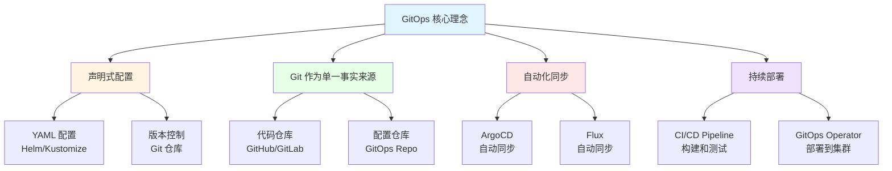

# 17. GitOps 和持续交付：全面梳理

## 📑 目录

- [📑 目录](#-目录)
- [17.1 文档定位](#171-文档定位)
- [17.2 GitOps 技术栈全景](#172-gitops-技术栈全景)
  - [17.2.1 GitOps 核心理念](#1721-gitops-核心理念)
  - [17.2.2 技术组件矩阵](#1722-技术组件矩阵)
  - [17.2.3 技术栈组合](#1723-技术栈组合)
- [17.3 GitOps 工具技术规格](#173-gitops-工具技术规格)
  - [17.3.1 ArgoCD 规格](#1731-argocd-规格)
  - [17.3.2 Flux 规格](#1732-flux-规格)
  - [17.3.3 Fleet 规格](#1733-fleet-规格)
  - [17.3.4 GitOps 工具对比](#1734-gitops-工具对比)
- [17.4 CI/CD 技术规格](#174-cicd-技术规格)
  - [17.4.1 GitHub Actions 规格](#1741-github-actions-规格)
  - [17.4.2 GitLab CI 规格](#1742-gitlab-ci-规格)
  - [17.4.3 Jenkins 规格](#1743-jenkins-规格)
  - [17.4.4 Tekton 规格](#1744-tekton-规格)
  - [17.4.5 CI/CD 工具对比](#1745-cicd-工具对比)
- [17.5 包管理技术规格](#175-包管理技术规格)
  - [17.5.1 Helm 规格](#1751-helm-规格)
  - [17.5.2 Kustomize 规格](#1752-kustomize-规格)
  - [17.5.3 Carvel 规格](#1753-carvel-规格)
  - [17.5.4 包管理工具对比](#1754-包管理工具对比)
- [17.6 版本管理技术规格](#176-版本管理技术规格)
  - [17.6.1 Semantic Versioning](#1761-semantic-versioning)
  - [17.6.2 镜像版本管理](#1762-镜像版本管理)
  - [17.6.3 配置版本管理](#1763-配置版本管理)
  - [17.6.4 回滚策略](#1764-回滚策略)
- [17.7 多环境管理技术规格](#177-多环境管理技术规格)
  - [17.7.1 环境分层](#1771-环境分层)
  - [17.7.2 配置管理](#1772-配置管理)
  - [17.7.3 环境同步](#1773-环境同步)
  - [17.7.4 蓝绿部署](#1774-蓝绿部署)
  - [17.7.5 金丝雀部署](#1775-金丝雀部署)
- [17.8 GitOps 技术栈组合方案](#178-gitops-技术栈组合方案)
  - [17.8.1 小规模集群组合](#1781-小规模集群组合)
  - [17.8.2 大规模集群组合](#1782-大规模集群组合)
  - [17.8.3 多集群组合](#1783-多集群组合)
  - [17.8.4 边缘计算组合](#1784-边缘计算组合)
- [17.9 最佳实践](#179-最佳实践)
  - [17.9.1 Git 分支策略](#1791-git-分支策略)
  - [17.9.2 配置管理最佳实践](#1792-配置管理最佳实践)
  - [17.9.3 部署流程最佳实践](#1793-部署流程最佳实践)
  - [17.9.4 安全最佳实践](#1794-安全最佳实践)
- [17.10 实际部署案例](#1710-实际部署案例)
  - [17.10.1 案例 1：ArgoCD 多环境部署](#17101-案例-1argocd-多环境部署)
  - [17.10.2 案例 2：Flux + Helm 自动化部署](#17102-案例-2flux--helm-自动化部署)
  - [17.10.3 案例 3：GitHub Actions + ArgoCD CI/CD 流水线](#17103-案例-3github-actions--argocd-cicd-流水线)
  - [17.10.4 案例 4：金丝雀部署实践](#17104-案例-4金丝雀部署实践)
- [17.11 GitOps 故障排查](#1711-gitops-故障排查)
  - [17.11.1 ArgoCD 常见问题](#17111-argocd-常见问题)
  - [17.11.2 Flux 常见问题](#17112-flux-常见问题)
- [17.12 GitOps 最佳实践检查清单](#1712-gitops-最佳实践检查清单)
- [17.13 参考](#1713-参考)
  - [17.13.1 2025 年最新更新（2025-11-06）](#17131-2025-年最新更新2025-11-06)
  - [17.13.2 隔离栈相关文档](#17132-隔离栈相关文档)
  - [17.13.3 GitOps 和 CI/CD 相关文档](#17133-gitops-和-cicd-相关文档)
  - [17.13.4 外部参考](#17134-外部参考)

---

## 17.1 文档定位

本文档全面梳理云原生容器技术栈中的 GitOps 和持续交付技术、规格和最佳实践，包括
GitOps 工具（ArgoCD、Flux）、CI/CD 工具（GitHub Actions、GitLab
CI、Jenkins、Tekton）、包管理工具（Helm、Kustomize）等技术。

**文档结构**：

- **GitOps 技术栈全景**：GitOps 核心理念、技术组件矩阵、技术栈组合
- **GitOps 工具技术规格**：ArgoCD、Flux、Fleet 等 GitOps 工具详细规格
- **CI/CD 技术规格**：GitHub Actions、GitLab CI、Jenkins、Tekton 等 CI/CD 工具规
  格
- **包管理技术规格**：Helm、Kustomize、Carvel 等包管理工具规格
- **版本管理技术规格**：语义化版本、镜像版本管理、配置版本管理、回滚策略
- **多环境管理技术规格**：环境分层、配置管理、环境同步、蓝绿部署、金丝雀部署
- **GitOps 技术栈组合方案**：不同场景的 GitOps 技术栈组合
- **最佳实践**：Git 分支策略、配置管理、部署流程、安全最佳实践

## 17.2 GitOps 技术栈全景

### 17.2.1 GitOps 核心理念

**GitOps 核心理念**：



**GitOps 核心原则**：

1. **声明式配置**：使用 YAML 定义期望状态
2. **Git 作为单一事实来源**：所有配置存储在 Git 仓库
3. **自动化同步**：自动检测变化并同步到集群
4. **持续部署**：从 Git 到集群的自动化部署流程

**GitOps 工作流程**：

1. **开发**：开发者提交代码和配置到 Git
2. **CI**：持续集成，构建和测试
3. **GitOps**：GitOps 工具自动同步配置到集群
4. **监控**：监控部署状态和健康

### 17.2.2 技术组件矩阵

**GitOps 技术组件矩阵**：

| 组件类别        | 技术           | 定位                    | 成熟度     | 生产验证   |
| --------------- | -------------- | ----------------------- | ---------- | ---------- |
| **GitOps 工具** | ArgoCD         | 声明式 GitOps 工具      | ⭐⭐⭐⭐⭐ | ⭐⭐⭐⭐⭐ |
|                 | Flux           | CNCF GitOps 工具        | ⭐⭐⭐⭐⭐ | ⭐⭐⭐⭐⭐ |
|                 | Fleet          | Rancher 多集群 GitOps   | ⭐⭐⭐⭐   | ⭐⭐⭐⭐   |
| **CI/CD 工具**  | GitHub Actions | GitHub CI/CD            | ⭐⭐⭐⭐⭐ | ⭐⭐⭐⭐⭐ |
|                 | GitLab CI      | GitLab CI/CD            | ⭐⭐⭐⭐⭐ | ⭐⭐⭐⭐⭐ |
|                 | Jenkins        | 传统 CI/CD              | ⭐⭐⭐⭐⭐ | ⭐⭐⭐⭐⭐ |
|                 | Tekton         | Kubernetes 原生 CI/CD   | ⭐⭐⭐⭐   | ⭐⭐⭐⭐   |
| **包管理工具**  | Helm           | Kubernetes 包管理       | ⭐⭐⭐⭐⭐ | ⭐⭐⭐⭐⭐ |
|                 | Kustomize      | Kubernetes 原生配置管理 | ⭐⭐⭐⭐⭐ | ⭐⭐⭐⭐⭐ |
|                 | Carvel         | VMware 配置管理工具     | ⭐⭐⭐     | ⭐⭐⭐     |

### 17.2.3 技术栈组合

**GitOps 技术栈组合方案**：

| 场景                | GitOps 工具 | CI/CD 工具     | 包管理工具     | 特点                |
| ------------------- | ----------- | -------------- | -------------- | ------------------- |
| **小规模集群**      | ArgoCD      | GitHub Actions | Helm/Kustomize | 简单易用、配置简单  |
| **大规模集群**      | ArgoCD      | GitLab CI      | Helm           | 功能丰富、可扩展    |
| **多集群**          | Fleet       | GitHub Actions | Helm           | 多集群管理          |
| **边缘计算**        | Flux        | GitHub Actions | Kustomize      | 轻量级、适合边缘    |
| **Kubernetes 原生** | Flux        | Tekton         | Kustomize      | Kubernetes 原生工具 |

## 17.3 GitOps 工具技术规格

### 17.3.1 ArgoCD 规格

**ArgoCD 规格**：

**定义**：ArgoCD 是专为 Kubernetes 设计的声明式 GitOps 持续交付工具。

**技术特点**：

- ✅ 声明式 GitOps
- ✅ Web UI 和 CLI
- ✅ 多集群支持
- ✅ RBAC 集成
- ✅ 应用健康监控
- ✅ 同步状态监控
- ✅ 回滚和同步策略

**版本信息**：

- **最新版本**：v2.10.0+（2024）
- **GitHub Stars**：15K+
- **生产验证**：✅ 大规模生产使用
- **CNCF 项目**：✅ 毕业项目

**核心组件**：

1. **ArgoCD Server**：API 服务器和 Web UI
2. **ArgoCD Application Controller**：应用控制器，同步应用
3. **ArgoCD Repo Server**：仓库服务器，获取 Git 仓库内容
4. **ArgoCD Dex**：身份认证服务器（可选）

**配置示例**：

```yaml
apiVersion: argoproj.io/v1alpha1
kind: Application
metadata:
  name: my-app
  namespace: argocd
spec:
  project: default
  source:
    repoURL: https://github.com/example/repo.git
    targetRevision: main
    path: apps/my-app
  destination:
    server: https://kubernetes.default.svc
    namespace: default
  syncPolicy:
    automated:
      prune: true
      selfHeal: true
    syncOptions:
      - CreateNamespace=true
```

**架构特点**：

- ✅ 声明式配置管理
- ✅ 自动化同步
- ✅ 健康检查和状态监控
- ✅ 多环境支持
- ✅ 回滚能力

### 17.3.2 Flux 规格

**Flux 规格**：

**定义**：Flux 是 CNCF 的 GitOps 工具，专为 Kubernetes 设计。

**技术特点**：

- ✅ CNCF 项目
- ✅ Kubernetes 原生
- ✅ 声明式配置
- ✅ 自动化同步
- ✅ 多租户支持
- ✅ Helm 和 Kustomize 支持

**版本信息**：

- **最新版本**：v2.2.0+（2024）
- **GitHub Stars**：6K+
- **生产验证**：✅ 大规模生产使用
- **CNCF 项目**：✅ 孵化项目

**核心组件**：

1. **Source Controller**：Git 和 Helm 仓库控制器
2. **Kustomize Controller**：Kustomize 应用控制器
3. **Helm Controller**：Helm 应用控制器
4. **Image Automation Controller**：镜像自动化控制器
5. **Notification Controller**：通知控制器

**配置示例**：

```yaml
apiVersion: source.toolkit.fluxcd.io/v1beta2
kind: GitRepository
metadata:
  name: my-app
  namespace: flux-system
spec:
  interval: 1m
  url: https://github.com/example/repo.git
  ref:
    branch: main
---
apiVersion: kustomize.toolkit.fluxcd.io/v1
kind: Kustomization
metadata:
  name: my-app
  namespace: flux-system
spec:
  interval: 5m
  path: ./apps/my-app
  prune: true
  sourceRef:
    kind: GitRepository
    name: my-app
  validation: client
```

### 17.3.3 Fleet 规格

**Fleet 规格**：

**定义**：Fleet 是 Rancher 的多集群 GitOps 工具，用于管理大量 Kubernetes 集群。

**技术特点**：

- ✅ 多集群管理
- ✅ 边缘集群支持
- ✅ 轻量级部署
- ✅ 配置漂移检测
- ✅ 批量部署

**版本信息**：

- **最新版本**：v0.10.0+（2024）
- **GitHub Stars**：500+
- **生产验证**：✅ 多集群场景使用

**适用场景**：

- ✅ 多集群管理
- ✅ 边缘集群管理
- ✅ K3s 集群管理
- ✅ 大规模集群部署

### 17.3.4 GitOps 工具对比

**GitOps 工具对比矩阵**：

| 工具       | 定位          | 多集群支持 | Web UI  | 成熟度     | 推荐场景        |
| ---------- | ------------- | ---------- | ------- | ---------- | --------------- |
| **ArgoCD** | 声明式 GitOps | ✅         | ✅      | ⭐⭐⭐⭐⭐ | 大多数场景      |
| **Flux**   | CNCF GitOps   | ⚠️ 部分    | ⚠️ 社区 | ⭐⭐⭐⭐⭐ | Kubernetes 原生 |
| **Fleet**  | 多集群 GitOps | ✅         | ✅      | ⭐⭐⭐⭐   | 多集群、边缘    |

## 17.4 CI/CD 技术规格

### 17.4.1 GitHub Actions 规格

**GitHub Actions 规格**：

**定义**：GitHub Actions 是 GitHub 的内置 CI/CD 平台。

**技术特点**：

- ✅ 与 GitHub 深度集成
- ✅ 丰富的 Action 市场
- ✅ 免费额度（开源项目）
- ✅ 矩阵构建支持
- ✅ 缓存支持

**版本信息**：

- **最新版本**：持续更新（2024）
- **使用量**：数百万仓库
- **生产验证**：✅ 大规模使用

**工作流示例**：

```yaml
name: CI/CD

on:
  push:
    branches: [main]
  pull_request:
    branches: [main]

jobs:
  build:
    runs-on: ubuntu-latest
    steps:
      - uses: actions/checkout@v4
      - name: Build Docker image
        run: |
          docker build -t myapp:${{ github.sha }} .
      - name: Push to registry
        run: |
          docker push myapp:${{ github.sha }}
      - name: Deploy to Kubernetes
        run: |
          kubectl set image deployment/myapp myapp=myapp:${{ github.sha }}
```

### 17.4.2 GitLab CI 规格

**GitLab CI 规格**：

**定义**：GitLab CI 是 GitLab 的内置 CI/CD 平台。

**技术特点**：

- ✅ 与 GitLab 深度集成
- ✅ 完整的 DevOps 平台
- ✅ 自托管支持
- ✅ 流水线可视化
- ✅ 安全扫描集成

**版本信息**：

- **最新版本**：持续更新（2024）
- **使用量**：数十万项目
- **生产验证**：✅ 大规模使用

### 17.4.3 Jenkins 规格

**Jenkins 规格**：

**定义**：Jenkins 是开源的 CI/CD 服务器，支持丰富的插件生态。

**技术特点**：

- ✅ 丰富的插件生态
- ✅ 灵活的流水线配置
- ✅ 自托管部署
- ✅ 与各种工具集成
- ⚠️ 配置相对复杂

**版本信息**：

- **最新版本**：v2.450.0+（2024）
- **GitHub Stars**：22K+
- **生产验证**：✅ 大规模生产使用

### 17.4.4 Tekton 规格

**Tekton 规格**：

**定义**：Tekton 是 Kubernetes 原生的 CI/CD 框架。

**技术特点**：

- ✅ Kubernetes 原生
- ✅ 声明式流水线
- ✅ CRD 扩展
- ✅ 云原生设计
- ✅ CNCF 项目

**版本信息**：

- **最新版本**：v0.57.0+（2024）
- **GitHub Stars**：7K+
- **生产验证**：✅ 中等规模使用
- **CNCF 项目**：✅ 孵化项目

### 17.4.5 CI/CD 工具对比

**CI/CD 工具对比矩阵**：

| 工具               | 定位            | 部署方式   | 易用性     | 成熟度     | 推荐场景     |
| ------------------ | --------------- | ---------- | ---------- | ---------- | ------------ |
| **GitHub Actions** | GitHub CI/CD    | 云托管     | ⭐⭐⭐⭐⭐ | ⭐⭐⭐⭐⭐ | GitHub 项目  |
| **GitLab CI**      | GitLab CI/CD    | 自托管/云  | ⭐⭐⭐⭐⭐ | ⭐⭐⭐⭐⭐ | GitLab 项目  |
| **Jenkins**        | 传统 CI/CD      | 自托管     | ⭐⭐⭐     | ⭐⭐⭐⭐⭐ | 传统企业环境 |
| **Tekton**         | Kubernetes 原生 | Kubernetes | ⭐⭐⭐⭐   | ⭐⭐⭐⭐   | 云原生环境   |

## 17.5 包管理技术规格

### 17.5.1 Helm 规格

**Helm 规格**：

**定义**：Helm 是 Kubernetes 的包管理工具，使用 Chart 管理应用。

**技术特点**：

- ✅ 包管理
- ✅ 模板化配置
- ✅ 依赖管理
- ✅ 版本管理
- ✅ 回滚能力
- ✅ 丰富的 Chart 市场

**版本信息**：

- **最新版本**：v3.13.0+（2024）
- **GitHub Stars**：26K+
- **生产验证**：✅ 大规模生产使用
- **CNCF 项目**：✅ 毕业项目

**Chart 结构**：

```text
my-app/
  Chart.yaml
  values.yaml
  charts/
  templates/
    deployment.yaml
    service.yaml
    ingress.yaml
```

**配置示例**：

```yaml
# values.yaml
replicaCount: 3
image:
  repository: nginx
  tag: "1.25"
service:
  type: ClusterIP
  port: 80
```

### 17.5.2 Kustomize 规格

**Kustomize 规格**：

**定义**：Kustomize 是 Kubernetes 的原生配置管理工具，无需模板。

**技术特点**：

- ✅ Kubernetes 原生
- ✅ 无需模板引擎
- ✅ 声明式配置
- ✅ 叠加（Overlay）支持
- ✅ 与 kubectl 集成

**版本信息**：

- **最新版本**：v5.2.0+（2024）
- **GitHub Stars**：8K+
- **生产验证**：✅ 广泛使用
- **Kubernetes 官方工具**：✅

**配置示例**：

```yaml
# kustomization.yaml
apiVersion: kustomize.config.k8s.io/v1beta1
kind: Kustomization

resources:
  - deployment.yaml
  - service.yaml

replicas:
  - name: my-app
    count: 3

images:
  - name: nginx
    newTag: "1.25"
```

### 17.5.3 Carvel 规格

**Carvel 规格**：

**定义**：Carvel 是 VMware 的 Kubernetes 配置管理工具集。

**技术特点**：

- ✅ 工具集（kapp、ytt、kbld 等）
- ✅ 模板化配置
- ✅ 应用管理
- ✅ 依赖管理

**版本信息**：

- **最新版本**：v0.55.0+（2024）
- **GitHub Stars**：1K+
- **生产验证**：✅ 中等规模使用

### 17.5.4 包管理工具对比

**包管理工具对比矩阵**：

| 工具          | 定位            | 模板支持 | 易用性     | 成熟度     | 推荐场景     |
| ------------- | --------------- | -------- | ---------- | ---------- | ------------ |
| **Helm**      | 包管理          | ✅       | ⭐⭐⭐⭐   | ⭐⭐⭐⭐⭐ | 大多数场景   |
| **Kustomize** | Kubernetes 原生 | ❌       | ⭐⭐⭐⭐⭐ | ⭐⭐⭐⭐⭐ | 简单配置管理 |
| **Carvel**    | 工具集          | ✅       | ⭐⭐⭐     | ⭐⭐⭐     | 高级配置管理 |

## 17.6 版本管理技术规格

### 17.6.1 Semantic Versioning

**Semantic Versioning（语义化版本）规格**：

**定义**：语义化版本是版本号命名规范，格式为 MAJOR.MINOR.PATCH。

**版本格式**：

```text
MAJOR.MINOR.PATCH[-PRERELEASE][+BUILD]
```

**版本规则**：

- **MAJOR**：不兼容的 API 变更
- **MINOR**：向后兼容的功能新增
- **PATCH**：向后兼容的问题修复
- **PRERELEASE**：预发布版本（alpha、beta、rc）
- **BUILD**：构建元数据

**示例**：

- `1.0.0`：初始版本
- `1.1.0`：新增功能
- `1.1.1`：问题修复
- `2.0.0-alpha.1`：预发布版本
- `1.0.0+20240101`：构建版本

### 17.6.2 镜像版本管理

**镜像版本管理规格**：

**版本策略**：

| 策略       | 说明                | 示例             |
| ---------- | ------------------- | ---------------- |
| **Tag**    | 使用语义化版本      | `myapp:1.0.0`    |
| **SHA**    | 使用 Git Commit SHA | `myapp:abc123`   |
| **Branch** | 使用分支名称        | `myapp:main`     |
| **Date**   | 使用日期时间戳      | `myapp:20240101` |

**最佳实践**：

- ✅ 生产环境使用语义化版本
- ✅ 开发环境使用 SHA 或分支名
- ✅ 避免使用 `latest` 标签
- ✅ 支持多版本并存

### 17.6.3 配置版本管理

**配置版本管理规格**：

**版本控制**：

- ✅ Git 作为配置版本控制
- ✅ 分支策略管理环境配置
- ✅ 标签管理发布版本
- ✅ 配置漂移检测和恢复

### 17.6.4 回滚策略

**回滚策略规格**：

**回滚方式**：

| 方式         | 说明                 | 适用场景     |
| ------------ | -------------------- | ------------ |
| **自动回滚** | 健康检查失败自动回滚 | 部署失败检测 |
| **手动回滚** | 手动触发回滚         | 紧急问题修复 |
| **版本回滚** | 回滚到指定版本       | 版本回退     |
| **配置回滚** | 回滚配置到指定版本   | 配置问题修复 |

## 17.7 多环境管理技术规格

### 17.7.1 环境分层

**环境分层规格**：

**典型环境分层**：

```text
Dev -> Test -> Staging -> Production
```

**环境特点**：

| 环境           | 用途       | 特点             |
| -------------- | ---------- | ---------------- |
| **Dev**        | 开发测试   | 频繁部署、不稳定 |
| **Test**       | 功能测试   | 自动化测试、稳定 |
| **Staging**    | 预生产环境 | 生产环境镜像     |
| **Production** | 生产环境   | 稳定、高可用     |

### 17.7.2 配置管理

**配置管理规格**：

**配置策略**：

- ✅ 环境配置分离
- ✅ 敏感配置加密
- ✅ ConfigMap 和 Secret 管理
- ✅ 配置版本控制

### 17.7.3 环境同步

**环境同步规格**：

**同步策略**：

- ✅ GitOps 自动同步
- ✅ 配置漂移检测
- ✅ 手动同步触发
- ✅ 环境间配置同步

### 17.7.4 蓝绿部署

**蓝绿部署规格**：

**定义**：蓝绿部署是同时运行两个生产环境（蓝、绿），切换流量实现零停机部署。

**特点**：

- ✅ 零停机部署
- ✅ 快速回滚
- ✅ 风险隔离
- ⚠️ 资源消耗双倍

### 17.7.5 金丝雀部署

**金丝雀部署规格**：

**定义**：金丝雀部署是逐步将流量切换到新版本，监控健康状态。

**特点**：

- ✅ 渐进式部署
- ✅ 风险最小化
- ✅ 快速回滚
- ✅ 监控驱动

## 17.8 GitOps 技术栈组合方案

### 17.8.1 小规模集群组合

**小规模集群 GitOps 组合**：

**技术栈**：

- **GitOps**：ArgoCD
- **CI/CD**：GitHub Actions
- **包管理**：Helm 或 Kustomize
- **版本管理**：Semantic Versioning

**特点**：

- ✅ 简单易用
- ✅ 配置简单
- ✅ 资源占用低

### 17.8.2 大规模集群组合

**大规模集群 GitOps 组合**：

**技术栈**：

- **GitOps**：ArgoCD（多实例）
- **CI/CD**：GitLab CI
- **包管理**：Helm
- **版本管理**：Semantic Versioning + Git SHA

**特点**：

- ✅ 高可用部署
- ✅ 可扩展性强
- ✅ 完整功能

### 17.8.3 多集群组合

**多集群 GitOps 组合**：

**技术栈**：

- **GitOps**：Fleet 或 ArgoCD（多集群）
- **CI/CD**：GitHub Actions
- **包管理**：Helm
- **版本管理**：Semantic Versioning

**特点**：

- ✅ 多集群管理
- ✅ 批量部署
- ✅ 配置漂移检测

### 17.8.4 边缘计算组合

**边缘计算 GitOps 组合**：

**技术栈**：

- **GitOps**：Flux（轻量级）
- **CI/CD**：GitHub Actions
- **包管理**：Kustomize
- **版本管理**：Git SHA

**特点**：

- ✅ 轻量级部署
- ✅ 资源占用低
- ✅ 适合边缘场景

## 17.9 最佳实践

### 17.9.1 Git 分支策略

**Git 分支策略**：

**策略选项**：

- **Git Flow**：feature -> develop -> release -> main
- **GitHub Flow**：feature -> main
- **GitLab Flow**：feature -> main + environment branches

### 17.9.2 配置管理最佳实践

**配置管理最佳实践**：

- ✅ 环境配置分离
- ✅ 敏感配置加密
- ✅ 配置版本控制
- ✅ 配置漂移检测

### 17.9.3 部署流程最佳实践

**部署流程最佳实践**：

- ✅ 自动化测试
- ✅ 渐进式部署（金丝雀）
- ✅ 健康检查
- ✅ 自动回滚

### 17.9.4 安全最佳实践

**安全最佳实践**：

- ✅ RBAC 权限控制
- ✅ 密钥管理
- ✅ 镜像签名验证
- ✅ 安全扫描集成

## 17.10 实际部署案例

### 17.10.1 案例 1：ArgoCD 多环境部署

**场景**：使用 ArgoCD 管理开发、测试、生产三个环境

**目录结构**：

```text
gitops-repo/
├── apps/
│   ├── my-app/
│   │   ├── base/
│   │   │   ├── deployment.yaml
│   │   │   ├── service.yaml
│   │   │   └── kustomization.yaml
│   │   └── overlays/
│   │       ├── dev/
│   │       │   ├── kustomization.yaml
│   │       │   └── config.yaml
│   │       ├── staging/
│   │       │   ├── kustomization.yaml
│   │       │   └── config.yaml
│   │       └── prod/
│   │           ├── kustomization.yaml
│   │           └── config.yaml
├── argocd/
│   └── applications/
│       ├── my-app-dev.yaml
│       ├── my-app-staging.yaml
│       └── my-app-prod.yaml
```

**ArgoCD Application 配置**：

```yaml
# argocd/applications/my-app-dev.yaml
apiVersion: argoproj.io/v1alpha1
kind: Application
metadata:
  name: my-app-dev
  namespace: argocd
spec:
  project: default
  source:
    repoURL: https://github.com/example/gitops-repo.git
    targetRevision: main
    path: apps/my-app/overlays/dev
  destination:
    server: https://kubernetes.default.svc
    namespace: dev
  syncPolicy:
    automated:
      prune: true
      selfHeal: true
    syncOptions:
      - CreateNamespace=true
---
# argocd/applications/my-app-prod.yaml
apiVersion: argoproj.io/v1alpha1
kind: Application
metadata:
  name: my-app-prod
  namespace: argocd
spec:
  project: default
  source:
    repoURL: https://github.com/example/gitops-repo.git
    targetRevision: main
    path: apps/my-app/overlays/prod
  destination:
    server: https://kubernetes.default.svc
    namespace: prod
  syncPolicy:
    automated:
      prune: false # 生产环境需要手动确认
      selfHeal: true
    syncOptions:
      - CreateNamespace=true
```

**Kustomize 配置**：

```yaml
# apps/my-app/base/kustomization.yaml
apiVersion: kustomize.config.k8s.io/v1beta1
kind: Kustomization
resources:
  - deployment.yaml
  - service.yaml

# apps/my-app/overlays/dev/kustomization.yaml
apiVersion: kustomize.config.k8s.io/v1beta1
kind: Kustomization
bases:
  - ../../base
namespace: dev
replicas:
  - name: my-app
    count: 1
images:
  - name: my-app
    newTag: dev-latest
configMapGenerator:
  - name: app-config
    files:
      - config.yaml
```

### 17.10.2 案例 2：Flux + Helm 自动化部署

**场景**：使用 Flux 自动部署 Helm Chart，自动更新镜像版本

**Flux 配置**：

```yaml
# GitRepository
apiVersion: source.toolkit.fluxcd.io/v1beta2
kind: GitRepository
metadata:
  name: my-app
  namespace: flux-system
spec:
  interval: 1m
  url: https://github.com/example/gitops-repo.git
  ref:
    branch: main
---
# HelmRepository
apiVersion: source.toolkit.fluxcd.io/v1beta1
kind: HelmRepository
metadata:
  name: my-charts
  namespace: flux-system
spec:
  interval: 5m
  url: https://charts.example.com
---
# HelmRelease
apiVersion: helm.toolkit.fluxcd.io/v2beta1
kind: HelmRelease
metadata:
  name: my-app
  namespace: flux-system
spec:
  interval: 5m
  chart:
    spec:
      chart: my-app
      sourceRef:
        kind: HelmRepository
        name: my-charts
      version: "1.0.0"
  values:
    replicaCount: 3
    image:
      repository: myapp
      tag: latest
    resources:
      requests:
        cpu: 100m
        memory: 128Mi
```

**镜像自动更新配置**：

```yaml
# ImageRepository
apiVersion: image.toolkit.fluxcd.io/v1beta1
kind: ImageRepository
metadata:
  name: my-app
  namespace: flux-system
spec:
  image: myregistry.com/myapp
  interval: 1m
---
# ImagePolicy
apiVersion: image.toolkit.fluxcd.io/v1beta1
kind: ImagePolicy
metadata:
  name: my-app
  namespace: flux-system
spec:
  imageRepositoryRef:
    name: my-app
  policy:
    semver:
      range: ">=1.0.0"
---
# HelmRelease（更新）
apiVersion: helm.toolkit.fluxcd.io/v2beta1
kind: HelmRelease
metadata:
  name: my-app
  namespace: flux-system
spec:
  interval: 5m
  chart:
    spec:
      chart: my-app
      sourceRef:
        kind: HelmRepository
        name: my-charts
      version: "1.0.0"
  values:
    image:
      repository: myregistry.com/myapp
      tag: "1.0.0" # 会被 ImagePolicy 自动更新
```

### 17.10.3 案例 3：GitHub Actions + ArgoCD CI/CD 流水线

**场景**：使用 GitHub Actions 构建镜像，ArgoCD 自动部署

**GitHub Actions 工作流**：

```yaml
# .github/workflows/ci-cd.yml
name: CI/CD Pipeline

on:
  push:
    branches: [main, develop]
  pull_request:
    branches: [main]

jobs:
  build:
    runs-on: ubuntu-latest
    steps:
      - uses: actions/checkout@v3

      - name: Build Docker image
        run: |
          docker build -t myregistry.com/myapp:${{ github.sha }} .
          docker push myregistry.com/myapp:${{ github.sha }}

      - name: Update GitOps repo
        env:
          GITHUB_TOKEN: ${{ secrets.GITOPS_TOKEN }}
        run: |
          git clone https://github.com/example/gitops-repo.git
          cd gitops-repo
          # 更新镜像标签
          sed -i "s|image: myregistry.com/myapp:.*|image: myregistry.com/myapp:${{ github.sha }}|g" \
            apps/my-app/base/deployment.yaml
          git config user.name "GitHub Actions"
          git config user.email "actions@github.com"
          git add apps/my-app/base/deployment.yaml
          git commit -m "Update my-app image to ${{ github.sha }}"
          git push

      - name: Trigger ArgoCD sync
        run: |
          argocd app sync my-app-dev
```

**ArgoCD Webhook 配置**：

```yaml
# argocd/applications/my-app-dev.yaml
apiVersion: argoproj.io/v1alpha1
kind: Application
metadata:
  name: my-app-dev
  namespace: argocd
  annotations:
    notifications.argoproj.io/subscribe.on-sync-succeeded.slack: argocd
spec:
  project: default
  source:
    repoURL: https://github.com/example/gitops-repo.git
    targetRevision: main
    path: apps/my-app/overlays/dev
  destination:
    server: https://kubernetes.default.svc
    namespace: dev
  syncPolicy:
    automated:
      prune: true
      selfHeal: true
      syncOptions:
        - CreateNamespace=true
```

### 17.10.4 案例 4：金丝雀部署实践

**场景**：使用 ArgoCD 实现金丝雀部署策略

**Rollout 配置**：

```yaml
# apps/my-app/base/rollout.yaml
apiVersion: argoproj.io/v1alpha1
kind: Rollout
metadata:
  name: my-app
spec:
  replicas: 10
  strategy:
    canary:
      steps:
        - setWeight: 10
        - pause: { duration: 1h }
        - setWeight: 25
        - pause: { duration: 1h }
        - setWeight: 50
        - pause: { duration: 1h }
        - setWeight: 100
      canaryService: my-app-canary
      stableService: my-app-stable
      trafficRouting:
        istio:
          virtualService:
            name: my-app
            routes:
              - primary
  selector:
    matchLabels:
      app: my-app
  template:
    metadata:
      labels:
        app: my-app
    spec:
      containers:
        - name: my-app
          image: myregistry.com/myapp:v1.0.0
          ports:
            - containerPort: 8080
```

**ArgoCD Application 配置**：

```yaml
apiVersion: argoproj.io/v1alpha1
kind: Application
metadata:
  name: my-app-canary
  namespace: argocd
spec:
  project: default
  source:
    repoURL: https://github.com/example/gitops-repo.git
    targetRevision: main
    path: apps/my-app/overlays/prod
  destination:
    server: https://kubernetes.default.svc
    namespace: prod
  syncPolicy:
    automated:
      prune: false
      selfHeal: false
    syncOptions:
      - CreateNamespace=true
```

## 17.11 GitOps 故障排查

### 17.11.1 ArgoCD 常见问题

**问题 1：应用同步失败**:

```bash
# 检查应用状态
argocd app get my-app

# 检查同步历史
argocd app history my-app

# 查看详细错误
argocd app logs my-app

# 手动同步
argocd app sync my-app --force
```

**问题 2：Git 仓库认证失败**:

```bash
# 更新 Git 仓库凭证
argocd repo add https://github.com/example/repo.git \
  --username myuser \
  --password mytoken

# 或使用 SSH
argocd repo add git@github.com:example/repo.git \
  --ssh-private-key-path ~/.ssh/id_rsa
```

**问题 3：资源冲突**:

```bash
# 检查资源状态
kubectl get all -n <namespace>

# 强制替换
argocd app sync my-app --replace

# 删除冲突资源
kubectl delete <resource-type> <resource-name> -n <namespace>
```

### 17.11.2 Flux 常见问题

**问题 1：GitRepository 无法连接**:

```bash
# 检查 GitRepository 状态
kubectl get gitrepository -n flux-system

# 查看详细事件
kubectl describe gitrepository my-app -n flux-system

# 检查 Secret
kubectl get secret -n flux-system
```

**问题 2：Kustomization 同步失败**:

```bash
# 检查 Kustomization 状态
kubectl get kustomization -n flux-system

# 查看详细事件
kubectl describe kustomization my-app -n flux-system

# 手动触发同步
flux reconcile kustomization my-app -n flux-system
```

**问题 3：镜像自动更新不工作**:

```bash
# 检查 ImageRepository 状态
kubectl get imagerepository -n flux-system

# 检查 ImagePolicy 状态
kubectl get imagepolicy -n flux-system

# 手动触发镜像扫描
flux reconcile image repository my-app -n flux-system
```

## 17.12 GitOps 最佳实践检查清单

**仓库结构检查清单**：

```yaml
仓库结构:
  目录组织:
    - [ ] 应用配置与应用代码分离
    - [ ] 使用 base/overlays 结构
    - [ ] 环境配置独立管理
    - [ ] 敏感信息使用 Sealed Secrets
  Git 管理:
    - [ ] 使用语义化版本标签
    - [ ] 主要分支保护
    - [ ] PR 审查流程
    - [ ] 提交信息规范
```

**部署流程检查清单**：

```yaml
部署流程:
  自动化:
    - [ ] CI/CD 流水线自动化
    - [ ] 镜像构建自动化
    - [ ] GitOps 同步自动化
    - [ ] 健康检查自动化
  安全:
    - [ ] 镜像签名验证
    - [ ] 安全扫描集成
    - [ ] RBAC 权限控制
    - [ ] 密钥管理（Sealed Secrets/Vault）
  监控:
    - [ ] 部署状态监控
    - [ ] 同步状态告警
    - [ ] 应用健康监控
    - [ ] 回滚机制测试
```

## 17.13 参考

### 17.13.1 2025 年最新更新（2025-11-06）

- **[27. 2025 趋势 - 2025-11-06 最新更新](../27-2025-trends/2025-trends.md#2714-2025-年-11-月-6-日最新更新)** -
  技术版本更新、生产环境最佳实践、已知问题与解决方案
  - **版本信息**：Kubernetes 1.30.5、K3s 1.30.4+k3s2、containerd 1.7.1 等最新版
    本
  - **生产环境最佳实践**：K3s + WasmEdge 混部方案、OPA-Wasm 策略优化
  - **已知问题**：K3s WasmEdge 驱动偶发超时、OPA-Wasm 策略内存泄漏等（已提供解决
    方案）
  - **性能基准测试**：边缘节点性能对比数据（runc vs WasmEdge vs gVisor）
  - **安全更新**：CVE 修复列表和安全建议

**GitOps 相关更新**：

- **Rancher Fleet + GitOps Wasm 策略**：2025 模板已默认带 `policy.wasm` 签名验证
- **镜像签名**：所有镜像必须使用 cosign 签名验证（Sigstore CNCF 毕业）
- **Wasm 策略模块**：必须包含 SBOM（Software Bill of Materials）

### 17.13.2 隔离栈相关文档

- **[29. 隔离栈](../29-isolation-stack/isolation-stack.md)** - 完整的隔离栈技术
  解析，包括部署和运行时
- **[L-3 容器化层](../29-isolation-stack/layers/L-3-containerization.md)** - 容
  器化层详细文档
- **[L-4 沙盒化层](../29-isolation-stack/layers/L-4-sandboxing.md)** - WASM 运行
  时详细文档
- **[隔离层次对比文档](../29-isolation-stack/layers/isolation-comparison.md)** -
  运行时性能对比和技术选型

### 17.13.3 GitOps 和 CI/CD 相关文档

- **[10. 安装部署](../10-installation/installation.md)** - 安装和部署指南
- **[22. 升级和迁移](../22-upgrade-migration/upgrade-migration.md)** - 升级和迁
  移策略
- **[21. 镜像仓库和镜像管理](../21-image-registry/image-registry.md)** - 镜像仓
  库和镜像管理
- **[06. OPA 策略即代码](../06-policy-opa/policy-opa.md)** - OPA-Wasm 策略管理和
  部署

### 17.13.4 外部参考

- [ArgoCD 官方文档](https://argo-cd.readthedocs.io/)
- [Flux 官方文档](https://fluxcd.io/docs/)
- [Fleet 官方文档](https://fleet.rancher.io/)
- [Helm 官方文档](https://helm.sh/docs/)
- [Kustomize 官方文档](https://kustomize.io/)
- [GitHub Actions 文档](https://docs.github.com/en/actions)
- [GitLab CI 文档](https://docs.gitlab.com/ee/ci/)
- [Tekton 官方文档](https://tekton.dev/docs/)
- [Sigstore 官方文档](https://www.sigstore.dev/) - 镜像签名和验证

---

**最后更新**：2025-11-06 **维护者**：项目团队
