# 18. Operator 和 CRD：全面梳理

## 📑 目录

- [18.1 文档定位](#181-文档定位)
- [18.2 Operator 技术栈全景](#182-operator-技术栈全景)
  - [18.2.1 Operator 模式](#1821-operator-模式)
  - [18.2.2 技术组件矩阵](#1822-技术组件矩阵)
  - [18.2.3 技术栈组合](#1823-技术栈组合)
- [18.3 CRD 技术规格](#183-crd-技术规格)
  - [18.3.1 CRD 规范](#1831-crd-规范)
  - [18.3.2 CRD 定义规格](#1832-crd-定义规格)
  - [18.3.3 CRD 验证规格](#1833-crd-验证规格)
  - [18.3.4 CRD 版本管理](#1834-crd-版本管理)
  - [18.3.5 CRD 最佳实践](#1835-crd-最佳实践)
- [18.4 Operator SDK 技术规格](#184-operator-sdk-技术规格)
  - [18.4.1 Operator SDK 规范](#1841-operator-sdk-规范)
  - [18.4.2 Helm Operator 规格](#1842-helm-operator-规格)
  - [18.4.3 Ansible Operator 规格](#1843-ansible-operator-规格)
  - [18.4.4 Go Operator 规格](#1844-go-operator-规格)
  - [18.4.5 Operator SDK 对比](#1845-operator-sdk-对比)
- [18.5 Kubebuilder 技术规格](#185-kubebuilder-技术规格)
  - [18.5.1 Kubebuilder 规范](#1851-kubebuilder-规范)
  - [18.5.2 项目结构](#1852-项目结构)
  - [18.5.3 Controller 开发](#1853-controller-开发)
  - [18.5.4 Webhook 开发](#1854-webhook-开发)
- [18.6 常用 Operator 案例](#186-常用-operator-案例)
  - [18.6.1 Prometheus Operator](#1861-prometheus-operator)
  - [18.6.2 cert-manager Operator](#1862-cert-manager-operator)
  - [18.6.3 Istio Operator](#1863-istio-operator)
  - [18.6.4 Elasticsearch Operator](#1864-elasticsearch-operator)
  - [18.6.5 Operator 对比](#1865-operator-对比)
- [18.7 Controller 模式技术规格](#187-controller-模式技术规格)
  - [18.7.1 Controller 架构](#1871-controller-架构)
  - [18.7.2 Informer 模式](#1872-informer-模式)
  - [18.7.3 Work Queue 模式](#1873-work-queue-模式)
  - [18.7.4 Reconcile 循环](#1874-reconcile-循环)
- [18.8 Webhook 技术规格](#188-webhook-技术规格)
  - [18.8.1 Admission Webhook](#1881-admission-webhook)
  - [18.8.2 Mutating Webhook](#1882-mutating-webhook)
  - [18.8.3 Validating Webhook](#1883-validating-webhook)
  - [18.8.4 Conversion Webhook](#1884-conversion-webhook)
  - [18.8.5 Webhook 最佳实践](#1885-webhook-最佳实践)
- [18.9 Operator 技术栈组合方案](#189-operator-技术栈组合方案)
  - [18.9.1 小规模集群组合](#1891-小规模集群组合)
  - [18.9.2 大规模集群组合](#1892-大规模集群组合)
  - [18.9.3 自定义 Operator 组合](#1893-自定义-operator-组合)
- [18.10 参考](#1810-参考)

---

## 18.1 文档定位

本文档全面梳理云原生容器技术栈中的 Operator 和 CRD 技术、规格和最佳实践，包括
CRD（Custom Resource Definition）、Operator 模式、Operator
SDK、Kubebuilder、Controller 模式、Webhook 等技术。

**文档结构**：

- **Operator 技术栈全景**：Operator 模式、技术组件矩阵、技术栈组合
- **CRD 技术规格**：CRD 规范、定义规格、验证规格、版本管理、最佳实践
- **Operator SDK 技术规格**：Helm Operator、Ansible Operator、Go Operator 规格
- **Kubebuilder 技术规格**：Kubebuilder 规范、项目结构、Controller 开发、Webhook
  开发
- **常用 Operator 案例**：Prometheus Operator、cert-manager、Istio Operator 等
- **Controller 模式技术规格**：Controller 架构、Informer 模式、Work
  Queue、Reconcile 循环
- **Webhook 技术规格**：Admission Webhook、Mutating Webhook、Validating
  Webhook、Conversion Webhook
- **Operator 技术栈组合方案**：不同场景的 Operator 技术栈组合

## 18.2 Operator 技术栈全景

### 18.2.1 Operator 模式

**Operator 模式**：

```mermaid
graph TB
    A[Operator 模式] --> B[CRD<br/>自定义资源定义]
    A --> C[Controller<br/>控制器]
    A --> D[Reconcile Loop<br/>调和循环]

    B --> B1[API 扩展<br/>自定义对象]
    B --> B2[Schema 验证<br/>结构验证]
    B --> B3[版本管理<br/>多版本支持]

    C --> C1[Informer<br/>事件监听]
    C --> C2[Work Queue<br/>工作队列]
    C --> C3[Reconcile<br/>状态调和]

    D --> D1[期望状态<br/>Desired State]
    D --> D2[实际状态<br/>Current State]
    D --> D3[状态同步<br/>State Sync]

    style A fill:#e1f5ff
    style B fill:#fff4e1
    style C fill:#e6ffe6
    style D fill:#ffe6e6
```



**Operator 核心理念**：

1. **CRD（Custom Resource Definition）**：扩展 Kubernetes API，定义自定义资源
2. **Controller**：监听自定义资源变化，执行调和逻辑
3. **Reconcile Loop**：持续调和期望状态和实际状态
4. **声明式 API**：通过 YAML 定义期望状态

**Operator 工作流程**：

1. **定义 CRD**：定义自定义资源的 Schema
2. **创建 Controller**：实现调和逻辑
3. **部署 Operator**：部署到 Kubernetes 集群
4. **创建自定义资源**：用户创建 CR 实例
5. **Controller 调和**：Controller 检测变化并调和状态

### 18.2.2 技术组件矩阵

**Operator 技术组件矩阵**：

| 组件类别          | 技术                   | 定位                      | 成熟度     | 生产验证   |
| ----------------- | ---------------------- | ------------------------- | ---------- | ---------- |
| **开发框架**      | Operator SDK           | Operator 开发 SDK         | ⭐⭐⭐⭐⭐ | ⭐⭐⭐⭐⭐ |
|                   | Kubebuilder            | Kubernetes Controller SDK | ⭐⭐⭐⭐⭐ | ⭐⭐⭐⭐⭐ |
|                   | KubeOps                | KubeOps 开发框架          | ⭐⭐⭐     | ⭐⭐⭐     |
| **Operator 类型** | Helm Operator          | Helm Chart Operator       | ⭐⭐⭐⭐   | ⭐⭐⭐⭐   |
|                   | Ansible Operator       | Ansible Playbook Operator | ⭐⭐⭐⭐   | ⭐⭐⭐⭐   |
|                   | Go Operator            | Go 语言 Operator          | ⭐⭐⭐⭐⭐ | ⭐⭐⭐⭐⭐ |
| **常用 Operator** | Prometheus Operator    | Prometheus 管理 Operator  | ⭐⭐⭐⭐⭐ | ⭐⭐⭐⭐⭐ |
|                   | cert-manager           | 证书管理 Operator         | ⭐⭐⭐⭐⭐ | ⭐⭐⭐⭐⭐ |
|                   | Istio Operator         | Istio 管理 Operator       | ⭐⭐⭐⭐⭐ | ⭐⭐⭐⭐⭐ |
|                   | Elasticsearch Operator | Elasticsearch 管理        | ⭐⭐⭐⭐   | ⭐⭐⭐⭐   |

### 18.2.3 技术栈组合

**Operator 技术栈组合方案**：

| 场景                | 开发框架         | Operator 类型 | 特点                |
| ------------------- | ---------------- | ------------- | ------------------- |
| **简单应用**        | Helm Operator    | Helm          | 简单易用、快速开发  |
| **配置管理**        | Ansible Operator | Ansible       | 适合复杂配置管理    |
| **自定义逻辑**      | Operator SDK     | Go Operator   | 灵活、高性能        |
| **Kubernetes 原生** | Kubebuilder      | Go Controller | Kubernetes 官方框架 |

## 18.3 CRD 技术规格

### 18.3.1 CRD 规范

**CRD（Custom Resource Definition）规范**：

**定义**：CRD 是 Kubernetes 的 API 扩展机制，用于定义自定义资源类型。

**CRD 结构**：

```yaml
apiVersion: apiextensions.k8s.io/v1
kind: CustomResourceDefinition
metadata:
  name: myresources.example.com
spec:
  group: example.com
  versions:
    - name: v1
      served: true
      storage: true
      schema:
        openAPIV3Schema:
          type: object
          properties:
            spec:
              type: object
              properties:
                replicas:
                  type: integer
                image:
                  type: string
  scope: Namespaced
  names:
    plural: myresources
    singular: myresource
    kind: MyResource
    shortNames:
      - mr
```

**CRD 核心字段**：

- **group**：API 组名
- **versions**：支持的版本列表
- **scope**：作用域（Namespaced 或 Cluster）
- **names**：资源名称定义

### 18.3.2 CRD 定义规格

**CRD 定义规格**：

**版本定义**：

- **served**：是否提供服务
- **storage**：是否作为存储版本
- **schema**：OpenAPI Schema 定义
- **subresources**：子资源支持（status、scale）

**Schema 定义**：

- **type**：类型（object、array、string、integer）
- **properties**：属性定义
- **required**：必需字段
- **default**：默认值

**配置示例**：

```yaml
apiVersion: apiextensions.k8s.io/v1
kind: CustomResourceDefinition
metadata:
  name: databases.example.com
spec:
  group: example.com
  versions:
    - name: v1
      served: true
      storage: true
      schema:
        openAPIV3Schema:
          type: object
          properties:
            spec:
              type: object
              required:
                - replicas
                - image
              properties:
                replicas:
                  type: integer
                  minimum: 1
                  maximum: 10
                  default: 3
                image:
                  type: string
                  pattern: '^[a-z0-9]+(\.[a-z0-9]+)*\/[a-z0-9]+(:.+)?$'
            status:
              type: object
              properties:
                phase:
                  type: string
                  enum: [Pending, Running, Failed]
```

### 18.3.3 CRD 验证规格

**CRD 验证规格**：

**验证规则**：

- **type**：类型验证（string、integer、boolean、array、object）
- **enum**：枚举值验证
- **minimum/maximum**：数值范围验证
- **minLength/maxLength**：字符串长度验证
- **pattern**：正则表达式验证
- **format**：格式验证（email、uri、date-time）
- **properties**：对象属性验证
- **items**：数组元素验证

**验证示例**：

```yaml
properties:
  email:
    type: string
    format: email
  age:
    type: integer
    minimum: 0
    maximum: 150
  url:
    type: string
    format: uri
  password:
    type: string
    minLength: 8
    pattern: '^(?=.*[a-z])(?=.*[A-Z])(?=.*\d).+$'
```

### 18.3.4 CRD 版本管理

**CRD 版本管理规格**：

**多版本支持**：

- ✅ 支持多个版本并存
- ✅ 每个版本可独立定义 Schema
- ✅ 只有一个存储版本（storage: true）
- ✅ 版本转换（conversion webhook）

**版本转换策略**：

- **None**：无转换（所有版本使用相同 Schema）
- **Webhook**：通过 Conversion Webhook 转换

**配置示例**：

```yaml
versions:
  - name: v1
    served: true
    storage: true  # 存储版本
  - name: v1beta1
    served: true
    storage: false
    schema:
      # v1beta1 Schema
  conversion:
    strategy: Webhook
    webhook:
      clientConfig:
        service:
          name: conversion-webhook
          namespace: default
          path: /convert
```

### 18.3.5 CRD 最佳实践

**CRD 最佳实践**：

**命名规范**：

- ✅ 使用域名作为 group（如 `example.com`）
- ✅ 使用复数形式作为 plural
- ✅ 使用单数形式作为 singular
- ✅ Kind 使用 PascalCase

**Schema 设计**：

- ✅ 定义清晰的 Schema
- ✅ 使用验证规则
- ✅ 提供默认值
- ✅ 分离 spec 和 status

**版本管理**：

- ✅ 支持多版本
- ✅ 合理规划存储版本
- ✅ 实现版本转换
- ✅ 保持向后兼容

## 18.4 Operator SDK 技术规格

### 18.4.1 Operator SDK 规范

**Operator SDK 规格**：

**定义**：Operator SDK 是 Red Hat 提供的 Operator 开发工具集，支持多种开发方式。

**技术特点**：

- ✅ 支持 Helm、Ansible、Go 三种方式
- ✅ 代码生成工具
- ✅ 测试工具
- ✅ 打包工具
- ✅ 与 OLM（Operator Lifecycle Manager）集成

**版本信息**：

- **最新版本**：v1.35.0+（2024）
- **GitHub Stars**：7K+
- **生产验证**：✅ 大规模使用

**核心组件**：

1. **Operator SDK CLI**：命令行工具
2. **Scaffold**：代码脚手架
3. **Testing**：测试工具
4. **OLM**：Operator 生命周期管理

### 18.4.2 Helm Operator 规格

**Helm Operator 规格**：

**定义**：Helm Operator 使用 Helm Chart 管理应用，适合简单应用场景。

**技术特点**：

- ✅ 快速开发
- ✅ 复用 Helm Chart
- ✅ 简单易用
- ⚠️ 灵活性相对较低

**适用场景**：

- ✅ 简单应用管理
- ✅ Helm Chart 复用
- ✅ 快速原型开发

**项目结构**：

```text
helm-operator/
  watches.yaml
  helm-charts/
    myapp/
      Chart.yaml
      values.yaml
      templates/
```

### 18.4.3 Ansible Operator 规格

**Ansible Operator 规格**：

**定义**：Ansible Operator 使用 Ansible Playbook 管理应用，适合复杂配置场景。

**技术特点**：

- ✅ 使用 Ansible Playbook
- ✅ 适合复杂配置
- ✅ 易于运维人员使用
- ⚠️ 性能相对较低

**适用场景**：

- ✅ 复杂配置管理
- ✅ 已有 Ansible Playbook
- ✅ 运维团队熟悉 Ansible

**项目结构**：

```text
ansible-operator/
  watches.yaml
  roles/
    myapp/
      tasks/
        main.yml
      handlers/
        main.yml
```

### 18.4.4 Go Operator 规格

**Go Operator 规格**：

**定义**：Go Operator 使用 Go 语言开发，提供最大的灵活性和性能。

**技术特点**：

- ✅ 最大灵活性
- ✅ 高性能
- ✅ 完整控制
- ⚠️ 开发复杂度较高

**适用场景**：

- ✅ 复杂业务逻辑
- ✅ 高性能要求
- ✅ 自定义需求

**项目结构**：

```text
go-operator/
  main.go
  controllers/
    myapp_controller.go
  api/
    v1/
      myapp_types.go
  config/
    crds/
    rbac/
```

### 18.4.5 Operator SDK 对比

**Operator SDK 类型对比矩阵**：

| 类型                 | 开发速度   | 灵活性     | 性能       | 易用性     | 推荐场景       |
| -------------------- | ---------- | ---------- | ---------- | ---------- | -------------- |
| **Helm Operator**    | ⭐⭐⭐⭐⭐ | ⭐⭐⭐     | ⭐⭐⭐⭐   | ⭐⭐⭐⭐⭐ | 简单应用管理   |
| **Ansible Operator** | ⭐⭐⭐⭐   | ⭐⭐⭐⭐   | ⭐⭐⭐     | ⭐⭐⭐⭐   | 复杂配置管理   |
| **Go Operator**      | ⭐⭐⭐     | ⭐⭐⭐⭐⭐ | ⭐⭐⭐⭐⭐ | ⭐⭐⭐     | 高性能、自定义 |

## 18.5 Kubebuilder 技术规格

### 18.5.1 Kubebuilder 规范

**Kubebuilder 规格**：

**定义**：Kubebuilder 是 Kubernetes 官方提供的 Controller 开发框架。

**技术特点**：

- ✅ Kubernetes 官方框架
- ✅ Go 语言开发
- ✅ 代码生成工具
- ✅ Webhook 支持
- ✅ 测试工具

**版本信息**：

- **最新版本**：v3.14.0+（2024）
- **GitHub Stars**：7K+
- **生产验证**：✅ 大规模使用

**核心组件**：

1. **Kubebuilder CLI**：命令行工具
2. **Controller Runtime**：Controller 运行时库
3. **Code Generator**：代码生成器
4. **Testing Framework**：测试框架

### 18.5.2 项目结构

**Kubebuilder 项目结构**：

```text
project/
  api/
    v1/
      myresource_types.go
      myresource_webhook.go
      zz_generated.deepcopy.go
  controllers/
    myresource_controller.go
  config/
    crd/
    rbac/
    webhook/
    manager/
  main.go
  Makefile
```

### 18.5.3 Controller 开发

**Controller 开发规格**：

**Controller 结构**：

```go
type MyResourceReconciler struct {
    client.Client
    Scheme *runtime.Scheme
}

func (r *MyResourceReconciler) Reconcile(ctx context.Context, req ctrl.Request) (ctrl.Result, error) {
    // 调和逻辑
    return ctrl.Result{}, nil
}
```

**Reconcile 流程**：

1. 获取自定义资源
2. 检查期望状态
3. 检查实际状态
4. 调和差异
5. 更新状态

### 18.5.4 Webhook 开发

**Webhook 开发规格**：

**Mutating Webhook**：

```go
func (r *MyResource) Default() {
    // 默认值设置
}
```

**Validating Webhook**：

```go
func (r *MyResource) ValidateCreate() error {
    // 创建时验证
    return nil
}

func (r *MyResource) ValidateUpdate(old runtime.Object) error {
    // 更新时验证
    return nil
}

func (r *MyResource) ValidateDelete() error {
    // 删除时验证
    return nil
}
```

## 18.6 常用 Operator 案例

### 18.6.1 Prometheus Operator

**Prometheus Operator 规格**：

**定义**：Prometheus Operator 管理 Prometheus 和相关组件。

**技术特点**：

- ✅ 自动配置 Prometheus
- ✅ 服务发现集成
- ✅ 告警规则管理
- ✅ 高可用支持

**版本信息**：

- **最新版本**：v0.72.0+（2024）
- **GitHub Stars**：8K+
- **生产验证**：✅ 大规模使用

**核心 CRD**：

- **Prometheus**：Prometheus 实例
- **ServiceMonitor**：服务监控
- **PodMonitor**：Pod 监控
- **PrometheusRule**：告警规则

### 18.6.2 cert-manager Operator

**cert-manager Operator 规格**：

**定义**：cert-manager Operator 管理 TLS 证书。

**技术特点**：

- ✅ 自动证书颁发
- ✅ 证书续期
- ✅ 多 CA 支持（Let's Encrypt、Vault）
- ✅ 证书存储管理

**版本信息**：

- **最新版本**：v1.14.0+（2024）
- **GitHub Stars**：11K+
- **生产验证**：✅ 大规模使用
- **CNCF 项目**：✅ 孵化项目

**核心 CRD**：

- **Certificate**：证书请求
- **Issuer/ClusterIssuer**：证书颁发者
- **CertificateRequest**：证书请求

### 18.6.3 Istio Operator

**Istio Operator 规格**：

**定义**：Istio Operator 管理 Istio 服务网格。

**技术特点**：

- ✅ Istio 安装和管理
- ✅ 配置管理
- ✅ 版本升级
- ✅ 多集群支持

**版本信息**：

- **最新版本**：v1.21.0+（2024）
- **GitHub Stars**：4K+
- **生产验证**：✅ 大规模使用

### 18.6.4 Elasticsearch Operator

**Elasticsearch Operator 规格**：

**定义**：Elasticsearch Operator 管理 Elasticsearch 集群。

**技术特点**：

- ✅ 集群部署和管理
- ✅ 节点管理
- ✅ 索引管理
- ✅ 备份和恢复

**版本信息**：

- **最新版本**：v2.6.0+（2024）
- **GitHub Stars**：2K+
- **生产验证**：✅ 中等规模使用

### 18.6.5 Operator 对比

**常用 Operator 对比矩阵**：

| Operator                   | 定位         | 成熟度     | 生产验证   | 推荐场景           |
| -------------------------- | ------------ | ---------- | ---------- | ------------------ |
| **Prometheus Operator**    | 监控管理     | ⭐⭐⭐⭐⭐ | ⭐⭐⭐⭐⭐ | Prometheus 管理    |
| **cert-manager**           | 证书管理     | ⭐⭐⭐⭐⭐ | ⭐⭐⭐⭐⭐ | TLS 证书管理       |
| **Istio Operator**         | 服务网格管理 | ⭐⭐⭐⭐⭐ | ⭐⭐⭐⭐⭐ | Istio 管理         |
| **Elasticsearch Operator** | 搜索管理     | ⭐⭐⭐⭐   | ⭐⭐⭐⭐   | Elasticsearch 管理 |

## 18.7 Controller 模式技术规格

### 18.7.1 Controller 架构

**Controller 架构规格**：

**架构组件**：


**核心组件**：

1. **Informer**：监听 API Server 事件
2. **Work Queue**：工作队列，缓冲事件
3. **Worker**：工作线程，处理事件
4. **Reconcile**：调和逻辑，同步状态

### 18.7.2 Informer 模式

**Informer 模式规格**：

**Informer 特点**：

- ✅ 本地缓存（Local Store）
- ✅ 事件监听（Watch）
- ✅ 批量同步（List）
- ✅ 去重处理

**Informer 工作流程**：

1. **List**：首次全量同步
2. **Watch**：持续监听变化
3. **Delta Queue**：事件队列
4. **Local Store**：本地缓存

### 18.7.3 Work Queue 模式

**Work Queue 模式规格**：

**Work Queue 特点**：

- ✅ 去重（Deduplication）
- ✅ 延迟重试（Rate Limiting）
- ✅ 限流（Rate Limiting）
- ✅ 优先级（Priority）

**Work Queue 类型**：

- **Rate Limiting Queue**：限流队列
- **Delaying Queue**：延迟队列
- **Priority Queue**：优先级队列

### 18.7.4 Reconcile 循环

**Reconcile 循环规格**：

**Reconcile 流程**：

1. **获取期望状态**：从 CR 获取 spec
2. **获取实际状态**：从集群获取当前状态
3. **对比差异**：比较期望和实际
4. **执行调和**：执行调和操作
5. **更新状态**：更新 CR 的 status

**Reconcile 示例**：

```go
func (r *MyResourceReconciler) Reconcile(ctx context.Context, req ctrl.Request) (ctrl.Result, error) {
    // 1. 获取 CR
    var resource MyResource
    if err := r.Get(ctx, req.NamespacedName, &resource); err != nil {
        return ctrl.Result{}, client.IgnoreNotFound(err)
    }

    // 2. 获取期望状态
    desiredReplicas := resource.Spec.Replicas

    // 3. 获取实际状态
    deployment := &appsv1.Deployment{}
    err := r.Get(ctx, req.NamespacedName, deployment)

    // 4. 调和差异
    if err != nil && errors.IsNotFound(err) {
        // 创建 Deployment
        deployment = r.createDeployment(&resource)
        return ctrl.Result{}, r.Create(ctx, deployment)
    }

    if *deployment.Spec.Replicas != desiredReplicas {
        // 更新 Deployment
        deployment.Spec.Replicas = &desiredReplicas
        return ctrl.Result{}, r.Update(ctx, deployment)
    }

    // 5. 更新状态
    resource.Status.Ready = deployment.Status.ReadyReplicas == desiredReplicas
    return ctrl.Result{}, r.Status().Update(ctx, &resource)
}
```

## 18.8 Webhook 技术规格

### 18.8.1 Admission Webhook

**Admission Webhook 规格**：

**定义**：Admission Webhook 在资源创建/更新时拦截请求，进行验证或修改。

**Webhook 类型**：

- **Mutating Webhook**：修改资源（在验证前）
- **Validating Webhook**：验证资源（在修改后）

**工作流程**：

1. 用户提交资源到 API Server
2. API Server 调用 Mutating Webhook（修改）
3. API Server 调用 Validating Webhook（验证）
4. API Server 存储资源

### 18.8.2 Mutating Webhook

**Mutating Webhook 规格**：

**定义**：Mutating Webhook 可以修改资源，在验证之前执行。

**使用场景**：

- ✅ 设置默认值
- ✅ 注入 Sidecar
- ✅ 添加标签/注解
- ✅ 资源转换

**配置示例**：

```yaml
apiVersion: admissionregistration.k8s.io/v1
kind: MutatingWebhookConfiguration
metadata:
  name: mutating-webhook
webhooks:
  - name: mutating.example.com
    clientConfig:
      service:
        name: mutating-webhook
        namespace: default
        path: /mutate
    rules:
      - operations: ["CREATE", "UPDATE"]
        apiGroups: ["apps"]
        apiVersions: ["v1"]
        resources: ["deployments"]
```

### 18.8.3 Validating Webhook

**Validating Webhook 规格**：

**定义**：Validating Webhook 验证资源，在修改之后执行。

**使用场景**：

- ✅ 业务规则验证
- ✅ 安全策略验证
- ✅ 资源配额验证
- ✅ 合规性检查

**配置示例**：

```yaml
apiVersion: admissionregistration.k8s.io/v1
kind: ValidatingWebhookConfiguration
metadata:
  name: validating-webhook
webhooks:
  - name: validating.example.com
    clientConfig:
      service:
        name: validating-webhook
        namespace: default
        path: /validate
    rules:
      - operations: ["CREATE", "UPDATE"]
        apiGroups: ["apps"]
        apiVersions: ["v1"]
        resources: ["deployments"]
    admissionReviewVersions: ["v1"]
```

### 18.8.4 Conversion Webhook

**Conversion Webhook 规格**：

**定义**：Conversion Webhook 用于 CRD 版本转换。

**使用场景**：

- ✅ CRD 多版本支持
- ✅ 版本间 Schema 转换
- ✅ 向后兼容性

**配置示例**：

```yaml
apiVersion: apiextensions.k8s.io/v1
kind: CustomResourceDefinition
metadata:
  name: myresources.example.com
spec:
  conversion:
    strategy: Webhook
    webhook:
      clientConfig:
        service:
          name: conversion-webhook
          namespace: default
          path: /convert
      conversionReviewVersions: ["v1"]
```

### 18.8.5 Webhook 最佳实践

**Webhook 最佳实践**：

**性能优化**：

- ✅ 快速响应（< 1s）
- ✅ 避免阻塞操作
- ✅ 缓存验证结果
- ✅ 异步处理复杂逻辑

**可靠性**：

- ✅ 高可用部署
- ✅ 超时和重试
- ✅ 错误处理
- ✅ 日志记录

**安全**：

- ✅ TLS 加密
- ✅ 身份认证
- ✅ 权限最小化
- ✅ 输入验证

## 18.9 Operator 技术栈组合方案

### 18.9.1 小规模集群组合

**小规模集群 Operator 组合**：

**技术栈**：

- **开发框架**：Kubebuilder
- **Operator 类型**：Go Operator
- **Webhook**：Mutating + Validating Webhook

**特点**：

- ✅ 简单易用
- ✅ 快速开发
- ✅ 资源占用低

### 18.9.2 大规模集群组合

**大规模集群 Operator 组合**：

**技术栈**：

- **开发框架**：Operator SDK
- **Operator 类型**：Go Operator
- **Webhook**：Mutating + Validating + Conversion Webhook
- **OLM**：Operator Lifecycle Manager

**特点**：

- ✅ 完整功能
- ✅ 高可用部署
- ✅ 版本管理
- ✅ 生命周期管理

### 18.9.3 自定义 Operator 组合

**自定义 Operator 组合**：

**技术栈**：

- **开发框架**：Kubebuilder 或 Operator SDK
- **Operator 类型**：根据场景选择（Helm/Ansible/Go）
- **监控**：Prometheus Operator
- **证书**：cert-manager

**特点**：

- ✅ 灵活定制
- ✅ 完整生态
- ✅ 生产级功能

## 18.10 参考

- [Kubernetes CRD 文档](https://kubernetes.io/docs/tasks/extend-kubernetes/custom-resources/custom-resource-definitions/)
- [Operator SDK 文档](https://sdk.operatorframework.io/)
- [Kubebuilder 文档](https://book.kubebuilder.io/)
- [Controller Runtime 文档](https://pkg.go.dev/sigs.k8s.io/controller-runtime)
- [Prometheus Operator 文档](https://github.com/prometheus-operator/prometheus-operator)
- [cert-manager 文档](https://cert-manager.io/docs/)

---

**最后更新**：2025-11-03 **维护者**：项目团队
