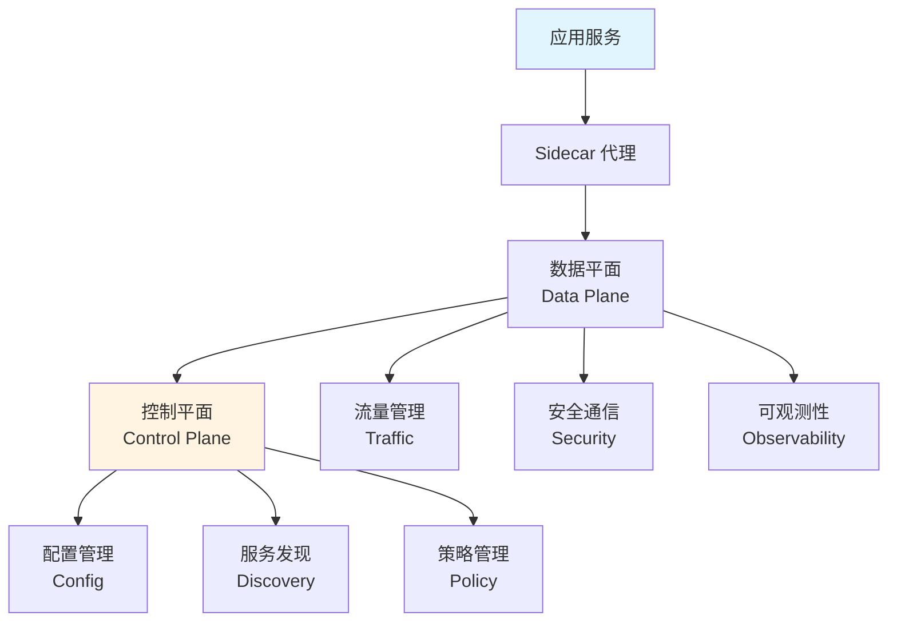
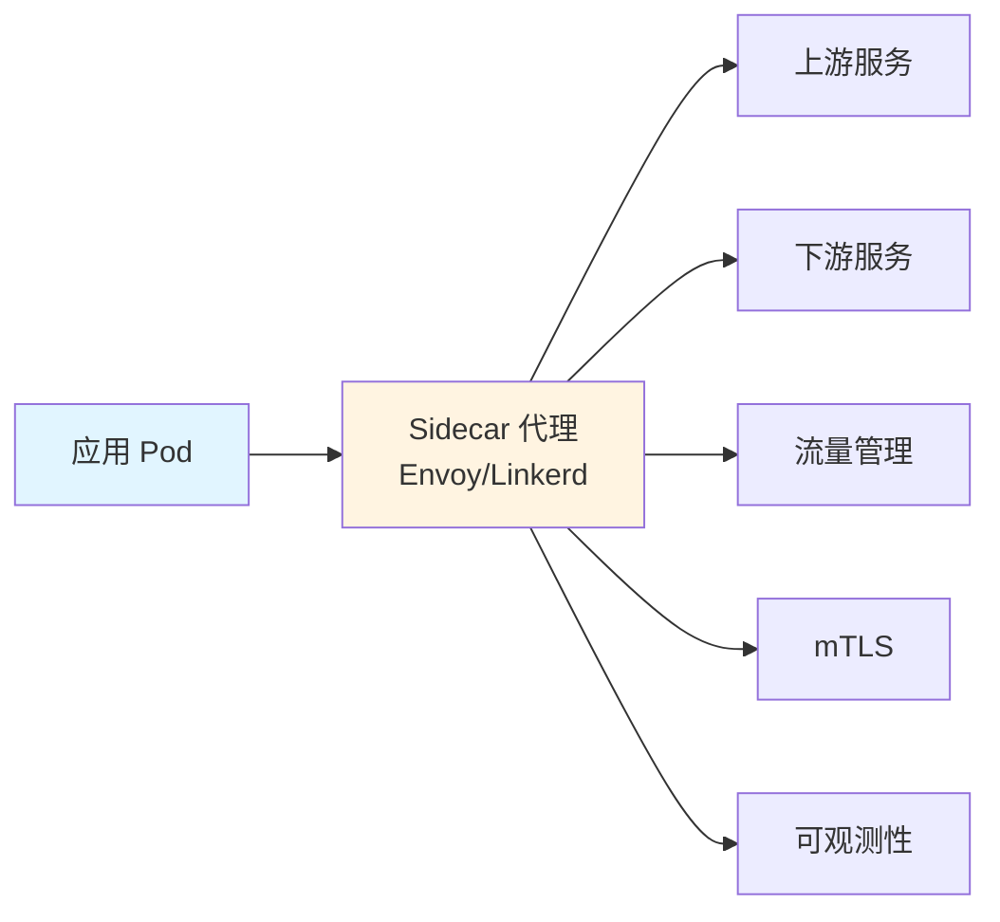
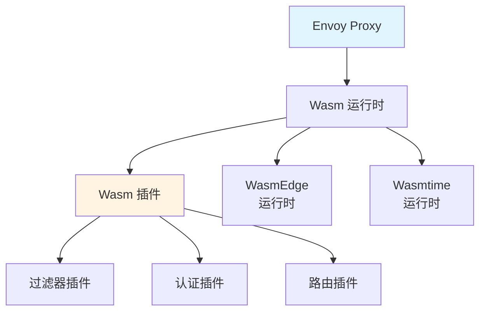

# 19. 服务网格：全面梳理

## 目录

- [目录](#目录)
- [19.1 文档定位](#191-文档定位)
- [19.2 服务网格技术栈全景](#192-服务网格技术栈全景)
  - [19.2.1 服务网格定义](#1921-服务网格定义)
  - [19.2.2 技术组件矩阵](#1922-技术组件矩阵)
  - [19.2.3 技术栈组合](#1923-技术栈组合)
- [19.3 服务网格架构](#193-服务网格架构)
  - [19.3.1 控制平面架构](#1931-控制平面架构)
  - [19.3.2 数据平面架构](#1932-数据平面架构)
  - [19.3.3 Sidecar 代理模式](#1933-sidecar-代理模式)
- [19.4 主要服务网格技术规格](#194-主要服务网格技术规格)
  - [19.4.1 Istio 技术规格](#1941-istio-技术规格)
  - [19.4.2 Linkerd 技术规格](#1942-linkerd-技术规格)
  - [19.4.3 Consul Connect 技术规格](#1943-consul-connect-技术规格)
  - [19.4.4 服务网格对比矩阵](#1944-服务网格对比矩阵)
- [19.5 Wasm 插件在服务网格中的应用](#195-wasm-插件在服务网格中的应用)
  - [19.5.1 Wasm 插件架构](#1951-wasm-插件架构)
  - [19.5.2 WasmEdge 集成](#1952-wasmedge-集成)
  - [19.5.3 Wasm 插件开发](#1953-wasm-插件开发)
- [19.6 服务间通信和安全](#196-服务间通信和安全)
  - [19.6.1 mTLS 配置](#1961-mtls-配置)
  - [19.6.2 流量管理](#1962-流量管理)
  - [19.6.3 服务发现](#1963-服务发现)
- [19.7 服务网格场景分析](#197-服务网格场景分析)
  - [19.7.1 微服务架构场景](#1971-微服务架构场景)
  - [19.7.2 多云环境场景](#1972-多云环境场景)
  - [19.7.3 边缘计算场景](#1973-边缘计算场景)
- [19.8 服务网格技术栈组合方案](#198-服务网格技术栈组合方案)
  - [19.8.1 标准微服务组合](#1981-标准微服务组合)
  - [19.8.2 轻量级组合](#1982-轻量级组合)
  - [19.8.3 Wasm 增强组合](#1983-wasm-增强组合)
- [19.9 服务网格最佳实践](#199-服务网格最佳实践)
  - [19.9.1 部署策略](#1991-部署策略)
  - [19.9.2 性能优化](#1992-性能优化)
  - [19.9.3 安全配置](#1993-安全配置)
- [19.10 参考](#1910-参考)

---

## 19.1 文档定位

本文档全面梳理云原生容器技术栈中的服务网格技术、规格和最佳实践，包括服务网格概念
、Istio/Linkerd/Consul Connect 等技术、Wasm 插件应用、服务间通信和安全等技术。

**文档结构**：

- **服务网格技术栈全景**：服务网格定义、技术组件矩阵、技术栈组合
- **服务网格架构**：控制平面、数据平面、Sidecar 代理模式
- **主要服务网格技术规格**：Istio、Linkerd、Consul Connect 技术规格和对比
- **Wasm 插件在服务网格中的应用**：Wasm 插件架构、WasmEdge 集成、Wasm 插件开发
- **服务间通信和安全**：mTLS 配置、流量管理、服务发现
- **服务网格场景分析**：微服务架构、多云环境、边缘计算场景
- **服务网格技术栈组合方案**：不同场景的服务网格技术栈组合
- **服务网格最佳实践**：部署策略、性能优化、安全配置

## 19.2 服务网格技术栈全景

### 19.2.1 服务网格定义

**服务网格定义**：

服务网格（Service Mesh）是用于管理微服务之间通信的基础设施层，提供流量管理、安全
性、可观测性和服务发现等功能。

**服务网格架构**：



**服务网格核心功能**：

| 功能         | 说明                   | 技术                                    |
| ------------ | ---------------------- | --------------------------------------- |
| **流量管理** | 路由、负载均衡、熔断   | VirtualService、DestinationRule         |
| **安全通信** | mTLS、认证、授权       | PeerAuthentication、AuthorizationPolicy |
| **可观测性** | Metrics、Tracing、日志 | Prometheus、Jaeger                      |
| **服务发现** | 服务注册和发现         | Service Registry                        |

### 19.2.2 技术组件矩阵

**服务网格技术组件矩阵**：

| 组件类别      | 技术              | 定位               | 成熟度     | 生产验证   |
| ------------- | ----------------- | ------------------ | ---------- | ---------- |
| **服务网格**  | Istio             | 功能完整的服务网格 | ⭐⭐⭐⭐⭐ | ⭐⭐⭐⭐⭐ |
|               | Linkerd           | 轻量级服务网格     | ⭐⭐⭐⭐⭐ | ⭐⭐⭐⭐⭐ |
|               | Consul Connect    | HashiCorp 服务网格 | ⭐⭐⭐⭐   | ⭐⭐⭐⭐   |
|               | Kuma              | 多集群服务网格     | ⭐⭐⭐⭐   | ⭐⭐⭐⭐   |
|               | Open Service Mesh | 微软服务网格       | ⭐⭐⭐     | ⭐⭐⭐     |
| **代理**      | Envoy             | 高性能代理         | ⭐⭐⭐⭐⭐ | ⭐⭐⭐⭐⭐ |
|               | Linkerd Proxy     | Rust 代理          | ⭐⭐⭐⭐⭐ | ⭐⭐⭐⭐⭐ |
|               | MOSN              | 阿里云代理         | ⭐⭐⭐⭐   | ⭐⭐⭐⭐   |
| **Wasm 支持** | Istio + WasmEdge  | Wasm 插件支持      | ⭐⭐⭐⭐   | ⭐⭐⭐⭐   |
|               | Envoy + WasmEdge  | Envoy Wasm 扩展    | ⭐⭐⭐⭐   | ⭐⭐⭐⭐   |

### 19.2.3 技术栈组合

**服务网格技术栈组合方案**：

| 场景           | 服务网格 | 代理             | Wasm 支持 | 特点               |
| -------------- | -------- | ---------------- | --------- | ------------------ |
| **标准微服务** | Istio    | Envoy            | 可选      | 功能完整、生态丰富 |
| **轻量级**     | Linkerd  | Linkerd Proxy    | 不支持    | 轻量级、快速       |
| **多集群**     | Kuma     | Envoy            | 可选      | 多集群管理         |
| **Wasm 增强**  | Istio    | Envoy + WasmEdge | 支持      | Wasm 插件、低延迟  |

## 19.3 服务网格架构

### 19.3.1 控制平面架构

**控制平面定义**：

控制平面负责配置和管理数据平面，包括服务发现、路由规则、安全策略等。

**Istio 控制平面组件**：

| 组件          | 功能         | 说明                         |
| ------------- | ------------ | ---------------------------- |
| **istiod**    | 统一控制平面 | 配置管理、证书管理、服务发现 |
| **Pilot**     | 流量管理     | 路由规则、负载均衡           |
| **Citadel**   | 安全认证     | mTLS、身份认证               |
| **Galley**    | 配置验证     | 配置验证和转换               |
| **Telemetry** | 遥测数据     | Metrics、Tracing             |

**Linkerd 控制平面组件**：

| 组件                    | 功能     | 说明               |
| ----------------------- | -------- | ------------------ |
| **linkerd-identity**    | 身份管理 | mTLS、证书管理     |
| **linkerd-destination** | 服务发现 | 服务发现、路由     |
| **linkerd-policy**      | 策略管理 | 流量策略、安全策略 |

### 19.3.2 数据平面架构

**数据平面定义**：

数据平面由 Sidecar 代理组成，负责处理服务间的实际流量。

**Sidecar 代理架构**：



**数据平面功能**：

1. **流量拦截**：拦截 Pod 的入站和出站流量
2. **流量路由**：根据路由规则路由流量
3. **安全通信**：提供 mTLS 加密通信
4. **可观测性**：收集 Metrics、Tracing、日志

### 19.3.3 Sidecar 代理模式

**Sidecar 代理模式定义**：

Sidecar 代理模式是在每个应用 Pod 中注入一个代理容器，由代理处理服务间通信。

**Sidecar 注入方式**：

| 方式             | 说明                  | 适用场景           | 特点             |
| ---------------- | --------------------- | ------------------ | ---------------- |
| **自动注入**     | 使用 Mutating Webhook | 大多数场景（推荐） | 自动化、无需手动 |
| **手动注入**     | 使用 istioctl/kubectl | 特定 Pod           | 精确控制         |
| **命名空间注入** | 命名空间级别注入      | 命名空间内所有 Pod | 批量注入         |

**Sidecar 注入配置示例**：

```yaml
# Istio 自动注入
apiVersion: v1
kind: Namespace
metadata:
  name: production
  labels:
    istio-injection: enabled
---
# Linkerd 自动注入
apiVersion: v1
kind: Namespace
metadata:
  name: production
  labels:
    linkerd.io/inject: enabled
```

## 19.4 主要服务网格技术规格

### 19.4.1 Istio 技术规格

**Istio 定义**：

Istio 是 Google、IBM 和 Lyft 开源的服务网格，提供流量管理、安全性、可观测性等功
能。

**Istio 技术特点**：

- **功能完整**：流量管理、安全、可观测性、策略管理
- **生态丰富**：大量插件和扩展
- **生产验证**：广泛用于生产环境
- **资源占用**：相对较重

**Istio 核心组件**：

| 组件           | 功能         | 资源占用    |
| -------------- | ------------ | ----------- |
| **istiod**     | 控制平面     | ~500MB 内存 |
| **Envoy**      | Sidecar 代理 | ~50MB/Pod   |
| **Prometheus** | Metrics 收集 | ~200MB 内存 |
| **Jaeger**     | Tracing 收集 | ~300MB 内存 |

**Istio 配置示例**：

```yaml
# VirtualService - 流量路由
apiVersion: networking.istio.io/v1beta1
kind: VirtualService
metadata:
  name: myapp
spec:
  hosts:
  - myapp
  http:
  - match:
    - headers:
        version:
          exact: v1
    route:
    - destination:
        host: myapp
        subset: v1
      weight: 100
  - route:
    - destination:
        host: myapp
        subset: v2
      weight: 100

# DestinationRule - 负载均衡
apiVersion: networking.istio.io/v1beta1
kind: DestinationRule
metadata:
  name: myapp
spec:
  host: myapp
  subsets:
  - name: v1
    labels:
      version: v1
  - name: v2
    labels:
      version: v2
  trafficPolicy:
    loadBalancer:
      simple: LEAST_CONN
```

**Istio 场景分析**：

**场景 1：微服务流量管理**:

- **需求**：复杂的流量路由和灰度发布
- **方案**：使用 Istio VirtualService 和 DestinationRule
- **优点**：功能强大、灵活
- **缺点**：配置复杂、资源占用较高

**场景 2：安全通信**:

- **需求**：服务间 mTLS 通信
- **方案**：配置 Istio PeerAuthentication
- **优点**：安全、透明
- **缺点**：性能开销

**场景 3：可观测性**:

- **需求**：完整的 Metrics、Tracing、日志
- **方案**：集成 Prometheus、Jaeger、Grafana
- **优点**：可观测性强
- **缺点**：组件多、维护复杂

### 19.4.2 Linkerd 技术规格

**Linkerd 定义**：

Linkerd 是 Buoyant 开源的轻量级服务网格，专注于简单和性能。

**Linkerd 技术特点**：

- **轻量级**：资源占用小
- **简单易用**：配置简单
- **高性能**：Rust 编写的代理
- **功能基础**：基础流量管理和安全

**Linkerd 核心组件**：

| 组件                    | 功能         | 资源占用    |
| ----------------------- | ------------ | ----------- |
| **linkerd-identity**    | 身份管理     | ~50MB 内存  |
| **linkerd-destination** | 服务发现     | ~100MB 内存 |
| **linkerd-proxy**       | Sidecar 代理 | ~10MB/Pod   |

**Linkerd 配置示例**：

```yaml
# ServiceProfile - 流量路由
apiVersion: linkerd.io/v1alpha2
kind: ServiceProfile
metadata:
  name: myapp
  namespace: production
spec:
  routes:
    - name: GET /
      condition:
        method: GET
        pathRegex: /
      timeout: 10s
      isRetryable: true
      retryBudget:
        retryRatio: 0.2
        minRetriesPerSecond: 10
        ttl: 10s
```

**Linkerd 场景分析**：

**场景 1：轻量级微服务**:

- **需求**：简单的服务间通信和安全
- **方案**：使用 Linkerd
- **优点**：轻量、快速、简单
- **缺点**：功能相对基础

**场景 2：资源受限环境**:

- **需求**：边缘或资源受限环境
- **方案**：使用 Linkerd
- **优点**：资源占用小
- **缺点**：功能可能不足

### 19.4.3 Consul Connect 技术规格

**Consul Connect 定义**：

Consul Connect 是 HashiCorp Consul 的服务网格功能，集成服务发现和网络。

**Consul Connect 技术特点**：

- **服务发现集成**：与服务发现深度集成
- **多平台支持**：支持 Kubernetes、Nomad、VM
- **功能完整**：流量管理、安全、可观测性

**Consul Connect 核心组件**：

| 组件              | 功能               | 资源占用    |
| ----------------- | ------------------ | ----------- |
| **Consul Server** | 服务发现和控制平面 | ~200MB 内存 |
| **Consul Agent**  | 本地代理           | ~50MB 内存  |
| **Envoy**         | Sidecar 代理       | ~50MB/Pod   |

### 19.4.4 服务网格对比矩阵

**服务网格对比矩阵**：

| 服务网格           | 定位           | 功能完整度 | 易用性     | 性能       | 资源占用   | 成熟度     | 推荐场景       |
| ------------------ | -------------- | ---------- | ---------- | ---------- | ---------- | ---------- | -------------- |
| **Istio**          | 功能完整的网格 | ⭐⭐⭐⭐⭐ | ⭐⭐⭐     | ⭐⭐⭐⭐   | ⭐⭐⭐     | ⭐⭐⭐⭐⭐ | 复杂微服务架构 |
| **Linkerd**        | 轻量级网格     | ⭐⭐⭐⭐   | ⭐⭐⭐⭐⭐ | ⭐⭐⭐⭐⭐ | ⭐⭐⭐⭐⭐ | ⭐⭐⭐⭐⭐ | 轻量级微服务   |
| **Consul Connect** | 服务发现集成   | ⭐⭐⭐⭐   | ⭐⭐⭐⭐   | ⭐⭐⭐⭐   | ⭐⭐⭐     | ⭐⭐⭐⭐   | HashiCorp 生态 |
| **Kuma**           | 多集群网格     | ⭐⭐⭐⭐   | ⭐⭐⭐⭐   | ⭐⭐⭐⭐   | ⭐⭐⭐     | ⭐⭐⭐⭐   | 多集群环境     |
| **OSM**            | 微软服务网格   | ⭐⭐⭐     | ⭐⭐⭐     | ⭐⭐⭐     | ⭐⭐⭐     | ⭐⭐⭐     | Azure 环境     |

**服务网格选择决策树**：

```yaml
服务网格选择:
  if 需要完整功能和丰富生态:
    选择: Istio
  elif 需要轻量级和简单:
    选择: Linkerd
  elif 需要多集群管理:
    选择: Kuma
  elif 使用 HashiCorp 生态:
    选择: Consul Connect
  else:
    选择: Istio（默认推荐）
```

## 19.5 Wasm 插件在服务网格中的应用

### 19.5.1 Wasm 插件架构

**Wasm 插件定义**：

Wasm 插件允许在服务网格代理中动态加载和执行 WebAssembly 模块，实现自定义逻辑。

**Wasm 插件架构**：



**Wasm 插件优势**：

- **低延迟**：Wasm 插件执行延迟低（微秒级）
- **热加载**：无需重启代理即可加载插件
- **安全性**：Wasm 沙箱隔离
- **跨平台**：一次编写，多处运行

### 19.5.2 WasmEdge 集成

**WasmEdge 与 Istio 集成**：

Istio 1.12+ 支持 WasmEdge 作为 Wasm 运行时，替代默认的 V8。

**WasmEdge 集成配置**：

```yaml
# EnvoyFilter - Wasm 插件配置
apiVersion: networking.istio.io/v1alpha3
kind: EnvoyFilter
metadata:
  name: wasm-plugin
spec:
  configPatches:
    - applyTo: HTTP_FILTER
      match:
        context: SIDECAR_INBOUND
      patch:
        operation: INSERT_BEFORE
        value:
          name: envoy.filters.http.wasm
          typed_config:
            "@type": type.googleapis.com/udpa.type.v1.TypedStruct
            type_url: type.googleapis.com/envoy.extensions.filters.http.wasm.v3.Wasm
            value:
              config:
                vm_config:
                  runtime: wasmedge
                  code:
                    remote:
                      http_uri:
                        uri: http://example.com/my-plugin.wasm
                        cluster: http_cluster
                root_id: my_plugin_id
```

### 19.5.3 Wasm 插件开发

**Wasm 插件开发步骤**：

1. **选择开发语言**：Rust、C++、AssemblyScript、Go
2. **实现插件逻辑**：实现过滤器接口
3. **编译为 Wasm**：使用 Wasm 工具链编译
4. **部署插件**：通过 EnvoyFilter 部署

**Wasm 插件示例（Rust）**：

```rust
use proxy_wasm::traits::*;
use proxy_wasm::types::*;

#[no_mangle]
pub fn _start() {
    proxy_wasm::set_log_level(LogLevel::Info);
    proxy_wasm::set_http_context(|_, _| -> Box<dyn HttpContext> {
        Box::new(HttpFilter {})
    });
}

struct HttpFilter {}

impl Context for HttpFilter {}

impl HttpContext for HttpFilter {
    fn on_http_request_headers(&mut self, _num_headers: usize) -> Action {
        self.add_http_request_header("x-custom-header", "wasm-plugin");
        Action::Continue
    }
}
```

## 19.6 服务间通信和安全

### 19.6.1 mTLS 配置

**mTLS 定义**：

mTLS（Mutual TLS）是双向 TLS 认证，确保服务间通信的安全。

**Istio mTLS 配置**：

```yaml
# PeerAuthentication - mTLS 策略
apiVersion: security.istio.io/v1beta1
kind: PeerAuthentication
metadata:
  name: default
  namespace: production
spec:
  mtls:
    mode: STRICT

# AuthorizationPolicy - 授权策略
apiVersion: security.istio.io/v1beta1
kind: AuthorizationPolicy
metadata:
  name: allow-myapp
  namespace: production
spec:
  selector:
    matchLabels:
      app: myapp
  action: ALLOW
  rules:
  - from:
    - source:
        principals: ["cluster.local/ns/production/sa/myapp"]
```

**mTLS 模式**：

| 模式           | 说明            | 适用场景         |
| -------------- | --------------- | ---------------- |
| **STRICT**     | 强制 mTLS       | 生产环境（推荐） |
| **PERMISSIVE** | 允许明文和 mTLS | 迁移过渡期       |
| **DISABLE**    | 禁用 mTLS       | 测试环境         |

### 19.6.2 流量管理

**流量管理功能**：

1. **路由规则**：根据条件路由流量
2. **负载均衡**：多种负载均衡策略
3. **熔断**：防止服务过载
4. **重试**：自动重试失败请求
5. **超时**：请求超时控制

**Istio 流量管理配置**：

```yaml
# VirtualService - 灰度发布
apiVersion: networking.istio.io/v1beta1
kind: VirtualService
metadata:
  name: myapp
spec:
  hosts:
  - myapp
  http:
  - match:
    - headers:
        canary:
          exact: "true"
    route:
    - destination:
        host: myapp
        subset: v2
      weight: 100
  - route:
    - destination:
        host: myapp
        subset: v1
      weight: 90
    - destination:
        host: myapp
        subset: v2
      weight: 10

# DestinationRule - 熔断和重试
apiVersion: networking.istio.io/v1beta1
kind: DestinationRule
metadata:
  name: myapp
spec:
  host: myapp
  trafficPolicy:
    connectionPool:
      tcp:
        maxConnections: 100
      http:
        http1MaxPendingRequests: 10
        http2MaxRequests: 10
        maxRequestsPerConnection: 2
    outlierDetection:
      consecutiveErrors: 3
      interval: 30s
      baseEjectionTime: 30s
      maxEjectionPercent: 50
```

### 19.6.3 服务发现

**服务发现定义**：

服务网格提供自动服务发现，无需手动配置服务地址。

**服务发现机制**：

1. **Kubernetes Service**：基于 Kubernetes Service 发现
2. **服务注册**：自动注册服务
3. **健康检查**：自动健康检查
4. **负载均衡**：自动负载均衡

## 19.7 服务网格场景分析

### 19.7.1 微服务架构场景

**场景描述**：微服务架构需要复杂的流量管理和服务间通信

**挑战分析**：

1. **服务间通信**：需要统一的服务间通信机制
2. **流量管理**：需要复杂的路由和灰度发布
3. **安全通信**：需要服务间安全通信
4. **可观测性**：需要完整的可观测性

**解决方案**：

```yaml
微服务服务网格方案:
  服务网格: Istio
  代理: Envoy
  功能:
    - 流量路由和灰度发布
    - mTLS 安全通信
    - Metrics、Tracing、日志
    - 服务发现和负载均衡
```

**决策依据**：

- ✅ 微服务数量 > 10
- ✅ 需要流量管理
- ✅ 需要服务间安全通信

### 19.7.2 多云环境场景

**场景描述**：应用部署在多个云平台，需要跨云服务间通信

**挑战分析**：

1. **跨云网络**：不同云平台间网络通信
2. **服务发现**：跨云服务发现
3. **流量管理**：跨云流量路由
4. **安全通信**：跨云安全通信

**解决方案**：

```yaml
多云服务网格方案:
  服务网格: Istio / Kuma
  代理: Envoy
  网络:
    - VPN 或专线连接
    - 跨云服务发现
  安全:
    - 跨云 mTLS
    - 统一身份认证
```

### 19.7.3 边缘计算场景

**场景描述**：边缘环境需要轻量级服务网格

**挑战分析**：

1. **资源受限**：边缘节点资源有限
2. **网络不稳定**：网络连接可能不稳定
3. **离线能力**：需要离线运行能力
4. **延迟要求**：低延迟要求

**解决方案**：

```yaml
边缘服务网格方案:
  服务网格: Linkerd / K3s 集成
  代理: Linkerd Proxy
  特点:
    - 轻量级、资源占用小
    - 支持离线运行
    - 低延迟
```

**决策依据**：

- ✅ 资源受限环境
- ✅ 需要轻量级方案
- ✅ 延迟敏感应用

## 19.8 服务网格技术栈组合方案

### 19.8.1 标准微服务组合

**标准微服务服务网格组合**：

| 组件         | 技术                | 说明               |
| ------------ | ------------------- | ------------------ |
| **服务网格** | Istio               | 功能完整的服务网格 |
| **代理**     | Envoy               | 高性能代理         |
| **可观测性** | Prometheus + Jaeger | Metrics 和 Tracing |
| **可视化**   | Grafana + Kiali     | 监控和流量可视化   |

**特点**：

- ✅ 功能完整、生态丰富
- ✅ 适合复杂微服务架构
- ⚠️ 资源占用较高

### 19.8.2 轻量级组合

**轻量级服务网格组合**：

| 组件         | 技术          | 说明           |
| ------------ | ------------- | -------------- |
| **服务网格** | Linkerd       | 轻量级服务网格 |
| **代理**     | Linkerd Proxy | Rust 代理      |
| **可观测性** | Linkerd Viz   | 内置可视化     |

**特点**：

- ✅ 轻量级、资源占用小
- ✅ 简单易用
- ⚠️ 功能相对基础

### 19.8.3 Wasm 增强组合

**Wasm 增强服务网格组合**：

| 组件            | 技术             | 说明               |
| --------------- | ---------------- | ------------------ |
| **服务网格**    | Istio            | 功能完整的服务网格 |
| **代理**        | Envoy            | 高性能代理         |
| **Wasm 运行时** | WasmEdge         | Wasm 插件运行时    |
| **Wasm 插件**   | 自定义 Wasm 插件 | 低延迟插件         |

**特点**：

- ✅ Wasm 插件支持、低延迟
- ✅ 热加载、动态更新
- ✅ 安全沙箱隔离

## 19.9 服务网格最佳实践

### 19.9.1 部署策略

**服务网格部署策略**：

1. **渐进式部署**：先在非关键服务部署，逐步扩展到所有服务
2. **命名空间隔离**：按命名空间分组部署
3. **灰度部署**：先部署到测试环境，再部署到生产环境
4. **监控验证**：部署后验证功能和性能

**部署检查清单**：

- ✅ 控制平面部署成功
- ✅ Sidecar 注入正常
- ✅ mTLS 配置正确
- ✅ 流量路由正常
- ✅ Metrics 和 Tracing 正常

### 19.9.2 性能优化

**性能优化策略**：

1. **代理资源限制**：合理设置 Sidecar 资源限制
2. **连接池优化**：优化连接池配置
3. **缓存策略**：启用配置和证书缓存
4. **资源监控**：监控代理资源使用情况

**性能优化配置**：

```yaml
# Sidecar 资源限制
apiVersion: v1
kind: LimitRange
metadata:
  name: sidecar-limits
spec:
  limits:
    - default:
        cpu: "200m"
        memory: "256Mi"
      type: Container
```

### 19.9.3 安全配置

**安全配置最佳实践**：

1. **强制 mTLS**：生产环境使用 STRICT 模式
2. **授权策略**：配置细粒度授权策略
3. **证书管理**：定期轮换证书
4. **网络安全**：结合 NetworkPolicy 使用

## 19.10 参考

- [Istio 官方文档](https://istio.io/docs/)
- [Linkerd 官方文档](https://linkerd.io/docs/)
- [Consul Connect 官方文档](https://www.consul.io/docs/connect)
- [Envoy 官方文档](https://www.envoyproxy.io/docs/)
- [WasmEdge 与 Istio 集成](https://wasmedge.org/docs/develop/mesh/istio/)

---

> **使用指南**：
>
> - **快速开始**：查看 [19.2 服务网格技术栈全景](#192-服务网格技术栈全景)
> - **技术选型**：查看 [19.4.4 服务网格对比矩阵](#1944-服务网格对比矩阵)
> - **Wasm 集成**：查看
>   [19.5 Wasm 插件在服务网格中的应用](#195-wasm-插件在服务网格中的应用)
> - **最佳实践**：查看 [19.9 服务网格最佳实践](#199-服务网格最佳实践)
