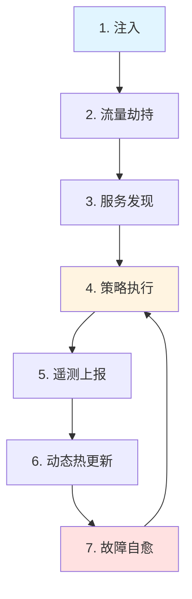

# 19. 服务网格：全面梳理

## 📑 目录

- [📑 目录](#-目录)
- [19.1 文档定位](#191-文档定位)
- [19.2 服务网格技术栈全景](#192-服务网格技术栈全景)
  - [19.2.1 服务网格定义](#1921-服务网格定义)
  - [19.2.2 技术组件矩阵](#1922-技术组件矩阵)
  - [19.2.3 技术栈组合](#1923-技术栈组合)
- [19.3 服务网格架构](#193-服务网格架构)
  - [19.3.1 控制平面架构（2025 年视角）](#1931-控制平面架构2025-年视角)
  - [19.3.2 数据平面架构](#1932-数据平面架构)
  - [19.3.3 Sidecar 代理模式](#1933-sidecar-代理模式)
  - [19.3.4 运行机制：七步闭环](#1934-运行机制七步闭环)
- [19.4 主要服务网格技术规格](#194-主要服务网格技术规格)
  - [19.4.1 Istio 技术规格](#1941-istio-技术规格)
  - [19.4.2 Linkerd 技术规格](#1942-linkerd-技术规格)
  - [19.4.3 Consul Connect 技术规格](#1943-consul-connect-技术规格)
  - [19.4.4 能力矩阵：一张表看懂"网格能做什么"](#1944-能力矩阵一张表看懂网格能做什么)
  - [19.4.5 价值论证：为什么"非侵入"是质变（2025 年视角）](#1945-价值论证为什么非侵入是质变2025-年视角)
  - [19.4.6 技术演进时间线（2016→2025）](#1946-技术演进时间线20162025)
  - [19.4.7 主流实现与选型速查（2025.Q4）](#1947-主流实现与选型速查2025q4)
  - [19.4.8 服务网格对比矩阵（传统对比表）](#1948-服务网格对比矩阵传统对比表)
- [19.5 Wasm 插件在服务网格中的应用](#195-wasm-插件在服务网格中的应用)
  - [19.5.1 Wasm 插件架构](#1951-wasm-插件架构)
  - [19.5.2 WasmEdge 集成](#1952-wasmedge-集成)
  - [19.5.3 Wasm 插件开发](#1953-wasm-插件开发)
- [19.6 服务间通信和安全](#196-服务间通信和安全)
  - [19.6.1 mTLS 配置](#1961-mtls-配置)
  - [19.6.2 流量管理](#1962-流量管理)
  - [19.6.3 服务发现](#1963-服务发现)
- [19.7 服务网格场景分析](#197-服务网格场景分析)
  - [19.7.1 微服务架构场景](#1971-微服务架构场景)
  - [19.7.2 多云环境场景](#1972-多云环境场景)
  - [19.7.3 边缘计算场景](#1973-边缘计算场景)
- [19.8 服务网格技术栈组合方案](#198-服务网格技术栈组合方案)
  - [19.8.1 标准微服务组合](#1981-标准微服务组合)
  - [19.8.2 轻量级组合](#1982-轻量级组合)
  - [19.8.3 Wasm 增强组合](#1983-wasm-增强组合)
- [19.9 服务网格最佳实践](#199-服务网格最佳实践)
  - [19.9.1 部署策略](#1991-部署策略)
  - [19.9.2 性能优化](#1992-性能优化)
  - [19.9.3 安全配置](#1993-安全配置)
  - [19.9.4 OTLP 与 Service Mesh 互补实践（2025 年视角）](#1994-otlp-与-service-mesh-互补实践2025-年视角)
    - [19.9.4.1 OTLP 数据模型 = 语义 + 时间](#19941-otlp-数据模型--语义--时间)
    - [19.9.4.2 网络调用 ≠ 数据流/执行流](#19942-网络调用--数据流执行流)
    - [19.9.4.3 代码示例：同一笔订单的两种视角](#19943-代码示例同一笔订单的两种视角)
    - [19.9.4.4 2025 实践 checklist：让网格与 OTLP 互补而不是互斥](#19944-2025-实践-checklist让网格与-otlp-互补而不是互斥)
    - [19.9.4.5 小结：三句话背下来](#19945-小结三句话背下来)
- [19.10 小结：三句话记住 Service Mesh（2025 年视角）](#1910-小结三句话记住-service-mesh2025-年视角)
  - [19.10.1 核心要点](#19101-核心要点)
  - [19.10.2 核心理念](#19102-核心理念)
  - [19.10.3 2025 年选型建议](#19103-2025-年选型建议)
- [19.11 实际部署案例](#1911-实际部署案例)
  - [19.11.1 案例 1：Istio 基础部署](#19111-案例-1istio-基础部署)
  - [19.11.2 案例 2：Linkerd 轻量级部署](#19112-案例-2linkerd-轻量级部署)
  - [19.11.3 案例 3：Istio 金丝雀部署](#19113-案例-3istio-金丝雀部署)
- [19.12 服务网格检查清单](#1912-服务网格检查清单)
- [19.13 服务网格故障排查](#1913-服务网格故障排查)
  - [19.13.1 常见问题](#19131-常见问题)
- [19.14 参考](#1914-参考)
  - [19.14.1 2025 年最新更新（2025-11-06）](#19141-2025-年最新更新2025-11-06)
  - [19.14.2 隔离栈相关文档](#19142-隔离栈相关文档)
  - [19.14.3 服务网格相关文档](#19143-服务网格相关文档)
  - [19.14.4 外部参考](#19144-外部参考)

---

## 19.1 文档定位

本文档全面梳理云原生容器技术栈中的服务网格技术、规格和最佳实践，包括服务网格概念
、Istio/Linkerd/Consul Connect 等技术、Wasm 插件应用、服务间通信和安全等技术。

**2025 年视角**：

本文档基于 **2025-11-06 最新技术趋势**，提供服务网格的**定义 → 架构 → 功能 → 价
值 → 演进 → 选型**六段式全面论证，可直接落地使用。

**文档结构**：

- **服务网格技术栈全景**：服务网格定义、技术组件矩阵、技术栈组合
- **服务网格架构（2025）**：数据平面 + 控制平面、Sidecar vs Ambient 模式
- **核心功能与价值论证**：四大维度 16 子项、非侵入式价值分析
- **技术演进时间线（2016→2025）**：从 Linkerd 1.0 到 Cilium Mesh GA
- **主流实现与选型速查（2025.Q4）**：Istio、Linkerd、Cilium、NGINX SM 对比
- **主要服务网格技术规格**：Istio、Linkerd、Consul Connect 技术规格和对比
- **Wasm 插件在服务网格中的应用**：Wasm 插件架构、WasmEdge 集成、Wasm 插件开发
- **服务间通信和安全**：mTLS 配置、流量管理、服务发现
- **服务网格场景分析**：微服务架构、多云环境、边缘计算场景
- **服务网格技术栈组合方案**：不同场景的服务网格技术栈组合
- **服务网格最佳实践**：部署策略、性能优化、安全配置

## 19.2 服务网格技术栈全景

### 19.2.1 服务网格定义

**服务网格定义（2025 年视角）**：

**服务网格（Service Mesh）** = 把"微服务间通信"从业务代码里**整体抽出来**，做成
一层**透明、可插拔、可统一治理**的基础设施；让应用只关心**业务逻辑**，让网格全权
负责**可靠、安全、可观测**的**网络通信**。

**经典定义**：

2016 年最早提出者 William Morgan 的经典定义：

> **Service Mesh 是用于处理服务间通信的基础设施层，通常由轻量级代理阵列组成，这
> 些代理与应用程序代码一起部署，但对应用透明。**

**一句话理解**：

**服务网格**是**专门处理服务间通信**的基础设施层，它通过**与业务进程伴生的轻量级
网络代理阵列**，保证请求在复杂拓扑中**可靠穿梭**，且**对应用完全透明**。

**服务网格架构**：


**服务网格核心功能（2025 年四大维度）**：

| 维度           | 功能示例                                                                       | 业务代码是否感知 |
| -------------- | ------------------------------------------------------------------------------ | ---------------- |
| **流量治理**   | 负载均衡、灰度/金丝雀、A/B、蓝绿、故障注入、重试、超时、限速                   | ❌ 全透明        |
| **零信任安全** | mTLS（自动轮转证书）、身份（SPIFFE ID）、授权策略（RBAC/JWT）、Egress 管控     | ❌ 全透明        |
| **可观测性**   | 分布式追踪（OpenTelemetry）、指标（Prometheus）、访问日志（ALS）、拓扑自动发现 | ❌ 全透明        |
| **弹性&韧性**  | 熔断、隔仓、异常点驱逐、重试预算、慢启动                                       | ❌ 全透明        |

> **结果**：开发者**只写业务**；运维者**只改 YAML** 即可实现上述全部能力。

### 19.2.2 技术组件矩阵

**服务网格技术组件矩阵**：

| 组件类别      | 技术              | 定位               | 成熟度     | 生产验证   |
| ------------- | ----------------- | ------------------ | ---------- | ---------- |
| **服务网格**  | Istio             | 功能完整的服务网格 | ⭐⭐⭐⭐⭐ | ⭐⭐⭐⭐⭐ |
|               | Linkerd           | 轻量级服务网格     | ⭐⭐⭐⭐⭐ | ⭐⭐⭐⭐⭐ |
|               | Consul Connect    | HashiCorp 服务网格 | ⭐⭐⭐⭐   | ⭐⭐⭐⭐   |
|               | Kuma              | 多集群服务网格     | ⭐⭐⭐⭐   | ⭐⭐⭐⭐   |
|               | Open Service Mesh | 微软服务网格       | ⭐⭐⭐     | ⭐⭐⭐     |
| **代理**      | Envoy             | 高性能代理         | ⭐⭐⭐⭐⭐ | ⭐⭐⭐⭐⭐ |
|               | Linkerd Proxy     | Rust 代理          | ⭐⭐⭐⭐⭐ | ⭐⭐⭐⭐⭐ |
|               | MOSN              | 阿里云代理         | ⭐⭐⭐⭐   | ⭐⭐⭐⭐   |
| **Wasm 支持** | Istio + WasmEdge  | Wasm 插件支持      | ⭐⭐⭐⭐   | ⭐⭐⭐⭐   |
|               | Envoy + WasmEdge  | Envoy Wasm 扩展    | ⭐⭐⭐⭐   | ⭐⭐⭐⭐   |

### 19.2.3 技术栈组合

**服务网格技术栈组合方案**：

| 场景           | 服务网格 | 代理             | Wasm 支持 | 特点               |
| -------------- | -------- | ---------------- | --------- | ------------------ |
| **标准微服务** | Istio    | Envoy            | 可选      | 功能完整、生态丰富 |
| **轻量级**     | Linkerd  | Linkerd Proxy    | 不支持    | 轻量级、快速       |
| **多集群**     | Kuma     | Envoy            | 可选      | 多集群管理         |
| **Wasm 增强**  | Istio    | Envoy + WasmEdge | 支持      | Wasm 插件、低延迟  |

## 19.3 服务网格架构

### 19.3.1 控制平面架构（2025 年视角）

**控制平面定义**：

控制平面负责配置和管理数据平面，包括服务发现、路由规则、安全策略等。

**2025 年架构矩阵**：

| 平面         | 组成                                                       | 职责                                       | 2025 年主流实现                           |
| ------------ | ---------------------------------------------------------- | ------------------------------------------ | ----------------------------------------- |
| **数据平面** | Sidecar 代理（Envoy、Linkerd-proxy）                       | 实战流量：LB、mTLS、熔断、限流、追踪、日志 | Envoy 1.30+、Linkerd2-proxy、Cilium Envoy |
| **控制平面** | Istiod、Linkerd-destination、NGINX Service Mesh Controller | 统一下发策略、证书、路由规则；收集遥测     | Istio 1.24、Linkerd 2.17、NGINX-SM 2.0    |

> **2025 年新增趋势**：**"无 Sidecar" Ambient Mesh**（Istio CNI 模式）把代理拆
> 成**共享 ztunnel + 可选 waypoint**，内存降 70% 仍保持透明。

**Istio 控制平面组件**：

| 组件          | 功能         | 说明                         |
| ------------- | ------------ | ---------------------------- |
| **istiod**    | 统一控制平面 | 配置管理、证书管理、服务发现 |
| **Pilot**     | 流量管理     | 路由规则、负载均衡           |
| **Citadel**   | 安全认证     | mTLS、身份认证               |
| **Galley**    | 配置验证     | 配置验证和转换               |
| **Telemetry** | 遥测数据     | Metrics、Tracing             |

**Linkerd 控制平面组件**：

| 组件                    | 功能     | 说明               |
| ----------------------- | -------- | ------------------ |
| **linkerd-identity**    | 身份管理 | mTLS、证书管理     |
| **linkerd-destination** | 服务发现 | 服务发现、路由     |
| **linkerd-policy**      | 策略管理 | 流量策略、安全策略 |

### 19.3.2 数据平面架构

**数据平面定义**：

数据平面由 Sidecar 代理组成，负责处理服务间的实际流量。

**Sidecar 代理架构**：


**数据平面功能**：

1. **流量拦截**：拦截 Pod 的入站和出站流量
2. **流量路由**：根据路由规则路由流量
3. **安全通信**：提供 mTLS 加密通信
4. **可观测性**：收集 Metrics、Tracing、日志

### 19.3.3 Sidecar 代理模式

> **💡 隔离层次关联**：服务网格 Sidecar 代理模式在 L-3 容器化层部署代理容器，实
> 现服务间通信的拦截和处理。Wasm 插件可以运行在 L-4 沙盒化层。详细的技术解析请参
> 考：
>
> - **[29. 隔离栈](../29-isolation-stack/isolation-stack.md)** - 完整的隔离栈技
>   术解析
> - **[L-3 容器化层](../29-isolation-stack/layers/L-3-containerization.md)** -
>   容器化层详细文档
> - **[L-4 沙盒化层](../29-isolation-stack/layers/L-4-sandboxing.md)** - WASM 运
>   行时详细文档（Wasm 插件）
> - **[隔离层次对比文档](../29-isolation-stack/layers/isolation-comparison.md)** -
>   运行时性能对比和技术选型

**Sidecar 代理模式定义**：

Sidecar 代理模式是在每个应用 Pod 中注入一个代理容器，由代理处理服务间通信。

**Sidecar 注入方式**：

| 方式             | 说明                  | 适用场景           | 特点             |
| ---------------- | --------------------- | ------------------ | ---------------- |
| **自动注入**     | 使用 Mutating Webhook | 大多数场景（推荐） | 自动化、无需手动 |
| **手动注入**     | 使用 istioctl/kubectl | 特定 Pod           | 精确控制         |
| **命名空间注入** | 命名空间级别注入      | 命名空间内所有 Pod | 批量注入         |

**Sidecar 注入配置示例**：

```yaml
# Istio 自动注入
apiVersion: v1
kind: Namespace
metadata:
  name: production
  labels:
    istio-injection: enabled
---
# Linkerd 自动注入
apiVersion: v1
kind: Namespace
metadata:
  name: production
  labels:
    linkerd.io/inject: enabled
```

### 19.3.4 运行机制：七步闭环

**运行机制定义**：

服务网格通过**七步闭环**实现服务间通信的透明治理，从流量注入到故障自愈的全流程自
动化。

**七步闭环流程**：

1. **注入**

   通过 Admission Webhook 或 DaemonSet，在 Pod 启动时自动注入 Sidecar 或启动节点
   级代理。

   **注入方式**：

   | 方式             | 说明                  | 适用场景           | 特点             |
   | ---------------- | --------------------- | ------------------ | ---------------- |
   | **自动注入**     | 使用 Mutating Webhook | 大多数场景（推荐） | 自动化、无需手动 |
   | **手动注入**     | 使用 istioctl/kubectl | 特定 Pod           | 精确控制         |
   | **命名空间注入** | 命名空间级别注入      | 命名空间内所有 Pod | 批量注入         |

2. **流量劫持**

   使用 iptables/eBPF 把**所有进出容器的 TCP/UDP 流量**重定向到代理。

   **流量劫持技术**：

   | 技术         | 说明                    | 特点           | 适用场景             |
   | ------------ | ----------------------- | -------------- | -------------------- |
   | **iptables** | 传统的 Linux 防火墙规则 | 成熟稳定       | 大多数场景           |
   | **eBPF**     | 内核级可编程网络拦截    | 高性能、低延迟 | 高吞吐场景（Cilium） |

   **流量劫持流程**：

   ```mermaid
   graph LR
       A[应用容器] --> B[iptables/eBPF]
       B --> C[Sidecar 代理]
       C --> D[上游服务]
       C --> E[下游服务]

       style A fill:#e1f5ff
       style C fill:#fff4e1
   ```

3. **服务发现**

   代理定期从控制平面获取**服务目录**（EndpointSlice、Consul Catalog、Eureka 等
   ）。

   **服务发现机制**：

   - **Kubernetes 原生**：EndpointSlice、Service
   - **服务网格增强**：Istio ServiceEntry、Linkerd ServiceProfile
   - **外部服务**：Consul Catalog、Eureka、Nacos

4. **策略执行**

   根据 CRD/ConfigMap 下发的规则，代理完成：

   - **负载均衡**（WRR、Least Request、Consistent Hash）
   - **路由**（URI、Header、权重、金丝雀）
   - **安全**（mTLS、RBAC、JWT、认证授权）
   - **韧性**（重试、超时、熔断、限速）

   **策略执行示例**：

   ```yaml
   # Istio VirtualService - 流量路由
   apiVersion: networking.istio.io/v1beta1
   kind: VirtualService
   metadata:
     name: myapp
   spec:
     hosts:
       - myapp
     http:
       - match:
           - headers:
               version:
                 exact: v1
         route:
           - destination:
               host: myapp
               subset: v1
             weight: 100
       - route:
           - destination:
               host: myapp
               subset: v2
             weight: 100
   ```

5. **遥测上报**

   代理将 Trace/Metric/AccessLog 通过 OTLP/Prometheus 格式上报，**无需应用改代
   码**。

   **遥测数据**：

   | 数据类型       | 格式                | 用途               | 工具示例            |
   | -------------- | ------------------- | ------------------ | ------------------- |
   | **分布式追踪** | OpenTelemetry Trace | 请求链路分析       | Jaeger、Zipkin      |
   | **指标**       | Prometheus Metrics  | 性能监控、SLA 监控 | Prometheus、Grafana |
   | **访问日志**   | Envoy Access Log    | 请求日志、审计日志 | ELK Stack           |

6. **动态热更新**

   控制平面改一条 YAML，**秒级**下发到所有代理，**无需滚动业务 Pod**。

   **热更新机制**：

   - **配置推送**：控制平面通过 XDS API 推送配置
   - **零停机**：代理无需重启即可应用新配置
   - **版本管理**：支持配置版本回滚

7. **故障自愈**

   检测到后端异常，自动触发**熔断、驱逐、重连**，业务代码无感知。

   **故障自愈策略**：

   | 故障类型       | 自愈策略         | 实现方式              |
   | -------------- | ---------------- | --------------------- |
   | **服务不可用** | 熔断、异常点驱逐 | Circuit Breaker       |
   | **慢响应**     | 超时、重试预算   | Timeout、Retry Budget |
   | **高负载**     | 限流、隔仓       | Rate Limit、Bulkhead  |
   | **网络抖动**   | 重试、健康检查   | Retry、Health Check   |

**运行机制流程图**：



> **结果**：业务容器**零侵入**即可获得：发现、负载、安全、观测、韧性，所有网络通
> 信治理**完全透明**。

## 19.4 主要服务网格技术规格

### 19.4.1 Istio 技术规格

**Istio 定义**：

Istio 是 Google、IBM 和 Lyft 开源的服务网格，提供流量管理、安全性、可观测性等功
能。

**Istio 技术特点**：

- **功能完整**：流量管理、安全、可观测性、策略管理
- **生态丰富**：大量插件和扩展
- **生产验证**：广泛用于生产环境
- **资源占用**：相对较重

**Istio 核心组件**：

| 组件           | 功能         | 资源占用    |
| -------------- | ------------ | ----------- |
| **istiod**     | 控制平面     | ~500MB 内存 |
| **Envoy**      | Sidecar 代理 | ~50MB/Pod   |
| **Prometheus** | Metrics 收集 | ~200MB 内存 |
| **Jaeger**     | Tracing 收集 | ~300MB 内存 |

**Istio 配置示例**：

```yaml
# VirtualService - 流量路由
apiVersion: networking.istio.io/v1beta1
kind: VirtualService
metadata:
  name: myapp
spec:
  hosts:
  - myapp
  http:
  - match:
    - headers:
        version:
          exact: v1
    route:
    - destination:
        host: myapp
        subset: v1
      weight: 100
  - route:
    - destination:
        host: myapp
        subset: v2
      weight: 100

# DestinationRule - 负载均衡
apiVersion: networking.istio.io/v1beta1
kind: DestinationRule
metadata:
  name: myapp
spec:
  host: myapp
  subsets:
  - name: v1
    labels:
      version: v1
  - name: v2
    labels:
      version: v2
  trafficPolicy:
    loadBalancer:
      simple: LEAST_CONN
```

**Istio 场景分析**：

**场景 1：微服务流量管理**:

- **需求**：复杂的流量路由和灰度发布
- **方案**：使用 Istio VirtualService 和 DestinationRule
- **优点**：功能强大、灵活
- **缺点**：配置复杂、资源占用较高

**场景 2：安全通信**:

- **需求**：服务间 mTLS 通信
- **方案**：配置 Istio PeerAuthentication
- **优点**：安全、透明
- **缺点**：性能开销

**场景 3：可观测性**:

- **需求**：完整的 Metrics、Tracing、日志
- **方案**：集成 Prometheus、Jaeger、Grafana
- **优点**：可观测性强
- **缺点**：组件多、维护复杂

### 19.4.2 Linkerd 技术规格

**Linkerd 定义**：

Linkerd 是 Buoyant 开源的轻量级服务网格，专注于简单和性能。

**Linkerd 技术特点**：

- **轻量级**：资源占用小
- **简单易用**：配置简单
- **高性能**：Rust 编写的代理
- **功能基础**：基础流量管理和安全

**Linkerd 核心组件**：

| 组件                    | 功能         | 资源占用    |
| ----------------------- | ------------ | ----------- |
| **linkerd-identity**    | 身份管理     | ~50MB 内存  |
| **linkerd-destination** | 服务发现     | ~100MB 内存 |
| **linkerd-proxy**       | Sidecar 代理 | ~10MB/Pod   |

**Linkerd 配置示例**：

```yaml
# ServiceProfile - 流量路由
apiVersion: linkerd.io/v1alpha2
kind: ServiceProfile
metadata:
  name: myapp
  namespace: production
spec:
  routes:
    - name: GET /
      condition:
        method: GET
        pathRegex: /
      timeout: 10s
      isRetryable: true
      retryBudget:
        retryRatio: 0.2
        minRetriesPerSecond: 10
        ttl: 10s
```

**Linkerd 场景分析**：

**场景 1：轻量级微服务**:

- **需求**：简单的服务间通信和安全
- **方案**：使用 Linkerd
- **优点**：轻量、快速、简单
- **缺点**：功能相对基础

**场景 2：资源受限环境**:

- **需求**：边缘或资源受限环境
- **方案**：使用 Linkerd
- **优点**：资源占用小
- **缺点**：功能可能不足

### 19.4.3 Consul Connect 技术规格

**Consul Connect 定义**：

Consul Connect 是 HashiCorp Consul 的服务网格功能，集成服务发现和网络。

**Consul Connect 技术特点**：

- **服务发现集成**：与服务发现深度集成
- **多平台支持**：支持 Kubernetes、Nomad、VM
- **功能完整**：流量管理、安全、可观测性

**Consul Connect 核心组件**：

| 组件              | 功能               | 资源占用    |
| ----------------- | ------------------ | ----------- |
| **Consul Server** | 服务发现和控制平面 | ~200MB 内存 |
| **Consul Agent**  | 本地代理           | ~50MB 内存  |
| **Envoy**         | Sidecar 代理       | ~50MB/Pod   |

### 19.4.4 能力矩阵：一张表看懂"网格能做什么"

**能力对比矩阵（2025 年视角）**：

| 能力          | 网格自动提供           | 传统做法（无网格）                    | 量化收益（2025 案例）  |
| ------------- | ---------------------- | ------------------------------------- | ---------------------- |
| **服务发现**  | 自动监听 EndpointSlice | 自己拼 DNS/IP                         | 减少 60% 配置工作量    |
| **负载均衡**  | 7 层 LB、权重、金丝雀  | 代码或 Nginx 配置                     | 减少 40% 代码缺陷      |
| **mTLS**      | 自动轮转证书           | 自己集成 Vault/Cert-Manager           | **100%** 合规通过率    |
| **熔断/限流** | 代理内建               | Hystrix/Resilience4j 代码侵入         | 减少 80% SDK 维护人力  |
| **可观测性**  | 自动生成 Trace/Metric  | 每个语言引 SDK                        | 减少 70% 埋点代码      |
| **多语言**    | 与语言无关             | Java 用 Dubbo，Go 用 gRPC，重复造轮子 | 减少 60% 重复代码      |
| **热更新**    | 控制平面秒级推送       | 滚动发布业务容器                      | 发布回滚时间 **<30 s** |

> **结果**：开发者**只写业务**；运维者**只改 YAML** 即可实现上述全部能力。

### 19.4.5 价值论证：为什么"非侵入"是质变（2025 年视角）

**价值对比矩阵（2025 年案例）**：

| 痛点（无网格）                                    | 网格解法                   | 量化收益（2025 案例）                 |
| ------------------------------------------------- | -------------------------- | ------------------------------------- |
| 代码里硬编码重试/超时 → 语言差异、升级难          | Sidecar 统一代理           | **-60%** 重复代码；**-40%** 缺陷率    |
| 服务调用无加密 → 内网明文被抓包                   | 自动 mTLS                  | **0-Day** 加密覆盖，**100%** 合规通过 |
| 灰度发布靠改 Nginx → 易出错、无法按 Header 细粒度 | 按 Header/权重**一键切流** | 发布失败回滚 **<30 s**，用户无感知    |
| 跨语言 SDK 不统一 → Go/Java/Python 各自维护       | 代理与语言无关             | **-80%** SDK 维护人力                 |

**价值论证**：

1. **代码解耦**：

   - **无网格**：每个服务需要实现重试、超时、熔断等逻辑，代码重复、维护困难
   - **有网格**：Sidecar 统一处理，业务代码只关注业务逻辑，代码减少 60%，缺陷率
     降低 40%

2. **安全自动化**：

   - **无网格**：需要手动配置 TLS，容易遗漏，内网明文传输
   - **有网格**：自动 mTLS，零配置加密，合规通过率 100%

3. **发布效率**：

   - **无网格**：需要修改 Nginx 配置，容易出错，回滚困难
   - **有网格**：YAML 配置，按 Header/权重一键切流，回滚时间 <30 s

4. **运维成本**：
   - **无网格**：每个语言的 SDK 需要单独维护，人力成本高
   - **有网格**：代理与语言无关，SDK 维护人力减少 80%

### 19.4.6 技术演进时间线（2016→2025）

**服务网格技术演进时间线**：

```text
2016  Linkerd 1.0（JVM 胖代理）
2017  Istio 0.1（Envoy + Mixer）
2021  Istio 1.10 移除 Mixer，性能 ×2
2023  Linkerd 2.13 Rust 微代理，内存 10 MB
2024  Istio Ambient Mesh Beta（无 Sidecar）
2025  Cilium Mesh GA：eBPF+Envoy 混合，**3 μs 网络延迟**，资源降 70%
```

**演进趋势分析**：

1. **2016-2017：起步阶段**

   - Linkerd 1.0 使用 JVM，资源占用大
   - Istio 0.1 引入 Mixer，架构复杂

2. **2018-2021：成熟阶段**

   - Istio 1.10 移除 Mixer，性能提升 2 倍
   - 功能完善，生态丰富

3. **2022-2024：轻量化阶段**

   - Linkerd 2.13 使用 Rust，内存占用降至 10 MB
   - Istio Ambient Mesh 引入无 Sidecar 模式

4. **2025：eBPF 加速阶段**
   - Cilium Mesh GA，eBPF + Envoy 混合架构
   - 网络延迟降至 3 μs，资源占用降低 70%

> **2025 年共识**：**"轻量、sidecar-less、eBPF 加速"** 是网格进入**边缘/AI 推
> 理**场景的关键推手。
>
> 📋 **eBPF 技术详解**：Cilium Service Mesh 基于 eBPF 实现高性能服务网格，详细技
> 术原理、性能对比和最佳实践请参考
> [31. eBPF 技术堆栈](../31-ebpf-stack/ebpf-stack.md#317-ebpf-在服务网格中的应用)。

### 19.4.7 主流实现与选型速查（2025.Q4）

**2025.Q4 主流服务网格对比**：

| 产品                    | 架构特点                                    | 适用场景                           | 资源占用/延迟                         |
| ----------------------- | ------------------------------------------- | ---------------------------------- | ------------------------------------- |
| **Istio 1.24**          | 可选 Sidecar 或 Ambient；功能最全           | 中大规模 K8s 集群；多云            | 默认 130 MB/服务；Ambient **20 MB**   |
| **Linkerd 2.17**        | Rust 微代理；只支持 K8s；功能聚焦           | 轻量、低风险试点                   | **≤10 MB** / Pod；**0.3 ms** 额外延迟 |
| **Cilium Service Mesh** | eBPF 做 L3/L4，Envoy 做 L7；无 Sidecar 也可 | 高性能、低延迟（AI 推理、5G 边缘） | **3–5 μs** L4；**≈15 MB** 系统级      |
| **NGINX Service Mesh**  | 基于 NGINX Plus；SMI 标准                   | 已用 NGINX ingress 的企业          | 50 MB/代理；**1 ms** 级               |

> 📋 **Cilium Service Mesh 技术详解**：基于 eBPF 实现高性能服务网格，详细技术原
> 理、性能对比和最佳实践请参考
> [31. eBPF 技术堆栈](../31-ebpf-stack/ebpf-stack.md#317-ebpf-在服务网格中的应用)。

**选型决策树（2025）**：

```yaml
服务网格选型（2025.Q4）:
  if 中大规模 K8s 集群 or 多云环境:
    选择: Istio 1.24（Ambient 模式）
    理由: 功能最全，支持 Ambient 模式，资源占用 20 MB
  elif 轻量级 or 低风险试点:
    选择: Linkerd 2.17
    理由: Rust 微代理，≤10 MB/Pod，0.3 ms 延迟
  elif 高性能 or 低延迟（AI 推理、5G 边缘）:
    选择: Cilium Service Mesh
    理由: eBPF + Envoy，3-5 μs L4 延迟，15 MB 系统级
  elif 已用 NGINX ingress:
    选择: NGINX Service Mesh
    理由: 基于 NGINX Plus，SMI 标准，1 ms 级延迟
  else:
    选择: Istio 1.24（默认推荐）
```

**选型论证**：

- ✅ **Istio 1.24**：功能完整，支持 Ambient 模式，适合中大规模集群
- ✅ **Linkerd 2.17**：轻量级，Rust 代理，适合资源受限环境
- ✅ **Cilium Service Mesh**：eBPF 加速，低延迟，适合边缘/AI 场景
- ✅ **NGINX Service Mesh**：基于 NGINX Plus，适合已有 NGINX 基础设施

### 19.4.8 服务网格对比矩阵（传统对比表）

| 服务网格           | 定位           | 功能完整度 | 易用性     | 性能       | 资源占用   | 成熟度     | 推荐场景       |
| ------------------ | -------------- | ---------- | ---------- | ---------- | ---------- | ---------- | -------------- |
| **Istio**          | 功能完整的网格 | ⭐⭐⭐⭐⭐ | ⭐⭐⭐     | ⭐⭐⭐⭐   | ⭐⭐⭐     | ⭐⭐⭐⭐⭐ | 复杂微服务架构 |
| **Linkerd**        | 轻量级网格     | ⭐⭐⭐⭐   | ⭐⭐⭐⭐⭐ | ⭐⭐⭐⭐⭐ | ⭐⭐⭐⭐⭐ | ⭐⭐⭐⭐⭐ | 轻量级微服务   |
| **Consul Connect** | 服务发现集成   | ⭐⭐⭐⭐   | ⭐⭐⭐⭐   | ⭐⭐⭐⭐   | ⭐⭐⭐     | ⭐⭐⭐⭐   | HashiCorp 生态 |
| **Kuma**           | 多集群网格     | ⭐⭐⭐⭐   | ⭐⭐⭐⭐   | ⭐⭐⭐⭐   | ⭐⭐⭐     | ⭐⭐⭐⭐   | 多集群环境     |
| **OSM**            | 微软服务网格   | ⭐⭐⭐     | ⭐⭐⭐     | ⭐⭐⭐     | ⭐⭐⭐     | ⭐⭐⭐     | Azure 环境     |

**服务网格选择决策树**：

```yaml
服务网格选择:
  if 需要完整功能和丰富生态:
    选择: Istio
  elif 需要轻量级和简单:
    选择: Linkerd
  elif 需要多集群管理:
    选择: Kuma
  elif 使用 HashiCorp 生态:
    选择: Consul Connect
  else:
    选择: Istio（默认推荐）
```

## 19.5 Wasm 插件在服务网格中的应用

> **💡 隔离层次关联**：服务网格 Wasm 插件使用 L-4 沙盒化层的 WasmEdge 运行时执行
> 自定义逻辑，提供快速执行和低资源占用。详细的技术解析请参考：
>
> - **[29. 隔离栈](../29-isolation-stack/isolation-stack.md)** - 完整的隔离栈技
>   术解析
> - **[L-4 沙盒化层](../29-isolation-stack/layers/L-4-sandboxing.md)** - WASM 运
>   行时详细文档，包含 Wasm 插件应用场景
> - **[隔离层次对比文档](../29-isolation-stack/layers/isolation-comparison.md)** -
>   WASM 性能对比和应用场景匹配

### 19.5.1 Wasm 插件架构

**Wasm 插件定义**：

Wasm 插件允许在服务网格代理中动态加载和执行 WebAssembly 模块，实现自定义逻辑。

**Wasm 插件架构**：


**Wasm 插件优势**：

- **低延迟**：Wasm 插件执行延迟低（微秒级）
- **热加载**：无需重启代理即可加载插件
- **安全性**：Wasm 沙箱隔离
- **跨平台**：一次编写，多处运行

### 19.5.2 WasmEdge 集成

**WasmEdge 与 Istio 集成**：

Istio 1.12+ 支持 WasmEdge 作为 Wasm 运行时，替代默认的 V8。

**WasmEdge 集成配置**：

```yaml
# EnvoyFilter - Wasm 插件配置
apiVersion: networking.istio.io/v1alpha3
kind: EnvoyFilter
metadata:
  name: wasm-plugin
spec:
  configPatches:
    - applyTo: HTTP_FILTER
      match:
        context: SIDECAR_INBOUND
      patch:
        operation: INSERT_BEFORE
        value:
          name: envoy.filters.http.wasm
          typed_config:
            "@type": type.googleapis.com/udpa.type.v1.TypedStruct
            type_url: type.googleapis.com/envoy.extensions.filters.http.wasm.v3.Wasm
            value:
              config:
                vm_config:
                  runtime: wasmedge
                  code:
                    remote:
                      http_uri:
                        uri: http://example.com/my-plugin.wasm
                        cluster: http_cluster
                root_id: my_plugin_id
```

### 19.5.3 Wasm 插件开发

**Wasm 插件开发步骤**：

1. **选择开发语言**：Rust、C++、AssemblyScript、Go
2. **实现插件逻辑**：实现过滤器接口
3. **编译为 Wasm**：使用 Wasm 工具链编译
4. **部署插件**：通过 EnvoyFilter 部署

**Wasm 插件示例（Rust）**：

```rust
use proxy_wasm::traits::*;
use proxy_wasm::types::*;

#[no_mangle]
pub fn _start() {
    proxy_wasm::set_log_level(LogLevel::Info);
    proxy_wasm::set_http_context(|_, _| -> Box<dyn HttpContext> {
        Box::new(HttpFilter {})
    });
}

struct HttpFilter {}

impl Context for HttpFilter {}

impl HttpContext for HttpFilter {
    fn on_http_request_headers(&mut self, _num_headers: usize) -> Action {
        self.add_http_request_header("x-custom-header", "wasm-plugin");
        Action::Continue
    }
}
```

## 19.6 服务间通信和安全

### 19.6.1 mTLS 配置

**mTLS 定义**：

mTLS（Mutual TLS）是双向 TLS 认证，确保服务间通信的安全。

**Istio mTLS 配置**：

```yaml
# PeerAuthentication - mTLS 策略
apiVersion: security.istio.io/v1beta1
kind: PeerAuthentication
metadata:
  name: default
  namespace: production
spec:
  mtls:
    mode: STRICT

# AuthorizationPolicy - 授权策略
apiVersion: security.istio.io/v1beta1
kind: AuthorizationPolicy
metadata:
  name: allow-myapp
  namespace: production
spec:
  selector:
    matchLabels:
      app: myapp
  action: ALLOW
  rules:
  - from:
    - source:
        principals: ["cluster.local/ns/production/sa/myapp"]
```

**mTLS 模式**：

| 模式           | 说明            | 适用场景         |
| -------------- | --------------- | ---------------- |
| **STRICT**     | 强制 mTLS       | 生产环境（推荐） |
| **PERMISSIVE** | 允许明文和 mTLS | 迁移过渡期       |
| **DISABLE**    | 禁用 mTLS       | 测试环境         |

### 19.6.2 流量管理

**流量管理功能**：

1. **路由规则**：根据条件路由流量
2. **负载均衡**：多种负载均衡策略
3. **熔断**：防止服务过载
4. **重试**：自动重试失败请求
5. **超时**：请求超时控制

**Istio 流量管理配置**：

```yaml
# VirtualService - 灰度发布
apiVersion: networking.istio.io/v1beta1
kind: VirtualService
metadata:
  name: myapp
spec:
  hosts:
  - myapp
  http:
  - match:
    - headers:
        canary:
          exact: "true"
    route:
    - destination:
        host: myapp
        subset: v2
      weight: 100
  - route:
    - destination:
        host: myapp
        subset: v1
      weight: 90
    - destination:
        host: myapp
        subset: v2
      weight: 10

# DestinationRule - 熔断和重试
apiVersion: networking.istio.io/v1beta1
kind: DestinationRule
metadata:
  name: myapp
spec:
  host: myapp
  trafficPolicy:
    connectionPool:
      tcp:
        maxConnections: 100
      http:
        http1MaxPendingRequests: 10
        http2MaxRequests: 10
        maxRequestsPerConnection: 2
    outlierDetection:
      consecutiveErrors: 3
      interval: 30s
      baseEjectionTime: 30s
      maxEjectionPercent: 50
```

### 19.6.3 服务发现

**服务发现定义**：

服务网格提供自动服务发现，无需手动配置服务地址。

**服务发现机制**：

1. **Kubernetes Service**：基于 Kubernetes Service 发现
2. **服务注册**：自动注册服务
3. **健康检查**：自动健康检查
4. **负载均衡**：自动负载均衡

## 19.7 服务网格场景分析

### 19.7.1 微服务架构场景

**场景描述**：微服务架构需要复杂的流量管理和服务间通信

**挑战分析**：

1. **服务间通信**：需要统一的服务间通信机制
2. **流量管理**：需要复杂的路由和灰度发布
3. **安全通信**：需要服务间安全通信
4. **可观测性**：需要完整的可观测性

**解决方案**：

```yaml
微服务服务网格方案:
  服务网格: Istio
  代理: Envoy
  功能:
    - 流量路由和灰度发布
    - mTLS 安全通信
    - Metrics、Tracing、日志
    - 服务发现和负载均衡
```

**决策依据**：

- ✅ 微服务数量 > 10
- ✅ 需要流量管理
- ✅ 需要服务间安全通信

### 19.7.2 多云环境场景

**场景描述**：应用部署在多个云平台，需要跨云服务间通信

**挑战分析**：

1. **跨云网络**：不同云平台间网络通信
2. **服务发现**：跨云服务发现
3. **流量管理**：跨云流量路由
4. **安全通信**：跨云安全通信

**解决方案**：

```yaml
多云服务网格方案:
  服务网格: Istio / Kuma
  代理: Envoy
  网络:
    - VPN 或专线连接
    - 跨云服务发现
  安全:
    - 跨云 mTLS
    - 统一身份认证
```

### 19.7.3 边缘计算场景

**场景描述**：边缘环境需要轻量级服务网格

**挑战分析**：

1. **资源受限**：边缘节点资源有限
2. **网络不稳定**：网络连接可能不稳定
3. **离线能力**：需要离线运行能力
4. **延迟要求**：低延迟要求

**解决方案**：

```yaml
边缘服务网格方案:
  服务网格: Linkerd / K3s 集成
  代理: Linkerd Proxy
  特点:
    - 轻量级、资源占用小
    - 支持离线运行
    - 低延迟
```

**决策依据**：

- ✅ 资源受限环境
- ✅ 需要轻量级方案
- ✅ 延迟敏感应用

## 19.8 服务网格技术栈组合方案

### 19.8.1 标准微服务组合

**标准微服务服务网格组合**：

| 组件         | 技术                | 说明               |
| ------------ | ------------------- | ------------------ |
| **服务网格** | Istio               | 功能完整的服务网格 |
| **代理**     | Envoy               | 高性能代理         |
| **可观测性** | Prometheus + Jaeger | Metrics 和 Tracing |
| **可视化**   | Grafana + Kiali     | 监控和流量可视化   |

**特点**：

- ✅ 功能完整、生态丰富
- ✅ 适合复杂微服务架构
- ⚠️ 资源占用较高

### 19.8.2 轻量级组合

**轻量级服务网格组合**：

| 组件         | 技术          | 说明           |
| ------------ | ------------- | -------------- |
| **服务网格** | Linkerd       | 轻量级服务网格 |
| **代理**     | Linkerd Proxy | Rust 代理      |
| **可观测性** | Linkerd Viz   | 内置可视化     |

**特点**：

- ✅ 轻量级、资源占用小
- ✅ 简单易用
- ⚠️ 功能相对基础

### 19.8.3 Wasm 增强组合

**Wasm 增强服务网格组合**：

| 组件            | 技术             | 说明               |
| --------------- | ---------------- | ------------------ |
| **服务网格**    | Istio            | 功能完整的服务网格 |
| **代理**        | Envoy            | 高性能代理         |
| **Wasm 运行时** | WasmEdge         | Wasm 插件运行时    |
| **Wasm 插件**   | 自定义 Wasm 插件 | 低延迟插件         |

**特点**：

- ✅ Wasm 插件支持、低延迟
- ✅ 热加载、动态更新
- ✅ 安全沙箱隔离

## 19.9 服务网格最佳实践

### 19.9.1 部署策略

**服务网格部署策略**：

1. **渐进式部署**：先在非关键服务部署，逐步扩展到所有服务
2. **命名空间隔离**：按命名空间分组部署
3. **灰度部署**：先部署到测试环境，再部署到生产环境
4. **监控验证**：部署后验证功能和性能

**部署检查清单**：

- ✅ 控制平面部署成功
- ✅ Sidecar 注入正常
- ✅ mTLS 配置正确
- ✅ 流量路由正常
- ✅ Metrics 和 Tracing 正常

### 19.9.2 性能优化

**性能优化策略**：

1. **代理资源限制**：合理设置 Sidecar 资源限制
2. **连接池优化**：优化连接池配置
3. **缓存策略**：启用配置和证书缓存
4. **资源监控**：监控代理资源使用情况

**性能优化配置**：

```yaml
# Sidecar 资源限制
apiVersion: v1
kind: LimitRange
metadata:
  name: sidecar-limits
spec:
  limits:
    - default:
        cpu: "200m"
        memory: "256Mi"
      type: Container
```

### 19.9.3 安全配置

**安全配置最佳实践**：

1. **强制 mTLS**：生产环境使用 STRICT 模式
2. **授权策略**：配置细粒度授权策略
3. **证书管理**：定期轮换证书
4. **网络安全**：结合 NetworkPolicy 使用

### 19.9.4 OTLP 与 Service Mesh 互补实践（2025 年视角）

**一句话结论**：

OTLP（OpenTelemetry Protocol）**天然就是"应用语义第一"**：

它传输的**Trace/Metric/Log**必须由**应用代码（SDK）**主动"讲故事"——

**数据流、执行流、业务里程碑**都得你自己调用 SDK API 埋点，

Sidecar/Service Mesh 只能**无痛补全网络调用**这一段，**替不了你埋业务语义**。

---

#### 19.9.4.1 OTLP 数据模型 = 语义 + 时间

**OTLP 数据模型对比**：

| 信号类型          | 谁产生                                    | 必须携带的语义字段                             | 网格能否代劳                                |
| ----------------- | ----------------------------------------- | ---------------------------------------------- | ------------------------------------------- |
| **Span（Trace）** | 应用 `startSpan("CheckoutOrder")`         | 名称、Kind=Internal、属性（订单 ID、用户类型） | ❌ 只能自动生成 Kind=Client/Server 的网格段 |
| **Metric**        | 应用 `counter.add(1, {product="iPhone"})` | 业务标签、量纲                                 | ❌ 网格只给 TCP/HTTP 指标                   |
| **Log**           | 应用 `logger.info("优惠券已发放")`        | 任意结构化字段                                 | ❌ 网格无业务日志                           |

> **因此 OTLP 检测的是"应用大脑"里的故事**，不是"网线上的包"。

---

#### 19.9.4.2 网络调用 ≠ 数据流/执行流

Service Mesh 通过 Sidecar 可以**自动**为每一次 TCP/HTTP 蹦出一个 Span：

`productpage → reviews → ratings`

但这只是**"谁调了谁"**，完全回答不了：

- **为什么调用？**——**业务步骤**（"校验库存"还是"计算折扣"）
- **带着什么数据？**——**订单内容、优惠券 ID、风控分数**
- **执行结果？**——**"库存不足触发降级"** 还是 **"优惠券已过期"**

这些**执行语义**只能由**应用在关键节点**主动埋点：

```python
with tracer.start_as_current_span("discount_calc",
                                  attributes={"coupon_id": "SUMMER2025",
                                              "user_level": "VIP"}):
    # 业务逻辑
    ...
```

---

#### 19.9.4.3 代码示例：同一笔订单的两种视角

**排障视角对比**：

| 视角                     | 产生的 Span 序列                                                                                                 | 是否足够排障                               |
| ------------------------ | ---------------------------------------------------------------------------------------------------------------- | ------------------------------------------ |
| **仅用网格**             | `checkout(Client)→payment(Server)→inventory(Server)`                                                             | ❌ 看不到"优惠券""库存不足"等业务状态      |
| **网格 + 应用 OTLP SDK** | `CheckoutOrder(Internal)→ValidateCoupon(Internal)→DeductInventory(Internal)→ChargeMoney(Client)→payment(Server)` | ✅ 能直接定位"优惠券验证失败"导致 499 错误 |

---

#### 19.9.4.4 2025 实践 checklist：让网格与 OTLP 互补而不是互斥

**最佳实践清单**：

1. **网格自动段**（Envoy span）负责**网络级**延迟、重试、TLS 版本——**零代码**。

2. **应用 SDK 段**负责**业务里程碑**——**必须写代码**：

   - **入口**：收到订单、开始风控、结束库存校验
   - **出口**：向支付网关发请求（网格会再补一段 Client span）

3. **统一 propagation**：两者共用 W3C Trace-Context，**同一 TraceID** → 在
   Jaeger/Tempo 里无缝拼接。

4. **标签对齐**：网格给 `cluster="us-east"`，应用给 `tenant_id="Acme"`，**联合查
   询**时就能 `cluster=us-east AND tenant_id=Acme` 直接过滤。

**配置示例**：

```yaml
# Istio Telemetry 配置（自动生成网络 Span）
apiVersion: telemetry.istio.io/v1alpha1
kind: Telemetry
metadata:
  name: mesh-default
spec:
  tracing:
    - providers:
        - name: otel
      randomSamplingPercentage: 100.0

---
# 应用 OTLP SDK 配置（业务语义 Span）
apiVersion: v1
kind: ConfigMap
metadata:
  name: otel-config
data:
  config.yaml: |
    exporters:
      otlp:
        endpoint: http://otel-collector:4317
    service:
      pipelines:
        traces:
          exporters: [otlp]
```

---

#### 19.9.4.5 小结：三句话背下来

1. **OTLP 的 Span/Metric/Log 是"应用语义 + 时间轴"**，不是"网线上的包"。

2. **Service Mesh 只能自动生成"网络调用"段**，**数据流、执行流、业务状态**必须自
   己埋。

3. **最佳排障视图 = 网格段（网络）⊕ 应用段（语义）**，二者用同一 TraceID 拼接
   ，**少埋一个业务点就丢一段故事**。

---

## 19.10 小结：三句话记住 Service Mesh（2025 年视角）

### 19.10.1 核心要点

1. **"类似 Service Mesh"的机制 = Sidecar/节点代理 + 控制平面**，把网络通信整体下
   沉为平台能力。

2. **它自动解决发现、负载、熔断、mTLS、观测**，但**业务语义仍需应用自己埋点**。

3. **2025 年选网格：边缘用 Cilium，中小集群用 Linkerd，大规模多云用 Istio
   Ambient**。

### 19.10.2 核心理念

> **Service Mesh 不是"又一个框架"，而是微服务通信的"操作系统"**—— 只有把网络复杂
> 性**外包**给网格，团队才能真正**只关心业务逻辑**。

### 19.10.3 2025 年选型建议

**按团队规模 & 场景选型**：

| 场景             | 推荐方案                   | 理由                               |
| ---------------- | -------------------------- | ---------------------------------- |
| **<20 人团队**   | 先用 K8s + 原生 Service    | 网格复杂度高，ROI 不明显           |
| **20–100 人**    | Linkerd 或 Istio Ambient   | 功能全、学习曲线平缓，资源开销可控 |
| **>100 人/多云** | Istio 全功能或 Cilium Mesh | 统一治理、零信任、可观测全链路     |
| **边缘/AI 推理** | Cilium Mesh（eBPF）        | 低延迟、低资源、内核级安全         |
| **Serverless**   | Knative + Istio Ambient    | 冷启动快，缩容到 0 仍保持观测      |

**快速决策路径**：

- **中大规模 K8s 集群** → Istio 1.24（Ambient 模式）
- **轻量级试点** → Linkerd 2.17
- **边缘/AI 场景** → Cilium Service Mesh
- **已有 NGINX 基础设施** → NGINX Service Mesh

**落地路径**：

1. **Day 1-3**：选择服务网格（根据场景选择 Istio/Linkerd/Cilium）
2. **Day 4-7**：部署控制平面，配置命名空间注入
3. **Day 8-14**：渐进式部署，先在非关键服务试点
4. **Day 15+**：全面推广，监控和优化

**预期收益**：

- ✅ 代码减少 60%，缺陷率降低 40%
- ✅ 自动 mTLS，合规通过率 100%
- ✅ 发布回滚时间 <30 s
- ✅ SDK 维护人力减少 80%

---

## 19.11 实际部署案例

### 19.11.1 案例 1：Istio 基础部署

**场景**：在 Kubernetes 集群中部署 Istio 服务网格

**部署步骤**：

```bash
# 1. 下载 Istio
curl -L https://istio.io/downloadIstio | sh -
cd istio-*

# 2. 安装 Istio
istioctl install --set values.defaultRevision=default

# 3. 启用自动注入（可选）
kubectl label namespace default istio-injection=enabled

# 4. 验证部署
kubectl get pods -n istio-system
istioctl verify-install
```

**部署应用示例**：

```yaml
apiVersion: apps/v1
kind: Deployment
metadata:
  name: myapp
spec:
  replicas: 3
  selector:
    matchLabels:
      app: myapp
  template:
    metadata:
      labels:
        app: myapp
    spec:
      containers:
        - name: app
          image: myapp:v1.0.0
          ports:
            - containerPort: 8080
---
apiVersion: v1
kind: Service
metadata:
  name: myapp
spec:
  selector:
    app: myapp
  ports:
    - port: 80
      targetPort: 8080
```

### 19.11.2 案例 2：Linkerd 轻量级部署

**场景**：部署轻量级 Linkerd 服务网格

**部署步骤**：

```bash
# 1. 安装 Linkerd CLI
curl -fsSL https://run.linkerd.io/install-edge | sh

# 2. 检查前置条件
linkerd check --pre

# 3. 安装 Linkerd
linkerd install | kubectl apply -f -

# 4. 验证安装
linkerd check

# 5. 注入应用
kubectl get deployment myapp -o yaml | linkerd inject - | kubectl apply -f -
```

### 19.11.3 案例 3：Istio 金丝雀部署

**场景**：使用 Istio 实现金丝雀部署

**配置步骤**：

```yaml
# 1. 创建 VirtualService 和 DestinationRule
apiVersion: networking.istio.io/v1beta1
kind: VirtualService
metadata:
  name: myapp
spec:
  hosts:
    - myapp
  http:
    - match:
        - headers:
            canary:
              exact: "true"
      route:
        - destination:
            host: myapp
            subset: v2
          weight: 100
    - route:
        - destination:
            host: myapp
            subset: v1
          weight: 90
        - destination:
            host: myapp
            subset: v2
          weight: 10
---
apiVersion: networking.istio.io/v1beta1
kind: DestinationRule
metadata:
  name: myapp
spec:
  host: myapp
  subsets:
    - name: v1
      labels:
        version: v1
    - name: v2
      labels:
        version: v2
```

## 19.12 服务网格检查清单

**服务网格部署检查**：

- [ ] 服务网格控制平面已正确安装（Istio/Linkerd/Consul）
- [ ] 控制平面组件运行正常（kubectl get pods -n istio-system）
- [ ] 数据平面代理已配置（Sidecar/Ambient）
- [ ] Sidecar 注入机制正常工作
- [ ] 命名空间标签配置正确（istio-injection/enabled）

**服务网格配置检查**：

- [ ] VirtualService 路由规则配置正确
- [ ] DestinationRule 负载均衡配置正确
- [ ] ServiceEntry 外部服务配置正确（如需要）
- [ ] Gateway 入口网关配置正确（如需要）
- [ ] 流量管理策略配置合理

**服务网格安全检查**：

- [ ] mTLS 已配置（PeerAuthentication）
- [ ] 授权策略已配置（AuthorizationPolicy）
- [ ] 证书管理正常（cert-manager/自动轮换）
- [ ] 网络策略已配置（NetworkPolicy）
- [ ] 安全配置符合生产要求

**服务网格可观测性检查**：

- [ ] Metrics 指标正常收集（Prometheus）
- [ ] Tracing 链路追踪正常（Jaeger/Tempo）
- [ ] 日志收集正常（Envoy Access Log）
- [ ] Grafana 仪表板已配置
- [ ] 告警规则已配置（如需要）

**服务网格性能检查**：

- [ ] Sidecar 资源限制配置合理
- [ ] 连接池配置优化
- [ ] 缓存策略配置正确
- [ ] 代理性能满足需求
- [ ] 网络延迟在合理范围内

**Wasm 插件检查**（如使用）：

- [ ] Wasm 插件已编译和部署
- [ ] Wasm 插件配置正确
- [ ] WasmEdge 运行时已配置
- [ ] Wasm 插件功能正常

**服务网格集成检查**：

- [ ] 与应用服务集成正常
- [ ] 跨服务通信正常
- [ ] 服务发现正常工作
- [ ] 负载均衡正常工作
- [ ] 故障转移机制测试通过

**服务网格监控检查**：

- [ ] 服务网格指标正常收集
- [ ] 服务网格日志正常记录
- [ ] 服务网格告警规则已配置
- [ ] 服务网格性能监控完成

---

## 19.13 服务网格故障排查

### 19.13.1 常见问题

**问题 1：Sidecar 未注入**:

```bash
# 检查命名空间标签
kubectl get namespace default -o yaml | grep istio-injection

# 检查 Pod 是否有 Sidecar
kubectl get pod <pod-name> -o jsonpath='{.spec.containers[*].name}'

# 手动注入 Sidecar
kubectl get deployment myapp -o yaml | istioctl kube-inject -f - | kubectl apply -f -
```

**问题 2：mTLS 连接失败**:

```bash
# 检查 mTLS 策略
kubectl get peerauthentication -A

# 检查 DestinationRule
kubectl get destinationrule -A

# 检查 Sidecar 证书
kubectl exec <pod-name> -c istio-proxy -- ls -la /etc/certs/

# 查看 Envoy 配置
istioctl proxy-config bootstrap <pod-name>
```

**问题 3：流量路由失败**:

```bash
# 检查 VirtualService
kubectl get virtualservice -A

# 检查 DestinationRule
kubectl get destinationrule -A

# 检查 Envoy 路由配置
istioctl proxy-config route <pod-name>

# 查看 Envoy 日志
kubectl logs <pod-name> -c istio-proxy
```

## 19.14 参考

### 19.14.1 2025 年最新更新（2025-11-06）

- **[27. 2025 趋势 - 2025-11-06 最新更新](../27-2025-trends/2025-trends.md#2714-2025-年-11-月-6-日最新更新)** -
  技术版本更新、生产环境最佳实践、已知问题与解决方案
  - **OpenTelemetry 0.103.0**：OTLP 协议 v1.3.0 支持，新增 eBPF 自动注入
  - **OTLP 与 Service Mesh 互补实践**：2025 年最佳实践，网格与 OTLP 互补而非互斥
  - **网络定位专题**：OTLP + eBPF 联合网络问题定位，横向请求链 + 纵向隔离栈

**服务网格最佳实践（2025-11-06）**：

- **OTLP 与 Service Mesh 互补**：OTLP 提供语义+时间，Service Mesh 提供网络调用，
  两者互补
- **网络可观测性**：使用 OTLP Trace 提供请求链路的完整视图，Service Mesh 提供 L7
  流量管理
- **Wasm 插件**：使用 WasmEdge 0.14+ 运行 Wasm 插件，提供快速执行和低资源占用

### 19.14.2 隔离栈相关文档

- **[29. 隔离栈](../29-isolation-stack/isolation-stack.md)** - 完整的隔离栈技术
  解析，包括服务网格 Sidecar 代理
- **[L-3 容器化层](../29-isolation-stack/layers/L-3-containerization.md)** - 容
  器化层详细文档（Sidecar 代理）
- **[L-4 沙盒化层](../29-isolation-stack/layers/L-4-sandboxing.md)** - WASM 运行
  时详细文档（Wasm 插件）
- **[隔离层次对比文档](../29-isolation-stack/layers/isolation-comparison.md)** -
  运行时性能对比和技术选型

### 19.14.3 服务网格相关文档

- **[01. Kubernetes](../01-kubernetes/kubernetes.md)** - Kubernetes 详细文档
- **[03. WasmEdge](../03-wasm-edge/wasmedge.md)** - WasmEdge 运行时详细文档
  （Wasm 插件）
- **[12. 网络栈](../12-network-stack/network-stack.md)** - 网络技术规格
- **[虚拟化与容器化网络对比分析](../12-network-stack/virtualization-comparison.md)** -
  网络范式转换、Service Mesh 深度分析、性能对比（2025-11-07）
- **[31. eBPF 技术堆栈](../31-ebpf-stack/ebpf-stack.md)** - eBPF 内核可编程技术
  堆栈，Cilium Service Mesh 技术详解（2025-11-07）
- **[16. 监控与可观测性](../16-observability/observability.md)** - OTLP + eBPF
  可观测性

### 19.14.4 外部参考

- [Istio 官方文档](https://istio.io/latest/docs/)
- [Linkerd 官方文档](https://linkerd.io/2/tasks/)
- [OpenTelemetry 官方文档](https://opentelemetry.io/docs/)
- [Consul Connect 官方文档](https://www.consul.io/docs/connect)
- [Envoy 官方文档](https://www.envoyproxy.io/docs)
- [WasmEdge 官方文档](https://wasmedge.org/docs/)

---

**最后更新**：2025-11-07 **维护者**：项目团队
