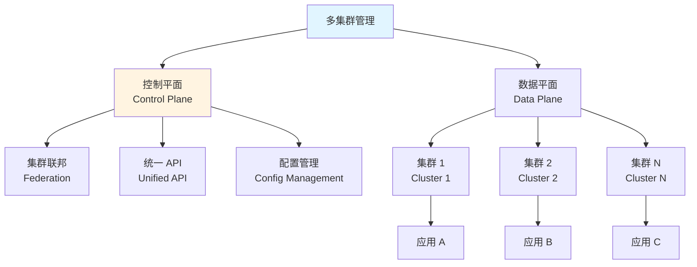
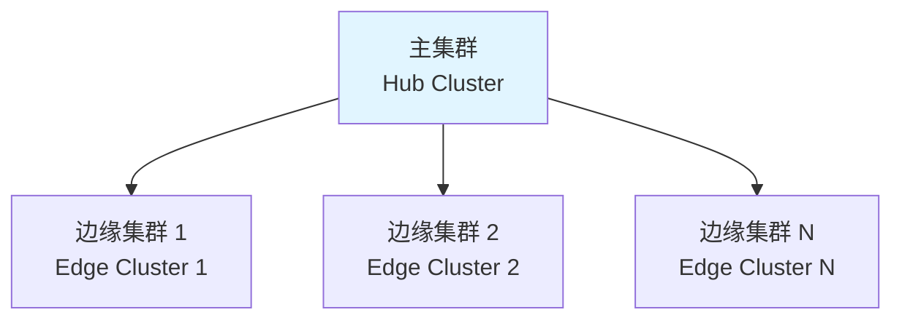
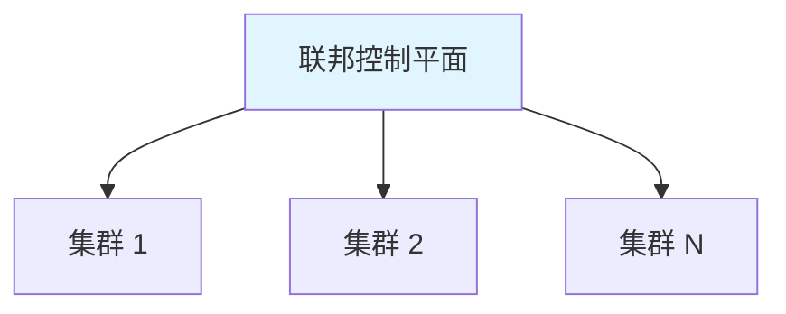
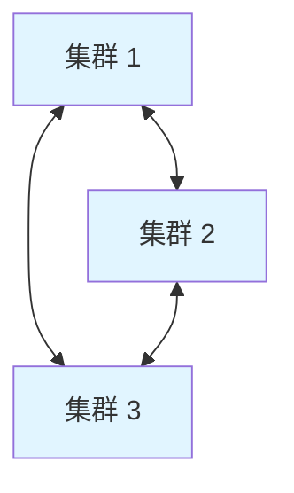
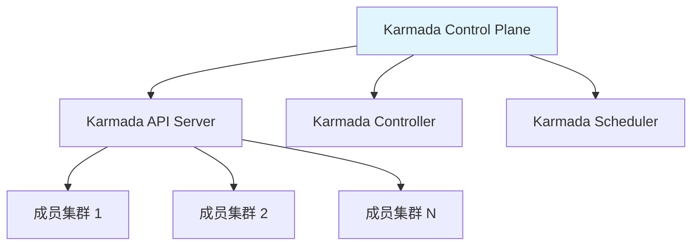
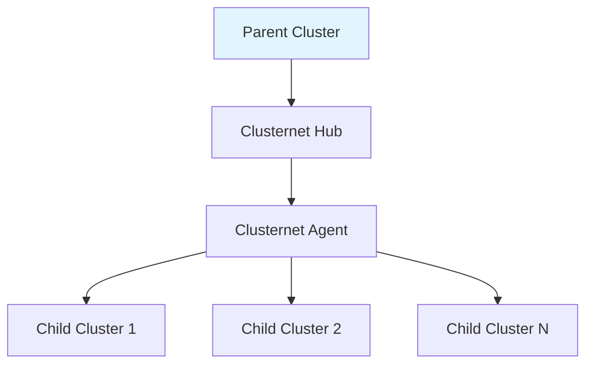
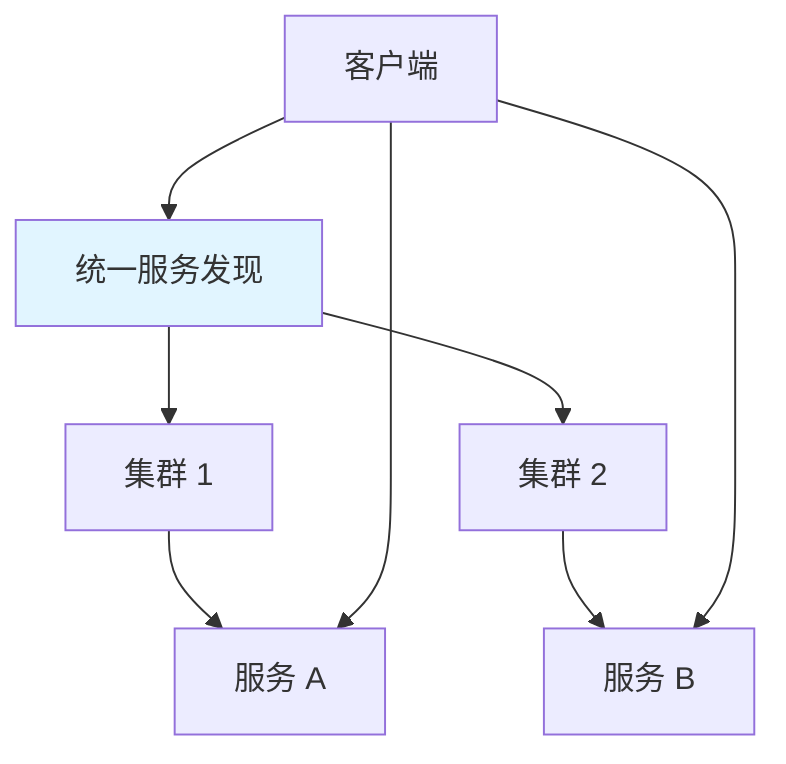

# 20. 多集群管理：全面梳理

## 目录

- [目录](#目录)
- [20.1 文档定位](#201-文档定位)
- [20.2 多集群管理技术栈全景](#202-多集群管理技术栈全景)
  - [20.2.1 多集群架构定义](#2021-多集群架构定义)
  - [20.2.2 技术组件矩阵](#2022-技术组件矩阵)
  - [20.2.3 技术栈组合](#2023-技术栈组合)
- [20.3 多集群架构设计](#203-多集群架构设计)
  - [20.3.1 多集群架构模式](#2031-多集群架构模式)
  - [20.3.2 网络架构](#2032-网络架构)
  - [20.3.3 数据同步](#2033-数据同步)
- [20.4 集群联邦（Cluster Federation）](#204-集群联邦cluster-federation)
  - [20.4.1 Kubernetes Federation](#2041-kubernetes-federation)
  - [20.4.2 Karmada](#2042-karmada)
  - [20.4.3 Clusternet](#2043-clusternet)
- [20.5 跨集群服务发现](#205-跨集群服务发现)
  - [20.5.1 服务发现架构](#2051-服务发现架构)
  - [20.5.2 服务发现实现](#2052-服务发现实现)
- [20.6 多集群部署策略](#206-多集群部署策略)
  - [20.6.1 应用部署策略](#2061-应用部署策略)
  - [20.6.2 配置管理策略](#2062-配置管理策略)
  - [20.6.3 数据同步策略](#2063-数据同步策略)
- [20.7 边缘集群管理（K3s 多集群）](#207-边缘集群管理k3s-多集群)
  - [20.7.1 K3s 多集群架构](#2071-k3s-多集群架构)
  - [20.7.2 K3s 集群间通信](#2072-k3s-集群间通信)
  - [20.7.3 边缘集群管理](#2073-边缘集群管理)
- [20.8 多集群场景分析](#208-多集群场景分析)
  - [20.8.1 多云部署场景](#2081-多云部署场景)
  - [20.8.2 地理分布场景](#2082-地理分布场景)
  - [20.8.3 边缘计算场景](#2083-边缘计算场景)
- [20.9 多集群技术栈组合方案](#209-多集群技术栈组合方案)
  - [20.9.1 多云组合](#2091-多云组合)
  - [20.9.2 边缘组合](#2092-边缘组合)
  - [20.9.3 混合组合](#2093-混合组合)
- [20.10 多集群管理最佳实践](#2010-多集群管理最佳实践)
  - [20.10.1 集群规划](#20101-集群规划)
  - [20.10.2 网络配置](#20102-网络配置)
  - [20.10.3 应用部署](#20103-应用部署)
- [20.11 参考](#2011-参考)

---

## 20.1 文档定位

本文档全面梳理云原生容器技术栈中的多集群管理技术、规格和最佳实践，包括多集群架构
设计、集群联邦、跨集群服务发现、多集群部署策略、边缘集群管理（K3s 多集群）等技术
。

**文档结构**：

- **多集群管理技术栈全景**：多集群架构定义、技术组件矩阵、技术栈组合
- **多集群架构设计**：多集群架构模式、网络架构、数据同步
- **集群联邦（Cluster Federation）**：Kubernetes Federation、Karmada、Clusternet
- **跨集群服务发现**：服务发现架构、服务发现实现
- **多集群部署策略**：应用部署策略、配置管理策略、数据同步策略
- **边缘集群管理（K3s 多集群）**：K3s 多集群架构、集群间通信、边缘集群管理
- **多集群场景分析**：多云部署、地理分布、边缘计算场景
- **多集群技术栈组合方案**：不同场景的多集群技术栈组合
- **多集群管理最佳实践**：集群规划、网络配置、应用部署

## 20.2 多集群管理技术栈全景

### 20.2.1 多集群架构定义

**多集群架构定义**：

多集群架构是指管理多个独立的 Kubernetes 集群，实现跨集群的资源管理、服务发现、应
用部署等功能。

**多集群架构层次**：



**多集群架构类型**：

| 类型         | 定义             | 典型场景           | 特点               |
| ------------ | ---------------- | ------------------ | ------------------ |
| **集群联邦** | 统一管理多个集群 | 多云、多区域部署   | 统一 API、集中管理 |
| **独立集群** | 独立管理各集群   | 不同环境、不同用途 | 隔离、灵活         |
| **主从集群** | 主集群管理从集群 | 边缘计算场景       | 集中控制、边缘执行 |
| **对等集群** | 对等关系的集群   | 容灾备份           | 对称、冗余         |

### 20.2.2 技术组件矩阵

**多集群管理技术组件矩阵**：

| 组件类别     | 技术                  | 定位                | 成熟度     | 生产验证   |
| ------------ | --------------------- | ------------------- | ---------- | ---------- |
| **集群联邦** | Kubernetes Federation | Kubernetes 官方联邦 | ⭐⭐⭐     | ⭐⭐⭐     |
|              | Karmada               | CNCF 多集群编排     | ⭐⭐⭐⭐⭐ | ⭐⭐⭐⭐⭐ |
|              | Clusternet            | 多集群管理          | ⭐⭐⭐⭐   | ⭐⭐⭐⭐   |
|              | Rancher Fleet         | Rancher 多集群管理  | ⭐⭐⭐⭐⭐ | ⭐⭐⭐⭐⭐ |
| **服务网格** | Istio Multi-Cluster   | Istio 多集群支持    | ⭐⭐⭐⭐⭐ | ⭐⭐⭐⭐⭐ |
|              | Linkerd Multi-Cluster | Linkerd 多集群      | ⭐⭐⭐⭐   | ⭐⭐⭐⭐   |
| **GitOps**   | ArgoCD Multi-Cluster  | ArgoCD 多集群       | ⭐⭐⭐⭐⭐ | ⭐⭐⭐⭐⭐ |
|              | Flux Multi-Cluster    | Flux 多集群         | ⭐⭐⭐⭐   | ⭐⭐⭐⭐   |
| **边缘管理** | K3s Multi-Cluster     | K3s 多集群管理      | ⭐⭐⭐⭐⭐ | ⭐⭐⭐⭐⭐ |
|              | KubeEdge              | 边缘计算平台        | ⭐⭐⭐⭐   | ⭐⭐⭐⭐   |

### 20.2.3 技术栈组合

**多集群管理技术栈组合方案**：

| 场景         | 集群联邦工具 | 服务网格              | GitOps 工具          | 特点               |
| ------------ | ------------ | --------------------- | -------------------- | ------------------ |
| **多云部署** | Karmada      | Istio Multi-Cluster   | ArgoCD Multi-Cluster | 统一管理、跨云部署 |
| **边缘计算** | K3s Fleet    | -                     | Flux                 | 轻量级、边缘优化   |
| **混合架构** | Clusternet   | Linkerd Multi-Cluster | ArgoCD               | 灵活、多场景支持   |

## 20.3 多集群架构设计

### 20.3.1 多集群架构模式

**多集群架构模式**：

**模式 1：主集群模式（Hub-Spoke）**:



- **特点**：主集群管理多个边缘集群
- **适用场景**：边缘计算、IoT、地理分布
- **优点**：集中管理、简化配置
- **缺点**：主集群单点故障风险

**模式 2：联邦模式（Federation）**:



- **特点**：联邦控制平面统一管理
- **适用场景**：多云、多区域、容灾
- **优点**：统一 API、集中策略
- **缺点**：复杂度高、延迟可能较高

**模式 3：对等模式（Peer-to-Peer）**:



- **特点**：集群之间对等关系
- **适用场景**：容灾备份、数据同步
- **优点**：无单点故障、高可用
- **缺点**：管理复杂

### 20.3.2 网络架构

**多集群网络架构**：

**网络连接方式**：

| 方式        | 说明         | 适用场景         | 特点             |
| ----------- | ------------ | ---------------- | ---------------- |
| **VPN**     | VPN 隧道连接 | 多云、混合云     | 安全、灵活       |
| **专线**    | 专用网络连接 | 生产环境（推荐） | 低延迟、高带宽   |
| **Overlay** | 覆盖网络     | 跨云连接         | 灵活但可能延迟高 |
| **公网**    | 公网连接     | 测试环境         | 简单但安全性低   |

**网络架构示例**：

```yaml
多集群网络:
  连接方式: VPN / 专线
  网络策略:
    - 跨集群服务发现
    - 跨集群流量路由
    - 网络隔离策略
  安全:
    - mTLS 跨集群通信
    - 网络防火墙规则
```

### 20.3.3 数据同步

**多集群数据同步**：

**同步类型**：

| 类型         | 说明                   | 同步频率  | 适用场景       |
| ------------ | ---------------------- | --------- | -------------- |
| **配置同步** | 同步 ConfigMap、Secret | 实时      | 配置管理       |
| **应用同步** | 同步应用部署           | 实时/定时 | 应用部署       |
| **数据同步** | 同步应用数据           | 实时/定时 | 数据备份、容灾 |
| **状态同步** | 同步集群状态           | 实时      | 状态监控       |

**数据同步策略**：

```yaml
数据同步策略:
  配置同步:
    方式: GitOps / 联邦 API
    频率: 实时
    冲突解决: 主集群优先
  应用同步:
    方式: ArgoCD / Karmada
    频率: 实时
    策略: 蓝绿 / 滚动
```

## 20.4 集群联邦（Cluster Federation）

### 20.4.1 Kubernetes Federation

**Kubernetes Federation 定义**：

Kubernetes Federation（KubeFed）是 Kubernetes 的官方集群联邦实现，现已弃用，推荐
使用 Karmada。

**KubeFed 状态**：

- **状态**：已弃用（Deprecated）
- **替代方案**：Karmada、Clusternet
- **原因**：维护成本高、功能有限

### 20.4.2 Karmada

**Karmada 定义**：

Karmada 是 CNCF 孵化的多集群编排平台，提供多集群资源调度和应用分发能力。

**Karmada 架构**：



**Karmada 核心组件**：

| 组件                           | 功能            | 说明                 |
| ------------------------------ | --------------- | -------------------- |
| **karmada-apiserver**          | 统一 API Server | 接收和管理多集群资源 |
| **karmada-controller-manager** | 控制器管理      | 资源分发和状态同步   |
| **karmada-scheduler**          | 调度器          | 多集群资源调度       |
| **karmada-agent**              | 成员集群代理    | 部署在成员集群中     |

**Karmada 技术特点**：

- **多集群编排**：统一的资源调度和分发
- **策略驱动**：声明式策略管理
- **故障转移**：自动故障检测和转移
- **CNCF 孵化**：CNCF 项目，社区活跃

**Karmada 配置示例**：

```yaml
# PropagationPolicy - 资源分发策略
apiVersion: policy.karmada.io/v1alpha1
kind: PropagationPolicy
metadata:
  name: myapp-propagation
spec:
  resourceSelectors:
  - apiVersion: apps/v1
    kind: Deployment
    name: myapp
  placement:
    clusterAffinity:
      clusterNames:
      - cluster1
      - cluster2
    replicaScheduling:
      replicaSchedulingType: Duplicated

# ClusterPropagationPolicy - 集群级策略
apiVersion: policy.karmada.io/v1alpha1
kind: ClusterPropagationPolicy
metadata:
  name: myapp-cluster-propagation
spec:
  resourceSelectors:
  - apiVersion: v1
    kind: ConfigMap
  placement:
    clusterAffinity:
      clusterNames:
      - cluster1
      - cluster2
```

**Karmada 场景分析**：

**场景 1：多云应用部署**:

- **需求**：在多云环境中部署应用
- **方案**：使用 Karmada 统一调度和分发
- **优点**：统一管理、自动调度
- **缺点**：需要网络连接

**场景 2：容灾备份**:

- **需求**：应用跨区域容灾备份
- **方案**：使用 Karmada 多集群部署
- **优点**：自动故障转移、高可用
- **缺点**：资源消耗增加

### 20.4.3 Clusternet

**Clusternet 定义**：

Clusternet 是腾讯开源的多集群管理平台，提供集群注册、资源分发、应用部署等功能。

**Clusternet 架构**：



**Clusternet 核心组件**：

| 组件                     | 功能           | 说明                 |
| ------------------------ | -------------- | -------------------- |
| **clusternet-hub**       | 主集群控制平面 | 管理子集群和资源分发 |
| **clusternet-agent**     | 子集群代理     | 部署在子集群中       |
| **clusternet-scheduler** | 调度器         | 资源调度和分发       |

**Clusternet 技术特点**：

- **主从架构**：清晰的父子集群关系
- **资源分发**：支持多种资源分发策略
- **应用部署**：统一的应用部署接口
- **轻量级**：相比 Karmada 更轻量

## 20.5 跨集群服务发现

### 20.5.1 服务发现架构

**跨集群服务发现定义**：

跨集群服务发现是指在多个集群中发现和访问服务的能力。

**服务发现架构**：



**服务发现方式**：

| 方式            | 说明                  | 适用场景        | 特点            |
| --------------- | --------------------- | --------------- | --------------- |
| **DNS 联邦**    | DNS 跨集群服务发现    | 标准 Kubernetes | Kubernetes 原生 |
| **服务网格**    | Istio/Linkerd 多集群  | 服务网格环境    | 统一服务发现    |
| **API Gateway** | 通过 API Gateway 路由 | 统一入口        | 简化客户端      |
| **自定义发现**  | 自定义服务发现机制    | 特定场景        | 灵活但复杂      |

### 20.5.2 服务发现实现

**Istio 多集群服务发现**：

```yaml
# ServiceEntry - 跨集群服务
apiVersion: networking.istio.io/v1beta1
kind: ServiceEntry
metadata:
  name: external-svc
spec:
  hosts:
    - external.example.com
  location: MESH_EXTERNAL
  ports:
    - number: 80
      name: http
      protocol: HTTP
  resolution: DNS
  endpoints:
    - address: cluster2.example.com
      ports:
        http: 80
```

**DNS 联邦服务发现**：

```yaml
# ExternalName Service - 跨集群服务
apiVersion: v1
kind: Service
metadata:
  name: cross-cluster-svc
spec:
  type: ExternalName
  externalName: service.cluster2.svc.cluster.local
  ports:
    - port: 80
```

## 20.6 多集群部署策略

### 20.6.1 应用部署策略

**应用部署策略**：

| 策略         | 说明                   | 适用场景 | 特点               |
| ------------ | ---------------------- | -------- | ------------------ |
| **完全复制** | 所有集群部署相同应用   | 容灾备份 | 高可用、资源消耗大 |
| **部分复制** | 部分集群部署应用       | 地理分布 | 资源优化、延迟低   |
| **按需部署** | 根据需求部署           | 动态负载 | 灵活、复杂         |
| **主从部署** | 主集群部署，从集群备份 | 主备模式 | 资源节省、切换复杂 |

**应用部署策略决策树**：

```yaml
应用部署策略:
  if 需要高可用和容灾:
    使用: 完全复制
  elif 需要地理分布优化:
    使用: 部分复制
  elif 需要动态负载均衡:
    使用: 按需部署
  else:
    使用: 主从部署
```

### 20.6.2 配置管理策略

**配置管理策略**：

1. **集中管理**：在主集群集中管理配置
2. **分布管理**：各集群独立管理配置
3. **GitOps 管理**：使用 GitOps 工具统一管理

**GitOps 多集群配置管理**：

```yaml
# ArgoCD ApplicationSet - 多集群应用
apiVersion: argoproj.io/v1alpha1
kind: ApplicationSet
metadata:
  name: myapp
spec:
  generators:
    - clusters:
        selector:
          matchLabels:
            environment: production
  template:
    metadata:
      name: "{{name}}-myapp"
    spec:
      project: default
      source:
        repoURL: https://github.com/example/myapp
        targetRevision: main
        path: kustomize/overlays/production
      destination:
        server: "{{server}}"
        namespace: production
      syncPolicy:
        automated:
          prune: true
          selfHeal: true
```

### 20.6.3 数据同步策略

**数据同步策略**：

1. **实时同步**：配置和状态实时同步
2. **定时同步**：数据定时同步
3. **事件驱动**：基于事件触发同步

## 20.7 边缘集群管理（K3s 多集群）

### 20.7.1 K3s 多集群架构

**K3s 多集群架构**：

K3s 支持通过 Rancher Fleet 或其他工具管理多个 K3s 集群。

**K3s 多集群模式**：

| 模式           | 说明                    | 适用场景     |
| -------------- | ----------------------- | ------------ |
| **Fleet 管理** | 使用 Rancher Fleet 管理 | Rancher 生态 |
| **独立管理**   | 各集群独立管理          | 简单场景     |
| **联邦模式**   | 通过联邦工具管理        | 复杂场景     |

### 20.7.2 K3s 集群间通信

**K3s 集群间通信**：

- **VPN 连接**：通过 VPN 连接各集群
- **公网连接**：通过公网连接（需要安全配置）
- **专线连接**：通过专线连接（推荐）

### 20.7.3 边缘集群管理

**边缘集群管理策略**：

1. **集中管理**：通过主集群管理边缘集群
2. **离线支持**：边缘集群支持离线运行
3. **自动同步**：边缘集群自动同步配置和应用

## 20.8 多集群场景分析

### 20.8.1 多云部署场景

**场景描述**：应用部署在多个云平台，实现多云容灾和优化

**挑战分析**：

1. **网络连通**：跨云网络连接
2. **服务发现**：跨云服务发现
3. **数据同步**：跨云数据同步
4. **统一管理**：统一管理接口

**解决方案**：

```yaml
多云部署方案:
  集群联邦: Karmada
  服务网格: Istio Multi-Cluster
  GitOps: ArgoCD Multi-Cluster
  网络: VPN / 专线
  特点:
    - 统一管理
    - 跨云服务发现
    - 自动故障转移
```

### 20.8.2 地理分布场景

**场景描述**：应用部署在不同地理位置的集群，实现低延迟访问

**挑战分析**：

1. **延迟优化**：就近访问，降低延迟
2. **数据一致性**：跨区域数据一致性
3. **流量路由**：智能流量路由

**解决方案**：

```yaml
地理分布方案:
  集群联邦: Karmada
  部署策略: 部分复制
  流量路由: 基于地理位置
  特点:
    - 低延迟
    - 高可用
    - 资源优化
```

### 20.8.3 边缘计算场景

**场景描述**：边缘环境部署多个 K3s 集群，集中管理

**挑战分析**：

1. **资源受限**：边缘节点资源有限
2. **网络不稳定**：网络连接可能不稳定
3. **离线能力**：需要离线运行能力

**解决方案**：

```yaml
边缘计算方案:
  集群: K3s
  管理工具: Rancher Fleet / Karmada
  特点:
    - 轻量级
    - 离线支持
    - 集中管理
```

## 20.9 多集群技术栈组合方案

### 20.9.1 多云组合

**多云多集群组合**：

| 组件         | 技术                 | 说明           |
| ------------ | -------------------- | -------------- |
| **集群联邦** | Karmada              | 多集群编排     |
| **服务网格** | Istio Multi-Cluster  | 跨集群服务通信 |
| **GitOps**   | ArgoCD Multi-Cluster | 统一应用部署   |
| **网络**     | VPN / 专线           | 跨云网络连接   |

### 20.9.2 边缘组合

**边缘多集群组合**：

| 组件         | 技术          | 说明              |
| ------------ | ------------- | ----------------- |
| **集群**     | K3s           | 轻量级 Kubernetes |
| **管理工具** | Rancher Fleet | 多集群管理        |
| **GitOps**   | Flux          | 轻量级 GitOps     |
| **网络**     | VPN / 公网    | 集群间通信        |

### 20.9.3 混合组合

**混合多集群组合**：

| 组件         | 技术                  | 说明             |
| ------------ | --------------------- | ---------------- |
| **集群联邦** | Clusternet            | 灵活的多集群管理 |
| **服务网格** | Linkerd Multi-Cluster | 轻量级服务网格   |
| **GitOps**   | ArgoCD                | 统一应用部署     |

## 20.10 多集群管理最佳实践

### 20.10.1 集群规划

**集群规划最佳实践**：

1. **明确目标**：明确多集群的目标和需求
2. **架构设计**：设计合适的多集群架构
3. **网络规划**：规划集群间网络连接
4. **资源规划**：规划各集群的资源分配

### 20.10.2 网络配置

**网络配置最佳实践**：

1. **安全连接**：使用 VPN 或专线连接
2. **网络策略**：配置跨集群网络策略
3. **服务发现**：配置跨集群服务发现
4. **监控网络**：监控跨集群网络状态

### 20.10.3 应用部署

**应用部署最佳实践**：

1. **统一配置**：使用 GitOps 统一管理配置
2. **渐进部署**：逐步扩展多集群部署
3. **监控验证**：部署后验证功能
4. **故障转移**：配置自动故障转移

## 20.11 参考

- [Karmada 官方文档](https://karmada.io/docs/)
- [Clusternet 官方文档](https://clusternet.io/docs/)
- [Rancher Fleet 官方文档](https://fleet.rancher.io/)
- [Istio Multi-Cluster 官方文档](https://istio.io/latest/docs/setup/install/multicluster/)
- [ArgoCD Multi-Cluster 官方文档](https://argo-cd.readthedocs.io/en/stable/operator-manual/high_availability/)

---

> **使用指南**：
>
> - **快速开始**：查看 [20.2 多集群管理技术栈全景](#202-多集群管理技术栈全景)
> - **架构设计**：查看 [20.3 多集群架构设计](#203-多集群架构设计)
> - **集群联邦**：查看
>   [20.4 集群联邦（Cluster Federation）](#204-集群联邦cluster-federation)
> - **最佳实践**：查看 [20.10 多集群管理最佳实践](#2010-多集群管理最佳实践)

---

**最后更新**：2025-11-03 **维护者**：项目团队
