# 20. 多集群管理：全面梳理

## 📑 目录

- [📑 目录](#-目录)
- [20.1 文档定位](#201-文档定位)
- [20.2 多集群管理技术栈全景](#202-多集群管理技术栈全景)
  - [20.2.1 多集群架构定义](#2021-多集群架构定义)
  - [20.2.2 技术组件矩阵](#2022-技术组件矩阵)
  - [20.2.3 技术栈组合](#2023-技术栈组合)
- [20.3 多集群架构设计](#203-多集群架构设计)
  - [20.3.1 多集群架构模式](#2031-多集群架构模式)
  - [20.3.2 网络架构](#2032-网络架构)
  - [20.3.3 数据同步](#2033-数据同步)
- [20.4 集群联邦（Cluster Federation）](#204-集群联邦cluster-federation)
  - [20.4.1 Kubernetes Federation](#2041-kubernetes-federation)
  - [20.4.2 Karmada](#2042-karmada)
  - [20.4.3 Clusternet](#2043-clusternet)
- [20.5 跨集群服务发现](#205-跨集群服务发现)
  - [20.5.1 服务发现架构](#2051-服务发现架构)
  - [20.5.2 服务发现实现](#2052-服务发现实现)
- [20.6 多集群部署策略](#206-多集群部署策略)
  - [20.6.1 应用部署策略](#2061-应用部署策略)
  - [20.6.2 配置管理策略](#2062-配置管理策略)
  - [20.6.3 数据同步策略](#2063-数据同步策略)
- [20.7 边缘集群管理（K3s 多集群）](#207-边缘集群管理k3s-多集群)
  - [20.7.1 K3s 多集群架构](#2071-k3s-多集群架构)
  - [20.7.2 K3s 集群间通信](#2072-k3s-集群间通信)
  - [20.7.3 边缘集群管理](#2073-边缘集群管理)
- [20.8 多集群场景分析](#208-多集群场景分析)
  - [20.8.1 多云部署场景](#2081-多云部署场景)
  - [20.8.2 地理分布场景](#2082-地理分布场景)
  - [20.8.3 边缘计算场景](#2083-边缘计算场景)
- [20.9 多集群技术栈组合方案](#209-多集群技术栈组合方案)
  - [20.9.1 多云组合](#2091-多云组合)
  - [20.9.2 边缘组合](#2092-边缘组合)
  - [20.9.3 混合组合](#2093-混合组合)
- [20.10 多集群管理最佳实践](#2010-多集群管理最佳实践)
  - [20.10.1 集群规划](#20101-集群规划)
  - [20.10.2 网络配置](#20102-网络配置)
  - [20.10.3 应用部署](#20103-应用部署)
- [20.11 实际部署案例](#2011-实际部署案例)
  - [20.11.1 案例 1：Karmada 多集群联邦部署](#20111-案例-1karmada-多集群联邦部署)
  - [20.11.2 案例 2：Rancher Fleet 边缘集群管理](#20112-案例-2rancher-fleet-边缘集群管理)
  - [20.11.3 案例 3：跨集群服务发现（Istio Multi-Cluster）](#20113-案例-3跨集群服务发现istio-multi-cluster)
  - [20.11.4 案例 4：ArgoCD 多集群应用部署](#20114-案例-4argocd-多集群应用部署)
- [20.12 多集群检查清单](#2012-多集群检查清单)
- [20.13 多集群故障排查](#2013-多集群故障排查)
  - [20.13.1 常见问题](#20131-常见问题)
- [20.14 参考](#2014-参考)
  - [20.14.1 隔离栈相关文档](#20141-隔离栈相关文档)
  - [20.14.2 多集群相关文档](#20142-多集群相关文档)
  - [20.14.3 外部参考](#20143-外部参考)

---

## 20.1 文档定位

本文档全面梳理云原生容器技术栈中的多集群管理技术、规格和最佳实践，包括多集群架构
设计、集群联邦、跨集群服务发现、多集群部署策略、边缘集群管理（K3s 多集群）等技术
。

**文档结构**：

- **多集群管理技术栈全景**：多集群架构定义、技术组件矩阵、技术栈组合
- **多集群架构设计**：多集群架构模式、网络架构、数据同步
- **集群联邦（Cluster Federation）**：Kubernetes Federation、Karmada、Clusternet
- **跨集群服务发现**：服务发现架构、服务发现实现
- **多集群部署策略**：应用部署策略、配置管理策略、数据同步策略
- **边缘集群管理（K3s 多集群）**：K3s 多集群架构、集群间通信、边缘集群管理
- **多集群场景分析**：多云部署、地理分布、边缘计算场景
- **多集群技术栈组合方案**：不同场景的多集群技术栈组合
- **多集群管理最佳实践**：集群规划、网络配置、应用部署

## 20.2 多集群管理技术栈全景

### 20.2.1 多集群架构定义

**多集群架构定义**：

多集群架构是指管理多个独立的 Kubernetes 集群，实现跨集群的资源管理、服务发现、应
用部署等功能。

**多集群架构层次**：

```mermaid
graph TB
    A[多集群管理] --> B[控制平面<br/>Control Plane]
    A --> C[数据平面<br/>Data Plane]

    B --> B1[集群联邦<br/>Federation]
    B --> B2[统一 API<br/>Unified API]
    B --> B3[配置管理<br/>Config Management]

    C --> C1[集群 1<br/>Cluster 1]
    C --> C2[集群 2<br/>Cluster 2]
    C --> C3[集群 N<br/>Cluster N]

    C1 --> C4[应用 A]
    C2 --> C5[应用 B]
    C3 --> C6[应用 C]

    style A fill:#e1f5ff
    style B fill:#fff4e1
```



**多集群架构类型**：

| 类型         | 定义             | 典型场景           | 特点               |
| ------------ | ---------------- | ------------------ | ------------------ |
| **集群联邦** | 统一管理多个集群 | 多云、多区域部署   | 统一 API、集中管理 |
| **独立集群** | 独立管理各集群   | 不同环境、不同用途 | 隔离、灵活         |
| **主从集群** | 主集群管理从集群 | 边缘计算场景       | 集中控制、边缘执行 |
| **对等集群** | 对等关系的集群   | 容灾备份           | 对称、冗余         |

### 20.2.2 技术组件矩阵

**多集群管理技术组件矩阵**：

| 组件类别     | 技术                  | 定位                | 成熟度     | 生产验证   |
| ------------ | --------------------- | ------------------- | ---------- | ---------- |
| **集群联邦** | Kubernetes Federation | Kubernetes 官方联邦 | ⭐⭐⭐     | ⭐⭐⭐     |
|              | Karmada               | CNCF 多集群编排     | ⭐⭐⭐⭐⭐ | ⭐⭐⭐⭐⭐ |
|              | Clusternet            | 多集群管理          | ⭐⭐⭐⭐   | ⭐⭐⭐⭐   |
|              | Rancher Fleet         | Rancher 多集群管理  | ⭐⭐⭐⭐⭐ | ⭐⭐⭐⭐⭐ |
| **服务网格** | Istio Multi-Cluster   | Istio 多集群支持    | ⭐⭐⭐⭐⭐ | ⭐⭐⭐⭐⭐ |
|              | Linkerd Multi-Cluster | Linkerd 多集群      | ⭐⭐⭐⭐   | ⭐⭐⭐⭐   |
| **GitOps**   | ArgoCD Multi-Cluster  | ArgoCD 多集群       | ⭐⭐⭐⭐⭐ | ⭐⭐⭐⭐⭐ |
|              | Flux Multi-Cluster    | Flux 多集群         | ⭐⭐⭐⭐   | ⭐⭐⭐⭐   |
| **边缘管理** | K3s Multi-Cluster     | K3s 多集群管理      | ⭐⭐⭐⭐⭐ | ⭐⭐⭐⭐⭐ |
|              | KubeEdge              | 边缘计算平台        | ⭐⭐⭐⭐   | ⭐⭐⭐⭐   |

### 20.2.3 技术栈组合

**多集群管理技术栈组合方案**：

| 场景         | 集群联邦工具 | 服务网格              | GitOps 工具          | 特点               |
| ------------ | ------------ | --------------------- | -------------------- | ------------------ |
| **多云部署** | Karmada      | Istio Multi-Cluster   | ArgoCD Multi-Cluster | 统一管理、跨云部署 |
| **边缘计算** | K3s Fleet    | -                     | Flux                 | 轻量级、边缘优化   |
| **混合架构** | Clusternet   | Linkerd Multi-Cluster | ArgoCD               | 灵活、多场景支持   |

## 20.3 多集群架构设计

### 20.3.1 多集群架构模式

**多集群架构模式**：

**模式 1：主集群模式（Hub-Spoke）**:

```mermaid
graph TB
    A[主集群<br/>Hub Cluster] --> B[边缘集群 1<br/>Edge Cluster 1]
    A --> C[边缘集群 2<br/>Edge Cluster 2]
    A --> D[边缘集群 N<br/>Edge Cluster N]

    style A fill:#e1f5ff
```



- **特点**：主集群管理多个边缘集群
- **适用场景**：边缘计算、IoT、地理分布
- **优点**：集中管理、简化配置
- **缺点**：主集群单点故障风险

**模式 2：联邦模式（Federation）**:

```mermaid
graph TB
    A[联邦控制平面] --> B[集群 1]
    A --> C[集群 2]
    A --> D[集群 N]

    style A fill:#e1f5ff
```



- **特点**：联邦控制平面统一管理
- **适用场景**：多云、多区域、容灾
- **优点**：统一 API、集中策略
- **缺点**：复杂度高、延迟可能较高

**模式 3：对等模式（Peer-to-Peer）**:

```mermaid
graph TB
    A[集群 1] <--> B[集群 2]
    A <--> C[集群 3]
    B <--> C

    style A fill:#e1f5ff
    style B fill:#e1f5ff
    style C fill:#e1f5ff
```



- **特点**：集群之间对等关系
- **适用场景**：容灾备份、数据同步
- **优点**：无单点故障、高可用
- **缺点**：管理复杂

### 20.3.2 网络架构

**多集群网络架构**：

**网络连接方式**：

| 方式        | 说明         | 适用场景         | 特点             |
| ----------- | ------------ | ---------------- | ---------------- |
| **VPN**     | VPN 隧道连接 | 多云、混合云     | 安全、灵活       |
| **专线**    | 专用网络连接 | 生产环境（推荐） | 低延迟、高带宽   |
| **Overlay** | 覆盖网络     | 跨云连接         | 灵活但可能延迟高 |
| **公网**    | 公网连接     | 测试环境         | 简单但安全性低   |

**网络架构示例**：

```yaml
多集群网络:
  连接方式: VPN / 专线
  网络策略:
    - 跨集群服务发现
    - 跨集群流量路由
    - 网络隔离策略
  安全:
    - mTLS 跨集群通信
    - 网络防火墙规则
```

### 20.3.3 数据同步

**多集群数据同步**：

**同步类型**：

| 类型         | 说明                   | 同步频率  | 适用场景       |
| ------------ | ---------------------- | --------- | -------------- |
| **配置同步** | 同步 ConfigMap、Secret | 实时      | 配置管理       |
| **应用同步** | 同步应用部署           | 实时/定时 | 应用部署       |
| **数据同步** | 同步应用数据           | 实时/定时 | 数据备份、容灾 |
| **状态同步** | 同步集群状态           | 实时      | 状态监控       |

**数据同步策略**：

```yaml
数据同步策略:
  配置同步:
    方式: GitOps / 联邦 API
    频率: 实时
    冲突解决: 主集群优先
  应用同步:
    方式: ArgoCD / Karmada
    频率: 实时
    策略: 蓝绿 / 滚动
```

## 20.4 集群联邦（Cluster Federation）

### 20.4.1 Kubernetes Federation

**Kubernetes Federation 定义**：

Kubernetes Federation（KubeFed）是 Kubernetes 的官方集群联邦实现，现已弃用，推荐
使用 Karmada。

**KubeFed 状态**：

- **状态**：已弃用（Deprecated）
- **替代方案**：Karmada、Clusternet
- **原因**：维护成本高、功能有限

### 20.4.2 Karmada

**Karmada 定义**：

Karmada 是 CNCF 孵化的多集群编排平台，提供多集群资源调度和应用分发能力。

**Karmada 架构**：

```mermaid
graph TB
    A[Karmada Control Plane] --> B[Karmada API Server]
    A --> C[Karmada Controller]
    A --> D[Karmada Scheduler]

    B --> E[成员集群 1]
    B --> F[成员集群 2]
    B --> G[成员集群 N]

    style A fill:#e1f5ff
```



**Karmada 核心组件**：

| 组件                           | 功能            | 说明                 |
| ------------------------------ | --------------- | -------------------- |
| **karmada-apiserver**          | 统一 API Server | 接收和管理多集群资源 |
| **karmada-controller-manager** | 控制器管理      | 资源分发和状态同步   |
| **karmada-scheduler**          | 调度器          | 多集群资源调度       |
| **karmada-agent**              | 成员集群代理    | 部署在成员集群中     |

**Karmada 技术特点**：

- **多集群编排**：统一的资源调度和分发
- **策略驱动**：声明式策略管理
- **故障转移**：自动故障检测和转移
- **CNCF 孵化**：CNCF 项目，社区活跃

**Karmada 配置示例**：

```yaml
# PropagationPolicy - 资源分发策略
apiVersion: policy.karmada.io/v1alpha1
kind: PropagationPolicy
metadata:
  name: myapp-propagation
spec:
  resourceSelectors:
  - apiVersion: apps/v1
    kind: Deployment
    name: myapp
  placement:
    clusterAffinity:
      clusterNames:
      - cluster1
      - cluster2
    replicaScheduling:
      replicaSchedulingType: Duplicated

# ClusterPropagationPolicy - 集群级策略
apiVersion: policy.karmada.io/v1alpha1
kind: ClusterPropagationPolicy
metadata:
  name: myapp-cluster-propagation
spec:
  resourceSelectors:
  - apiVersion: v1
    kind: ConfigMap
  placement:
    clusterAffinity:
      clusterNames:
      - cluster1
      - cluster2
```

**Karmada 场景分析**：

**场景 1：多云应用部署**:

- **需求**：在多云环境中部署应用
- **方案**：使用 Karmada 统一调度和分发
- **优点**：统一管理、自动调度
- **缺点**：需要网络连接

**场景 2：容灾备份**:

- **需求**：应用跨区域容灾备份
- **方案**：使用 Karmada 多集群部署
- **优点**：自动故障转移、高可用
- **缺点**：资源消耗增加

### 20.4.3 Clusternet

**Clusternet 定义**：

Clusternet 是腾讯开源的多集群管理平台，提供集群注册、资源分发、应用部署等功能。

**Clusternet 架构**：


**Clusternet 核心组件**：

| 组件                     | 功能           | 说明                 |
| ------------------------ | -------------- | -------------------- |
| **clusternet-hub**       | 主集群控制平面 | 管理子集群和资源分发 |
| **clusternet-agent**     | 子集群代理     | 部署在子集群中       |
| **clusternet-scheduler** | 调度器         | 资源调度和分发       |

**Clusternet 技术特点**：

- **主从架构**：清晰的父子集群关系
- **资源分发**：支持多种资源分发策略
- **应用部署**：统一的应用部署接口
- **轻量级**：相比 Karmada 更轻量

## 20.5 跨集群服务发现

### 20.5.1 服务发现架构

**跨集群服务发现定义**：

跨集群服务发现是指在多个集群中发现和访问服务的能力。

**服务发现架构**：

```mermaid
graph TB
    A[集群 1] --> B[服务 A]
    C[集群 2] --> D[服务 B]

    E[统一服务发现] --> A
    E --> C

    F[客户端] --> E
    F --> B
    F --> D

    style E fill:#e1f5ff
```



**服务发现方式**：

| 方式            | 说明                  | 适用场景        | 特点            |
| --------------- | --------------------- | --------------- | --------------- |
| **DNS 联邦**    | DNS 跨集群服务发现    | 标准 Kubernetes | Kubernetes 原生 |
| **服务网格**    | Istio/Linkerd 多集群  | 服务网格环境    | 统一服务发现    |
| **API Gateway** | 通过 API Gateway 路由 | 统一入口        | 简化客户端      |
| **自定义发现**  | 自定义服务发现机制    | 特定场景        | 灵活但复杂      |

### 20.5.2 服务发现实现

**Istio 多集群服务发现**：

```yaml
# ServiceEntry - 跨集群服务
apiVersion: networking.istio.io/v1beta1
kind: ServiceEntry
metadata:
  name: external-svc
spec:
  hosts:
    - external.example.com
  location: MESH_EXTERNAL
  ports:
    - number: 80
      name: http
      protocol: HTTP
  resolution: DNS
  endpoints:
    - address: cluster2.example.com
      ports:
        http: 80
```

**DNS 联邦服务发现**：

```yaml
# ExternalName Service - 跨集群服务
apiVersion: v1
kind: Service
metadata:
  name: cross-cluster-svc
spec:
  type: ExternalName
  externalName: service.cluster2.svc.cluster.local
  ports:
    - port: 80
```

## 20.6 多集群部署策略

### 20.6.1 应用部署策略

**应用部署策略**：

| 策略         | 说明                   | 适用场景 | 特点               |
| ------------ | ---------------------- | -------- | ------------------ |
| **完全复制** | 所有集群部署相同应用   | 容灾备份 | 高可用、资源消耗大 |
| **部分复制** | 部分集群部署应用       | 地理分布 | 资源优化、延迟低   |
| **按需部署** | 根据需求部署           | 动态负载 | 灵活、复杂         |
| **主从部署** | 主集群部署，从集群备份 | 主备模式 | 资源节省、切换复杂 |

**应用部署策略决策树**：

```yaml
应用部署策略:
  if 需要高可用和容灾:
    使用: 完全复制
  elif 需要地理分布优化:
    使用: 部分复制
  elif 需要动态负载均衡:
    使用: 按需部署
  else:
    使用: 主从部署
```

### 20.6.2 配置管理策略

**配置管理策略**：

1. **集中管理**：在主集群集中管理配置
2. **分布管理**：各集群独立管理配置
3. **GitOps 管理**：使用 GitOps 工具统一管理

**GitOps 多集群配置管理**：

```yaml
# ArgoCD ApplicationSet - 多集群应用
apiVersion: argoproj.io/v1alpha1
kind: ApplicationSet
metadata:
  name: myapp
spec:
  generators:
    - clusters:
        selector:
          matchLabels:
            environment: production
  template:
    metadata:
      name: "{{name}}-myapp"
    spec:
      project: default
      source:
        repoURL: https://github.com/example/myapp
        targetRevision: main
        path: kustomize/overlays/production
      destination:
        server: "{{server}}"
        namespace: production
      syncPolicy:
        automated:
          prune: true
          selfHeal: true
```

### 20.6.3 数据同步策略

**数据同步策略**：

1. **实时同步**：配置和状态实时同步
2. **定时同步**：数据定时同步
3. **事件驱动**：基于事件触发同步

## 20.7 边缘集群管理（K3s 多集群）

### 20.7.1 K3s 多集群架构

> **💡 隔离层次关联**：K3s 多集群管理涉及 L-3 容器化层（containerd）和 L-4 沙盒
> 化层（WasmEdge），不同集群可以使用不同的运行时。详细的技术解析请参考：
>
> - **[29. 隔离栈](../29-isolation-stack/isolation-stack.md)** - 完整的隔离栈技
>   术解析
> - **[L-3 容器化层](../29-isolation-stack/layers/L-3-containerization.md)** -
>   containerd 详细文档
> - **[L-4 沙盒化层](../29-isolation-stack/layers/L-4-sandboxing.md)** -
>   WasmEdge 详细文档（K3s 支持）
> - **[隔离层次对比文档](../29-isolation-stack/layers/isolation-comparison.md)** -
>   运行时性能对比和技术选型

**K3s 多集群架构**：

K3s 支持通过 Rancher Fleet 或其他工具管理多个 K3s 集群。

**K3s 多集群模式**：

| 模式           | 说明                    | 适用场景     |
| -------------- | ----------------------- | ------------ |
| **Fleet 管理** | 使用 Rancher Fleet 管理 | Rancher 生态 |
| **独立管理**   | 各集群独立管理          | 简单场景     |
| **联邦模式**   | 通过联邦工具管理        | 复杂场景     |

### 20.7.2 K3s 集群间通信

**K3s 集群间通信**：

- **VPN 连接**：通过 VPN 连接各集群
- **公网连接**：通过公网连接（需要安全配置）
- **专线连接**：通过专线连接（推荐）

### 20.7.3 边缘集群管理

**边缘集群管理策略**：

1. **集中管理**：通过主集群管理边缘集群
2. **离线支持**：边缘集群支持离线运行
3. **自动同步**：边缘集群自动同步配置和应用

## 20.8 多集群场景分析

### 20.8.1 多云部署场景

**场景描述**：应用部署在多个云平台，实现多云容灾和优化

**挑战分析**：

1. **网络连通**：跨云网络连接
2. **服务发现**：跨云服务发现
3. **数据同步**：跨云数据同步
4. **统一管理**：统一管理接口

**解决方案**：

```yaml
多云部署方案:
  集群联邦: Karmada
  服务网格: Istio Multi-Cluster
  GitOps: ArgoCD Multi-Cluster
  网络: VPN / 专线
  特点:
    - 统一管理
    - 跨云服务发现
    - 自动故障转移
```

### 20.8.2 地理分布场景

**场景描述**：应用部署在不同地理位置的集群，实现低延迟访问

**挑战分析**：

1. **延迟优化**：就近访问，降低延迟
2. **数据一致性**：跨区域数据一致性
3. **流量路由**：智能流量路由

**解决方案**：

```yaml
地理分布方案:
  集群联邦: Karmada
  部署策略: 部分复制
  流量路由: 基于地理位置
  特点:
    - 低延迟
    - 高可用
    - 资源优化
```

### 20.8.3 边缘计算场景

**场景描述**：边缘环境部署多个 K3s 集群，集中管理

**挑战分析**：

1. **资源受限**：边缘节点资源有限
2. **网络不稳定**：网络连接可能不稳定
3. **离线能力**：需要离线运行能力

**解决方案**：

```yaml
边缘计算方案:
  集群: K3s
  管理工具: Rancher Fleet / Karmada
  特点:
    - 轻量级
    - 离线支持
    - 集中管理
```

## 20.9 多集群技术栈组合方案

### 20.9.1 多云组合

**多云多集群组合**：

| 组件         | 技术                 | 说明           |
| ------------ | -------------------- | -------------- |
| **集群联邦** | Karmada              | 多集群编排     |
| **服务网格** | Istio Multi-Cluster  | 跨集群服务通信 |
| **GitOps**   | ArgoCD Multi-Cluster | 统一应用部署   |
| **网络**     | VPN / 专线           | 跨云网络连接   |

### 20.9.2 边缘组合

**边缘多集群组合**：

| 组件         | 技术          | 说明              |
| ------------ | ------------- | ----------------- |
| **集群**     | K3s           | 轻量级 Kubernetes |
| **管理工具** | Rancher Fleet | 多集群管理        |
| **GitOps**   | Flux          | 轻量级 GitOps     |
| **网络**     | VPN / 公网    | 集群间通信        |

### 20.9.3 混合组合

**混合多集群组合**：

| 组件         | 技术                  | 说明             |
| ------------ | --------------------- | ---------------- |
| **集群联邦** | Clusternet            | 灵活的多集群管理 |
| **服务网格** | Linkerd Multi-Cluster | 轻量级服务网格   |
| **GitOps**   | ArgoCD                | 统一应用部署     |

## 20.10 多集群管理最佳实践

### 20.10.1 集群规划

**集群规划最佳实践**：

1. **明确目标**：明确多集群的目标和需求
2. **架构设计**：设计合适的多集群架构
3. **网络规划**：规划集群间网络连接
4. **资源规划**：规划各集群的资源分配

### 20.10.2 网络配置

**网络配置最佳实践**：

1. **安全连接**：使用 VPN 或专线连接
2. **网络策略**：配置跨集群网络策略
3. **服务发现**：配置跨集群服务发现
4. **监控网络**：监控跨集群网络状态

### 20.10.3 应用部署

**应用部署最佳实践**：

1. **统一配置**：使用 GitOps 统一管理配置
2. **渐进部署**：逐步扩展多集群部署
3. **监控验证**：部署后验证功能
4. **故障转移**：配置自动故障转移

## 20.11 实际部署案例

### 20.11.1 案例 1：Karmada 多集群联邦部署

**场景**：使用 Karmada 管理 3 个 Kubernetes 集群（2 个云端 + 1 个边缘）

**部署步骤**：

```bash
# 1. 安装 Karmada Control Plane
kubectl create namespace karmada-system
helm repo add karmada https://charts.karmada.io
helm install karmada karmada/karmada \
  --namespace karmada-system \
  --create-namespace

# 2. 注册成员集群
# 集群 1：云端生产集群
karmadactl join member-cluster-1 \
  --karmada-context=karmada-apiserver \
  --cluster-kubeconfig=/path/to/cluster1-kubeconfig

# 集群 2：云端测试集群
karmadactl join member-cluster-2 \
  --karmada-context=karmada-apiserver \
  --cluster-kubeconfig=/path/to/cluster2-kubeconfig

# 集群 3：边缘集群（K3s）
karmadactl join edge-cluster \
  --karmada-context=karmada-apiserver \
  --cluster-kubeconfig=/path/to/edge-kubeconfig

# 3. 验证集群注册
karmadactl get clusters --karmada-context=karmada-apiserver
```

**部署应用到多集群**：

```yaml
# myapp-deployment.yaml
apiVersion: apps/v1
kind: Deployment
metadata:
  name: myapp
spec:
  replicas: 3
  selector:
    matchLabels:
      app: myapp
  template:
    metadata:
      labels:
        app: myapp
    spec:
      containers:
        - name: app
          image: myregistry.com/myapp:v1.0.0
---
# PropagationPolicy
apiVersion: policy.karmada.io/v1alpha1
kind: PropagationPolicy
metadata:
  name: myapp-propagation
spec:
  resourceSelectors:
    - apiVersion: apps/v1
      kind: Deployment
      name: myapp
  placement:
    clusterAffinity:
      clusterNames:
        - member-cluster-1
        - member-cluster-2
    replicaScheduling:
      replicaDivisionPreference: Weighted
      replicaSchedulingType: Divided
      weightPreference:
        staticWeightList:
          - targetCluster:
              clusterNames:
                - member-cluster-1
            weight: 2
          - targetCluster:
              clusterNames:
                - member-cluster-2
            weight: 1
```

### 20.11.2 案例 2：Rancher Fleet 边缘集群管理

**场景**：使用 Rancher Fleet 管理 100+ 边缘 K3s 集群

**部署步骤**：

```bash
# 1. 在主集群安装 Fleet
helm repo add fleet https://charts.rancher.io
helm install fleet fleet/fleet \
  --namespace fleet-system \
  --create-namespace

# 2. 创建 GitRepo
kubectl apply -f - <<EOF
apiVersion: fleet.cattle.io/v1alpha1
kind: GitRepo
metadata:
  name: edge-apps
  namespace: fleet-default
spec:
  repo: https://github.com/example/edge-apps.git
  branch: main
  paths:
    - apps/**
EOF

# 3. 边缘集群自动注册
# Fleet 会自动发现并注册 K3s 集群
```

**Fleet 配置示例**：

```yaml
# apps/myapp/fleet.yaml
namespace: default
helm:
  chart: myapp
  repo: https://charts.example.com
  version: 1.0.0
  values:
    replicaCount: 1
---
# apps/myapp/cluster-group.yaml
apiVersion: fleet.cattle.io/v1alpha1
kind: ClusterGroup
metadata:
  name: edge-clusters
spec:
  selector:
    matchLabels:
      environment: edge
---
# apps/myapp/bundle.yaml
apiVersion: fleet.cattle.io/v1alpha1
kind: Bundle
metadata:
  name: myapp-edge
spec:
  targets:
    - clusterGroup: edge-clusters
      namespace: default
```

### 20.11.3 案例 3：跨集群服务发现（Istio Multi-Cluster）

**场景**：使用 Istio 实现跨集群服务发现和流量管理

**部署步骤**：

```bash
# 1. 在每个集群安装 Istio
istioctl install --set values.global.multiCluster.clusterName=cluster1

# 2. 配置集群间网络
# 创建 Secret 包含远程集群的 kubeconfig
istioctl create-remote-secret \
  --name=cluster2 \
  --kubeconfig=/path/to/cluster2-kubeconfig \
  | kubectl apply -f -

# 3. 配置服务发现
# 在每个集群创建 ServiceEntry
kubectl apply -f - <<EOF
apiVersion: networking.istio.io/v1beta1
kind: ServiceEntry
metadata:
  name: myapp-cluster2
spec:
  hosts:
    - myapp.cluster2.svc.cluster.local
  ports:
    - number: 8080
      name: http
      protocol: HTTP
  resolution: DNS
  location: MESH_INTERNAL
EOF
```

**跨集群流量路由**：

```yaml
# VirtualService for cross-cluster routing
apiVersion: networking.istio.io/v1beta1
kind: VirtualService
metadata:
  name: myapp
spec:
  hosts:
    - myapp.example.com
  http:
    - match:
        - headers:
            x-cluster:
              exact: cluster2
      route:
        - destination:
            host: myapp.cluster2.svc.cluster.local
            port:
              number: 8080
    - route:
        - destination:
            host: myapp.cluster1.svc.cluster.local
            port:
              number: 8080
          weight: 70
        - destination:
            host: myapp.cluster2.svc.cluster.local
            port:
              number: 8080
          weight: 30
```

### 20.11.4 案例 4：ArgoCD 多集群应用部署

**场景**：使用 ArgoCD 在多个集群中部署应用

**部署步骤**：

```bash
# 1. 在主集群安装 ArgoCD
kubectl create namespace argocd
kubectl apply -n argocd -f https://raw.githubusercontent.com/argoproj/argo-cd/stable/manifests/install.yaml

# 2. 添加远程集群
argocd cluster add cluster2-context \
  --name cluster2 \
  --kubeconfig=/path/to/cluster2-kubeconfig

# 3. 创建 ApplicationSet 自动部署到多集群
kubectl apply -f - <<EOF
apiVersion: argoproj.io/v1alpha1
kind: ApplicationSet
metadata:
  name: myapp
  namespace: argocd
spec:
  generators:
    - clusters:
        selector:
          matchLabels:
            environment: production
  template:
    metadata:
      name: "{{name}}-myapp"
    spec:
      project: default
      source:
        repoURL: https://github.com/example/gitops-repo.git
        targetRevision: main
        path: apps/myapp
      destination:
        server: "{{server}}"
        namespace: default
      syncPolicy:
        automated:
          prune: true
          selfHeal: true
EOF
```

## 20.12 多集群检查清单

**集群联邦检查**：

- [ ] 集群联邦组件已正确安装（Karmada/Clusternet）
- [ ] 控制平面集群正常运行
- [ ] 成员集群已成功注册
- [ ] 集群间网络连通性正常
- [ ] 集群认证和授权配置正确

**多集群网络检查**：

- [ ] 跨集群网络架构已配置
- [ ] 服务发现配置完成（Istio/Service Mesh）
- [ ] 跨集群服务可以正常访问
- [ ] 网络策略配置正确
- [ ] 负载均衡配置合理

**应用部署检查**：

- [ ] 多集群部署策略已配置（PropagationPolicy/PlacementPolicy）
- [ ] 应用可以正常分发到成员集群
- [ ] 应用配置同步正常
- [ ] 应用状态监控正常
- [ ] 应用故障转移机制已测试

**边缘集群管理检查**：

- [ ] 边缘集群已注册到管理平台（Rancher Fleet）
- [ ] GitOps 配置同步正常
- [ ] 边缘集群应用部署正常
- [ ] 边缘集群状态监控正常
- [ ] 边缘集群离线处理策略已配置

**多集群安全检查**：

- [ ] 集群间认证配置安全
- [ ] 集群间通信加密（mTLS）
- [ ] 多集群访问控制策略已实施
- [ ] 多集群审计日志正常记录
- [ ] 多集群密钥管理安全

**多集群监控检查**：

- [ ] 多集群指标正常收集
- [ ] 多集群日志正常聚合
- [ ] 多集群告警规则已配置
- [ ] 多集群性能监控完成
- [ ] 多集群健康检查正常

---

## 20.13 多集群故障排查

### 20.13.1 常见问题

**问题 1：集群无法加入联邦**:

```bash
# 检查网络连接
ping <cluster-api-server>

# 检查 kubeconfig
kubectl --kubeconfig=/path/to/cluster-kubeconfig get nodes

# 检查集群状态
karmadactl get clusters --karmada-context=karmada-apiserver

# 查看详细错误
karmadactl describe cluster <cluster-name> --karmada-context=karmada-apiserver
```

**问题 2：跨集群服务无法访问**:

```bash
# 检查服务发现配置
kubectl get serviceentry -A

# 检查 VirtualService
kubectl get virtualservice -A

# 检查网络策略
kubectl get networkpolicies -A

# 测试跨集群连接
kubectl run test-pod --image=busybox --rm -it -- \
  wget -O- http://service.cluster2.svc.cluster.local:8080
```

**问题 3：应用无法分发到成员集群**:

```bash
# 检查 PropagationPolicy
kubectl get propagationpolicy -A

# 检查应用状态
karmadactl get deployment myapp --karmada-context=karmada-apiserver

# 检查成员集群状态
kubectl get deployment myapp -n default --context=member-cluster-1

# 查看详细事件
kubectl describe propagationpolicy myapp-propagation --karmada-context=karmada-apiserver
```

**问题 4：Fleet 无法同步到边缘集群**:

```bash
# 检查 GitRepo 状态
kubectl get gitrepo -n fleet-default

# 检查 Bundle 状态
kubectl get bundle -n fleet-default

# 检查边缘集群状态
kubectl get clusters -n fleet-default

# 查看 Fleet 日志
kubectl logs -n fleet-system deployment/fleet-controller -f
```

## 20.14 参考

### 20.14.1 隔离栈相关文档

- **[29. 隔离栈](../29-isolation-stack/isolation-stack.md)** - 完整的隔离栈技术
  解析，包括多集群运行时
- **[L-3 容器化层](../29-isolation-stack/layers/L-3-containerization.md)** -
  containerd 详细文档
- **[L-4 沙盒化层](../29-isolation-stack/layers/L-4-sandboxing.md)** - WasmEdge
  详细文档（K3s 支持）
- **[隔离层次对比文档](../29-isolation-stack/layers/isolation-comparison.md)** -
  运行时性能对比和技术选型

### 20.14.2 多集群相关文档

- **[01. Kubernetes](../01-kubernetes/kubernetes.md)** - Kubernetes 详细文档
- **[02. K3s](../02-k3s/k3s.md)** - K3s 详细文档
- **[17. GitOps 和持续交付](../17-gitops-cicd/gitops-cicd.md)** - GitOps 和
  CI/CD 文档
- **[19. 服务网格](../19-service-mesh/service-mesh.md)** - 服务网格文档（跨集群
  服务发现）

### 20.14.3 外部参考
