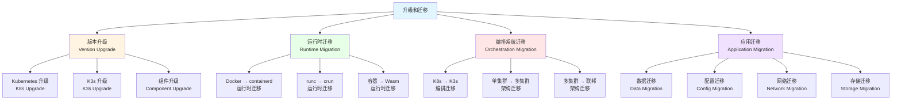
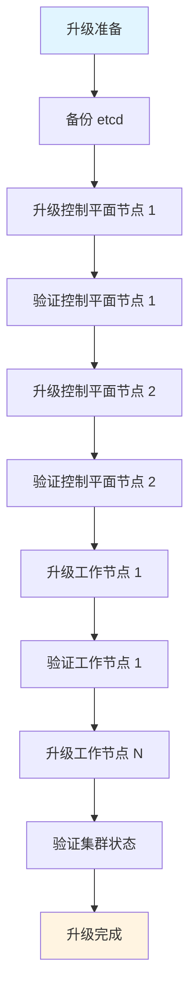

# 22. 升级和迁移：全面梳理

## 📑 目录

- [📑 目录](#-目录)
- [22.1 文档定位](#221-文档定位)
- [22.2 升级和迁移技术栈全景](#222-升级和迁移技术栈全景)
  - [22.2.1 升级和迁移分类](#2221-升级和迁移分类)
  - [22.2.2 技术组件矩阵](#2222-技术组件矩阵)
  - [22.2.3 技术栈组合](#2223-技术栈组合)
- [22.3 Kubernetes 版本升级技术规格](#223-kubernetes-版本升级技术规格)
  - [22.3.1 升级策略](#2231-升级策略)
  - [22.3.2 滚动升级规格](#2232-滚动升级规格)
  - [22.3.3 升级前准备](#2233-升级前准备)
  - [22.3.4 升级流程](#2234-升级流程)
  - [22.3.5 升级后验证](#2235-升级后验证)
  - [22.3.6 升级回滚](#2236-升级回滚)
- [22.4 K3s 版本升级技术规格](#224-k3s-版本升级技术规格)
  - [22.4.1 升级策略](#2241-升级策略)
  - [22.4.2 升级流程](#2242-升级流程)
  - [22.4.3 升级前准备](#2243-升级前准备)
  - [22.4.4 升级后验证](#2244-升级后验证)
- [22.5 运行时迁移技术规格](#225-运行时迁移技术规格)
  - [22.5.1 Docker 到 containerd 迁移](#2251-docker-到-containerd-迁移)
  - [22.5.2 runc 到 crun 迁移](#2252-runc-到-crun-迁移)
  - [22.5.3 传统容器到 Wasm 迁移](#2253-传统容器到-wasm-迁移)
  - [22.5.4 运行时迁移策略](#2254-运行时迁移策略)
- [22.6 编排系统迁移技术规格](#226-编排系统迁移技术规格)
  - [22.6.1 Kubernetes 到 K3s 迁移](#2261-kubernetes-到-k3s-迁移)
  - [22.6.2 单集群到多集群迁移](#2262-单集群到多集群迁移)
  - [22.6.3 多集群到联邦迁移](#2263-多集群到联邦迁移)
  - [22.6.4 编排系统迁移策略](#2264-编排系统迁移策略)
- [22.7 应用迁移技术规格](#227-应用迁移技术规格)
  - [22.7.1 应用迁移策略](#2271-应用迁移策略)
  - [22.7.2 数据迁移](#2272-数据迁移)
  - [22.7.3 配置迁移](#2273-配置迁移)
  - [22.7.4 网络迁移](#2274-网络迁移)
  - [22.7.5 存储迁移](#2275-存储迁移)
- [22.8 迁移工具技术规格](#228-迁移工具技术规格)
  - [22.8.1 Velero 规格](#2281-velero-规格)
  - [22.8.2 Kompose 规格](#2282-kompose-规格)
  - [22.8.3 Crane 规格](#2283-crane-规格)
  - [22.8.4 迁移工具对比](#2284-迁移工具对比)
- [22.9 升级和迁移技术栈组合方案](#229-升级和迁移技术栈组合方案)
  - [22.9.1 小规模集群组合](#2291-小规模集群组合)
  - [22.9.2 大规模集群组合](#2292-大规模集群组合)
  - [22.9.3 多集群组合](#2293-多集群组合)
  - [22.9.4 边缘计算组合](#2294-边缘计算组合)
- [22.10 备份和恢复技术规格](#2210-备份和恢复技术规格)
  - [22.10.1 etcd 备份和恢复](#22101-etcd-备份和恢复)
  - [22.10.2 应用数据备份和恢复](#22102-应用数据备份和恢复)
  - [22.10.3 灾难恢复计划](#22103-灾难恢复计划)
  - [22.10.4 备份工具和最佳实践](#22104-备份工具和最佳实践)
- [22.11 升级和迁移最佳实践](#2211-升级和迁移最佳实践)
  - [22.11.1 升级前检查清单](#22111-升级前检查清单)
  - [22.11.2 迁移前规划](#22112-迁移前规划)
  - [22.11.3 升级和迁移流程](#22113-升级和迁移流程)
  - [22.11.4 风险控制和回滚](#22114-风险控制和回滚)
- [22.12 实际迁移案例](#2212-实际迁移案例)
  - [22.12.1 案例 1：K3s 从 1.28 升级到 1.30（零停机）](#22121-案例-1k3s-从-128-升级到-130零停机)
  - [22.12.2 案例 2：从 Docker 迁移到 containerd](#22122-案例-2从-docker-迁移到-containerd)
  - [22.12.3 案例 3：传统容器迁移到 Wasm（渐进式）](#22123-案例-3传统容器迁移到-wasm渐进式)
  - [22.12.4 案例 4：Velero 备份和恢复](#22124-案例-4velero-备份和恢复)
  - [22.12.5 案例 5：单集群迁移到多集群（Karmada）](#22125-案例-5单集群迁移到多集群karmada)
- [22.13 升级和迁移故障排查](#2213-升级和迁移故障排查)
  - [22.13.1 升级常见问题](#22131-升级常见问题)
  - [22.13.2 迁移常见问题](#22132-迁移常见问题)
- [22.14 参考](#2214-参考)

---

## 22.1 文档定位

本文档全面梳理云原生容器技术栈中的升级和迁移技术、规格和最佳实践，包括
Kubernetes 版本升级、K3s 版本升级、运行时迁移、编排系统迁移、应用迁移等技术。

**文档结构**：

- **升级和迁移技术栈全景**：升级和迁移分类、技术组件矩阵、技术栈组合
- **Kubernetes 版本升级技术规格**：升级策略、滚动升级、升级流程、升级后验证、回
  滚
- **K3s 版本升级技术规格**：升级策略、升级流程、升级前准备、升级后验证
- **运行时迁移技术规格**：Docker 到 containerd、runc 到 crun、传统容器到 Wasm
- **编排系统迁移技术规格**：Kubernetes 到 K3s、单集群到多集群、多集群到联邦
- **应用迁移技术规格**：应用迁移策略、数据迁移、配置迁移、网络迁移、存储迁移
- **迁移工具技术规格**：Velero、Kompose、Crane 等迁移工具
- **升级和迁移技术栈组合方案**：不同场景的升级和迁移技术栈组合
- **升级和迁移最佳实践**：升级前检查清单、迁移前规划、升级和迁移流程、风险控制

## 22.2 升级和迁移技术栈全景

### 22.2.1 升级和迁移分类

**升级和迁移分类**：



**升级和迁移定义**：

| 类型             | 定义                     | 典型场景               | 难度       |
| ---------------- | ------------------------ | ---------------------- | ---------- |
| **版本升级**     | 同类型组件的版本更新     | Kubernetes 1.29 → 1.30 | ⭐⭐⭐     |
| **运行时迁移**   | 容器运行时的切换         | Docker → containerd    | ⭐⭐⭐⭐   |
| **编排系统迁移** | 编排系统的切换           | Kubernetes → K3s       | ⭐⭐⭐⭐⭐ |
| **应用迁移**     | 应用的跨集群或跨环境迁移 | 集群间迁移、云迁移     | ⭐⭐⭐⭐⭐ |

### 22.2.2 技术组件矩阵

**升级和迁移技术组件矩阵**：

| 组件类别     | 技术      | 定位                  | 成熟度     | 生产验证   |
| ------------ | --------- | --------------------- | ---------- | ---------- |
| **升级工具** | kubeadm   | Kubernetes 升级工具   | ⭐⭐⭐⭐⭐ | ⭐⭐⭐⭐⭐ |
|              | K3s 升级  | K3s 内置升级          | ⭐⭐⭐⭐⭐ | ⭐⭐⭐⭐⭐ |
| **迁移工具** | Velero    | Kubernetes 备份恢复   | ⭐⭐⭐⭐⭐ | ⭐⭐⭐⭐⭐ |
|              | Kompose   | Docker Compose 迁移   | ⭐⭐⭐⭐   | ⭐⭐⭐⭐   |
|              | Crane     | Google 迁移工具       | ⭐⭐⭐     | ⭐⭐⭐     |
| **备份工具** | etcd 备份 | etcd 数据备份         | ⭐⭐⭐⭐⭐ | ⭐⭐⭐⭐⭐ |
|              | Velero    | Kubernetes 资源备份   | ⭐⭐⭐⭐⭐ | ⭐⭐⭐⭐⭐ |
| **验证工具** | Sonobuoy  | Kubernetes 一致性测试 | ⭐⭐⭐⭐   | ⭐⭐⭐⭐   |
|              | kubectl   | Kubernetes 管理工具   | ⭐⭐⭐⭐⭐ | ⭐⭐⭐⭐⭐ |

### 22.2.3 技术栈组合

**升级和迁移技术栈组合方案**：

| 场景           | 升级工具 | 迁移工具 | 备份工具 | 验证工具 | 特点               |
| -------------- | -------- | -------- | -------- | -------- | ------------------ |
| **小规模集群** | kubeadm  | Velero   | Velero   | kubectl  | 简单易用、手动操作 |
| **大规模集群** | kubeadm  | Velero   | Velero   | Sonobuoy | 自动化、可扩展     |
| **K3s 集群**   | K3s 内置 | Velero   | K3s 备份 | kubectl  | 轻量级、快速升级   |
| **多集群**     | kubeadm  | Velero   | Velero   | Sonobuoy | 批量操作、统一管理 |

## 22.3 Kubernetes 版本升级技术规格

### 22.3.1 升级策略

**Kubernetes 版本升级策略**：

**升级路径**：

- ✅ **只能升级相邻版本**：1.29 → 1.30（不能跳版本）
- ✅ **支持向下兼容**：API 向下兼容
- ✅ **不支持降级**：升级后不能降级（需要重新安装）

**升级方式**：

| 方式         | 说明             | 适用场景         | 特点             |
| ------------ | ---------------- | ---------------- | ---------------- |
| **滚动升级** | 逐个节点升级     | 生产环境（推荐） | 零停机、风险分散 |
| **就地升级** | 在同一节点上升级 | 测试环境、单节点 | 快速但停机       |
| **集群替换** | 创建新集群迁移   | 大规模升级       | 风险隔离但成本高 |

**升级顺序**：

1. **etcd 升级**：先升级 etcd
2. **控制平面升级**：API Server、Controller Manager、Scheduler
3. **节点升级**：kubelet、kube-proxy
4. **组件升级**：CNI、CSI、CRI 插件

### 22.3.2 滚动升级规格

**滚动升级规格**：

**升级流程**：



**升级步骤**：

1. **备份 etcd**：备份集群状态
2. **升级控制平面**：逐个升级控制平面节点
3. **验证控制平面**：确保控制平面正常
4. **升级工作节点**：逐个升级工作节点（可批量）
5. **验证集群**：验证集群功能正常

### 22.3.3 升级前准备

**升级前准备检查清单**：

**集群状态检查**：

- ✅ 集群健康状态
- ✅ 所有 Pod 正常运行
- ✅ 存储和网络正常
- ✅ 备份完整性

**版本兼容性检查**：

- ✅ Kubernetes 版本兼容性
- ✅ API 版本兼容性
- ✅ CRD 版本兼容性
- ✅ 插件版本兼容性

**资源检查**：

- ✅ 控制平面资源充足
- ✅ 工作节点资源充足
- ✅ 存储空间充足
- ✅ 网络带宽充足

**备份检查**：

- ✅ etcd 备份
- ✅ 应用数据备份
- ✅ 配置文件备份
- ✅ 恢复计划准备

**升级前检查命令**：

```bash
# 检查集群状态
kubectl get nodes
kubectl get pods --all-namespaces

# 检查版本
kubectl version

# 检查 API 资源
kubectl api-resources

# 检查 CRD
kubectl get crd

# 备份 etcd
ETCDCTL_API=3 etcdctl snapshot save /backup/etcd-snapshot.db \
  --endpoints=https://127.0.0.1:2379 \
  --cacert=/etc/etcd/ca.crt \
  --cert=/etc/etcd/etcd.crt \
  --key=/etc/etcd/etcd.key
```

### 22.3.4 升级流程

**Kubernetes 升级流程**：

**使用 kubeadm 升级**：

**控制平面节点升级**：

```bash
# 1. 升级 kubeadm
apt-mark unhold kubeadm
apt-get update && apt-get install -y kubeadm=1.30.x-*
apt-mark hold kubeadm

# 2. 检查升级计划
kubeadm upgrade plan

# 3. 升级控制平面
kubeadm upgrade apply v1.30.x

# 4. 升级 kubelet 和 kubectl
apt-mark unhold kubelet kubectl
apt-get update && apt-get install -y kubelet=1.30.x-* kubectl=1.30.x-*
apt-mark hold kubelet kubectl

# 5. 重启 kubelet
systemctl daemon-reload
systemctl restart kubelet

# 6. 验证节点状态
kubectl get nodes
```

**工作节点升级**：

```bash
# 1. 驱逐节点上的 Pod（可选）
kubectl drain <node-name> --ignore-daemonsets

# 2. 升级 kubeadm
apt-mark unhold kubeadm
apt-get update && apt-get install -y kubeadm=1.30.x-*
apt-mark hold kubeadm

# 3. 升级节点配置
kubeadm upgrade node

# 4. 升级 kubelet 和 kubectl
apt-mark unhold kubelet kubectl
apt-get update && apt-get install -y kubelet=1.30.x-* kubectl=1.30.x-*
apt-mark hold kubelet kubectl

# 5. 重启 kubelet
systemctl daemon-reload
systemctl restart kubelet

# 6. 恢复节点
kubectl uncordon <node-name>

# 7. 验证节点状态
kubectl get nodes
```

### 22.3.5 升级后验证

**升级后验证检查清单**：

**集群功能验证**：

- ✅ 所有节点 Ready
- ✅ 所有系统 Pod 运行正常
- ✅ API Server 响应正常
- ✅ 调度器正常工作
- ✅ Controller Manager 正常工作

**应用功能验证**：

- ✅ 应用 Pod 运行正常
- ✅ Service 正常访问
- ✅ Ingress 正常路由
- ✅ 存储正常挂载
- ✅ 网络策略正常

**验证命令**：

```bash
# 检查节点状态
kubectl get nodes

# 检查系统 Pod
kubectl get pods --all-namespaces

# 检查 API 版本
kubectl version

# 检查 API 资源
kubectl api-resources

# 检查 CRD
kubectl get crd

# 运行一致性测试（可选）
sonobuoy run --wait
```

### 22.3.6 升级回滚

**升级回滚策略**：

**回滚方式**：

- ⚠️ **Kubernetes 不支持直接降级**：不能直接降级到旧版本
- ✅ **回滚到备份**：使用 etcd 备份恢复
- ✅ **重建集群**：重新安装旧版本并恢复数据
- ✅ **应用回滚**：只回滚应用版本（不降级 K8s）

**etcd 恢复流程**：

```bash
# 1. 停止 API Server
systemctl stop kube-apiserver

# 2. 恢复 etcd 备份
ETCDCTL_API=3 etcdctl snapshot restore /backup/etcd-snapshot.db \
  --data-dir /var/lib/etcd-restored

# 3. 更新 etcd 配置
# 4. 重启 etcd
# 5. 重启 API Server
# 6. 验证集群状态
```

## 22.4 K3s 版本升级技术规格

### 22.4.1 升级策略

**K3s 版本升级策略**：

**升级特点**：

- ✅ **单二进制升级**：升级简单快速
- ✅ **零停机升级**：支持滚动升级
- ✅ **自动 manifest 应用**：自动应用更新

**升级方式**：

| 方式         | 说明             | 适用场景           | 特点               |
| ------------ | ---------------- | ------------------ | ------------------ |
| **脚本升级** | 使用安装脚本升级 | 大多数场景（推荐） | 简单快速、自动处理 |
| **手动升级** | 手动替换二进制   | 离线环境           | 灵活但需要手动操作 |
| **自动升级** | 使用系统服务升级 | 自动化环境         | 自动化但需要配置   |

### 22.4.2 升级流程

**K3s 升级流程**：

**Server 节点升级**：

```bash
# 1. 备份数据（可选）
# K3s 数据存储在 /var/lib/rancher/k3s

# 2. 下载新版本（如果需要）
curl -sfL https://get.k3s.io | INSTALL_K3S_VERSION=v1.30.4+k3s1 sh -

# 3. 升级（使用安装脚本）
curl -sfL https://get.k3s.io | INSTALL_K3S_VERSION=v1.30.4+k3s1 sh -

# 或者重启服务（如果已安装新版本）
systemctl restart k3s

# 4. 验证升级
k3s --version
kubectl version
```

**Agent 节点升级**：

```bash
# 1. 升级 Agent
curl -sfL https://get.k3s.io | INSTALL_K3S_VERSION=v1.30.4+k3s1 K3S_URL=https://server:6443 K3S_TOKEN=xxx sh -

# 或者重启服务
systemctl restart k3s-agent

# 2. 验证升级
k3s --version
```

### 22.4.3 升级前准备

**K3s 升级前准备**：

**检查清单**：

- ✅ 集群健康状态
- ✅ 所有 Pod 正常运行
- ✅ 备份数据（可选但推荐）
- ✅ 检查版本兼容性

**准备命令**：

```bash
# 检查集群状态
kubectl get nodes
kubectl get pods --all-namespaces

# 检查版本
k3s --version

# 备份数据（可选）
sudo tar -czf /backup/k3s-$(date +%Y%m%d).tar.gz /var/lib/rancher/k3s
```

### 22.4.4 升级后验证

**K3s 升级后验证**：

**验证检查清单**：

- ✅ 节点状态正常
- ✅ 系统 Pod 运行正常
- ✅ 应用 Pod 运行正常
- ✅ 网络和存储正常

**验证命令**：

```bash
# 检查版本
k3s --version
kubectl version

# 检查节点
kubectl get nodes

# 检查 Pod
kubectl get pods --all-namespaces
```

## 22.5 运行时迁移技术规格

### 22.5.1 Docker 到 containerd 迁移

**Docker 到 containerd 迁移规格**：

**迁移背景**：

- ✅ Kubernetes 1.24+ 移除 docker-shim 支持
- ✅ containerd 是 Kubernetes 推荐的运行时
- ✅ 性能更好、资源占用更少

**迁移策略**：

**迁移流程**：

1. **安装 containerd**：在所有节点安装 containerd
2. **配置 containerd**：配置 containerd 作为 CRI
3. **迁移镜像**：将 Docker 镜像导入 containerd
4. **切换运行时**：更新 kubelet 配置
5. **验证迁移**：验证 Pod 正常运行
6. **清理 Docker**：卸载 Docker（可选）

**迁移步骤**：

```bash
# 1. 安装 containerd
apt-get update && apt-get install -y containerd.io

# 2. 配置 containerd
containerd config default | sudo tee /etc/containerd/config.toml
systemctl restart containerd

# 3. 导出 Docker 镜像
docker save <image> | ctr -n k8s.io images import -

# 或者使用脚本批量迁移
for image in $(docker images --format "{{.Repository}}:{{.Tag}}"); do
  docker save $image | ctr -n k8s.io images import -
done

# 4. 更新 kubelet 配置
# /var/lib/kubelet/config.yaml
runtimeRequestTimeout: 15m
containerRuntimeEndpoint: unix:///run/containerd/containerd.sock

# 5. 重启 kubelet
systemctl restart kubelet

# 6. 验证迁移
kubectl get nodes
kubectl describe node <node-name>
```

### 22.5.2 runc 到 crun 迁移

**runc 到 crun 迁移规格**：

**迁移背景**：

- ✅ crun 支持 Wasm
- ✅ crun 性能更好
- ✅ crun 自动识别容器类型

**迁移策略**：

**迁移流程**：

1. **安装 crun**：在所有节点安装 crun
2. **配置 containerd**：配置 containerd 使用 crun
3. **验证迁移**：验证容器正常运行

**迁移步骤**：

```bash
# 1. 安装 crun
apt-get update && apt-get install -y crun

# 2. 配置 containerd
# /etc/containerd/config.toml
[plugins."io.containerd.grpc.v1.cri".containerd.runtimes.runc]
  runtime_type = "io.containerd.runc.v2"
  [plugins."io.containerd.grpc.v1.cri".containerd.runtimes.runc.options]
    SystemdCgroup = true

[plugins."io.containerd.grpc.v1.cri".containerd.runtimes.crun]
  runtime_type = "io.containerd.runc.v2"
  [plugins."io.containerd.grpc.v1.cri".containerd.runtimes.crun.options]
    BinaryName = "crun"
    SystemdCgroup = true

# 3. 重启 containerd
systemctl restart containerd

# 4. 使用 RuntimeClass 指定 crun
apiVersion: node.k8s.io/v1
kind: RuntimeClass
metadata:
  name: crun
handler: crun
```

### 22.5.3 传统容器到 Wasm 迁移

**传统容器到 Wasm 迁移规格**：

**迁移背景**：

- ✅ Wasm 启动更快
- ✅ Wasm 资源占用更少
- ✅ Wasm 密度更高

**迁移策略**：

**迁移流程**：

1. **编译到 Wasm**：将应用编译到 WebAssembly
2. **配置 RuntimeClass**：配置 Wasm RuntimeClass
3. **更新 Deployment**：更新 Pod 使用 Wasm 运行时
4. **验证迁移**：验证应用正常运行

**迁移步骤**：

```bash
# 1. 编译到 Wasm（示例：Rust）
cargo build --target wasm32-wasi --release

# 2. 创建 Wasm 镜像
# 使用 wasm-to-oci 或其他工具

# 3. 配置 RuntimeClass
apiVersion: node.k8s.io/v1
kind: RuntimeClass
metadata:
  name: wasmedge
handler: wasmedge

# 4. 更新 Deployment
apiVersion: apps/v1
kind: Deployment
metadata:
  name: myapp
spec:
  template:
    spec:
      runtimeClassName: wasmedge
      containers:
      - name: app
        image: myapp:wasm
```

### 22.5.4 运行时迁移策略

**运行时迁移策略**：

**迁移方式**：

| 方式         | 说明           | 适用场景         | 特点             |
| ------------ | -------------- | ---------------- | ---------------- |
| **滚动迁移** | 逐个节点迁移   | 生产环境（推荐） | 零停机、风险分散 |
| **批量迁移** | 批量节点迁移   | 测试环境         | 快速但可能停机   |
| **蓝绿迁移** | 创建新环境迁移 | 大规模迁移       | 风险隔离但成本高 |

## 22.6 编排系统迁移技术规格

### 22.6.1 Kubernetes 到 K3s 迁移

**Kubernetes 到 K3s 迁移规格**：

**迁移背景**：

- ✅ K3s 资源占用更少
- ✅ K3s 部署更简单
- ✅ K3s 适合边缘场景

**迁移策略**：

**迁移流程**：

1. **评估兼容性**：检查 K3s 是否支持所需功能
2. **准备 K3s 集群**：安装和配置 K3s
3. **导出资源**：从 K8s 导出资源定义
4. **导入资源**：导入到 K3s 集群
5. **迁移数据**：迁移持久化数据
6. **切换流量**：切换到 K3s 集群
7. **验证迁移**：验证应用正常运行

**迁移步骤**：

```bash
# 1. 导出 Kubernetes 资源
kubectl get all --all-namespaces -o yaml > k8s-resources.yaml

# 2. 导出配置
kubectl get configmap,secret --all-namespaces -o yaml > k8s-configs.yaml

# 3. 导出存储
# 使用 Velero 或手动导出 PVC

# 4. 在 K3s 中导入资源
kubectl apply -f k8s-resources.yaml
kubectl apply -f k8s-configs.yaml

# 5. 迁移存储
# 使用 Velero 或手动迁移
```

### 22.6.2 单集群到多集群迁移

**单集群到多集群迁移规格**：

**迁移背景**：

- ✅ 高可用需求
- ✅ 地理分布需求
- ✅ 资源隔离需求

**迁移策略**：

**迁移流程**：

1. **规划多集群架构**：设计多集群架构
2. **创建新集群**：创建新的集群
3. **应用迁移**：迁移应用到新集群
4. **数据同步**：同步数据到新集群
5. **流量切换**：逐步切换流量
6. **验证迁移**：验证多集群运行正常

### 22.6.3 多集群到联邦迁移

**多集群到联邦迁移规格**：

**迁移背景**：

- ✅ 统一管理多集群
- ✅ 跨集群服务发现
- ✅ 跨集群调度

**迁移策略**：

**迁移流程**：

1. **安装集群联邦**：安装 Karmada 或 ClusterFederation
2. **注册集群**：将现有集群注册到联邦
3. **迁移应用**：迁移应用到联邦管理
4. **验证联邦**：验证联邦功能正常

### 22.6.4 编排系统迁移策略

**编排系统迁移策略**：

**迁移方式**：

| 方式         | 说明             | 适用场景           | 特点               |
| ------------ | ---------------- | ------------------ | ------------------ |
| **蓝绿迁移** | 创建新环境迁移   | 大规模迁移（推荐） | 风险隔离、快速回滚 |
| **滚动迁移** | 逐步迁移应用     | 小规模迁移         | 成本低但周期长     |
| **混合运行** | 新旧系统并行运行 | 过渡期             | 风险最小但成本高   |

## 22.7 应用迁移技术规格

### 22.7.1 应用迁移策略

**应用迁移策略规格**：

**迁移方式**：

| 方式         | 说明           | 适用场景         | 特点             |
| ------------ | -------------- | ---------------- | ---------------- |
| **导出导入** | 导出 YAML 导入 | 简单应用（推荐） | 简单快速         |
| **工具迁移** | 使用迁移工具   | 复杂应用         | 自动化但需要配置 |
| **重建应用** | 重新部署应用   | 可重构应用       | 灵活但工作量大   |

### 22.7.2 数据迁移

**数据迁移规格**：

**数据迁移策略**：

- ✅ **Volume 迁移**：使用 Velero 迁移 PV
- ✅ **数据库迁移**：使用数据库迁移工具
- ✅ **对象存储迁移**：使用对象存储同步工具
- ✅ **备份恢复**：备份后恢复到新环境

**Velero 数据迁移**：

```bash
# 1. 备份 PVC
velero backup create backup-name --include-resources pvc

# 2. 恢复 PVC
velero restore create restore-name --from-backup backup-name
```

### 22.7.3 配置迁移

**配置迁移规格**：

**配置迁移策略**：

- ✅ **ConfigMap 迁移**：导出导入 ConfigMap
- ✅ **Secret 迁移**：导出导入 Secret
- ✅ **RBAC 迁移**：导出导入 RBAC 资源
- ✅ **网络策略迁移**：导出导入 NetworkPolicy

**配置迁移命令**：

```bash
# 导出配置
kubectl get configmap,secret --all-namespaces -o yaml > configs.yaml

# 导入配置
kubectl apply -f configs.yaml
```

### 22.7.4 网络迁移

**网络迁移规格**：

**网络迁移策略**：

- ✅ **Service 迁移**：重新创建 Service
- ✅ **Ingress 迁移**：重新创建 Ingress
- ✅ **NetworkPolicy 迁移**：导出导入 NetworkPolicy
- ✅ **CNI 迁移**：更换 CNI 插件（需要重新部署）

### 22.7.5 存储迁移

**存储迁移规格**：

**存储迁移策略**：

- ✅ **PV 迁移**：使用 Velero 迁移 PV
- ✅ **StorageClass 迁移**：重新创建 StorageClass
- ✅ **数据同步**：使用存储同步工具
- ✅ **备份恢复**：备份后恢复

## 22.8 迁移工具技术规格

### 22.8.1 Velero 规格

**Velero 规格**：

**定义**：Velero 是 Kubernetes 的备份和恢复工具，支持集群迁移。

**技术特点**：

- ✅ 集群备份和恢复
- ✅ 跨集群迁移
- ✅ PV 备份和恢复
- ✅ 定时备份
- ✅ 插件系统

**版本信息**：

- **最新版本**：v1.12.0+（2024）
- **GitHub Stars**：8K+
- **生产验证**：✅ 大规模使用

**备份示例**：

```bash
# 备份整个命名空间
velero backup create backup-name --include-namespaces my-namespace

# 备份特定资源
velero backup create backup-name --include-resources deployments,services

# 恢复备份
velero restore create restore-name --from-backup backup-name
```

### 22.8.2 Kompose 规格

**Kompose 规格**：

**定义**：Kompose 是将 Docker Compose 转换为 Kubernetes 资源的工具。

**技术特点**：

- ✅ Docker Compose 到 Kubernetes 转换
- ✅ 支持多种 Kubernetes 资源
- ✅ 配置转换
- ✅ 简单易用

**版本信息**：

- **最新版本**：v1.32.0+（2024）
- **GitHub Stars**：4K+
- **生产验证**：✅ 中等规模使用

**使用示例**：

```bash
# 转换 Docker Compose
kompose convert

# 转换为特定资源类型
kompose convert --deployment
kompose convert --daemonset

# 应用到 Kubernetes
kompose up
```

### 22.8.3 Crane 规格

**Crane 规格**：

**定义**：Crane 是 Google 的容器镜像和集群迁移工具。

**技术特点**：

- ✅ 镜像迁移
- ✅ 集群迁移
- ✅ 多仓库支持
- ✅ 批量操作

**版本信息**：

- **最新版本**：v2.6.0+（2024）
- **GitHub Stars**：1K+
- **生产验证**：✅ 中等规模使用

### 22.8.4 迁移工具对比

**迁移工具对比矩阵**：

| 工具        | 定位                | 功能       | 易用性     | 成熟度     | 推荐场景            |
| ----------- | ------------------- | ---------- | ---------- | ---------- | ------------------- |
| **Velero**  | 备份恢复和迁移      | ⭐⭐⭐⭐⭐ | ⭐⭐⭐⭐   | ⭐⭐⭐⭐⭐ | 大多数场景          |
| **Kompose** | Docker Compose 转换 | ⭐⭐⭐⭐   | ⭐⭐⭐⭐⭐ | ⭐⭐⭐⭐   | Docker Compose 迁移 |
| **Crane**   | 镜像和集群迁移      | ⭐⭐⭐⭐   | ⭐⭐⭐     | ⭐⭐⭐     | Google 环境         |

## 22.9 升级和迁移技术栈组合方案

### 22.9.1 小规模集群组合

**小规模集群升级和迁移组合**：

**技术栈**：

- **升级工具**：kubeadm（K8s）或 K3s 内置（K3s）
- **迁移工具**：Velero
- **备份工具**：Velero + etcd 备份
- **验证工具**：kubectl

**特点**：

- ✅ 简单易用
- ✅ 手动操作
- ✅ 成本低

### 22.9.2 大规模集群组合

**大规模集群升级和迁移组合**：

**技术栈**：

- **升级工具**：kubeadm + 自动化脚本
- **迁移工具**：Velero
- **备份工具**：Velero + etcd 备份
- **验证工具**：Sonobuoy + kubectl

**特点**：

- ✅ 自动化操作
- ✅ 可扩展性强
- ✅ 完整验证

### 22.9.3 多集群组合

**多集群升级和迁移组合**：

**技术栈**：

- **升级工具**：kubeadm + 批量操作工具
- **迁移工具**：Velero + 多集群管理工具
- **备份工具**：Velero（多集群）
- **验证工具**：Sonobuoy + 多集群验证工具

**特点**：

- ✅ 批量操作
- ✅ 统一管理
- ✅ 完整验证

### 22.9.4 边缘计算组合

**边缘计算升级和迁移组合**：

**技术栈**：

- **升级工具**：K3s 内置升级
- **迁移工具**：Velero（简化版）
- **备份工具**：K3s 备份 + 边缘存储
- **验证工具**：kubectl

**特点**：

- ✅ 轻量级
- ✅ 离线支持
- ✅ 边缘优化

## 22.10 备份和恢复技术规格

### 22.10.1 etcd 备份和恢复

**etcd 备份定义**：

etcd 是 Kubernetes 的数据存储，备份 etcd 可以恢复整个集群状态。

**etcd 备份方式**：

| 方式         | 说明             | 适用场景         | 特点           |
| ------------ | ---------------- | ---------------- | -------------- |
| **快照备份** | etcdctl snapshot | 定期备份（推荐） | 快速、完整     |
| **完整备份** | etcdctl backup   | 迁移备份         | 完整但较慢     |
| **自动备份** | Velero + etcd    | 生产环境         | 自动化、可恢复 |

**etcd 快照备份配置示例**：

```bash
# 1. 备份 etcd（在控制平面节点执行）
ETCDCTL_API=3 etcdctl snapshot save /backup/etcd-snapshot-$(date +%Y%m%d).db \
  --endpoints=https://127.0.0.1:2379 \
  --cacert=/etc/kubernetes/pki/etcd/ca.crt \
  --cert=/etc/kubernetes/pki/etcd/server.crt \
  --key=/etc/kubernetes/pki/etcd/server.key

# 2. 验证备份
etcdctl snapshot status /backup/etcd-snapshot-20240101.db

# 3. 恢复 etcd（在停止 kube-apiserver 后执行）
ETCDCTL_API=3 etcdctl snapshot restore /backup/etcd-snapshot-20240101.db \
  --data-dir /var/lib/etcd-restored \
  --initial-cluster-token etcd-cluster-1 \
  --initial-advertise-peer-urls https://<control-plane-ip>:2380 \
  --initial-cluster <node1>=https://<control-plane-ip>:2380
```

**etcd 备份场景分析**：

**场景 1：定期备份**:

- **需求**：定期备份集群状态
- **方案**：使用 cron 任务定期执行 etcd 快照备份
- **频率**：每天或每周备份
- **保留**：保留最近 7-30 天的备份

**场景 2：升级前备份**:

- **需求**：升级前备份集群状态
- **方案**：升级前手动执行 etcd 快照备份
- **优点**：可快速回滚升级
- **缺点**：需要手动操作

**场景 3：灾难恢复备份**:

- **需求**：应对集群灾难性故障
- **方案**：结合 etcd 备份和 Velero 应用备份
- **优点**：完整恢复能力
- **缺点**：需要定期测试恢复

**etcd 备份最佳实践**：

1. **定期备份**：每天或每周备份一次
2. **异地存储**：备份存储到异地位置
3. **备份验证**：定期验证备份完整性
4. **恢复测试**：定期测试恢复流程
5. **加密存储**：敏感数据备份加密存储

### 22.10.2 应用数据备份和恢复

**应用数据备份定义**：

备份应用的数据卷（PV）和应用配置，用于应用迁移或恢复。

**应用数据备份方式**：

| 方式           | 工具       | 适用场景            | 特点                 |
| -------------- | ---------- | ------------------- | -------------------- |
| **Velero**     | Velero     | Kubernetes 资源备份 | 完整、自动化         |
| **存储快照**   | CSI 快照   | 存储级备份          | 快速、存储提供商支持 |
| **数据导出**   | kubectl cp | 小规模数据备份      | 简单但手动           |
| **应用级备份** | 应用工具   | 数据库等应用备份    | 应用感知、一致性保证 |

**Velero 备份配置示例**：

```bash
# 1. 安装 Velero
velero install \
  --provider aws \
  --plugins velero/velero-plugin-for-aws:v1.0.0 \
  --bucket my-backup-bucket \
  --secret-file ./credentials-velero

# 2. 备份命名空间
velero backup create my-backup --include-namespaces production

# 3. 备份特定资源
velero backup create my-backup \
  --include-resources deployments,services,pvc

# 4. 定时备份
velero schedule create daily-backup \
  --schedule="0 2 * * *" \
  --include-namespaces production

# 5. 恢复备份
velero restore create my-restore --from-backup my-backup
```

**应用数据备份场景分析**：

**场景 1：定期应用备份**:

- **需求**：定期备份生产环境应用
- **方案**：使用 Velero 定时备份
- **频率**：每天凌晨备份
- **保留**：保留最近 30 天备份

**场景 2：迁移前备份**:

- **需求**：迁移应用前备份数据
- **方案**：使用 Velero 或 CSI 快照
- **优点**：可快速恢复
- **缺点**：可能需要停机

**场景 3：数据库备份**:

- **需求**：数据库一致性备份
- **方案**：使用数据库工具（mysqldump、pg_dump）或 Velero
- **优点**：保证数据一致性
- **缺点**：可能需要应用暂停

**应用数据备份最佳实践**：

1. **定期备份**：根据 RPO（恢复点目标）设置备份频率
2. **增量备份**：结合全量和增量备份减少备份时间
3. **异地存储**：备份存储到异地位置
4. **加密存储**：敏感数据备份加密
5. **恢复测试**：定期测试恢复流程

### 22.10.3 灾难恢复计划

**灾难恢复计划定义**：

制定完整的灾难恢复流程，包括备份策略、恢复流程、恢复时间目标（RTO）和恢复点目标
（RPO）。

**灾难恢复计划要素**：

| 要素         | 说明               | 目标值               |
| ------------ | ------------------ | -------------------- |
| **RTO**      | 恢复时间目标       | < 4 小时（关键业务） |
| **RPO**      | 恢复点目标         | < 1 小时（关键业务） |
| **备份策略** | 备份频率和保留策略 | 每天备份，保留 30 天 |
| **恢复流程** | 详细的恢复步骤     | 文档化、可执行       |
| **恢复测试** | 定期恢复测试       | 每季度测试一次       |

**灾难恢复场景**：

**场景 1：etcd 数据损坏**:

- **影响**：集群无法正常工作
- **恢复流程**：
  1. 停止 kube-apiserver
  2. 恢复 etcd 快照
  3. 重启 kube-apiserver
  4. 验证集群状态
- **RTO**：< 2 小时

**场景 2：节点故障**:

- **影响**：应用不可用
- **恢复流程**：
  1. 修复或替换故障节点
  2. 重新加入集群
  3. 应用自动重新调度
- **RTO**：< 1 小时

**场景 3：应用数据丢失**:

- **影响**：应用数据不可用
- **恢复流程**：
  1. 从 Velero 备份恢复
  2. 验证应用状态
  3. 恢复服务流量
- **RTO**：< 4 小时

**灾难恢复计划最佳实践**：

1. **文档化**：详细的恢复流程文档
2. **自动化**：尽可能自动化恢复流程
3. **定期测试**：每季度测试一次恢复流程
4. **异地备份**：备份存储到异地位置
5. **监控告警**：监控备份和恢复状态

### 22.10.4 备份工具和最佳实践

**备份工具对比**：

| 工具           | 定位            | 功能       | 易用性     | 成熟度     | 推荐场景           |
| -------------- | --------------- | ---------- | ---------- | ---------- | ------------------ |
| **Velero**     | Kubernetes 备份 | ⭐⭐⭐⭐⭐ | ⭐⭐⭐⭐   | ⭐⭐⭐⭐⭐ | 大多数场景（推荐） |
| **etcdctl**    | etcd 备份       | ⭐⭐⭐⭐   | ⭐⭐⭐     | ⭐⭐⭐⭐⭐ | etcd 专用备份      |
| **CSI 快照**   | 存储级备份      | ⭐⭐⭐⭐   | ⭐⭐⭐⭐⭐ | ⭐⭐⭐⭐   | 存储提供商支持     |
| **kubectl cp** | 手动备份        | ⭐⭐⭐     | ⭐⭐⭐⭐⭐ | ⭐⭐⭐⭐⭐ | 小规模临时备份     |

**备份最佳实践**：

1. **3-2-1 备份策略**：

   - 3 份备份
   - 2 种不同介质
   - 1 份异地存储

2. **备份验证**：

   - 定期验证备份完整性
   - 定期测试恢复流程

3. **备份加密**：

   - 敏感数据备份加密
   - 使用加密存储

4. **备份监控**：

   - 监控备份任务状态
   - 告警备份失败

5. **备份保留策略**：
   - 根据合规要求设置保留时间
   - 定期清理过期备份

**恢复最佳实践**：

1. **恢复前验证**：验证备份完整性和可用性
2. **恢复流程文档**：详细的恢复步骤文档
3. **恢复测试环境**：在测试环境先测试恢复
4. **恢复后验证**：恢复后验证应用功能
5. **恢复演练**：定期进行灾难恢复演练

## 22.11 升级和迁移最佳实践

### 22.11.1 升级前检查清单

**升级前检查清单**：

**集群健康检查**：

- ✅ 所有节点 Ready
- ✅ 所有系统 Pod 运行正常
- ✅ 所有应用 Pod 运行正常
- ✅ 存储和网络正常
- ✅ 无告警和错误

**版本兼容性检查**：

- ✅ Kubernetes 版本兼容性
- ✅ API 版本兼容性
- ✅ CRD 版本兼容性
- ✅ 插件版本兼容性
- ✅ 应用版本兼容性

**资源检查**：

- ✅ 控制平面资源充足（CPU、内存、存储）
- ✅ 工作节点资源充足
- ✅ 存储空间充足（至少 2 倍空间）
- ✅ 网络带宽充足

**备份检查**：

- ✅ etcd 备份（最近备份）
- ✅ 应用数据备份
- ✅ 配置文件备份
- ✅ 恢复计划准备
- ✅ 恢复测试通过

**升级计划**：

- ✅ 升级时间窗口确定
- ✅ 升级流程文档化
- ✅ 回滚计划准备
- ✅ 应急联系人确认
- ✅ 升级通知发送

### 22.11.2 迁移前规划

**迁移前规划**：

**迁移规划**：

- ✅ **迁移范围**：确定迁移的应用和资源
- ✅ **迁移顺序**：确定迁移优先级和顺序
- ✅ **迁移时间**：确定迁移时间窗口
- ✅ **迁移方式**：确定迁移方式（蓝绿、滚动等）
- ✅ **验证标准**：确定验证标准

**风险评估**：

- ✅ 识别潜在风险
- ✅ 评估风险影响
- ✅ 制定风险缓解措施
- ✅ 准备应急计划

### 22.11.3 升级和迁移流程

**升级和迁移标准流程**：

**标准流程**：

1. **规划阶段**：制定升级/迁移计划
2. **准备阶段**：准备环境、备份、工具
3. **执行阶段**：执行升级/迁移操作
4. **验证阶段**：验证功能正常
5. **清理阶段**：清理临时资源
6. **总结阶段**：总结经验和问题

**流程模板**：

```yaml
升级/迁移流程:
  阶段: 规划
    任务:
      - 制定计划
      - 评估风险
      - 准备资源
  阶段: 准备
    任务:
      - 环境检查
      - 备份数据
      - 准备工具
  阶段: 执行
    任务:
      - 执行操作
      - 监控状态
      - 记录日志
  阶段: 验证
    任务:
      - 功能验证
      - 性能验证
      - 稳定性验证
  阶段: 清理
    任务:
      - 清理临时资源
      - 归档数据
  阶段: 总结
    任务:
      - 总结经验
      - 记录问题
      - 更新文档
```

### 22.11.4 风险控制和回滚

**风险控制和回滚策略**：

**风险控制**：

- ✅ **分阶段执行**：分阶段升级/迁移，降低风险
- ✅ **灰度验证**：先在小范围验证
- ✅ **监控告警**：实时监控和告警
- ✅ **快速回滚**：准备快速回滚方案

**回滚策略**：

- ✅ **数据回滚**：使用备份恢复数据
- ✅ **配置回滚**：恢复到旧版本配置
- ✅ **应用回滚**：回滚应用版本
- ✅ **集群回滚**：重建集群并恢复数据

**回滚检查清单**：

- ✅ 回滚计划文档化
- ✅ 回滚工具准备
- ✅ 回滚数据完整
- ✅ 回滚流程测试
- ✅ 回滚时间估算

## 22.12 实际迁移案例

### 22.12.1 案例 1：K3s 从 1.28 升级到 1.30（零停机）

**场景**：生产环境 K3s 集群需要从 1.28 升级到 1.30，包含 100+ 个 Pod

**升级步骤**：

```bash
# 1. 升级前检查
kubectl get nodes
kubectl get pods -A
kubectl top nodes

# 2. 备份 etcd
sudo k3s etcd-snapshot --name=pre-upgrade-backup

# 3. 升级主节点
# 在第一个主节点执行
curl -sfL https://get.k3s.io | INSTALL_K3S_VERSION=v1.30.4+k3s1 sh -

# 等待主节点就绪
kubectl wait --for=condition=ready node <master-node> --timeout=300s

# 4. 升级其他主节点（如果是多主）
curl -sfL https://get.k3s.io | \
  K3S_URL=https://<master-ip>:6443 \
  K3S_TOKEN=<token> \
  INSTALL_K3S_VERSION=v1.30.4+k3s1 sh -

# 5. 升级工作节点（逐个升级）
# 驱逐节点上的 Pod
kubectl drain <worker-node> --ignore-daemonsets --delete-emptydir-data

# 升级节点
curl -sfL https://get.k3s.io | \
  K3S_URL=https://<master-ip>:6443 \
  K3S_TOKEN=<token> \
  INSTALL_K3S_VERSION=v1.30.4+k3s1 sh -

# 取消驱逐
kubectl uncordon <worker-node>

# 6. 验证升级
kubectl get nodes
kubectl version
k3s --version
```

**升级后验证**：

```bash
# 检查集群状态
kubectl get nodes -o wide
kubectl get pods -A | grep -v Running

# 检查应用功能
kubectl get svc -A
curl http://<service-ip>:<port>

# 检查存储
kubectl get pv,pvc -A

# 检查网络
kubectl get networkpolicies -A
```

### 22.12.2 案例 2：从 Docker 迁移到 containerd

**场景**：K3s 集群需要从 Docker 运行时迁移到 containerd

**迁移步骤**：

```bash
# 1. 备份当前配置
sudo cp /etc/k3s/config.yaml /etc/k3s/config.yaml.backup

# 2. 停止 K3s
sudo systemctl stop k3s

# 3. 卸载 Docker（保留镜像数据）
sudo systemctl stop docker
sudo systemctl disable docker

# 4. 修改 K3s 配置使用 containerd
sudo mkdir -p /etc/rancher/k3s
sudo cat > /etc/rancher/k3s/config.yaml <<EOF
runtime-endpoint: unix:///run/containerd/containerd.sock
EOF

# 5. 启动 K3s（会自动使用 containerd）
sudo systemctl start k3s

# 6. 验证运行时
kubectl get nodes -o jsonpath='{.items[0].status.nodeInfo.containerRuntimeVersion}'
# 应该显示：containerd://<version>

# 7. 验证 Pod 运行
kubectl get pods -A
```

**迁移后清理**：

```bash
# 清理 Docker 残留（可选）
sudo apt-get remove docker-ce docker-ce-cli containerd.io
sudo rm -rf /var/lib/docker
```

### 22.12.3 案例 3：传统容器迁移到 Wasm（渐进式）

**场景**：将部分轻量应用从传统容器迁移到 Wasm，降低资源占用

**迁移步骤**：

```bash
# 1. 准备 Wasm 运行时
# 安装 WasmEdge 和 crun（参考安装文档）

# 2. 创建 RuntimeClass
kubectl apply -f - <<EOF
apiVersion: node.k8s.io/v1
kind: RuntimeClass
metadata:
  name: crun-wasm
handler: crun
EOF

# 3. 构建 Wasm 镜像
# 将应用编译为 Wasm 格式（如使用 Rust、Go 等）
wasmedgec myapp.wasm myapp.so

# 4. 创建 OCI 镜像
cat > Dockerfile <<EOF
FROM scratch
COPY myapp.wasm /myapp.wasm
ENTRYPOINT ["/myapp.wasm"]
EOF

docker build -t myregistry.com/myapp-wasm:v1.0.0 .
docker push myregistry.com/myapp-wasm:v1.0.0

# 5. 部署 Wasm Pod（与原容器并行）
kubectl apply -f - <<EOF
apiVersion: apps/v1
kind: Deployment
metadata:
  name: myapp-wasm
spec:
  replicas: 2
  selector:
    matchLabels:
      app: myapp-wasm
  template:
    metadata:
      labels:
        app: myapp-wasm
      annotations:
        module.wasm.image/variant: compat-smart
    spec:
      runtimeClassName: crun-wasm
      containers:
      - name: app
        image: myregistry.com/myapp-wasm:v1.0.0
        command: ["/myapp.wasm"]
        resources:
          requests:
            cpu: 10m
            memory: 10Mi
          limits:
            cpu: 100m
            memory: 50Mi
---
apiVersion: v1
kind: Service
metadata:
  name: myapp-wasm
spec:
  selector:
    app: myapp-wasm
  ports:
  - port: 8080
    targetPort: 8080
EOF

# 6. 流量切换（使用 Service Mesh 或 Ingress）
# 逐步将流量从传统容器切换到 Wasm Pod

# 7. 验证性能
kubectl top pods -l app=myapp-wasm
kubectl logs -l app=myapp-wasm

# 8. 逐步关闭传统容器
kubectl scale deployment myapp --replicas=0
```

### 22.12.4 案例 4：Velero 备份和恢复

**场景**：使用 Velero 备份整个命名空间并恢复到新集群

**备份步骤**：

```bash
# 1. 安装 Velero
velero install \
  --provider aws \
  --plugins velero/velero-plugin-for-aws:v1.8.0 \
  --bucket my-backup-bucket \
  --secret-file ./credentials-velero \
  --use-volume-snapshots=false

# 2. 备份命名空间
velero backup create myapp-backup-$(date +%Y%m%d) \
  --include-namespaces production \
  --wait

# 3. 验证备份
velero backup describe myapp-backup-$(date +%Y%m%d)
velero backup logs myapp-backup-$(date +%Y%m%d)
```

**恢复步骤**：

```bash
# 1. 在新集群安装 Velero（相同配置）
velero install \
  --provider aws \
  --plugins velero/velero-plugin-for-aws:v1.8.0 \
  --bucket my-backup-bucket \
  --secret-file ./credentials-velero \
  --use-volume-snapshots=false

# 2. 查看可用备份
velero backup get

# 3. 恢复备份
velero restore create myapp-restore-$(date +%Y%m%d) \
  --from-backup myapp-backup-20250101 \
  --wait

# 4. 验证恢复
velero restore describe myapp-restore-$(date +%Y%m%d)
kubectl get pods -n production
kubectl get svc -n production
```

### 22.12.5 案例 5：单集群迁移到多集群（Karmada）

**场景**：将单集群应用迁移到 Karmada 多集群联邦

**迁移步骤**：

```bash
# 1. 安装 Karmada
# 在主集群安装 Karmada（参考 Karmada 文档）

# 2. 注册成员集群
karmadactl join member-cluster \
  --karmada-context=karmada-apiserver \
  --cluster-kubeconfig=/path/to/member-cluster-kubeconfig

# 3. 创建 PropagationPolicy
kubectl apply -f - <<EOF
apiVersion: policy.karmada.io/v1alpha1
kind: PropagationPolicy
metadata:
  name: myapp-propagation
spec:
  resourceSelectors:
    - apiVersion: apps/v1
      kind: Deployment
      name: myapp
  placement:
    clusterAffinity:
      clusterNames:
        - member-cluster-1
        - member-cluster-2
    replicaScheduling:
      replicaDivisionPreference: Weighted
      replicaSchedulingType: Divided
      weightPreference:
        staticWeightList:
          - targetCluster:
              clusterNames:
                - member-cluster-1
            weight: 1
          - targetCluster:
              clusterNames:
                - member-cluster-2
            weight: 1
EOF

# 4. 创建应用（会自动分发到成员集群）
kubectl apply -f myapp-deployment.yaml

# 5. 验证分发
karmadactl get deployment myapp --karmada-context=karmada-apiserver
kubectl get deployment myapp -n <namespace> --context=member-cluster-1
kubectl get deployment myapp -n <namespace> --context=member-cluster-2
```

## 22.13 升级和迁移故障排查

### 22.13.1 升级常见问题

**问题 1：升级后 Pod 无法启动**:

```bash
# 检查 Pod 状态
kubectl describe pod <pod-name>

# 检查节点状态
kubectl describe node <node-name>

# 检查运行时
kubectl get nodes -o jsonpath='{.items[0].status.nodeInfo.containerRuntimeVersion}'

# 检查日志
journalctl -u k3s -f
```

**问题 2：API 版本不兼容**:

```bash
# 检查 API 版本
kubectl api-versions

# 检查资源版本
kubectl get <resource> -o yaml | grep apiVersion

# 使用 kubectl convert（已废弃）或手动更新 YAML
```

**问题 3：CRD 版本不兼容**:

```bash
# 检查 CRD 版本
kubectl get crd

# 更新 CRD
kubectl apply -f <crd-definition.yaml>

# 验证 CRD
kubectl get crd <crd-name> -o yaml
```

### 22.13.2 迁移常见问题

**问题 1：数据迁移失败**:

```bash
# 检查 PVC 状态
kubectl get pvc -A

# 检查 PV 状态
kubectl get pv

# 检查存储类
kubectl get storageclass

# 手动迁移数据
kubectl run data-migration --image=busybox --rm -it -- sh
# 在 Pod 中执行数据迁移命令
```

**问题 2：网络配置迁移失败**:

```bash
# 检查 Service
kubectl get svc -A

# 检查 Ingress
kubectl get ingress -A

# 检查 NetworkPolicy
kubectl get networkpolicies -A

# 检查 DNS
kubectl run test-dns --image=busybox --rm -it -- nslookup <service-name>
```

**问题 3：应用配置迁移失败**:

```bash
# 检查 ConfigMap
kubectl get configmap -A

# 检查 Secret
kubectl get secret -A

# 检查环境变量
kubectl exec <pod-name> -- env

# 对比配置
kubectl get configmap <name> -o yaml > old-config.yaml
kubectl get configmap <name> -n <new-namespace> -o yaml > new-config.yaml
diff old-config.yaml new-config.yaml
```

## 22.14 参考

- [Kubernetes 升级文档](https://kubernetes.io/docs/tasks/administer-cluster/kubeadm/kubeadm-upgrade/)
- [K3s 升级文档](https://docs.k3s.io/upgrades)
- [Velero 官方文档](https://velero.io/docs/)
- [Kompose 官方文档](https://kompose.io/)
- [etcd 备份恢复文档](https://etcd.io/docs/)

---

**最后更新**：2025-11-06 **维护者**：项目团队
