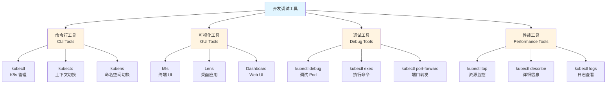

# 23. 开发和调试工具：全面梳理

## 📑 目录

- [📑 目录](#-目录)
- [23.1 文档定位](#231-文档定位)
- [23.2 开发调试工具全景](#232-开发调试工具全景)
  - [23.2.1 工具分类](#2321-工具分类)
  - [23.2.2 技术组件矩阵](#2322-技术组件矩阵)
  - [23.2.3 工具栈组合](#2323-工具栈组合)
- [23.3 kubectl 高级用法](#233-kubectl-高级用法)
  - [23.3.1 kubectl 基础命令](#2331-kubectl-基础命令)
  - [23.3.2 kubectl 高级命令](#2332-kubectl-高级命令)
  - [23.3.3 kubectl 调试技巧](#2333-kubectl-调试技巧)
- [23.4 可视化工具](#234-可视化工具)
  - [23.4.1 k9s](#2341-k9s)
  - [23.4.2 Lens](#2342-lens)
  - [23.4.3 Kubernetes Dashboard](#2343-kubernetes-dashboard)
- [23.5 上下文和命名空间工具](#235-上下文和命名空间工具)
  - [23.5.1 kubectx](#2351-kubectx)
  - [23.5.2 kubens](#2352-kubens)
- [23.6 容器调试工具](#236-容器调试工具)
  - [23.6.1 kubectl debug](#2361-kubectl-debug)
  - [23.6.2 kubectl exec](#2362-kubectl-exec)
  - [23.6.3 kubectl port-forward](#2363-kubectl-port-forward)
- [23.7 性能分析工具](#237-性能分析工具)
  - [23.7.1 kubectl top](#2371-kubectl-top)
  - [23.7.2 kubectl describe](#2372-kubectl-describe)
  - [23.7.3 kubectl logs](#2373-kubectl-logs)
- [23.8 开发和调试工具栈组合方案](#238-开发和调试工具栈组合方案)
  - [23.8.1 开发环境组合](#2381-开发环境组合)
  - [23.8.2 生产调试组合](#2382-生产调试组合)
  - [23.8.3 性能分析组合](#2383-性能分析组合)
- [23.9 开发和调试最佳实践](#239-开发和调试最佳实践)
  - [23.9.1 开发工作流](#2391-开发工作流)
  - [23.9.2 调试技巧](#2392-调试技巧)
  - [23.9.3 性能优化](#2393-性能优化)
- [23.10 实用技巧和脚本](#2310-实用技巧和脚本)
  - [23.10.1 kubectl 别名和函数](#23101-kubectl-别名和函数)
  - [23.10.2 实用调试脚本](#23102-实用调试脚本)
  - [23.10.3 高级调试技巧](#23103-高级调试技巧)
  - [23.10.4 性能分析工具组合](#23104-性能分析工具组合)
  - [23.10.5 工具组合最佳实践](#23105-工具组合最佳实践)
- [23.11 参考](#2311-参考)
  - [23.11.1 2025 年最新更新（2025-11-06）](#23111-2025-年最新更新2025-11-06)
  - [23.11.2 隔离栈相关文档](#23112-隔离栈相关文档)
  - [23.11.3 容器和运行时相关文档](#23113-容器和运行时相关文档)
  - [23.11.4 其他相关文档](#23114-其他相关文档)

---

## 23.1 文档定位

本文档全面梳理云原生容器技术栈中的开发和调试工具、规格和最佳实践，包括 kubectl
高级用法、可视化工具、容器调试工具、性能分析工具等技术。

**文档结构**：

- **开发调试工具全景**：工具分类、技术组件矩阵、工具栈组合
- **kubectl 高级用法**：基础命令、高级命令、调试技巧
- **可视化工具**：k9s、Lens、Kubernetes Dashboard
- **上下文和命名空间工具**：kubectx、kubens
- **容器调试工具**：kubectl debug、kubectl exec、kubectl port-forward
- **性能分析工具**：kubectl top、kubectl describe、kubectl logs
- **开发和调试工具栈组合方案**：不同场景的工具栈组合
- **开发和调试最佳实践**：开发工作流、调试技巧、性能优化

## 23.2 开发调试工具全景

### 23.2.1 工具分类

**开发调试工具分类**：



**工具分类定义**：

| 类型           | 定义                | 典型工具                          | 使用场景             |
| -------------- | ------------------- | --------------------------------- | -------------------- |
| **命令行工具** | CLI 命令行接口工具  | kubectl、kubectx、kubens          | 日常操作、自动化脚本 |
| **可视化工具** | GUI 图形界面工具    | k9s、Lens、Dashboard              | 可视化管理、快速查看 |
| **调试工具**   | 容器和 Pod 调试工具 | kubectl debug、exec、port-forward | 问题排查、开发调试   |
| **性能工具**   | 性能分析和监控工具  | kubectl top、describe、logs       | 性能分析、问题定位   |

### 23.2.2 技术组件矩阵

**开发调试工具技术组件矩阵**：

| 组件类别       | 技术                 | 定位                | 成熟度     | 生产验证   |
| -------------- | -------------------- | ------------------- | ---------- | ---------- |
| **命令行工具** | kubectl              | Kubernetes 官方 CLI | ⭐⭐⭐⭐⭐ | ⭐⭐⭐⭐⭐ |
|                | kubectx              | 上下文切换工具      | ⭐⭐⭐⭐⭐ | ⭐⭐⭐⭐   |
|                | kubens               | 命名空间切换工具    | ⭐⭐⭐⭐⭐ | ⭐⭐⭐⭐   |
|                | stern                | 日志聚合工具        | ⭐⭐⭐⭐   | ⭐⭐⭐⭐   |
| **可视化工具** | k9s                  | 终端 UI             | ⭐⭐⭐⭐⭐ | ⭐⭐⭐⭐⭐ |
|                | Lens                 | 桌面应用            | ⭐⭐⭐⭐⭐ | ⭐⭐⭐⭐⭐ |
|                | Kubernetes Dashboard | Web UI              | ⭐⭐⭐⭐   | ⭐⭐⭐⭐   |
|                | Octant               | 可视化工具          | ⭐⭐⭐     | ⭐⭐⭐     |
| **调试工具**   | kubectl debug        | Pod 调试工具        | ⭐⭐⭐⭐⭐ | ⭐⭐⭐⭐   |
|                | kubectl exec         | 容器命令执行        | ⭐⭐⭐⭐⭐ | ⭐⭐⭐⭐⭐ |
|                | kubectl port-forward | 端口转发            | ⭐⭐⭐⭐⭐ | ⭐⭐⭐⭐⭐ |
|                | Telepresence         | 本地调试远程服务    | ⭐⭐⭐⭐   | ⭐⭐⭐⭐   |
| **性能工具**   | kubectl top          | 资源使用监控        | ⭐⭐⭐⭐⭐ | ⭐⭐⭐⭐⭐ |
|                | kubectl describe     | 资源详细信息        | ⭐⭐⭐⭐⭐ | ⭐⭐⭐⭐⭐ |
|                | kubectl logs         | 日志查看            | ⭐⭐⭐⭐⭐ | ⭐⭐⭐⭐⭐ |

### 23.2.3 工具栈组合

**开发调试工具栈组合方案**：

| 场景         | 命令行工具 | 可视化工具 | 调试工具             | 性能工具         | 特点               |
| ------------ | ---------- | ---------- | -------------------- | ---------------- | ------------------ |
| **开发环境** | kubectl    | k9s        | kubectl debug        | kubectl top      | 轻量级、快速       |
| **生产调试** | kubectl    | Lens       | kubectl exec         | kubectl describe | 功能完整、可视化   |
| **性能分析** | kubectl    | k9s        | kubectl port-forward | kubectl top      | 实时监控、性能分析 |

## 23.3 kubectl 高级用法

### 23.3.1 kubectl 基础命令

**kubectl 基础命令**：

| 命令类别     | 命令         | 说明         | 示例                                 |
| ------------ | ------------ | ------------ | ------------------------------------ |
| **资源查询** | get          | 获取资源     | `kubectl get pods`                   |
|              | describe     | 资源详细信息 | `kubectl describe pod <name>`        |
|              | logs         | 查看日志     | `kubectl logs <pod>`                 |
| **资源操作** | create       | 创建资源     | `kubectl create -f pod.yaml`         |
|              | apply        | 应用配置     | `kubectl apply -f pod.yaml`          |
|              | delete       | 删除资源     | `kubectl delete pod <name>`          |
| **调试命令** | exec         | 执行命令     | `kubectl exec -it <pod> -- /bin/sh`  |
|              | port-forward | 端口转发     | `kubectl port-forward <pod> 8080:80` |
|              | debug        | 调试 Pod     | `kubectl debug <pod> -it`            |

### 23.3.2 kubectl 高级命令

**kubectl 高级命令**：

**1. 使用选择器查询**：

```bash
# 根据标签选择器查询
kubectl get pods -l app=nginx

# 根据字段选择器查询
kubectl get pods --field-selector status.phase=Running

# 组合选择器
kubectl get pods -l app=nginx --field-selector status.phase=Running
```

**2. 使用输出格式**：

```bash
# JSON 格式输出
kubectl get pods -o json

# YAML 格式输出
kubectl get pods -o yaml

# 自定义列输出
kubectl get pods -o custom-columns=NAME:.metadata.name,STATUS:.status.phase

# 表格输出（默认）
kubectl get pods -o wide
```

**3. 使用补丁更新**：

```bash
# JSON 补丁
kubectl patch pod <pod-name> -p '{"spec":{"containers":[{"name":"nginx","image":"nginx:1.21"}]}}'

# 策略合并补丁
kubectl patch deployment <deployment-name> --type merge -p '{"spec":{"replicas":3}}'

# 策略替换补丁
kubectl patch deployment <deployment-name> --type replace -p '{"spec":{"replicas":3}}'
```

**4. 使用批量操作**：

```bash
# 批量删除
kubectl delete pods -l app=nginx

# 批量应用
kubectl apply -f .

# 批量导出
kubectl get all -o yaml > all-resources.yaml
```

**5. 使用命令别名**：

```bash
# 设置别名
alias k=kubectl
alias kgp='kubectl get pods'
alias kdp='kubectl describe pod'

# 使用别名
k get pods
kgp -l app=nginx
```

### 23.3.3 kubectl 调试技巧

**kubectl 调试技巧**：

**1. 查看资源事件**：

```bash
# 查看 Pod 事件
kubectl describe pod <pod-name>

# 查看命名空间事件
kubectl get events -n <namespace>

# 实时查看事件
kubectl get events -n <namespace> --watch
```

**2. 查看资源状态**：

```bash
# 查看 Pod 状态
kubectl get pods -o wide

# 查看节点资源使用
kubectl top nodes

# 查看 Pod 资源使用
kubectl top pods
```

**3. 查看日志**：

```bash
# 查看 Pod 日志
kubectl logs <pod-name>

# 查看容器日志
kubectl logs <pod-name> -c <container-name>

# 实时查看日志
kubectl logs -f <pod-name>

# 查看最近日志
kubectl logs --tail=100 <pod-name>

# 查看时间范围日志
kubectl logs --since=1h <pod-name>
```

**4. 调试 Pod**：

```bash
# 进入容器执行命令
kubectl exec -it <pod-name> -- /bin/sh

# 在容器中执行命令
kubectl exec <pod-name> -- ls -la

# 调试 Pod（创建临时容器）
kubectl debug <pod-name> -it --image=busybox
```

## 23.4 可视化工具

### 23.4.1 k9s

**k9s 定义**：

k9s 是 Kubernetes 的终端 UI，提供交互式的集群管理和资源查看。

**k9s 特点**：

- **交互式终端**：终端中交互式操作
- **快速导航**：快捷键快速切换资源
- **实时更新**：资源状态实时更新
- **资源查看**：查看 Pod、Service、Deployment 等资源

**k9s 安装**：

```bash
# 使用 Homebrew 安装（macOS）
brew install k9s

# 使用 Scoop 安装（Windows）
scoop install k9s

# 下载二进制文件
wget https://github.com/derailed/k9s/releases/download/v0.27.4/k9s_Linux_amd64.tar.gz
tar -xzf k9s_Linux_amd64.tar.gz
sudo mv k9s /usr/local/bin/
```

**k9s 使用**：

```bash
# 启动 k9s
k9s

# 使用配置文件
k9s --context <context-name>

# 指定命名空间
k9s -n <namespace>
```

**k9s 快捷键**：

| 快捷键 | 功能     | 说明         |
| ------ | -------- | ------------ |
| `:`    | 命令模式 | 输入命令     |
| `/`    | 搜索     | 搜索资源     |
| `q`    | 退出     | 退出当前视图 |
| `d`    | 描述     | 查看详细信息 |
| `l`    | 日志     | 查看日志     |
| `s`    | Shell    | 进入 Shell   |
| `e`    | 编辑     | 编辑资源     |
| `d`    | 删除     | 删除资源     |

### 23.4.2 Lens

**Lens 定义**：

Lens 是 Kubernetes 的桌面应用，提供图形化的集群管理界面。

**Lens 特点**：

- **图形界面**：直观的图形界面
- **多集群管理**：支持多个集群管理
- **资源可视化**：资源的图形化展示
- **内置终端**：内置终端执行命令

**Lens 安装**：

- 下载：<https://k8slens.dev/>
- 支持 Windows、macOS、Linux

**Lens 功能**：

1. **集群管理**：添加和管理多个集群
2. **资源查看**：查看 Pod、Service、Deployment 等资源
3. **日志查看**：查看 Pod 日志
4. **终端访问**：在容器中执行命令
5. **资源编辑**：编辑资源配置

### 23.4.3 Kubernetes Dashboard

**Kubernetes Dashboard 定义**：

Kubernetes Dashboard 是 Kubernetes 的官方 Web UI，提供集群管理和资源查看。

**Dashboard 特点**：

- **Web 界面**：基于 Web 的界面
- **官方支持**：Kubernetes 官方维护
- **资源管理**：管理集群资源
- **需要部署**：需要部署到集群中

**Dashboard 安装**：

```bash
# 部署 Dashboard
kubectl apply -f https://raw.githubusercontent.com/kubernetes/dashboard/v2.7.0/aio/deploy/recommended.yaml

# 创建访问用户
kubectl create serviceaccount dashboard-admin -n kubernetes-dashboard
kubectl create clusterrolebinding dashboard-admin \
  --clusterrole=cluster-admin \
  --serviceaccount=kubernetes-dashboard:dashboard-admin

# 获取访问令牌
kubectl -n kubernetes-dashboard create token dashboard-admin

# 访问 Dashboard
kubectl proxy
# 访问 http://localhost:8001/api/v1/namespaces/kubernetes-dashboard/services/https:kubernetes-dashboard:/proxy/
```

## 23.5 上下文和命名空间工具

### 23.5.1 kubectx

**kubectx 定义**：

kubectx 是 Kubernetes 上下文切换工具，快速切换集群上下文。

**kubectx 安装**：

```bash
# 使用 Homebrew 安装
brew install kubectx

# 使用 apt 安装
sudo apt install kubectx

# 手动安装
git clone https://github.com/ahmetb/kubectx.git
sudo cp kubectx/kubectx /usr/local/bin/
```

**kubectx 使用**：

```bash
# 列出所有上下文
kubectx

# 切换到指定上下文
kubectx <context-name>

# 快速切换（交互式）
kubectx

# 查看当前上下文
kubectx -c
```

### 23.5.2 kubens

**kubens 定义**：

kubens 是 Kubernetes 命名空间切换工具，快速切换命名空间。

**kubens 安装**：

```bash
# 使用 Homebrew 安装（与 kubectx 一起）
brew install kubectx

# 手动安装
git clone https://github.com/ahmetb/kubectx.git
sudo cp kubectx/kubens /usr/local/bin/
```

**kubens 使用**：

```bash
# 列出所有命名空间
kubens

# 切换到指定命名空间
kubens <namespace-name>

# 快速切换（交互式）
kubens

# 查看当前命名空间
kubens -c
```

## 23.6 容器调试工具

### 23.6.1 kubectl debug

**kubectl debug 定义**：

kubectl debug 是 Kubernetes 的调试工具，用于在运行中的 Pod 中创建临时调试容器。

**kubectl debug 使用**：

```bash
# 在 Pod 中创建临时调试容器
kubectl debug <pod-name> -it --image=busybox

# 复制 Pod 创建调试副本
kubectl debug <pod-name> -it --copy-to=debug-pod --image=busybox

# 调试节点
kubectl debug node/<node-name> -it --image=busybox
```

**kubectl debug 场景**：

**场景 1：调试运行中的 Pod**:

- **需求**：在运行中的 Pod 中调试问题
- **方案**：使用 kubectl debug 创建临时调试容器
- **优点**：不中断原容器运行
- **缺点**：需要 Kubernetes 1.23+

**场景 2：调试无 Shell 的容器**:

- **需求**：调试没有 Shell 的容器（如 scratch 镜像）
- **方案**：使用 kubectl debug 创建包含调试工具的临时容器
- **优点**：可以调试任何容器
- **缺点**：需要临时容器支持

### 23.6.2 kubectl exec

**kubectl exec 定义**：

kubectl exec 用于在容器中执行命令。

**kubectl exec 使用**：

```bash
# 进入容器 Shell
kubectl exec -it <pod-name> -- /bin/sh

# 执行命令
kubectl exec <pod-name> -- ls -la

# 在指定容器中执行
kubectl exec -it <pod-name> -c <container-name> -- /bin/sh

# 执行多个命令
kubectl exec <pod-name> -- sh -c "cd /app && ls -la"
```

### 23.6.3 kubectl port-forward

**kubectl port-forward 定义**：

kubectl port-forward 用于将本地端口转发到 Pod 端口。

**kubectl port-forward 使用**：

```bash
# 转发 Pod 端口
kubectl port-forward <pod-name> 8080:80

# 转发 Service 端口
kubectl port-forward service/<service-name> 8080:80

# 转发 Deployment 端口
kubectl port-forward deployment/<deployment-name> 8080:80

# 后台运行
kubectl port-forward <pod-name> 8080:80 &

# 指定本地地址
kubectl port-forward <pod-name> 127.0.0.1:8080:80
```

**kubectl port-forward 场景**：

**场景 1：本地调试远程服务**:

- **需求**：在本地访问集群中的服务
- **方案**：使用 kubectl port-forward 转发端口
- **优点**：简单、无需修改配置
- **缺点**：需要保持端口转发连接

**场景 2：数据库访问**:

- **需求**：在本地访问集群中的数据库
- **方案**：使用 kubectl port-forward 转发数据库端口
- **优点**：安全、无需暴露服务
- **缺点**：连接可能不稳定

## 23.7 性能分析工具

### 23.7.1 kubectl top

**kubectl top 定义**：

kubectl top 用于查看节点和 Pod 的资源使用情况。

**kubectl top 使用**：

```bash
# 查看节点资源使用
kubectl top nodes

# 查看 Pod 资源使用
kubectl top pods

# 查看命名空间中 Pod 资源使用
kubectl top pods -n <namespace>

# 查看特定 Pod 资源使用
kubectl top pod <pod-name>

# 查看容器资源使用
kubectl top pods --containers
```

**kubectl top 前提条件**：

- 需要部署 metrics-server
- metrics-server 需要运行并可用

### 23.7.2 kubectl describe

**kubectl describe 定义**：

kubectl describe 用于查看资源的详细信息，包括状态、事件等。

**kubectl describe 使用**：

```bash
# 查看 Pod 详细信息
kubectl describe pod <pod-name>

# 查看节点详细信息
kubectl describe node <node-name>

# 查看 Service 详细信息
kubectl describe service <service-name>

# 查看 Deployment 详细信息
kubectl describe deployment <deployment-name>

# 查看命名空间所有资源
kubectl describe namespace <namespace>
```

### 23.7.3 kubectl logs

**kubectl logs 定义**：

kubectl logs 用于查看 Pod 和容器的日志。

**kubectl logs 高级用法**：

```bash
# 实时查看日志
kubectl logs -f <pod-name>

# 查看最近 100 行日志
kubectl logs --tail=100 <pod-name>

# 查看最近 1 小时的日志
kubectl logs --since=1h <pod-name>

# 查看指定时间范围日志
kubectl logs --since=2024-01-01T00:00:00Z --until=2024-01-02T00:00:00Z <pod-name>

# 查看前一个容器的日志（重启前）
kubectl logs --previous <pod-name>

# 在多个 Pod 中聚合日志
kubectl logs -l app=nginx
```

## 23.8 开发和调试工具栈组合方案

### 23.8.1 开发环境组合

**开发环境工具栈**：

| 工具类型     | 工具          | 用途           | 优点               |
| ------------ | ------------- | -------------- | ------------------ |
| **命令行**   | kubectl       | 基础操作       | 官方支持、功能完整 |
| **可视化**   | k9s           | 快速查看和管理 | 轻量级、快速       |
| **调试**     | kubectl debug | Pod 调试       | 官方支持、功能强大 |
| **上下文**   | kubectx       | 集群切换       | 快速切换           |
| **命名空间** | kubens        | 命名空间切换   | 快速切换           |

**特点**：

- ✅ 轻量级、快速响应
- ✅ 适合日常开发
- ✅ 命令行为主，可视化辅助

### 23.8.2 生产调试组合

**生产调试工具栈**：

| 工具类型   | 工具         | 用途       | 优点               |
| ---------- | ------------ | ---------- | ------------------ |
| **命令行** | kubectl      | 基础操作   | 官方支持、功能完整 |
| **可视化** | Lens         | 图形化管理 | 直观、功能完整     |
| **调试**   | kubectl exec | 容器调试   | 直接访问容器       |
| **日志**   | kubectl logs | 日志查看   | 官方支持           |
| **监控**   | kubectl top  | 资源监控   | 实时监控           |

**特点**：

- ✅ 功能完整、可视化强
- ✅ 适合生产环境调试
- ✅ 图形界面为主，命令行辅助

### 23.8.3 性能分析组合

**性能分析工具栈**：

| 工具类型   | 工具                 | 用途         | 优点             |
| ---------- | -------------------- | ------------ | ---------------- |
| **监控**   | kubectl top          | 资源使用监控 | 实时监控         |
| **分析**   | kubectl describe     | 资源详细信息 | 详细状态和事件   |
| **日志**   | kubectl logs         | 日志分析     | 问题定位         |
| **可视化** | k9s                  | 资源可视化   | 快速查看         |
| **转发**   | kubectl port-forward | 服务访问     | 本地访问远程服务 |

**特点**：

- ✅ 性能监控和分析
- ✅ 问题定位和排查
- ✅ 实时监控和日志分析

## 23.9 开发和调试最佳实践

### 23.9.1 开发工作流

**开发工作流**：

1. **资源查看**：使用 kubectl get 或 k9s 查看资源
2. **配置修改**：使用 kubectl edit 或 kubectl apply 修改配置
3. **调试验证**：使用 kubectl exec 或 kubectl debug 调试
4. **日志查看**：使用 kubectl logs 查看日志
5. **资源清理**：使用 kubectl delete 清理资源

**开发工作流示例**：

```yaml
开发工作流:
  步骤1: 资源查看
    工具: kubectl get / k9s
    目的: 了解当前资源状态
  步骤2: 配置修改
    工具: kubectl edit / kubectl apply
    目的: 修改资源配置
  步骤3: 调试验证
    工具: kubectl exec / kubectl debug
    目的: 验证配置和调试问题
  步骤4: 日志查看
    工具: kubectl logs
    目的: 查看应用日志
  步骤5: 资源清理
    工具: kubectl delete
    目的: 清理测试资源
```

### 23.9.2 调试技巧

**调试技巧**：

1. **使用 kubectl describe**：查看资源的详细状态和事件
2. **使用 kubectl logs**：查看应用日志定位问题
3. **使用 kubectl exec**：在容器中执行命令调试
4. **使用 kubectl debug**：创建临时调试容器
5. **使用 kubectl port-forward**：本地访问远程服务
6. **使用 k9s**：快速查看和管理资源

**调试技巧示例**：

```bash
# 1. 查看 Pod 状态和事件
kubectl describe pod <pod-name>

# 2. 查看应用日志
kubectl logs -f <pod-name>

# 3. 进入容器调试
kubectl exec -it <pod-name> -- /bin/sh

# 4. 创建调试容器
kubectl debug <pod-name> -it --image=busybox

# 5. 端口转发访问服务
kubectl port-forward <pod-name> 8080:80

# 6. 使用 k9s 快速查看
k9s
```

### 23.9.3 性能优化

**性能优化技巧**：

1. **使用 kubectl top**：监控资源使用情况
2. **使用 kubectl describe**：查看资源限制和请求
3. **使用 kubectl logs**：分析应用性能日志
4. **使用 k9s**：实时监控资源状态

**性能优化示例**：

```bash
# 1. 监控节点资源使用
kubectl top nodes

# 2. 监控 Pod 资源使用
kubectl top pods

# 3. 查看 Pod 资源限制
kubectl describe pod <pod-name> | grep -A 5 "Limits"

# 4. 分析应用日志
kubectl logs <pod-name> | grep -i "error\|warning\|slow"
```

## 23.10 实用技巧和脚本

### 23.10.1 kubectl 别名和函数

**常用 kubectl 别名**：

```bash
# 添加到 ~/.bashrc 或 ~/.zshrc
alias k='kubectl'
alias kg='kubectl get'
alias kd='kubectl describe'
alias ka='kubectl apply'
alias kd='kubectl delete'
alias kl='kubectl logs'
alias ke='kubectl exec -it'
alias kp='kubectl port-forward'
alias kgp='kubectl get pods'
alias kgs='kubectl get svc'
alias kgn='kubectl get nodes'
alias kdp='kubectl describe pod'
alias kds='kubectl describe svc'
alias kdn='kubectl describe node'
alias klf='kubectl logs -f'
alias kgpa='kubectl get pods --all-namespaces'
alias kga='kubectl get all'
alias kgaa='kubectl get all --all-namespaces'
```

**实用 kubectl 函数**：

```bash
# Pod 名称自动补全
function kp() {
    kubectl get pods | grep $1 | awk '{print $1}' | head -1
}

# 快速查看 Pod 日志
function klog() {
    kubectl logs -f $(kp $1)
}

# 快速进入 Pod
function kexec() {
    kubectl exec -it $(kp $1) -- /bin/sh
}

# 快速删除 Pod
function kdel() {
    kubectl delete pod $(kp $1)
}

# 快速查看 Pod 详细信息
function kdesc() {
    kubectl describe pod $(kp $1)
}

# 快速查看所有命名空间的资源
function kgall() {
    kubectl get $1 --all-namespaces
}

# 快速清理失败的 Pod
function kclean() {
    kubectl get pods --all-namespaces | grep -E 'Error|CrashLoopBackOff|Completed' | awk '{print $1, $2}' | xargs -n2 kubectl delete pod -n
}
```

### 23.10.2 实用调试脚本

**Pod 健康检查脚本**：

```bash
#!/bin/bash
# pod-health-check.sh

POD_NAME=$1
NAMESPACE=${2:-default}

if [ -z "$POD_NAME" ]; then
    echo "Usage: $0 <pod-name> [namespace]"
    exit 1
fi

echo "=== Pod Health Check: $POD_NAME ==="
echo ""

echo "1. Pod Status:"
kubectl get pod $POD_NAME -n $NAMESPACE
echo ""

echo "2. Pod Details:"
kubectl describe pod $POD_NAME -n $NAMESPACE | grep -A 10 "Status\|Events\|Conditions"
echo ""

echo "3. Pod Logs (last 50 lines):"
kubectl logs $POD_NAME -n $NAMESPACE --tail=50
echo ""

echo "4. Resource Usage:"
kubectl top pod $POD_NAME -n $NAMESPACE 2>/dev/null || echo "Metrics server not available"
echo ""

echo "5. Container Status:"
kubectl get pod $POD_NAME -n $NAMESPACE -o jsonpath='{.status.containerStatuses[*].name}' | tr ' ' '\n' | while read container; do
    echo "  Container: $container"
    kubectl get pod $POD_NAME -n $NAMESPACE -o jsonpath="{.status.containerStatuses[?(@.name=='$container')].ready}"
    echo ""
done
```

**快速资源清理脚本**：

```bash
#!/bin/bash
# cleanup-resources.sh

NAMESPACE=${1:-default}

echo "=== Cleaning up resources in namespace: $NAMESPACE ==="
echo ""

echo "1. Failed Pods:"
kubectl get pods -n $NAMESPACE | grep -E 'Error|CrashLoopBackOff|Completed' | awk '{print $1}' | while read pod; do
    echo "  Deleting pod: $pod"
    kubectl delete pod $pod -n $NAMESPACE
done
echo ""

echo "2. Old Completed Jobs:"
kubectl get jobs -n $NAMESPACE | grep -E 'Complete' | awk '{print $1}' | while read job; do
    echo "  Deleting job: $job"
    kubectl delete job $job -n $NAMESPACE
done
echo ""

echo "3. Unused PVCs:"
kubectl get pvc -n $NAMESPACE | grep -v Bound | awk '{print $1}' | while read pvc; do
    echo "  Deleting PVC: $pvc"
    kubectl delete pvc $pvc -n $NAMESPACE
done
echo ""

echo "Cleanup completed!"
```

**资源使用监控脚本**：

```bash
#!/bin/bash
# resource-monitor.sh

NAMESPACE=${1:-""}

echo "=== Resource Usage Monitor ==="
echo ""

if [ -z "$NAMESPACE" ]; then
    echo "Node Resources:"
    kubectl top nodes
    echo ""
    echo "Pod Resources (all namespaces):"
    kubectl top pods --all-namespaces | head -20
else
    echo "Pod Resources (namespace: $NAMESPACE):"
    kubectl top pods -n $NAMESPACE
fi

echo ""
echo "Resource Quotas:"
if [ -z "$NAMESPACE" ]; then
    kubectl get resourcequota --all-namespaces
else
    kubectl get resourcequota -n $NAMESPACE
fi
```

### 23.10.3 高级调试技巧

**多容器 Pod 调试**：

```bash
# 列出 Pod 中的所有容器
kubectl get pod <pod-name> -o jsonpath='{.spec.containers[*].name}'

# 进入特定容器
kubectl exec -it <pod-name> -c <container-name> -- /bin/sh

# 查看特定容器的日志
kubectl logs <pod-name> -c <container-name>

# 在容器中执行命令
kubectl exec <pod-name> -c <container-name> -- <command>
```

**网络调试技巧**：

```bash
# 检查 DNS 解析
kubectl run -it --rm debug --image=busybox --restart=Never -- nslookup <service-name>

# 测试网络连通性
kubectl run -it --rm debug --image=busybox --restart=Never -- ping <target-ip>

# 测试端口连通性
kubectl run -it --rm debug --image=busybox --restart=Never -- telnet <target-ip> <port>

# 使用 curl 测试 HTTP 服务
kubectl run -it --rm debug --image=curlimages/curl --restart=Never -- curl <url>
```

**事件监控脚本**：

```bash
#!/bin/bash
# watch-events.sh

NAMESPACE=${1:-""}

if [ -z "$NAMESPACE" ]; then
    watch -n 2 'kubectl get events --all-namespaces --sort-by='\''.lastTimestamp'\'' | tail -20'
else
    watch -n 2 "kubectl get events -n $NAMESPACE --sort-by='.lastTimestamp' | tail -20"
fi
```

### 23.10.4 性能分析工具组合

**完整的性能分析流程**：

```bash
#!/bin/bash
# performance-analysis.sh

POD_NAME=$1
NAMESPACE=${2:-default}

if [ -z "$POD_NAME" ]; then
    echo "Usage: $0 <pod-name> [namespace]"
    exit 1
fi

echo "=== Performance Analysis for Pod: $POD_NAME ==="
echo ""

echo "1. Resource Requests and Limits:"
kubectl get pod $POD_NAME -n $NAMESPACE -o jsonpath='{.spec.containers[*].resources}' | jq .
echo ""

echo "2. Current Resource Usage:"
kubectl top pod $POD_NAME -n $NAMESPACE
echo ""

echo "3. Pod Status:"
kubectl get pod $POD_NAME -n $NAMESPACE -o jsonpath='{.status}' | jq .
echo ""

echo "4. Container States:"
kubectl get pod $POD_NAME -n $NAMESPACE -o jsonpath='{.status.containerStatuses[*]}' | jq .
echo ""

echo "5. Recent Events:"
kubectl get events -n $NAMESPACE --field-selector involvedObject.name=$POD_NAME --sort-by='.lastTimestamp' | tail -10
echo ""

echo "6. Log Analysis (errors and warnings):"
kubectl logs $POD_NAME -n $NAMESPACE --tail=100 | grep -iE "error|warning|slow|timeout" | tail -20
```

### 23.10.5 工具组合最佳实践

**开发环境工具栈**：

```yaml
开发环境推荐工具栈:
  命令行工具:
    - kubectl (基础操作)
    - kubectx/kubens (上下文切换)
    - k9s (可视化管理)
  调试工具:
    - kubectl debug (临时调试容器)
    - kubectl exec (容器内执行命令)
    - kubectl port-forward (端口转发)
  监控工具:
    - kubectl top (资源监控)
    - kubectl logs (日志查看)
    - kubectl describe (详细信息)
```

**生产环境工具栈**：

```yaml
生产环境推荐工具栈:
  监控工具:
    - Prometheus + Grafana (指标监控)
    - kubectl top (命令行快速查看)
    - Lens (可视化监控)
  日志工具:
    - kubectl logs (快速查看)
    - Elasticsearch + Kibana (日志聚合)
    - Fluentd/Fluent Bit (日志收集)
  调试工具:
    - kubectl debug (临时调试容器)
    - kubectl exec (容器内执行命令)
    - 可观测性工具 (OTLP + eBPF)
```

## 23.11 参考

### 23.11.1 2025 年最新更新（2025-11-06）

- **[27. 2025 趋势 - 2025-11-06 最新更新](../27-2025-trends/2025-trends.md#2714-2025-年-11-月-6-日最新更新)** -
  技术版本更新、生产环境最佳实践、已知问题与解决方案
  - **OpenTelemetry 0.103.0**：OTLP 协议 v1.3.0 支持，新增 eBPF 自动注入
  - **可观测性改进**：OpenTelemetry Collector 自动注入 eBPF 探针
  - **调试工具**：OTLP + eBPF 联合调试，横向请求链 + 纵向隔离栈

**开发和调试工具最佳实践（2025-11-06）**：

- **可观测性工具**：使用 OTLP + eBPF 进行横纵耦合的问题定位
- **调试效率**：结合 OpenTelemetry Trace 和 eBPF 探针，快速定位问题
- **Wasm 调试**：WasmEdge 0.14+ 支持完整的调试工具链

### 23.11.2 隔离栈相关文档

- **[29. 隔离栈](../29-isolation-stack/isolation-stack.md)** - 完整的隔离栈技术
  解析，包括 L-3 容器化层、L-4 沙盒化层
- **[L-3 容器化层](../29-isolation-stack/layers/L-3-containerization.md)** -
  runc、containerd、Docker、Podman 详细文档，包含容器调试相关内容
- **[L-4 沙盒化层](../29-isolation-stack/layers/L-4-sandboxing.md)** -
  gVisor、Firecracker、WASM 详细文档，包含沙盒调试相关内容
- **[隔离层次对比文档](../29-isolation-stack/layers/isolation-comparison.md)** -
  快速对比和选型指南

### 23.11.3 容器和运行时相关文档

- **[00. Docker](../00-docker/docker.md)** - Docker 详细文档
- **[03. WasmEdge](../03-wasm-edge/wasmedge.md)** - WebAssembly 运行时详细文档
- **[01. Kubernetes](../01-kubernetes/kubernetes.md)** - Kubernetes 详细文档
- **[02. K3s](../02-k3s/k3s.md)** - K3s 详细文档

### 23.11.4 其他相关文档

- **[11. 故障排查](../11-troubleshooting/troubleshooting.md)** - 通用故障排查方
  法
- **[16. 监控与可观测性](../16-observability/observability.md)** -
  OpenTelemetry、eBPF 等技术

- [kubectl 官方文档](https://kubernetes.io/docs/reference/kubectl/)
- [k9s 官方文档](https://k9scli.io/)
- [Lens 官方文档](https://k8slens.dev/)
- [Kubernetes Dashboard 官方文档](https://kubernetes.io/docs/tasks/access/application-cluster/web-ui-dashboard/)
- [kubectx/kubens 官方文档](https://github.com/ahmetb/kubectx)
- [kubectl 别名和插件](https://kubernetes.io/docs/reference/kubectl/kubectl/)

---

> **使用指南**：
>
> - **快速开始**：查看 [23.3 kubectl 高级用法](#233-kubectl-高级用法)
> - **可视化工具**：查看 [23.4 可视化工具](#234-可视化工具)
> - **调试工具**：查看 [23.6 容器调试工具](#236-容器调试工具)
> - **性能分析**：查看 [23.7 性能分析工具](#237-性能分析工具)
> - **最佳实践**：查看 [23.9 开发和调试最佳实践](#239-开发和调试最佳实践)

---

**最后更新**：2025-11-06 **维护者**：项目团队
