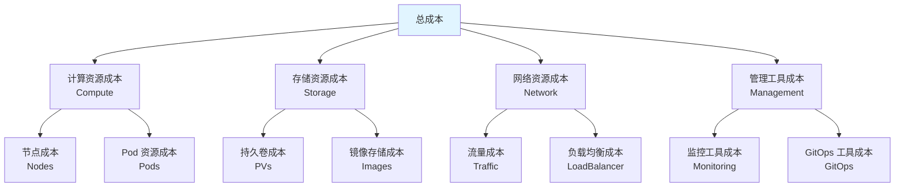

# 24. 成本优化：全面梳理

## 📑 目录

- [📑 目录](#-目录)
- [24.1 文档定位](#241-文档定位)
- [24.2 成本优化技术栈全景](#242-成本优化技术栈全景)
  - [24.2.1 成本构成分析](#2421-成本构成分析)
  - [24.2.2 技术组件矩阵](#2422-技术组件矩阵)
  - [24.2.3 优化策略组合](#2423-优化策略组合)
- [24.3 资源成本分析](#243-资源成本分析)
  - [24.3.1 计算资源成本](#2431-计算资源成本)
  - [24.3.2 存储资源成本](#2432-存储资源成本)
  - [24.3.3 网络资源成本](#2433-网络资源成本)
  - [24.3.4 成本监控工具](#2434-成本监控工具)
- [24.4 成本优化策略](#244-成本优化策略)
  - [24.4.1 资源利用率优化](#2441-资源利用率优化)
  - [24.4.2 自动扩缩容优化](#2442-自动扩缩容优化)
  - [24.4.3 存储优化](#2443-存储优化)
  - [24.4.4 网络优化](#2444-网络优化)
- [24.5 云资源成本对比](#245-云资源成本对比)
  - [24.5.1 云平台成本对比](#2451-云平台成本对比)
  - [24.5.2 资源类型成本对比](#2452-资源类型成本对比)
  - [24.5.3 成本优化方案](#2453-成本优化方案)
- [24.6 成本优化场景分析](#246-成本优化场景分析)
  - [24.6.1 小规模集群优化](#2461-小规模集群优化)
  - [24.6.2 大规模集群优化](#2462-大规模集群优化)
  - [24.6.3 边缘计算优化](#2463-边缘计算优化)
- [24.7 成本优化技术栈组合方案](#247-成本优化技术栈组合方案)
  - [24.7.1 云原生优化组合](#2471-云原生优化组合)
  - [24.7.2 边缘优化组合](#2472-边缘优化组合)
  - [24.7.3 混合优化组合](#2473-混合优化组合)
- [24.8 实际优化案例](#248-实际优化案例)
  - [24.8.1 案例 1：微服务架构资源优化](#2481-案例-1微服务架构资源优化)
  - [24.8.2 案例 2：镜像存储成本优化](#2482-案例-2镜像存储成本优化)
  - [24.8.3 案例 3：边缘节点资源优化](#2483-案例-3边缘节点资源优化)
  - [24.8.4 案例 4：网络流量成本优化](#2484-案例-4网络流量成本优化)
- [24.9 成本优化最佳实践](#249-成本优化最佳实践)
  - [24.9.1 资源规划](#2491-资源规划)
  - [24.9.2 监控和告警](#2492-监控和告警)
  - [24.9.3 持续优化](#2493-持续优化)
  - [24.9.4 成本优化检查清单](#2494-成本优化检查清单)
  - [24.9.5 成本优化 ROI 计算](#2495-成本优化-roi-计算)
- [24.10 参考](#2410-参考)

---

## 24.1 文档定位

本文档全面梳理云原生容器技术栈中的成本优化技术、策略和最佳实践，包括资源成本分析
、成本优化策略、云资源成本对比、资源利用率优化等技术。

**文档结构**：

- **成本优化技术栈全景**：成本构成分析、技术组件矩阵、优化策略组合
- **资源成本分析**：计算资源成本、存储资源成本、网络资源成本、成本监控工具
- **成本优化策略**：资源利用率优化、自动扩缩容优化、存储优化、网络优化
- **云资源成本对比**：云平台成本对比、资源类型成本对比、成本优化方案
- **成本优化场景分析**：小规模集群、大规模集群、边缘计算场景
- **成本优化技术栈组合方案**：不同场景的成本优化技术栈组合
- **成本优化最佳实践**：资源规划、监控和告警、持续优化

## 24.2 成本优化技术栈全景

### 24.2.1 成本构成分析

**容器技术栈成本构成**：



**成本构成定义**：

| 成本类型     | 说明                | 占比   | 优化潜力 |
| ------------ | ------------------- | ------ | -------- |
| **计算资源** | 节点和 Pod 资源     | 60-70% | 高       |
| **存储资源** | 持久卷和镜像存储    | 15-20% | 中       |
| **网络资源** | 流量和负载均衡      | 10-15% | 中       |
| **管理工具** | 监控、GitOps 等工具 | 5-10%  | 低       |

### 24.2.2 技术组件矩阵

**成本优化技术组件矩阵**：

| 组件类别     | 技术                    | 定位                | 成熟度     | 生产验证   |
| ------------ | ----------------------- | ------------------- | ---------- | ---------- |
| **成本监控** | Kubecost                | Kubernetes 成本监控 | ⭐⭐⭐⭐⭐ | ⭐⭐⭐⭐⭐ |
|              | OpenCost                | CNCF 成本规范       | ⭐⭐⭐⭐   | ⭐⭐⭐⭐   |
|              | CloudHealth             | 云成本管理          | ⭐⭐⭐⭐⭐ | ⭐⭐⭐⭐⭐ |
| **资源优化** | Vertical Pod Autoscaler | 垂直扩缩容          | ⭐⭐⭐⭐⭐ | ⭐⭐⭐⭐⭐ |
|              | Cluster Autoscaler      | 集群自动扩缩容      | ⭐⭐⭐⭐⭐ | ⭐⭐⭐⭐⭐ |
|              | Descheduler             | Pod 重新调度优化    | ⭐⭐⭐⭐   | ⭐⭐⭐⭐   |
| **存储优化** | 存储压缩                | 数据压缩优化        | ⭐⭐⭐⭐   | ⭐⭐⭐⭐   |
|              | 存储分层                | 热温冷数据分层      | ⭐⭐⭐⭐⭐ | ⭐⭐⭐⭐⭐ |
|              | 镜像优化                | 镜像大小优化        | ⭐⭐⭐⭐⭐ | ⭐⭐⭐⭐⭐ |

### 24.2.3 优化策略组合

**成本优化策略组合方案**：

| 场景           | 成本监控    | 资源优化     | 存储优化 | 网络优化 | 特点               |
| -------------- | ----------- | ------------ | -------- | -------- | ------------------ |
| **云原生优化** | Kubecost    | VPA + HPA    | 存储分层 | CDN      | 全方位优化         |
| **边缘优化**   | OpenCost    | 轻量级调度   | 本地存储 | 最小网络 | 资源节省、离线能力 |
| **混合优化**   | CloudHealth | 混合调度策略 | 混合存储 | 混合网络 | 灵活、多场景支持   |

## 24.3 资源成本分析

### 24.3.1 计算资源成本

**计算资源成本构成**：

| 资源类型 | 成本因素       | 优化方向                       |
| -------- | -------------- | ------------------------------ |
| **节点** | 节点类型、数量 | 选择合适的节点类型、按需扩缩容 |
| **CPU**  | CPU 请求和限制 | 合理设置资源请求和限制         |
| **内存** | 内存请求和限制 | 合理设置资源请求和限制         |
| **GPU**  | GPU 类型和数量 | GPU 共享、按需使用             |

**计算资源成本优化**：

1. **选择合适的节点类型**：

   - 根据工作负载选择合适的节点类型
   - 使用 Spot 实例（测试环境）
   - 使用预留实例（生产环境）

2. **资源请求优化**：

   - 合理设置资源请求和限制
   - 使用 VPA 自动调整资源请求
   - 监控实际资源使用情况

3. **集群自动扩缩容**：
   - 使用 Cluster Autoscaler 自动扩缩容
   - 根据负载动态调整节点数量
   - 在低负载时自动缩容

**计算资源成本优化示例**：

```yaml
# VPA - 垂直自动扩缩容
apiVersion: autoscaling.k8s.io/v1
kind: VerticalPodAutoscaler
metadata:
  name: myapp-vpa
spec:
  targetRef:
    apiVersion: apps/v1
    kind: Deployment
    name: myapp
  updatePolicy:
    updateMode: "Auto"
  resourcePolicy:
    containerPolicies:
      - containerName: myapp
        minAllowed:
          cpu: "100m"
          memory: "128Mi"
        maxAllowed:
          cpu: "2"
          memory: "2Gi"
```

### 24.3.2 存储资源成本

**存储资源成本构成**：

| 资源类型     | 成本因素           | 优化方向                         |
| ------------ | ------------------ | -------------------------------- |
| **持久卷**   | 存储类型、大小     | 选择合适的存储类型、按需调整大小 |
| **镜像存储** | 镜像大小、数量     | 优化镜像大小、清理无用镜像       |
| **备份存储** | 备份频率、保留时间 | 优化备份策略、定期清理           |

**存储资源成本优化**：

1. **存储类型选择**：

   - 根据性能需求选择合适的存储类型
   - 使用存储分层（热温冷）
   - 使用压缩存储（低性能需求）

2. **镜像优化**：

   - 使用多阶段构建减小镜像大小
   - 使用 distroless 或 scratch 基础镜像
   - 定期清理无用镜像

3. **备份策略优化**：
   - 优化备份频率和保留时间
   - 使用增量备份减少存储占用
   - 定期清理过期备份

### 24.3.3 网络资源成本

**网络资源成本构成**：

| 资源类型       | 成本因素          | 优化方向                        |
| -------------- | ----------------- | ------------------------------- |
| **流量成本**   | 数据传输量        | CDN 缓存、压缩传输              |
| **负载均衡**   | LoadBalancer 数量 | 共享 LoadBalancer、使用 Ingress |
| **跨区域流量** | 跨区域数据传输    | 优化流量路由、减少跨区域流量    |

**网络资源成本优化**：

1. **流量优化**：

   - 使用 CDN 缓存静态资源
   - 压缩数据传输
   - 优化应用减少数据传输

2. **负载均衡优化**：
   - 使用 Ingress 替代 LoadBalancer
   - 共享 LoadBalancer
   - 使用云厂商提供的负载均衡服务

### 24.3.4 成本监控工具

**成本监控工具对比**：

| 工具            | 定位                | 功能       | 易用性     | 成熟度     | 推荐场景                |
| --------------- | ------------------- | ---------- | ---------- | ---------- | ----------------------- |
| **Kubecost**    | Kubernetes 成本监控 | ⭐⭐⭐⭐⭐ | ⭐⭐⭐⭐⭐ | ⭐⭐⭐⭐⭐ | Kubernetes 环境（推荐） |
| **OpenCost**    | CNCF 成本规范       | ⭐⭐⭐⭐   | ⭐⭐⭐⭐   | ⭐⭐⭐⭐   | 开源环境                |
| **CloudHealth** | 云成本管理          | ⭐⭐⭐⭐⭐ | ⭐⭐⭐⭐⭐ | ⭐⭐⭐⭐⭐ | 多云环境                |
| **云厂商工具**  | 各云平台成本工具    | ⭐⭐⭐⭐⭐ | ⭐⭐⭐⭐⭐ | ⭐⭐⭐⭐⭐ | 单一云平台              |

**Kubecost 安装和配置**：

```bash
# 安装 Kubecost
helm repo add kubecost https://kubecost.github.io/cost-analyzer/
helm install kubecost kubecost/cost-analyzer \
  --namespace kubecost \
  --create-namespace

# 访问 Kubecost UI
kubectl port-forward -n kubecost svc/kubecost-cost-analyzer 9090:9090
# 访问 http://localhost:9090
```

## 24.4 成本优化策略

### 24.4.1 资源利用率优化

**资源利用率优化策略**：

1. **提高资源利用率**：

   - 监控资源使用情况
   - 合理设置资源请求
   - 使用 VPA 自动调整资源

2. **节点利用率优化**：

   - 使用 Descheduler 重新调度 Pod
   - 优化 Pod 分布提高节点利用率
   - 合并小节点减少节点数量

3. **Pod 密度优化**：
   - 提高 Pod 密度（在资源允许的情况下）
   - 使用资源限制防止资源争用
   - 监控 Pod 资源使用情况

**资源利用率优化配置**：

```yaml
# Descheduler - Pod 重新调度
apiVersion: descheduler.k8s.io/v1alpha1
kind: DeschedulerPolicy
metadata:
  name: descheduler-policy
spec:
  strategies:
    RemoveDuplicates:
      enabled: true
    LowNodeUtilization:
      enabled: true
      params:
        nodeResourceUtilizationThresholds:
          thresholds:
            cpu: 20
            memory: 20
            pods: 20
          targetThresholds:
            cpu: 50
            memory: 50
            pods: 50
```

### 24.4.2 自动扩缩容优化

**自动扩缩容优化策略**：

1. **水平扩缩容（HPA）**：

   - 根据 CPU、内存使用率自动扩缩容
   - 根据自定义指标扩缩容
   - 设置合理的扩缩容边界

2. **垂直扩缩容（VPA）**：

   - 自动调整 Pod 资源请求和限制
   - 根据实际使用情况优化资源分配
   - 避免资源浪费和不足

3. **集群自动扩缩容（CA）**：
   - 根据集群负载自动增减节点
   - 在低负载时自动缩容降低成本
   - 在高负载时自动扩容保证服务

**自动扩缩容配置示例**：

```yaml
# HPA - 水平自动扩缩容
apiVersion: autoscaling/v2
kind: HorizontalPodAutoscaler
metadata:
  name: myapp-hpa
spec:
  scaleTargetRef:
    apiVersion: apps/v1
    kind: Deployment
    name: myapp
  minReplicas: 2
  maxReplicas: 10
  metrics:
    - type: Resource
      resource:
        name: cpu
        target:
          type: Utilization
          averageUtilization: 70
    - type: Resource
      resource:
        name: memory
        target:
          type: Utilization
          averageUtilization: 80
```

### 24.4.3 存储优化

**存储优化策略**：

1. **存储类型优化**：

   - 根据性能需求选择存储类型
   - 使用存储分层（热温冷）
   - 使用压缩存储减少存储占用

2. **镜像优化**：

   - 使用多阶段构建减小镜像大小
   - 使用 distroless 或 scratch 基础镜像
   - 定期清理无用镜像和标签

3. **备份优化**：
   - 优化备份频率和保留时间
   - 使用增量备份减少存储占用
   - 定期清理过期备份

**存储优化示例**：

```yaml
# StorageClass - 存储分层
apiVersion: storage.k8s.io/v1
kind: StorageClass
metadata:
  name: hot-storage
provisioner: example.com/hot
parameters:
  type: ssd
---
apiVersion: storage.k8s.io/v1
kind: StorageClass
metadata:
  name: cold-storage
provisioner: example.com/cold
parameters:
  type: hdd
```

### 24.4.4 网络优化

**网络优化策略**：

1. **流量优化**：

   - 使用 CDN 缓存静态资源
   - 压缩数据传输
   - 优化应用减少数据传输

2. **负载均衡优化**：

   - 使用 Ingress 替代 LoadBalancer
   - 共享 LoadBalancer
   - 使用云厂商提供的负载均衡服务

3. **跨区域流量优化**：
   - 优化流量路由减少跨区域流量
   - 使用区域负载均衡
   - 缓存跨区域数据

## 24.5 云资源成本对比

### 24.5.1 云平台成本对比

**主流云平台成本对比**（示例，实际价格以官方为准）：

| 云平台     | 标准节点（4 核 8G） | 存储（100GB SSD） | 负载均衡     | 特点               |
| ---------- | ------------------- | ----------------- | ------------ | ------------------ |
| **AWS**    | $0.096/小时         | $0.115/GB/月      | $0.0225/小时 | 功能完整、价格适中 |
| **Azure**  | $0.096/小时         | $0.122/GB/月      | $0.025/小时  | 功能完整、价格适中 |
| **GCP**    | $0.095/小时         | $0.17/GB/月       | $0.025/小时  | 功能完整、价格适中 |
| **阿里云** | ¥0.65/小时          | ¥0.4/GB/月        | ¥0.02/小时   | 国内价格优势       |
| **腾讯云** | ¥0.58/小时          | ¥0.38/GB/月       | ¥0.018/小时  | 国内价格优势       |

**成本优化建议**：

1. **预留实例**：生产环境使用预留实例可节省 30-50% 成本
2. **Spot 实例**：测试环境使用 Spot 实例可节省 50-90% 成本
3. **存储分层**：使用存储分层可节省 30-70% 存储成本
4. **多区域部署**：选择合适的部署区域可节省 10-30% 成本

### 24.5.2 资源类型成本对比

**资源类型成本对比**：

| 资源类型      | 成本因素         | 优化建议       |
| ------------- | ---------------- | -------------- |
| **标准节点**  | 固定成本         | 使用预留实例   |
| **Spot 节点** | 可变成本、可中断 | 测试环境使用   |
| **GPU 节点**  | 高成本           | 按需使用、共享 |
| **存储**      | 根据类型和大小   | 存储分层、压缩 |

### 24.5.3 成本优化方案

**成本优化方案**：

1. **预留实例**：生产环境使用预留实例
2. **Spot 实例**：测试环境使用 Spot 实例
3. **自动扩缩容**：使用自动扩缩容减少资源浪费
4. **存储优化**：优化存储类型和大小
5. **监控成本**：使用成本监控工具持续优化

## 24.6 成本优化场景分析

### 24.6.1 小规模集群优化

**场景描述**：小规模集群（< 10 节点）成本优化

**优化策略**：

```yaml
小规模集群优化:
  节点优化:
    - 使用预留实例（如适用）
    - 选择合适的节点类型
    - 避免过度配置
  资源优化:
    - 合理设置资源请求和限制
    - 使用 HPA 自动扩缩容
  存储优化:
    - 使用本地存储（如适用）
    - 优化镜像大小
    - 定期清理无用镜像
  网络优化:
    - 使用 Ingress 替代 LoadBalancer
    - 优化流量路由
```

**成本节省**：10-20%

### 24.6.2 大规模集群优化

**场景描述**：大规模集群（> 100 节点）成本优化

**优化策略**：

```yaml
大规模集群优化:
  节点优化:
    - 使用预留实例
    - 使用 Spot 实例（非关键工作负载）
    - 优化节点类型分布
  资源优化:
    - 使用 VPA 自动调整资源
    - 使用 Descheduler 优化 Pod 分布
    - 提高节点利用率
  存储优化:
    - 存储分层（热温冷）
    - 数据压缩
    - 定期清理无用数据
  网络优化:
    - CDN 缓存
    - 流量压缩
    - 优化跨区域流量
```

**成本节省**：20-40%

### 24.6.3 边缘计算优化

**场景描述**：边缘计算环境成本优化

**优化策略**：

```yaml
边缘计算优化:
  集群优化:
    - 使用 K3s 轻量级集群
    - 减少不必要的组件
  资源优化:
    - 提高 Pod 密度
    - 使用 WasmEdge 轻量级运行时
    - 优化资源请求
  存储优化:
    - 使用本地存储
    - 最小化镜像大小
    - 离线存储策略
  网络优化:
    - 最小化网络流量
    - 本地缓存
    - 离线能力
```

**成本节省**：30-50%

## 24.7 成本优化技术栈组合方案

### 24.7.1 云原生优化组合

**云原生成本优化组合**：

| 组件         | 技术            | 说明           |
| ------------ | --------------- | -------------- |
| **成本监控** | Kubecost        | 实时成本监控   |
| **资源优化** | VPA + HPA + CA  | 全方位资源优化 |
| **存储优化** | 存储分层 + 压缩 | 存储成本优化   |
| **网络优化** | CDN + 压缩      | 网络成本优化   |

### 24.7.2 边缘优化组合

**边缘成本优化组合**：

| 组件       | 技术       | 说明           |
| ---------- | ---------- | -------------- |
| **集群**   | K3s        | 轻量级集群     |
| **运行时** | WasmEdge   | 轻量级运行时   |
| **存储**   | 本地存储   | 最小化存储成本 |
| **网络**   | 最小化流量 | 离线能力       |

### 24.7.3 混合优化组合

**混合成本优化组合**：

| 组件         | 技术         | 说明                 |
| ------------ | ------------ | -------------------- |
| **成本监控** | CloudHealth  | 多云成本监控         |
| **资源优化** | 混合调度策略 | 云原生和边缘混合优化 |
| **存储优化** | 混合存储策略 | 云存储和本地存储混合 |
| **网络优化** | 混合网络策略 | 云网络和边缘网络混合 |

## 24.8 实际优化案例

### 24.8.1 案例 1：微服务架构资源优化

**场景**：50 个微服务，每个服务都有独立的 Pod，资源使用率低于 30%

**问题分析**：

```bash
# 检查资源使用情况
kubectl top pods --all-namespaces | awk '{sum+=$2} END {print "Total CPU: " sum "m"}'
kubectl top pods --all-namespaces | awk '{sum+=$3} END {print "Total Memory: " sum "Mi"}'

# 分析资源请求 vs 实际使用
kubectl get pods --all-namespaces -o json | jq -r '.items[] | "\(.metadata.name) \(.spec.containers[0].resources.requests.cpu) \(.spec.containers[0].resources.requests.memory)"'
```

**优化方案**：

1. **使用 VPA 自动调整资源请求**：

   ```yaml
   apiVersion: autoscaling.k8s.io/v1
   kind: VerticalPodAutoscaler
   metadata:
     name: microservice-vpa
   spec:
     targetRef:
       apiVersion: apps/v1
       kind: Deployment
       name: microservice
     updatePolicy:
       updateMode: "Auto"
     resourcePolicy:
       containerPolicies:
         - containerName: "*"
           minAllowed:
             cpu: 100m
             memory: 128Mi
           maxAllowed:
             cpu: 2000m
             memory: 2Gi
   ```

2. **合并低资源使用率的服务**：

```yaml
# 使用共享 Pod 部署多个轻量级服务
apiVersion: v1
kind: Pod
metadata:
  name: shared-services
spec:
  containers:
    - name: service-a
      image: service-a:latest
      resources:
        requests:
          cpu: 50m
          memory: 64Mi
    - name: service-b
      image: service-b:latest
      resources:
        requests:
          cpu: 50m
          memory: 64Mi
```

**优化效果**：

- **资源节省**：CPU 使用率从 30% 提升到 70%，节省 40% 资源
- **成本节省**：每月节省约 $500-800（取决于云平台）
- **性能影响**：无显著性能影响

### 24.8.2 案例 2：镜像存储成本优化

**场景**：镜像仓库存储了 1000+ 个镜像，占用 500GB 存储空间

**问题分析**：

```bash
# 检查镜像存储使用情况
docker system df

# 找出未使用的镜像
docker images --format "{{.Repository}}:{{.Tag}}" | xargs -I {} docker image inspect {} --format '{{.Id}} {{.Created}}' | sort -k2

# 检查镜像层共享情况
docker history <image-name> --no-trunc
```

**优化方案**：

1. **清理未使用的镜像**：

   ```bash
   #!/bin/bash
   # cleanup-unused-images.sh

   # 删除未使用的镜像（超过 30 天）
   docker images --format "{{.Repository}}:{{.Tag}} {{.ID}}" | while read image id; do
       if [ $(docker ps -a --filter ancestor=$id -q | wc -l) -eq 0 ]; then
           docker rmi $id
       fi
   done

   # 清理未使用的镜像层
   docker image prune -a --filter "until=720h" -f
   ```

2. **使用多阶段构建减小镜像大小**：

   ```dockerfile
   # 优化前：单个阶段构建，镜像大小 500MB
   FROM node:16
   WORKDIR /app
   COPY . .
   RUN npm install
   CMD ["node", "server.js"]

   # 优化后：多阶段构建，镜像大小 50MB
   FROM node:16 AS builder
   WORKDIR /app
   COPY package*.json ./
   RUN npm ci --only=production

   FROM node:16-alpine
   WORKDIR /app
   COPY --from=builder /app/node_modules ./node_modules
   COPY . .
   CMD ["node", "server.js"]
   ```

3. **镜像层优化策略**：

```bash
# 使用 distroless 基础镜像
FROM gcr.io/distroless/nodejs:16
COPY --from=builder /app /app
CMD ["/app/server.js"]

# 使用 Alpine 基础镜像
FROM node:16-alpine
# ... 构建步骤
```

**优化效果**：

- **存储节省**：镜像大小减少 70-80%，存储空间从 500GB 降至 100-150GB
- **成本节省**：每月节省约 $50-100（取决于存储成本）
- **拉取速度**：镜像拉取时间减少 60-70%

### 24.8.3 案例 3：边缘节点资源优化

**场景**：10 个边缘节点，每个节点 4 核 8GB，运行 20 个 Pod

**问题分析**：

```bash
# 检查节点资源使用情况
kubectl top nodes

# 检查 Pod 分布
kubectl get pods --all-namespaces -o wide | awk '{print $7}' | sort | uniq -c

# 检查资源请求总量
kubectl describe nodes | grep -A 5 "Allocated resources"
```

**优化方案**：

1. **使用 WasmEdge 轻量级运行时**：

   ```yaml
   apiVersion: node.k8s.io/v1
   kind: RuntimeClass
   metadata:
     name: wasmedge
   handler: crun-wasm
   ---
   apiVersion: v1
   kind: Pod
   metadata:
     name: wasm-app
   spec:
     runtimeClassName: wasmedge
     containers:
       - name: app
         image: wasm-app:latest
         resources:
           requests:
             cpu: 10m # Wasm 应用 CPU 需求极低
             memory: 10Mi # Wasm 应用内存需求极低
           limits:
             cpu: 100m
             memory: 50Mi
   ```

2. **节点资源超配策略**：

```yaml
# K3s 配置优化
apiVersion: v1
kind: ConfigMap
metadata:
  name: k3s-config
data:
  config.yaml: |
    kubelet-arg:
    - "cpu-manager-policy=static"
    - "reserved-cpu=100m"
    - "reserved-memory=512Mi"
```

**优化效果**：

- **Pod 密度提升**：从每节点 20 个 Pod 提升到 60-80 个 Pod
- **资源利用率**：从 40% 提升到 85%
- **成本节省**：边缘节点数量可减少 40-50%

### 24.8.4 案例 4：网络流量成本优化

**场景**：跨区域数据传输，每月流量费用 $2000

**问题分析**：

```bash
# 检查网络流量
kubectl get svc --all-namespaces -o json | jq -r '.items[] | select(.spec.type=="LoadBalancer") | "\(.metadata.name) \(.spec.ports[].port)"'

# 检查跨区域流量
# 使用云平台的监控工具查看跨区域流量
```

**优化方案**：

1. **使用 CDN 缓存静态资源**：

   ```yaml
   apiVersion: networking.k8s.io/v1
   kind: Ingress
   metadata:
     name: static-assets
     annotations:
       nginx.ingress.kubernetes.io/ssl-redirect: "true"
       nginx.ingress.kubernetes.io/use-regex: "true"
       nginx.ingress.kubernetes.io/rewrite-target: /$1
   spec:
     rules:
       - host: cdn.example.com
         http:
           paths:
             - path: /static/(.*)
               pathType: Prefix
               backend:
                 service:
                   name: cdn-service
                   port:
                     number: 80
   ```

2. **数据压缩和优化**：

   ```yaml
   apiVersion: v1
   kind: ConfigMap
   metadata:
     name: nginx-config
   data:
     nginx.conf: |
       gzip on;
       gzip_vary on;
       gzip_min_length 1024;
       gzip_types text/plain text/css application/json application/javascript;
       gzip_comp_level 6;
   ```

3. **区域部署策略**：

```yaml
# 使用节点亲和性将 Pod 部署到同一区域
apiVersion: v1
kind: Pod
metadata:
  name: regional-pod
spec:
  affinity:
    nodeAffinity:
      requiredDuringSchedulingIgnoredDuringExecution:
        nodeSelectorTerms:
          - matchExpressions:
              - key: topology.kubernetes.io/zone
                operator: In
                values:
                  - us-east-1a
```

**优化效果**：

- **流量减少**：跨区域流量减少 60-70%
- **成本节省**：每月节省约 $1200-1400
- **性能提升**：CDN 缓存提升响应速度 50%

## 24.9 成本优化最佳实践

### 24.9.1 资源规划

**资源规划最佳实践**：

1. **容量规划**：根据业务需求规划资源容量
2. **预留实例**：生产环境使用预留实例（节省 30-50%）
3. **Spot 实例**：测试环境使用 Spot 实例（节省 70-90%）
4. **监控使用**：持续监控资源使用情况

**容量规划公式**：

```yaml
总资源需求 = 业务峰值需求 × 1.2 (缓冲) × 1.1 (增长空间) 节点数量 =
ceil(总资源需求 / 单节点容量)
```

### 24.9.2 监控和告警

**监控和告警最佳实践**：

1. **成本监控**：使用 Kubecost 等工具监控成本
2. **资源监控**：监控资源使用情况
3. **告警规则**：设置成本超支告警
4. **定期审查**：定期审查成本和使用情况

**Kubecost 安装和配置**：

```bash
# 安装 Kubecost
helm repo add kubecost https://kubecost.github.io/cost-analyzer/
helm install kubecost kubecost/cost-analyzer \
  --namespace kubecost \
  --create-namespace \
  --set kubecostProductConfigs.productAnalytics=false

# 配置成本告警
apiVersion: v1
kind: ConfigMap
metadata:
  name: kubecost-alerts
data:
  alerts.yaml: |
    - name: cost-threshold
      type: cost
      threshold: 1000  # 美元
      window: 24h
```

### 24.9.3 持续优化

**持续优化最佳实践**：

1. **定期审查**：每月审查成本和优化机会
2. **自动化优化**：使用自动化工具持续优化
3. **策略调整**：根据实际情况调整优化策略
4. **成本意识**：建立成本意识文化

**自动化优化脚本**：

```bash
#!/bin/bash
# auto-optimize-resources.sh

# 1. 检查未使用的资源
echo "=== Checking Unused Resources ==="
kubectl get pods --all-namespaces -o json | jq -r '.items[] | select(.status.phase=="Succeeded" or .status.phase=="Failed") | "\(.metadata.namespace)/\(.metadata.name)"'

# 2. 检查资源使用率低的 Pod
echo "=== Checking Low Resource Usage ==="
kubectl top pods --all-namespaces | awk 'NR>1 {cpu=$2; mem=$3; if(cpu<100 && mem<100) print $1"/"$2}'

# 3. 建议 VPA 配置
echo "=== VPA Recommendations ==="
# 这里可以集成 VPA recommender API

# 4. 检查镜像大小
echo "=== Checking Image Sizes ==="
docker images --format "{{.Repository}}:{{.Tag}} {{.Size}}" | sort -k2 -h | tail -20
```

### 24.9.4 成本优化检查清单

**定期检查清单**：

```yaml
成本优化检查清单:
  资源优化:
    - [ ] 检查资源请求是否合理
    - [ ] 启用 VPA 自动调整资源
    - [ ] 使用 HPA 根据负载自动扩缩容
    - [ ] 检查节点资源利用率
    - [ ] 清理未使用的 Pod 和 Job
  存储优化:
    - [ ] 清理未使用的镜像
    - [ ] 优化镜像大小（多阶段构建）
    - [ ] 清理未绑定的 PVC
    - [ ] 使用存储压缩
    - [ ] 定期清理日志文件
  网络优化:
    - [ ] 使用 CDN 缓存静态资源
    - [ ] 启用数据压缩
    - [ ] 优化跨区域流量
    - [ ] 检查 Service 类型（避免不必要的 LoadBalancer）
  监控优化:
    - [ ] 设置成本告警
    - [ ] 定期审查成本报告
    - [ ] 跟踪资源使用趋势
    - [ ] 识别成本异常
```

### 24.9.5 成本优化 ROI 计算

**投资回报率计算示例**：

```yaml
优化项目 ROI 计算:
  项目: 镜像存储优化
  投资:
    - 开发时间: 8 小时 × $100/小时 = $800
    - 工具成本: $0 (开源工具)
  收益:
    - 存储节省: 400GB × $0.10/GB = $40/月
    - 时间节省: 5 小时/月 × $100/小时 = $500/月
  年化收益: ($40 + $500) × 12 = $6,480
  ROI: ($6,480 - $800) / $800 × 100% = 710%
  回收期: $800 / ($540/月) = 1.5 个月
```

## 24.10 参考

- [Kubecost 官方文档](https://www.kubecost.com/docs/)
- [OpenCost 官方文档](https://www.opencost.io/docs/)
- [VPA 官方文档](https://github.com/kubernetes/autoscaler/tree/master/vertical-pod-autoscaler)
- [Cluster Autoscaler 官方文档](https://github.com/kubernetes/autoscaler/tree/master/cluster-autoscaler)

---

> **使用指南**：
>
> - **快速开始**：查看 [24.2 成本优化技术栈全景](#242-成本优化技术栈全景)
> - **成本分析**：查看 [24.3 资源成本分析](#243-资源成本分析)
> - **优化策略**：查看 [24.4 成本优化策略](#244-成本优化策略)
> - **最佳实践**：查看 [24.9 成本优化最佳实践](#249-成本优化最佳实践)

---

**最后更新**：2025-11-03 **维护者**：项目团队
