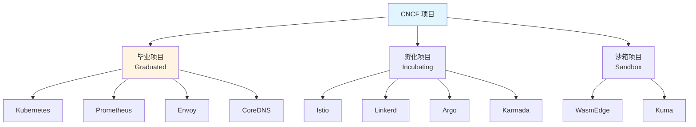
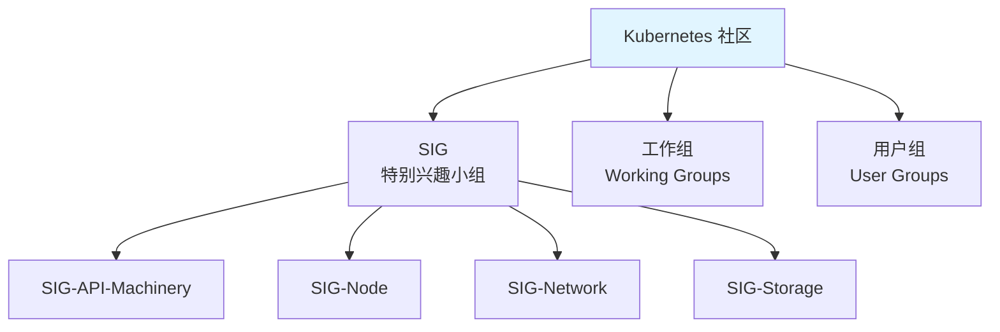
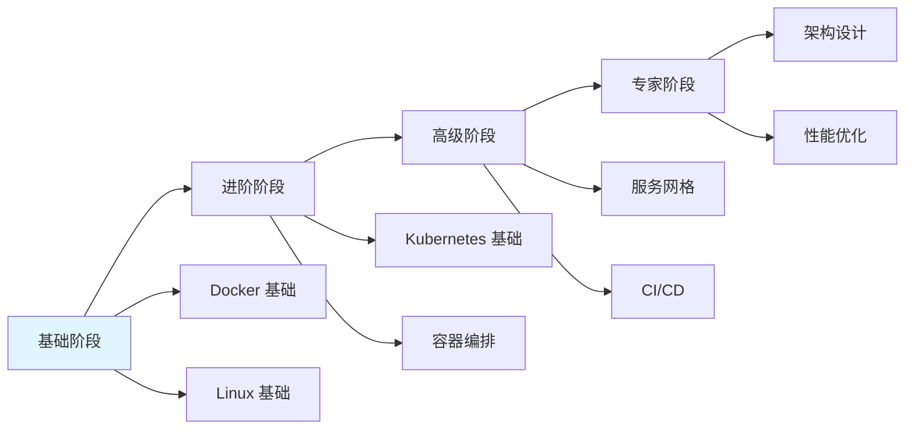

# 25. 社区生态和最佳实践：全面梳理

## 📑 目录

- [📑 目录](#-目录)
- [25.1 文档定位](#251-文档定位)
- [25.2 云原生社区生态全景](#252-云原生社区生态全景)
  - [25.2.1 CNCF 生态系统](#2521-cncf-生态系统)
  - [25.2.2 社区组织和项目](#2522-社区组织和项目)
  - [25.2.3 技术社区矩阵](#2523-技术社区矩阵)
- [25.3 核心技术社区](#253-核心技术社区)
  - [25.3.1 Kubernetes 社区](#2531-kubernetes-社区)
  - [25.3.2 Docker 社区](#2532-docker-社区)
  - [25.3.3 K3s 社区](#2533-k3s-社区)
  - [25.3.4 WasmEdge 社区](#2534-wasmedge-社区)
  - [25.3.5 OPA 社区](#2535-opa-社区)
- [25.4 社区资源](#254-社区资源)
  - [25.4.1 官方文档](#2541-官方文档)
  - [25.4.2 学习资源](#2542-学习资源)
  - [25.4.3 技术博客](#2543-技术博客)
  - [25.4.4 视频教程](#2544-视频教程)
  - [25.4.5 会议和活动](#2545-会议和活动)
- [25.5 最佳实践模式](#255-最佳实践模式)
  - [25.5.1 架构设计最佳实践](#2551-架构设计最佳实践)
  - [25.5.2 安全最佳实践](#2552-安全最佳实践)
  - [25.5.3 性能优化最佳实践](#2553-性能优化最佳实践)
  - [25.5.4 运维最佳实践](#2554-运维最佳实践)
  - [25.5.5 开发最佳实践](#2555-开发最佳实践)
- [25.6 社区参与指南](#256-社区参与指南)
  - [25.6.1 贡献代码](#2561-贡献代码)
  - [25.6.2 报告问题](#2562-报告问题)
  - [25.6.3 参与讨论](#2563-参与讨论)
  - [25.6.4 组织活动](#2564-组织活动)
- [25.7 技术选型最佳实践](#257-技术选型最佳实践)
  - [25.7.1 技术选型决策框架](#2571-技术选型决策框架)
  - [25.7.2 技术成熟度评估](#2572-技术成熟度评估)
  - [25.7.3 社区活跃度评估](#2573-社区活跃度评估)
- [25.8 实战案例和参考](#258-实战案例和参考)
  - [25.8.1 企业案例](#2581-企业案例)
  - [25.8.2 开源项目案例](#2582-开源项目案例)
  - [25.8.3 最佳实践模板](#2583-最佳实践模板)
  - [25.8.4 实际企业案例](#2584-实际企业案例)
  - [25.8.5 CI/CD 最佳实践模板](#2585-cicd-最佳实践模板)
  - [25.8.6 监控和告警最佳实践模板](#2586-监控和告警最佳实践模板)
- [25.9 持续学习和成长](#259-持续学习和成长)
  - [25.9.1 学习路径](#2591-学习路径)
  - [25.9.2 认证考试](#2592-认证考试)
  - [25.9.3 职业发展](#2593-职业发展)
- [25.10 参考](#2510-参考)

---

## 25.1 文档定位

本文档全面梳理云原生容器技术栈的社区生态和最佳实践，包括 CNCF 生态系统、核心技术
社区、社区资源、最佳实践模式、社区参与指南、技术选型最佳实践、实战案例等内容。

**文档结构**：

- **云原生社区生态全景**：CNCF 生态系统、社区组织和项目、技术社区矩阵
- **核心技术社区**：Kubernetes、Docker、K3s、WasmEdge、OPA 等核心社区
- **社区资源**：官方文档、学习资源、技术博客、视频教程、会议和活动
- **最佳实践模式**：架构设计、安全、性能优化、运维、开发最佳实践
- **社区参与指南**：贡献代码、报告问题、参与讨论、组织活动
- **技术选型最佳实践**：决策框架、技术成熟度评估、社区活跃度评估
- **实战案例和参考**：企业案例、开源项目案例、最佳实践模板
- **持续学习和成长**：学习路径、认证考试、职业发展

## 25.2 云原生社区生态全景

### 25.2.1 CNCF 生态系统

**CNCF 定义**：

CNCF（Cloud Native Computing Foundation）是 Linux 基金会下的子基金会，致力于推动
云原生技术的标准化和发展。

**CNCF 项目分类**：



**CNCF 项目成熟度等级**：

| 等级     | 定义             | 要求                 | 典型项目               |
| -------- | ---------------- | -------------------- | ---------------------- |
| **毕业** | 生产就绪         | 严格的治理和文档要求 | Kubernetes、Prometheus |
| **孵化** | 稳定且被广泛使用 | 良好的文档和社区     | Istio、Linkerd、Argo   |
| **沙箱** | 早期项目         | 基本文档和代码贡献   | WasmEdge、Kuma         |

**CNCF 毕业项目列表**：

- **容器编排**：Kubernetes
- **监控**：Prometheus、Jaeger
- **服务网格**：Envoy
- **DNS**：CoreDNS
- **存储**：etcd、Vitess
- **安全**：Falco、OPA
- **CI/CD**：Flux

### 25.2.2 社区组织和项目

**云原生社区组织**：

| 组织                 | 定位                    | 主要项目               |
| -------------------- | ----------------------- | ---------------------- |
| **CNCF**             | 云原生基金会            | Kubernetes、Prometheus |
| **OCI**              | 开放容器倡议            | Docker、containerd     |
| **Linux Foundation** | Linux 基金会            | 多个开源项目           |
| **Kubernetes SIG**   | Kubernetes 特别兴趣小组 | 各领域 SIG             |

**主要云原生项目**：

| 类别         | 项目       | 成熟度     | 社区活跃度 |
| ------------ | ---------- | ---------- | ---------- |
| **容器编排** | Kubernetes | ⭐⭐⭐⭐⭐ | ⭐⭐⭐⭐⭐ |
|              | K3s        | ⭐⭐⭐⭐⭐ | ⭐⭐⭐⭐⭐ |
| **运行时**   | containerd | ⭐⭐⭐⭐⭐ | ⭐⭐⭐⭐⭐ |
|              | WasmEdge   | ⭐⭐⭐⭐   | ⭐⭐⭐⭐   |
| **服务网格** | Istio      | ⭐⭐⭐⭐⭐ | ⭐⭐⭐⭐⭐ |
|              | Linkerd    | ⭐⭐⭐⭐⭐ | ⭐⭐⭐⭐⭐ |
| **监控**     | Prometheus | ⭐⭐⭐⭐⭐ | ⭐⭐⭐⭐⭐ |
|              | Grafana    | ⭐⭐⭐⭐⭐ | ⭐⭐⭐⭐⭐ |
| **GitOps**   | ArgoCD     | ⭐⭐⭐⭐⭐ | ⭐⭐⭐⭐⭐ |
|              | Flux       | ⭐⭐⭐⭐⭐ | ⭐⭐⭐⭐⭐ |

### 25.2.3 技术社区矩阵

**技术社区矩阵**：

| 技术           | 官方社区           | 社区规模   | 活跃度     | 资源丰富度 |
| -------------- | ------------------ | ---------- | ---------- | ---------- |
| **Kubernetes** | Kubernetes SIG     | ⭐⭐⭐⭐⭐ | ⭐⭐⭐⭐⭐ | ⭐⭐⭐⭐⭐ |
| **Docker**     | Docker Community   | ⭐⭐⭐⭐⭐ | ⭐⭐⭐⭐⭐ | ⭐⭐⭐⭐⭐ |
| **K3s**        | K3s Community      | ⭐⭐⭐⭐⭐ | ⭐⭐⭐⭐⭐ | ⭐⭐⭐⭐   |
| **WasmEdge**   | WasmEdge Community | ⭐⭐⭐⭐   | ⭐⭐⭐⭐   | ⭐⭐⭐⭐   |
| **OPA**        | OPA Community      | ⭐⭐⭐⭐   | ⭐⭐⭐⭐   | ⭐⭐⭐⭐   |

## 25.3 核心技术社区

### 25.3.1 Kubernetes 社区

**Kubernetes 社区架构**：



**Kubernetes SIG 列表**：

| SIG                   | 职责               | 活跃度     |
| --------------------- | ------------------ | ---------- |
| **SIG-API-Machinery** | API 服务器和控制器 | ⭐⭐⭐⭐⭐ |
| **SIG-Node**          | 节点运行时和管理   | ⭐⭐⭐⭐⭐ |
| **SIG-Network**       | 网络插件和策略     | ⭐⭐⭐⭐⭐ |
| **SIG-Storage**       | 存储插件和 CSI     | ⭐⭐⭐⭐⭐ |
| **SIG-Scheduling**    | 调度器和调度策略   | ⭐⭐⭐⭐⭐ |
| **SIG-Apps**          | 应用部署和管理     | ⭐⭐⭐⭐⭐ |

**Kubernetes 社区资源**：

- **官方文档**：<https://kubernetes.io/docs/>
- **GitHub**：<https://github.com/kubernetes/kubernetes>
- **Slack**：<https://kubernetes.slack.com>
- **邮件列表**：<kubernetes-dev@googlegroups.com>
- **社区会议**：Kubernetes Community Meeting

### 25.3.2 Docker 社区

**Docker 社区资源**：

- **官方文档**：<https://docs.docker.com/>
- **GitHub**：<https://github.com/docker/docker>
- **Docker Hub**：<https://hub.docker.com>
- **社区论坛**：<https://forums.docker.com>
- **Stack Overflow**：docker 标签

### 25.3.3 K3s 社区

**K3s 社区资源**：

- **官方文档**：<https://docs.k3s.io/>
- **GitHub**：<https://github.com/k3s-io/k3s>
- **Slack**：<https://rancher-users.slack.com>
- **社区论坛**：<https://github.com/k3s-io/k3s/discussions>

### 25.3.4 WasmEdge 社区

**WasmEdge 社区资源**：

- **官方文档**：<https://wasmedge.org/docs/>
- **GitHub**：<https://github.com/WasmEdge/WasmEdge>
- **Discord**：<https://discord.gg/U4J5jj6d8q>
- **社区论坛**：<https://github.com/WasmEdge/WasmEdge/discussions>

### 25.3.5 OPA 社区

**OPA 社区资源**：

- **官方文档**：<https://www.openpolicyagent.org/docs/>
- **GitHub**：<https://github.com/open-policy-agent/opa>
- **Slack**：<https://slack.openpolicyagent.org>
- **社区论坛**：<https://github.com/open-policy-agent/opa/discussions>

## 25.4 社区资源

### 25.4.1 官方文档

**核心项目官方文档**：

| 项目           | 官方文档链接                            | 文档质量   | 更新频率 |
| -------------- | --------------------------------------- | ---------- | -------- |
| **Kubernetes** | <https://kubernetes.io/docs/>           | ⭐⭐⭐⭐⭐ | 持续更新 |
| **Docker**     | <https://docs.docker.com/>              | ⭐⭐⭐⭐⭐ | 持续更新 |
| **K3s**        | <https://docs.k3s.io/>                  | ⭐⭐⭐⭐⭐ | 持续更新 |
| **WasmEdge**   | <https://wasmedge.org/docs/>            | ⭐⭐⭐⭐   | 持续更新 |
| **OPA**        | <https://www.openpolicyagent.org/docs/> | ⭐⭐⭐⭐   | 持续更新 |

### 25.4.2 学习资源

**学习资源分类**：

| 资源类型     | 平台/网站                | 特点         |
| ------------ | ------------------------ | ------------ |
| **在线课程** | Kubernetes.io/training   | 官方培训课程 |
|              | Udemy                    | 付费课程     |
|              | Coursera                 | 大学课程     |
| **教程网站** | Katacoda                 | 交互式教程   |
|              | Play with Kubernetes     | 在线实验环境 |
| **书籍**     | 《Kubernetes in Action》 | 经典书籍     |
|              | 《Docker Deep Dive》     | Docker 深入  |

### 25.4.3 技术博客

**推荐技术博客**：

| 博客/网站           | 主题                | 更新频率 |
| ------------------- | ------------------- | -------- |
| **Kubernetes Blog** | Kubernetes 官方博客 | 定期更新 |
| **CNCF Blog**       | CNCF 项目博客       | 定期更新 |
| **Docker Blog**     | Docker 官方博客     | 定期更新 |
| **Medium**          | 技术文章平台        | 每日更新 |
| **Dev.to**          | 开发者社区          | 每日更新 |

### 25.4.4 视频教程

**视频教程平台**：

| 平台              | 资源类型     | 特点           |
| ----------------- | ------------ | -------------- |
| **YouTube**       | 免费视频教程 | 内容丰富、免费 |
| **Pluralsight**   | 付费视频课程 | 专业、系统     |
| **Linux Academy** | 在线课程     | 实验环境、认证 |

### 25.4.5 会议和活动

**主要云原生会议**：

| 会议                | 类型     | 频率      | 规模     |
| ------------------- | -------- | --------- | -------- |
| **KubeCon**         | 全球会议 | 每年 2 次 | 超大规模 |
| **CloudNativeCon**  | 全球会议 | 每年 2 次 | 超大规模 |
| **CNCF 网络研讨会** | 在线会议 | 定期      | 中等     |
| **本地 K8s Meetup** | 本地聚会 | 每月      | 小规模   |

## 25.5 最佳实践模式

### 25.5.1 架构设计最佳实践

**架构设计最佳实践**：

1. **容器化最佳实践**：

   - 使用多阶段构建减小镜像大小
   - 使用非 root 用户运行容器
   - 设置合理的资源限制
   - 使用健康检查

2. **Kubernetes 部署最佳实践**：

   - 使用 Deployment 而非 ReplicaSet
   - 设置合理的副本数量
   - 使用 ConfigMap 和 Secret 管理配置
   - 使用命名空间隔离资源

3. **服务网格最佳实践**：

   - 生产环境使用 STRICT mTLS
   - 配置合理的超时和重试策略
   - 监控服务网格性能

4. **存储最佳实践**：
   - 使用 PVC 而非直接挂载卷
   - 设置合理的存储类
   - 定期备份数据

**架构设计决策树**：

```yaml
架构设计决策:
  if 需要边缘部署:
    选择: K3s + WasmEdge
  elif 需要完整功能:
    选择: Kubernetes + containerd
  elif 需要服务网格:
    选择: Istio / Linkerd
  else:
    选择: 标准 Kubernetes 栈
```

### 25.5.2 安全最佳实践

**安全最佳实践**：

1. **镜像安全**：

   - 使用官方或受信任的基础镜像
   - 定期扫描镜像漏洞
   - 使用镜像签名验证

2. **网络安全**：

   - 使用 NetworkPolicy 限制网络访问
   - 启用 mTLS 加密通信
   - 使用 RBAC 控制访问权限

3. **配置安全**：

   - 使用 Secret 管理敏感信息
   - 避免在配置中硬编码密钥
   - 使用加密存储敏感数据

4. **运行时安全**：
   - 使用 Pod Security Standards
   - 限制容器权限
   - 监控异常行为

**安全最佳实践检查清单**：

- ✅ 镜像漏洞扫描
- ✅ 网络策略配置
- ✅ RBAC 权限配置
- ✅ Secret 加密存储
- ✅ mTLS 启用
- ✅ Pod Security Standards
- ✅ 审计日志启用

### 25.5.3 性能优化最佳实践

**性能优化最佳实践**：

1. **资源优化**：

   - 合理设置资源请求和限制
   - 使用 VPA 自动调整资源
   - 监控资源使用情况

2. **调度优化**：

   - 使用节点亲和性优化调度
   - 使用 Pod 反亲和性避免集中
   - 使用拓扑分布约束

3. **存储优化**：

   - 选择合适的存储类型
   - 使用存储分层
   - 优化 I/O 性能

4. **网络优化**：
   - 使用合适的 CNI 插件
   - 优化 Service 负载均衡
   - 使用 Ingress 优化流量路由

### 25.5.4 运维最佳实践

**运维最佳实践**：

1. **监控和告警**：

   - 使用 Prometheus 收集指标
   - 使用 Grafana 可视化
   - 配置合理的告警规则

2. **日志管理**：

   - 集中收集日志
   - 使用日志聚合工具
   - 设置日志保留策略

3. **备份和恢复**：

   - 定期备份 etcd
   - 备份应用数据
   - 测试恢复流程

4. **升级策略**：
   - 使用滚动升级
   - 在测试环境先验证
   - 准备回滚计划

### 25.5.5 开发最佳实践

**开发最佳实践**：

1. **GitOps 实践**：

   - 使用 Git 作为配置源
   - 自动化部署流程
   - 使用 Pull Request 审查

2. **CI/CD 实践**：

   - 自动化构建和测试
   - 使用镜像扫描
   - 自动化部署

3. **代码质量**：

   - 使用代码审查
   - 编写测试
   - 使用 linting 工具

4. **文档实践**：
   - 编写清晰的文档
   - 使用代码注释
   - 维护更新日志

## 25.6 社区参与指南

### 25.6.1 贡献代码

**贡献代码流程**：

1. **Fork 项目**：Fork 目标项目到自己的 GitHub
2. **创建分支**：创建功能分支
3. **编写代码**：实现功能或修复问题
4. **提交 PR**：提交 Pull Request
5. **代码审查**：等待代码审查
6. **合并代码**：审查通过后合并

**贡献代码最佳实践**：

- ✅ 遵循项目代码规范
- ✅ 编写测试覆盖
- ✅ 更新相关文档
- ✅ 编写清晰的提交信息
- ✅ 响应审查意见

### 25.6.2 报告问题

**报告问题模板**：

```markdown
## 问题描述

简要描述问题

## 复现步骤

1. 步骤 1
2. 步骤 2
3. 步骤 3

## 期望行为

期望的行为

## 实际行为

实际的行为

## 环境信息

- Kubernetes 版本：
- 节点操作系统：
- 容器运行时：
- 其他相关信息：

## 日志信息

相关的日志信息
```

### 25.6.3 参与讨论

**参与讨论渠道**：

| 渠道                   | 用途       | 特点         |
| ---------------------- | ---------- | ------------ |
| **GitHub Discussions** | 技术讨论   | 公开、可搜索 |
| **Slack**              | 实时交流   | 即时响应     |
| **邮件列表**           | 正式讨论   | 异步、存档   |
| **社区论坛**           | 问答和分享 | 内容丰富     |

### 25.6.4 组织活动

**组织社区活动**：

1. **Kubernetes Meetup**：

   - 定期组织本地聚会
   - 邀请演讲者分享
   - 组织实践工作坊

2. **技术分享**：
   - 在会议中分享经验
   - 撰写技术博客
   - 制作视频教程

## 25.7 技术选型最佳实践

### 25.7.1 技术选型决策框架

**技术选型决策框架**：

```yaml
技术选型决策:
  评估维度:
    - 功能完整性
    - 性能表现
    - 易用性
    - 社区活跃度
    - 生产验证
    - 成本
    - 厂商支持
  决策流程:
    1. 明确需求和约束 2. 收集候选技术 3. 评估各技术 4. 对比分析 5. 做出决策 6.
    验证决策
```

**技术选型评估矩阵**：

| 技术           | 功能完整性 | 性能       | 易用性     | 社区活跃度 | 生产验证   | 综合评分 |
| -------------- | ---------- | ---------- | ---------- | ---------- | ---------- | -------- |
| **Kubernetes** | ⭐⭐⭐⭐⭐ | ⭐⭐⭐⭐   | ⭐⭐⭐     | ⭐⭐⭐⭐⭐ | ⭐⭐⭐⭐⭐ | 4.6/5.0  |
| **K3s**        | ⭐⭐⭐⭐   | ⭐⭐⭐⭐⭐ | ⭐⭐⭐⭐⭐ | ⭐⭐⭐⭐   | ⭐⭐⭐⭐⭐ | 4.6/5.0  |
| **Istio**      | ⭐⭐⭐⭐⭐ | ⭐⭐⭐⭐   | ⭐⭐⭐     | ⭐⭐⭐⭐⭐ | ⭐⭐⭐⭐⭐ | 4.5/5.0  |

### 25.7.2 技术成熟度评估

**技术成熟度评估标准**：

| 等级        | 定义         | 特征                   |
| ----------- | ------------ | ---------------------- |
| **Level 1** | 实验阶段     | 概念验证、不稳定       |
| **Level 2** | 早期采用阶段 | 部分功能稳定、文档有限 |
| **Level 3** | 稳定阶段     | 功能稳定、文档完善     |
| **Level 4** | 生产就绪     | 广泛使用、生产验证     |
| **Level 5** | 成熟阶段     | 标准规范、企业级支持   |

### 25.7.3 社区活跃度评估

**社区活跃度评估指标**：

| 指标              | 说明          | 评估方法             |
| ----------------- | ------------- | -------------------- |
| **GitHub Stars**  | GitHub 星标数 | 查看 GitHub 统计数据 |
| **Contributors**  | 贡献者数量    | 查看贡献者列表       |
| **Issue/PR 数量** | 问题/PR 数量  | 查看 GitHub 统计     |
| **Release 频率**  | 版本发布频率  | 查看 Release 历史    |
| **文档更新**      | 文档更新频率  | 查看文档提交历史     |

## 25.8 实战案例和参考

### 25.8.1 企业案例

**企业应用案例**：

| 企业         | 技术栈             | 应用场景     | 规模     |
| ------------ | ------------------ | ------------ | -------- |
| **Google**   | Kubernetes         | 基础设施     | 超大规模 |
| **Netflix**  | Kubernetes + Istio | 微服务架构   | 大规模   |
| **Spotify**  | Kubernetes         | 音乐流媒体   | 大规模   |
| **阿里巴巴** | Kubernetes + K3s   | 电商和云计算 | 超大规模 |

### 25.8.2 开源项目案例

**优秀开源项目案例**：

| 项目           | 技术栈          | 特点        |
| -------------- | --------------- | ----------- |
| **Prometheus** | Go + Kubernetes | 监控系统    |
| **ArgoCD**     | Go + Kubernetes | GitOps 工具 |
| **Karmada**    | Go + Kubernetes | 多集群编排  |
| **Longhorn**   | Go + Kubernetes | 分布式存储  |

### 25.8.3 最佳实践模板

**最佳实践模板示例**：

```yaml
项目最佳实践模板:
  架构设计:
    - 容器化策略
    - 编排平台选择
    - 服务网格配置
  安全:
    - 镜像安全扫描
    - 网络安全策略
    - 访问控制配置
  监控:
    - Metrics 收集
    - 日志聚合
    - 告警规则
  运维:
    - 备份策略
    - 升级流程
    - 故障处理
```

**实际项目最佳实践模板**：

```yaml
# project-best-practices.yaml
project:
  name: my-app
  version: v1.0.0

architecture:
  containerization:
    strategy: multi-stage-build
    baseImage: distroless
    nonRoot: true
  orchestration:
    platform: k3s
    runtime: wasmedge
    replicas: 3
  serviceMesh:
    enabled: false
    reason: "边缘场景，轻量优先"

security:
  imageScanning:
    enabled: true
    tool: trivy
    frequency: "on-build"
  imageSigning:
    enabled: true
    tool: cosign
  networkPolicy:
    enabled: true
    defaultDeny: true
  rbac:
    enabled: true
    leastPrivilege: true

monitoring:
  metrics:
    enabled: true
    exporter: prometheus
    interval: 30s
  logging:
    enabled: true
    aggregator: loki
    retention: 30d
  tracing:
    enabled: true
    exporter: jaeger
  alerts:
    enabled: true
    channels: [email, slack]

cicd:
  gitops:
    enabled: true
    tool: argocd
    autoSync: true
  pipeline:
    stages:
      - build
      - test
      - scan
      - sign
      - deploy
    triggers:
      - push-to-main
      - pull-request

operations:
  backup:
    enabled: true
    frequency: daily
    retention: 30d
  upgrade:
    strategy: rolling-update
    testing: required
  disasterRecovery:
    rto: 4h
    rpo: 1h
```

### 25.8.4 实际企业案例

**案例 1：互联网公司微服务架构最佳实践**:

**背景**：某互联网公司从单体应用迁移到微服务架构

**实践要点**：

```yaml
架构实践:
  容器化:
    - 使用多阶段构建，镜像大小 < 100MB
    - 使用 distroless 基础镜像
    - 非 root 用户运行
  编排:
    - Kubernetes 1.28+ 集群
    - 使用 Deployment + Service
    - HPA 自动扩缩容
  服务网格:
    - Istio 1.19+ 服务网格
    - STRICT mTLS 模式
    - 分布式追踪集成
  监控:
    - Prometheus + Grafana
    - OpenTelemetry 链路追踪
    - ELK 日志聚合
  安全:
    - 镜像签名（Cosign）
    - 网络策略（NetworkPolicy）
    - OPA Gatekeeper 策略治理
  成本优化:
    - VPA 自动调整资源
    - 使用 Spot 实例
    - 镜像多阶段构建
```

**实施效果**：

- 部署速度提升 80%
- 资源利用率提升 60%
- 故障恢复时间降低 70%

**案例 2：边缘计算场景最佳实践**:

**背景**：某制造企业部署边缘 IoT 平台

**实践要点**：

```yaml
架构实践:
  编排:
    - K3s 1.30（轻量级）
    - WasmEdge 0.14 运行时
    - RuntimeClass: crun-wasm
  边缘特性:
    - 离线自治能力
    - 热更新支持
    - 冷启动优化（< 10ms）
  网络:
    - Flannel CNI（简单）
    - 边缘节点 VPN 连接
  存储:
    - 本地存储（sqlite）
    - 定期同步到中心
  监控:
    - Prometheus + Grafana
    - 边缘节点指标上报
  安全:
    - 镜像签名验证
    - 网络策略隔离
    - OPA 策略治理
```

**实施效果**：

- 边缘节点资源占用降低 90%
- 冷启动时间 < 6ms
- 离线运行能力 30 天

### 25.8.5 CI/CD 最佳实践模板

**GitHub Actions 工作流模板**：

```yaml
# .github/workflows/ci-cd.yml
name: CI/CD Pipeline

on:
  push:
    branches: [main, develop]
  pull_request:
    branches: [main]

jobs:
  test:
    runs-on: ubuntu-latest
    steps:
      - uses: actions/checkout@v3
      - name: Run tests
        run: |
          go test ./...

  build:
    needs: test
    runs-on: ubuntu-latest
    steps:
      - uses: actions/checkout@v3
      - name: Build image
        run: |
          docker build -t myapp:${{ github.sha }} .
      - name: Scan image
        run: |
          trivy image --exit-code 1 --severity HIGH,CRITICAL myapp:${{ github.sha }}
      - name: Sign image
        run: |
          cosign sign --key cosign.key myapp:${{ github.sha }}
      - name: Push image
        run: |
          docker push myapp:${{ github.sha }}

  deploy:
    needs: build
    if: github.ref == 'refs/heads/main'
    runs-on: ubuntu-latest
    steps:
      - name: Update GitOps repo
        run: |
          # 更新 GitOps 仓库中的镜像标签
          git clone https://github.com/example/gitops-repo.git
          cd gitops-repo
          sed -i "s|image: myapp:.*|image: myapp:${{ github.sha }}|g" \
            apps/myapp/deployment.yaml
          git commit -m "Update myapp to ${{ github.sha }}"
          git push
```

### 25.8.6 监控和告警最佳实践模板

**Prometheus 告警规则模板**：

```yaml
# prometheus-alerts.yaml
groups:
  - name: kubernetes
    rules:
      - alert: PodCrashLooping
        expr: rate(kube_pod_container_status_restarts_total[5m]) > 0
        for: 5m
        labels:
          severity: warning
        annotations:
          summary: "Pod {{ $labels.pod }} is crash looping"

      - alert: HighMemoryUsage
        expr:
          (container_memory_usage_bytes / container_spec_memory_limit_bytes) >
          0.9
        for: 5m
        labels:
          severity: critical
        annotations:
          summary: "Pod {{ $labels.pod }} memory usage is high"

      - alert: HighCPUUsage
        expr:
          (rate(container_cpu_usage_seconds_total[5m]) /
          container_spec_cpu_quota) > 0.9
        for: 5m
        labels:
          severity: warning
        annotations:
          summary: "Pod {{ $labels.pod }} CPU usage is high"
```

**Grafana Dashboard 模板**：

```json
{
  "dashboard": {
    "title": "Kubernetes Cluster Overview",
    "panels": [
      {
        "title": "CPU Usage",
        "targets": [
          {
            "expr": "sum(rate(container_cpu_usage_seconds_total[5m])) by (pod)"
          }
        ]
      },
      {
        "title": "Memory Usage",
        "targets": [
          {
            "expr": "sum(container_memory_usage_bytes) by (pod)"
          }
        ]
      },
      {
        "title": "Pod Status",
        "targets": [
          {
            "expr": "count(kube_pod_status_phase) by (phase)"
          }
        ]
      }
    ]
  }
}
```

## 25.9 持续学习和成长

### 25.9.1 学习路径

**云原生学习路径**：



**学习路径规划**：

1. **基础阶段**（1-3 个月）：

   - Docker 基础使用
   - Linux 系统管理
   - 基础网络知识

2. **进阶阶段**（3-6 个月）：

   - Kubernetes 核心概念
   - Pod、Service、Deployment
   - 存储和网络配置

3. **高级阶段**（6-12 个月）：

   - 服务网格（Istio/Linkerd）
   - CI/CD 实践
   - 监控和可观测性

4. **专家阶段**（12+ 个月）：
   - 架构设计
   - 性能优化
   - 大规模运维

### 25.9.2 认证考试

**云原生认证考试**：

| 认证                 | 机构   | 难度       | 认可度     |
| -------------------- | ------ | ---------- | ---------- |
| **CKA**              | CNCF   | ⭐⭐⭐⭐   | ⭐⭐⭐⭐⭐ |
| **CKAD**             | CNCF   | ⭐⭐⭐     | ⭐⭐⭐⭐⭐ |
| **CKS**              | CNCF   | ⭐⭐⭐⭐⭐ | ⭐⭐⭐⭐⭐ |
| **Docker Certified** | Docker | ⭐⭐⭐     | ⭐⭐⭐⭐   |

**认证准备建议**：

1. **理论学习**：系统学习官方文档
2. **实践练习**：在实验环境中练习
3. **模拟考试**：参加模拟考试熟悉题型
4. **持续学习**：保持技术更新

### 25.9.3 职业发展

**云原生职业路径**：

| 角色                  | 职责               | 技能要求           |
| --------------------- | ------------------ | ------------------ |
| **DevOps 工程师**     | CI/CD、自动化部署  | Kubernetes、CI/CD  |
| **SRE 工程师**        | 可靠性工程、监控   | 监控、故障排查     |
| **云原生架构师**      | 架构设计、技术选型 | 架构设计、技术深度 |
| **Kubernetes 管理员** | 集群管理、运维     | 运维、故障处理     |

## 25.10 参考

- [CNCF 官方网站](https://www.cncf.io/)
- [Kubernetes 社区](https://kubernetes.io/community/)
- [CNCF 项目清单](https://www.cncf.io/projects/)
- [KubeCon 官方网站](https://events.linuxfoundation.org/about/kubecon-cloudnativecon-europe/)
- [CNCF 学习资源](https://www.cncf.io/certification/training/)

---

> **使用指南**：
>
> - **快速开始**：查看 [25.2 云原生社区生态全景](#252-云原生社区生态全景)
> - **社区参与**：查看 [25.6 社区参与指南](#256-社区参与指南)
> - **最佳实践**：查看 [25.5 最佳实践模式](#255-最佳实践模式)
> - **技术选型**：查看 [25.7 技术选型最佳实践](#257-技术选型最佳实践)
> - **持续学习**：查看 [25.9 持续学习和成长](#259-持续学习和成长)

---

**最后更新**：2025-11-06 **维护者**：项目团队
