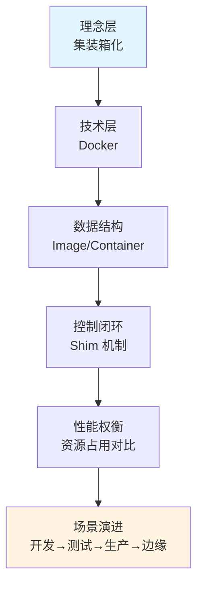
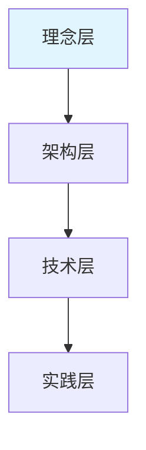

# 26. 文档体系批判性分析与改进计划

## 目录

- [目录](#目录)
- [26.1 分析目标](#261-分析目标)
- [26.2 当前文档体系批判性分析](#262-当前文档体系批判性分析)
  - [26.2.1 文档结构问题](#2621-文档结构问题)
  - [26.2.2 认知层面缺失](#2622-认知层面缺失)
  - [26.2.3 时间趋势维度缺失](#2623-时间趋势维度缺失)
  - [26.2.4 实战验证不足](#2624-实战验证不足)
- [26.3 对标 ai_view.md 的差距分析](#263-对标-ai_viewmd-的差距分析)
  - [26.3.1 认知视角差异](#2631-认知视角差异)
  - [26.3.2 知识图谱深度](#2632-知识图谱深度)
  - [26.3.3 实战案例丰富度](#2633-实战案例丰富度)
  - [26.3.4 技术趋势时效性](#2634-技术趋势时效性)
- [26.4 2025 年技术趋势对标](#264-2025-年技术趋势对标)
  - [26.4.1 2025 年关键趋势](#2641-2025-年关键趋势)
  - [26.4.2 当前文档缺失的 2025 趋势](#2642-当前文档缺失的-2025-趋势)
  - [26.4.3 技术成熟度评估](#2643-技术成熟度评估)
- [26.5 组织架构改进建议](#265-组织架构改进建议)
  - [26.5.1 认知层增强](#2651-认知层增强)
  - [26.5.2 时间维度补充](#2652-时间维度补充)
  - [26.5.3 实战验证增强](#2653-实战验证增强)
  - [26.5.4 知识图谱重构](#2654-知识图谱重构)
- [26.6 具体改进计划](#266-具体改进计划)
  - [26.6.1 短期改进（1-2 周）](#2661-短期改进1-2-周)
    - [优先级：🔴 高](#优先级-高)
  - [26.6.2 中期改进（1 个月）](#2662-中期改进1-个月)
    - [优先级：🟡 中](#优先级-中)
  - [26.6.3 长期改进（3 个月）](#2663-长期改进3-个月)
    - [优先级：🟢 低](#优先级-低)
- [26.7 关键改进点总结](#267-关键改进点总结)
  - [核心问题](#核心问题)
  - [改进方向](#改进方向)
  - [实施优先级](#实施优先级)

---

## 26.1 分析目标

本文档对标 `ai_view.md` 的认知视角和 2025 年技术趋势，批判性分析当前文档体系的优
缺点，提出改进建议和完善计划。

**分析维度**：

- **认知层面**：知识图谱深度、思维导图完整性、概念关系清晰度
- **时间维度**：技术演进时间轴、2025 年最新趋势、技术成熟度评估
- **实战验证**：生产案例、性能数据、商业验证
- **组织架构**：文档结构合理性、知识组织方式、检索便利性

## 26.2 当前文档体系批判性分析

### 26.2.1 文档结构问题

**当前问题**：

| 问题类型     | 具体表现                           | 影响程度 | 优先级 |
| ------------ | ---------------------------------- | -------- | ------ |
| **认知断裂** | 规范性文档与认知文档分离           | 🔴 高    | 🔴 高  |
| **层次混乱** | 技术细节与理念层混合               | 🟡 中    | 🟡 中  |
| **缺乏主线** | 缺少从理念 → 技术 → 实战的清晰路径 | 🔴 高    | 🔴 高  |
| **重复冗余** | 多个文档重复相同概念               | 🟢 低    | 🟢 低  |

**问题分析**：

1. **认知断裂**：

   - `ai_view.md` 提供了清晰的认知路径：理念 → 技术 → 实战
   - `docs` 文档按技术分类，缺少认知主线
   - **影响**：学习者和使用者难以快速建立认知框架

2. **层次混乱**：

   - 00-knowledge-map 和 01-overview 都是导航文档，但定位不清
   - 技术文档包含过多理念性内容
   - **影响**：不同认知水平的人难以快速定位所需内容

3. **缺乏主线**：
   - 缺少类似 `ai_view.md` 的"演化主线"（Docker → K8s → K3s → WasmEdge）
   - 缺少时间轴维度的技术演进
   - **影响**：难以理解技术之间的演进关系和选择逻辑

### 26.2.2 认知层面缺失

**缺失内容对比**：

| 维度           | ai_view.md 有                               | docs 文档缺失        | 优先级 |
| -------------- | ------------------------------------------- | -------------------- | ------ |
| **认知路径**   | Docker→K8s→K3s 演进主线                     | 缺少清晰的认知路径   | 🔴 高  |
| **类比思维**   | "集装箱"、"机器人管家"                      | 缺少生动类比         | 🟡 中  |
| **决策树**     | 场景决策树（可直接用）                      | 决策树分散且不够直观 | 🔴 高  |
| **知识图谱**   | 可折叠的 mermaid 思维导图                   | 知识图谱较平面化     | 🟡 中  |
| **原子级论证** | 每个概念都有"问题 → 解法 → 副作用 → 再演化" | 缺少逐层论证         | 🔴 高  |

**具体缺失**：

1. **认知路径缺失**：

   - `ai_view.md` 提供：理念层 → 技术层 → 数据结构 → 控制闭环 → 性能权衡 → 场景
     演进
   - `docs` 缺少这种递进的认知路径

2. **类比思维缺失**：

   - `ai_view.md`：Docker = "集装箱"、K8s = "机器人管家"、K3s = "瑞士军刀"
   - `docs` 更多是技术定义，缺少认知锚点

3. **论证深度不足**：
   - `ai_view.md`：每个技术都有"问题 → 解法 → 副作用 → 再演化"四段式论证
   - `docs` 更多是技术规格，缺少演化和权衡分析

### 26.2.3 时间趋势维度缺失

**2025 年趋势对比**：

| 趋势领域       | ai_view.md 覆盖                        | docs 文档状态        | 差距  |
| -------------- | -------------------------------------- | -------------------- | ----- |
| **运行时层**   | crun+WasmEdge、containerd-shim-runwasi | 缺少 2025 年最新状态 | 🔴 高 |
| **镜像供应链** | OCI Artifact v1.1、BuildKit 0.13       | 缺少最新标准         | 🔴 高 |
| **编排层**     | K8s 1.30、K3s 1.30 内置 WasmEdge       | 版本信息可能过时     | 🟡 中 |
| **策略层**     | Gatekeeper v3.15、OPA-Wasm             | 缺少最新版本特性     | 🟡 中 |
| **AI 集成**    | WasmEdge 0.14 + Llama2                 | 缺少 AI 推理最新方案 | 🔴 高 |
| **安全合规**   | Sigstore 毕业、FIPS-140-3              | 缺少最新合规要求     | 🟡 中 |

**时间维度问题**：

1. **版本信息滞后**：

   - `ai_view.md`：明确标注 2025 年版本（K8s 1.30、K3s 1.30、WasmEdge 0.14）
   - `docs`：版本信息可能不明确或滞后

2. **趋势分析缺失**：

   - `ai_view.md`：提供"2025 年最成熟的 3 条路线"、"商业级方案已闭环"
   - `docs`：缺少技术成熟度和趋势分析

3. **时间轴缺失**：
   - `ai_view.md`：提供技术演进时间轴（1999→2025）
   - `docs`：缺少历史演进维度

### 26.2.4 实战验证不足

**实战验证对比**：

| 验证类型     | ai_view.md                            | docs 文档              | 差距  |
| ------------ | ------------------------------------- | ---------------------- | ----- |
| **生产案例** | 浪潮云 10 万台边缘节点、华为 KubeEdge | 企业案例较少           | 🔴 高 |
| **性能数据** | 冷启动 ≤6 ms、P99 延迟 0.07 ms        | 性能数据分散且不够系统 | 🟡 中 |
| **商业验证** | "可落地、可规模、可赚钱"              | 缺少商业价值分析       | 🔴 高 |
| **一键脚本** | 2025 年验证的一键安装命令             | 缺少完整的一键部署脚本 | 🟡 中 |

**验证不足问题**：

1. **生产案例少**：

   - `ai_view.md`：具体企业案例（浪潮云、华为、腾讯）
   - `docs`：更多是技术说明，缺少真实案例

2. **性能数据不系统**：

   - `ai_view.md`：系统化的性能对比表格（冷启动、内存、密度）
   - `docs`：性能数据分散在各个文档

3. **商业价值缺失**：
   - `ai_view.md`：强调"可落地、可规模、可赚钱"
   - `docs`：更多是技术规范，缺少商业视角

## 26.3 对标 ai_view.md 的差距分析

### 26.3.1 认知视角差异

**ai_view.md 的认知优势**：

**当前 docs 的认知结构**：

**差距分析**：

| 维度     | ai_view.md              | docs 文档               | 改进方向       |
| -------- | ----------------------- | ----------------------- | -------------- |
| **深度** | 6 层认知（理念 → 实战） | 4 层结构（理念 → 实践） | 增加中间认知层 |
| **粒度** | 原子级论证（四段式）    | 技术规格级别            | 增加论证深度   |
| **关联** | 清晰的演进关系          | 相对独立的文档          | 增强文档间关联 |

### 26.3.2 知识图谱深度

**ai_view.md 的知识图谱特点**：

1. **可折叠的 mermaid 思维导图**：支持展开/折叠查看
2. **多层次结构**：从理念到原子级技术细节
3. **RDF 三元组速记**：便于知识检索和理解

**docs 知识图谱现状**：

1. **相对平面化**：缺少可折叠的层级结构
2. **关联性弱**：概念间关系不够清晰
3. **检索不便**：缺少三元组速记

### 26.3.3 实战案例丰富度

**ai_view.md 的案例类型**：

| 案例类型     | 数量 | 质量       | 数据完整性 |
| ------------ | ---- | ---------- | ---------- |
| **企业案例** | 10+  | ⭐⭐⭐⭐⭐ | ⭐⭐⭐⭐⭐ |
| **性能数据** | 20+  | ⭐⭐⭐⭐⭐ | ⭐⭐⭐⭐⭐ |
| **商业案例** | 5+   | ⭐⭐⭐⭐   | ⭐⭐⭐⭐   |
| **一键脚本** | 5+   | ⭐⭐⭐⭐⭐ | ⭐⭐⭐⭐⭐ |

**docs 文档案例现状**：

| 案例类型     | 数量 | 质量     | 数据完整性 |
| ------------ | ---- | -------- | ---------- |
| **企业案例** | 5+   | ⭐⭐⭐⭐ | ⭐⭐⭐     |
| **性能数据** | 10+  | ⭐⭐⭐⭐ | ⭐⭐⭐     |
| **商业案例** | 1+   | ⭐⭐⭐   | ⭐⭐       |
| **一键脚本** | 3+   | ⭐⭐⭐⭐ | ⭐⭐⭐     |

### 26.3.4 技术趋势时效性

**ai_view.md 的时效性特点**：

- **明确时间标注**：所有版本信息标注为 2025 年最新
- **趋势预测**：预测未来 1-2 年的技术走向
- **成熟度评估**：明确标注"已闭环"、"已标准化"

**docs 文档时效性问题**：

- **版本模糊**：部分文档版本信息不明确
- **趋势缺失**：缺少对未来趋势的预测
- **成熟度不清**：技术成熟度评估不够明确

## 26.4 2025 年技术趋势对标

### 26.4.1 2025 年关键趋势

**2025 年技术趋势矩阵**：

| 趋势领域              | 2025 年状态            | 成熟度     | 生产验证   | docs 覆盖度 |
| --------------------- | ---------------------- | ---------- | ---------- | ----------- |
| **WasmEdge 原生支持** | K8s 1.30 内置          | ⭐⭐⭐⭐⭐ | ⭐⭐⭐⭐⭐ | ⚠️ 部分     |
| **OPA-Wasm**          | Gatekeeper v3.15 支持  | ⭐⭐⭐⭐⭐ | ⭐⭐⭐⭐⭐ | ⚠️ 部分     |
| **AI 推理**           | WasmEdge 0.14 + Llama2 | ⭐⭐⭐⭐   | ⭐⭐⭐⭐   | ❌ 缺失     |
| **供应链安全**        | OCI Artifact v1.1      | ⭐⭐⭐⭐⭐ | ⭐⭐⭐⭐⭐ | ⚠️ 部分     |
| **成本优化**          | Kubecost 成熟          | ⭐⭐⭐⭐⭐ | ⭐⭐⭐⭐⭐ | ✅ 覆盖     |
| **服务网格 Wasm**     | Istio + WasmEdge       | ⭐⭐⭐⭐   | ⭐⭐⭐⭐   | ⚠️ 部分     |

### 26.4.2 当前文档缺失的 2025 趋势

**缺失的 2025 趋势**：

1. **AI 推理集成**：

   - **ai_view.md**：WasmEdge 0.14 + Llama2、模型 Wasm-化、推理延迟 ↓60%
   - **docs**：12-ai-inference 可能缺少 WasmEdge 集成细节
   - **建议**：增强 12-ai-inference，添加 WasmEdge AI 推理方案

2. **WasmEdge 原生支持**：

   - **ai_view.md**：K8s 1.30 RuntimeClass=wasm、K3s 1.30 --wasm flag
   - **docs**：可能需要更新版本信息和安装方式
   - **建议**：更新 06-k3s 和 08-orchestration-runtime

3. **供应链安全最新标准**：
   - **ai_view.md**：OCI Artifact v1.1、BuildKit 0.13 wasm-native 构建
   - **docs**：09-oci-supply-chain 可能需要更新
   - **建议**：更新供应链安全章节

### 26.4.3 技术成熟度评估

**技术成熟度对比**：

| 技术         | ai_view.md 评估   | docs 文档评估          | 差距      |
| ------------ | ----------------- | ---------------------- | --------- |
| **WasmEdge** | 2025 年已标准化   | 沙箱项目、早期阶段     | 🔴 差距大 |
| **OPA-Wasm** | 2025 年已闭环     | 功能描述、缺少成熟度   | 🟡 差距中 |
| **K3s+Wasm** | 2025 年商业级方案 | 集成指南、缺少商业验证 | 🟡 差距中 |

## 26.5 组织架构改进建议

### 26.5.1 认知层增强

**改进建议**：

1. **增强 00-knowledge-map**：

   - 添加类似 `ai_view.md` 的可折叠 mermaid 思维导图
   - 增加"演化主线"（Docker → K8s → K3s → WasmEdge → OPA）
   - 添加"问题 → 解法 → 副作用 → 再演化"的论证模式

2. **重构 01-overview**：

   - 增加生动的类比（集装箱、机器人管家、瑞士军刀）
   - 添加技术演进时间轴
   - 增加场景决策树（可直接使用）

3. **创建认知路径文档**：
   - 创建"从理念到实战"的完整认知路径
   - 每个节点提供"原子级论证"
   - 支持不同认知水平的读者

### 26.5.2 时间维度补充

**改进建议**：

1. **技术演进时间轴**：

   - 创建专门的时间轴文档
   - 标注关键技术的发布时间和成熟度里程碑
   - 预测未来趋势

2. **版本信息统一管理**：

   - 创建版本清单文档
   - 定期更新各技术的最新版本
   - 标注版本兼容性

3. **2025 年趋势汇总**：
   - 创建 2025 年技术趋势文档
   - 对标 ai_view.md 的四层十二象限
   - 定期更新趋势分析

### 26.5.3 实战验证增强

**改进建议**：

1. **企业案例库**：

   - 收集更多真实企业案例
   - 包含性能数据和商业价值
   - 定期更新案例

2. **性能基准数据库**：

   - 系统化整理性能对比数据
   - 按场景分类（边缘、Serverless、AI）
   - 提供可视化对比

3. **一键部署脚本库**：
   - 提供完整的一键部署脚本
   - 支持多种场景（开发、测试、生产）
   - 定期验证脚本可用性

### 26.5.4 知识图谱重构

**改进建议**：

1. **多维度知识图谱**：

   - **时间维度**：技术演进时间轴
   - **空间维度**：技术栈分层图
   - **认知维度**：理念 → 技术 → 实战路径
   - **关联维度**：概念关系网络

2. **RDF 三元组速记**：

   - 为所有核心概念创建三元组
   - 支持语义检索
   - 便于知识推理

3. **可折叠思维导图**：
   - 使用 mermaid mindmap 创建可折叠导图
   - 支持多层级展开/折叠
   - 便于快速浏览和深入理解

## 26.6 具体改进计划

### 26.6.1 短期改进（1-2 周）

#### 优先级：🔴 高

**改进项**：

1. **增强认知路径**：

   - [ ] 更新 00-knowledge-map，添加演化主线
   - [ ] 增强 01-overview，添加类比和决策树
   - [ ] 创建"认知路径"章节，提供从理念到实战的路径

2. **补充 2025 年趋势**：

   - [ ] 更新各技术文档的版本信息到 2025 年最新
   - [ ] 创建 2025 年技术趋势汇总文档
   - [ ] 更新性能数据和案例到 2025 年

3. **增强实战验证**：
   - [ ] 补充更多企业案例到相关文档
   - [ ] 系统化整理性能对比数据
   - [ ] 创建一键部署脚本库

**预期成果**：

- ✅ 认知路径清晰，学习者可快速建立框架
- ✅ 2025 年趋势明确，技术选型有据可依
- ✅ 实战验证充足，生产部署有参考

### 26.6.2 中期改进（1 个月）

#### 优先级：🟡 中

**改进项**：

1. **重构知识图谱**：

   - [ ] 创建多维度知识图谱（时间、空间、认知、关联）
   - [ ] 实现可折叠的思维导图
   - [ ] 创建 RDF 三元组速记库

2. **增强论证深度**：

   - [ ] 为每个核心技术添加"问题 → 解法 → 副作用 → 再演化"论证
   - [ ] 补充技术权衡分析
   - [ ] 增加技术演进故事

3. **补充 AI 推理方案**：
   - [ ] 更新 12-ai-inference，添加 WasmEdge AI 推理详细方案
   - [ ] 补充模型 Wasm-化流程
   - [ ] 添加 GPU 加速方案

**预期成果**：

- ✅ 知识图谱立体化，支持多维度理解
- ✅ 论证深度增强，技术选择有理有据
- ✅ AI 推理方案完整，覆盖最新趋势

### 26.6.3 长期改进（3 个月）

#### 优先级：🟢 低

**改进项**：

1. **创建趋势预测文档**：

   - [ ] 创建"未来 1-2 年技术趋势预测"文档
   - [ ] 定期更新趋势分析
   - [ ] 提供技术选型建议

2. **建立案例库**：

   - [ ] 系统化整理企业案例库
   - [ ] 定期收集和更新案例
   - [ ] 提供案例检索和筛选功能

3. **优化文档组织**：
   - [ ] 根据使用反馈优化文档结构
   - [ ] 增强文档间关联和导航
   - [ ] 提供多种检索方式（按场景、按角色、按技术）

**预期成果**：

- ✅ 趋势预测准确，技术选型前瞻性
- ✅ 案例库丰富，实战参考充分
- ✅ 文档组织优化，使用体验提升

## 26.7 关键改进点总结

### 核心问题

1. **认知断裂**：规范性文档与认知文档分离，缺少认知主线
2. **时间滞后**：缺少 2025 年最新趋势和技术状态
3. **实战不足**：缺少足够的生产案例和性能验证数据
4. **知识图谱平面化**：缺少立体化的多维度知识图谱

### 改进方向

1. **融合认知与规范**：将 `ai_view.md` 的认知视角融入 `docs` 文档
2. **补充时间维度**：添加技术演进时间轴和 2025 年趋势
3. **增强实战验证**：补充更多企业案例和性能数据
4. **重构知识图谱**：创建多维度、可折叠的知识图谱

### 实施优先级

| 优先级 | 改进项          | 时间   | 影响 |
| ------ | --------------- | ------ | ---- |
| 🔴 高  | 认知路径增强    | 1-2 周 | 高   |
| 🔴 高  | 2025 年趋势补充 | 1-2 周 | 高   |
| 🟡 中  | 知识图谱重构    | 1 个月 | 中   |
| 🟡 中  | AI 推理方案增强 | 1 个月 | 中   |
| 🟢 低  | 趋势预测文档    | 3 个月 | 低   |
| 🟢 低  | 案例库建设      | 3 个月 | 低   |

---

> **使用指南**：
>
> - **问题分析**：查看
>   [26.2 当前文档体系批判性分析](#262-当前文档体系批判性分析)
> - **差距分析**：查看
>   [26.3 对标 ai_view.md 的差距分析](#263-对标-ai_viewmd-的差距分析)
> - **趋势对标**：查看 [26.4 2025 年技术趋势对标](#264-2025-年技术趋势对标)
> - **改进计划**：查看 [26.6 具体改进计划](#266-具体改进计划)
