# 28. 架构框架：多维度架构体系与技术规范

## 📑 目录

- [📑 目录](#-目录)
- [28.1 文档定位](#281-文档定位)
- [28.2 架构框架概述](#282-架构框架概述)
  - [28.2.1 架构维度体系](#2821-架构维度体系)
  - [28.2.2 架构关系矩阵](#2822-架构关系矩阵)
  - [28.2.3 CNCF 架构定义](#2823-cncf-架构定义)
- [28.3 技术架构（Technical Architecture）](#283-技术架构technical-architecture)
  - [28.3.1 CNCF 定义](#2831-cncf-定义)
  - [28.3.2 Wikipedia 定义](#2832-wikipedia-定义)
  - [28.3.3 核心概念](#2833-核心概念)
  - [28.3.4 关键属性](#2834-关键属性)
  - [28.3.5 架构关系](#2835-架构关系)
  - [28.3.6 云原生技术架构](#2836-云原生技术架构)
    - [28.3.6.1 容器运行时层](#28361-容器运行时层)
    - [28.3.6.2 容器编排层](#28362-容器编排层)
    - [28.3.6.3 网络层](#28363-网络层)
    - [28.3.6.4 存储层](#28364-存储层)
- [28.4 概念架构（Conceptual Architecture）](#284-概念架构conceptual-architecture)
  - [28.4.1 CNCF 定义](#2841-cncf-定义)
  - [28.4.2 Wikipedia 定义](#2842-wikipedia-定义)
  - [28.4.3 核心概念](#2843-核心概念)
  - [28.4.4 关键属性](#2844-关键属性)
  - [28.4.5 架构关系](#2845-架构关系)
  - [28.4.6 云原生概念架构](#2846-云原生概念架构)
    - [28.4.6.1 微服务模式（Microservices Pattern）](#28461-微服务模式microservices-pattern)
    - [28.4.6.2 服务网格模式（Service Mesh Pattern）](#28462-服务网格模式service-mesh-pattern)
    - [28.4.6.3 12-Factor 应用模式（12-Factor App Pattern）](#28463-12-factor-应用模式12-factor-app-pattern)
- [28.5 数据架构（Data Architecture）](#285-数据架构data-architecture)
  - [28.5.1 CNCF 定义](#2851-cncf-定义)
  - [28.5.2 Wikipedia 定义](#2852-wikipedia-定义)
  - [28.5.3 核心概念](#2853-核心概念)
  - [28.5.4 关键属性](#2854-关键属性)
  - [28.5.5 架构关系](#2855-架构关系)
  - [28.5.6 云原生数据架构](#2856-云原生数据架构)
    - [28.5.6.1 分布式存储](#28561-分布式存储)
    - [28.5.6.2 数据流处理](#28562-数据流处理)
    - [28.5.6.3 数据持久化](#28563-数据持久化)
- [28.6 业务架构（Business Architecture）](#286-业务架构business-architecture)
  - [28.6.1 CNCF 定义](#2861-cncf-定义)
  - [28.6.2 Wikipedia 定义](#2862-wikipedia-定义)
  - [28.6.3 核心概念](#2863-核心概念)
  - [28.6.4 关键属性](#2864-关键属性)
  - [28.6.5 架构关系](#2865-架构关系)
  - [28.6.6 云原生业务架构](#2866-云原生业务架构)
    - [28.6.6.1 敏捷开发实践](#28661-敏捷开发实践)
    - [28.6.6.2 DevOps 工具链](#28662-devops-工具链)
    - [28.6.6.3 业务指标监控](#28663-业务指标监控)
- [28.7 软件架构（Software Architecture）](#287-软件架构software-architecture)
  - [28.7.1 CNCF 定义](#2871-cncf-定义)
  - [28.7.2 Wikipedia 定义](#2872-wikipedia-定义)
  - [28.7.3 核心概念](#2873-核心概念)
  - [28.7.4 关键属性](#2874-关键属性)
  - [28.7.5 架构关系](#2875-架构关系)
  - [28.7.6 云原生软件架构](#2876-云原生软件架构)
    - [28.7.6.1 微服务模式（Microservices Pattern）](#28761-微服务模式microservices-pattern)
    - [28.7.6.2 服务网格模式（Service Mesh Pattern）](#28762-服务网格模式service-mesh-pattern)
    - [28.7.6.3 CNCF 软件架构项目](#28763-cncf-软件架构项目)
- [28.8 应用架构（Application Architecture）](#288-应用架构application-architecture)
  - [28.8.1 CNCF 定义](#2881-cncf-定义)
  - [28.8.2 Wikipedia 定义](#2882-wikipedia-定义)
  - [28.8.3 核心概念](#2883-核心概念)
  - [28.8.4 关键属性](#2884-关键属性)
  - [28.8.5 架构关系](#2885-架构关系)
  - [28.8.6 云原生应用架构](#2886-云原生应用架构)
    - [28.8.6.1 12-Factor 应用原则](#28861-12-factor-应用原则)
    - [28.8.6.2 CNCF 应用架构工具](#28862-cncf-应用架构工具)
- [28.9 场景架构（Scenario Architecture）](#289-场景架构scenario-architecture)
  - [28.9.1 CNCF 定义](#2891-cncf-定义)
  - [28.9.2 Wikipedia 定义](#2892-wikipedia-定义)
  - [28.9.3 核心概念](#2893-核心概念)
  - [28.9.4 关键属性](#2894-关键属性)
  - [28.9.5 架构关系](#2895-架构关系)
  - [28.9.6 云原生场景架构](#2896-云原生场景架构)
    - [28.9.6.1 边缘计算场景](#28961-边缘计算场景)
    - [28.9.6.2 Serverless 场景](#28962-serverless-场景)
    - [28.9.6.3 AI/ML 场景](#28963-aiml-场景)
- [28.10 架构对齐与论证](#2810-架构对齐与论证)
  - [28.10.1 架构对齐原则](#28101-架构对齐原则)
  - [28.10.2 架构决策框架](#28102-架构决策框架)
  - [28.10.3 架构质量属性](#28103-架构质量属性)
- [28.11 参考](#2811-参考)
  - [28.11.1 CNCF 参考](#28111-cncf-参考)
  - [28.11.2 Wikipedia 参考](#28112-wikipedia-参考)
  - [28.11.3 相关文档](#28113-相关文档)

---

## 28.1 文档定位

本文档提供**多维度架构体系**的全面定义、概念、属性、关系、解释和论证，确保与
**CNCF（云原生计算基金会）**和 **Wikipedia**（截至 2025 年 11 月 3 日）的标准对
齐。

**文档目标**：

- **全面性**：涵盖技术架构、概念架构、数据架构、业务架构、软件架构、应用架构、场
  景架构
- **权威性**：对齐 CNCF 定义和 Wikipedia 标准
- **系统性**：定义架构间的关系和依赖
- **实用性**：提供架构决策框架和质量属性评估

**文档结构**：

- **架构框架概述**：架构维度体系和关系矩阵
- **各维度架构详解**：CNCF 定义、Wikipedia 定义、核心概念、关键属性、架构关系
- **云原生架构实践**：CNCF 生态中的架构实现
- **架构对齐与论证**：架构对齐原则、决策框架、质量属性

---

## 28.2 架构框架概述

### 28.2.1 架构维度体系

根据 **CNCF 云原生架构定义**和 **Wikipedia 企业架构标准**（2025-11-03），架构体
系包含以下七个核心维度：

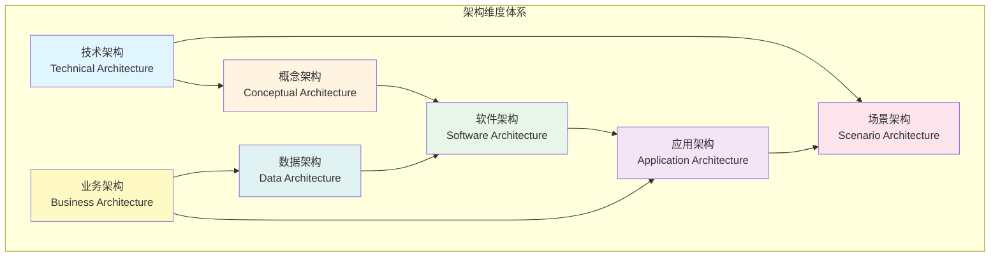

**架构维度说明**：

| 架构维度     | 定义范围                   | CNCF 关联              | 优先级 |
| ------------ | -------------------------- | ---------------------- | ------ |
| **技术架构** | 硬件、软件、网络等基础设施 | Kubernetes、容器运行时 | P0     |
| **概念架构** | 系统高层抽象模型           | 云原生理念、微服务概念 | P0     |
| **数据架构** | 数据结构、存储、处理       | etcd、Vitess、数据存储 | P1     |
| **业务架构** | 业务流程、组织、战略       | 业务敏捷性、DevOps     | P1     |
| **软件架构** | 软件结构、组件、接口       | 微服务、服务网格       | P0     |
| **应用架构** | 应用系统结构和组件         | 容器化应用、12-Factor  | P0     |
| **场景架构** | 特定场景的架构设计         | 边缘计算、Serverless   | P1     |

### 28.2.2 架构关系矩阵

**架构间依赖关系**：

| 架构维度     | 依赖维度           | 关系类型 | 说明                     |
| ------------ | ------------------ | -------- | ------------------------ |
| **概念架构** | -                  | 独立     | 高层抽象，指导其他架构   |
| **技术架构** | -                  | 独立     | 基础设施层，支撑其他架构 |
| **软件架构** | 概念架构、技术架构 | 依赖     | 基于概念和技术实现       |
| **应用架构** | 软件架构、业务架构 | 依赖     | 应用实现业务需求         |
| **数据架构** | 技术架构、业务架构 | 依赖     | 数据支撑业务和技术       |
| **场景架构** | 应用架构、技术架构 | 依赖     | 特定场景的组合架构       |
| **业务架构** | -                  | 独立     | 业务层，指导技术架构     |

### 28.2.3 CNCF 架构定义

**CNCF 对云原生架构的定义**（根据 CNCF 官方文档，2025-11-03）：

> 云原生计算使用开源软件栈将应用程序部署为微服务，将每个部分打包到自己的容器中，
> 并动态编排这些容器以优化资源利用率。云原生技术使组织能够在现代动态环境（如公共
> 云、私有云和混合云）中构建和运行可扩展的应用程序。

**CNCF 架构核心要素**：

1. **容器化**（Containerization）：应用程序打包到容器中
2. **微服务**（Microservices）：应用程序拆分为微服务
3. **服务网格**（Service Mesh）：微服务间通信管理
4. **声明式 API**（Declarative APIs）：声明式配置和管理
5. **动态编排**（Dynamic Orchestration）：容器动态编排和调度

---

## 28.3 技术架构（Technical Architecture）

### 28.3.1 CNCF 定义

**CNCF 技术架构定义**：

技术架构描述了云原生系统的技术实现基础设施，包括：

- **容器运行时**（Container Runtime）：如 containerd、runc、crun
- **容器编排**（Container Orchestration）：如 Kubernetes、K3s
- **服务发现**（Service Discovery）：如 CoreDNS、etcd
- **网络插件**（Network Plugins）：如 CNI、Calico、Cilium
- **存储插件**（Storage Plugins）：如 CSI、Ceph、Rook

### 28.3.2 Wikipedia 定义

**Wikipedia - Technical Architecture**（2025-11-03）：

> Technical architecture describes the technical infrastructure of a system,
> including hardware, software, network components, and their relationships and
> interactions.

**关键要素**：

- **硬件组件**：服务器、存储设备、网络设备
- **软件组件**：操作系统、中间件、数据库管理系统
- **网络拓扑**：组件间的连接方式和通信协议
- **技术标准**：技术规范和接口定义

### 28.3.3 核心概念

**技术架构核心概念**：

1. **基础设施层**（Infrastructure Layer）

   - 物理硬件：服务器、网络设备、存储设备
   - 虚拟化层：Hypervisor、容器运行时
   - 编排层：Kubernetes、K3s

2. **接口抽象层**（Interface Abstraction Layer）

   - CRI（Container Runtime Interface）
   - CNI（Container Network Interface）
   - CSI（Container Storage Interface）

3. **网络层**（Network Layer）

   - 网络插件：Flannel、Calico、Cilium
   - 服务代理：Envoy、Traefik
   - 负载均衡：Service、Ingress

4. **存储层**（Storage Layer）
   - 存储插件：CSI 插件
   - 存储类型：PV、PVC、StorageClass
   - 数据持久化：Volume、ConfigMap、Secret

### 28.3.4 关键属性

**技术架构关键属性**：

| 属性                            | 定义                     | CNCF 实现            | 重要性     |
| ------------------------------- | ------------------------ | -------------------- | ---------- |
| **可扩展性**（Scalability）     | 系统处理负载增长的能力   | Kubernetes 水平扩展  | ⭐⭐⭐⭐⭐ |
| **可靠性**（Reliability）       | 系统在故障情况下继续运行 | 自愈机制、多副本     | ⭐⭐⭐⭐⭐ |
| **性能**（Performance）         | 系统响应时间和吞吐量     | 资源调度、网络优化   | ⭐⭐⭐⭐   |
| **安全性**（Security）          | 系统抵御威胁的能力       | 网络策略、RBAC       | ⭐⭐⭐⭐⭐ |
| **可维护性**（Maintainability） | 系统易于维护和升级       | 插件化架构、API 驱动 | ⭐⭐⭐⭐   |

### 28.3.5 架构关系

**技术架构与其他架构的关系**：

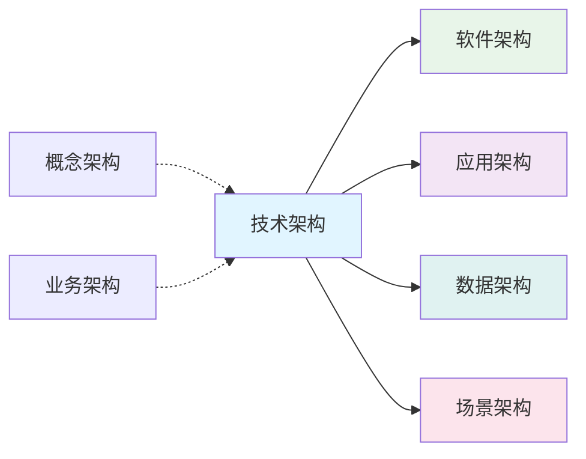

**关系说明**：

- **技术架构 → 软件架构**：提供基础设施支撑
- **技术架构 → 应用架构**：提供运行时环境
- **技术架构 → 数据架构**：提供存储和网络基础设施
- **技术架构 → 场景架构**：提供特定场景的技术实现
- **概念架构 ⇢ 技术架构**：指导技术选型
- **业务架构 ⇢ 技术架构**：业务需求驱动技术选择

### 28.3.6 云原生技术架构

**CNCF 技术架构实现**：

#### 28.3.6.1 容器运行时层

| 技术           | CNCF 状态 | 用途           | 示例               |
| -------------- | --------- | -------------- | ------------------ |
| **containerd** | 毕业项目  | 容器运行时管理 | Docker、Kubernetes |
| **runc**       | 毕业项目  | OCI 运行时     | 标准容器运行时     |
| **crun**       | 孵化项目  | 替代 runc      | 轻量级容器运行时   |

#### 28.3.6.2 容器编排层

| 技术           | CNCF 状态 | 用途              | 示例           |
| -------------- | --------- | ----------------- | -------------- |
| **Kubernetes** | 毕业项目  | 容器编排平台      | 企业级容器编排 |
| **K3s**        | 社区项目  | 轻量级 Kubernetes | 边缘计算、IoT  |

#### 28.3.6.3 网络层

| 技术       | CNCF 状态 | 用途           | 示例         |
| ---------- | --------- | -------------- | ------------ |
| **CNI**    | 标准规范  | 容器网络接口   | 网络插件规范 |
| **Calico** | 会员项目  | 网络策略和路由 | 企业网络     |
| **Cilium** | 孵化项目  | eBPF 网络      | 高性能网络   |

#### 28.3.6.4 存储层

| 技术     | CNCF 状态 | 用途         | 示例         |
| -------- | --------- | ------------ | ------------ |
| **CSI**  | 标准规范  | 容器存储接口 | 存储插件规范 |
| **Rook** | 毕业项目  | 存储编排     | Ceph、NFS    |

---

## 28.4 概念架构（Conceptual Architecture）

### 28.4.1 CNCF 定义

**CNCF 概念架构定义**：

概念架构定义了云原生系统的高层次抽象模型，包括：

- **微服务概念**（Microservices）：应用程序拆分为独立的微服务
- **容器化概念**（Containerization）：一次构建，任意运行
- **声明式概念**（Declarative）：声明期望状态，系统自动达成
- **弹性概念**（Elasticity）：根据负载自动扩展和收缩
- **服务网格概念**（Service Mesh）：微服务间通信的透明管理

### 28.4.2 Wikipedia 定义

**Wikipedia - Conceptual Architecture**（2025-11-03）：

> Conceptual architecture provides a high-level view of a system, defining the
> main components, functions, and their relationships, without detailing
> specific technical implementations.

**关键要素**：

- **组件**（Components）：系统的主要部分
- **功能**（Functions）：每个组件提供的主要功能
- **关系**（Relationships）：组件间的交互和数据流
- **约束**（Constraints）：系统的设计约束和原则

### 28.4.3 核心概念

**概念架构核心概念**：

1. **微服务架构**（Microservices Architecture）

   - **定义**：将应用程序拆分为小的、独立的服务
   - **特性**：自治、独立部署、技术多样性
   - **CNCF 关联**：Kubernetes、Istio

2. **容器化概念**（Containerization Concept）

   - **定义**：应用程序及其依赖打包到容器中
   - **特性**：可移植性、隔离性、轻量级
   - **CNCF 关联**：Docker、OCI

3. **声明式概念**（Declarative Concept）

   - **定义**：声明期望状态，系统自动达成
   - **特性**：幂等性、可重现性、自动化
   - **CNCF 关联**：Kubernetes、GitOps

4. **弹性概念**（Elasticity Concept）
   - **定义**：根据负载自动扩展和收缩
   - **特性**：自动扩展、资源优化、成本控制
   - **CNCF 关联**：HPA、VPA、Cluster Autoscaler

### 28.4.4 关键属性

**概念架构关键属性**：

| 属性                              | 定义                         | CNCF 实现      | 重要性     |
| --------------------------------- | ---------------------------- | -------------- | ---------- |
| **抽象性**（Abstraction）         | 隐藏实现细节，关注高层次概念 | Kubernetes API | ⭐⭐⭐⭐⭐ |
| **可理解性**（Understandability） | 易于理解系统整体结构         | 微服务架构图   | ⭐⭐⭐⭐⭐ |
| **可扩展性**（Extensibility）     | 易于添加新的概念和组件       | CRD、Operator  | ⭐⭐⭐⭐   |
| **一致性**（Consistency）         | 概念定义和使用的一致性       | CNCF 标准      | ⭐⭐⭐⭐⭐ |

### 28.4.5 架构关系

**概念架构与其他架构的关系**：

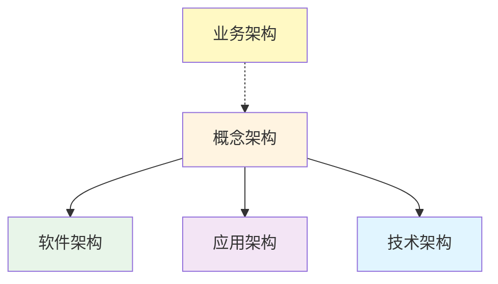

**关系说明**：

- **概念架构 → 软件架构**：提供高层次设计指导
- **概念架构 → 应用架构**：定义应用架构原则
- **概念架构 → 技术架构**：指导技术选型
- **业务架构 ⇢ 概念架构**：业务需求影响概念设计

### 28.4.6 云原生概念架构

**CNCF 概念架构模式**：

#### 28.4.6.1 微服务模式（Microservices Pattern）

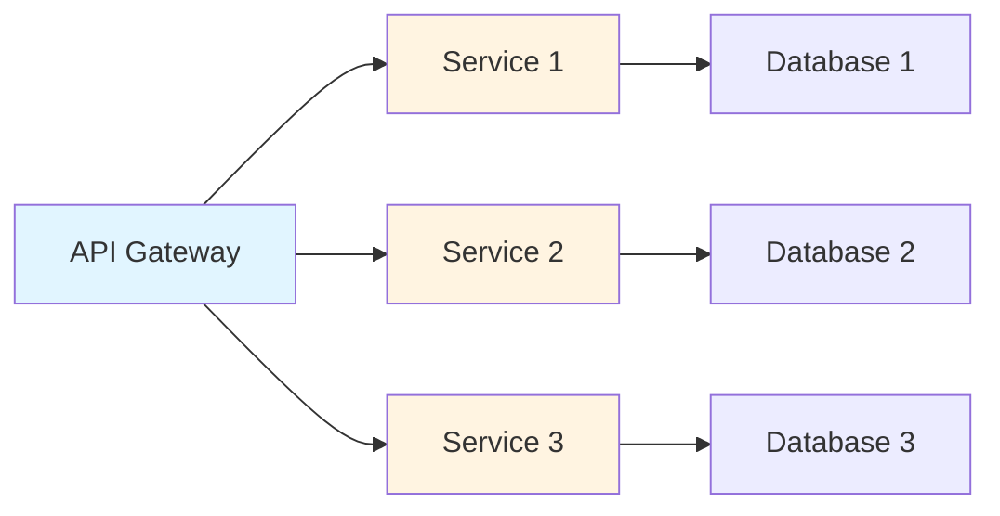

#### 28.4.6.2 服务网格模式（Service Mesh Pattern）

- **数据平面**（Data Plane）：Envoy、Linkerd
- **控制平面**（Control Plane）：Istio、Linkerd
- **功能**：流量管理、安全、可观测性

#### 28.4.6.3 12-Factor 应用模式（12-Factor App Pattern）

- **CNCF 关联**：云原生应用最佳实践
- **原则**：代码库、依赖、配置、后端服务等 12 个因素

---

## 28.5 数据架构（Data Architecture）

### 28.5.1 CNCF 定义

**CNCF 数据架构定义**：

数据架构描述了云原生系统的数据结构、存储、处理和管理方式，包括：

- **分布式存储**（Distributed Storage）：如 etcd、Vitess
- **数据流处理**（Data Streaming）：如 Kafka、NATS
- **数据持久化**（Data Persistence）：如 CSI、Rook
- **数据一致性**（Data Consistency）：如 etcd 一致性协议

### 28.5.2 Wikipedia 定义

**Wikipedia - Data Architecture**（2025-11-03）：

> Data architecture defines the structure, storage, management, and use of data,
> including data models, database design, data flows, and data governance.

**关键要素**：

- **数据模型**（Data Models）：描述数据的结构和关系
- **数据库设计**（Database Design）：物理和逻辑数据库设计
- **数据流**（Data Flows）：数据在系统中的流动路径
- **数据治理**（Data Governance）：数据质量、安全和合规

### 28.5.3 核心概念

**数据架构核心概念**：

1. **数据存储层**（Data Storage Layer）

   - **键值存储**：etcd（Kubernetes 元数据）
   - **关系数据库**：Vitess（分布式 MySQL）
   - **对象存储**：MinIO、S3

2. **数据访问层**（Data Access Layer）

   - **API 接口**：REST API、gRPC
   - **查询接口**：SQL、NoSQL 查询
   - **数据同步**：CDC、数据复制

3. **数据治理层**（Data Governance Layer）
   - **数据安全**：加密、访问控制
   - **数据质量**：数据验证、清洗
   - **数据合规**：GDPR、数据保护

### 28.5.4 关键属性

**数据架构关键属性**：

| 属性                       | 定义                     | CNCF 实现        | 重要性     |
| -------------------------- | ------------------------ | ---------------- | ---------- |
| **一致性**（Consistency）  | 数据在不同副本间的一致性 | etcd Raft        | ⭐⭐⭐⭐⭐ |
| **可用性**（Availability） | 数据访问的可用性         | 多副本、故障转移 | ⭐⭐⭐⭐⭐ |
| **持久性**（Durability）   | 数据持久化存储           | PV、PVC          | ⭐⭐⭐⭐⭐ |
| **性能**（Performance）    | 数据读写性能             | 缓存、索引       | ⭐⭐⭐⭐   |
| **安全性**（Security）     | 数据安全保护             | 加密、RBAC       | ⭐⭐⭐⭐⭐ |

### 28.5.5 架构关系

**数据架构与其他架构的关系**：

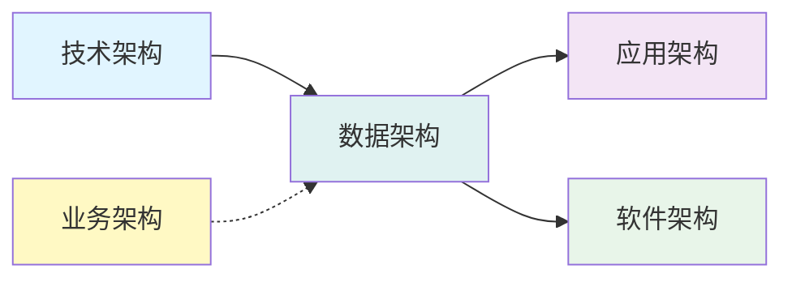

**关系说明**：

- **数据架构 → 应用架构**：提供数据访问接口
- **数据架构 → 软件架构**：定义数据模型和访问模式
- **技术架构 → 数据架构**：提供存储和网络基础设施
- **业务架构 ⇢ 数据架构**：业务需求驱动数据设计

### 28.5.6 云原生数据架构

**CNCF 数据架构实现**：

#### 28.5.6.1 分布式存储

| 技术       | CNCF 状态 | 用途             | 示例              |
| ---------- | --------- | ---------------- | ----------------- |
| **etcd**   | 毕业项目  | 分布式键值存储   | Kubernetes 元数据 |
| **Vitess** | 毕业项目  | 分布式 MySQL     | 大规模数据库集群  |
| **TiDB**   | 会员项目  | 分布式关系数据库 | HTAP 数据库       |

#### 28.5.6.2 数据流处理

| 技术      | CNCF 状态 | 用途           | 示例       |
| --------- | --------- | -------------- | ---------- |
| **Kafka** | 会员项目  | 分布式消息队列 | 事件流处理 |
| **NATS**  | 孵化项目  | 云原生消息系统 | 微服务通信 |

#### 28.5.6.3 数据持久化

| 技术     | CNCF 状态 | 用途         | 示例         |
| -------- | --------- | ------------ | ------------ |
| **CSI**  | 标准规范  | 容器存储接口 | 存储插件规范 |
| **Rook** | 毕业项目  | 存储编排     | Ceph、NFS    |

---

## 28.6 业务架构（Business Architecture）

### 28.6.1 CNCF 定义

**CNCF 业务架构定义**：

业务架构描述了云原生技术如何支持业务战略和流程，包括：

- **敏捷开发**（Agile Development）：快速响应业务需求
- **持续交付**（Continuous Delivery）：自动化部署和发布
- **DevOps 文化**（DevOps Culture）：开发和运维协作
- **业务弹性**（Business Elasticity）：根据业务负载自动扩展

### 28.6.2 Wikipedia 定义

**Wikipedia - Business Architecture**（2025-11-03）：

> Business architecture describes the business strategy, governance,
> organizational structure, and key business processes of an organization,
> ensuring IT systems align with business objectives.

**关键要素**：

- **业务战略**（Business Strategy）：组织的长期目标和方向
- **治理**（Governance）：业务决策和管理的框架
- **组织结构**（Organizational Structure）：部门、团队和角色的安排
- **业务流程**（Business Processes）：实现业务目标的活动和步骤

### 28.6.3 核心概念

**业务架构核心概念**：

1. **敏捷业务模式**（Agile Business Model）

   - **定义**：快速响应市场变化和业务需求
   - **特性**：迭代开发、快速反馈、持续改进
   - **CNCF 关联**：GitOps、CI/CD

2. **DevOps 文化**（DevOps Culture）

   - **定义**：开发和运维协作，提升交付效率
   - **特性**：自动化、协作、文化转变
   - **CNCF 关联**：Tekton、Argo

3. **业务弹性**（Business Elasticity）
   - **定义**：根据业务负载自动扩展和收缩
   - **特性**：自动扩展、成本优化、快速响应
   - **CNCF 关联**：HPA、VPA、Cluster Autoscaler

### 28.6.4 关键属性

**业务架构关键属性**：

| 属性                               | 定义             | CNCF 实现          | 重要性     |
| ---------------------------------- | ---------------- | ------------------ | ---------- |
| **敏捷性**（Agility）              | 快速响应业务需求 | GitOps、CI/CD      | ⭐⭐⭐⭐⭐ |
| **成本效益**（Cost-Effectiveness） | 降低 IT 成本     | 资源优化、自动扩展 | ⭐⭐⭐⭐⭐ |
| **可扩展性**（Scalability）        | 支持业务增长     | Kubernetes 扩展    | ⭐⭐⭐⭐⭐ |
| **风险管理**（Risk Management）    | 降低业务风险     | 高可用、容错       | ⭐⭐⭐⭐   |

### 28.6.5 架构关系

**业务架构与其他架构的关系**：

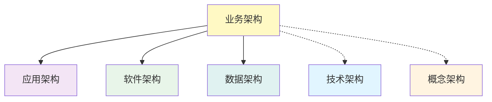

**关系说明**：

- **业务架构 → 应用架构**：业务需求驱动应用设计
- **业务架构 → 软件架构**：业务需求影响软件架构
- **业务架构 → 数据架构**：业务需求驱动数据设计
- **业务架构 ⇢ 技术架构**：业务需求指导技术选型
- **业务架构 ⇢ 概念架构**：业务需求影响概念设计

### 28.6.6 云原生业务架构

**CNCF 业务架构实践**：

#### 28.6.6.1 敏捷开发实践

- **GitOps**：声明式配置管理
- **CI/CD**：自动化构建和部署
- **Tekton**：云原生 CI/CD 平台

#### 28.6.6.2 DevOps 工具链

| 工具       | CNCF 状态 | 用途         | 示例       |
| ---------- | --------- | ------------ | ---------- |
| **Tekton** | 孵化项目  | 云原生 CI/CD | 构建流水线 |
| **Argo**   | 会员项目  | GitOps 工具  | 持续部署   |

#### 28.6.6.3 业务指标监控

- **Prometheus**：监控和告警
- **Grafana**：可视化仪表板
- **Jaeger**：分布式追踪

---

## 28.7 软件架构（Software Architecture）

### 28.7.1 CNCF 定义

**CNCF 软件架构定义**：

软件架构描述了云原生软件系统的结构、组件和交互方式，包括：

- **微服务架构**（Microservices Architecture）：服务拆分和通信
- **服务网格**（Service Mesh）：微服务间通信管理
- **API 网关**（API Gateway）：统一 API 入口
- **事件驱动架构**（Event-Driven Architecture）：基于事件的通信

### 28.7.2 Wikipedia 定义

**Wikipedia - Software Architecture**（2025-11-03）：

> Software architecture defines the high-level structure of a software system,
> including components, modules, interfaces, and their interactions, ensuring
> the system meets functional and non-functional requirements.

**关键要素**：

- **组件**（Components）：独立的功能单元
- **接口**（Interfaces）：组件间的交互方式和协议
- **模式**（Patterns）：常见的设计模式
- **约束**（Constraints）：架构设计和实现的约束

### 28.7.3 核心概念

**软件架构核心概念**：

1. **微服务架构**（Microservices Architecture）

   - **定义**：将应用程序拆分为小的、独立的服务
   - **特性**：自治、独立部署、技术多样性
   - **CNCF 关联**：Kubernetes、Istio

2. **服务网格**（Service Mesh）

   - **定义**：微服务间通信的基础设施层
   - **特性**：流量管理、安全、可观测性
   - **CNCF 关联**：Istio、Linkerd

3. **API 网关**（API Gateway）
   - **定义**：统一 API 入口和路由
   - **特性**：路由、负载均衡、认证授权
   - **CNCF 关联**：Envoy、Traefik

### 28.7.4 关键属性

**软件架构关键属性**：

| 属性                            | 定义                     | CNCF 实现       | 重要性     |
| ------------------------------- | ------------------------ | --------------- | ---------- |
| **可维护性**（Maintainability） | 易于维护和升级           | 微服务、模块化  | ⭐⭐⭐⭐⭐ |
| **可扩展性**（Scalability）     | 易于扩展功能             | Kubernetes 扩展 | ⭐⭐⭐⭐⭐ |
| **性能**（Performance）         | 系统响应时间和吞吐量     | 服务网格优化    | ⭐⭐⭐⭐   |
| **可靠性**（Reliability）       | 系统在故障情况下继续运行 | 故障隔离、重试  | ⭐⭐⭐⭐⭐ |

### 28.7.5 架构关系

**软件架构与其他架构的关系**：

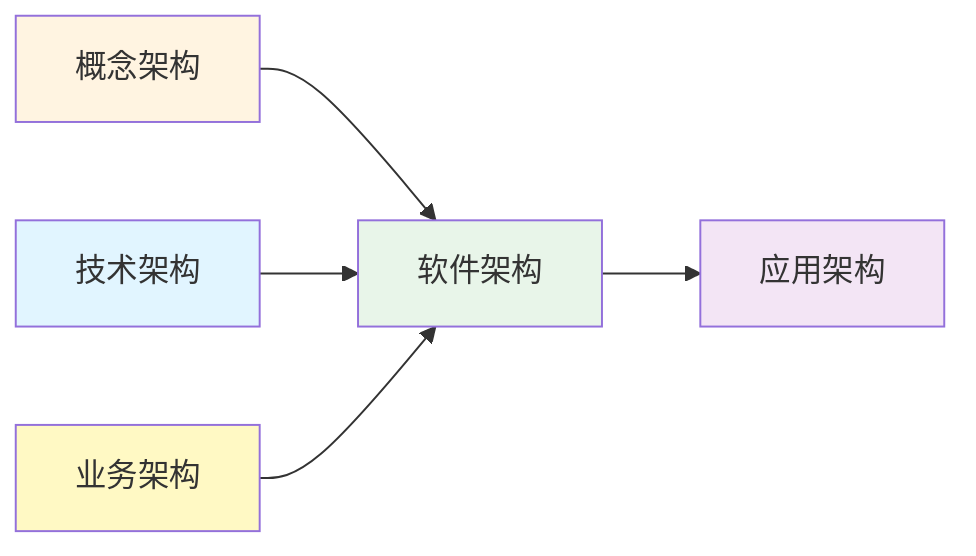

**关系说明**：

- **软件架构 → 应用架构**：提供软件结构支撑
- **概念架构 → 软件架构**：提供高层次设计指导
- **技术架构 → 软件架构**：提供技术基础设施
- **业务架构 → 软件架构**：业务需求驱动软件设计

### 28.7.6 云原生软件架构

**CNCF 软件架构模式**：

#### 28.7.6.1 微服务模式（Microservices Pattern）

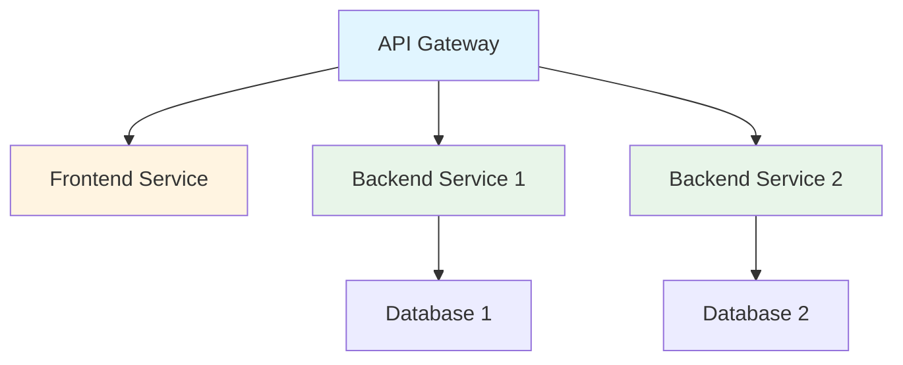

#### 28.7.6.2 服务网格模式（Service Mesh Pattern）

- **数据平面**：Envoy、Linkerd
- **控制平面**：Istio、Linkerd
- **功能**：流量管理、安全、可观测性

#### 28.7.6.3 CNCF 软件架构项目

| 项目        | CNCF 状态 | 用途     | 示例               |
| ----------- | --------- | -------- | ------------------ |
| **Istio**   | 孵化项目  | 服务网格 | 流量管理、安全     |
| **Linkerd** | 毕业项目  | 服务网格 | 轻量级服务网格     |
| **Envoy**   | 毕业项目  | 服务代理 | API 网关、负载均衡 |

---

## 28.8 应用架构（Application Architecture）

### 28.8.1 CNCF 定义

**CNCF 应用架构定义**：

应用架构描述了云原生应用程序的结构、组件和部署方式，包括：

- **12-Factor 应用**（12-Factor App）：云原生应用最佳实践
- **容器化应用**（Containerized Applications）：应用程序容器化
- **无状态应用**（Stateless Applications）：无状态应用设计
- **可观测应用**（Observable Applications）：应用可观测性

### 28.8.2 Wikipedia 定义

**Wikipedia - Application Architecture**（2025-11-03）：

> Application architecture describes the structure of a specific application,
> including frontend, backend, data storage, and external integrations, ensuring
> the application meets functional and non-functional requirements.

**关键要素**：

- **前端**（Frontend）：用户界面和用户交互
- **后端**（Backend）：业务逻辑和数据处理
- **数据存储**（Data Storage）：应用使用的数据库和数据管理
- **外部集成**（External Integrations）：与其他系统或服务的接口

### 28.8.3 核心概念

**应用架构核心概念**：

1. **12-Factor 应用**（12-Factor App）

   - **定义**：云原生应用开发的 12 个最佳实践
   - **原则**：代码库、依赖、配置、后端服务等
   - **CNCF 关联**：容器化、微服务

2. **容器化应用**（Containerized Applications）

   - **定义**：应用程序打包到容器中
   - **特性**：可移植性、隔离性、轻量级
   - **CNCF 关联**：Docker、Kubernetes

3. **无状态应用**（Stateless Applications）
   - **定义**：应用不保存状态，状态外部化
   - **特性**：易于扩展、高可用、简单
   - **CNCF 关联**：HPA、多副本

### 28.8.4 关键属性

**应用架构关键属性**：

| 属性                          | 定义               | CNCF 实现          | 重要性     |
| ----------------------------- | ------------------ | ------------------ | ---------- |
| **可移植性**（Portability）   | 应用在不同环境运行 | 容器化             | ⭐⭐⭐⭐⭐ |
| **可扩展性**（Scalability）   | 应用易于扩展       | HPA、多副本        | ⭐⭐⭐⭐⭐ |
| **可观测性**（Observability） | 应用状态可见       | Prometheus、Jaeger | ⭐⭐⭐⭐⭐ |
| **可靠性**（Reliability）     | 应用高可用         | 多副本、健康检查   | ⭐⭐⭐⭐⭐ |

### 28.8.5 架构关系

**应用架构与其他架构的关系**：

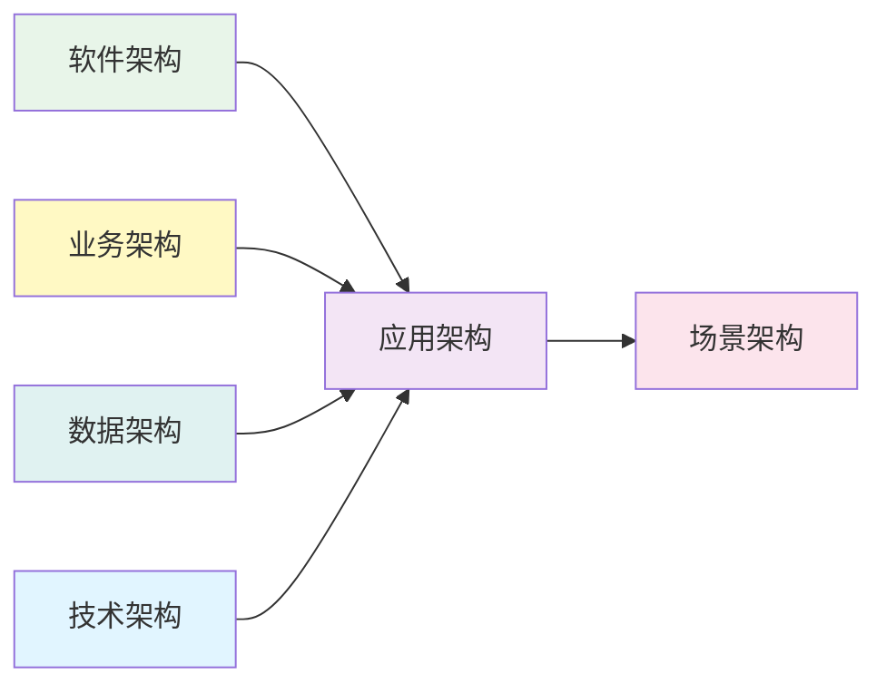

**关系说明**：

- **应用架构 → 场景架构**：应用实现特定场景
- **软件架构 → 应用架构**：提供软件结构支撑
- **业务架构 → 应用架构**：业务需求驱动应用设计
- **数据架构 → 应用架构**：提供数据访问接口
- **技术架构 → 应用架构**：提供运行时环境

### 28.8.6 云原生应用架构

**CNCF 应用架构实践**：

#### 28.8.6.1 12-Factor 应用原则

1. **代码库**（Codebase）：一个代码库，多个部署
2. **依赖**（Dependencies）：显式声明依赖
3. **配置**（Config）：配置存储在环境中
4. **后端服务**（Backing Services）：后端服务作为附加资源
5. **构建、发布、运行**（Build, Release, Run）：严格分离构建和运行
6. **进程**（Processes）：应用作为无状态进程运行
7. **端口绑定**（Port Binding）：通过端口绑定提供服务
8. **并发**（Concurrency）：通过进程模型扩展
9. **可处置性**（Disposability）：快速启动和优雅关闭
10. **开发/生产环境一致性**（Dev/Prod Parity）：开发和生产环境尽可能相似
11. **日志**（Logs）：日志作为事件流
12. **管理进程**（Admin Processes）：管理任务作为一次性进程运行

#### 28.8.6.2 CNCF 应用架构工具

| 工具          | CNCF 状态 | 用途       | 示例                |
| ------------- | --------- | ---------- | ------------------- |
| **Helm**      | 毕业项目  | 应用包管理 | Kubernetes 应用部署 |
| **Kustomize** | 会员项目  | 配置管理   | 声明式配置定制      |
| **Operator**  | 模式      | 应用自动化 | 应用生命周期管理    |

---

## 28.9 场景架构（Scenario Architecture）

### 28.9.1 CNCF 定义

**CNCF 场景架构定义**：

场景架构描述了特定应用场景下的架构设计，包括：

- **边缘计算场景**（Edge Computing）：边缘节点架构
- **Serverless 场景**（Serverless）：函数即服务架构
- **AI/ML 场景**（AI/ML）：机器学习工作负载架构
- **混合云场景**（Hybrid Cloud）：多云和混合云架构

### 28.9.2 Wikipedia 定义

**Wikipedia - Scenario Architecture**（2025-11-03）：

> Scenario architecture describes the system architecture designed for specific
> use scenarios, meeting particular requirements and constraints, ensuring the
> system performs well in those scenarios.

**关键要素**：

- **场景需求**（Scenario Requirements）：特定场景的功能需求
- **约束条件**（Constraints）：场景特定的约束
- **性能要求**（Performance Requirements）：场景特定的性能要求
- **架构模式**（Architecture Patterns）：场景特定的架构模式

### 28.9.3 核心概念

**场景架构核心概念**：

1. **边缘计算场景**（Edge Computing Scenario）

   - **定义**：在边缘节点部署应用
   - **特性**：低延迟、离线能力、资源受限
   - **CNCF 关联**：K3s、KubeEdge

2. **Serverless 场景**（Serverless Scenario）

   - **定义**：函数即服务，按需执行
   - **特性**：无服务器管理、按使用付费、快速启动
   - **CNCF 关联**：Knative、OpenFaaS

3. **AI/ML 场景**（AI/ML Scenario）
   - **定义**：机器学习工作负载部署
   - **特性**：GPU 支持、大规模并行、模型服务
   - **CNCF 关联**：Kubeflow、Seldon

### 28.9.4 关键属性

**场景架构关键属性**：

| 属性                                     | 定义                 | CNCF 实现            | 重要性     |
| ---------------------------------------- | -------------------- | -------------------- | ---------- |
| **场景适配性**（Scenario Fit）           | 架构适配特定场景需求 | 场景特定架构         | ⭐⭐⭐⭐⭐ |
| **性能优化**（Performance Optimization） | 场景特定性能优化     | 边缘优化、GPU 加速   | ⭐⭐⭐⭐⭐ |
| **成本优化**（Cost Optimization）        | 场景特定成本优化     | Serverless、自动扩展 | ⭐⭐⭐⭐   |
| **可扩展性**（Scalability）              | 场景特定扩展需求     | 边缘扩展、AI 扩展    | ⭐⭐⭐⭐   |

### 28.9.5 架构关系

**场景架构与其他架构的关系**：

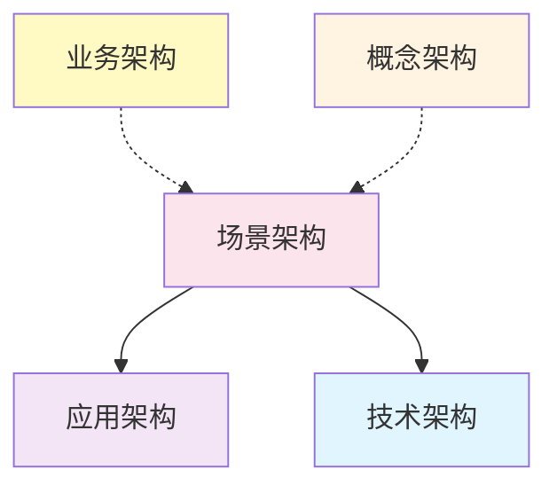

**关系说明**：

- **场景架构 → 应用架构**：特定场景的应用设计
- **场景架构 → 技术架构**：特定场景的技术选型
- **业务架构 ⇢ 场景架构**：业务需求驱动场景设计
- **概念架构 ⇢ 场景架构**：概念设计指导场景实现

### 28.9.6 云原生场景架构

**CNCF 场景架构实现**：

#### 28.9.6.1 边缘计算场景

| 技术              | CNCF 状态 | 用途              | 示例     |
| ----------------- | --------- | ----------------- | -------- |
| **K3s**           | 社区项目  | 轻量级 Kubernetes | 边缘节点 |
| **KubeEdge**      | 会员项目  | 边缘计算平台      | IoT 边缘 |
| **EdgeX Foundry** | 会员项目  | 边缘计算框架      | 工业 IoT |

#### 28.9.6.2 Serverless 场景

| 技术         | CNCF 状态 | 用途            | 示例     |
| ------------ | --------- | --------------- | -------- |
| **Knative**  | 孵化项目  | Serverless 平台 | 函数服务 |
| **OpenFaaS** | 会员项目  | 函数即服务      | 函数平台 |

#### 28.9.6.3 AI/ML 场景

| 技术         | CNCF 状态 | 用途          | 示例     |
| ------------ | --------- | ------------- | -------- |
| **Kubeflow** | 孵化项目  | ML 工作流平台 | 机器学习 |
| **Seldon**   | 会员项目  | ML 模型服务   | 模型部署 |

---

## 28.10 架构对齐与论证

### 28.10.1 架构对齐原则

**架构对齐核心原则**（基于 CNCF 和 Wikipedia 标准，2025-11-03）：

1. **一致性原则**（Consistency Principle）

   - **定义**：架构定义和实现保持一致
   - **实践**：使用 CNCF 标准、遵循最佳实践
   - **验证**：架构审查、代码审查

2. **可追溯性原则**（Traceability Principle）

   - **定义**：架构决策可追溯到业务需求
   - **实践**：架构决策记录（ADR）、需求追踪
   - **验证**：需求矩阵、决策日志

3. **可维护性原则**（Maintainability Principle）
   - **定义**：架构易于维护和演进
   - **实践**：模块化设计、接口抽象
   - **验证**：技术债务评估、架构演进计划

### 28.10.2 架构决策框架

**架构决策流程**：

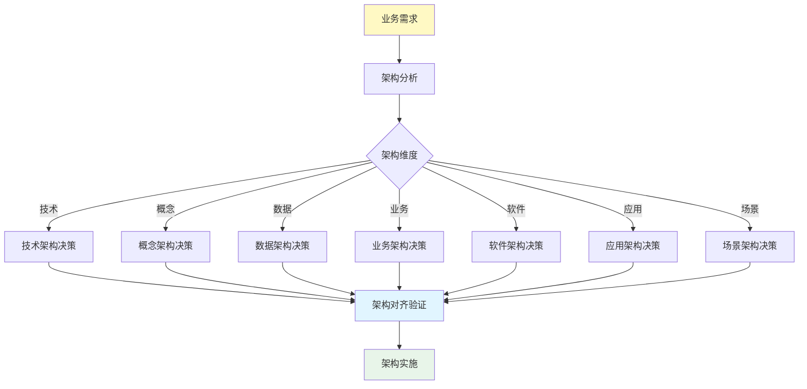

**架构决策步骤**：

1. **需求分析**：理解业务需求和技术约束
2. **架构分析**：分析各架构维度的要求
3. **架构决策**：选择适合的架构方案
4. **架构对齐**：确保架构间对齐和一致
5. **架构实施**：实施架构设计

### 28.10.3 架构质量属性

**架构质量属性评估**（基于 CNCF 和 Wikipedia 标准）：

| 质量属性                        | 定义                     | 评估维度                 | CNCF 标准               |
| ------------------------------- | ------------------------ | ------------------------ | ----------------------- |
| **性能**（Performance）         | 系统响应时间和吞吐量     | 延迟、吞吐量、资源利用率 | Kubernetes 性能基准     |
| **可扩展性**（Scalability）     | 系统处理负载增长的能力   | 水平扩展、垂直扩展       | HPA、Cluster Autoscaler |
| **可靠性**（Reliability）       | 系统在故障情况下继续运行 | 可用性、容错、恢复       | 自愈机制、多副本        |
| **安全性**（Security）          | 系统抵御威胁的能力       | 认证、授权、加密         | RBAC、网络策略          |
| **可维护性**（Maintainability） | 系统易于维护和升级       | 模块化、文档、测试       | Operator、CRD           |
| **可观测性**（Observability）   | 系统状态可见和可理解     | 监控、日志、追踪         | Prometheus、Jaeger      |

---

## 28.11 参考

### 28.11.1 CNCF 参考

- [CNCF - Cloud Native Definition](https://github.com/cncf/toc/blob/main/DEFINITION.md)
- [CNCF - Cloud Native Architecture](https://www.cncf.io/)
- [CNCF - Graduated Projects](https://www.cncf.io/projects/)
- [CNCF - Landscape](https://landscape.cncf.io/)

### 28.11.2 Wikipedia 参考

- [Wikipedia - Enterprise Architecture](https://en.wikipedia.org/wiki/Enterprise_architecture)
- [Wikipedia - Software Architecture](https://en.wikipedia.org/wiki/Software_architecture)
- [Wikipedia - Technical Architecture](https://en.wikipedia.org/wiki/Technical_architecture)
- [Wikipedia - Data Architecture](https://en.wikipedia.org/wiki/Data_architecture)
- [Wikipedia - Business Architecture](https://en.wikipedia.org/wiki/Business_architecture)

### 28.11.3 相关文档

- **[00. Docker](00-docker/docker.md)** - 容器化引擎技术规范
- **[01. Kubernetes](01-kubernetes/kubernetes.md)** - 集群编排架构与实践
- **[02. K3s](02-k3s/k3s.md)** - 轻量级 Kubernetes 架构
- **[10. 技术决策模型](../COGNITIVE/10-decision-models/decision-models.md)** -
  技术选型决策框架
- **[05. 全局架构设计](../COGNITIVE/05-architecture-design/architecture-design.md)** -
  技术组合方案与决策框架

---

**最后更新**：2025-11-03 **维护者**：项目团队
