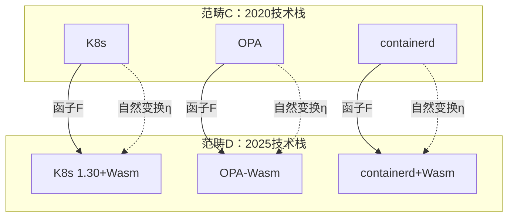

# 范畴论视角

**最后更新**: 2025-11-06 **维护者**: 项目团队

> 📋 **主文档链接**：[30.17 范畴论视角](../concept-relations-matrix.md#3017-范畴论视角)

## 30.17.1 对象与态射

**范畴定义**：C = (Obj(C), Mor(C), ∘)

其中：

- **Obj(C)** = {K3s, WasmEdge, OPA, Gatekeeper, ...}
- **Mor(C)** = {包含, 组合, 依赖, ...}
- **∘** = 态射复合

**对象与态射关系**：

| 对象         | 态射 | 目标对象   | 含义             |
| ------------ | ---- | ---------- | ---------------- |
| **K3s**      | 包含 | Kubernetes | K3s ⊃ K8s        |
| **WasmEdge** | 组合 | K3s        | WasmEdge ∘ K3s   |
| **OPA**      | 依赖 | Gatekeeper | Gatekeeper → OPA |

## 30.17.2 函子与自然变换

**函子定义**：F: C → D

**技术栈函子**：

```text
F(隔离层级) → F(编排范围) → F(策略治理)
```

**自然变换**：η: F → G

**技术演进自然变换**：

```text
η: 2020技术栈 → 2025技术栈
η(K8s) = K8s 1.30+Wasm
η(OPA) = OPA-Wasm
η(containerd) = containerd+Wasm支持
```

## 30.17.3 范畴化关系

**范畴化关系图**：



**范畴化关系矩阵**：

| 关系类型     | 范畴表示              | 2025 实现 | 范畴性质 |
| ------------ | --------------------- | --------- | -------- |
| **包含关系** | Hom(A, B)             | A ⊃ B     | 单调性   |
| **组合关系** | Hom(A, B) × Hom(B, C) | A ∘ B ∘ C | 结合性   |
| **依赖关系** | Hom(A, B)             | A → B     | 传递性   |

---

**最后更新**：2025-11-06 **维护者**：项目团队

