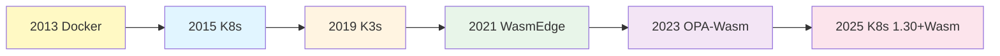

# 动态演进分析

**最后更新**: 2025-11-06 **维护者**: 项目团队

> 📋 **主文档链
> 接**：[30.16 动态演进分析](../concept-relations-matrix.md#3016-动态演进分析)

## 30.16.1 技术演进路径

**2025 年技术演进路径**：



**演进关系矩阵**：

| 技术              | 前驱技术     | 演进关系 | 演进原因         |
| ----------------- | ------------ | -------- | ---------------- |
| **Kubernetes**    | Docker       | 包含演进 | 容器编排需求     |
| **K3s**           | Kubernetes   | 轻量演进 | 边缘计算需求     |
| **WasmEdge**      | 容器运行时   | 并行演进 | 字节码运行时需求 |
| **OPA-Wasm**      | OPA          | 优化演进 | 性能优化需求     |
| **K8s 1.30+Wasm** | K8s+WasmEdge | 原生演进 | 标准化需求       |

## 30.16.2 关系演进模式

**关系演进模式**：

1. **包含关系演进**：

   ```text
   虚拟化 ⊃ 容器化 ⊃ 沙盒化
   → 隔离层级递进
   ```

2. **组合关系演进**：

   ```text
   K3s + WasmEdge → 边缘Wasm编排
   → 功能组合创新
   ```

3. **依赖关系演进**：

   ```text
   应用 → K3s → containerd → crun → WasmEdge
   → 依赖链优化
   ```

**演进速度**：

| 关系类型     | 演进速度 | 2025 年状态 | 演进趋势 |
| ------------ | -------- | ----------- | -------- |
| **包含关系** | 慢       | 稳定        | 层级固化 |
| **组合关系** | 快       | 活跃        | 持续创新 |
| **依赖关系** | 中       | 优化        | 简化路径 |

## 30.16.3 属性演进趋势

**属性演进趋势（2025）**：

| 属性         | 2020 年  | 2025 年    | 演进趋势 | 关键驱动   |
| ------------ | -------- | ---------- | -------- | ---------- |
| **冷启动**   | 1-5s     | <10ms      | ↓ 100x   | WasmEdge   |
| **内存占用** | 10-50MB  | 1-5MB      | ↓ 10x    | Wasm 优化  |
| **镜像大小** | 10-100MB | <2MB       | ↓ 50x    | 多阶段构建 |
| **策略延迟** | 10-50ms  | <1ms       | ↓ 50x    | OPA-Wasm   |
| **隔离强度** | ⭐⭐⭐   | ⭐⭐⭐⭐⭐ | ↑ 增强   | 沙盒化     |

**演进预测（2030）**：

```text
2030年预测：
- 冷启动：<1ms（量子级）
- 内存占用：<1MB（极致优化）
- 镜像大小：<500KB（最小化）
- 策略延迟：<100µs（硬件加速）
- 隔离强度：⭐⭐⭐⭐⭐⭐（硬件TEE）
```

---

**最后更新**：2025-11-06 **维护者**：项目团队
