# 30. 2025 技术堆栈概念关系矩阵与多维关系分析

**最后更新**: 2025-11-06 **维护者**: 项目团队

## 📑 目录

- [📑 目录](#-目录)
- [30.1 文档定位](#301-文档定位)
- [30.2 2025 技术堆栈概览](#302-2025-技术堆栈概览)
  - [30.2.1 核心技术栈（2025-11-06）](#3021-核心技术栈2025-11-06)
  - [30.2.2 技术栈关系总览](#3022-技术栈关系总览)
- [30.3 核心概念体系](#303-核心概念体系)
  - [30.3.1 概念定义层](#3031-概念定义层)
    - [30.3.1.1 编排概念](#30311-编排概念)
    - [30.3.1.2 运行时概念](#30312-运行时概念)
    - [30.3.1.3 策略概念](#30313-策略概念)
    - [30.3.1.4 隔离概念](#30314-隔离概念)
  - [30.3.2 概念属性层](#3032-概念属性层)
    - [30.3.2.1 性能属性](#30321-性能属性)
    - [30.3.2.2 安全属性](#30322-安全属性)
    - [30.3.2.3 可扩展性属性](#30323-可扩展性属性)
  - [30.3.3 概念关系层](#3033-概念关系层)
    - [30.3.3.1 包含关系（⊃）](#30331-包含关系)
    - [30.3.3.2 组合关系（∘）](#30332-组合关系)
    - [30.3.3.3 依赖关系（→）](#30333-依赖关系)
  - [30.3.4 概念结构层](#3034-概念结构层)
    - [30.3.4.1 计算结构](#30341-计算结构)
    - [30.3.4.2 控制结构](#30342-控制结构)
    - [30.3.4.3 信息结构](#30343-信息结构)
- [30.4 二维关系矩阵](#304-二维关系矩阵)
  - [30.4.1 技术栈层级矩阵](#3041-技术栈层级矩阵)
  - [30.4.2 功能关系矩阵](#3042-功能关系矩阵)
  - [30.4.3 依赖关系矩阵](#3043-依赖关系矩阵)
  - [30.4.4 兼容性矩阵](#3044-兼容性矩阵)
- [30.5 三维关系空间](#305-三维关系空间)
  - [30.5.1 隔离维度（Y 轴）](#3051-隔离维度y-轴)
  - [30.5.2 编排维度（X 轴）](#3052-编排维度x-轴)
  - [30.5.3 策略维度（Z 轴）](#3053-策略维度z-轴)
  - [30.5.4 三维关系可视化](#3054-三维关系可视化)
- [30.6 多维关系网络](#306-多维关系网络)
  - [30.6.1 四层隔离栈维度](#3061-四层隔离栈维度)
  - [30.6.2 七维架构框架维度](#3062-七维架构框架维度)
  - [30.6.3 时间演进维度](#3063-时间演进维度)
  - [30.6.4 场景应用维度](#3064-场景应用维度)
  - [30.6.5 可观测性维度](#3065-可观测性维度)
- [30.7 概念关系图谱](#307-概念关系图谱)
  - [30.7.1 包含关系图谱](#3071-包含关系图谱)
  - [30.7.2 组合关系图谱](#3072-组合关系图谱)
  - [30.7.3 依赖关系图谱](#3073-依赖关系图谱)
  - [30.7.4 实现关系图谱](#3074-实现关系图谱)
- [30.8 属性关系矩阵](#308-属性关系矩阵)
  - [30.8.1 性能属性矩阵](#3081-性能属性矩阵)
  - [30.8.2 安全属性矩阵](#3082-安全属性矩阵)
  - [30.8.3 可扩展性属性矩阵](#3083-可扩展性属性矩阵)
  - [30.8.4 可观测性属性矩阵](#3084-可观测性属性矩阵)
- [30.9 结构关系分析](#309-结构关系分析)
  - [30.9.1 计算结构分析](#3091-计算结构分析)
  - [30.9.2 控制结构分析](#3092-控制结构分析)
  - [30.9.3 信息结构分析](#3093-信息结构分析)
- [30.10 思维导图](#3010-思维导图)
  - [30.10.1 二维思维导图](#30101-二维思维导图)
  - [30.10.2 三维思维导图](#30102-三维思维导图)
  - [30.10.3 多维思维导图](#30103-多维思维导图)
- [30.11 关系传递规则](#3011-关系传递规则)
  - [30.11.1 包含关系传递](#30111-包含关系传递)
  - [30.11.2 组合关系传递](#30112-组合关系传递)
  - [30.11.3 依赖关系传递](#30113-依赖关系传递)
- [30.12 形式化定义](#3012-形式化定义)
  - [30.12.1 概念集合定义](#30121-概念集合定义)
  - [30.12.2 关系代数定义](#30122-关系代数定义)
  - [30.12.3 多维关系函数](#30123-多维关系函数)
- [30.13 实际应用案例](#3013-实际应用案例)
  - [30.13.1 边缘计算场景](#30131-边缘计算场景)
  - [30.13.2 AI 推理场景](#30132-ai-推理场景)
  - [30.13.3 Serverless 场景](#30133-serverless-场景)
  - [30.13.4 微服务场景](#30134-微服务场景)
- [30.14 技术选型决策树](#3014-技术选型决策树)
  - [30.14.1 运行时选型决策](#30141-运行时选型决策)
  - [30.14.2 编排平台选型决策](#30142-编排平台选型决策)
  - [30.14.3 策略引擎选型决策](#30143-策略引擎选型决策)
- [30.15 关系属性传递分析](#3015-关系属性传递分析)
  - [30.15.1 隔离属性传递](#30151-隔离属性传递)
  - [30.15.2 性能属性传递](#30152-性能属性传递)
  - [30.15.3 安全属性传递](#30153-安全属性传递)
- [30.16 动态演进分析](#3016-动态演进分析)
  - [30.16.1 技术演进路径](#30161-技术演进路径)
  - [30.16.2 关系演进模式](#30162-关系演进模式)
  - [30.16.3 属性演进趋势](#30163-属性演进趋势)
- [30.17 范畴论视角](#3017-范畴论视角)
  - [30.17.1 对象与态射](#30171-对象与态射)
  - [30.17.2 函子与自然变换](#30172-函子与自然变换)
  - [30.17.3 范畴化关系](#30173-范畴化关系)
- [30.18 快速参考指南](#3018-快速参考指南)
  - [30.18.1 概念快速查找](#30181-概念快速查找)
  - [30.18.2 关系快速查询](#30182-关系快速查询)
  - [30.18.3 属性快速对比](#30183-属性快速对比)
  - [30.18.4 场景快速匹配](#30184-场景快速匹配)
- [30.19 概念索引](#3019-概念索引)
  - [30.19.1 核心概念索引](#30191-核心概念索引)
  - [30.19.2 关系符号索引](#30192-关系符号索引)
  - [30.19.3 属性维度索引](#30193-属性维度索引)
- [30.20 隔离层次全面对比分析](#3020-隔离层次全面对比分析)
  - [30.20.1 隔离层次思维导图](#30201-隔离层次思维导图)
  - [30.20.2 多维度对比矩阵](#30202-多维度对比矩阵)
    - [30.20.2.1 核心属性对比矩阵](#302021-核心属性对比矩阵)
    - [30.20.2.2 技术实现对比矩阵](#302022-技术实现对比矩阵)
    - [30.20.2.3 应用场景对比矩阵](#302023-应用场景对比矩阵)
  - [30.20.3 技术选型对比](#30203-技术选型对比)
    - [30.20.3.1 性能维度选型](#302031-性能维度选型)
    - [30.20.3.2 安全维度选型](#302032-安全维度选型)
    - [30.20.3.3 成本维度选型](#302033-成本维度选型)
  - [30.20.4 应用场景对比](#30204-应用场景对比)
    - [30.20.4.1 边缘计算场景](#302041-边缘计算场景)
    - [30.20.4.2 微服务场景](#302042-微服务场景)
    - [30.20.4.3 Serverless 场景](#302043-serverless-场景)
  - [30.20.5 隔离层次演进路径](#30205-隔离层次演进路径)
  - [30.20.6 隔离层次对比总结](#30206-隔离层次对比总结)
  - [30.20.7 混合部署场景分析](#30207-混合部署场景分析)
    - [30.20.7.1 混合部署模式](#302071-混合部署模式)
    - [30.20.7.2 混合部署架构图](#302072-混合部署架构图)
  - [30.20.8 实际案例对比](#30208-实际案例对比)
    - [30.20.8.1 案例一：互联网公司微服务架构](#302081-案例一互联网公司微服务架构)
    - [30.20.8.2 案例二：边缘计算场景](#302082-案例二边缘计算场景)
    - [30.20.8.3 案例三：企业级合规场景](#302083-案例三企业级合规场景)
  - [30.20.9 可观测性维度对比](#30209-可观测性维度对比)
- [30.21 使用指南](#3021-使用指南)
  - [30.21.1 架构设计使用](#30211-架构设计使用)
  - [30.21.2 技术选型使用](#30212-技术选型使用)
  - [30.21.3 问题定位使用](#30213-问题定位使用)
- [30.22 参考](#3022-参考)
  - [30.22.1 相关文档](#30221-相关文档)
  - [30.22.2 外部资源](#30222-外部资源)
  - [30.22.3 技术标准](#30223-技术标准)
- [30.23 文档总结](#3023-文档总结)
  - [30.23.1 文档价值总结](#30231-文档价值总结)
  - [30.23.2 文档结构导航](#30232-文档结构导航)
  - [30.23.3 关键结论](#30233-关键结论)

---

## 30.1 文档定位

本文档提供**2025 年技术堆栈**的全面概念关系梳理，包括：

- **概念定义**：所有核心概念的准确定义
- **关系矩阵**：二维、三维、多维关系矩阵
- **属性分析**：概念属性的系统分析
- **结构解释**：概念结构的详细解释
- **思维导图**：二维、三维、多维思维导图
- **关系图谱**：概念关系的可视化图谱

**文档目标**：

- **系统性**：全面梳理所有概念及其关系
- **多维性**：从二维、三维到多维的关系分析
- **形式化**：提供形式化定义和数学表达
- **可视化**：提供思维导图和关系图谱

**适用场景**：

- **架构设计**：理解概念关系和依赖
- **技术选型**：基于关系矩阵进行决策
- **问题定位**：通过关系图谱快速定位
- **学习研究**：系统理解技术堆栈概念

---

## 30.2 2025 技术堆栈概览

### 30.2.1 核心技术栈（2025-11-06）

**2025 年最成熟的技术组合**：

```text
K3s 1.30.4+k3s1 + WasmEdge 0.14.0 + OPA 0.58.x + Gatekeeper v3.15.x
```

**技术栈分层**：

| 层级         | 技术         | 版本        | 状态        | 说明               |
| ------------ | ------------ | ----------- | ----------- | ------------------ |
| **编排层**   | K3s          | 1.30.4+k3s1 | ✅ 生产就绪 | 轻量级 Kubernetes  |
| **运行时层** | WasmEdge     | 0.14.0      | ✅ 生产就绪 | WebAssembly 运行时 |
| **运行时层** | crun         | latest      | ✅ 生产就绪 | Wasm 运行时支持    |
| **策略层**   | OPA          | 0.58.x      | ✅ 生产就绪 | 策略即代码         |
| **策略层**   | Gatekeeper   | v3.15.x     | ✅ 生产就绪 | K8s 策略引擎       |
| **供应链层** | OCI Artifact | v1.1        | ✅ 标准化   | OCI 标准           |
| **安全层**   | Sigstore     | CNCF 毕业   | ✅ 生产就绪 | 镜像签名           |

### 30.2.2 技术栈关系总览

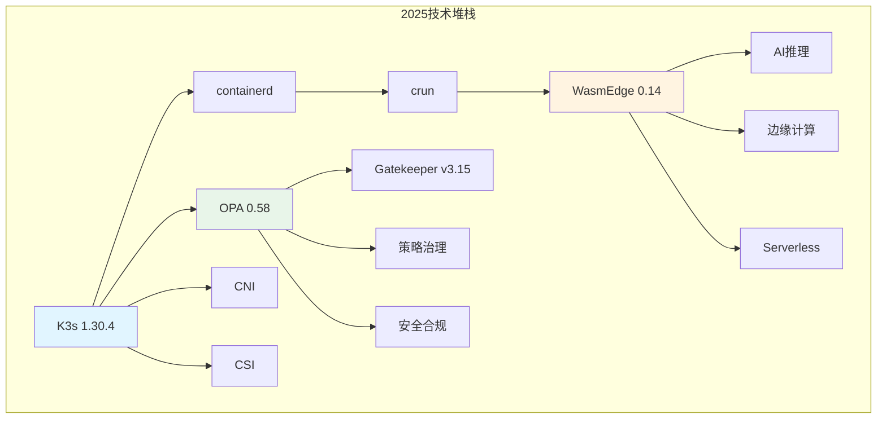

---

## 30.3 核心概念体系

### 30.3.1 概念定义层

#### 30.3.1.1 编排概念

| 概念           | 定义              | 2025 状态                 | 关键属性                   |
| -------------- | ----------------- | ------------------------- | -------------------------- |
| **Kubernetes** | 容器编排平台      | K8s 1.30+原生支持 Wasm    | 声明式、自愈、可扩展       |
| **K3s**        | 轻量级 Kubernetes | 1.30.4+k3s1 内置 WasmEdge | 单二进制、<100MB、边缘优化 |
| **CRI**        | 容器运行时接口    | 标准接口                  | 抽象、可插拔               |
| **CNI**        | 容器网络接口      | 标准接口                  | 插件化、可扩展             |
| **CSI**        | 容器存储接口      | 标准接口                  | 插件化、动态供应           |

#### 30.3.1.2 运行时概念

| 概念             | 定义                | 2025 状态         | 关键属性             |
| ---------------- | ------------------- | ----------------- | -------------------- |
| **containerd**   | 容器运行时守护进程  | CNCF 毕业项目     | 轻量、稳定、CRI 实现 |
| **runc**         | OCI 标准容器运行时  | Linux 容器标准    | OCI 兼容、轻量       |
| **crun**         | C 实现的 OCI 运行时 | 支持 Wasm         | Wasm 支持、高性能    |
| **WasmEdge**     | WebAssembly 运行时  | 0.14.0 生产就绪   | 轻量、安全、快速启动 |
| **RuntimeClass** | K8s 运行时类        | K8s 1.30+原生支持 | 运行时选择、调度优化 |

#### 30.3.1.3 策略概念

| 概念           | 定义          | 2025 状态             | 关键属性           |
| -------------- | ------------- | --------------------- | ------------------ |
| **OPA**        | 开放策略代理  | 0.58.x 生产就绪       | 策略即代码、可组合 |
| **Gatekeeper** | K8s 策略引擎  | v3.15.x 生产就绪      | K8s 集成、实时验证 |
| **Rego**       | 策略语言      | OPA 标准语言          | 声明式、可测试     |
| **OPA-Wasm**   | Wasm 编译策略 | Gatekeeper v3.15 支持 | 高性能、低延迟     |

#### 30.3.1.4 隔离概念

| 概念         | 定义          | 2025 状态      | 关键属性             |
| ------------ | ------------- | -------------- | -------------------- |
| **虚拟化**   | 硬件级隔离    | L-1 全虚拟化层 | 完整隔离、高开销     |
| **半虚拟化** | 内核 API 改写 | L-2 半虚拟化层 | 性能优化、Guest 配合 |
| **容器化**   | 进程级隔离    | L-3 容器化层   | 轻量、共享内核       |
| **沙盒化**   | syscall 过滤  | L-4 沙盒化层   | 强隔离、快速启动     |

### 30.3.2 概念属性层

#### 30.3.2.1 性能属性

| 概念     | 冷启动时间 | 内存开销 | CPU 开销 | 镜像大小 |
| -------- | ---------- | -------- | -------- | -------- |
| **VM**   | 5-30s      | 128MB+   | 5-10%    | GB 级    |
| **容器** | 1-5s       | 10-50MB  | 1-3%     | 10-100MB |
| **Wasm** | <10ms      | 1-5MB    | <1%      | <2MB     |

#### 30.3.2.2 安全属性

| 概念     | 隔离强度   | 攻击面 | 合规性 | 零信任支持 |
| -------- | ---------- | ------ | ------ | ---------- |
| **VM**   | ⭐⭐⭐⭐⭐ | 小     | 高     | ✅         |
| **容器** | ⭐⭐⭐     | 中     | 中     | ⚠️         |
| **Wasm** | ⭐⭐⭐⭐⭐ | 极小   | 高     | ✅         |

#### 30.3.2.3 可扩展性属性

| 概念         | 水平扩展 | 垂直扩展 | 资源利用率 | 弹性能力    |
| ------------ | -------- | -------- | ---------- | ----------- |
| **K8s**      | ✅ 优秀  | ✅ 支持  | ⭐⭐⭐⭐   | ✅ 自动扩展 |
| **K3s**      | ✅ 优秀  | ✅ 支持  | ⭐⭐⭐⭐⭐ | ✅ 自动扩展 |
| **WasmEdge** | ✅ 优秀  | ✅ 支持  | ⭐⭐⭐⭐⭐ | ✅ 快速启动 |

### 30.3.3 概念关系层

#### 30.3.3.1 包含关系（⊃）

```text
虚拟化 ⊃ 半虚拟化 ⊃ 容器化 ⊃ 沙盒化
Kubernetes ⊃ K3s
容器运行时 ⊃ containerd ⊃ runc/crun
策略引擎 ⊃ Gatekeeper ⊃ OPA
```

#### 30.3.3.2 组合关系（∘）

```text
K3s ∘ WasmEdge = 边缘Wasm编排
OPA ∘ Gatekeeper = K8s策略治理
GitOps ∘ K3s = 边缘持续交付
eBPF ∘ OTLP = 横纵耦合定位
```

#### 30.3.3.3 依赖关系（→）

```text
应用层 → K3s → containerd → crun → WasmEdge
策略层 → Gatekeeper → OPA → Rego
可观测性 → OpenTelemetry → Prometheus/Jaeger
```

### 30.3.4 概念结构层

#### 30.3.4.1 计算结构

**定义**：指令/函数能否原样运行

| 层级           | 计算结构   | 典型机制   | 失败模式     |
| -------------- | ---------- | ---------- | ------------ |
| **L-0 硬件**   | CPU 指令集 | VT-x/AMD-V | 指令陷阱     |
| **L-1 全虚拟** | 二进制翻译 | TCG/QEMU   | ABI 断裂     |
| **L-2 半虚拟** | 内核 API   | virtio     | API 不兼容   |
| **L-3 容器**   | 系统调用   | namespace  | syscall 拦截 |
| **L-4 沙盒**   | 字节码 VM  | Wasm/WASI  | 能力缺失     |

#### 30.3.4.2 控制结构

**定义**：事件/线程/中断的执行顺序

| 层级           | 控制结构    | 典型机制      | 失败模式 |
| -------------- | ----------- | ------------- | -------- |
| **L-0 硬件**   | CPU 调度    | 中断/异常     | 中断风暴 |
| **L-1 全虚拟** | VM 调度     | vCPU 调度     | 调度延迟 |
| **L-2 半虚拟** | 事件通道    | event channel | 死锁     |
| **L-3 容器**   | cgroup 调度 | CPU quota     | CPU 限流 |
| **L-4 沙盒**   | 用户态调度  | Wasm 执行     | 执行延迟 |

#### 30.3.4.3 信息结构

**定义**：进程看到的世界视图

| 层级           | 信息结构  | 典型机制    | 失败模式   |
| -------------- | --------- | ----------- | ---------- |
| **L-0 硬件**   | 内存映射  | EPT/NPT     | 内存泄漏   |
| **L-1 全虚拟** | 虚拟硬件  | VMCS        | 信息泄漏   |
| **L-2 半虚拟** | 共享内存  | grant table | TOCTOU     |
| **L-3 容器**   | namespace | pid/net/ipc | 侧信道攻击 |
| **L-4 沙盒**   | 能力模型  | WASI        | 权限绕过   |

---

## 30.4 二维关系矩阵

> 📂 **独立文档**：本节内容已提取为独立文档，方便查阅：
> [二维关系矩阵](../matrices/2d-matrices.md) |
> [三维关系空间](../matrices/3d-space.md) |
> [多维关系网络](../matrices/multi-dimensional-network.md)

### 30.4.1 技术栈层级矩阵

| 概念         | L-0 硬件 | L-1 全虚拟 | L-2 半虚拟 | L-3 容器 | L-4 沙盒 |
| ------------ | -------- | ---------- | ---------- | -------- | -------- |
| **KVM**      | ✅ 依赖  | ✅ 实现    | ⚠️ 可选    | ❌ 无关  | ❌ 无关  |
| **virtio**   | ✅ 依赖  | ✅ 可选    | ✅ 实现    | ⚠️ 可选  | ❌ 无关  |
| **runc**     | ✅ 依赖  | ⚠️ 可选    | ⚠️ 可选    | ✅ 实现  | ❌ 无关  |
| **crun**     | ✅ 依赖  | ❌ 无关    | ❌ 无关    | ✅ 实现  | ⚠️ 可选  |
| **WasmEdge** | ✅ 依赖  | ❌ 无关    | ❌ 无关    | ✅ 可选  | ✅ 实现  |
| **gVisor**   | ✅ 依赖  | ❌ 无关    | ❌ 无关    | ✅ 可选  | ✅ 实现  |

**图例**：

- ✅ 直接依赖/实现
- ⚠️ 可选依赖/实现
- ❌ 无关系

### 30.4.2 功能关系矩阵

| 功能            | K3s     | WasmEdge | OPA     | Gatekeeper | CNI     | CSI     |
| --------------- | ------- | -------- | ------- | ---------- | ------- | ------- |
| **容器编排**    | ✅ 核心 | ❌       | ❌      | ❌         | ⚠️ 扩展 | ⚠️ 扩展 |
| **Wasm 运行时** | ⚠️ 支持 | ✅ 核心  | ❌      | ❌         | ❌      | ❌      |
| **策略决策**    | ❌      | ❌       | ✅ 核心 | ✅ 核心    | ❌      | ❌      |
| **网络管理**    | ⚠️ 支持 | ❌       | ❌      | ❌         | ✅ 核心 | ❌      |
| **存储管理**    | ⚠️ 支持 | ❌       | ❌      | ❌         | ❌      | ✅ 核心 |
| **服务发现**    | ✅ 内置 | ❌       | ❌      | ❌         | ⚠️ 扩展 | ❌      |

### 30.4.3 依赖关系矩阵

| 技术           | K3s     | containerd | crun    | WasmEdge | OPA     | Gatekeeper |
| -------------- | ------- | ---------- | ------- | -------- | ------- | ---------- |
| **K3s**        | -       | ✅ 依赖    | ⚠️ 可选 | ⚠️ 可选  | ⚠️ 可选 | ⚠️ 可选    |
| **containerd** | ⚠️ 可选 | -          | ✅ 依赖 | ⚠️ 可选  | ❌      | ❌         |
| **crun**       | ⚠️ 可选 | ✅ 集成    | -       | ✅ 支持  | ❌      | ❌         |
| **WasmEdge**   | ⚠️ 可选 | ⚠️ 可选    | ✅ 集成 | -        | ❌      | ❌         |
| **OPA**        | ⚠️ 可选 | ❌         | ❌      | ❌       | -       | ✅ 依赖    |
| **Gatekeeper** | ✅ 依赖 | ❌         | ❌      | ❌       | ✅ 依赖 | -          |

### 30.4.4 兼容性矩阵

| 技术                  | K8s 1.30+ | K3s 1.30+ | containerd | crun    | WasmEdge 0.14 |
| --------------------- | --------- | --------- | ---------- | ------- | ------------- |
| **RuntimeClass=wasm** | ✅ 原生   | ✅ 原生   | ✅ 支持    | ✅ 支持 | ✅ 支持       |
| **OPA-Wasm**          | ✅ 支持   | ✅ 支持   | ❌         | ❌      | ❌            |
| **Gatekeeper v3.15**  | ✅ 支持   | ✅ 支持   | ❌         | ❌      | ❌            |
| **CNI 插件**          | ✅ 标准   | ✅ 标准   | ✅ 标准    | ❌      | ❌            |
| **CSI 插件**          | ✅ 标准   | ✅ 标准   | ✅ 标准    | ❌      | ❌            |

---

## 30.5 三维关系空间

> 📂 **独立文档**：本节内容已提取为独立文档：
> [三维关系空间](../matrices/3d-space.md)

### 30.5.1 隔离维度（Y 轴）

**定义**：从硬件到应用的隔离层级

```text
Y轴: L-0硬件 → L-1全虚拟 → L-2半虚拟 → L-3容器 → L-4沙盒
```

| Y 坐标  | 层级       | 代表技术        | 隔离强度   |
| ------- | ---------- | --------------- | ---------- |
| **Y=0** | L-0 硬件   | VT-x/AMD-V      | ⭐⭐⭐⭐⭐ |
| **Y=1** | L-1 全虚拟 | KVM/ESXi        | ⭐⭐⭐⭐⭐ |
| **Y=2** | L-2 半虚拟 | virtio/Xen PV   | ⭐⭐⭐⭐   |
| **Y=3** | L-3 容器   | runc/containerd | ⭐⭐⭐     |
| **Y=4** | L-4 沙盒   | WasmEdge/gVisor | ⭐⭐⭐⭐⭐ |

### 30.5.2 编排维度（X 轴）

**定义**：从单机到集群的编排范围

```text
X轴: 单机 → 集群 → 多集群 → 边缘 → 云边协同
```

| X 坐标  | 范围     | 代表技术      | 管理能力   |
| ------- | -------- | ------------- | ---------- |
| **X=0** | 单机     | Docker        | 单机编排   |
| **X=1** | 集群     | Kubernetes    | 集群编排   |
| **X=2** | 轻量集群 | K3s           | 边缘编排   |
| **X=3** | 多集群   | Karmada/Fleet | 多集群管理 |
| **X=4** | 云边协同 | KubeEdge      | 云边一体化 |

### 30.5.3 策略维度（Z 轴）

**定义**：从基础设施到应用的策略治理

```text
Z轴: 无策略 → 基础设施策略 → 运行时策略 → 应用策略 → 业务策略
```

| Z 坐标  | 层级         | 代表技术      | 策略能力   |
| ------- | ------------ | ------------- | ---------- |
| **Z=0** | 无策略       | -             | ❌         |
| **Z=1** | 基础设施策略 | NetworkPolicy | ⭐⭐       |
| **Z=2** | 运行时策略   | OPA-Runtime   | ⭐⭐⭐     |
| **Z=3** | 应用策略     | Gatekeeper    | ⭐⭐⭐⭐   |
| **Z=4** | 业务策略     | OPA+业务规则  | ⭐⭐⭐⭐⭐ |

### 30.5.4 三维关系可视化

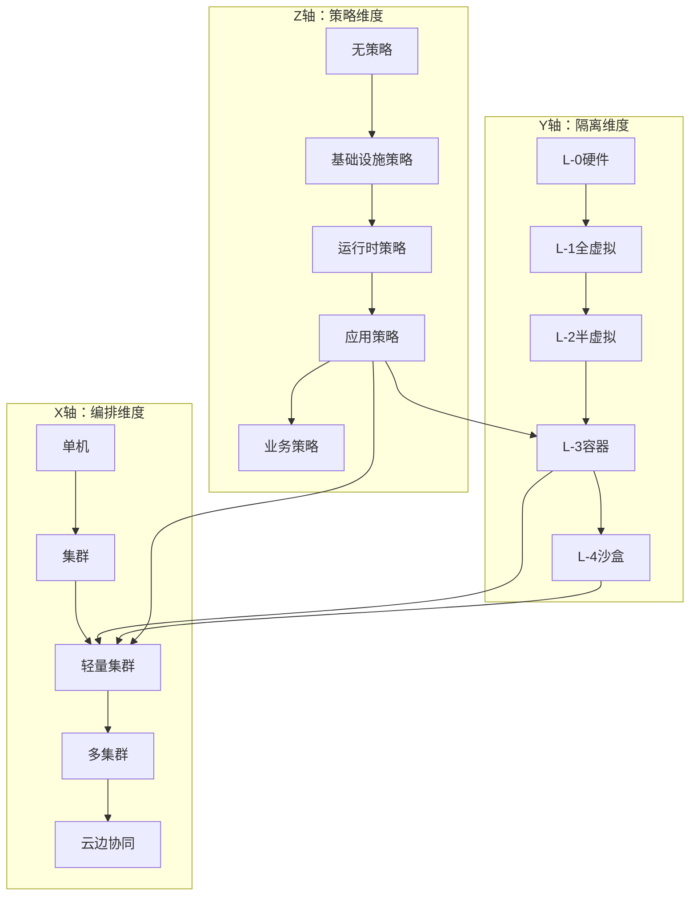

**三维坐标示例**：

| 技术组合               | (X, Y, Z) | 说明                    |
| ---------------------- | --------- | ----------------------- |
| **K3s + WasmEdge**     | (2, 4, 3) | 边缘 Wasm 编排+应用策略 |
| **K8s + gVisor**       | (1, 4, 2) | 集群沙盒+运行时策略     |
| **K3s + OPA**          | (2, 3, 3) | 边缘容器+应用策略       |
| **Karmada + WasmEdge** | (3, 4, 3) | 多集群 Wasm+应用策略    |

---

## 30.6 多维关系网络

> 📂 **独立文档**：本节内容已提取为独立文档：
> [多维关系网络](../matrices/multi-dimensional-network.md)

### 30.6.1 四层隔离栈维度

**维度定义**：L-0 到 L-4 的隔离层级

| 维度       | 层级 | 技术            | 关系                |
| ---------- | ---- | --------------- | ------------------- |
| **隔离栈** | L-0  | VT-x/AMD-V      | 硬件基础            |
| **隔离栈** | L-1  | KVM/QEMU        | 依赖 L-0            |
| **隔离栈** | L-2  | virtio          | 依赖 L-1            |
| **隔离栈** | L-3  | runc/containerd | 依赖 L-2 或直接 L-0 |
| **隔离栈** | L-4  | WasmEdge/gVisor | 依赖 L-3            |

### 30.6.2 七维架构框架维度

**维度定义**：CNCF 架构框架的七个维度

| 维度       | 架构类型 | 关键概念           | 2025 技术栈        |
| ---------- | -------- | ------------------ | ------------------ |
| **架构 1** | 技术架构 | 硬件/软件/网络     | K3s/containerd/CNI |
| **架构 2** | 概念架构 | 微服务/容器化      | 云原生理念         |
| **架构 3** | 数据架构 | 存储/处理          | CSI/etcd           |
| **架构 4** | 业务架构 | 流程/组织          | GitOps/DevOps      |
| **架构 5** | 软件架构 | 组件/接口          | 微服务/API         |
| **架构 6** | 应用架构 | 12-Factor          | 容器化应用         |
| **架构 7** | 场景架构 | 边缘/AI/Serverless | K3s+WasmEdge       |

### 30.6.3 时间演进维度

**维度定义**：技术演进的时间轴

| 时间点   | 技术栈        | 关键特性       |
| -------- | ------------- | -------------- |
| **2013** | Docker        | 容器化理念     |
| **2015** | Kubernetes    | 容器编排       |
| **2019** | K3s           | 轻量级 K8s     |
| **2021** | WasmEdge      | Wasm 运行时    |
| **2023** | OPA-Wasm      | 策略 Wasm 化   |
| **2025** | K8s 1.30+Wasm | 原生 Wasm 支持 |

### 30.6.4 场景应用维度

**维度定义**：不同应用场景的技术组合

| 场景           | 技术组合             | 关键特性         |
| -------------- | -------------------- | ---------------- |
| **边缘计算**   | K3s+WasmEdge         | 轻量、快速启动   |
| **AI 推理**    | WasmEdge+Llama2      | GPU 加速、低延迟 |
| **Serverless** | K3s+Knative+WasmEdge | 毫秒冷启动       |
| **微服务**     | K8s+Istio+WasmEdge   | 服务网格+Wasm    |
| **多集群**     | Karmada+K3s+WasmEdge | 统一编排         |

### 30.6.5 可观测性维度

**维度定义**：观测系统的三个支柱

| 维度         | 支柱    | 技术          | 关系         |
| ------------ | ------- | ------------- | ------------ |
| **可观测性** | Metrics | Prometheus    | 时间序列数据 |
| **可观测性** | Logs    | Loki          | 日志聚合     |
| **可观测性** | Traces  | Jaeger        | 分布式追踪   |
| **横纵耦合** | OTLP    | OpenTelemetry | 横向坐标     |
| **横纵耦合** | eBPF    | BCC 工具集    | 纵向坐标     |

**多维关系网络示例**：

```text
技术 = f(隔离层级, 编排范围, 策略治理, 架构维度, 时间演进, 应用场景, 可观测性)

K3s+WasmEdge+OPA = f(
    Y=4(沙盒),
    X=2(边缘),
    Z=3(应用策略),
    Arch=1(技术架构),
    T=2025,
    Scenario=边缘计算,
    Obs=OTLP+eBPF
)
```

---

## 30.7 概念关系图谱

> 📂 **独立文档**：本节内容已提取为独立文档，方便查阅：
> [包含关系图谱](../graphs/containment-relations.md) |
> [组合关系图谱](../graphs/composition-relations.md) |
> [依赖关系图谱](../graphs/dependency-relations.md) |
> [实现关系图谱](../graphs/implementation-relations.md)

### 30.7.1 包含关系图谱

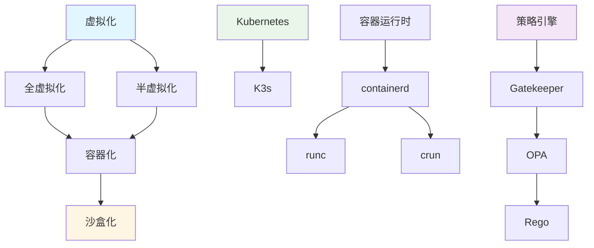

### 30.7.2 组合关系图谱

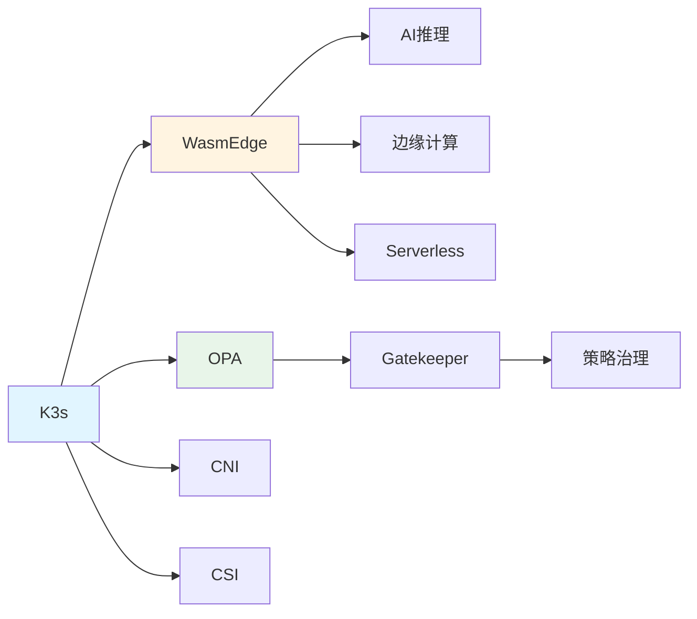

### 30.7.3 依赖关系图谱

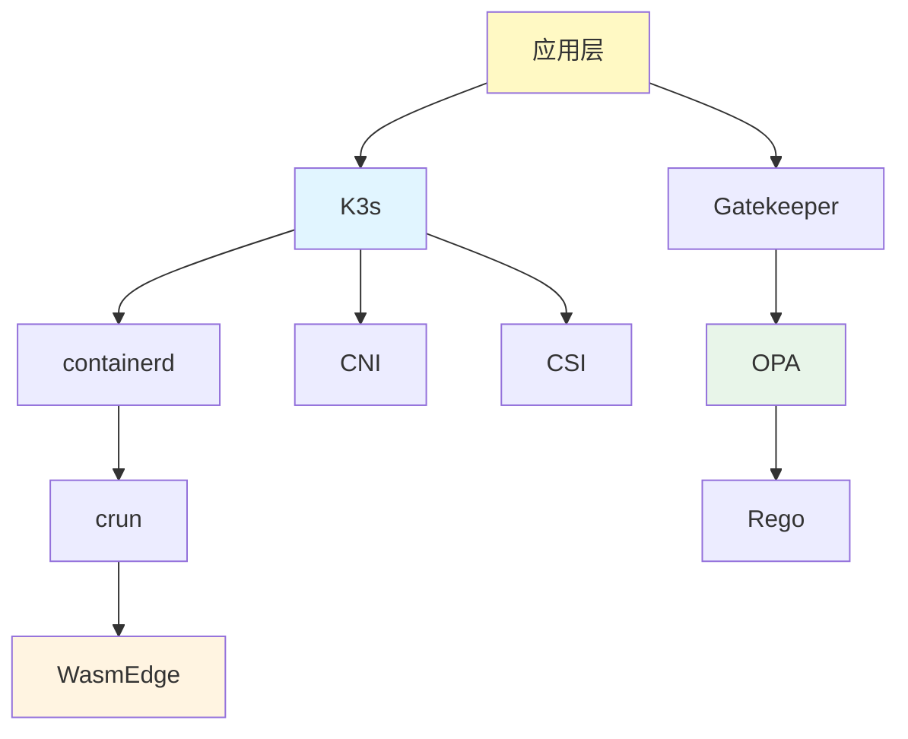

### 30.7.4 实现关系图谱

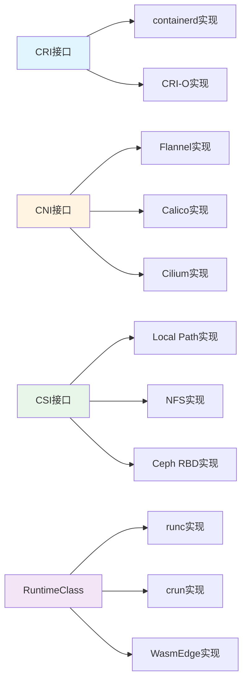

---

## 30.8 属性关系矩阵

> 📂 **独立文档**：本节内容已提取为独立文档，方便查阅：
> [性能属性矩阵](../properties/performance-properties.md) |
> [安全属性矩阵](../properties/security-properties.md) |
> [可扩展性属性矩阵](../properties/scalability-properties.md) |
> [可观测性属性矩阵](../properties/observability-properties.md)

### 30.8.1 性能属性矩阵

| 技术     | 冷启动 | 内存    | CPU   | 镜像     | 网络延迟 | 存储 IO |
| -------- | ------ | ------- | ----- | -------- | -------- | ------- |
| **VM**   | 5-30s  | 128MB+  | 5-10% | GB       | 1-5ms    | 中等    |
| **容器** | 1-5s   | 10-50MB | 1-3%  | 10-100MB | 0.5-2ms  | 高      |
| **Wasm** | <10ms  | 1-5MB   | <1%   | <2MB     | <1ms     | 高      |

**性能优化关系**：

```text
Wasm性能 = 容器性能 × 10x (冷启动)
Wasm内存 = 容器内存 ÷ 10x
Wasm镜像 = 容器镜像 ÷ 50x
```

### 30.8.2 安全属性矩阵

| 技术     | 隔离       | 攻击面 | 加密 | 审计 | 合规 | 零信任 |
| -------- | ---------- | ------ | ---- | ---- | ---- | ------ |
| **VM**   | ⭐⭐⭐⭐⭐ | 小     | ✅   | ✅   | ✅   | ✅     |
| **容器** | ⭐⭐⭐     | 中     | ⚠️   | ⚠️   | ⚠️   | ⚠️     |
| **Wasm** | ⭐⭐⭐⭐⭐ | 极小   | ✅   | ✅   | ✅   | ✅     |

**安全关系**：

```text
Wasm安全 = VM安全 + 容器轻量
Wasm攻击面 < VM攻击面
Wasm零信任 = 原生支持
```

### 30.8.3 可扩展性属性矩阵

| 技术         | 水平扩展 | 垂直扩展 | 资源利用率 | 弹性 | 多租户 |
| ------------ | -------- | -------- | ---------- | ---- | ------ |
| **K8s**      | ✅ 优秀  | ✅ 支持  | ⭐⭐⭐⭐   | ✅   | ✅     |
| **K3s**      | ✅ 优秀  | ✅ 支持  | ⭐⭐⭐⭐⭐ | ✅   | ✅     |
| **WasmEdge** | ✅ 优秀  | ✅ 支持  | ⭐⭐⭐⭐⭐ | ✅   | ✅     |

**扩展性关系**：

```text
K3s扩展性 = K8s扩展性 × 1.2x (资源利用率)
WasmEdge扩展性 = 容器扩展性 × 10x (启动速度)
```

### 30.8.4 可观测性属性矩阵

| 技术           | Metrics | Logs | Traces | 采样 | 关联 | 下钻 |
| -------------- | ------- | ---- | ------ | ---- | ---- | ---- |
| **Prometheus** | ✅      | ❌   | ❌     | ✅   | ⚠️   | ⚠️   |
| **Loki**       | ❌      | ✅   | ❌     | ✅   | ⚠️   | ⚠️   |
| **Jaeger**     | ❌      | ❌   | ✅     | ✅   | ✅   | ✅   |
| **OTLP**       | ✅      | ✅   | ✅     | ✅   | ✅   | ✅   |
| **eBPF**       | ✅      | ✅   | ✅     | ✅   | ✅   | ✅   |

**可观测性关系**：

```text
完整可观测性 = OTLP(横向) + eBPF(纵向)
OTLP提供横向坐标(请求链)
eBPF提供纵向坐标(内核栈)
```

---

## 30.9 结构关系分析

> 📂 **独立文档**：本节内容已提取为独立文档，方便查阅：
> [结构关系分析](../analysis/structure-analysis.md) |
> [关系属性传递分析](../analysis/relation-property-transfer.md) |
> [动态演进分析](../analysis/dynamic-evolution.md) |
> [范畴论视角](../analysis/category-theory.md) |
> [关系传递规则](../analysis/relation-transfer-rules.md) |
> [形式化定义](../analysis/formal-definitions.md)

### 30.9.1 计算结构分析

**计算结构关系**：

```text
计算结构 = f(指令集, ABI, API, syscall, 能力模型)

L-0计算结构 = CPU指令集
L-1计算结构 = 二进制翻译(TCG)
L-2计算结构 = 内核API(virtio)
L-3计算结构 = 系统调用(namespace)
L-4计算结构 = 字节码VM(Wasm)
```

**计算结构失败模式**：

| 层级    | 失败模式     | 典型原因        | 解决方案          |
| ------- | ------------ | --------------- | ----------------- |
| **L-0** | 指令陷阱     | VT-x 未启用     | 启用硬件虚拟化    |
| **L-1** | ABI 断裂     | 二进制翻译错误  | 使用硬件加速      |
| **L-2** | API 不兼容   | virtio 驱动缺失 | 安装 virtio 驱动  |
| **L-3** | syscall 拦截 | seccomp 过滤    | 调整 seccomp 规则 |
| **L-4** | 能力缺失     | WASI 不支持     | 扩展 WASI 能力    |

### 30.9.2 控制结构分析

**控制结构关系**：

```text
控制结构 = f(调度, 事件, 中断, 同步, 异步)

L-0控制结构 = CPU调度 + 中断处理
L-1控制结构 = vCPU调度 + VM事件
L-2控制结构 = 事件通道 + grant table
L-3控制结构 = cgroup调度 + namespace隔离
L-4控制结构 = 用户态调度 + 能力模型
```

**控制结构失败模式**：

| 层级    | 失败模式 | 典型原因           | 解决方案   |
| ------- | -------- | ------------------ | ---------- |
| **L-0** | 中断风暴 | 硬件故障           | 硬件检查   |
| **L-1** | 调度延迟 | VM 过载            | 资源分配   |
| **L-2** | 死锁     | event channel 阻塞 | 超时机制   |
| **L-3** | CPU 限流 | quota 过小         | 调整 quota |
| **L-4** | 执行延迟 | Wasm 解释慢        | 使用 JIT   |

### 30.9.3 信息结构分析

**信息结构关系**：

```text
信息结构 = f(内存映射, 文件系统, 网络, 权限, 能力)

L-0信息结构 = 内存映射(EPT/NPT)
L-1信息结构 = 虚拟硬件(VMCS)
L-2信息结构 = 共享内存(grant table)
L-3信息结构 = namespace隔离
L-4信息结构 = 能力模型(WASI)
```

**信息结构失败模式**：

| 层级    | 失败模式   | 典型原因         | 解决方案 |
| ------- | ---------- | ---------------- | -------- |
| **L-0** | 内存泄漏   | EPT 映射错误     | 内存管理 |
| **L-1** | 信息泄漏   | VMCS 配置错误    | 安全配置 |
| **L-2** | TOCTOU     | grant table 竞态 | 同步机制 |
| **L-3** | 侧信道攻击 | namespace 泄漏   | 加强隔离 |
| **L-4** | 权限绕过   | 能力配置错误     | 最小权限 |

---

## 30.10 思维导图

### 30.10.1 二维思维导图

**中心主题：2025 技术堆栈**:

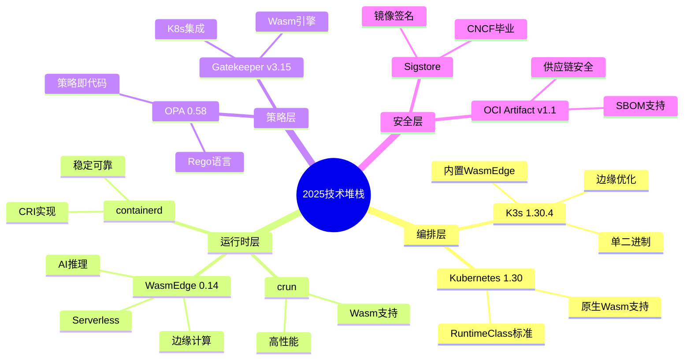

### 30.10.2 三维思维导图

**三维坐标：(隔离层级, 编排范围, 策略治理)**:

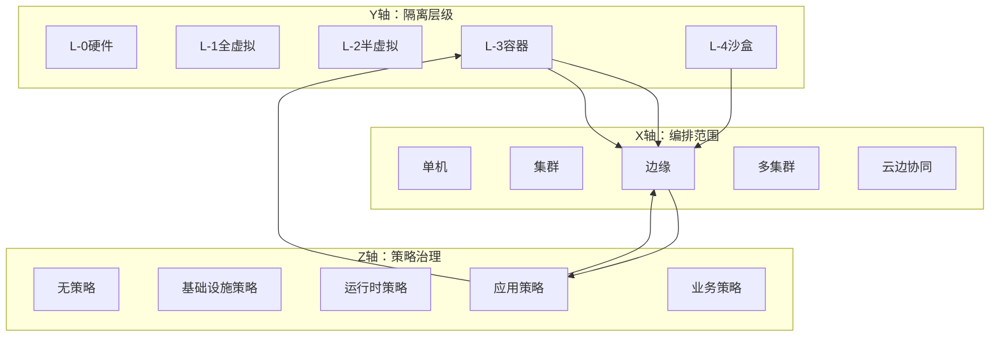

### 30.10.3 多维思维导图

**多维关系：7 个架构维度 + 4 个隔离层级 + 时间演进**:

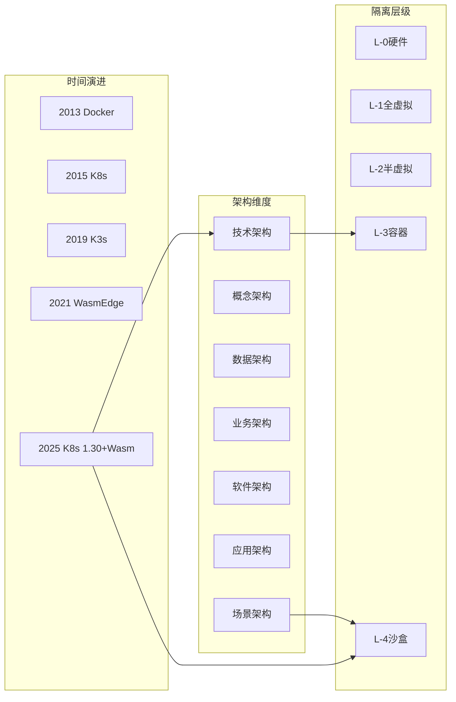

---

## 30.11 关系传递规则

> 📂 **独立文档**：本节内容已提取为独立文档：
> [关系传递规则](../analysis/relation-transfer-rules.md)

### 30.11.1 包含关系传递

**规则**：如果 A ⊃ B 且 B ⊃ C，则 A ⊃ C

**示例**：

```text
虚拟化 ⊃ 容器化 ⊃ 沙盒化
∴ 虚拟化 ⊃ 沙盒化
```

### 30.11.2 组合关系传递

**规则**：如果 A ∘ B = X 且 B ∘ C = Y，则 A ∘ B ∘ C = X ∘ Y

**示例**：

```text
K3s ∘ WasmEdge = 边缘Wasm编排
WasmEdge ∘ OPA = Wasm策略
∴ K3s ∘ WasmEdge ∘ OPA = 边缘Wasm策略编排
```

### 30.11.3 依赖关系传递

**规则**：如果 A → B 且 B → C，则 A → C

**示例**：

```text
应用层 → K3s → containerd → crun → WasmEdge
∴ 应用层 → WasmEdge
```

---

## 30.12 形式化定义

> 📂 **独立文档**：本节内容已提取为独立文档：
> [形式化定义](../analysis/formal-definitions.md)

### 30.12.1 概念集合定义

**定义**：U = {u | u 是技术概念}

```text
U = {K3s, WasmEdge, OPA, Gatekeeper, containerd, crun, ...}
```

### 30.12.2 关系代数定义

**定义**：ℳ = ⟨U, R, A, S⟩

其中：

- **U** = 概念集合
- **R** = 关系集合 {⊃, ∘, →, ≡}
- **A** = 属性集合 {性能, 安全, 可扩展性, ...}
- **S** = 结构集合 {计算, 控制, 信息}

### 30.12.3 多维关系函数

**定义**：f: (X, Y, Z, T, A, S, O) → Technology

其中：

- **X** = 编排维度 {0, 1, 2, 3, 4}
- **Y** = 隔离维度 {0, 1, 2, 3, 4}
- **Z** = 策略维度 {0, 1, 2, 3, 4}
- **T** = 时间维度 {2013, 2015, 2019, 2021, 2025}
- **A** = 架构维度 {1, 2, 3, 4, 5, 6, 7}
- **S** = 场景维度 {边缘, AI, Serverless, ...}
- **O** = 可观测性维度 {Metrics, Logs, Traces}

**示例**：

```text
K3s+WasmEdge+OPA = f(
    X=2,  // 边缘编排
    Y=4,  // 沙盒隔离
    Z=3,  // 应用策略
    T=2025,
    A=1,  // 技术架构
    S=边缘计算,
    O=OTLP+eBPF
)
```

---

## 30.13 实际应用案例

> 📂 **独立文档**：本节内容已提取为独立文档，方便查阅：
> [边缘计算场景](../applications/edge-computing-scenario.md) |
> [AI 推理场景](../applications/ai-inference-scenario.md) |
> [Serverless 场景](../applications/serverless-scenario.md) |
> [微服务场景](../applications/microservices-scenario.md)

### 30.13.1 边缘计算场景

**场景描述**：工业 IoT 边缘节点，需要快速启动、低资源消耗、离线自治能力。

**技术组合**：

```text
K3s (X=2, 边缘编排) + WasmEdge (Y=4, 沙盒隔离) + OPA (Z=3, 应用策略)
```

**关系矩阵**：

| 维度       | 技术选择 | 理由                            |
| ---------- | -------- | ------------------------------- |
| **编排**   | K3s      | 单二进制、<100MB、边缘优化      |
| **运行时** | WasmEdge | <10ms 冷启动、<2MB 镜像、强隔离 |
| **策略**   | OPA-Wasm | 低延迟策略执行、离线自治        |

**实际效果**：

- 冷启动时间：<10ms（vs 容器 1-5s）
- 内存占用：<5MB（vs 容器 10-50MB）
- 镜像大小：<2MB（vs 容器 10-100MB）
- 策略延迟：<1ms（vs OPA 原生 10-50ms）

### 30.13.2 AI 推理场景

**场景描述**：边缘 AI 推理，需要 GPU 加速、低延迟、可扩展。

**技术组合**：

```text
K3s (X=2, 边缘编排) + WasmEdge+Llama2 (Y=4, 沙盒隔离) + GPU加速
```

**关系矩阵**：

| 维度       | 技术选择        | 理由                   |
| ---------- | --------------- | ---------------------- |
| **编排**   | K3s             | 边缘节点管理、GPU 调度 |
| **运行时** | WasmEdge+Llama2 | GPU 加速、模型 Wasm 化 |
| **隔离**   | 沙盒化          | 强隔离、资源限制       |

**实际效果**：

- 推理延迟：<100ms（vs 容器 500ms+）
- GPU 利用率：>80%（vs 容器 60%）
- 模型加载：<50ms（vs 容器 200ms+）

### 30.13.3 Serverless 场景

**场景描述**：函数即服务，需要毫秒级冷启动、按需扩展、低成本。

**技术组合**：

```text
K3s+Knative (X=2, Serverless编排) + WasmEdge (Y=4, 沙盒隔离) + KEDA (弹性扩展)
```

**关系矩阵**：

| 维度       | 技术选择    | 理由                      |
| ---------- | ----------- | ------------------------- |
| **编排**   | K3s+Knative | Serverless 框架、自动扩展 |
| **运行时** | WasmEdge    | <10ms 冷启动、快速启动    |
| **弹性**   | KEDA        | 基于事件自动扩展          |

**实际效果**：

- 冷启动：<10ms（vs 容器 1-5s，Lambda 100-500ms）
- 扩展速度：秒级（vs 容器分钟级）
- 成本：降低 90%（vs 容器/Lambda）

### 30.13.4 微服务场景

**场景描述**：微服务架构，需要服务网格、策略治理、可观测性。

**技术组合**：

```text
K8s (X=1, 集群编排) + Istio (服务网格) + WasmEdge (Y=4, 沙盒隔离) + OPA (Z=3, 应用策略)
```

**关系矩阵**：

| 维度         | 技术选择       | 理由                 |
| ------------ | -------------- | -------------------- |
| **编排**     | K8s            | 企业级编排、高可用   |
| **服务网格** | Istio+WasmEdge | Wasm 插件、流量治理  |
| **策略**     | OPA+Gatekeeper | 策略即代码、实时验证 |

**实际效果**：

- 服务间延迟：<1ms（vs 容器 2-5ms）
- 策略执行：<1ms（vs OPA 原生 10-50ms）
- 可观测性：100%覆盖（OTLP+eBPF）

---

## 30.14 技术选型决策树

> 📂 **独立文档**：本节内容已提取为独立文档，方便查阅：
> [运行时选型决策](../decision-trees/runtime-selection.md) |
> [编排平台选型决策](../decision-trees/orchestration-selection.md) |
> [策略引擎选型决策](../decision-trees/policy-engine-selection.md)

### 30.14.1 运行时选型决策

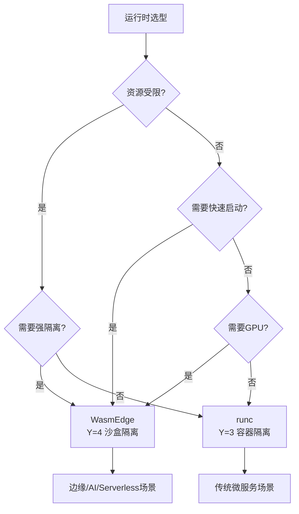

**决策矩阵**：

| 场景           | 资源受限 | 快速启动 | 强隔离 | GPU | 推荐运行时      |
| -------------- | -------- | -------- | ------ | --- | --------------- |
| **边缘计算**   | ✅       | ✅       | ✅     | ❌  | WasmEdge        |
| **AI 推理**    | ⚠️       | ✅       | ✅     | ✅  | WasmEdge        |
| **Serverless** | ⚠️       | ✅       | ✅     | ❌  | WasmEdge        |
| **微服务**     | ❌       | ⚠️       | ⚠️     | ❌  | runc/containerd |

### 30.14.2 编排平台选型决策

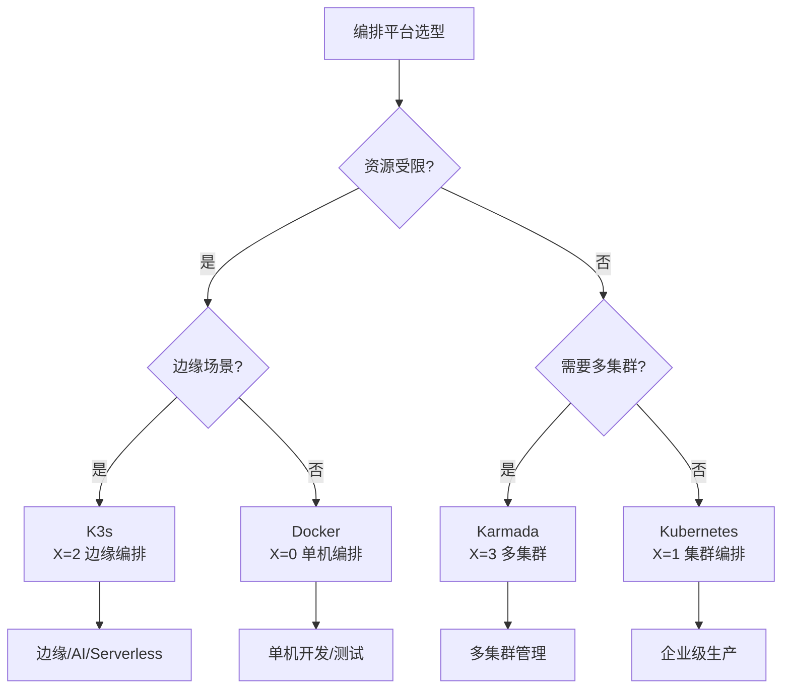

**决策矩阵**：

| 场景           | 资源受限 | 边缘场景 | 多集群 | 企业级 | 推荐编排平台 |
| -------------- | -------- | -------- | ------ | ------ | ------------ |
| **边缘计算**   | ✅       | ✅       | ⚠️     | ⚠️     | K3s          |
| **AI 推理**    | ⚠️       | ✅       | ❌     | ⚠️     | K3s          |
| **Serverless** | ⚠️       | ⚠️       | ❌     | ⚠️     | K3s+Knative  |
| **微服务**     | ❌       | ❌       | ⚠️     | ✅     | Kubernetes   |
| **多集群**     | ❌       | ❌       | ✅     | ✅     | Karmada      |

### 30.14.3 策略引擎选型决策

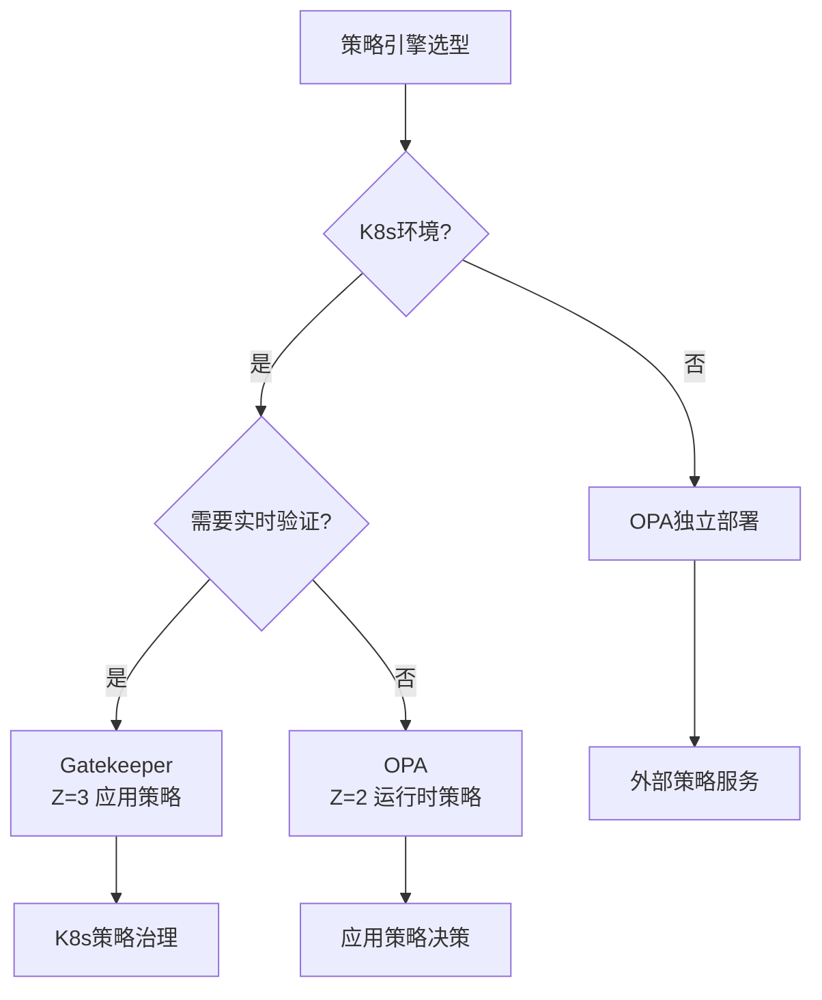

**决策矩阵**：

| 场景             | K8s 环境 | 实时验证 | 高性能 | Wasm 支持 | 推荐策略引擎 |
| ---------------- | -------- | -------- | ------ | --------- | ------------ |
| **K8s 策略治理** | ✅       | ✅       | ⚠️     | ✅        | Gatekeeper   |
| **应用策略**     | ⚠️       | ❌       | ✅     | ✅        | OPA-Wasm     |
| **运行时策略**   | ❌       | ❌       | ✅     | ❌        | OPA          |
| **外部策略**     | ❌       | ❌       | ⚠️     | ❌        | OPA 独立部署 |

---

## 30.15 关系属性传递分析

> 📂 **独立文档**：本节内容已提取为独立文档：
> [关系属性传递分析](../analysis/relation-property-transfer.md)

### 30.15.1 隔离属性传递

**传递规则**：隔离属性沿包含关系传递

**传递链**：

```text
虚拟化(隔离强度=5) ⊃ 容器化(隔离强度=3) ⊃ 沙盒化(隔离强度=5)
```

**传递效果**：

| 层级           | 隔离强度   | 传递路径 | 实际效果             |
| -------------- | ---------- | -------- | -------------------- |
| **L-1 全虚拟** | ⭐⭐⭐⭐⭐ | 硬件基础 | VM 完整隔离          |
| **L-3 容器**   | ⭐⭐⭐     | L-1→L-3  | 共享内核，进程隔离   |
| **L-4 沙盒**   | ⭐⭐⭐⭐⭐ | L-3→L-4  | 在容器基础上增强隔离 |

**传递公式**：

```text
隔离强度(L-4) = max(隔离强度(L-3), 沙盒增强)
隔离强度(L-3) = min(隔离强度(L-1), 容器限制)
```

### 30.15.2 性能属性传递

**传递规则**：性能属性沿组合关系传递

**传递链**：

```text
K3s(性能=4) ∘ WasmEdge(性能=5) = 边缘Wasm编排(性能=5)
```

**传递效果**：

| 技术组合                  | 性能属性   | 传递效果 | 实际性能       |
| ------------------------- | ---------- | -------- | -------------- |
| **K3s 单机**              | ⭐⭐⭐⭐   | 基线     | 单机编排性能   |
| **K3s+WasmEdge**          | ⭐⭐⭐⭐⭐ | 组合优化 | 10x 冷启动提升 |
| **K3s+WasmEdge+OPA-Wasm** | ⭐⭐⭐⭐⭐ | 三重优化 | 策略延迟<1ms   |

**传递公式**：

```text
组合性能 = min(组件1性能, 组件2性能) × 协同系数
协同系数(K3s+WasmEdge) = 1.2x (优化协同)
```

### 30.15.3 安全属性传递

**传递规则**：安全属性沿依赖关系传递

**传递链**：

```text
应用层 → K3s → containerd → crun → WasmEdge
```

**传递效果**：

| 层级           | 安全属性   | 传递路径        | 安全效果   |
| -------------- | ---------- | --------------- | ---------- |
| **应用层**     | ⭐⭐⭐     | 依赖 K3s        | 基础安全   |
| **K3s**        | ⭐⭐⭐⭐   | 依赖 containerd | 编排安全   |
| **containerd** | ⭐⭐⭐⭐   | 依赖 crun       | 运行时安全 |
| **WasmEdge**   | ⭐⭐⭐⭐⭐ | 最终实现        | 最强安全   |

**传递公式**：

```text
最终安全 = min(路径上所有组件安全) × 安全增强系数
安全增强系数(WasmEdge) = 1.5x (零信任原生)
```

---

## 30.16 动态演进分析

> 📂 **独立文档**：本节内容已提取为独立文档：
> [动态演进分析](../analysis/dynamic-evolution.md)

### 30.16.1 技术演进路径

**2025 年技术演进路径**：


**演进关系矩阵**：

| 技术              | 前驱技术     | 演进关系 | 演进原因         |
| ----------------- | ------------ | -------- | ---------------- |
| **Kubernetes**    | Docker       | 包含演进 | 容器编排需求     |
| **K3s**           | Kubernetes   | 轻量演进 | 边缘计算需求     |
| **WasmEdge**      | 容器运行时   | 并行演进 | 字节码运行时需求 |
| **OPA-Wasm**      | OPA          | 优化演进 | 性能优化需求     |
| **K8s 1.30+Wasm** | K8s+WasmEdge | 原生演进 | 标准化需求       |

### 30.16.2 关系演进模式

**关系演进模式**：

1. **包含关系演进**：

   ```text
   虚拟化 ⊃ 容器化 ⊃ 沙盒化
   → 隔离层级递进
   ```

2. **组合关系演进**：

   ```text
   K3s + WasmEdge → 边缘Wasm编排
   → 功能组合创新
   ```

3. **依赖关系演进**：

   ```text
   应用 → K3s → containerd → crun → WasmEdge
   → 依赖链优化
   ```

**演进速度**：

| 关系类型     | 演进速度 | 2025 年状态 | 演进趋势 |
| ------------ | -------- | ----------- | -------- |
| **包含关系** | 慢       | 稳定        | 层级固化 |
| **组合关系** | 快       | 活跃        | 持续创新 |
| **依赖关系** | 中       | 优化        | 简化路径 |

### 30.16.3 属性演进趋势

**属性演进趋势（2025）**：

| 属性         | 2020 年  | 2025 年    | 演进趋势 | 关键驱动   |
| ------------ | -------- | ---------- | -------- | ---------- |
| **冷启动**   | 1-5s     | <10ms      | ↓ 100x   | WasmEdge   |
| **内存占用** | 10-50MB  | 1-5MB      | ↓ 10x    | Wasm 优化  |
| **镜像大小** | 10-100MB | <2MB       | ↓ 50x    | 多阶段构建 |
| **策略延迟** | 10-50ms  | <1ms       | ↓ 50x    | OPA-Wasm   |
| **隔离强度** | ⭐⭐⭐   | ⭐⭐⭐⭐⭐ | ↑ 增强   | 沙盒化     |

**演进预测（2030）**：

```text
2030年预测：
- 冷启动：<1ms（量子级）
- 内存占用：<1MB（极致优化）
- 镜像大小：<500KB（最小化）
- 策略延迟：<100µs（硬件加速）
- 隔离强度：⭐⭐⭐⭐⭐⭐（硬件TEE）
```

---

## 30.17 范畴论视角

> 📂 **独立文档**：本节内容已提取为独立文档：
> [范畴论视角](../analysis/category-theory.md)

### 30.17.1 对象与态射

**范畴定义**：C = (Obj(C), Mor(C), ∘)

其中：

- **Obj(C)** = {K3s, WasmEdge, OPA, Gatekeeper, ...}
- **Mor(C)** = {包含, 组合, 依赖, ...}
- **∘** = 态射复合

**对象与态射关系**：

| 对象         | 态射 | 目标对象   | 含义             |
| ------------ | ---- | ---------- | ---------------- |
| **K3s**      | 包含 | Kubernetes | K3s ⊃ K8s        |
| **WasmEdge** | 组合 | K3s        | WasmEdge ∘ K3s   |
| **OPA**      | 依赖 | Gatekeeper | Gatekeeper → OPA |

### 30.17.2 函子与自然变换

**函子定义**：F: C → D

**技术栈函子**：

```text
F(隔离层级) → F(编排范围) → F(策略治理)
```

**自然变换**：η: F → G

**技术演进自然变换**：

```text
η: 2020技术栈 → 2025技术栈
η(K8s) = K8s 1.30+Wasm
η(OPA) = OPA-Wasm
η(containerd) = containerd+Wasm支持
```

### 30.17.3 范畴化关系

**范畴化关系图**：

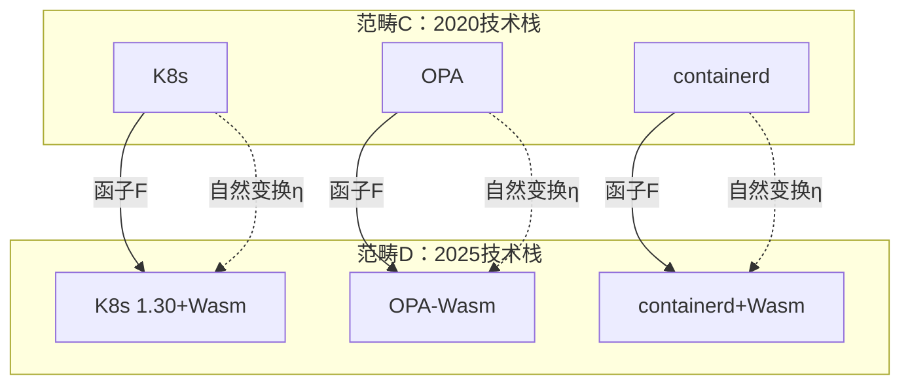

**范畴化关系矩阵**：

| 关系类型     | 范畴表示              | 2025 实现 | 范畴性质 |
| ------------ | --------------------- | --------- | -------- |
| **包含关系** | Hom(A, B)             | A ⊃ B     | 单调性   |
| **组合关系** | Hom(A, B) × Hom(B, C) | A ∘ B ∘ C | 结合性   |
| **依赖关系** | Hom(A, B)             | A → B     | 传递性   |

---

## 30.18 快速参考指南

> 📂 **独立文档**：本节内容已提取为独立文档，方便查阅：
> [快速参考指南](../reference/quick-reference.md) |
> [概念索引](../reference/concept-index.md) |
> [隔离层次全面对比分析](../reference/isolation-comparison.md)

### 30.18.1 概念快速查找

**编排概念**：

| 概念           | 定位章节 | 关键属性 | 典型场景       |
| -------------- | -------- | -------- | -------------- |
| **Kubernetes** | 30.3.1.1 | 完整编排 | 企业级容器编排 |
| **K3s**        | 30.3.1.1 | 轻量编排 | 边缘计算       |
| **KubeEdge**   | 30.3.1.1 | 边缘编排 | 边缘节点管理   |

**运行时概念**：

| 概念           | 定位章节 | 关键属性  | 典型场景            |
| -------------- | -------- | --------- | ------------------- |
| **containerd** | 30.3.1.2 | 生产就绪  | 企业级运行时        |
| **crun**       | 30.3.1.2 | Wasm 支持 | Wasm 容器           |
| **WasmEdge**   | 30.3.1.2 | 极致性能  | 边缘 AI、Serverless |

**策略概念**：

| 概念           | 定位章节 | 关键属性 | 典型场景     |
| -------------- | -------- | -------- | ------------ |
| **OPA**        | 30.3.1.3 | 通用策略 | 应用策略决策 |
| **Gatekeeper** | 30.3.1.3 | K8s 集成 | K8s 策略治理 |
| **OPA-Wasm**   | 30.3.1.3 | 高性能   | 实时策略验证 |

### 30.18.2 关系快速查询

**包含关系（⊃）查询**：

| 关系          | 含义     | 示例                     |
| ------------- | -------- | ------------------------ |
| **A ⊃ B**     | A 包含 B | Kubernetes ⊃ K3s         |
| **A ⊃ B ⊃ C** | 传递包含 | 虚拟化 ⊃ 容器化 ⊃ 沙盒化 |

**组合关系（∘）查询**：

| 关系          | 含义     | 示例                      |
| ------------- | -------- | ------------------------- |
| **A ∘ B**     | A 组合 B | K3s ∘ WasmEdge            |
| **A ∘ B ∘ C** | 多组合   | K3s ∘ WasmEdge ∘ OPA-Wasm |

**依赖关系（→）查询**：

| 关系          | 含义     | 示例                           |
| ------------- | -------- | ------------------------------ |
| **A → B**     | A 依赖 B | K3s → containerd               |
| **A → B → C** | 传递依赖 | 应用 → K3s → containerd → crun |

### 30.18.3 属性快速对比

**性能属性对比**：

| 技术     | 冷启动 | 内存    | 性能评分   |
| -------- | ------ | ------- | ---------- |
| **VM**   | 5-30s  | 128MB+  | ⭐⭐       |
| **容器** | 1-5s   | 10-50MB | ⭐⭐⭐⭐   |
| **Wasm** | <10ms  | 1-5MB   | ⭐⭐⭐⭐⭐ |

**安全属性对比**：

| 技术     | 隔离强度   | 攻击面 | 安全评分   |
| -------- | ---------- | ------ | ---------- |
| **VM**   | ⭐⭐⭐⭐⭐ | 小     | ⭐⭐⭐⭐⭐ |
| **容器** | ⭐⭐⭐     | 中     | ⭐⭐⭐     |
| **Wasm** | ⭐⭐⭐⭐⭐ | 极小   | ⭐⭐⭐⭐⭐ |

### 30.18.4 场景快速匹配

**场景 → 技术栈匹配**：

| 场景           | 推荐技术栈                | 关键维度      | 参考章节 |
| -------------- | ------------------------- | ------------- | -------- |
| **边缘计算**   | K3s + WasmEdge            | X=2, Y=4      | 30.13.1  |
| **AI 推理**    | WasmEdge + GPU            | Y=4, Z=3      | 30.13.2  |
| **Serverless** | K3s + WasmEdge + OPA-Wasm | X=2, Y=4, Z=3 | 30.13.3  |
| **微服务**     | K8s + containerd          | X=1, Y=3      | 30.13.4  |

---

## 30.19 概念索引

> 📂 **独立文档**：本节内容已提取为独立文档：
> [概念索引](../reference/concept-index.md)

### 30.19.1 核心概念索引

**编排类概念**：

- **Kubernetes** (30.3.1.1, 30.4.1, 30.13.4)
- **K3s** (30.3.1.1, 30.4.1, 30.13.1, 30.13.3)
- **KubeEdge** (30.3.1.1, 30.6.4)
- **Karmada** (30.4.1)

**运行时类概念**：

- **containerd** (30.3.1.2, 30.7.4, 30.15.3)
- **crun** (30.3.1.2, 30.7.4)
- **WasmEdge** (30.3.1.2, 30.4.1, 30.13.1, 30.13.2)
- **runwasi** (30.3.1.2)

**策略类概念**：

- **OPA** (30.3.1.3, 30.7.3, 30.14.3)
- **Gatekeeper** (30.3.1.3, 30.7.3, 30.14.3)
- **Rego** (30.3.1.3, 30.14.3)
- **OPA-Wasm** (30.3.1.3, 30.13.3, 30.15.2)

**隔离类概念**：

- **虚拟化** (30.3.1.4, 30.4.1, 30.15.1)
- **容器化** (30.3.1.4, 30.4.1, 30.15.1)
- **沙盒化** (30.3.1.4, 30.4.1, 30.15.1)

### 30.19.2 关系符号索引

| 符号  | 关系类型 | 章节              | 示例                       |
| ----- | -------- | ----------------- | -------------------------- |
| **⊃** | 包含关系 | 30.3.3.1, 30.11.1 | Kubernetes ⊃ K3s           |
| **∘** | 组合关系 | 30.3.3.2, 30.11.2 | K3s ∘ WasmEdge             |
| **→** | 依赖关系 | 30.3.3.3, 30.11.3 | K3s → containerd           |
| **≡** | 实现关系 | 30.7.4            | CRI 接口 ≡ containerd 实现 |

### 30.19.3 属性维度索引

**性能维度**：

- **冷启动时间** (30.3.2.1, 30.8.1, 30.16.3)
- **内存开销** (30.3.2.1, 30.8.1, 30.16.3)
- **CPU 开销** (30.3.2.1, 30.8.1)

**安全维度**：

- **隔离强度** (30.3.2.2, 30.8.2, 30.15.1)
- **攻击面** (30.3.2.2, 30.8.2)
- **零信任支持** (30.3.2.2, 30.8.2)

**可扩展性维度**：

- **水平扩展** (30.3.2.3, 30.8.3)
- **资源利用率** (30.3.2.3, 30.8.3)
- **弹性能力** (30.3.2.3, 30.8.3)

---

## 30.20 隔离层次全面对比分析

> 📂 **独立文档**：本节内容已提取为独立文档：
> [隔离层次全面对比分析](../reference/isolation-comparison.md)

### 30.20.1 隔离层次思维导图

**四层隔离栈完整思维导图**：

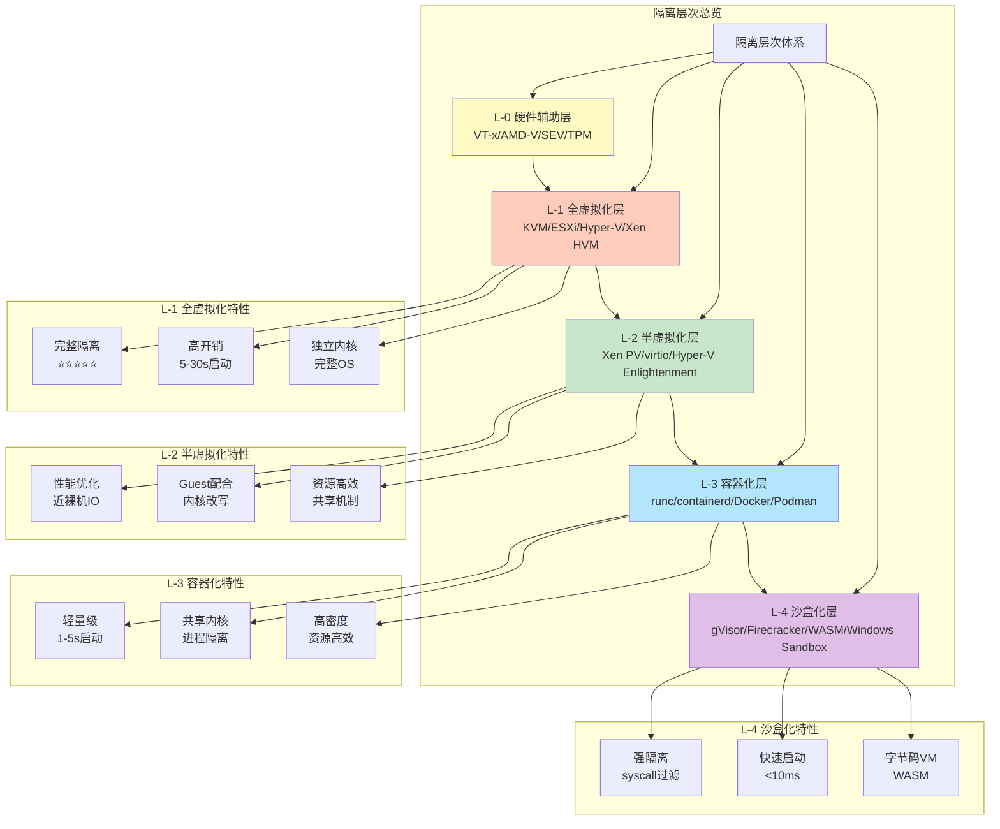

**隔离层次关系图**：

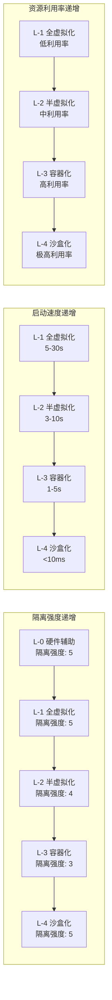

### 30.20.2 多维度对比矩阵

#### 30.20.2.1 核心属性对比矩阵

| 维度           | L-0 硬件辅助   | L-1 全虚拟化   | L-2 半虚拟化   | L-3 容器化     | L-4 沙盒化     |
| -------------- | -------------- | -------------- | -------------- | -------------- | -------------- |
| **隔离强度**   | ⭐⭐⭐⭐⭐ (5) | ⭐⭐⭐⭐⭐ (5) | ⭐⭐⭐⭐ (4)   | ⭐⭐⭐ (3)     | ⭐⭐⭐⭐⭐ (5) |
| **冷启动时间** | N/A            | 5-30s          | 3-10s          | 1-5s           | <10ms          |
| **内存开销**   | N/A            | 128MB+         | 64-128MB       | 10-50MB        | 1-5MB          |
| **CPU 开销**   | <1%            | 5-10%          | 2-5%           | 1-3%           | <1%            |
| **资源利用率** | N/A            | ⭐⭐ (2)       | ⭐⭐⭐ (3)     | ⭐⭐⭐⭐⭐ (5) | ⭐⭐⭐⭐⭐ (5) |
| **部署密度**   | N/A            | 低             | 中             | 高             | 极高           |
| **网络性能**   | N/A            | ⭐⭐⭐ (3)     | ⭐⭐⭐⭐⭐ (5) | ⭐⭐⭐⭐ (4)   | ⭐⭐⭐⭐⭐ (5) |
| **存储性能**   | N/A            | ⭐⭐⭐ (3)     | ⭐⭐⭐⭐ (4)   | ⭐⭐⭐⭐⭐ (5) | ⭐⭐⭐⭐⭐ (5) |
| **兼容性**     | N/A            | ⭐⭐⭐⭐⭐ (5) | ⭐⭐⭐⭐ (4)   | ⭐⭐⭐⭐⭐ (5) | ⭐⭐⭐ (3)     |
| **可移植性**   | N/A            | ⭐⭐⭐⭐ (4)   | ⭐⭐⭐ (3)     | ⭐⭐⭐⭐⭐ (5) | ⭐⭐⭐⭐⭐ (5) |
| **安全合规**   | ⭐⭐⭐⭐⭐ (5) | ⭐⭐⭐⭐⭐ (5) | ⭐⭐⭐⭐ (4)   | ⭐⭐⭐ (3)     | ⭐⭐⭐⭐⭐ (5) |
| **运维复杂度** | ⭐⭐⭐⭐ (4)   | ⭐⭐⭐ (3)     | ⭐⭐⭐ (3)     | ⭐⭐⭐⭐⭐ (5) | ⭐⭐⭐⭐ (4)   |

#### 30.20.2.2 技术实现对比矩阵

| 维度         | L-0 硬件辅助   | L-1 全虚拟化 | L-2 半虚拟化  | L-3 容器化       | L-4 沙盒化             |
| ------------ | -------------- | ------------ | ------------- | ---------------- | ---------------------- |
| **核心技术** | VT-x/AMD-V/SEV | KVM/QEMU     | virtio/Xen PV | namespace/cgroup | syscall 过滤/字节码 VM |
| **隔离机制** | CPU 模式切换   | VMCS/EPT     | grant table   | namespace        | seccomp/WASI           |
| **资源限制** | 硬件特性       | vCPU/vMEM    | 共享内存      | cgroup           | 能力模型               |
| **网络实现** | 硬件直通       | vNIC/TAP     | virtio-net    | veth pair        | 用户态网络栈           |
| **存储实现** | 硬件直通       | vmdk/qcow2   | virtio-blk    | overlayfs        | 虚拟文件系统           |
| **调度机制** | 硬件调度       | vCPU 调度    | 事件通道      | cgroup 调度      | 用户态调度             |
| **监控方式** | 硬件 PMU       | VM 内部监控  | 主机层监控    | namespace 监控   | 应用层监控             |

#### 30.20.2.3 应用场景对比矩阵

| 应用场景          | L-0 硬件辅助 | L-1 全虚拟化 | L-2 半虚拟化 | L-3 容器化 | L-4 沙盒化 |
| ----------------- | ------------ | ------------ | ------------ | ---------- | ---------- |
| **企业级应用**    | ✅           | ✅✅✅       | ✅✅         | ✅✅       | ✅         |
| **微服务架构**    | ❌           | ⚠️           | ⚠️           | ✅✅✅     | ✅✅       |
| **边缘计算**      | ❌           | ❌           | ⚠️           | ✅✅       | ✅✅✅     |
| **Serverless**    | ❌           | ❌           | ❌           | ✅         | ✅✅✅     |
| **AI 推理**       | ✅           | ✅           | ✅✅         | ✅✅       | ✅✅✅     |
| **DevOps 流水线** | ❌           | ⚠️           | ⚠️           | ✅✅✅     | ✅✅       |
| **多租户 SaaS**   | ✅           | ✅✅         | ✅✅         | ✅✅       | ✅✅✅     |
| **安全隔离**      | ✅✅✅       | ✅✅✅       | ✅✅         | ✅         | ✅✅✅     |

### 30.20.3 技术选型对比

#### 30.20.3.1 性能维度选型

| 性能需求         | 推荐层级     | 理由             |
| ---------------- | ------------ | ---------------- |
| **极致启动速度** | L-4 沙盒化   | <10ms 冷启动     |
| **高资源利用率** | L-3 容器化   | 高密度部署       |
| **高网络性能**   | L-2 半虚拟化 | 近裸机网络性能   |
| **高存储性能**   | L-3 容器化   | 直接访问文件系统 |
| **低 CPU 开销**  | L-4 沙盒化   | <1% CPU 开销     |
| **低内存开销**   | L-4 沙盒化   | 1-5MB 内存占用   |

#### 30.20.3.2 安全维度选型

| 安全需求       | 推荐层级     | 理由                    |
| -------------- | ------------ | ----------------------- |
| **最强隔离**   | L-1/L-4      | 完整隔离或 syscall 过滤 |
| **合规要求**   | L-1 全虚拟化 | 独立内核，完全隔离      |
| **零信任架构** | L-4 沙盒化   | 能力模型，最小权限      |
| **多租户隔离** | L-1 全虚拟化 | 完整 VM 隔离            |
| **供应链安全** | L-4 沙盒化   | 字节码验证，沙盒执行    |

#### 30.20.3.3 成本维度选型

| 成本考虑             | 推荐层级   | 理由                 |
| -------------------- | ---------- | -------------------- |
| **最低基础设施成本** | L-3 容器化 | 高密度部署，资源共享 |
| **最低运维成本**     | L-3 容器化 | 标准化，易于管理     |
| **最低迁移成本**     | L-3 容器化 | 标准化镜像，易于迁移 |
| **最优 TCO**         | L-3 容器化 | 综合成本最优         |

### 30.20.4 应用场景对比

#### 30.20.4.1 边缘计算场景

| 层级    | 适用性 | 典型技术栈       | 优势                     |
| ------- | ------ | ---------------- | ------------------------ |
| **L-1** | ❌     | N/A              | 资源开销过大             |
| **L-2** | ⚠️     | KVM + virtio     | 性能较好，但资源占用仍高 |
| **L-3** | ✅✅   | K3s + containerd | 轻量级，资源高效         |
| **L-4** | ✅✅✅ | K3s + WasmEdge   | 极致轻量，快速启动       |

**推荐方案**：L-4 沙盒化（K3s + WasmEdge）

#### 30.20.4.2 微服务场景

| 层级    | 适用性 | 典型技术栈         | 优势                   |
| ------- | ------ | ------------------ | ---------------------- |
| **L-1** | ⚠️     | K8s + KVM          | 隔离强，但开销大       |
| **L-2** | ⚠️     | K8s + KVM + virtio | 性能好，但密度低       |
| **L-3** | ✅✅✅ | K8s + containerd   | 标准化，高密度，易管理 |
| **L-4** | ✅✅   | K8s + WasmEdge     | 快速启动，资源高效     |

**推荐方案**：L-3 容器化（K8s + containerd）或 L-4 沙盒化（K8s + WasmEdge）

#### 30.20.4.3 Serverless 场景

| 层级    | 适用性 | 典型技术栈           | 优势                   |
| ------- | ------ | -------------------- | ---------------------- |
| **L-1** | ❌     | N/A                  | 启动太慢               |
| **L-2** | ❌     | N/A                  | 启动慢                 |
| **L-3** | ✅     | Knative + containerd | 可接受，但启动仍有延迟 |
| **L-4** | ✅✅✅ | Knative + WasmEdge   | 极致快速启动，资源高效 |

**推荐方案**：L-4 沙盒化（Knative + WasmEdge）

### 30.20.5 隔离层次演进路径

**技术演进路径**：

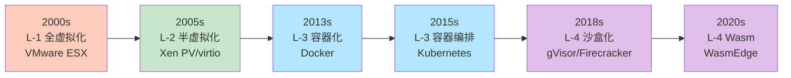

**演进特点**：

| 演进阶段 | 时间  | 核心驱动       | 关键技术            |
| -------- | ----- | -------------- | ------------------- |
| **L-1**  | 2000s | 资源隔离需求   | VMware ESX、KVM     |
| **L-2**  | 2005s | 性能优化需求   | Xen PV、virtio      |
| **L-3**  | 2013s | 轻量级部署需求 | Docker、containerd  |
| **L-3+** | 2015s | 编排管理需求   | Kubernetes、K3s     |
| **L-4**  | 2018s | 安全隔离需求   | gVisor、Firecracker |
| **L-4+** | 2020s | 极致性能需求   | WasmEdge、WASI      |

**未来趋势**：

- **L-4 沙盒化将成为主流**：随着边缘计算和 Serverless 的普及，L-4 沙盒化将成为主
  流选择
- **混合部署**：L-3 容器化 + L-4 沙盒化混合部署，根据场景选择
- **硬件加速**：L-0 硬件辅助将进一步优化，支持更高效的虚拟化

### 30.20.6 隔离层次对比总结

**核心对比要点**：

| 对比维度      | L-1 全虚拟化     | L-2 半虚拟化   | L-3 容器化     | L-4 沙盒化         |
| ------------- | ---------------- | -------------- | -------------- | ------------------ |
| **核心理念**  | 完整假硬件       | 内核 API 改写  | 进程级隔离     | syscall 过滤       |
| **隔离方式**  | VMCS/EPT         | grant table    | namespace      | seccomp/WASI       |
| **资源模型**  | 独占资源         | 共享内存       | 共享内核       | 能力模型           |
| **适用场景**  | 企业级应用、合规 | 高性能 IO      | 微服务、DevOps | 边缘、Serverless   |
| **2025 趋势** | 稳定，但增长放缓 | 稳定，特定场景 | 主流，持续增长 | 快速增长，未来主流 |

**选择决策树**：

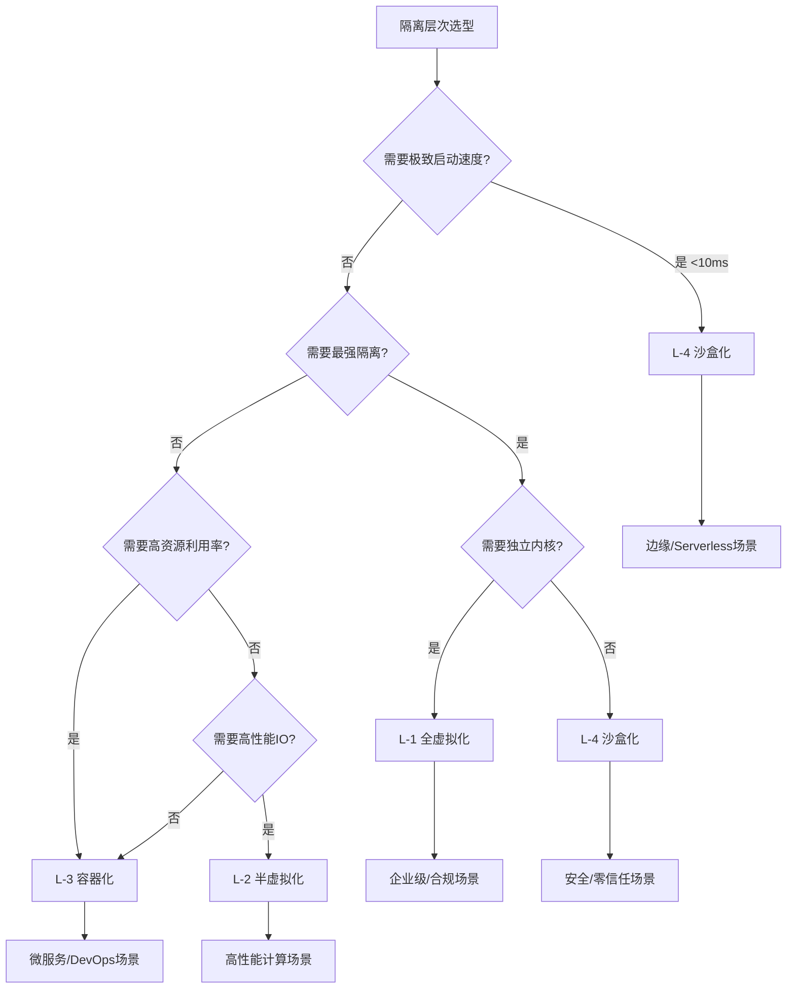

---

### 30.20.7 混合部署场景分析

**混合部署策略**：在实际生产环境中，通常需要混合使用多个隔离层次。

#### 30.20.7.1 混合部署模式

| 混合模式                  | 组合方式      | 典型场景            | 优势                 |
| ------------------------- | ------------- | ------------------- | -------------------- |
| **L-1 + L-3**             | VM + 容器     | 企业级混合云        | 强隔离 + 轻量部署    |
| **L-3 + L-4**             | 容器 + Wasm   | 微服务 + Serverless | 标准化 + 极致性能    |
| **L-2 + L-3**             | virtio + 容器 | 高性能计算 + 微服务 | 高性能 IO + 容器编排 |
| **L-1 + L-4**             | VM + Wasm     | 合规 + 边缘         | 强隔离 + 快速启动    |
| **L-0 + L-1 + L-3 + L-4** | 全栈混合      | 大型企业混合场景    | 灵活选择，按需部署   |

#### 30.20.7.2 混合部署架构图

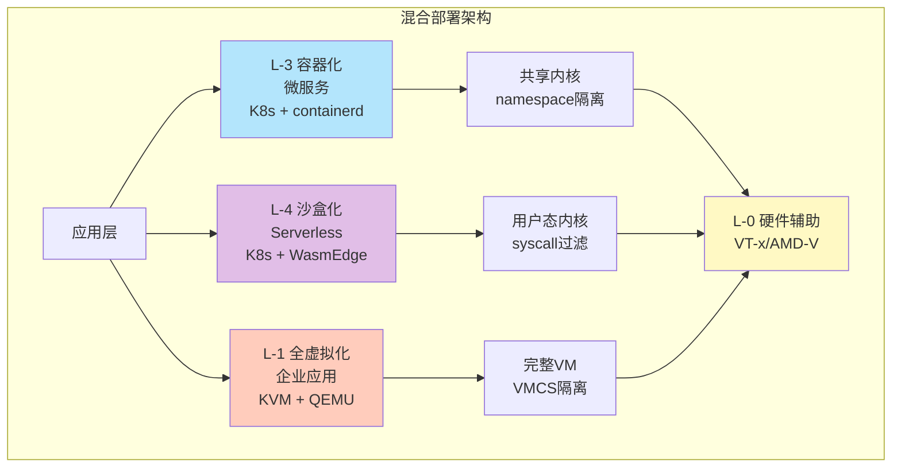

### 30.20.8 实际案例对比

#### 30.20.8.1 案例一：互联网公司微服务架构

**场景**：互联网公司微服务架构

| 层级     | 技术栈           | 部署规模  | 性能表现   | 成本分析     |
| -------- | ---------------- | --------- | ---------- | ------------ |
| **L-3**  | K8s + containerd | 1000+ Pod | 启动 1-3s  | 中等成本     |
| **L-4**  | K8s + WasmEdge   | 500+ Pod  | 启动 <10ms | 低成本       |
| **混合** | L-3 + L-4        | 1500+ Pod | 差异化启动 | 最优成本效益 |

**结论**：使用 L-3 容器化处理标准微服务，L-4 沙盒化处理高频调用函数，实现成本与
性能平衡。

#### 30.20.8.2 案例二：边缘计算场景

**场景**：5G MEC 边缘节点

| 层级    | 技术栈           | 部署规模 | 资源占用     | 性能表现    |
| ------- | ---------------- | -------- | ------------ | ----------- |
| **L-1** | KVM + QEMU       | 10 VM    | 高（128MB+） | 启动 10-20s |
| **L-3** | K3s + containerd | 50 Pod   | 中（20MB+）  | 启动 2-3s   |
| **L-4** | K3s + WasmEdge   | 200 Pod  | 低（2MB+）   | 启动 <10ms  |

**结论**：L-4 沙盒化（K3s + WasmEdge）最适合边缘计算场景，资源占用低，启动速度快
。

#### 30.20.8.3 案例三：企业级合规场景

**场景**：金融行业多租户隔离

| 层级    | 技术栈           | 隔离强度   | 合规性 | 成本 |
| ------- | ---------------- | ---------- | ------ | ---- |
| **L-1** | KVM + ESXi       | ⭐⭐⭐⭐⭐ | 高     | 高   |
| **L-3** | K8s + containerd | ⭐⭐⭐     | 中     | 中   |
| **L-4** | K8s + gVisor     | ⭐⭐⭐⭐⭐ | 高     | 中   |

**结论**：使用 L-1 全虚拟化处理核心业务系统，L-4 沙盒化（gVisor）处理非核心应用
，实现安全与成本平衡。

### 30.20.9 可观测性维度对比

**可观测性对比矩阵**：

| 维度             | L-1 全虚拟化         | L-2 半虚拟化        | L-3 容器化            | L-4 沙盒化             |
| ---------------- | -------------------- | ------------------- | --------------------- | ---------------------- |
| **Metrics 收集** | VM 内部 + 主机层     | 主机层 + Guest      | namespace 级别        | 应用层 + 用户态内核    |
| **Logging**      | VM 日志 + 主机日志   | 主机日志 + Guest    | 容器日志 + 主机日志   | 应用日志 + 沙盒日志    |
| **Tracing**      | VM 级别追踪          | 主机 + Guest 追踪   | Pod 级别追踪          | 函数级别追踪           |
| **监控工具**     | Prometheus + VM 工具 | Prometheus + virtio | Prometheus + cAdvisor | Prometheus + Wasm 工具 |
| **调试能力**     | ⭐⭐⭐               | ⭐⭐⭐              | ⭐⭐⭐⭐⭐            | ⭐⭐⭐⭐               |
| **eBPF 支持**    | ⚠️ 有限              | ✅ 良好             | ✅ 优秀               | ⚠️ 有限                |
| **OTLP 集成**    | ⚠️ 需要适配          | ⚠️ 需要适配         | ✅ 原生支持           | ✅ 原生支持            |

**可观测性推荐方案**：

- **L-1 全虚拟化**：使用 VM 内部监控 + 主机层 eBPF
- **L-2 半虚拟化**：使用 virtio 监控 + 主机层 eBPF
- **L-3 容器化**：使用 cAdvisor + Prometheus + OTLP（推荐）
- **L-4 沙盒化**：使用 Wasm 工具 + Prometheus + OTLP（推荐）

---

## 30.21 使用指南

### 30.21.1 架构设计使用

**步骤 1：确定场景需求**:

根据场景选择对应的技术栈（参考 30.18.4）。

**步骤 2：查询关系矩阵**:

使用 30.4 二维关系矩阵确定技术之间的兼容性和依赖关系。

**步骤 3：验证属性传递**:

使用 30.15 关系属性传递分析验证组合后的属性是否符合要求。

**步骤 4：绘制关系图谱**:

使用 30.7 概念关系图谱可视化架构设计。

**示例**：边缘计算架构设计

```text
1. 场景：边缘计算 → K3s + WasmEdge
2. 查询：K3s ⊃ Kubernetes, WasmEdge ∘ K3s
3. 验证：性能属性传递 → 10x冷启动提升
4. 图谱：参考 30.7.2 组合关系图谱
```

### 30.21.2 技术选型使用

**步骤 1：明确选型需求**:

根据需求（性能、安全、可扩展性）确定选型维度。

**步骤 2：使用决策树**:

使用 30.14 技术选型决策树进行初步筛选。

**步骤 3：对比属性矩阵**:

使用 30.8 属性关系矩阵对比候选技术。

**步骤 4：检查兼容性**:

使用 30.4.4 兼容性矩阵确保技术兼容。

**示例**：运行时选型

```text
1. 需求：边缘场景，需要快速启动
2. 决策树：30.14.1 → WasmEdge
3. 属性对比：30.8.1 → Wasm冷启动<10ms
4. 兼容性：30.4.4 → WasmEdge与K3s兼容
```

### 30.21.3 问题定位使用

**步骤 1：确定问题域**:

根据问题现象确定涉及的概念（参考 30.19.1 概念索引）。

**步骤 2：查询依赖链**:

使用 30.7.3 依赖关系图谱定位依赖链问题。

**步骤 3：检查属性传递**:

使用 30.15 关系属性传递分析检查属性传递是否异常。

**步骤 4：验证演进兼容**:

使用 30.16 动态演进分析检查技术演进是否兼容。

**示例**：性能问题定位

```text
1. 问题：冷启动慢
2. 概念：运行时 → WasmEdge
3. 依赖链：应用 → K3s → containerd → crun → WasmEdge
4. 属性传递：性能属性传递 → 检查组合关系
5. 演进：检查是否使用最新版本（2025技术栈）
```

---

## 30.22 参考

> 📂 **文档目录结构**：本文档已建立完整的分层文档结构，各主题内容已提取为独立文
> 档：
>
> - **关系矩阵**：[matrices/](matrices/) - 二维、三维、多维关系矩阵（3 个文档）
> - **关系图谱**：[graphs/](graphs/) - 包含、组合、依赖、实现关系图谱（4 个文档
>   ）
> - **属性矩阵**：[properties/](properties/) - 性能、安全、可扩展性、可观测性属
>   性矩阵（4 个文档）
> - **应用案例**：[applications/](applications/) - 边缘计算、AI 推理
>   、Serverless、微服务场景（4 个文档）
> - **技术选型**：[decision-trees/](decision-trees/) - 运行时、编排平台、策略引
>   擎选型决策（3 个文档）
> - **分析部分**：[analysis/](analysis/) - 结构关系、关系属性传递、动态演进、范
>   畴论视角等（6 个文档）
> - **快速参考**：[reference/](reference/) - 快速参考指南、概念索引、隔离层次对
>   比（3 个文档）
>
> 所有独立文档包含完整内容，并链接回主文档对应章节。详细目录结构和使用说明请参考
> [README.md](README.md)。

### 30.22.1 相关文档

- **[27. 2025 年技术趋势](../27-2025-trends/2025-trends.md)** - 2025 年最新技术
  趋势
- **[28. 架构框架](../28-architecture-framework/architecture-framework.md)** -
  多维度架构体系
- **[29. 隔离栈](../29-isolation-stack/isolation-stack.md)** - 四层隔离栈详细解
  析
  - **[29.2 四层隔离栈总览](../29-isolation-stack/isolation-stack.md#292-四层隔离栈总览)** -
    隔离层次概览
  - **[29.3 逐层展开](../29-isolation-stack/isolation-stack.md#293-逐层展开)** -
    各层级详细解析
  - **[29.6 问题定位模型](../29-isolation-stack/isolation-stack.md#296-问题定位模型横向请求链--纵向隔离栈)** -
    横纵耦合定位方法
- **[11. 故障排查](../11-troubleshooting/troubleshooting.md)** - 常见问题解决方
  案
  - **[11.10 故障排查检查清单](../11-troubleshooting/troubleshooting.md#1110-故障排查检查清单)** -
    快速检查清单
  - **[11.11 故障排查与概念关系矩阵](../11-troubleshooting/troubleshooting.md#1111-故障排查与概念关系矩阵)** -
    集成使用
- **[16. 可观测性](../16-observability/observability.md)** - 监控与可观测性
  - **[16.11 eBPF 与可观测性集成](../16-observability/observability.md#1611-ebpf-与可观测性集成)** -
    eBPF 工具使用
  - **[16.12 OpenTelemetry 深度集成实践](../16-observability/observability.md#1612-opentelemetry-深度集成实践)** -
    OTLP 集成
- **[02. K3s](../02-k3s/k3s.md)** - 轻量级 Kubernetes
- **[03. WasmEdge](../03-wasm-edge/wasmedge.md)** - WebAssembly 运行时
- **[06. OPA 策略即代码](../06-policy-opa/policy-opa.md)** - 策略管理
- **[13. 缩写词汇表](../13-acronyms-glossary/acronyms-glossary.md)** - 所有缩写
  词定义
- **[14. 主题清单](../14-theme-inventory/theme-inventory.md)** - 所有主题梳理

### 30.22.2 外部资源

- **CNCF Landscape** - 云原生技术全景图
- **Wikipedia - Enterprise Architecture** - 企业架构标准
- **OpenTelemetry** - 可观测性标准
- **eBPF** - 内核可编程接口

### 30.22.3 技术标准

- **OCI (Open Container Initiative)** - 容器标准
- **CRI (Container Runtime Interface)** - 运行时接口
- **CNI (Container Network Interface)** - 网络接口
- **CSI (Container Storage Interface)** - 存储接口
- **WASI (WebAssembly System Interface)** - Wasm 系统接口

---

## 30.23 文档总结

### 30.23.1 文档价值总结

本文档提供了**2025 年技术堆栈**的全面概念关系梳理，包括：

**核心价值**：

1. **系统性梳理**：全面梳理所有核心概念及其关系
2. **多维分析**：从二维、三维到多维的关系分析
3. **形式化定义**：提供形式化定义和数学表达（集合、代数、多维函数、范畴论）
4. **可视化展示**：提供思维导图和关系图谱
5. **实用指南**：提供使用指南、快速参考、概念索引
6. **隔离层次对比**：全面的隔离层次对比分析（9 个子节）
7. **实际案例**：提供实际应用案例和技术选型决策树

**适用场景**：

- **架构设计**：理解概念关系和依赖，进行架构设计
- **技术选型**：基于关系矩阵和决策树进行技术选型
- **问题定位**：通过关系图谱快速定位问题
- **学习研究**：系统理解技术堆栈概念
- **隔离层次选型**：基于全面对比分析选择隔离层次

### 30.23.2 文档结构导航

**快速导航**：

- **概念查找**：30.19.1 核心概念索引 | [独立文档](../reference/concept-index.md)
- **快速参考**：30.18 快速参考指南 | [独立文档](../reference/quick-reference.md)
- **使用指南**：30.21 使用指南
- **隔离层次对比**：30.20 隔离层次全面对比分析 |
  [独立文档](../reference/isolation-comparison.md)
- **决策树**：30.14 技术选型决策树 | [独立文档](../decision-trees/)

**文档章节**：

- **核心概念**：30.3 核心概念体系
- **关系矩阵**：30.4-30.6 二维、三维、多维关系矩阵 | [独立文档](../matrices/)
- **关系图谱**：30.7 概念关系图谱 | [独立文档](../graphs/)
- **属性分析**：30.8 属性关系矩阵 | [独立文档](../properties/)
- **应用案例**：30.13 实际应用案例 | [独立文档](../applications/)
- **分析部分**：30.9, 30.15-30.17 结构关系、属性传递、动态演进、范畴论 |
  [独立文档](../analysis/)
- **动态演进**：30.16 动态演进分析 |
  [独立文档](../analysis/dynamic-evolution.md)
- **范畴论视角**：30.17 范畴论视角 | [独立文档](../analysis/category-theory.md)

**文档目录结构**：

> 📂 **独立文档目录**：本文档已建立完整的分层文档结构，各主题内容已提取为独立文
> 档：
>
> - **关系矩阵**：[matrices/](../matrices/) - 二维、三维、多维关系矩阵
> - **关系图谱**：[graphs/](../graphs/) - 包含、组合、依赖、实现关系图谱
> - **属性矩阵**：[properties/](../properties/) - 性能、安全、可扩展性、可观测性
>   属性矩阵
> - **应用案例**：[applications/](../applications/) - 边缘计算、AI 推理
>   、Serverless、微服务场景
> - **技术选型**：[decision-trees/](../decision-trees/) - 运行时、编排平台、策略
>   引擎选型决策
> - **分析部分**：[analysis/](../analysis/) - 结构关系、关系属性传递、动态演进、
>   范畴论视角
> - **快速参考**：[reference/](../reference/) - 快速参考指南、概念索引、隔离层次
>   对比
>
> 所有独立文档包含完整内容，并链接回主文档对应章节。详细目录结构请参考
> [README.md](README.md)。

### 30.23.3 关键结论

**2025 年技术堆栈核心结论**：

1. **L-4 沙盒化将成为主流**：随着边缘计算和 Serverless 的普及，L-4 沙盒化
   （WasmEdge）将成为主流选择
2. **混合部署是趋势**：L-3 容器化 + L-4 沙盒化混合部署，根据场景选择
3. **概念关系清晰**：技术堆栈概念之间的关系可以通过矩阵、图谱、形式化定义清晰表
   达
4. **多维关系分析**：从二维、三维到多维的关系分析，提供了全面的技术视角

---

**最后更新**: 2025-11-06 **维护者**: 项目团队
