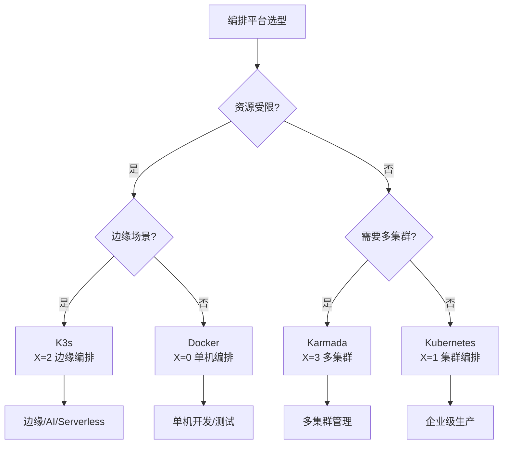

# 编排平台选型决策

**最后更新**: 2025-11-06 **维护者**: 项目团队

> 📋 **主文档链接**：[30.14.2 编排平台选型决策](../concept-relations-matrix.md#30142-编排平台选型决策)

## 决策树

## 决策矩阵

| 场景           | 资源受限 | 边缘场景 | 多集群 | 企业级 | 推荐编排平台 |
| -------------- | -------- | -------- | ------ | ------ | ------------ |
| **边缘计算**   | ✅       | ✅       | ⚠️     | ⚠️     | K3s          |
| **AI 推理**    | ⚠️       | ✅       | ❌     | ⚠️     | K3s          |
| **Serverless** | ⚠️       | ⚠️       | ❌     | ⚠️     | K3s+Knative  |
| **微服务**     | ❌       | ❌       | ⚠️     | ✅     | Kubernetes   |
| **多集群**     | ❌       | ❌       | ✅     | ✅     | Karmada      |

## 选型指南

### K3s 适用场景

- ✅ **资源受限**：单节点 < 512MB RAM
- ✅ **边缘场景**：物联网、边缘计算
- ✅ **快速部署**：单二进制，快速安装

### Kubernetes 适用场景

- ✅ **企业级生产**：需要完整企业功能
- ✅ **高可用**：多 Master 节点
- ✅ **大规模集群**：>100 节点

### Karmada 适用场景

- ✅ **多集群管理**：需要统一管理多个集群
- ✅ **跨云部署**：多云、混合云场景

## 性能对比

| 编排平台   | 资源占用 | 启动时间 | 适用场景     |
| ---------- | -------- | -------- | ------------ |
| **K3s**    | <100MB   | <30s     | 边缘计算     |
| **K8s**    | 500MB+   | 5-10min  | 企业级生产   |
| **Karmada**| 1GB+     | 10-15min | 多集群管理   |

---

**最后更新**：2025-11-06 **维护者**：项目团队

