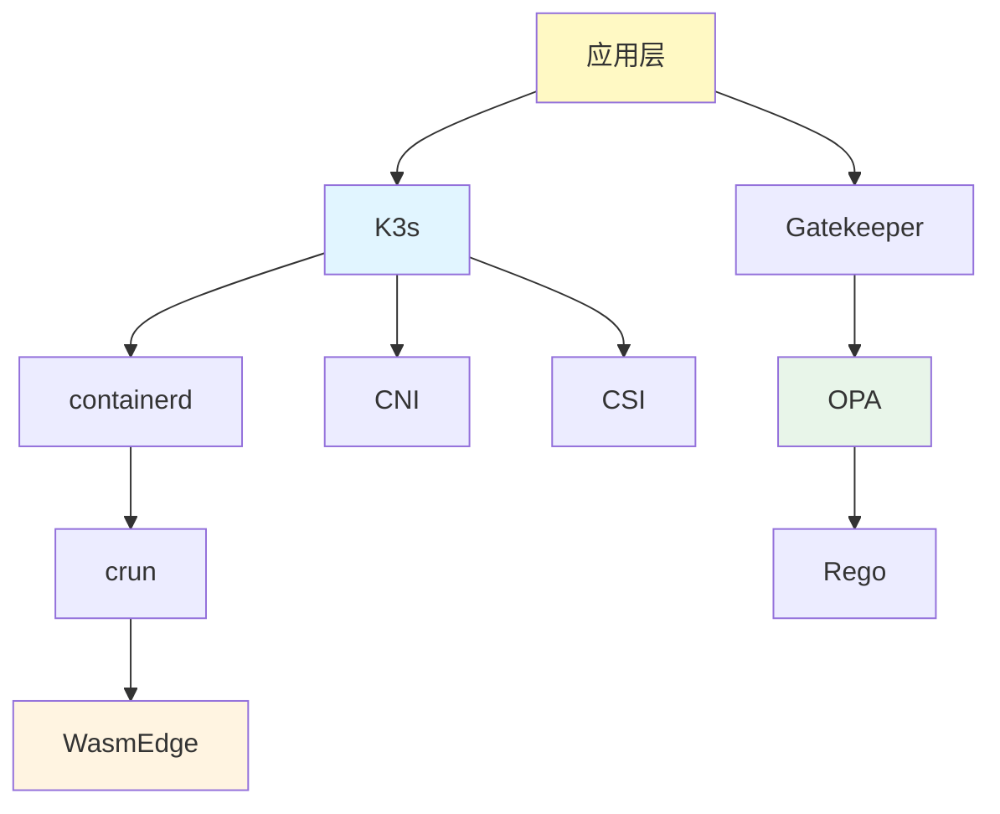

# 依赖关系图谱

**最后更新**: 2025-11-06 **维护者**: 项目团队

> 📋 **主文档链接**：[30.7.3 依赖关系图谱](../concept-relations-matrix.md#3073-依赖关系图谱)

## 依赖关系定义

**依赖关系（→）**：表示概念之间的依赖关系，A → B 表示 A 依赖 B。

## 依赖关系示例

### 运行时依赖链

- **应用层 → K3s**：应用依赖 K3s 进行编排
- **K3s → containerd**：K3s 依赖 containerd 作为运行时
- **containerd → crun**：containerd 依赖 crun 作为运行时实现
- **crun → WasmEdge**：crun 依赖 WasmEdge 支持 Wasm 运行时

### 策略依赖链

- **应用层 → Gatekeeper**：应用依赖 Gatekeeper 进行策略验证
- **Gatekeeper → OPA**：Gatekeeper 依赖 OPA 进行策略执行
- **OPA → Rego**：OPA 依赖 Rego 语言编写策略

### 基础设施依赖

- **K3s → CNI**：K3s 依赖 CNI 进行网络管理
- **K3s → CSI**：K3s 依赖 CSI 进行存储管理

## 依赖关系传递性

**依赖关系传递性**：如果 A → B 且 B → C，则 A → C

**示例**：

- **应用层 → K3s → containerd → crun → WasmEdge**
- **应用层 → Gatekeeper → OPA → Rego**

---

**最后更新**：2025-11-06 **维护者**：项目团队

