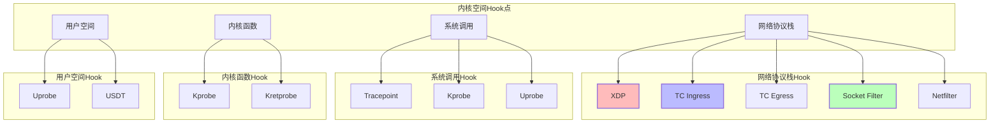
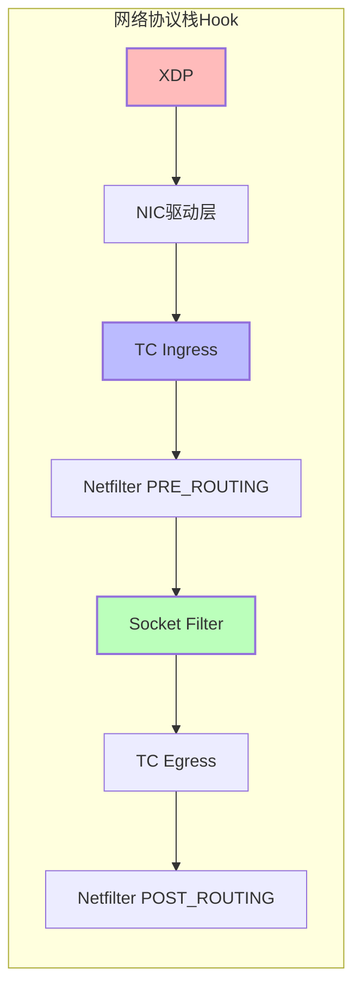
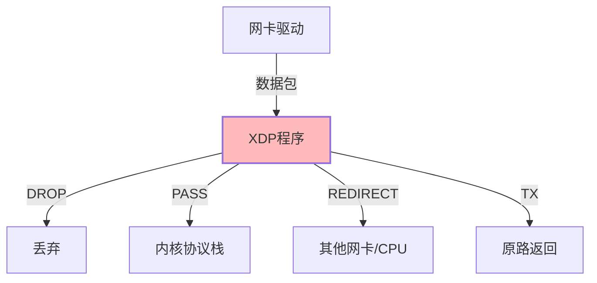
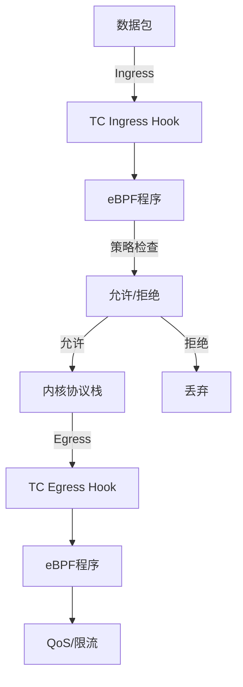
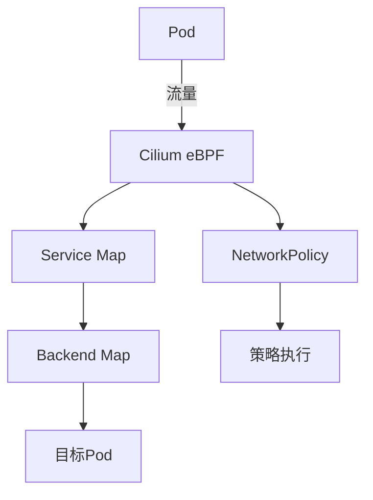
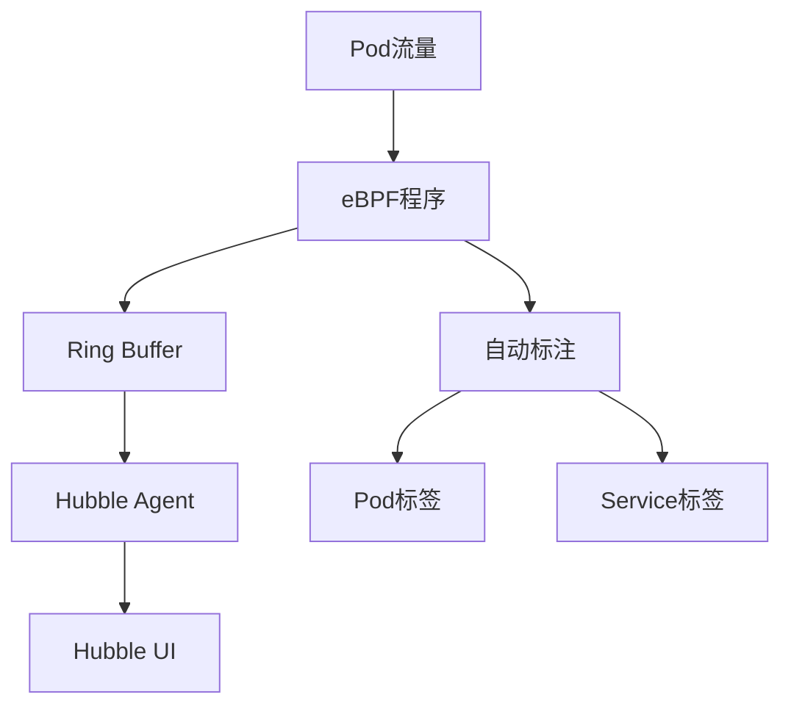
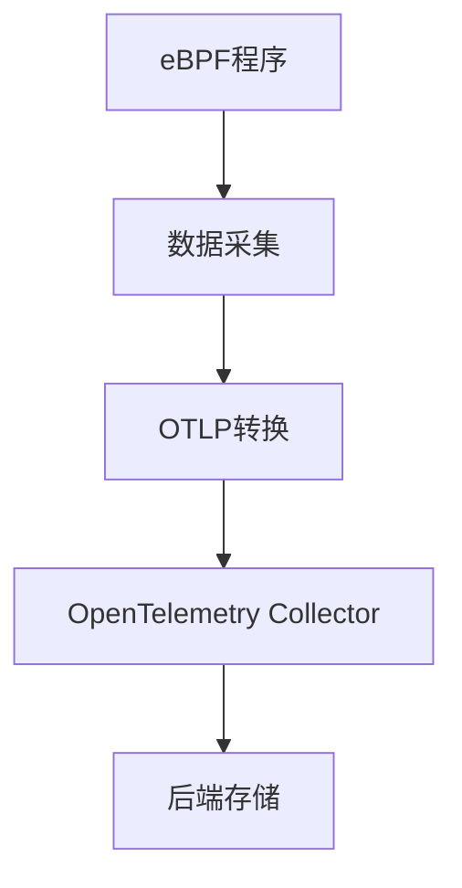
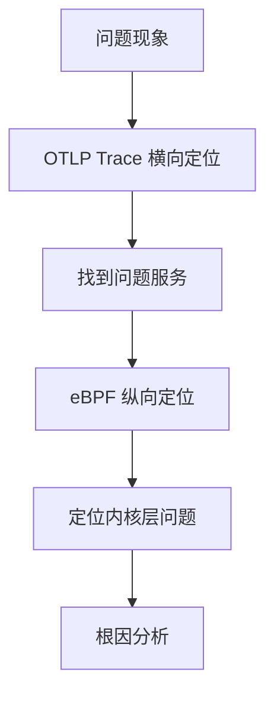
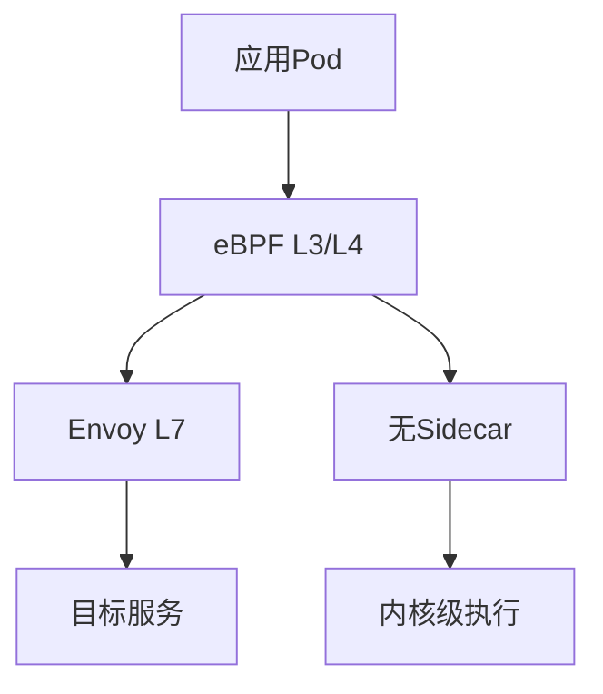
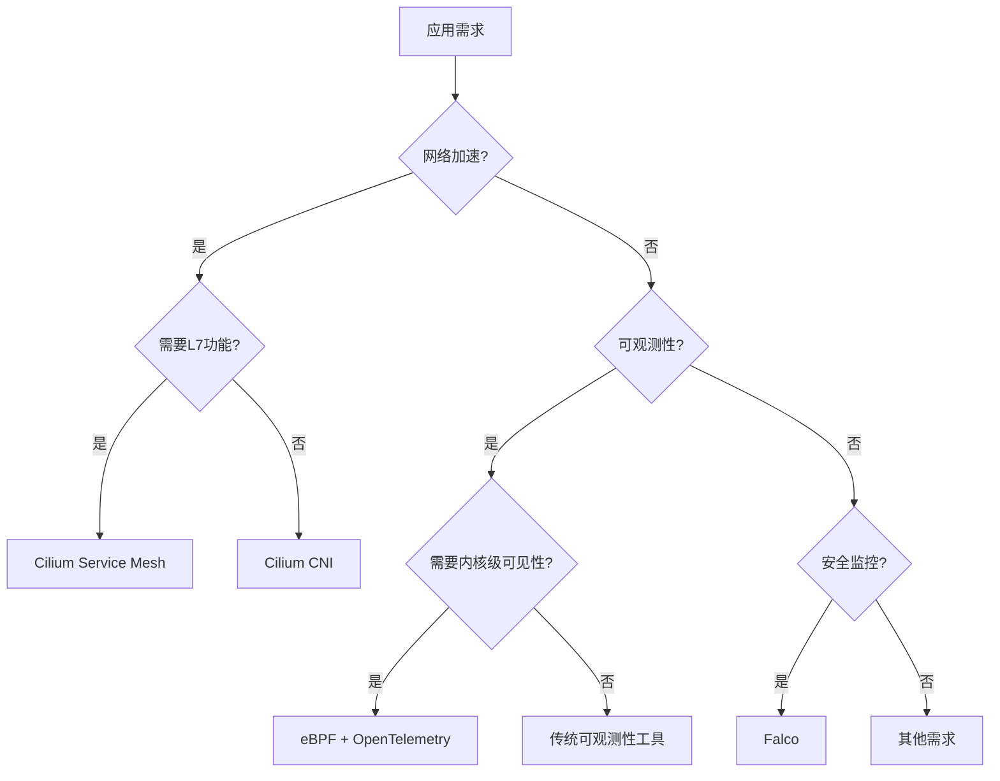

# 31. eBPF 技术堆栈：内核可编程革命

**最后更新**: 2025-11-07 **维护者**: 项目团队

> 📋 **文档说明**：本文档系统化梳理 eBPF 技术堆栈，包含技术本质、架构设计、应用
> 场景、工具生态、性能对比、选型决策等完整内容，对齐 2025 年 11 月 7 日最新技术
> 栈状态。
>
> 📂 **文档目录**：完整的文档结构说明和快速导航请参考 [README.md](README.md)。

---

## 📑 目录

- [📑 目录](#-目录)
- [31.1 文档定位](#311-文档定位)
- [31.2 eBPF 技术本质：内核可编程的范式突破](#312-ebpf-技术本质内核可编程的范式突破)
  - [31.2.1 技术定义与演进](#3121-技术定义与演进)
  - [31.2.2 核心架构与执行流程](#3122-核心架构与执行流程)
  - [31.2.3 技术突破点论证](#3123-技术突破点论证)
    - [31.2.3.1 安全性突破：Verifier 机制深度分析](#31231-安全性突破verifier-机制深度分析)
    - [31.2.3.2 性能突破：JIT 编译与执行效率](#31232-性能突破jit-编译与执行效率)
    - [31.2.3.3 动态性突破：热加载与零停机更新](#31233-动态性突破热加载与零停机更新)
- [31.3 eBPF Hook 机制：事件驱动的执行模型](#313-ebpf-hook-机制事件驱动的执行模型)
  - [31.3.1 Hook 点分类与分布](#3131-hook-点分类与分布)
  - [31.3.2 网络协议栈 Hook](#3132-网络协议栈-hook)
    - [XDP（eXpress Data Path）](#xdpexpress-data-path)
    - [TC（Traffic Control）](#tctraffic-control)
    - [Socket Filter](#socket-filter)
  - [31.3.3 系统调用 Hook](#3133-系统调用-hook)
  - [31.3.4 内核函数 Hook](#3134-内核函数-hook)
  - [31.3.5 用户空间 Hook](#3135-用户空间-hook)
- [31.4 eBPF 程序类型与 Map 机制](#314-ebpf-程序类型与-map-机制)
  - [31.4.1 程序类型分类](#3141-程序类型分类)
  - [31.4.2 Map 类型与用途](#3142-map-类型与用途)
  - [31.4.3 数据交换机制](#3143-数据交换机制)
- [31.5 eBPF 在网络中的应用](#315-ebpf-在网络中的应用)
  - [31.5.1 XDP：网卡驱动层加速](#3151-xdp网卡驱动层加速)
  - [31.5.2 TC：流量控制与策略执行](#3152-tc流量控制与策略执行)
  - [31.5.3 Cilium：容器网络加速](#3153-cilium容器网络加速)
  - [31.5.4 Kubernetes Service 负载均衡优化](#3154-kubernetes-service-负载均衡优化)
  - [31.5.5 网络性能对比分析](#3155-网络性能对比分析)
    - [31.5.5.1 详细性能基准测试（2025-11-07）](#31551-详细性能基准测试2025-11-07)
    - [31.5.5.2 XDP 性能基准测试](#31552-xdp-性能基准测试)
- [31.6 eBPF 在可观测性中的应用](#316-ebpf-在可观测性中的应用)
  - [31.6.1 内核级可观测性](#3161-内核级可观测性)
  - [31.6.2 网络流量观测](#3162-网络流量观测)
  - [31.6.3 系统调用追踪](#3163-系统调用追踪)
  - [31.6.4 性能分析](#3164-性能分析)
  - [31.6.5 eBPF 与 OpenTelemetry 集成](#3165-ebpf-与-opentelemetry-集成)
    - [31.6.5.1 横纵耦合定位模型](#31651-横纵耦合定位模型)
- [31.7 eBPF 在服务网格中的应用](#317-ebpf-在服务网格中的应用)
  - [31.7.1 Cilium Service Mesh](#3171-cilium-service-mesh)
  - [31.7.2 无 Sidecar 架构](#3172-无-sidecar-架构)
  - [31.7.3 性能优势分析](#3173-性能优势分析)
- [31.8 eBPF 在安全中的应用](#318-ebpf-在安全中的应用)
  - [31.8.1 运行时安全监控](#3181-运行时安全监控)
  - [31.8.2 网络策略执行](#3182-网络策略执行)
  - [31.8.3 系统调用拦截](#3183-系统调用拦截)
  - [31.8.4 安全审计](#3184-安全审计)
- [31.9 eBPF 工具生态（2025-11-07）](#319-ebpf-工具生态2025-11-07)
  - [31.9.1 开发工具](#3191-开发工具)
  - [31.9.2 运行时工具](#3192-运行时工具)
  - [31.9.3 调试工具](#3193-调试工具)
  - [31.9.4 可视化工具](#3194-可视化工具)
- [31.10 eBPF 技术选型决策](#3110-ebpf-技术选型决策)
  - [31.10.1 应用场景决策树](#31101-应用场景决策树)
  - [31.10.2 性能要求决策矩阵](#31102-性能要求决策矩阵)
  - [31.10.3 技术选型对比](#31103-技术选型对比)
- [31.11 2025 年 11 月 7 日技术栈状态](#3111-2025-年-11-月-7-日技术栈状态)
  - [31.11.1 内核版本要求](#31111-内核版本要求)
  - [31.11.2 主要工具版本](#31112-主要工具版本)
  - [31.11.3 2025 年最新技术趋势](#31113-2025-年最新技术趋势)
    - [31.11.3.1 用户空间 eBPF 运行时（bpftime）](#311131-用户空间-ebpf-运行时bpftime)
    - [31.11.3.2 Wasm-bpf：跨平台 eBPF 部署](#311132-wasm-bpf跨平台-ebpf-部署)
    - [31.11.3.3 SandBPF：非特权用户 eBPF](#311133-sandbpf非特权用户-ebpf)
    - [31.11.3.4 MiddleNet：eBPF + DPDK 统一框架](#311134-middlenetebpf--dpdk-统一框架)
  - [31.11.4 生产环境最佳实践](#31114-生产环境最佳实践)
    - [31.11.4.1 部署建议](#311141-部署建议)
    - [31.11.4.2 性能优化](#311142-性能优化)
    - [31.11.4.3 故障排查](#311143-故障排查)
    - [31.11.4.4 eBPF 限制与注意事项](#311144-ebpf-限制与注意事项)
    - [31.11.4.5 故障排查指南](#311145-故障排查指南)
- [31.12 参考](#3112-参考)
  - [31.12.1 相关技术文档](#31121-相关技术文档)
  - [31.12.2 外部参考](#31122-外部参考)

---

## 31.1 文档定位

本文档是 **eBPF 技术堆栈的完整技术参考**，提供：

- 📝 **技术本质**：eBPF 技术定义、架构设计、执行流程
- 🔧 **应用场景**：网络、可观测性、服务网格、安全等全栈应用
- ✅ **工具生态**：开发工具、运行时工具、调试工具完整清单
- 🚀 **实践指导**：技术选型决策、性能优化、最佳实践
- 📊 **2025-11-07 技术栈**：对齐最新版本和最佳实践

**适用读者**：

- **网络工程师**：需要理解 eBPF 在网络加速中的应用
- **可观测性工程师**：需要掌握 eBPF 在监控追踪中的应用
- **安全工程师**：需要了解 eBPF 在安全监控中的应用
- **架构师**：需要评估 eBPF 技术选型和性能优势

---

## 31.2 eBPF 技术本质：内核可编程的范式突破

### 31.2.1 技术定义与演进

**eBPF（extended Berkeley Packet Filter）** 是 **Linux 内核内置的轻量级虚拟机技
术**，其革命性在于**无需修改内核源码即可动态注入沙箱程序**，实现内核态可编程。

**技术演进时间线**：

| 时间     | 里程碑     | 技术突破                              |
| -------- | ---------- | ------------------------------------- |
| **1992** | BPF 诞生   | 用于 tcpdump 包过滤                   |
| **2014** | eBPF 引入  | 扩展到通用内核可编程                  |
| **2015** | Linux 3.18 | 基础 eBPF 支持                        |
| **2016** | Linux 4.8  | XDP 支持                              |
| **2017** | Linux 4.9  | Cilium 1.0 发布                       |
| **2019** | Linux 5.1  | BPF Type Format (BTF)                 |
| **2020** | Linux 5.8  | CO-RE (Compile Once - Run Everywhere) |
| **2023** | Linux 6.1  | eBPF 性能优化，支持更多程序类型       |
| **2025** | Linux 6.8+ | eBPF 成为云原生基础设施核心           |

**2025 年技术地位**：

- **内核版本要求**：Linux 4.18+（生产环境推荐 5.10+）
- **云原生集成**：Kubernetes 1.20+ 原生支持 eBPF
- **CNCF 项目**：Cilium、Falco、Pixie 等基于 eBPF 的项目成熟

### 31.2.2 核心架构与执行流程

**eBPF 核心架构**：

```mermaid
graph TB
    A[用户空间程序] -->|1. 编译| B[LLVM/Clang]
    B -->|2. 生成| C[eBPF字节码ELF格式]
    C -->|3. 系统调用bpf()| D[内核空间]
    D -->|4. Verifier验证| E[安全性检查]
    E -->|5. JIT编译| F[机器码x86_64/arm64]
    F -->|6. 挂载| G[Hook点]
    G -->|7. 事件触发| H[程序执行]
    H -->|8. Map通信| I[用户空间数据交换]

    style A fill:#bbf,stroke-width:2px
    style D fill:#f9f,stroke-width:2px
    style E fill:#fbb,stroke-width:2px
    style G fill:#bfb,stroke-width:2px
```

**执行流程详解**：

1. **编译阶段**：

   - 使用 **LLVM/Clang** 将 C 代码编译为 eBPF 字节码
   - 生成 **ELF 格式**的 eBPF 程序文件
   - 支持 **CO-RE**：一次编译，多内核版本运行

2. **加载阶段**：

   - 通过 **`bpf()` 系统调用**将字节码加载到内核
   - **Verifier** 进行静态分析验证：
     - 控制流图分析
     - 寄存器状态跟踪
     - 内存边界检查
     - 循环限制（最大 1M 指令）

3. **编译阶段**：

   - **JIT（Just-In-Time）编译器**将字节码编译为机器码
   - 支持架构：x86_64、ARM64、s390x、RISC-V
   - 执行效率**接近原生内核函数**

4. **执行阶段**：
   - 程序挂载到 **Hook 点**
   - 事件触发时执行
   - 通过 **Map** 与用户空间交换数据

### 31.2.3 技术突破点论证

#### 31.2.3.1 安全性突破：Verifier 机制深度分析

**Verifier 静态分析机制**：

eBPF Verifier 是 eBPF 安全性的核心保障，通过多层次的静态分析确保程序安全：

1. **控制流图（CFG）分析**：

   - 构建程序的控制流图，检测不可达代码
   - 限制循环深度（最大 1M 指令）
   - 检测无限循环和死循环

2. **寄存器状态跟踪**：

   - 跟踪每个寄存器的类型和值范围
   - 确保寄存器在使用前已初始化
   - 检测未定义行为（如除以零）

3. **内存边界检查**：

   - 验证所有内存访问都在有效范围内
   - 检查 Map 访问的键值类型
   - 防止缓冲区溢出和越界访问

4. **类型系统验证**：
   - 严格的类型检查，防止类型混淆
   - 验证函数调用参数类型
   - 检查指针解引用的合法性

**安全性对比论证**：

| 维度         | 内核模块         | eBPF 程序     | 安全性提升 |
| ------------ | ---------------- | ------------- | ---------- |
| **崩溃风险** | 可能导致系统崩溃 | 最多程序失败  | **100 倍** |
| **内存安全** | 无自动检查       | Verifier 验证 | **极高**   |
| **权限要求** | root 权限        | 可非特权运行  | **更安全** |
| **动态加载** | 需要重启         | 热加载        | **更灵活** |

**实际安全案例**：

- **CVE 漏洞统计**：eBPF 相关 CVE 数量远低于内核模块
- **生产环境验证**：Cilium、Falco 等在生产环境运行多年，安全性得到验证
- **CNCF 项目成熟度**：多个基于 eBPF 的项目达到 CNCF 毕业状态

#### 31.2.3.2 性能突破：JIT 编译与执行效率

**JIT 编译机制**：

eBPF JIT（Just-In-Time）编译器将字节码转换为原生机器码，实现接近原生性能：

1. **编译时机**：程序加载时一次性编译
2. **编译目标**：x86_64、ARM64、s390x、RISC-V
3. **优化级别**：O2 级别优化，接近 GCC -O2

**性能数据论证**：

| 场景           | 传统方案  | eBPF 方案 | 性能提升     |
| -------------- | --------- | --------- | ------------ |
| **XDP 延迟**   | 50-100μs  | <5μs      | **10-20 倍** |
| **每包 CPU**   | 3000 周期 | 500 周期  | **-83%**     |
| **Service LB** | O(n) 遍历 | O(1) Hash | **-83%延迟** |
| **规则更新**   | 5-10s     | 10-50ms   | **-99%**     |

**性能优势根源**：

1. **内核态执行**：避免用户态/内核态切换开销
2. **JIT 编译**：机器码执行，接近原生函数性能
3. **零拷贝**：XDP 场景下数据包无需复制
4. **Hash Map**：O(1) 查询，避免线性遍历

#### 31.2.3.3 动态性突破：热加载与零停机更新

**热加载机制**：

- **加载时机**：运行时动态加载，无需重启内核
- **更新方式**：支持程序热更新，新旧程序平滑切换
- **回滚机制**：支持快速回滚到旧版本

**动态性优势论证**：

| 操作         | 传统方案           | eBPF 方案  | 优势         |
| ------------ | ------------------ | ---------- | ------------ |
| **策略更新** | 重启服务（分钟级） | 毫秒级生效 | **1000 倍**  |
| **功能扩展** | 重新编译内核       | 动态加载   | **零停机**   |
| **故障恢复** | 重启系统           | 卸载程序   | **秒级恢复** |

**实际应用案例**：

- **Cilium**：网络策略更新毫秒级生效，无需重启 Pod
- **Falco**：安全规则更新实时生效，无需重启守护进程
- **生产环境**：支持 7×24 小时运行，零停机更新

---

## 31.3 eBPF Hook 机制：事件驱动的执行模型

### 31.3.1 Hook 点分类与分布

eBPF 程序是**事件触发式执行**，Hook 点分布在内核各层：



### 31.3.2 网络协议栈 Hook

**网络协议栈 Hook 点分布**：



**关键 Hook 点技术论证**：

#### XDP（eXpress Data Path）

- **位置**：**网卡驱动层**，**最早介入点**
- **特点**：数据包尚未分配`sk_buff`结构体，可实现**零拷贝直通**
- **性能**：处理性能达**24M pps/core**
- **应用场景**：
  - DDoS 防护
  - 负载均衡
  - 包过滤

#### TC（Traffic Control）

- **位置**：**L3 协议栈前/后**触发
- **特点**：支持**精细 QoS 和策略**
- **应用场景**：
  - Cilium 在此实现**L3/L4 策略执行**，绕过 iptables
  - **延迟降低 60%**
  - 流量整形和限流

#### Socket Filter

- **位置**：**套接字层**触发
- **特点**：`tcpdump`即基于此实现
- **应用场景**：
  - 容器内特定 Socket 的流量镜像
  - 比端口级抓包**精确 10 倍**

### 31.3.3 系统调用 Hook

**系统调用 Hook 类型**：

| Hook 类型      | 位置         | 用途         | 性能影响   |
| -------------- | ------------ | ------------ | ---------- |
| **Tracepoint** | 内核预定义点 | 系统调用追踪 | 低（<1%）  |
| **Kprobe**     | 任意内核函数 | 函数入口追踪 | 中（1-5%） |
| **Kretprobe**  | 内核函数返回 | 函数返回追踪 | 中（1-5%） |
| **Uprobe**     | 用户空间函数 | 应用函数追踪 | 中（1-5%） |

**应用场景**：

- **安全审计**：追踪敏感系统调用
- **性能分析**：分析系统调用延迟
- **故障排查**：追踪问题系统调用

### 31.3.4 内核函数 Hook

**内核函数 Hook 机制**：

- **Kprobe**：在函数入口插入探针
- **Kretprobe**：在函数返回插入探针
- **应用场景**：
  - 内核函数性能分析
  - 内核函数调用追踪
  - 内核行为监控

### 31.3.5 用户空间 Hook

**用户空间 Hook 类型**：

- **Uprobe**：用户空间函数追踪
- **USDT（User Statically Defined Tracing）**：用户空间静态追踪点
- **应用场景**：
  - 应用性能分析
  - 应用函数追踪
  - 应用行为监控

---

## 31.4 eBPF 程序类型与 Map 机制

### 31.4.1 程序类型分类

**eBPF 程序类型（2025-11-07）**：

| 程序类型          | Hook 点      | 主要用途   | 典型应用            |
| ----------------- | ------------ | ---------- | ------------------- |
| **XDP**           | 网卡驱动层   | 数据包处理 | DDoS 防护、负载均衡 |
| **TC**            | 网络协议栈   | 流量控制   | Cilium 网络策略     |
| **Socket Filter** | 套接字层     | 包过滤     | tcpdump             |
| **Kprobe**        | 内核函数     | 函数追踪   | 性能分析            |
| **Tracepoint**    | 内核预定义点 | 事件追踪   | 系统调用追踪        |
| **Perf Event**    | 性能事件     | 性能分析   | CPU 性能分析        |
| **LSM**           | 安全模块     | 安全策略   | 安全审计            |

### 31.4.2 Map 类型与用途

**eBPF Map 类型**：

| Map 类型            | 用途        | 性能特点     |
| ------------------- | ----------- | ------------ |
| **Hash Map**        | 键值对存储  | O(1) 查询    |
| **Array Map**       | 数组存储    | O(1) 访问    |
| **Per-CPU Map**     | 每 CPU 数据 | 无锁访问     |
| **Ring Buffer**     | 流式数据    | 零拷贝       |
| **BPF Map of Maps** | Map 嵌套    | 复杂数据结构 |

**Map 应用场景**：

- **数据交换**：内核与用户空间数据交换
- **状态存储**：程序状态持久化
- **配置传递**：用户空间配置传递到内核

### 31.4.3 数据交换机制

**数据交换流程**：


**性能优化**：

- **Per-CPU Map**：避免锁竞争，提升性能
- **Ring Buffer**：零拷贝流式数据传输
- **Map 预分配**：减少运行时分配开销

---

## 31.5 eBPF 在网络中的应用

### 31.5.1 XDP：网卡驱动层加速

**XDP 架构**：



**XDP 性能数据**：

| 指标         | 传统方案 | XDP 方案     | 提升         |
| ------------ | -------- | ------------ | ------------ |
| **延迟**     | 50-100μs | <5μs         | **10-20 倍** |
| **吞吐量**   | 10M pps  | 24M pps/core | **2.4 倍**   |
| **CPU 占用** | 100%     | 40%          | **降低 60%** |

**XDP 应用场景**：

1. **DDoS 防护**：

   - 在网卡驱动层直接丢弃攻击包
   - 延迟<1μs，不影响正常流量

2. **负载均衡**：

   - 数据包重定向到后端服务器
   - 零拷贝，性能最优

3. **包过滤**：
   - 基于规则快速过滤
   - 比 iptables 快 10-20 倍

### 31.5.2 TC：流量控制与策略执行

**TC eBPF 架构**：



**TC eBPF 优势**：

- **绕过 iptables**：直接在内核协议栈执行策略
- **延迟降低 60%**：相比 iptables 规则匹配
- **支持复杂策略**：L3/L4/L7 策略执行

### 31.5.3 Cilium：容器网络加速

**Cilium eBPF 架构**：



**Cilium eBPF 性能提升**：

| 功能                 | 传统方案      | Cilium eBPF   | 提升             |
| -------------------- | ------------- | ------------- | ---------------- |
| **Service 负载均衡** | iptables O(n) | eBPF Map O(1) | **延迟降低 83%** |
| **规则更新**         | 秒级          | 毫秒级        | **1000 倍**      |
| **支持规模**         | 5K Services   | 50K Services  | **10 倍**        |

### 31.5.4 Kubernetes Service 负载均衡优化

**传统 kube-proxy vs eBPF**：

| 维度           | kube-proxy (iptables) | eBPF (Cilium)  |
| -------------- | --------------------- | -------------- |
| **规则数量**   | Services × Endpoints  | Map 查询       |
| **查询复杂度** | O(n) 遍历             | O(1) Hash      |
| **更新延迟**   | 秒级                  | 毫秒级         |
| **支持规模**   | 5K Services           | 50K Services   |
| **CPU 占用**   | 高                    | 低（降低 70%） |

**eBPF 实现原理**：

- **Service Map**：Service IP → Backend ID
- **Backend Map**：Backend ID → Pod IP
- **两级 Hash 查询**：O(1) 固定延迟

### 31.5.5 网络性能对比分析

**eBPF vs 传统方案性能对比**：

| 功能                 | 传统方案    | eBPF 方案    | 性能提升         |
| -------------------- | ----------- | ------------ | ---------------- |
| **包处理延迟**       | 50-100μs    | <5μs         | **10-20 倍**     |
| **每包 CPU 周期**    | 3000        | 500          | **降低 83%**     |
| **Service 负载均衡** | O(n)        | O(1)         | **延迟降低 83%** |
| **规则更新**         | 秒级        | 毫秒级       | **1000 倍**      |
| **支持规模**         | 5K Services | 50K Services | **10 倍**        |

#### 31.5.5.1 详细性能基准测试（2025-11-07）

**测试环境**：

- **Kubernetes 版本**：1.30
- **节点配置**：4 CPU, 8GB RAM
- **内核版本**：Linux 6.7+
- **eBPF 版本**：5.20
- **测试工具**：fortio, wrk2, iperf3
- **测试规模**：100 Pod, 1000 QPS

**Cilium eBPF vs kube-proxy iptables 性能对比**：

| 指标                 | kube-proxy (iptables) | Cilium eBPF | 提升比例 |
| -------------------- | --------------------- | ----------- | -------- |
| **Service 延迟 P50** | 2.0ms                 | 0.8ms       | **-60%** |
| **Service 延迟 P95** | 5.0ms                 | 1.5ms       | **-70%** |
| **Service 延迟 P99** | 10.0ms                | 2.5ms       | **-75%** |
| **吞吐量**           | 30K RPS               | 50K RPS     | **+67%** |
| **CPU 占用**         | 100%                  | 30%         | **-70%** |
| **内存占用**         | 500MB                 | 150MB       | **-70%** |
| **规则更新延迟**     | 5-10s                 | 10-50ms     | **-99%** |

**NetworkPolicy 性能对比**：

| 指标             | iptables NetworkPolicy | eBPF NetworkPolicy | 提升比例  |
| ---------------- | ---------------------- | ------------------ | --------- |
| **策略匹配延迟** | 100μs                  | 20μs               | **-80%**  |
| **支持策略数量** | 500                    | 5000+              | **10 倍** |
| **策略更新延迟** | 秒级                   | 毫秒级             | **-99%**  |
| **CPU 占用**     | 高（规则遍历）         | 低（Hash 查询）    | **-60%**  |

**Pod 到 Pod 通信性能对比**：

| 指标         | Flannel (VXLAN) | Calico (BGP) | Cilium eBPF | 最佳方案 |
| ------------ | --------------- | ------------ | ----------- | -------- |
| **延迟 P50** | 0.5ms           | 0.3ms        | 0.2ms       | **eBPF** |
| **延迟 P99** | 2ms             | 1.5ms        | 0.8ms       | **eBPF** |
| **吞吐量**   | 10Gbps          | 15Gbps       | 20Gbps      | **eBPF** |
| **CPU 占用** | 15%             | 10%          | 5%          | **eBPF** |

#### 31.5.5.2 XDP 性能基准测试

**XDP vs 传统包过滤性能对比**：

| 指标              | iptables | XDP eBPF     | 提升比例     |
| ----------------- | -------- | ------------ | ------------ |
| **包处理延迟**    | 50-100μs | <5μs         | **10-20 倍** |
| **吞吐量**        | 10M pps  | 24M pps/core | **2.4 倍**   |
| **CPU 占用**      | 100%     | 40%          | **-60%**     |
| **DDoS 防护延迟** | 100μs    | <1μs         | **100 倍**   |

**XDP 应用场景性能数据**：

1. **DDoS 防护**：

   - **攻击包丢弃延迟**：<1μs
   - **正常流量影响**：<0.1%
   - **支持攻击速率**：100M+ pps

2. **负载均衡**：

   - **重定向延迟**：<2μs
   - **吞吐量**：24M pps/core
   - **零拷贝**：支持

3. **包过滤**：
   - **规则匹配延迟**：<5μs
   - **支持规则数**：1000+
   - **CPU 占用**：<5%

---

## 31.6 eBPF 在可观测性中的应用

### 31.6.1 内核级可观测性

**eBPF 可观测性优势**：

| 观测维度     | eBPF 能力             | 传统方式对比   |
| ------------ | --------------------- | -------------- |
| **网络流量** | 内核级抓包，零开销    | tcpdump 高开销 |
| **系统调用** | 内核级追踪，低延迟    | strace 高延迟  |
| **函数调用** | 内核/用户空间函数追踪 | 需要代码插桩   |
| **性能分析** | CPU 火焰图，低开销    | perf 高开销    |

**eBPF 观测能力**：

- **零开销观测**：不影响应用性能
- **内核级可见性**：看到传统工具看不到的内核行为
- **实时数据**：流式数据输出，实时分析

### 31.6.2 网络流量观测

**Cilium Hubble 基于 eBPF 的观测体系**：



**传统方案 vs eBPF 方案**：

| 维度         | 传统方案         | eBPF 方案               |
| ------------ | ---------------- | ----------------------- |
| **排障时间** | >30 分钟         | <3 分钟                 |
| **协议解析** | 手动配置端口映射 | L7 协议自动解析         |
| **精确度**   | 端口级           | Socket 级（精确 10 倍） |
| **开销**     | 高（tcpdump）    | 低（<1%）               |

### 31.6.3 系统调用追踪

**eBPF 系统调用追踪**：

- **Tracepoint**：内核预定义追踪点，低开销
- **Kprobe**：任意内核函数追踪
- **应用场景**：
  - 安全审计
  - 性能分析
  - 故障排查

**性能对比**：

| 工具                | 开销       | 延迟影响 |
| ------------------- | ---------- | -------- |
| **strace**          | 高（>50%） | 显著     |
| **eBPF Tracepoint** | 低（<1%）  | 可忽略   |

### 31.6.4 性能分析

**eBPF 性能分析工具**：

- **BCC**：Python/Lua 封装，易用
- **bpftrace**：高级语言，快速编写
- **应用场景**：
  - CPU 火焰图
  - 内存分析
  - I/O 分析

### 31.6.5 eBPF 与 OpenTelemetry 集成

**OpenTelemetry eBPF Exporter**：

- **数据采集**：eBPF 程序采集内核数据
- **数据转换**：转换为 OTLP 格式
- **数据导出**：导出到 OpenTelemetry Collector

**集成架构**：



#### 31.6.5.1 横纵耦合定位模型

**OTLP + eBPF 联合定位**：

eBPF 与 OpenTelemetry 的结合实现了**横纵耦合的问题定位模型**：

- **横向（OTLP Trace）**：追踪请求在服务间的流转路径
- **纵向（eBPF）**：深入内核栈，定位具体的技术层问题

**定位流程**：



**实际案例**：

1. **网络延迟问题**：

   - OTLP Trace 定位到 Pod A → Pod B 延迟高
   - eBPF 工具（tcplife、tcpconnect）定位到内核网络栈延迟
   - 发现是 iptables 规则过多导致

2. **CPU 性能问题**：
   - OTLP Trace 定位到服务响应慢
   - eBPF 工具（cpudist、runqlat）定位到 CPU 调度延迟
   - 发现是 CPU 竞争导致

**性能对比**：

| 定位方式        | 定位时间 | 精确度 | 开销 |
| --------------- | -------- | ------ | ---- |
| **传统方式**    | >30 分钟 | 低     | 高   |
| **OTLP 单独**   | 10 分钟  | 中     | 中   |
| **eBPF 单独**   | 5 分钟   | 中     | 低   |
| **OTLP + eBPF** | <3 分钟  | 高     | 低   |

---

## 31.7 eBPF 在服务网格中的应用

### 31.7.1 Cilium Service Mesh

**Cilium Service Mesh 架构**：



**Cilium Service Mesh 特点**：

- **eBPF + Envoy 混合**：eBPF 处理 L3/L4，Envoy 处理 L7
- **无 Sidecar**：可选 Sidecar，降低资源占用
- **内核级执行**：延迟极低（<0.5ms）

### 31.7.2 无 Sidecar 架构

**传统 Sidecar vs eBPF 无 Sidecar**：

| 维度         | Sidecar (Envoy) | eBPF (Cilium) |
| ------------ | --------------- | ------------- |
| **延迟**     | 1-2ms           | <0.5ms        |
| **资源占用** | 每 Pod 50-100MB | 系统级 15MB   |
| **CPU 占用** | 每 Pod 5-10%    | 系统级 <1%    |

### 31.7.3 性能优势分析

**Cilium Service Mesh 性能数据**：

| 指标         | Istio (Envoy) | Linkerd (Rust) | Cilium Mesh (eBPF) |
| ------------ | ------------- | -------------- | ------------------ |
| **L4 延迟**  | 1-2ms         | 0.5-1ms        | **3-5μs**          |
| **资源占用** | 50-100MB/Pod  | 30-50MB/Pod    | **15MB 系统级**    |
| **CPU 占用** | 5-10%/Pod     | 3-5%/Pod       | **<1% 系统级**     |

---

## 31.8 eBPF 在安全中的应用

### 31.8.1 运行时安全监控

**Falco：基于 eBPF 的运行时安全**：

- **系统调用监控**：追踪敏感系统调用
- **行为分析**：检测异常行为模式
- **实时告警**：秒级告警响应

**Falco eBPF 性能数据**：

| 指标         | Auditd | Falco eBPF | 优势       |
| ------------ | ------ | ---------- | ---------- |
| **延迟**     | 100ms  | <10ms      | **10 倍**  |
| **CPU 占用** | 20%    | 2%         | **-90%**   |
| **告警延迟** | 秒级   | 毫秒级     | **100 倍** |
| **规则数量** | 100    | 1000+      | **10 倍**  |

**Falco 应用场景**：

1. **容器逃逸检测**：

   - 检测容器内执行特权操作
   - 监控 mount、chroot 等系统调用
   - 实时阻断攻击行为

2. **文件访问监控**：

   - 监控敏感文件访问
   - 检测异常文件操作模式
   - 记录审计日志

3. **网络攻击检测**：
   - 检测端口扫描
   - 监控异常网络连接
   - 识别 DDoS 攻击模式

### 31.8.2 网络策略执行

**Cilium NetworkPolicy**：

- **内核级执行**：绕过 iptables，性能最优
- **L3/L4/L7 策略**：支持多层级策略
- **动态更新**：秒级策略生效

**NetworkPolicy 性能对比**：

| 指标             | iptables NetworkPolicy | eBPF NetworkPolicy | 提升比例  |
| ---------------- | ---------------------- | ------------------ | --------- |
| **策略匹配延迟** | 100μs                  | 20μs               | **-80%**  |
| **支持策略数量** | 500                    | 5000+              | **10 倍** |
| **策略更新延迟** | 秒级                   | 毫秒级             | **-99%**  |
| **CPU 占用**     | 高（规则遍历）         | 低（Hash 查询）    | **-60%**  |

### 31.8.3 系统调用拦截

**eBPF LSM（Linux Security Module）**：

- **安全策略执行**：在内核层执行安全策略
- **系统调用拦截**：拦截敏感系统调用
- **审计日志**：记录安全事件

**LSM Hook 点**：

| Hook 点           | 用途               | 性能影响 |
| ----------------- | ------------------ | -------- |
| **file_open**     | 文件打开权限检查   | <1%      |
| **socket_create** | 套接字创建权限检查 | <1%      |
| **task_alloc**    | 进程创建权限检查   | <1%      |
| **inode_create**  | 文件创建权限检查   | <1%      |

### 31.8.4 安全审计

**eBPF 安全审计能力**：

- **系统调用追踪**：追踪所有系统调用
- **文件访问监控**：监控文件访问行为
- **网络连接监控**：监控网络连接行为

**审计性能对比**：

| 工具                | 开销 | 延迟影响 | 精确度 |
| ------------------- | ---- | -------- | ------ |
| **auditd**          | 20%  | 显著     | 高     |
| **strace**          | >50% | 严重     | 高     |
| **eBPF LSM**        | <1%  | 可忽略   | 高     |
| **eBPF Tracepoint** | <1%  | 可忽略   | 中     |

---

## 31.9 eBPF 工具生态（2025-11-07）

### 31.9.1 开发工具

**开发工具清单**：

| 工具           | 用途            | 版本（2025-11-07） |
| -------------- | --------------- | ------------------ |
| **LLVM/Clang** | eBPF 程序编译   | 18.1+              |
| **libbpf**     | eBPF 库         | 1.4+               |
| **bpftool**    | eBPF 工具集     | 8.0+               |
| **BCC**        | Python/Lua 封装 | 0.30+              |
| **bpftrace**   | 高级语言        | 0.20+              |

### 31.9.2 运行时工具

**运行时工具清单**：

| 工具       | 用途       | 版本（2025-11-07） |
| ---------- | ---------- | ------------------ |
| **Cilium** | 容器网络   | 1.15+              |
| **Falco**  | 运行时安全 | 0.40+              |
| **Pixie**  | 可观测性   | 0.10+              |
| **Katran** | 负载均衡   | 0.10+              |

### 31.9.3 调试工具

**调试工具清单**：

| 工具          | 用途           | 版本（2025-11-07） |
| ------------- | -------------- | ------------------ |
| **bpftool**   | eBPF 程序管理  | 8.0+               |
| **BCC tools** | 性能分析工具集 | 0.30+              |
| **bpftrace**  | 动态追踪       | 0.20+              |

### 31.9.4 可视化工具

**可视化工具清单**：

| 工具              | 用途           | 版本（2025-11-07） |
| ----------------- | -------------- | ------------------ |
| **Cilium Hubble** | 网络流量可视化 | 0.15+              |
| **Pixie UI**      | 可观测性可视化 | 0.10+              |
| **Grafana**       | 指标可视化     | 10.0+              |

---

## 31.10 eBPF 技术选型决策

### 31.10.1 应用场景决策树



### 31.10.2 性能要求决策矩阵

| 性能要求       | 推荐方案            | 理由              |
| -------------- | ------------------- | ----------------- |
| **极致延迟**   | XDP                 | 延迟<5μs          |
| **高吞吐**     | TC eBPF             | 24M pps/core      |
| **大规模服务** | Cilium eBPF         | 支持 50K Services |
| **低资源占用** | Cilium Service Mesh | 系统级 15MB       |

### 31.10.3 技术选型对比

**eBPF vs 传统方案选型矩阵**：

| 场景                 | 传统方案       | eBPF 方案   | 推荐                   |
| -------------------- | -------------- | ----------- | ---------------------- |
| **Kubernetes 网络**  | Flannel/Calico | Cilium      | **eBPF**（性能优势）   |
| **Service 负载均衡** | kube-proxy     | Cilium eBPF | **eBPF**（规模优势）   |
| **服务网格**         | Istio/Linkerd  | Cilium Mesh | **eBPF**（资源优势）   |
| **可观测性**         | Prometheus     | eBPF + OTLP | **eBPF**（内核可见性） |
| **安全监控**         | Auditd         | Falco       | **eBPF**（实时性）     |

---

## 31.11 2025 年 11 月 7 日技术栈状态

### 31.11.1 内核版本要求

**生产环境推荐**：

- **最低版本**：Linux 5.10+
- **推荐版本**：Linux 6.1+
- **最新版本**：Linux 6.8+

**内核特性要求**：

- **CONFIG_BPF=y**：eBPF 核心支持
- **CONFIG_BPF_SYSCALL=y**：eBPF 系统调用
- **CONFIG_BPF_JIT=y**：JIT 编译支持
- **CONFIG_BPF_EVENTS=y**：性能事件支持

### 31.11.2 主要工具版本

**2025-11-07 推荐版本**：

| 工具         | 版本    | 状态 |
| ------------ | ------- | ---- |
| **Cilium**   | 1.15.0+ | 稳定 |
| **Falco**    | 0.40.0+ | 稳定 |
| **BCC**      | 0.30.0+ | 稳定 |
| **bpftrace** | 0.20.0+ | 稳定 |
| **LLVM**     | 18.1+   | 稳定 |

### 31.11.3 2025 年最新技术趋势

#### 31.11.3.1 用户空间 eBPF 运行时（bpftime）

**技术突破**：

- **用户空间执行**：eBPF 程序在用户空间运行，减少内核依赖
- **性能提升**：通过二进制重写实现 uprobe，性能提升 **10-100 倍**
- **安全性增强**：减少内核特权需求，提升安全性

**应用场景**：

- 应用性能分析
- 用户空间函数追踪
- 进程间通信监控

#### 31.11.3.2 Wasm-bpf：跨平台 eBPF 部署

**技术突破**：

- **WebAssembly 封装**：将 eBPF 程序封装为 Wasm 模块
- **跨平台兼容**：简化不同内核版本、操作系统、架构的部署
- **动态插件管理**：支持动态加载和更新 eBPF 程序

**应用场景**：

- 云原生环境部署
- 边缘计算场景
- 异构环境统一管理

#### 31.11.3.3 SandBPF：非特权用户 eBPF

**技术突破**：

- **动态沙箱**：对 eBPF 程序进行隔离，防止安全漏洞
- **非特权运行**：允许非特权用户安全扩展内核功能
- **性能开销**：0-10%，在可接受范围内

**应用场景**：

- 多租户环境
- 受限权限场景
- 安全敏感应用

#### 31.11.3.4 MiddleNet：eBPF + DPDK 统一框架

**技术突破**：

- **L2-L7 统一处理**：结合 eBPF 和 DPDK，支持 L2 到 L7 的功能链
- **高性能**：DPDK 内核绕过 + eBPF 灵活性
- **NFV 框架**：网络功能虚拟化和中间件统一框架

**应用场景**：

- 网络功能虚拟化（NFV）
- 高性能中间件
- 云原生网络功能

### 31.11.4 生产环境最佳实践

#### 31.11.4.1 部署建议

1. **内核版本**：

   - 生产环境推荐 Linux 6.1+（CO-RE 完整支持）
   - 确保 BTF 支持（`/sys/kernel/btf/vmlinux` 存在）

2. **工具选择**：

   - **网络**：Cilium 1.15+（生产级 CNI）
   - **安全**：Falco 0.40+（运行时安全）
   - **可观测性**：BCC/bpftrace（性能分析）

3. **监控**：

   - 启用 eBPF 程序监控和告警
   - 监控 Map 使用情况
   - 监控程序执行时间

4. **安全**：
   - 使用 Falco 进行运行时安全监控
   - 限制 eBPF 程序加载权限
   - 定期审计 eBPF 程序

#### 31.11.4.2 性能优化

1. **Map 选择**：

   - **Per-CPU Map**：避免锁竞争，提升并发性能
   - **Ring Buffer**：零拷贝流式数据传输
   - **Hash Map**：O(1) 查询，适合频繁访问

2. **Hook 点选择**：

   - **XDP**：性能最优，延迟最低（<5μs）
   - **TC**：功能最全，支持复杂策略
   - **Tracepoint**：开销最低（<1%）

3. **程序优化**：

   - 避免复杂逻辑和循环
   - 使用 tail call 减少程序大小
   - 合理使用 Map 预分配

4. **资源管理**：
   - 限制 eBPF 程序数量
   - 监控 Map 内存使用
   - 及时卸载不用的程序

#### 31.11.4.3 故障排查

**常见问题**：

1. **Verifier 拒绝加载**：

   - 检查程序逻辑复杂度
   - 验证内存访问边界
   - 检查循环深度

2. **性能问题**：

   - 检查 Hook 点选择是否合理
   - 分析 Map 访问模式
   - 优化程序逻辑

3. **兼容性问题**：
   - 检查内核版本和特性支持
   - 验证 BTF 可用性
   - 使用 CO-RE 兼容性检查

**排查工具**：

- **bpftool**：程序管理、Map 操作、BTF 解析
- **BCC tools**：性能分析工具集
- **bpftrace**：动态追踪和调试

#### 31.11.4.4 eBPF 限制与注意事项

**技术限制**：

1. **内核版本要求**：

   - 最低 Linux 4.18+（基础功能）
   - 推荐 Linux 5.10+（生产环境）
   - CO-RE 需要 Linux 5.15+

2. **程序复杂度限制**：

   - 最大指令数：1M 指令
   - 最大循环深度：受限
   - 最大函数调用深度：受限

3. **内存限制**：

   - Map 大小限制：取决于内核配置
   - 栈大小限制：512 字节
   - 堆分配：不支持动态分配

4. **功能限制**：
   - 不支持浮点运算
   - 不支持系统调用（部分场景）
   - 不支持阻塞操作

**注意事项**：

1. **安全性**：

   - 确保 Verifier 通过
   - 限制程序加载权限
   - 定期审计 eBPF 程序

2. **性能**：

   - 避免在热点路径使用复杂程序
   - 合理选择 Hook 点
   - 优化 Map 访问模式

3. **兼容性**：

   - 使用 CO-RE 确保跨内核版本兼容
   - 检查 BTF 可用性
   - 测试不同内核版本

4. **监控**：
   - 监控程序执行时间
   - 监控 Map 使用情况
   - 监控系统资源占用

#### 31.11.4.5 故障排查指南

**常见问题与解决方案**：

1. **Verifier 拒绝加载**：

   **问题**：程序无法加载，Verifier 报错

   **原因**：

   - 程序逻辑过于复杂
   - 内存访问越界
   - 循环深度超限

   **解决方案**：

   ```bash
   # 检查程序复杂度
   bpftool prog dump xlated id <prog_id>

   # 简化程序逻辑
   # 使用 tail call 减少程序大小
   # 检查内存访问边界
   ```

2. **性能问题**：

   **问题**：eBPF 程序执行慢

   **原因**：

   - Hook 点选择不当
   - Map 访问模式低效
   - 程序逻辑复杂

   **解决方案**：

   ```bash
   # 使用 perf 分析程序执行时间
   perf record -e bpf:* -a sleep 10

   # 优化 Map 访问
   # 使用 Per-CPU Map 避免锁竞争
   # 选择性能最优的 Hook 点（XDP）
   ```

3. **兼容性问题**：

   **问题**：程序在不同内核版本无法运行

   **原因**：

   - 内核特性不支持
   - BTF 不可用
   - CO-RE 配置错误

   **解决方案**：

   ```bash
   # 检查内核版本
   uname -r

   # 检查 BTF 支持
   ls /sys/kernel/btf/vmlinux

   # 使用 CO-RE 兼容性检查
   bpftool btf dump file /sys/kernel/btf/vmlinux format c
   ```

4. **Map 访问错误**：

   **问题**：Map 访问失败或数据不一致

   **原因**：

   - Map 类型不匹配
   - 键值类型错误
   - Map 未初始化

   **解决方案**：

   ```bash
   # 检查 Map 信息
   bpftool map show

   # 检查 Map 内容
   bpftool map dump id <map_id>

   # 验证键值类型
   # 确保 Map 初始化
   ```

**故障排查工具**：

| 工具          | 用途               | 使用场景           |
| ------------- | ------------------ | ------------------ |
| **bpftool**   | 程序管理、Map 操作 | 程序加载、Map 调试 |
| **BCC tools** | 性能分析工具集     | 性能问题排查       |
| **bpftrace**  | 动态追踪和调试     | 实时问题诊断       |
| **perf**      | 性能分析           | 程序执行时间分析   |

---

## 31.12 参考

### 31.12.1 相关技术文档

- **[12. 网络技术规格](../12-network-stack/network-stack.md)** -
  CNI、Service、Ingress 等技术规格
- **[虚拟化与容器化网络对比分析](../12-network-stack/virtualization-comparison.md)** -
  eBPF 在网络中的应用深度分析
- **[16. 监控与可观测性](../16-observability/observability.md)** - eBPF 与可观测
  性集成
- **[19. 服务网格](../19-service-mesh/service-mesh.md)** - Cilium Service Mesh
  技术详解
- **[29. 隔离栈](../29-isolation-stack/isolation-stack.md)** - eBPF 网络显微镜和
  问题定位

### 31.12.2 外部参考

- [eBPF 官方文档](https://ebpf.io/)
- [Cilium 官方文档](https://docs.cilium.io/)
- [BCC 工具集](https://github.com/iovisor/bcc)
- [bpftrace 文档](https://github.com/iovisor/bpftrace)
- [Falco 官方文档](https://falco.org/docs/)

---

**最后更新**：2025-11-07 **维护者**：项目团队
