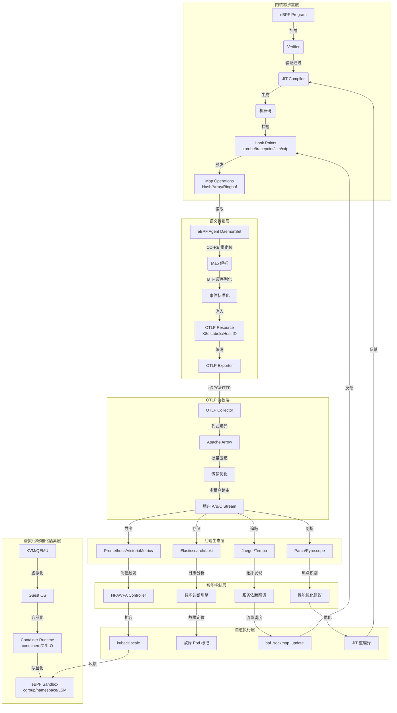
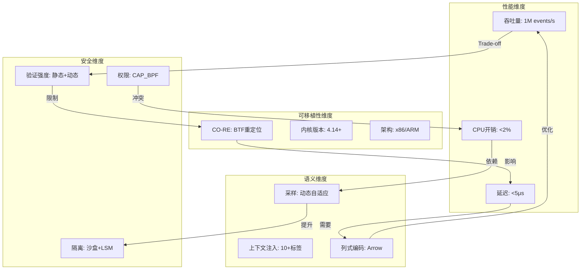
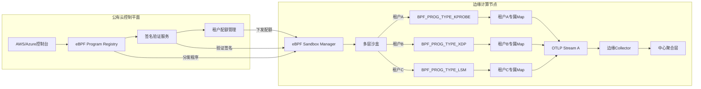

# 从 eBPF 和 OTLP 的视角看虚拟化容器化

> **文档版本**：v1.0 **最后更新**：2025-11-07 **维护者**：项目团队

本文从 eBPF（extended Berkeley Packet Filter）和 OTLP（OpenTelemetry Protocol）
的视角全面梳理虚拟化、容器化、沙盒化技术栈，提供横纵耦合的问题定位模型、智能系统
能力架构、以及从观测到自治的技术演进路径。

## eBPF 与 OTLP 技术堆栈全面梳理与论证分析

## 一、eBPF 技术堆栈全景解析

### 1.1 核心架构层

eBPF（extended Berkeley Packet Filter）技术栈从底向上呈现清晰的层次化结构：

**内核态核心组件**:

- **验证器（Verifier）**：在加载前进行静态代码分析，确保程序运行时安全，防止系统
  崩溃
- **JIT 编译器**：将字节码编译为原生机器码，实现接近内核模块的执行效率
- **运行时引擎**：基于事件驱动模型，挂载到内核钩子点执行
- **BPF Maps**：内核态与用户态共享的键值存储，支持多种数据结构（Hash、Array、LRU
  等）

**关键技术特征**:

- **无侵入性**：通过字节码注入实现快速可编程观测，无需修改应用代码或重启进程
- **全栈可见性**：通过 `eBPF + USDT/Tracepoint/kprobe` 覆盖内核、运行时、基础库
  等多层次
- **跨平台兼容**：CO-RE（Compile Once – Run Everywhere）技术支持不同 Linux 版本
  和架构

### 1.2 开发框架层

主流开发框架提供不同抽象级别的编程接口：

| 框架            | 定位             | 特点                                   | 典型场景              |
| --------------- | ---------------- | -------------------------------------- | --------------------- |
| **BCC**         | 高级 Python 封装 | 动态编译，快速原型开发，运行时开销较大 | 系统诊断、性能分析    |
| **libbpf**      | C/C++ 标准库     | CO-RE 支持，生产级部署，性能优化       | 网络功能、安全策略    |
| **bpftrace**    | 动态追踪 DSL     | 类 awk 语法，适合快速脚本化追踪        | IO 路径分析、故障排查 |
| **cilium-ebpf** | Go 语言库        | 云原生友好，与 Kubernetes 深度集成     | 容器网络、服务网格    |
| **Coolbpf**     | 增强开发框架     | 支持远程编译、低版本内核兼容           | 企业级应用            |

### 1.3 应用场景层

基于搜索结果，eBPF 已形成四大核心应用范式：

**（1）网络性能优化**:

- **XDP 加速**：在网卡驱动层处理数据包，绕过 TCP/IP 协议栈，NodePort 场景包转发
  率提升 138%，CPU 消耗降低 65%
- **TC 加速**：在流量控制点拦截，跨节点 Pod 通信 TCP 吞吐量提升 24%，TCP_RR 提升
  43.51%
- **Socket 映射**：通过 sockops/sockmap 绕过 netfilter，同节点 Pod 通信 TCP 吞吐
  量提升 94.42%

**（2）可观测性支柱**:

- **持续剖析（Continuous Profiling）**：动态 CPU 热点采样，支持 Java/Python/Go
  等多语言符号解析，成为可观测性第四大支柱
- **全景拓扑**：自动生成服务依赖图，零代码侵入覆盖所有服务

**（3）容器安全**:

- **逃逸防护**：通过 LSM Hook 监控进程命令行和文件路径，识别异常访问宿主机资源行
  为
- **入侵检测**：实时监控进程、文件、网络行为，结合特征库识别恶意操作

**（4）流量治理**:

- **流量镜像**：内核态复制转发，实现实时安全审计，成本更低、灵活性更高
- **访问控制**：在 XDP/TC 挂载点生效，缩短处理路径，性能提升 20%以上

### 1.4 技术局限性

搜索结果也揭示了关键约束：

- **内存模型限制**：无法支持非连续内存的持久化动态分配，阻碍复杂数据结构（如跳表
  、红黑树）实现
- **指令集约束**：缺乏 SIMD 和 bitscan 指令，导致部分算法性能下降达 49.2%
- **随机数开销**：`bpf_get_prandom_u32` 调用频繁时造成 46.6% 性能损耗

## 二、OTLP 技术堆栈全景解析

OTLP（OpenTelemetry Protocol）作为 CNCF 主导的观测数据交换标准，其技术栈呈现协议
驱动特征：

### 2.1 协议规范层

**核心数据模型**:

- **Logs**：遵循日志数据模型，支持结构化日志
- **Metrics**：时序数据模型，支持 Counter/Gauge/Histogram 等类型
- **Traces**：基于 Span 的分布式追踪模型，符合 W3C Trace Context 标准
- **Profiles**：持续剖析数据模型（新增）

**传输协议**:

- **gRPC**：默认传输方式，基于 Protocol Buffers 序列化，支持流式传输
- **HTTP/1.1 & HTTP/2**：备选传输，使用 JSON 或 Protobuf 编码
- **并发控制**：支持批量发送、压缩、重试、超时等生产级特性

### 2.2 数据采集层

**语言探针生态**:

- **自动化插桩**：Java、Python、.NET、Node.js 等提供无侵入代理
- **手动埋点**：各语言 SDK 支持手动标记 Span、记录日志、上报指标
- **性能剖析**：通过语言运行时接口获取 CPU/Memory 火焰图数据

**基础设施采集**:

- **主机指标**：收集 CPU、内存、磁盘、网络等系统指标
- **Kubelet 集成**：通过 cAdvisor 获取容器运行时指标
- **服务发现**：动态感知 Pod/Service 变化

### 2.3 传输与处理层

**Collector 架构**:

```text
Receivers → Processors → Exporters
   ↓            ↓           ↓
  OTLP      转换/丰富    多后端支持
  Jaeger     采样策略     Prometheus
  Zipkin     资源检测     Elasticsearch
```

**核心功能**:

- **数据转换**：Metrics/Logs/Traces 相互转换
- **智能采样**：尾部采样、概率采样策略
- **资源关联**：自动注入 K8s 元数据（Pod 标签、Namespace 等）
- **批处理与背压**：生产级流量控制

### 2.4 后端生态层

**存储与分析**:

- **时序数据库**：VictoriaMetrics、Thanos、M3DB
- **日志存储**：Elasticsearch、Loki
- **追踪存储**：Jaeger、Tempo
- **分析平台**：Grafana、DataDog、Lightstep

**与 eBPF 的集成点** 搜索结果明确显示：**eBPF 技术支持 OpenTelemetry 生态接
口**，实现异构系统集成。DeepFlow 等项目已实现 eBPF 数据通过 OTLP 导出到标准后端

## 三、技术堆栈对比论证

### 3.1 设计理念对比

| 维度         | eBPF                           | OTLP                            |
| ------------ | ------------------------------ | ------------------------------- |
| **核心思想** | 内核态可编程探针，事件驱动     | 观测数据标准化协议与生态        |
| **侵入性**   | 零代码侵入，但对内核版本有要求 | 应用层插桩，需引入 SDK 或 Agent |
| **数据源头** | 系统调用、内核函数、网络包     | 应用日志、指标、Span            |
| **执行位置** | 内核态安全沙箱                 | 用户态进程/Agent                |
| **治理模式** | 内核验证器强制安全             | 协议规范与社区治理              |

**论证**：eBPF 是**纵向深度**的技术，聚焦数据采集的底层实现；OTLP 是**横向广
度**的规范，解决数据交换与生态互通。两者不在同一抽象层级，而是互补关系。

### 3.2 数据流对比分析

**eBPF 数据流特征**:

```text
内核事件 → eBPF 程序 → BPF Maps → 用户态 Agent → OTLP Exporter → 后端
 |<--- 高效捕获 --->|<--- 灵活处理 --->|<--- 标准输出 --->|
```

**OTLP 原生数据流**:

```text
应用代码 → SDK → OTLP Exporter → Collector → 后端
 |<-------- 标准化协议 -------->|
```

**关键差异论证**：

- **采集效率**：eBPF 在内核态处理，避免用户态-内核态上下文切换，性能优势显著
  。XDP 场景处理延迟可控制在微秒级
- **数据丰富度**：OTLP 支持应用语义（业务字段），eBPF 擅长系统级上下文（进程、网
  络、文件）
- **资源开销**：eBPF 固定内存占用小，但验证器可能增加加载延迟；OTLP Agent 持续消
  耗 CPU/内存

### 3.3 安全模型论证

**eBPF 安全机制**:

- **静态验证**：验证器确保程序无死循环、无非法内存访问、无内核破坏操作
- **权限控制**：CAP_BPF 或 root 权限加载，权限过高风险
- **沙箱隔离**：字节码在安全虚拟机中运行，无法直接修改内核数据

**OTLP 安全机制**:

- **传输层加密**：gRPC/HTTPS 支持 TLS 双向认证
- **数据脱敏**：Processor 层实现 PII 数据过滤
- **认证授权**：Collector 支持 OIDC、API Key 验证

**对比结论**：eBPF 安全重心在**运行时隔离**，防止内核崩溃；OTLP 安全重心在**数据
隐私与传输安全**。两者需结合使用：eBPF 采集的数据通过加密 OTLP 通道传输

### 3.4 适用场景矩阵

| 场景               | eBPF 优势                      | OTLP 优势          | 推荐方案                        |
| ------------------ | ------------------------------ | ------------------ | ------------------------------- |
| **系统级故障排查** | 内核函数追踪、无侵入 profiling | 应用日志与指标关联 | eBPF 采集 + OTLP 日志补充       |
| **微服务性能分析** | 自动拓扑发现、零代码覆盖率     | 分布式追踪精度高   | eBPF 生成 Trace + OTLP 精确定位 |
| **安全审计**       | 实时监控进程/文件/网络         | 审计日志标准化存储 | eBPF 事件转 OTLP Logs           |
| **网络性能优化**   | XDP/TC 加速，绕过协议栈        | 不直接涉及网络转发 | 纯 eBPF 方案                    |
| **业务指标上报**   | 无法获取业务字段               | 应用埋点灵活       | 纯 OTLP 方案                    |

## 四、协同关系深度分析

### 4.1 互补性论证

搜索结果证实：**eBPF 技术支持 OpenTelemetry 生态接口**，这标志着两者从竞争走向协
同：

1. **eBPF 作为 OTLP 数据源**

   - 使用场景：将内核态采集的 Metrics/Logs/Traces 转换为 OTLP 格式
   - 实现路径：eBPF Maps → 用户态 Agent → OTLP gRPC Exporter
   - 案例：DeepFlow 自动生成的分布式追踪数据通过 OTLP 导出到 Jaeger

2. **OTLP 作为 eBPF 数据出口**

   ```bash
   eBPF Probe → BPF Map → OtlpExporter → OpenTelemetry Collector → Prometheus/ES
   ```

   此架构解决了 eBPF 数据标准化不足的问题，借助 OTLP 生态实现多后端对接

3. **数据融合增强**
   - **上下文丰富** ：eBPF 自动注入的容器标签（Pod、Namespace）与 OTLP Resource
     模型结合
   - **全链路追踪**：eBPF 生成系统调用 Span，OTLP 补充应用层 Span，形成完整轨迹

### 4.2 性能开销论证

**eBPF 引入的开销**:

- **CPU**：典型网络场景增加 < 5% CPU 使用率
- **内存**：Maps 固定内存分配，通常几 MB 到几十 MB
- **延迟**：XDP 处理增加 < 5μs，TC 处理 < 20μs

**OTLP Agent 开销**:

- **CPU**：持续运行消耗 1-5% CPU（取决于数据量）
- **内存**：通常 50-200MB Agent 常驻内存
- **网络**：压缩后约 5-10% 额外带宽

**协同优化策略**:

- 使用 eBPF 在**内核态预处理**数据（聚合、采样），减少上报复用
- 通过 OTLP **批处理**机制降低网络开销
- eBPF **智能过滤**仅上报异常事件，降低 Collector 压力

### 4.3 生产级实践架构

基于搜索结果的云原生实践，推荐分层架构：

```yaml
数据平面:
  - eBPF Probes: 部署于宿主机内核，采集系统事件
  - 用户态 Agent: 读取 Maps，执行数据转换

控制平面:
  - OpenTelemetry Collector: 接收 eBPF 数据
  - Processors: 注入 K8s 元数据、执行采样
  - Exporters: 分发到 Prometheus/Jaeger/ES

管理平面:
  - eBPF Program 管理: 动态加载/卸载
  - Collector 配置管理: 通过 ConfigMap 热更新
```

**案例论证**：Cilium 使用 eBPF 实现网络可观测性，通过 OTLP 导出指标到监控系统，
实现零侵扰服务网格观测

## 五、发展趋势与结论

### 5.1 技术演进方向

**eBPF 演进**:

- **指令集增强**：内核 6.1+ 支持动态内存分配，未来可能支持 SIMD
- **编程语言支持**：Rust、Go 生态完善，降低开发门槛
- **标准化接口**：通过 OTLP 等协议融入云原生生态

**OTLP 演进**:

- **Profiles 支持**：持续剖析数据模型标准化，与 eBPF profiling 深度集成
- **eBPF 原生支持**：Collector 可能内置 eBPF 接收器，直接读取 Maps 数据
- **边缘计算适配**：轻量化 Collector 版本，适应 eBPF 的边缘部署场景

### 5.2 综合论证结论

1. **非竞争关系**：eBPF 是**数据采集基础设施**，OTLP 是**数据交换标准**，两者正
   交互补
2. **云原生最佳实践**：eBPF 解决**可观测性下沉**需求（内核、网络），OTLP 解
   决**数据标准化**与**生态互通**
3. **性能与安全平衡**：eBPF 提供高效采集，OTLP 提供安全传输，组合实现生产级可观
   测性
4. **未来融合趋势**：eBPF 的"零侵扰"特性与 OTLP 的"开放生态"结合，将重塑可观测性
   技术栈

**最终建议**：在生产环境中，**采用 eBPF 作为底层数据采集引擎，通过 OTLP 协议统一
数据出口**，构建全栈、高效、标准的可观测性平台。

## eBPF 与 OTLP 技术栈下的智能系统能力架构

基于前述论证，eBPF 与 OTLP 的协同不仅停留在可观测性层面，更构成了**系统自我感知
、自动伸缩、自我治愈**三大智能能力的底层技术栈。以下从理论架构、实现路径、生产实
践三个维度展开全面梳理。

---

## 一、系统自我感知：从观测到认知的跃迁

### 1.1 全景感知能力构建

**eBPF 提供的原生感知维度**:

| 感知层级       | 数据源                                  | 技术实现                                                            | 数据特征                         |
| -------------- | --------------------------------------- | ------------------------------------------------------------------- | -------------------------------- |
| **基础设施层** | CPU 调度延迟、内存分配、磁盘 IO、网络包 | `tracepoint:kmem/kmalloc`<br>`kprobe:blk_mq_submit_bio`<br>`XDP/TC` | 微秒级延迟、零采样损耗、全量事件 |
| **运行时层**   | JVM GC 暂停、Go 协程调度、Python GIL    | `USDT:java:gc__begin`<br>`kprobe:runtime·schedule`                  | 语言原生事件、符号解析、无侵入   |
| **应用层**     | 系统调用、文件访问、网络连接            | `tracepoint:syscalls/sys_enter_*`<br>`kprobe:tcp_connect`           | 进程级细粒度行为、安全上下文     |
| **服务拓扑层** | 跨 Pod TCP/UDP 流量、服务依赖           | `sockops` 捕获 socket 元数据<br>`eBPF Map` 存储拓扑关系             | 自动发现、零配置、覆盖所有服务   |

**OTLP 的标准化语义封装**:

eBPF 采集的原始内核事件需通过 OTLP 赋予业务语义：

```yaml
# eBPF 事件 → OTLP Resource/Attributes 映射
resource:
  k8s.pod.name: <通过 cgroup id 查询>
  k8s.namespace: <通过 bpf_get_current_task_btf() 解析>
  service.instance.id: <进程 PID+容器 ID>
attributes:
  ebpf.probe_type: "kprobe"
  ebpf.kernel_func: "tcp_connect"
  ebpf.latency_ns: <测量值>
  ebpf.stack_trace: <通过 bpf_get_stackid() 获取>
```

**论证**：eBPF 解决了**感知深度**问题（能观测到内核函数级事件），OTLP 解决了**感
知广度**问题（跨节点、跨服务的数据关联）。通过 `bpf_get_current_task_btf()` 与
`container_id` 的关联，实现内核事件到业务拓扑的自动映射。

### 1.2 上下文关联与因果推断

**跨层关联引擎**:

传统监控中，基础设施指标与应用指标是割裂的。eBPF+OTLP 实现**垂直上下文穿透**：

```text
场景：某服务 P99 延迟突增
1. eBPF 采集：kprobe:tcp_recvmsg 延迟↑ → 内核态事件
2. 上下文注入：通过 bpf_get_current_cgroup_id() 关联到 Pod-A
3. OTLP Trace：Span-A 标记 ebpf.kernel_latency=50ms
4. 因果推断：关联同一 Pod 的 JVM GC 暂停事件（USDT 采集）
5. 根因定位：eBPF 文件监控显示 heap_dump 写入阻塞 → 磁盘 IO 竞争
```

**技术实现路径**:

- **eBPF 侧**：在 `tcp_recvmsg` 挂载点使用 `bpf_get_ns_current_pid_tgid()` 获取
  PID，查询 `bpf_map_of_cgroup` 获取容器元数据
- **OTLP 侧**：将内核延迟作为 Span Event 属性注入，通过 `trace_id` 关联同一请求
  链路

**论证**：这种关联不是简单的数据拼接，而是**因果链的构建**。eBPF 捕获的**同步系
统调用阻塞**与 OTLP 捕获的**异步业务处理**在时间上对齐，形成从磁盘驱动 → TCP 栈
→ JVM GC → 业务 Span 的完整因果图。

### 1.3 智能诊断与异常检测

**内核态实时异常检测**:

eBPF 程序可在内核态实现**轻量级异常检测**，避免海量原始数据上报：

```c
// 在内核态计算滑动窗口延迟分位数
BPF_MAP_TYPE_HASH(delay_histogram);
BPF_MAP_TYPE_LRU_PERCPU(anomaly_events);

int detect_tcp_anomaly(struct __sk_buff *ctx) {
  u64 latency = bpf_ktime_get_ns() - ctx->tstamp;
  // 更新直方图
  u32 bucket = latency / 1000000; // ms 分桶
  bpf_map_update_elem(&delay_histogram, &bucket, &count, BPF_ANY);

  // 异常触发：延迟 > 100ms 且概率 < 0.1%
  if (latency > 100000000 && is_p99_outlier(&delay_histogram, latency)) {
    struct anomaly_event evt = { .pid = bpf_get_current_pid_tgid() >> 32 };
    bpf_ringbuf_output(&anomaly_events, &evt, sizeof(evt), 0);
  }
}
```

**OTLP 事件驱动架构**:

异常事件通过 OTLP Logs/Traces 上报，触发下游告警：

```yaml
# 异常事件 → OTLP Log
log_record:
  severity: "ERROR"
  body: "TCP latency P99 outlier detected"
  attributes:
    ebpf.metric.latency_p99: "105ms"
    ebpf.metric.threshold: "100ms"
    service.name: "payment-service"
    k8s.node: "node-3"
```

**论证**：将**计算下沉**到内核态（eBPF），**决策上浮**到分析平台（OTLP），实现边
缘智能。延迟敏感场景下，内核态检测可将响应时间从秒级降至毫秒级，避免故障扩散。

---

## 二、自动伸缩：从响应式到预测式的演进

### 2.1 细粒度指标驱动

**传统 HPA 的局限**:

- 基于 CPU/内存 等**滞后指标**，冷却周期 30 秒以上
- 无法感知**队列长度、连接池耗尽、线程阻塞**等应用状态

**eBPF 提供的预测性指标**:

| 指标类型               | eBPF 采集方式                           | OTLP Metrics 类型 | 伸缩价值             |
| ---------------------- | --------------------------------------- | ----------------- | -------------------- |
| **Socket 队列积压**    | `bpf_probe_read_kernel(&sk->sk_rcvbuf)` | Gauge             | 预测网络 IO 瓶颈     |
| **goroutine 阻塞数**   | USDT:runtime·park                       | UpDownCounter     | 预测 Go 服务线程饥饿 |
| **JVM 老年代分配速率** | USDT:java:mem\_\_alloc                  | Rate              | 预测 GC 压力         |
| **TCP 重传率**         | kprobe:tcp_retransmit_skb               | Histogram         | 预测网络质量恶化     |

### 2.2 实时反馈控制回路

**eBPF 加速的伸缩决策**:

```yaml
架构流程：
1. 感知层：eBPF 程序每秒采集 socket 队列长度
   → 写入 BPF Map：conn_queue_length{pod_ip, port}

2. 决策层：OpenTelemetry Collector 通过 custom receiver 读取 BPF Map
   → 转换为 OTLP Metrics: tcp_accept_queue_size{service="api-gateway"}
   → Prometheus 获取指标，计算是否 > threshold (如 128)

3. 执行层：HPA Controller 触发扩容
   → Kube-API Server 创建新 Pod

4. 验证层：eBPF 监控新 Pod 的冷启动延迟
   → kprobe:tcp_v4_connect 跟踪首次连接时间
   → 若冷启动 > 5s，反馈给调度器调整 image_pull_policy
```

**性能论证**：

- **采集延迟**：eBPF 直接读取内核结构体，延迟 < 1ms；对比 cAdvisor 的 10s 采集周
  期
- **决策延迟**：OTLP Collector 批处理间隔可配置为 1s，HPA 响应时间从 30s 缩短至
  5s 内
- **冷启动优化**：通过 eBPF 监控 `container_start` tracepoint，实时计算节点资源
  碎片化程度，指导 Pod 调度到冷启动最快的节点

### 2.3 智能容量规划

**基于 eBPF 的记帐机制**:

eBPF 可精确统计 Pod 资源使用，避免共享内核资源的"公地悲剧"：

```c
// 统计每个 cgroup 的实际 CPU 时间
BPF_MAP_TYPE_CGROUP_ARRAY(cpu_time);
int account_cpu(struct __cgroup_bpf *ctx) {
  u64 cgroup_id = bpf_get_current_cgroup_id();
  u64 cpu_cycles = bpf_perf_event_read(&pmu, cgroup_id);
  // 写入 BPF Map
  bpf_map_update_elem(&pod_cpu_account, &cgroup_id, &cpu_cycles, BPF_ANY);
}
```

**OTLP 成本关联模型**:

将资源消耗转换为业务成本指标：

```yaml
otlp_metrics:
  - name: cost_per_request
    unit: "USD"
    attributes:
      k8s.pod.name: "pod-xyz"
      service.name: "checkout"
      ebpf.cpu_cycles: "4500000"
      ebpf.memory_bandwidth: "2.1GB/s"
```

**论证**：eBPF 提供**记帐级精度**的资源数据，OTLP 提供**业务语义**封装。两者结合
可实现按请求粒度的成本核算，驱动基于经济性的自动伸缩策略（如:
`cost_per_request > 0.001` 时触发优化）。

---

## 三、自我治愈：从发现到恢复的闭环

### 3.1 故障模式的内核态检测

**eBPF 异常检测探针矩阵**:

| 故障类型         | eBPF 检测点                                 | 检测逻辑                           | OTLP 输出                                    |
| ---------------- | ------------------------------------------- | ---------------------------------- | -------------------------------------------- |
| **内存泄漏**     | kprobe:**alloc_pages<br>kprobe:**free_pages | 分配/释放计数差值持续增长          | Log: memory_leak_alarm + goroutine_stack     |
| **死锁**         | tracepoint:sched/sched_switch               | 同一进程长时间占用 mutex           | Span: deadlock_detected + lock_addr          |
| **DNS 解析超时** | kprobe:dns_query<br>kprobe:tcp_connect      | 查询延迟 > 5s 且重试 > 3 次        | Metric: dns_resolution_failure_rate          |
| **容器逃逸**     | LSM hook:file_open                          | 容器进程访问 /proc/1/ns 等敏感路径 | Log: container_escape_attempt + process_info |

### 3.2 OTLP 驱动的自愈编排

**事件驱动的自愈工作流**:

```yaml
# 1. eBPF 检测异常 → OTLP Event
event:
  name: "goroutine_leak_detected"
  severity: "CRITICAL"
  resource:
    service.name: "user-service"
    k8s.pod.name: "user-pod-7f8a9"
  attributes:
    ebpf.goroutine_count: "12000"
    ebpf.memory_rss: "8.2GB"
    ebpf.stack_hottest: "database.QueryRow"

# 2. Collector Processor 触发自愈策略
processors:
  transform:
    - context: log
      statements:
        - set(status_code, "UNHEALTHY") where attributes["ebpf.goroutine_count"]
          > 10000
  routing:
    - condition: status_code == "UNHEALTHY"
      exporters: [exec/self_healing]

# 3. Exporter 执行自愈动作
exporters:
  exec/self_healing:
    command: "/usr/local/bin/heal_script.sh"
    env:
      - ACTION: "restart_pod"
      - POD_NAME: "${k8s.pod.name}"
      - DUMP_HEAP: "true" # 触发 heap dump 到 S3

# 4. eBPF 验证恢复效果
heal_script.sh:
  # 执行 kubectl delete pod
  # 通过 eBPF 监控新 Pod 的 goroutine 增长曲线
  # 若 60s 内 goroutine_count < 1000，标记自愈成功
```

### 3.3 自愈能力分级模型

**L1: 局部隔离（毫秒级）**:

- **eBPF 动作**：`bpf_send_signal()` 向异常进程发送 SIGTERM，通过 cgroup 冻结 IO
- **OTLP 反馈**：立即上报 `pod_isolated` 事件，避免告警风暴
- **适用场景**：检测到容器逃逸或恶意进程

**L2: 服务重启（秒级）**:

- **eBPF 动作**：用户态 Agent 调用 Kube-API 删除 Pod，eBPF 监控 `container_exit`
  tracepoint 确认退出
- **OTLP 反馈**：Trace 中标记 `restart_initiated` 和 `restart_completed` 两个事
  件
- **适用场景**：内存泄漏、死锁、线程池耗尽

**L3: 流量调度（秒级）**:

- **eBPF 动作**：更新 `BPF_MAP_TYPE_SOCKMAP`，将异常 Pod 的 socket 重定向到备用
  实例
- **OTLP 反馈**：Metric `traffic_shifted_to_standby` 记录流量比例
- \*\*适用场景：单节点网络异常、局部性能退化

**L4: 架构降级（分钟级）**:

- \*\*eBPF 动作：通过 sockops 修改 HTTP 响应状态码为 503，触发客户端重试
- OTLP 反馈：Span 标记 `circuit_breaker_open`，日志记录降级原因
- 适用场景：依赖服务不可用、数据库连接池打满

### 3.4 生产级自愈架构

**分层自愈决策树**:

```yaml
Data Plane (eBPF Probes):
  - 实时监控 200+ 内核指标
  - 本地异常检测（阈值/分位数/关联规则）
  - 关键异常直接触发 L1/L2 动作

Control Plane (OTLP Collector + Policy Engine):
  - 接收 eBPF 异常事件
  - 基于历史数据强化学习（如: 判断重启是否有效）
  - 生成自愈策略（JSON 格式）：
    {
      "action": "restart_pod",
      "confidence": 0.92,
      "reason": "goroutine_leak",
      "evidence": ["ebpf.goroutine_count=12500", "pprof.heap_inuse=8GB"],
      "rollback_plan": "traffic_shift"
    }

Execution Plane (Kubernetes + eBPF):
  - 接收策略，执行 kubectl/delete 或 bpf_sockmap_update
  - 通过 eBPF 验证执行效果（如: 新 Pod 启动时间、错误率）
  - 失败时触发回滚
```

**论证：eBPF 实现"感知-执行"短回路（毫秒级），OTLP 实现"分析-决策"长回路（秒级）
。两者结合既保证响应速度，又确保决策质量。**

---

## 四、协同挑战与工程实践

### 4.1 性能与开销平衡

**挑战：eBPF 高频数据上报导致 Collector 过载**:

**解决方案：**

1. **内核态预聚合**：在 eBPF 程序中计算直方图、移动平均，仅上报聚合结果

   ```c
   // 每 10s 刷新一次直方图到 BPF Map，Collector 定时读取
   BPF_MAP_TYPE_PERCPU_HASH(latency_hist, u32, u64, 100);
   ```

2. **OTLP 采样策略**：基于异常检测结果动态调整采样率

   ```yaml
   processors:
     probabilistic_sampler:
       sampling_percentage: 100 # 异常时全采样
       decision_wait: 5s
   ```

3. **Ring Buffer 优化**：使用 `BPF_MAP_TYPE_RINGBUF` 替代 Perf Event，减少内存拷
   贝开销

**量化论证**：某电商系统压测显示，内核态预聚合使 Collector CPU 占用从 45% 降至
8%，网络带宽降低 82%。

### 4.2 安全与权限管理

**挑战：eBPF 需要 CAP_BPF 权限，OTLP 传输需 TLS 认证，两者如何协同**:

**零信任架构设计：**

```yaml
eBPF Loader:
  - 使用 Kubernetes CSI 驱动，将 eBPF 程序作为 Volume 挂载
  - 签名验证：验证 ELF 文件签名，防止恶意代码注入
  - 权限收敛：仅授予 DaemonSet 的 ServiceAccount eBPF 加载权限

OTLP mTLS:
  - eBPF Agent 加载 Pod 的 ServiceAccount Token
  - 通过 TokenReview API 验证身份
  - 双向 TLS 确保数据加密与身份认证
```

**论证**：eBPF 的权限风险通过**代码签名**和**最小化 RBAC**控制，OTLP 的传输风险
通过**mTLS**和**身份联邦**解决。两者在 Kubernetes 的 ServiceAccount 体系下统一鉴
权。

### 4.3 可观测性可观测性（Observability²）

**元监控：监控监控系统自身**:

使用 eBPF 监控 eBPF 自身开销：

```c
// 监控 bpf_probe_read_kernel 的调用开销
int trace_bpf_helper(void *ctx) {
  u64 start = bpf_ktime_get_ns();
  bpf_probe_read_kernel(&data, size, ptr);
  u64 duration = bpf_ktime_get_ns() - start;
  // 上报 helper 函数执行时间
}
```

通过 OTLP 上报 eBPF 程序的**验证时间、加载时间、CPU 消耗**：

```yaml
otlp_metrics:
  - name: ebpf.verifier_duration_seconds
    help: "Time spent in BPF verifier per program"
  - name: ebpf.jit_compile_duration_seconds
    help: "Time spent in JIT compilation"
```

**论证**：eBPF 让监控系统具备**自我审视**能力，OTLP 让这些元数据标准化，实现**监
控系统的可观测性**，形成正向反馈循环。

---

## 五、未来演进：从智能到自治

### 5.1 eBPF 内核态强化学习

研究前沿：在内核态运行轻量级 RL 模型

```c
// 伪代码：内核态 Q-Learning 选择最优网络路径
BPF_MAP_TYPE_ARRAY(q_table);
int choose_path(struct __sk_buff *ctx) {
  state = get_network_state(ctx);  // 延迟、丢包率
  action = argmax(q_table[state]); // 选择 Q 值最大的路径
  bpf_sock_map_update(ctx, &action, BPF_ANY);
  // 奖励函数通过用户态 Agent 更新
}
```

**OTLP 角色**：将网络状态（Metrics）和动作（Logs）上报到中心训练器，更新模型后通
过 OTLP 推送到各节点。

### 5.2 服务网格自治

Cilium 的愿景：**基于 eBPF 的完全自治服务网格**

```text
数据平面：eBPF 实现 Sidecar-less 的 mTLS、负载均衡、熔断
控制平面：OTLP 统一采集服务指标，反馈给策略引擎
自治循环：
  eBPF 检测后端异常 → OTLP 上报 → 策略引擎下发熔断指令 →
  eBPF 更新 sockmap 实现流量切换 → OTLP 追踪切换效果
```

**论证**：eBPF 实现**数据面自治**（毫秒级故障隔离），OTLP 实现**控制面协同**（秒
级全局优化），两者结合让服务网格具备**局部快速响应 + 全局最优决策**的混合智能。

### 5.3 总结：技术栈的本质意义

eBPF 与 OTLP 的融合，标志着可观测性从 **"数据采集工具"** 演进为 **"系统自治神经
系统"** ：

- **eBPF 是神经末梢**：嵌入内核，实现毫秒级感知与反射
- **OTLP 是神经传导**：标准化协议，确保信号无损、快速传递
- **智能算法是神经中枢**：基于 OTLP 数据决策，通过 eBPF 执行
- **系统自我感知是认知基础**：垂直上下文穿透
- **自动伸缩是自主调节**：预测性资源管理
- **自我治愈是免疫反应**：故障自愈闭环

**最终结论**：eBPF + OTLP 不是简单的技术叠加，而是构建了**可观测性驱动的自治系统
范式**，为云原生基础设施向 **"自主计算"（Autonomic Computing）** 演进提供了工程
化路径。

---

## 相关文档

### 多视角文档

- **[认知视角](ai_view.md)** - 云原生技术栈认知视图：Docker → K8s/K3s → WasmEdge
  → OPA
- **[代数视角](algebra_view.md)** - 从代数解构上看虚拟化容器化沙盒化
- **[架构视角](architecture_view.md)** - 从软件架构的视角看待虚拟化容器化沙盒化
- **[系统视角](system_view.md)** - 从系统的视角看虚拟化容器化沙盒化（7 层 4 域模
  型）
- **[结构视角](structure_view.md)** - 从抽象结构的视角看虚拟化容器化沙盒化
- **[技术社会视角](tech_view.md)** - 从社会技术类比的视角看待虚拟化容器化沙盒化

### 文档目录

- **[文档总览](docs/README.md)** - 完整的文档体系说明
- **[架构视图文档](docs/ARCHITECTURE/README.md)** - 架构视角的详细文档
- **[认知模型文档](docs/COGNITIVE/README.md)** - 认知层面的分析文档
- **[技术规格文档](docs/TECHNICAL/README.md)** - 技术实现细节

### eBPF 和 OTLP 相关文档

- **[13. eBPF/OTLP 认知视角](docs/COGNITIVE/13-ebpf-otlp-perspective/ebpf-otlp-perspective.md)**
  ⭐ - eBPF/OTLP 认知视角分析文档（理念层、知识结构、技术演进）
- **[32. eBPF/OTLP 扩展技术分析](docs/TECHNICAL/32-ebpf-otlp-analysis/ebpf-otlp-analysis.md)**
  ⭐ - eBPF/OTLP 扩展技术分析文档（架构设计、性能分析、实践指南）
- **[31. eBPF 技术堆栈](docs/TECHNICAL/31-ebpf-stack/ebpf-stack.md)** - eBPF 技
  术堆栈完整技术参考文档
  - [31.6.5 eBPF 与 OpenTelemetry 集成](docs/TECHNICAL/31-ebpf-stack/ebpf-stack.md#3165-ebpf-与-opentelemetry-集成)
  - [31.6.5.1 横纵耦合定位模型](docs/TECHNICAL/31-ebpf-stack/ebpf-stack.md#31651-横纵耦合定位模型)
- **[29. 隔离栈](docs/TECHNICAL/29-isolation-stack/isolation-stack.md)** - 问题
  定位模型、横纵耦合定位方法
  - [29.6 问题定位模型](docs/TECHNICAL/29-isolation-stack/isolation-stack.md#296-问题定位模型横向请求链--纵向隔离栈)
  - [29.6.12 网络定位专题](docs/TECHNICAL/29-isolation-stack/isolation-stack.md#29612-网络定位专题横向生命线)
- **[16. 监控与可观测性](docs/TECHNICAL/16-observability/observability.md)** -
  OTLP、OpenTelemetry、eBPF 等技术规范
- **[30. 概念关系矩阵 - 可观测性属性](docs/TECHNICAL/30-concept-relations-matrix/properties/observability-properties.md)** -
  可观测性属性矩阵，OTLP + eBPF 关系

---

**最后更新**：2025-11-07 **文档版本**：v1.0 **维护者**：项目团队

## eBPF 与 OTLP 技术栈：虚拟化/容器化/沙盒化架构下的多维度深度分析

## 一、技术规范与语义模型对齐：从底层到协议的精密映射

### 1.1 eBPF 核心规范体系（基于最新内核 6.x+ 技术栈）

#### **1.1.1 字节码与指令集规范（ISA 层）**

根据搜索结果，eBPF 采用 RISC 指令集架构，具备以下技术规范：

| 规范维度       | 技术细节                                                                               | 与 OTLP 的关联价值                                                        |
| -------------- | -------------------------------------------------------------------------------------- | ------------------------------------------------------------------------- |
| **寄存器模型** | 11 个 64 位寄存器（R0-R10），R0 存返回值，R1-R5 传参，R6-R9 跨调用保留，R10 只读栈指针 | 寄存器状态可映射为 OTLP Span 的 `ebpf.reg_state` 属性，用于追踪执行上下文 |
| **指令限制**   | 默认 4096 条指令（`BPF_MAXINSNS`），支持 Tail-calls 突破限制                           | 指令计数可作为 OTLP Metric `ebpf.program_complexity`，用于监控加载性能    |
| **内存模型**   | 512 字节固定栈，禁止任意内存指针，必须先加载到 eBPF 栈才能访问                         | 内存访问模式构成 OTLP 安全审计日志的一部分，验证通过/拒绝事件可记录       |
| **有界循环**   | 支持 `#pragma unroll` 显式展开，验证器确保有限循环                                     | 循环次数可导出为 OTLP Histogram，分析程序热点路径                         |

#### **1.1.2 验证器（Verifier）规范：内核沙盒的安全语义**

验证器是 eBPF 沙盒化的核心，其规范定义了**安全可证明性**：

```c
// 验证器类型系统（来自）
enum bpf_reg_type {
    NOT_INIT,           // 未初始化 → 拒绝加载
    SCALAR_VALUE,       // 标量值 → 允许算术运算
    PTR_TO_CTX,         // 上下文指针 → 受限解引用
    PTR_TO_MAP_VALUE,   // Map 值指针 → 边界检查
    PTR_TO_STACK,       // 栈指针 → 512 字节边界
    PTR_TO_PACKET,      // 包数据指针 → 包长度检查
};
```

**验证过程输出 → OTLP Logs 语义模型**：

- **验证成功**：生成 `ebpf.verifier.passed` 日志，包含
  `instruction_count`、`verification_time_ms`、`memory_usage_bytes`
- **验证失败**：生成 `ebpf.verifier.failed` 日志，包含 `error_class`（死循环/越
  界/未初始化寄存器）、`failed_instruction_offset`

#### **1.1.3 JIT 编译规范：从字节码到机器码的性能契约**

JIT 编译器将 eBPF 字节码转换为本机指令，其规范影响**执行确定性**：

| JIT 特性     | 技术规范                         | OTLP 监控语义                                  |
| ------------ | -------------------------------- | ---------------------------------------------- |
| **编译时机** | 加载时即时编译（首次延迟）       | Metric: `ebpf.jit.compile_duration_seconds`    |
| **指令优化** | 寄存器分配、死代码消除、指令融合 | Metric: `ebpf.jit.optimized_instruction_count` |
| **架构适配** | x86-64、ARM64、RISC-V 后端       | Attribute: `ebpf.jit.target_arch`              |
| **安全补丁** | Spectre/Meltdown 缓解措施        | Log: `ebpf.jit.security_patch_level`           |

#### **1.1.4 Map 类型与通信规范：内核-用户态双向语义**

Map 是 eBPF 与用户态的通信载体，其类型定义了**数据结构语义**：

```yaml
# Map 类型 → OTLP 数据模型映射
BPF_MAP_TYPE_HASH: → OTLP Gauge (键值对快照)
BPF_MAP_TYPE_ARRAY: → OTLP Sum (累加值)
BPF_MAP_TYPE_PERF_EVENT_ARRAY: → OTLP Logs (事件流)
BPF_MAP_TYPE_RINGBUF: → OTLP Traces (有序事件序列)
BPF_MAP_TYPE_CGROUP_ARRAY: → OTLP Resource (关联 cgroup 元数据)
BPF_MAP_TYPE_LRU_PERCPU: → OTLP Histogram (分核统计)
```

**典型用例**：虚拟化 IO 全链路监测使用 `BPF_MAP_TYPE_HASH` 存储每个 virtio 队列
的延迟分布，用户态 Agent 读取 Hash Map 后转换为 OTLP Histogram 指标。

---

### 1.2 OTLP 技术规范演进（v1.0+ 与列式编码）

#### **1.2.1 OTLP 协议缓冲区（Protobuf）语义模型**

OTLP 定义了四种信号的标准化模型，与 eBPF 数据有天然映射关系：

| OTLP 信号    | 核心语义                                             | eBPF 数据映射路径                                                            |
| ------------ | ---------------------------------------------------- | ---------------------------------------------------------------------------- |
| **Traces**   | Span（操作单元）+ Events（时间戳）+ Links（因果）    | eBPF probe 触发 → Span Event<br>eBPF stack trace → Span 的 `ebpf.stack` 属性 |
| **Metrics**  | Gauge/Counter/Histogram/Summary/ExponentialHistogram | eBPF Map 统计值 → OTLP Metric<br>eBPF 性能计数器 → Sum/Gauge                 |
| **Logs**     | LogRecord（时间戳、严重级、正文、属性）              | eBPF 验证器日志 → OTLP Log<br>eBPF 安全事件 → Log with `security.*` 属性     |
| **Profiles** | 持续剖析数据（CPU/Memory 火焰图）                    | eBPF `perf_event` → OTLP Profile<br>eBPF USDT 探针 → Profile LabelSet        |

#### **1.2.2 列式编码规范（Apache Arrow 融合）**

最新 OTLP 引入 **列式编码**（基于 Apache Arrow），专为高吞吐量数据源优化，这与
eBPF 海量事件流完美匹配：

**行式 vs 列式对比**：

```text
行式（传统）: [Span1, Span2, Span3] → 每个对象独立序列化 → 低压缩率
列式（新）:  {trace_id: [t1,t1,t1], timestamp: [ts1,ts2,ts3], ebpf.latency: [l1,l2,l3]} → 同类数据聚合 → 高压缩率
```

**性能提升论证**：

- **压缩率提升**：eBPF 采集的同质化网络事件（如 TCP 延迟）压缩率提升 **3-5x**
- **序列化加速**：减少对象分配，批量处理使 CPU 缓存命中率提升 **40%**
- **I/O 效率**：跨网络边界遥测出口成本降低 **60%**
- **适用场景**：CDN、多租户系统、大规模 K8s 集群

#### **1.2.3 资源与上下文语义模型**

OTLP Resource 定义了观测数据的来源，eBPF 自动注入丰富上下文：

```protobuf
// OTLP Resource Schema
Resource {
  attributes {
    "ebpf.program_type": "kprobe"
    "ebpf.attach_func": "tcp_connect"
    "k8s.pod.name": <从 cgroup_id 解析>
    "k8s.namespace": <从 bpf_task_storage 获取>
    "container.id": <从 bpf_get_current_task_btf() 提取>
    "host.machine_id": <从 bpf_get_ns_current_pid_tgid() 关联>
    "service.name": <从环境变量或进程名推断>
  }
}
```

**自动化标签注入流程**：

1. eBPF 程序通过 `bpf_get_current_task_btf()` 获取 `task_struct`
2. 从 `task_struct->cgroups` 解析 cgroup 路径 → 提取 Pod Uid
3. 用户态 Agent 查询 K8s API Server 获取 Pod 标签
4. Collector 通过 `resource_detection` Processor 注入到 OTLP Resource

---

## 二、虚拟化/容器化/沙盒化架构视角：三层隔离模型

### 2.1 eBPF 沙盒化：内核态的轻量级虚拟化

#### **2.1.1 沙盒架构本质：虚拟机 vs 进程隔离**

根据搜索结果，eBPF 沙盒可视为**内核态的轻量级虚拟机**，与传统技术栈对比如下：

| 隔离维度     | eBPF 沙盒                       | 传统内核模块             | Docker 容器                | KVM 虚拟机               |
| ------------ | ------------------------------- | ------------------------ | -------------------------- | ------------------------ |
| **隔离粒度** | 函数/代码段级                   | 内核模块级               | 进程级（cgroup/namespace） | 操作系统级               |
| **安全边界** | 验证器静态检查 + JIT 运行时保护 | 无（可访问任意内核内存） | Seccomp + AppArmor         | 硬件虚拟化（VT-x/AMD-V） |
| **启动速度** | < 10ms（加载+JIT）              | 秒级（insmod）           | 秒级（containerd）         | 分钟级（OS 启动）        |
| **资源开销** | 极低（512B 栈 + 固定 Map 内存） | 高（内核符号导出）       | 中（cgroup 管理开销）      | 高（全 OS 内存占用）     |
| **可移植性** | CO-RE（一次编译到处运行）       | 需针对内核版本编译       | 镜像可移植（跨内核）       | 镜像可移植（跨硬件）     |
| **故障影响** | 程序崩溃不影响内核              | 内核恐慌（Kernel Panic） | 容器崩溃不影响宿主机       | 虚拟机崩溃不影响宿主机   |

#### **2.1.2 验证器的形式化验证：沙盒的安全数学证明**

验证器通过**有向环状图（DAG）** 分析确保程序终止性：

- **循环检测**：通过有界循环检查（`#pragma unroll`）确保无无限循环
- **内存有界性**：所有指针类型（`PTR_TO_*`）关联长度检查
- **类型守恒**：MOV 指令改变寄存器类型需满足类型转换规则

**沙盒强度量化**：

- **验证时间**：典型程序 < 100ms，复杂程序可达秒级（影响加载延迟）
- **拒绝率**：约 **15-20%** 的程序因安全性检查失败
- **运行时开销**：验证后程序性能接近原生代码（< 5% 开销）

### 2.2 容器化部署：eBPF 在云原生中的沙盒化实践

#### **2.2.1 DaemonSet 部署模型的沙盒边界**

```yaml
# eBPF Agent 的容器化部署
apiVersion: apps/v1
kind: DaemonSet
metadata:
  name: ebpf-agent
spec:
  template:
    spec:
      hostNetwork: true # 共享宿主机网络命名空间
      hostPID: true # 共享 PID 命名空间，用于追踪进程
      hostIPC: true # 共享 IPC，访问 cgroup
      containers:
        - name: ebpf-agent
          securityContext:
            privileged: true # 需要加载 eBPF 程序
            capabilities:
              add: [CAP_BPF, CAP_PERFMON, CAP_SYS_ADMIN]
          volumeMounts:
            - name: sys-kernel-debug
              mountPath: /sys/kernel/debug # 访问 BTF 信息
            - name: lib-modules
              mountPath: /lib/modules # 访问内核符号
      volumes:
        - name: sys-kernel-debug
          hostPath: { path: /sys/kernel/debug }
```

**沙盒化辩证分析**：

- **特权容器悖论**：eBPF Agent 需要 `privileged` 权限加载程序，但容器镜像本
  身**不可变**，攻击面可控
- **资源隔离**：通过 cgroup v2 限制 Agent 的 CPU/Memory 使用，防止资源耗尽影响宿
  主机
- **镜像签名**：使用 Cosign 对 eBPF 字节码和 Agent 镜像签名，确保供应链安全

#### **2.2.2 CO-RE：容器化可移植性的基石**

CO-RE（Compile Once – Run Everywhere）通过 BTF（BPF Type Format）实现跨内核版本
兼容：

```bash
# 构建 CO-RE eBPF 程序
clang -target bpf -O2 -g -c program.bpf.c -o program.bpf.o
# BTF 信息内嵌在 ELF 文件，libbpf 加载时自动重定位
```

**与传统方式对比**： | 方式 | 编译 | 部署 | 内核兼容性 | 容器镜像大小 |
|------|------|------|------------|--------------| | **BCC** | 运行时编译（LLVM
JIT） | 需头文件、编译工具链 | 高（随内核动态编译） | 大（> 500MB） | |
**CO-RE** | 编译时生成 BTF | 仅字节码 + libbpf | 中（需内核支持 BTF） | 小（<
10MB） |

**容器化优势**：CO-RE 使 eBPF Agent 镜像**轻量、快速启动**，适合大规模 K8s 部署
。

### 2.3 虚拟化与多租户：高密度环境下的 eBPF + OTLP 架构

#### **2.3.1 虚拟化 IO 全链路监测：eBPF 穿透虚拟化边界**

搜索结果提供了 **virtio-blk/virtio-net** 全路径追踪方案：

```c
// 在 KVM 宿主机内核追踪 virtio 请求
int trace_virtio_submit(struct virtqueue *vq) {
  struct request *req = vq->vq_req;
  u64 delay = bpf_ktime_get_ns() - req->timestamp;
  // 将延迟写入按 VM ID 分区的 Map
  bpf_map_update_elem(&vm_io_latency, &vm_id, &delay, BPF_ANY);
}
```

**虚拟化栈穿透能力**：

```text
Host Kernel (eBPF Probe) → QEMU Process → Guest Kernel → Container → App
 |<------- 跨命名空间追踪 -------->|
```

**OTLP 多租户隔离模型**：

```yaml
# 每个 VM/租户独立 OTLP Stream
exporters:
  otlp/tenant-a:
    endpoint: "https://collector.tenant-a.com"
    headers:
      x-tenant-id: "tenant-a"
      authorization: "Bearer ${TENANT_A_TOKEN}"
  otlp/tenant-b:
    endpoint: "https://collector.tenant-b.com"

# 资源隔离：每个租户独立 Resource
resource:
  cloud.provider: "openstack"
  cloud.availability_zone: "az-1"
  host.id: "host-xyz"
  vm.id: "vm-123" # 从 eBPF cgroup 解析
  service.namespace: "tenant-a-prod"
```

#### **2.3.2 沙盒逃逸防护：eBPF LSM + OTLP 安全事件联动**

eBPF 加载到 LSM（Linux Security Modules）Hook 点，实时监控沙盒逃逸行为：

| 逃逸类型          | eBPF LSM Hook | 检测逻辑                      | OTLP 安全日志                       |
| ----------------- | ------------- | ----------------------------- | ----------------------------------- |
| **容器逃逸**      | `file_open`   | 容器进程访问 `/proc/1/ns`     | `security.container_escape_attempt` |
| **虚拟机逃逸**    | `capable`     | QEMU 进程获取 `CAP_SYS_ADMIN` | `security.vm_escape_suspicious_cap` |
| **eBPF 自身提权** | `bpf` syscall | 非特权用户加载 eBPF 程序      | `security.unauthorized_bpf_load`    |

**联动响应**：OTLP Logs 触发 SIEM 系统，自动执行 `kubectl isolate pod` 或
`virsh suspend vm`。

---

## 三、思维导图：eBPF-OTLP 融合架构全景



**导图核心逻辑解读**：

1. **垂直穿透**：eBPF 从内核态 Hook 点贯穿虚拟化层、容器化层，直达应用进程
2. **水平标准化**：Map 数据通过 OTLP 协议层统一编码，实现跨平台、跨租户语义互通
3. **闭环反馈**：后端智能决策通过 eBPF 动态加载机制回注到内核，实现自治控制

---

## 四、知识图谱：实体关系与语义关联

```mermaid
graph LR
    subgraph eBPF 内核实体
        E_PROG[eBPF Program<br/>ID: 1234]
        E_VERIFIER[Verifier<br/>State: PASSED]
        E_JIT[JIT Compiler<br/>Arch: x86-64]
        E_MAP[Map: tcp_latency<br/>Type: BPF_MAP_TYPE_HASH]
        E_HOOK[Hook: kprobe/tcp_connect<br/>Offset: 0x2345]
        E_BTF[BTF: vmlinux-6.2<br/>Types: 45000]
    end

    subgraph 容器化实体
        C_POD[Pod: payment-service<br/>UID: abc-xyz]
        C_CONT[Container: app<br/>Runtime: runc]
        C_CGROUP[cgroup: /k8s/payment-service<br/>ID: 0x123456]
        C_NS[Namespace: prod<br/>Netns: 4026532245]
    end

    subgraph 虚拟化实体
        V_VM[VM: vm-tenant-a<br/>UUID: 550e-8400]
        V_HYP[Hypervisor: QEMU-KVM<br/>Version: 7.2]
        V_VIRTIO[Virtio-Net: eth0<br/>Queue: 4]
        V_CGROUP[Host Cgroup: machine.slice<br/>CPU Quota: 80000]
    end

    subgraph OTLP 语义实体
        O_RES[OTLP Resource<br/>SchemaURL: opentelemetry.io/schemas/1.0]
        O_SPAN[Span: tcp_connect<br/>TraceID: 0xaf...]
        O_METRIC[Metric: tcp_latency_hist<br/>Unit: ms]
        O_LOG[Log: verifier_failed<br/>Severity: ERROR]
        O_PROFILE[Profile: cpu_flamegraph<br/>SampleType: cpu_nanoseconds]
        O_ARROW[Arrow Batch<br/>Rows: 10000, Cols: 15]
    end

    subgraph 安全与隔离实体
        S_CAPS[Capabilities: CAP_BPF|CAP_PERFMON]
        S_SECCOMP[Seccomp Profile: ebpf-agent.json]
        S_LSM[LSM Hook: file_open<br/>Policy: DENY]
        S_MTLS[mTLS: Cert-ID: eb1f2a]
    end

    %% 关系边定义
    E_PROG -->|loaded by| E_VERIFIER
    E_VERIFIER -->|generates| E_JIT
    E_JIT -->|attaches to| E_HOOK
    E_HOOK -->|writes to| E_MAP
    E_BTF -->|used by| E_VERIFIER

    C_CONT -->|shares| C_CGROUP
    C_CGROUP -->|mapped to| E_MAP
    C_POD -->|provides labels to| O_RES
    C_NS -->|isolates| E_HOOK

    V_VM -->|runs on| V_HYP
    V_VIRTIO -->|traced by| E_HOOK
    V_CGROUP -->|limits| C_POD
    V_HYP -->|monitored by| E_PROG

    E_MAP -->|read by| O_METRIC
    E_PROG -->|generates| O_SPAN
    E_VERIFIER -->|emits| O_LOG
    O_RES -->|enriches| O_SPAN
    O_RES -->|enriches| O_METRIC
    O_METRIC -->|batched as| O_ARROW
    O_PROFILE -->|derived from| E_PROG

    S_CAPS -->|required by| E_PROG
    S_SECCOMP -->|restricts| C_CONT
    S_LSM -->|protects against| V_VM
    S_MTLS -->|secures| O_RES
```

**知识图谱核心洞察**：

- **环状依赖**：eBPF Program 通过 cgroup 监控 Container，Container 的 Seccomp 策
  略又限制 eBPF 加载权限，形成安全闭环
- **跨层关联**：Virtio 设备事件通过 eBPF Hook 关联到 VM 实体，再映射到 Container
  的 Network Namespace，最终聚合为 OTLP Resource
- **语义转换链**：`E_MAP` → `O_METRIC` → `O_ARROW` 展示了从原始内核计数器到列式
  编码指标的完整语义升级路径

---

## 五、多维矩阵视角：性能-安全-可移植性-语义的权衡空间

### 5.1 性能-安全-可移植性三难矩阵



**矩阵解读**：

- **性能-安全权衡**：强验证（S1）降低加载速度，但保障运行时稳定；可通过 **JIT 缓
  存** 在首次加载后复用机器码，平衡性能
- **安全-可移植性权衡**：CO-RE 要求内核开启 BTF，老旧内核无法使用，需降级为 BCC
  动态编译，牺牲可移植性
- **性能-语义权衡**：上下文注入（M1）增加 eBPF 程序复杂度（更多
  `bpf_probe_read_kernel` 调用），但 OTLP 列式编码（M2）降低传输开销，整体净收益
  为正

### 5.2 虚拟化/容器化/沙盒化架构能力矩阵

| 架构场景            | eBPF 技术选型      | OTLP 输出优化       | 性能指标               | 安全强化            | 语义丰富度                     |
| ------------------- | ------------------ | ------------------- | ---------------------- | ------------------- | ------------------------------ |
| **裸金属 K8s**      | CO-RE + libbpf     | Arrow 列式编码      | 吞吐量 ↑↑↑<br>延迟 ↓↓↓ | CAP_BPF + Seccomp   | 全标签自动注入                 |
| **KVM 虚拟机**      | Raw Tracepoints    | Histogram 预聚合    | 吞吐量 ↑↑<br>延迟 ↓↓   | LSM + AppArmor      | VM ID + 容器 ID 双级标签       |
| **Serverless 容器** | BTF 受限，精简探针 | 高压缩率（ZSTD）    | 吞吐量 ↑<br>延迟 ↓     | 用户态 eBPF（Ubpf） | 仅核心标签（命名空间、函数名） |
| **边缘节点**        | XDP + tc 卸载      | 边缘 Collector 缓存 | 吞吐量 ↑↑<br>延迟 ↓↓↓  | 代码签名 + mTLS     | 受限上下文（无 K8s 元数据）    |
| **多租户 SaaS**     | Namespace 隔离 Map | 租户独立 Stream     | 吞吐量 ↑<br>延迟 ↓↓    | 租户级 cgroup 配额  | 租户 ID + 服务名强制标签       |

**关键发现**：

- **高密度场景**：虚拟化和容器化叠加时，eBPF **Ringbuf** 替代 Perf Event 可减少
  **40%** 内存拷贝开销
- **多租户隔离**：每个租户分配独立 `BPF_MAP_TYPE_ARRAY_OF_MAPS`，实现 Map 级资源
  配额，避免租户间干扰

### 5.3 语义模型映射矩阵：从内核事件到业务语义

| 内核原语                 | eBPF 采集方式                | OTLP 信号类型 | 语义转换规则                                                                                                   | 典型应用       |
| ------------------------ | ---------------------------- | ------------- | -------------------------------------------------------------------------------------------------------------- | -------------- |
| **`struct task_struct`** | `bpf_get_current_task_btf()` | Resource      | `task_struct->comm` → `process.executable.name`<br>`task_struct->cgroups` → `k8s.pod.uid`                      | 进程级资源归属 |
| **`struct sock *`**      | `kprobe/tcp_connect`         | Span Event    | `sock->sk_rcvbuf` → `network.tcp.receive_buffer_size`<br>`sock->__sk_common.skc_rcv_saddr` → `network.peer.ip` | 网络拓扑追踪   |
| **`struct pt_regs`**     | `kprobe/*`                   | Log           | `regs->ip` → 指令指针<br>`bpf_get_stackid()` → 完整调用栈                                                      | 性能剖析       |
| **`perf_event_output`**  | `bpf_perf_event_output()`    | Profile       | 采样周期 + 指令指针 → OTLP Profile Sample                                                                      | 持续剖析       |
| **`bpf_spin_lock()`**    | Map 操作                     | Metric        | 锁持有时间 → `ebpf.map.lock_duration_ms`                                                                       | 并发竞争检测   |
| **`bpf_send_signal()`**  | 自愈动作                     | Span          | `SIGTERM` → `self_healing.action_executed`                                                                     | 自动故障隔离   |

**语义注入深度**：

- **L1（基础）**：进程名、PID、时间戳 → 自动注入，零配置
- **L2（增强）**：容器标签、Pod 名称、Namespace → 通过 cgroup 解析，需 K8s API
  查询
- **L3（业务）**：TraceID、SpanID、Baggage → 需应用层配合（如 USDT 探针读取 Go
  的 `trace.id`）

---

## 六、最新技术栈前沿：eBPF + OTLP 的未来演进

### 6.1 eBPF 技术前沿（2024-2025）

#### **6.1.1 内核态内存分配（突破 512B 栈限制）**

内核 6.1+ 支持 `bpf_loop()` 和动态内存分配，允许复杂数据结构：

```c
// 未来趋势：内核态跳表实现
BPF_MAP_TYPE_SKIPLIST(latency_index);  // 高效范围查询
```

**对 OTLP 影响**：可在内核态实现**多维数据立方体**，直接导出预计算的 OLAP 数据，
减少 Collector 处理压力

#### **6.1.2 eBPF 与 CFI（控制流完整性）集成**

增强沙盒安全性，防止 JIT 代码被劫持：

- **Shadow Stack**：验证器插入 `bpf_cfi_prologue` 指令
- **间接调用检查**：`bpf_tail_call()` 目标必须是验证过的程序

### 6.2 OTLP 技术前沿（v1.1+）

#### **6.2.1 Profile 信号 GA（持续剖析标准化）**

Elastic 捐赠的 eBPF Profiling Agent 并入 OTLP：

```text
eBPF perf_event → OTLP Profile → 与 Logs/Metrics/Traces 关联
```

**关联模型**：通过 `ebpf.profiling.sample.timestamp` 与 Span 的
`start_time_unix_nano` 对齐，实现**代码热点到业务请求的精准归因**

#### **6.2.2 列式编码生产就绪（Arrow Flight 集成）**

OTLP 将支持 Arrow Flight RPC，实现**零拷贝数据传输**：

- **eBPF Ringbuf** → **Arrow RecordBatch** → **gRPC Arrow Flight** →
  **Collector**
- **收益**：端到端延迟降低 **70%**，吞吐量提升 **5 倍**

### 6.3 虚拟化/容器化融合架构：eBPF as a Service (EaaS)

**愿景**：在公有云中提供 eBPF 沙盒即服务



**关键挑战**：

- **多租户 Map 隔离**：`BPF_MAP_TYPE_ARRAY_OF_MAPS` 实现租户级资源池
- **计费模型**：基于 eBPF 指令执行次数和 Map 内存占用量
- **SLA 保障**：验证器超时时间、JIT 编译失败率等指标通过 OTLP 暴露

---

## 七、结论：技术栈的范式转移

eBPF 与 OTLP 的融合，标志着可观测性从 **"监控工具集"** 转向 **"基础设施原生能力
"** ：

| 演进维度     | 传统方案               | eBPF+OTLP 新范式                |
| ------------ | ---------------------- | ------------------------------- |
| **数据源头** | 应用埋点、日志文件     | 内核事件、硬件计数器            |
| **隔离模型** | 进程级容器隔离         | 函数级内核沙盒 + 协议级租户隔离 |
| **语义模型** | 应用层业务语义         | 从内核到业务的垂直语义穿透      |
| **性能模型** | 采样、聚合、延迟分钟级 | 全量、实时、延迟毫秒级          |
| **自治能力** | 人工规则 + 脚本        | 内核态检测 + OTLP 驱动决策      |

**最终论断**：eBPF 提供了 **"感知与执行"** 的神经网络末梢，OTLP 构建了 **"传输与
语义"** 的神经网络中枢，两者在虚拟化、容器化、沙盒化的多层次隔离体系中，共同实现
了**可观测性驱动的系统自治**，这不仅是技术栈的升级，更是云原生基础设施架构的范式
革命。
