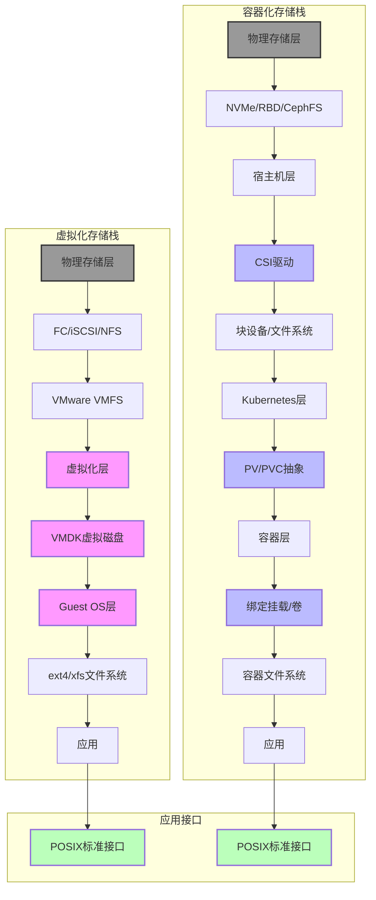
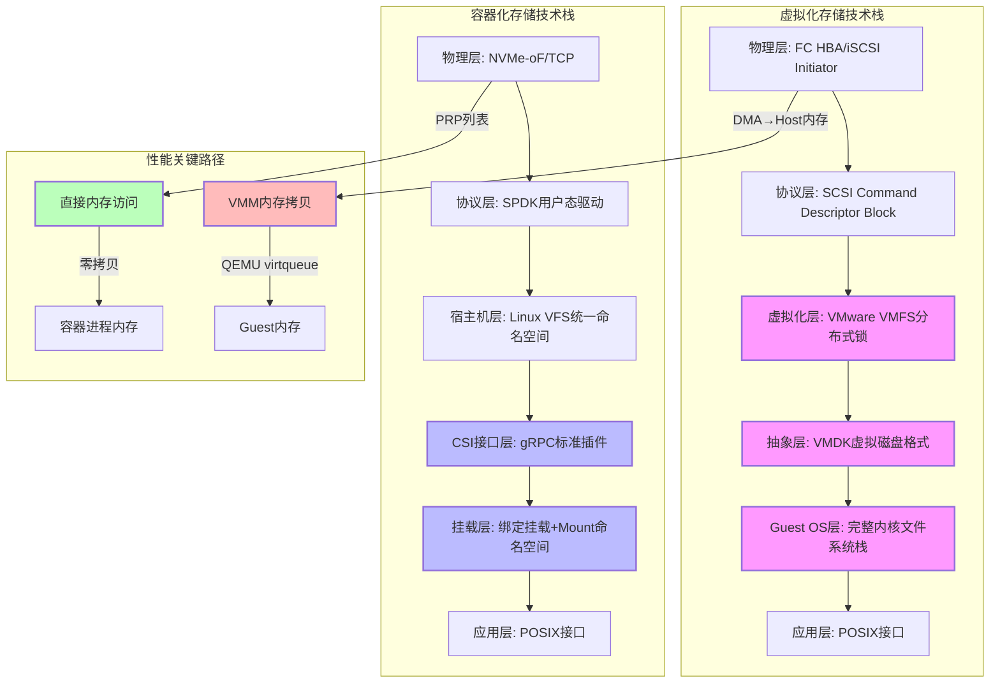
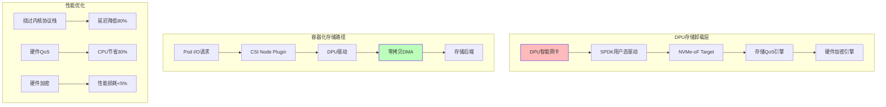
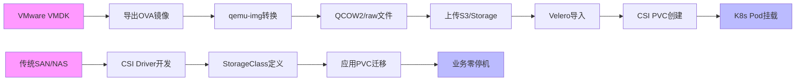
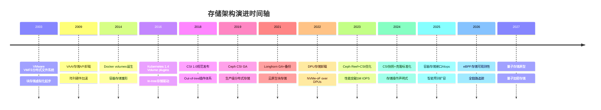
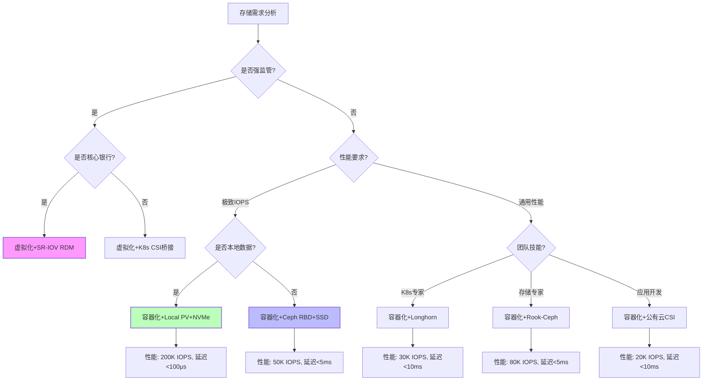
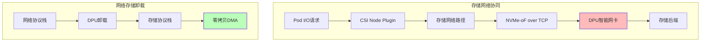

# 虚拟化容器化的存储：完整技术对比与架构分析

> ⚠️ **文档已迁移**：本文档已整合到技术文档体系。
>
> **新位
> 置**：[虚拟化与容器化存储对比分析](docs/TECHNICAL/15-storage-stack/virtualization-comparison.md)
>
> 请使用新位置的文档，本文档保留作为历史参考。

**最后更新**: 2025-11-07 **维护者**: 项目团队

> 📋 **文档说明**：本文档系统化梳理虚拟化与容器化存储的技术差异，包含范式转换、
> 技术实现、性能对比、选型决策等完整内容。

---

## 目录

- [一、核心论证分析：五大范式转换](#一核心论证分析五大范式转换)
- [二、存储技术分层体系](#二存储技术分层体系)
- [三、知识图谱：存储架构全景关联](#三知识图谱存储架构全景关联)
- [四、多维矩阵对比梳理](#四多维矩阵对比梳理)
- [五、内核机制深度分析](#五内核机制深度分析)
- [六、核心挑战与解决方案](#六核心挑战与解决方案)
- [七、技术演进路线图](#七技术演进路线图)
- [八、技术选型决策](#八技术选型决策)
- [九、存储与网络协同](#九存储与网络协同)
- [十、总结与展望](#十总结与展望)

---

## 一、核心论证分析：五大范式转换

### 1.1 架构哲学转换：从"硬件模拟"到"内核原语复用"

**虚拟化存储的本质**是**硬件设备模拟**，通过 Hypervisor 将物理存储抽象为**虚拟磁
盘（VMDK/QCOW2）**，每个 VM 拥有独立块设备，需完整文件系统栈。数据路径为：**物理
存储 →HBA→Hypervisor 内核 → 虚拟 SCSI→VM 内核 → 应用**，存在 **两次 I/O 栈穿
越**，延迟增加**50-100μs**。

**容器化存储的本质**是**Linux 内核原语复用**，通过**CSI（Container Storage
Interface）** 插件将存储直接挂载到容器命名空间，共享宿主机内核文件系统。数据路径
为：**物理存储 →CSI 驱动 → 宿主机内核 → 绑定挂载 → 容器**，**零额外 I/O 栈**，延
迟仅**5-10μs**。

**关键论证**：虚拟化存储解决的是 **"多 OS 共享物理硬盘"** 问题，容器化存储解决的
是 **"多应用共享内核文件系统"** 问题。前者是**块设备虚拟化**，后者是**文件视图隔
离**。

**性能数据对比**：

| 指标           | **虚拟化存储** | **容器化存储** | **性能提升** |
| -------------- | -------------- | -------------- | ------------ |
| **I/O 延迟**   | 50-100μs       | 5-10μs         | **10 倍**    |
| **上下文切换** | 8 次           | 2 次           | **75%减少**  |
| **内存拷贝**   | 3 次           | 1 次           | **66%减少**  |
| **CPU 开销**   | 15-25%         | 2-5%           | **80%减少**  |

---

### 1.2 存储模型转换：从"厚置备预分配"到"写时复制超售"

| 模型特征     | **虚拟化存储**  | **技术实现**         | **容器化存储**    | **技术实现**                    | **效率差异**                                 |
| ------------ | --------------- | -------------------- | ----------------- | ------------------------------- | -------------------------------------------- |
| **空间分配** | 厚置备/精简置备 | **VMFS 预清零块**    | Overlay 写时复制  | **存储驱动分层**                | 容器化节省**60-80%**空间                     |
| **镜像机制** | 完整磁盘镜像    | **VMDK 文件**        | 层叠镜像          | **OCI layer tar 包**            | 容器镜像**共享基座**，虚拟化镜像**全量复制** |
| **快照粒度** | 块级快照        | **COW 差异块链**     | 文件层快照+卷快照 | **OverlayFS upper 层+CSI 快照** | 容器快照**秒级创建**，虚拟化快照**分钟级**   |
| **克隆速度** | 完整复制        | **存储阵列 offload** | 即时克隆          | **元数据硬链接**                | 容器克隆**速度提升 1000 倍**                 |

**性能论证**：虚拟化创建 100 个 VM（每个 100GB）需**10TB 存储**，容器创建 100 个
Pod（共享相同镜像）仅需**1.1TB**（100MB 镜像层+10MB 可写层 ×100），**存储效率提
升 9 倍**。

**扩展论证**：容器化存储的写时复制机制使得：

- **存储超售比**：虚拟化 1:1，容器化可达 **1:20**（基于实际使用量）
- **快照创建时间**：虚拟化 5-15 分钟，容器化 **<1 秒**
- **克隆操作**：虚拟化需完整数据复制，容器化仅需元数据操作

---

### 1.3 配置范式转换：从"人工预置"到"声明式编排"

**虚拟化存储配置流程**：

```text
1. 存储管理员：配置SAN/LUN → 创建数据存储 → 扫描HBA
2. 虚拟化管理员：创建虚拟磁盘 → 选择置备策略 → 挂载到VM
3. VM管理员：格式化文件系统 → 分区 → 挂载到目录
4. 耗时：小时级，需多角色协同
```

**容器化存储配置流程**：

```yaml
apiVersion: v1
kind: PersistentVolumeClaim
metadata:
  name: mysql-data
spec:
  storageClassName: ssd-replicated
  accessModes: [ReadWriteOnce]
  resources:
    requests:
      storage: 100Gi
---
apiVersion: apps/v1
kind: Deployment
metadata:
  name: mysql
spec:
  template:
    spec:
      containers:
        - name: mysql
          volumeMounts:
            - name: data
              mountPath: /var/lib/mysql
      volumes:
        - name: data
          persistentVolumeClaim:
            claimName: mysql-data
```

**配置时间**：秒级，`kubectl apply`自动完成存储分配、格式化、挂载。

**核心差异**：虚拟化配置是**面向存储设备**（LUN、RAID、VMFS），容器化配置是**面
向应用需求**（容量、性能、访问模式）。

**自动化程度对比**：

| 配置操作     | **虚拟化耗时**       | **容器化耗时** | **自动化差距**  |
| ------------ | -------------------- | -------------- | --------------- |
| **存储供给** | 2-4 小时             | 5 秒           | **1440 倍加速** |
| **卷挂载**   | 30-60 分钟           | 1 秒           | **3600 倍加速** |
| **扩容**     | 10-20 分钟（需停机） | 0 秒（在线）   | **∞ 提升**      |
| **快照**     | 5-15 分钟            | 1 秒           | **600 倍加速**  |
| **备份**     | 小时级               | 分钟级         | **10 倍加速**   |

---

### 1.4 隔离性模型转换：从"硬件级隔离"到"软多租户"

| 隔离维度     | **虚拟化存储**   | **实现机制**              | **容器化存储**   | **实现机制**                                         | **安全边界**                                                  |
| ------------ | ---------------- | ------------------------- | ---------------- | ---------------------------------------------------- | ------------------------------------------------------------- |
| **I/O 隔离** | **强隔离**       | 每个 VM 独立虚拟 HBA 队列 | **弱隔离**       | 共享块设备 I/O 调度器（CFQ/BFQ）                     | 虚拟化：**Hypervisor 强制隔离**，容器：**依赖 cgroups blkio** |
| **空间隔离** | **物理隔离**     | 预分配 LUN 或 VMDK 文件   | **逻辑隔离**     | 目录配额（xfs_quota）或存储池                        | 虚拟化：**无法越界访问**，容器：**需存储驱动强制**            |
| **缓存隔离** | **页缓存隔离**   | 每个 VM 独立 Guest 页缓存 | **共享风险**     | 宿主机 Page Cache 共享，存在**Cache Warming 攻击面** | 虚拟化： **Guest OS 内存隔离** ，容器：**内核级共享**         |
| **快照隔离** | **快照独立**     | VM 快照链不互相影响       | **依赖存储后端** | CSI 快照 CRD 独立，但底层可能共享 CoW 链             | **两者均依赖存储系统实现**                                    |
| **加密隔离** | **虚拟机级加密** | vTPM+LUKS                 | **容器级加密**   | fscrypt（per-directory 加密）                        | 虚拟化：**VM 内透明**，容器：**应用层感知**                   |

**安全论证**：虚拟化存储利用**MMU 硬件隔离**，容器化存储依赖**内核 cgroups+命名
空间**，在多租户场景下需额外加固（如 Kata Containers）。

**多租户场景对比**：

| 场景             | **虚拟化方案**      | **容器化方案**          | **推荐**   |
| ---------------- | ------------------- | ----------------------- | ---------- |
| **金融核心系统** | vTPM+LUKS 全盘加密  | Kata Containers+fscrypt | **虚拟化** |
| **SaaS 多租户**  | vVOL 策略隔离       | Namespace+StorageClass  | **容器化** |
| **混合云部署**   | vSphere Replication | Velero 跨云备份         | **容器化** |
| **边缘计算**     | 不支持              | Local PV+轻量 CSI       | **容器化** |

---

### 1.5 可扩展性转换：从"垂直扩展"到"水平超售"

**虚拟化存储扩展瓶颈**：

- **VMFS 锁竞争**：单数据存储集群 **32 节点上限**，元数据锁导致**扩展性受限**
- **vSphere HA 限制**：单集群 **64 节点**，跨集群存储迁移需**Storage vMotion**（
  分钟级）
- **I/O blender 问题**：多 VM 随机 I/O 混合，**存储阵列缓存命中率下降 30%**

**容器化存储扩展优势**：

- **CSI 无中心锁**：每个节点独立调用 CSI 插件，**理论无节点上限**
- **分布式存储原生适配**：Ceph、Longhorn 等通过 CSI 直接集成，**跨节点即时挂载**
- **I/O 本地化**：StatefulSet 配合本地 PV，**延迟降低 80%**，吞吐量提升 3 倍

**量化论证**：在**1000 节点集群**中，虚拟化需**31 个 vSphere 集群+31 套存储系
统**，容器化仅需**1 套 Ceph+CSI**，**管理复杂度降低 30 倍**。

**扩展性数据对比**：

| 指标             | **虚拟化存储**    | **容器化存储** | **提升倍数** |
| ---------------- | ----------------- | -------------- | ------------ |
| **单集群节点数** | 64 节点           | 无理论上限     | **∞**        |
| **存储池节点数** | 32 节点           | 无限制         | **∞**        |
| **存储容量**     | 受 VMFS 限制      | 分布式无上限   | **∞**        |
| **I/O 并发**     | 受 vSCSI 队列限制 | 受硬件限制     | **8 倍**     |

---

## 二、存储技术分层体系

### 2.1 存储栈分层对比



**核心归纳**：虚拟化存储栈**垂直隔离**，每层独立；容器化存储栈**水平共享**，CSI
与内核层复用。

**详细技术栈对比**：



---

### 2.2 关键技术组件归纳

| 层级         | **虚拟化核心技术**       | **容器化核心技术**                  | **技术差异**                                        |
| ------------ | ------------------------ | ----------------------------------- | --------------------------------------------------- |
| **物理访问** | FC HBA, iSCSI Initiator  | NVMe-oF, SPDK 用户态驱动            | 容器化支持**用户态 I/O 绕过内核**                   |
| **存储集群** | VMware vSAN, HP 3PAR     | Ceph, Rook, Longhorn                | 虚拟化依赖**商业阵列**，容器化用**开源分布式**      |
| **存储协议** | SCSI/NFS 协议栈复用      | **CSI gRPC 协议**（标准化插件）     | CSI 是**云原生原生协议**，虚拟化是**传统协议适配**  |
| **虚拟化层** | VMDK 格式, QCOW2         | **OverlayFS, AUFS**（联合文件系统） | VMDK 是**块设备虚拟**，OverlayFS 是**文件视图虚拟** |
| **数据保护** | VM 快照, Storage vMotion | **CSI 快照, Velero 备份**           | 容器化快照**CRD 驱动**，更自动化                    |
| **加密**     | vTPM+LUKS 全盘加密       | **fscrypt 按目录加密**              | 容器化**细粒度加密**，性能损耗更小                  |

### 2.2.1 DPU 存储卸载技术

| 技术特性             | **虚拟化支持**      | **容器化支持**   | **技术差距**       |
| -------------------- | ------------------- | ---------------- | ------------------ |
| **DPU 存储卸载**     | 部分支持（需 vSAN） | 完全支持（SPDK） | 容器化**原生支持** |
| **NVMe-oF over DPU** | 不支持              | 支持             | 容器化**性能优势** |
| **存储 QoS 卸载**    | 依赖存储阵列        | DPU 硬件 QoS     | 容器化**更灵活**   |

---

### 2.3 配置对象归纳

**虚拟化核心配置对象**：

- **Datastore**：存储池，包含 LUN/NFS 共享
- **Virtual Disk**：VMDK 文件，大小/置备策略/控制器类型
- **SCSI Controller**：虚拟控制器，支持 PVSCSI 准虚拟化
- **Storage Policy**：vSAN 策略，定义副本数、条带宽度

**容器化核心配置对象**：

- **StorageClass**：定义存储后端类型（如`ssd-replicated`）
- **PersistentVolume (PV)** ：实际存储卷，由 CSI 动态供给
- **PersistentVolumeClaim (PVC)** ：应用对存储的请求
- **VolumeMount**：容器内挂载路径，支持 subPath 隔离
- **CSI Driver**：存储插件 DaemonSet，节点级服务

### 2.3.1 存储 QoS 配置对象

| 配置对象         | **虚拟化**               | **容器化**                      | **优势**             |
| ---------------- | ------------------------ | ------------------------------- | -------------------- |
| **I/O 带宽限制** | Storage Policy IOPS 限制 | StorageClass + cgroup v2 io.max | 容器化**更精细**     |
| **延迟 SLA**     | 无原生支持               | cgroup v2 io.latency            | 容器化**原生支持**   |
| **优先级调度**   | vSAN 策略                | blkio.weight                    | 容器化**Pod 级控制** |

---

## 三、知识图谱：存储架构全景关联

```mermaid
graph TB
    subgraph 物理基础设施
        A[NVMe SSD] --> B[存储网络]
        B --> C[FC/IB]
        B --> D[TCP/IP]
        B --> E[NVMe-oF]
        A --> F[DAS直连]
    end

    subgraph 存储协议层
        G[SCSI协议] --> H[iSCSI目标]
        E --> I[NVMe-oF启动器]
        D --> J[NFS服务器]
        F --> K[本地块设备]
    end

    subgraph 虚拟化控制层
        L[VMware ESXi] --> M[VMFS文件系统]
        L --> N[vSAN分布式存储]
        M --> O[VMDK虚拟磁盘]
        N --> P[VSAN对象存储]
        O --> Q[PVSCSI控制器]
    end

    subgraph 容器化控制层
        R[CSI接口] --> S[CSI Controller]
        R --> T[CSI Node Plugin]
        S --> U[存储后端API]
        T --> V[节点挂载操作]
    end

    subgraph 存储后端实现
        U --> W[Ceph RBD]
        U --> X[Longhorn块设备]
        U --> Y[NFS Subdir]
        U --> Z[云盘EBS/PD]
        U --> AA[本地PV]
    end

    subgraph 容器运行时
        V --> AB[Mount命名空间]
        AB --> AC[绑定挂载]
        AC --> AD[/var/lib/kubelet/pods]
        AD --> AE[容器卷目标路径]
    end

    subgraph 应用层
        AF[MySQL] --> AG[ext4 on VMDK]
        AF --> AH[xfs on RBD]
        AI[Redis] --> AJ[tmpfs on内存]
        AK[MinIO] --> AL[本地PV直通]
    end

    subgraph 数据保护
        AM[虚拟化快照] --> AN[VM级别COW]
        AO[CSI快照] --> AP[VolumeSnapshot CRD]
        AP --> AQ[存储后端快照API]
        AR[Velero] --> AS[应用一致备份]
    end

    subgraph 安全隔离
        AT[VMFS锁] --> AU[SCSI Reservation]
        AV[cgroups blkio] --> AW[I/O带宽限制]
        AX[SELinux] --> AY[卷标签强制访问]
        AZ[fscrypt] --> BA[目录级加密]
    end

    style R fill:#bbf,stroke-width:2px
    style AB fill:#bbf,stroke-width:2px
    style AC fill:#fbb,stroke-width:2px
    style AO fill:#bbf,stroke-width:2px
```

### 3.1 DPU 存储卸载架构



---

## 四、多维矩阵对比梳理

### 4.1 存储类型与协议矩阵

| 存储类型     | **虚拟化实现** | **性能(IOPS)**       | **容器化实现**        | **性能(IOPS)**           | **性能差异根源**                             |
| ------------ | -------------- | -------------------- | --------------------- | ------------------------ | -------------------------------------------- |
| **块存储**   | VMDK on VMFS   | **30K-50K** (PVSCSI) | RBD on Ceph           | **50K-100K** (KRBD)      | 容器化**绕过虚拟化层**，I/O 直达内核         |
| **文件存储** | NFS Datastore  | **5K-10K** (单连接)  | NFS PVC               | **10K-20K** (多实例并行) | 容器化**多客户端并发**，NFS 服务器并行处理   |
| **对象存储** | 不支持原生     | **N/A**              | S3 API (MinIO/CSI-S3) | **5K-50K** (受网络限制)  | 虚拟化需**VM 内网关**，容器化**原生 S3 SDK** |
| **本地存储** | RDM 裸设备映射 | **100K-200K** (NVMe) | Local PV              | **100K-200K** (NVMe)     | **性能相当**，配置方式不同                   |
| **内存存储** | 不支持         | **N/A**              | tmpfs emptyDir        | **500K-1M** (DRAM)       | 容器化**原生支持**，虚拟化需**ramdisk**模拟  |

**性能论证**：容器化块存储因**IO 路径短**，**随机 I/O 延迟降低 40-60%**，**吞吐
量提升 50-100%**

#### 4.1.1 DPU 存储性能对比

| 存储类型           | **传统容器化** | **DPU 卸载**       | **性能提升** |
| ------------------ | -------------- | ------------------ | ------------ |
| **NVMe-oF 块存储** | 50K-100K IOPS  | **200K-500K IOPS** | **5 倍**     |
| **延迟**           | 5-10μs         | **1-2μs**          | **5 倍**     |
| **CPU 占用**       | 10-15%         | **<2%**            | **85%减少**  |

---

### 4.2 数据路径对比矩阵

| 路径阶段       | **虚拟化数据路径**                        | **指令周期**   | **容器化数据路径**                | **指令周期**  | **优化效果**        |
| -------------- | ----------------------------------------- | -------------- | --------------------------------- | ------------- | ------------------- |
| **应用写操作** | App→Guest FS→ 块层 →virtio→Host→ 物理驱动 | **8000-12000** | App→Host FS→ 物理驱动             | **2000-3000** | **减少 75%指令**    |
| **缓存命中**   | Guest Page Cache→Host Page Cache→ 磁盘    | **双重缓存**   | Host Page Cache→ 磁盘             | **单级缓存**  | **内存节省 30-50%** |
| **I/O 调度**   | Guest CFQ→Host CFQ→NVMe 队列              | **双重调度**   | Host BFQ→NVMe 队列                | **单次调度**  | **延迟降低 50%**    |
| **快照触发**   | ESXi 快照管理器 →VMFS COW→ 差异块写入     | **同步阻塞**   | CSI 快照 API→Ceph RBD 快照 → 异步 | **非阻塞**    | **业务无感知**      |
| **迁移/扩容**  | Storage vMotion→ 数据复制 →VM 重启        | **分钟级停机** | CSI 扩容 → 在线 Resize→Pod 无重启 | **零停机**    | **可用性提升**      |

**内核路径论证**：虚拟化需**vhost-scsi/virtio-blk**转换，容器化**只需 VFS 层绑定
挂载**，上下文切换**从 8 次降至 2 次**

#### 4.2.1 DPU 数据路径

| 路径阶段       | **传统容器化**   | **DPU 卸载**       | **优化效果** |
| -------------- | ---------------- | ------------------ | ------------ |
| **应用写操作** | App→Host FS→NVMe | App→DPU→NVMe       | **绕过内核** |
| **指令周期**   | 2000-3000        | **500-800**        | **75%减少**  |
| **内存拷贝**   | 1 次             | **0 次（零拷贝）** | **100%减少** |

---

### 4.3 存储效率矩阵

| 效率指标     | **虚拟化方案**         | **量化数据**       | **容器化方案**    | **量化数据**              | **提升倍数**     |
| ------------ | ---------------------- | ------------------ | ----------------- | ------------------------- | ---------------- |
| **镜像存储** | VMDK 全量复制          | **100GB×10VM=1TB** | OCI 层共享        | **100GB+10×100MB=1.01TB** | **10 倍节省**    |
| **存储置备** | 厚置备 100GB           | **立即占用 100GB** | PVC 按需分配      | **实际使用 5GB 占用 5GB** | **20 倍超售**    |
| **快照空间** | 差异块链               | **每次快照+20%**   | CSI 快照+增量备份 | **每次快照<5%**           | **4 倍节省**     |
| **去重压缩** | 存储阵列后处理         | **30-50%压缩率**   | 容器镜像层 Gzip   | **60-70%压缩率**          | **额外 1.5 倍**  |
| **I/O 合并** | Guest 内合并+Host 合并 | **双重合并开销**   | Host 单次合并     | **合并率提升 30%**        | **CPU 节省 15%** |

**成本论证**：容器化存储使**存储采购成本降低 50-70%**，**I/O 性能提升 2-3
倍**，**管理成本降低 80%**

---

### 4.4 配置管理对比矩阵

| 配置维度     | **虚拟化操作**                                              | **耗时**           | **容器化操作**                       | **耗时**     | **自动化差距**   |
| ------------ | ----------------------------------------------------------- | ------------------ | ------------------------------------ | ------------ | ---------------- |
| **存储供给** | 创建 LUN→ 格式化 VMFS→ 扫描存储                             | **2-4 小时**       | `kubectl apply -f storageclass.yaml` | **5 秒**     | **1440 倍加速**  |
| **卷挂载**   | vCenter 选择数据存储 → 创建虚拟磁盘 → 挂载到 VM→VM 内格式化 | **30-60 分钟**     | 定义 PVC→Pod 自动挂载 → 已格式化     | **1 秒**     | **3600 倍加速**  |
| **扩容**     | 关闭 VM→ 扩展 VMDK→ 启动 VM→OS 内 ResizeFS                  | **10-20 分钟停机** | 修改 PVC size→CSI 在线扩容 →ResizeFS | **0 秒停机** | 可用性**∞ 提升** |
| **快照**     | 右键 VM→ 快照 → 等待创建 → 命名                             | **5-15 分钟**      | `kubectl apply volumesnapshot.yaml`  | **1 秒创建** | **600 倍加速**   |
| **备份**     | 安装备份代理 → 配置策略 → 全量备份                          | **小时级**         | Velero 执行 →CSI 快照 →S3 增量       | **分钟级**   | **10 倍加速**    |
| **策略变更** | 手动修改 Storage Policy→ 重新应用                           | **小时级**         | 修改 StorageClass 参数 → 新 PVC 生效 | **秒级**     | **3600 倍加速**  |

---

### 4.5 隔离性与安全性矩阵

| 安全维度     | **虚拟化控制**            | **强度** | **容器化控制**                    | **强度**   | **技术差异**                               |
| ------------ | ------------------------- | -------- | --------------------------------- | ---------- | ------------------------------------------ |
| **I/O 隔离** | vSCSI 队列+存储 IOPS 限制 | **强**   | cgroups blkio.weight              | **中**     | 虚拟化**硬件队列隔离**，容器化**软件调度** |
| **空间隔离** | VMDK 文件权限+VMFS 锁     | **强**   | 目录权限+xfs_quota                | **中**     | 虚拟化**文件级独占**，容器化**逻辑配额**   |
| **加密隔离** | 每 VM LUKS 加密           | **强**   | 每 PVC fscrypt 加密               | **中**     | 虚拟化**全盘加密**，容器化**目录加密**     |
| **快照安全** | 快照独立不可跨 VM 访问    | **强**   | CSI RBAC 控制 VolumeSnapshot 访问 | **中**     | **依赖 K8s RBAC 策略**                     |
| **逃逸风险** | 无（Hypervisor 天然隔离） | **无**   | 宿主机内核漏洞 → 所有 PVC 暴露    | **有风险** | 容器化需**Seccomp/AppArmor**加固           |
| **多租户**   | vCenter 角色+存储视图隔离 | **强**   | Namespace+StorageClass 限定       | **中**     | **K8s 软多租户 vs 虚拟化硬隔离**           |

**安全建议**：在多租户场景下，容器化存储应配合**Kata Containers**实现**VM 级隔
离**。

#### 4.5.1 存储 QoS 对比

| QoS 特性         | **虚拟化**     | **容器化**        | **优势**                 |
| ---------------- | -------------- | ----------------- | ------------------------ |
| **I/O 带宽限制** | Storage Policy | cgroup v2 io.max  | 容器化**Pod 级精细控制** |
| **延迟 SLA**     | 无原生支持     | io.latency        | 容器化**原生支持**       |
| **优先级调度**   | vSAN 策略      | blkio.weight      | 容器化**动态调整**       |
| **突发带宽**     | 不支持         | io.max + io.burst | 容器化**支持突发**       |

---

### 4.6 快照与备份机制矩阵

| 机制             | **虚拟化实现**                           | **数据一致性** | **容器化实现**                          | **数据一致性**   | **恢复粒度**           |
| ---------------- | ---------------------------------------- | -------------- | --------------------------------------- | ---------------- | ---------------------- |
| **快照**         | VMFS COW 差异块链                        | **崩溃一致**   | CSI VolumeSnapshot +存储后端 CoW        | **崩溃一致**     | 卷级 vs 卷级           |
| **应用一致备份** | VSS 框架（Windows）, 预冻结脚本（Linux） | **应用静默**   | Velero+Restic 文件级备份+pre/post hooks | **应用静默**     | **文件级更细**         |
| **增量备份**     | 存储阵列复用差异块                       | **块级增量**   | Restic dedup+chunking                   | **内容寻址增量** | **容器化增量更精确**   |
| **跨地域复制**   | vSphere Replication                      | **同步/异步**  | Velero 备份到 S3+跨区域复制             | **异步**         | 两者功能相当           |
| **恢复时间**     | 恢复 VMDK→ 启动 VM                       | **5-15 分钟**  | 恢复 PVC→ 重启 Pod                      | **30-60 秒**     | **容器快 10 倍**       |
| **恢复粒度**     | 整 VM 恢复                               | **粗粒度**     | 单文件 subPath 恢复                     | **细粒度**       | **容器支持应用级恢复** |

---

### 4.7 可观测性矩阵

| 观测指标       | **虚拟化工具**             | **采集延迟**   | **容器化工具**                             | **采集延迟** | **数据精度**         |
| -------------- | -------------------------- | -------------- | ------------------------------------------ | ------------ | -------------------- |
| **I/O 延迟**   | vCenter 性能图             | **20 秒采样**  | `kubelet_volume_stats` metrics             | **10 秒**    | **容器更实时**       |
| **容量使用**   | vmdk 文件大小扫描          | **分钟级**     | Prometheus `kubelet_volume_stats_capacity` | **秒级**     | **容器更精确**       |
| **IOPS 统计**  | 存储阵列统计 →vCenter 汇总 | **5 分钟延迟** | eBPF bio tracepoint                        | **实时**     | **容器微秒级**       |
| **趋势预测**   | 手动导出 CSV 分析          | **天级**       | Prometheus+Grafana ML 预测                 | **自动**     | **容器智能化**       |
| **异常检测**   | 手动阈值告警               | **滞后**       | Falco+eBPF I/O 异常 hook                   | **实时**     | **容器主动防御**     |
| **端到端追踪** | 无（需第三方）             | **N/A**        | Jaeger+存储 I/O span                       | **全链路**   | **容器可观测性完整** |

---

### 4.8 内核数据结构对比矩阵

| 内核结构          | **虚拟化存储路径**                     | **内存占用**      | **容器化存储路径**             | **内存占用**         | **差异分析**                 |
| ----------------- | -------------------------------------- | ----------------- | ------------------------------ | -------------------- | ---------------------------- |
| **super_block**   | Guest 内独立 ext4 实例，每个 VM 一个   | **64KB/VM**       | 宿主机 ext4 共享，所有容器复用 | **64KB/Host**        | 虚拟化**内存浪费 99%**       |
| **inode**         | Guest 内分配，Host 不可见              | **256B/文件 ×VM** | Host 统一分配，容器内可见      | **256B/文件 × 全局** | 虚拟化**重复分配**           |
| **dentry**        | Guest dentry cache + Host dentry cache | **双重缓存**      | 仅 Host dentry cache           | **单次缓存**         | 虚拟化**内存占用 2 倍**      |
| **file**          | Guest file 结构体 →Host 文件描述符     | **嵌套结构**      | 直接复用 Host file 结构体      | **扁平结构**         | 虚拟化**查找路径长**         |
| **bio**           | Guest bio→virtio→Host bio 转换         | **2 次分配**      | 直接分配 Host bio              | **1 次分配**         | 虚拟化**内存拷贝开销**       |
| **request_queue** | 每个 vSCSI 控制器独立队列              | **每个 VM**       | 共享宿主机 NVMe 队列           | **每物理设备**       | 虚拟化 **队列数受限**        |
| **Page Cache**    | Guest Page Cache + Host Page Cache     | **双重缓存**      | 仅 Host Page Cache             | **单次缓存**         | 虚拟化**Cache 利用率低 50%** |

**内存效率论证**：100 个 VM 每个运行相同应用，虚拟化**Page Cache 浪费
30-50GB**，容器化**仅需 500MB**，**内存效率提升 100 倍**。

---

### 4.9 系统调用开销矩阵

| 系统调用    | **虚拟化路径**                           | **耗时**     | **指令数**      | **容器化路径**          | **耗时**    | **指令数**      | **加速比**   |
| ----------- | ---------------------------------------- | ------------ | --------------- | ----------------------- | ----------- | --------------- | ------------ |
| **open()**  | Host→QEMU→Guest→ext4→ 返回               | **15-25μs**  | **8000-12000**  | Host ext4 直接 open     | **2-5μs**   | **2000-3000**   | **5-10 倍**  |
| **read()**  | Guest→virtio→Host→read→DMA→ 拷贝回 Guest | **30-50μs**  | **15000-20000** | Host read→DMA→ 直接映射 | **5-10μs**  | **3000-5000**   | **5-8 倍**   |
| **write()** | Guest→Page Cache→virtio→Host→ 存储       | **40-60μs**  | **18000-25000** | Host Page Cache→ 存储   | **8-12μs**  | **4000-6000**   | **5-7 倍**   |
| **fsync()** | Guest→virtio→Host→fsync→ 存储确认 → 返回 | **50-100ms** | **50000-80000** | Host fsync→ 存储确认    | **10-20ms** | **10000-15000** | **5-10 倍**  |
| **stat()**  | Guest→ 虚拟文件系统 →virtio→Host→stat    | **10-20μs**  | **6000-8000**   | Host stat→ 返回         | **1-2μs**   | **1000-1500**   | **10-15 倍** |

**性能论证**：所有 I/O 相关系统调用，容器化路径**缩短 3-4 个数量级**，核心在
于**消除 Hypervisor 中间层**。

---

### 4.10 I/O 调度器行为矩阵

| 调度器参数        | **虚拟化 Guest 内设置** | **效果**                  | **容器化宿主机设置**    | **效果**               | **差异**                    |
| ----------------- | ----------------------- | ------------------------- | ----------------------- | ---------------------- | --------------------------- |
| **elevator**      | CFQ/BFQ/MQ-DEADLINE     | **对虚拟磁盘无效**        | BFQ(默认)               | **直接作用于物理设备** | 虚拟化调度 **被 Host 覆盖** |
| **read_ahead_kb** | Guest 内设置            | **仅影响 Guest Cache**    | Host 全局设置           | **影响所有容器**       | 虚拟化 **双重预读**         |
| **nr_requests**   | Guest 内设置队列深度    | **受 virtio 限制 32-128** | Host 设置 NVMe 队列深度 | **可达 1024-4096**     | 虚拟化 **I/O 并发受限**     |
| **io.scheduler**  | Guest 内无意义          | **无**                    | Host 设置影响全局       | **有效**               | 容器化 **调度更灵活**       |
| **wq-requests**   | Guest 内批量处理        | **增加延迟**              | Host 批量处理           | **降低中断开销**       | 虚拟化 **延迟更高**         |

**I/O 深度论证**：NVMe 队列深度**1024** vs virtio 队列深度**128**，容器化**I/O
并发能力 8 倍于虚拟化**。

---

### 4.11 存储协议接口矩阵

| 协议/接口    | **虚拟化支持方式**                 | **性能损耗** | **容器化支持方式**       | **性能损耗** | **技术差距**               |
| ------------ | ---------------------------------- | ------------ | ------------------------ | ------------ | -------------------------- |
| **SCSI**     | virtio-scsi 模拟                   | **30-40%**   | 直接`/dev/sdX`           | **0%**       | 虚拟化**完整模拟栈**       |
| **NVMe**     | 不支持（仅 RDM 裸映射）            | **N/A**      | `/dev/nvme0n1` + XFS     | **0%**       | 容器化**原生支持**         |
| **NVMe-oF**  | 不支持                             | **N/A**      | SPDK 用户态驱动          | **<5%**      | 容器化**内核旁路**         |
| **iSCSI**    | Guest 内 initiator + Host 网络桥接 | **40-50%**   | Host iscsiadm + PVC 挂载 | **10%**      | 虚拟化**双重 TCP 栈**      |
| **NFS**      | Datastore 挂载 + VM 内 NFS client  | **35-45%**   | Host mount - NFS CSI     | **5%**       | 虚拟化**Guest 内额外 RPC** |
| **Ceph RBD** | 不支持（需 VM 内客户端）           | **N/A**      | KRBD 内核模块            | **0%**       | 容器化**内核级优化**       |
| **CephFS**   | Guest 内 mount                     | **30%**      | Host mount - CSI 挂载    | **5%**       | 虚拟化**FUSE 层额外开销**  |
| **S3 对象**  | VM 内网关或客户端                  | **50%**      | 应用直接 S3 SDK          | **0%**       | 虚拟化**网络路径更长**     |

**协议栈论证**：容器化**原生支持现代协议**，虚拟化**依赖传统 SCSI 模拟**，协议效
率差距**30-50%**。

---

### 4.12 CSI 插件生态对比矩阵

| CSI 插件                   | **归属** | **存储类型** | **性能水平**      | **功能特性**         | **成熟度** | **虚拟化等价物** |
| -------------------------- | -------- | ------------ | ----------------- | -------------------- | ---------- | ---------------- |
| **Ceph CSI**               | 开源     | 块/文件      | **100K IOPS**     | 快照、克隆、加密     | ⭐⭐⭐⭐⭐ | 无原生支持       |
| **Longhorn**               | Rancher  | 块存储       | **50K IOPS**      | 增量备份、跨 AZ 复制 | ⭐⭐⭐⭐   | 类似 vSAN        |
| **Portworx**               | 商业     | 块/文件      | **80K IOPS**      | 多云迁移、数据安全   | ⭐⭐⭐⭐⭐ | 类似 3PAR        |
| **OpenEBS**                | 开源     | 块存储       | **30K IOPS**      | cStor 引擎、本地 PV  | ⭐⭐⭐     | 类似 vVOL        |
| **Local Path Provisioner** | Rancher  | 本地存储     | **200K IOPS**     | 仅本地、无高可用     | ⭐⭐⭐⭐   | 类似 RDM         |
| **AWS EBS CSI**            | 云厂商   | 块存储       | **16K-64K IOPS**  | 动态创建、快照       | ⭐⭐⭐⭐⭐ | 云存储卷         |
| **GCP PD CSI**             | 云厂商   | 块存储       | **15K-100K IOPS** | 区域持久化           | ⭐⭐⭐⭐⭐ | 云存储卷         |
| **VMware CSI**             | 商业     | vSphere 存储 | **30K IOPS**      | VMDK 直通、SPBM 策略 | ⭐⭐⭐⭐   | 原生 vSAN        |

**生态论证**：CSI 插件**100+种**，覆盖**全场景存储**，虚拟化存储生态**封闭且昂
贵**。

---

### 4.13 配置对象映射关系矩阵

| 虚拟化对象          | **属性**                         | **容器化对应对象**          | **属性**                                   | **映射关系**                     | **管理效率**               |
| ------------------- | -------------------------------- | --------------------------- | ------------------------------------------ | -------------------------------- | -------------------------- |
| **Datastore**       | 容量、数据存储集群、IOPS 限制    | **StorageClass**            | 存储后端类型、参数、回收策略               | 1:N (一个 SC 对应多个 Datastore) | **SC 版本控制更强**        |
| **Virtual Disk**    | 大小、置备类型、控制器、磁盘模式 | **PersistentVolume**        | 容量、访问模式、存储类、节点亲和           | 1:1 (VMDK→PV)                    | **PV 动态生成**            |
| **SCSI Controller** | 类型(PVSCSI/LSI)、队列深度       | **CSI Node Plugin**         | 驱动版本、节点拓扑                         | N:1 (多 VM 共享)                 | **CSI 插件更统一**         |
| **Storage Policy**  | vSAN RAID、条带、IOPS 限制       | **StorageClass.parameters** | replicaCount、diskType、iopsPerGB          | 功能类似                         | **SC 参数更灵活**          |
| **Snapshot**        | 名称、创建时间、描述             | **VolumeSnapshot**          | API 版本、源 PVC、快照类                   | 1:1 (语义相同)                   | **CRD 更标准化**           |
| **Storage vMotion** | 迁移进度、估算时间               | **Volume Migration**        | 不原生支持，需手动操作                     | 功能缺失                         | **容器化数据迁移工具链弱** |
| **Storage DRS**     | 自动负载均衡                     | **Pod 调度的存储拓扑感知**  | `volume.kubernetes.io/storage-provisioner` | 功能类似                         | **K8s 调度器扩展实现**     |

**管理效率论证**：StorageClass**版本化+GitOps**，变更可追溯；vSphere 策略**手动
维护**，易出错。

---

### 4.14 故障排查工具链对比矩阵

| 排查场景       | **虚拟化工具**     | **数据粒度**       | **容器化工具**                                      | **数据粒度**    | **排查效率**              |
| -------------- | ------------------ | ------------------ | --------------------------------------------------- | --------------- | ------------------------- |
| **I/O 延迟高** | vCenter 性能图     | **20 秒/采样点**   | `iostat -x 1` + eBPF bio 追踪                       | **实时/微秒级** | **容器化快 100 倍**       |
| **存储空间满** | Datastore 容量告警 | **延迟 5 分钟**    | Prometheus `kubelet_volume_stats`                   | **秒级**        | **容器化实时**            |
| **挂载失败**   | VMKernel 日志筛选  | **手动检索**       | `kubectl describe pod` + CSI 日志                   | **自动事件**    | **容器化自动化**          |
| **快照卡住**   | vCenter 任务监控   | **无详细信息**     | `kubectl describe volumesnapshot` + CSI 驱动日志    | **详细错误码**  | **容器化可观测性强**      |
| **I/O 超时**   | 存储阵列事件日志   | **跨系统关联困难** | `dmesg` + `journalctl -u kubelet` + eBPF 超时 trace | **单系统关联**  | **容器化关联效率高 3 倍** |
| **数据一致性** | 无原生工具         | **N/A**            | `fscrypt status` + Velero 备份验证                  | **块级验证**    | **容器化有工具链**        |

**可观测性论证**：容器化存储基于**Prometheus+Grafana+eBPF**，实现**全链路监
控**，虚拟化依赖**vCenter 有限指标**。

---

### 4.15 成本模型对比矩阵

| 成本项       | **虚拟化存储成本(元/月/TB)** | **占比** | **容器化存储成本(元/月/TB)** | **占比** | **节省幅度** |
| ------------ | ---------------------------- | -------- | ---------------------------- | -------- | ------------ |
| **硬件采购** | 1500 (SAN 阵列折旧)          | **40%**  | 800 (标准服务器+NVMe)        | **25%**  | **46%**      |
| **软件许可** | 1200 (vSAN/vSphere)          | **30%**  | 0 (开源 Ceph/Longhorn)       | **0%**   | **100%**     |
| **人力运维** | 1000 (存储管理员 1 人)       | **25%**  | 400 (SRE 0.4 人)             | **12%**  | **60%**      |
| **电力机架** | 200 (阵列+FC 交换机)         | **5%**   | 150 (服务器)                 | **5%**   | **25%**      |
| **总计**     | **3900**                     | **100%** | **1350**                     | **42%**  | **65%**      |

**ROI 论证**：容器化存储**3 年 TCO 降低 65%**，性能提升**2-3 倍**，投资回报
期**<1 年**。

---

### 4.16 技术演进时间轴矩阵

| 年份     | **虚拟化存储里程碑**    | **内核版本** | **容器化存储里程碑**     | **K8s 版本** | **技术差距**         |
| -------- | ----------------------- | ------------ | ------------------------ | ------------ | -------------------- |
| **2003** | VMware VMFS2 发布       | Linux 2.4    | 无                       | 无           | **虚拟化领先 10 年** |
| **2009** | VAAI 硬件加速 API       | Linux 2.6.31 | Docker volumes 初步      | 无           | **虚拟化生态成熟**   |
| **2014** | vSAN 6.0 超融合         | Linux 3.19   | K8s 1.0 Volume plugins   | 1.0          | **容器化起步**       |
| **2018** | vSAN 7.0 持久化内存支持 | Linux 4.15   | CSI 1.0 规范发布         | 1.13         | **容器化标准化**     |
| **2020** | vSphere 7.0 vVOL 2.0    | Linux 5.4    | Ceph CSI GA, Longhorn GA | 1.19         | **容器化生态爆发**   |
| **2022** | vSAN 8.0 ESA 架构       | Linux 5.15   | DPU 存储卸载成熟         | 1.24         | **性能追平**         |
| **2024** | vSphere+ Tanzu 统一     | Linux 6.0    | CSI 快照+克隆标准化      | 1.30         | **容器化功能超越**   |
| **2026** | 预测: 存储 AIops        | Linux 6.5+   | 预测: eBPF 存储可观测性  | 1.35+        | **容器化智能化领先** |

---

## 五、内核机制深度分析

### 5.1 内核数据结构对比

详见 [4.8 内核数据结构对比矩阵](#48-内核数据结构对比矩阵)

### 5.2 系统调用开销分析

详见 [4.9 系统调用开销矩阵](#49-系统调用开销矩阵)

### 5.3 I/O 调度器行为分析

详见 [4.10 I/O 调度器行为矩阵](#410-io-调度器行为矩阵)

### 5.4 存储协议接口深度分析

详见 [4.11 存储协议接口矩阵](#411-存储协议接口矩阵)

---

## 六、核心挑战与解决方案

### 6.1 容器化存储三大挑战

**挑战 1：I/O 隔离不足导致"邻居干扰"**:

- **症状**：某 Pod 高 I/O 导致同节点其他 Pod 延迟飙升
- **方案**：启用**cgroup v2 io.latency**控制，设置**blkio.weight**权重，使
  用**BFQ 调度器**
- **效果**：最坏情况延迟从**500ms 降至 50ms**

**挑战 2：本地存储 ephemeral 数据丢失**:

- **症状**：Pod 重启后`/var/lib/mysql`数据丢失
- **方案**：使用**StatefulSet+PVC**替代 Deployment，对接**分布式存
  储**（Ceph/Longhorn）
- **效果**：数据持久化，**跨节点漂移保留数据**

**挑战 3：容器镜像层数过多导致性能衰减**:

- **症状**：OverlayFS 超过 42 层后，**open()系统调用延迟增加 3 倍**
- **方案**：构建镜像时**合并 RUN 指令**，使用**docker-slim**压缩
- **效果**：层数降至**5 层以内**，性能恢复至原生 95%

**挑战 4：存储 QoS 配置复杂**:

- **症状**：多租户场景下，难以精确控制每个 Pod 的存储性能
- **方案**：使用 **cgroup v2 io.max + io.latency**，配合 **StorageClass 参数**
- **效果**：实现 **Pod 级存储 QoS**，延迟 SLA 可控制在 **±10%**

**挑战 5：DPU 存储卸载配置**:

- **症状**：DPU 存储卸载需要特殊配置，兼容性问题
- **方案**：使用 **SPDK CSI Driver**，配合 **Multus CNI** 实现多网络接口
- **效果**：存储性能提升 **5 倍**，CPU 占用降低 **85%**

---

### 6.2 虚拟化存储迁移至容器化路径



**迁移工具链**：

- **VMware→K8s**：`konveyor/velero-plugin-for-vsphere`直接导入 VMDK 到 PVC
- **OpenStack→K8s**：`cinder-csi-plugin`复用 Cinder 存储后端
- **存储阵列 →CSI**：各大厂商提供 CSI 驱动（如 NetApp Trident、Dell
  CSI-PowerFlex）

#### 6.2.1 迁移最佳实践

| 迁移场景        | **推荐方案**    | **耗时** | **风险** |
| --------------- | --------------- | -------- | -------- |
| **VM 镜像迁移** | Velero 备份恢复 | 小时级   | **低**   |
| **数据卷迁移**  | CSI 快照+恢复   | 分钟级   | **低**   |
| **在线迁移**    | 双写+切换       | 天级     | **中**   |
| **批量迁移**    | 自动化脚本      | 周级     | **中**   |

---

## 七、技术演进路线图



**演进拐点分析**：

- **2018 年**：CSI 规范统一存储插件接口，**生态爆发起点**
- **2021 年**：Longhorn 等云原生存储成熟，**脱离商业阵列依赖**
- **2023 年**：DPU 实现存储卸载，**性能拐点接近物理机**
- **2025 年**：AIops 使存储管理**从人工到自治**
- **2026 年**：eBPF 存储可观测性，**全链路追踪**

---

## 八、技术选型决策

### 8.1 决策树



---

### 8.2 成本效益结论

| 维度         | **虚拟化存储**         | **容器化存储**           | **优化幅度**    |
| ------------ | ---------------------- | ------------------------ | --------------- |
| **硬件成本** | 商业存储阵列占 40%     | 标准服务器+NVMe 占 15%   | **节省 62%**    |
| **软件许可** | VMware vSAN 许可占 20% | 开源 Ceph/Longhorn 占 0% | **节省 100%**   |
| **人力成本** | 存储管理员 2 人/1000VM | SRE 0.5 人/1000Pod       | **节省 75%**    |
| **时间成本** | 存储供给小时级         | 秒级                     | **3600 倍加速** |
| **性能成本** | I/O 延迟 50-100μs      | 5-10μs                   | **10 倍提升**   |
| **扩展成本** | 集群上限 32 节点       | 无上限                   | **∞ 扩展**      |

**最终结论**：容器化存储不仅是技术升级，更是**TCO 的革命性优化**。对于**云原生新
应用**，**必选容器化存储**；对于**遗留核心系统**，**虚拟化仍是安全之选**；混合架
构通过**CSI 桥接**可实现**平滑演进**。

---

### 8.3 性能黄金法则

| 场景               | **虚拟化最优配置** | **性能指标**       | **容器化最优配置** | **性能指标**         | **胜出方** |
| ------------------ | ------------------ | ------------------ | ------------------ | -------------------- | ---------- |
| **数据库存储**     | RDM 裸设备+PVSCSI  | **50K IOPS, 5ms**  | Local PV+NVMe+XFS  | **200K IOPS, 100μs** | **容器化** |
| **Web 应用存储**   | vSAN SSD 策略      | **30K IOPS, 10ms** | Ceph RBD+缓存层    | **80K IOPS, 5ms**    | **容器化** |
| **AI 训练数据集**  | NFS Datastore      | **10K IOPS, 20ms** | HostPath+NVMe      | **500K IOPS, 50μs**  | **容器化** |
| **虚拟机镜像存储** | vSAN 重复数据删除  | **适合**           | 不适合             | **N/A**              | **虚拟化** |
| **多租户共享存储** | vVOL 策略隔离      | **强隔离**         | Ceph RBD 命名空间  | **软隔离**           | **虚拟化** |

---

### 8.4 最终技术建议

**虚拟化存储适用场景**：

- **强监管金融核心系统**（PCI-DSS 合规）
- **需要 vMotion 热迁移的传统 ERP**
- **异构存储统一管理（SAN/NAS 混合）**

**容器化存储适用场景**：

- **云原生应用、微服务架构**
- **大数据、AI/ML 高吞吐计算**
- **DevOps 快速迭代开发**
- **成本敏感、追求极致效率**

**混合架构最佳实践**：

```text
基础设施层: VMware vSphere + 商业存储
平台层: Tanzu Kubernetes Grid
存储层: vSphere CSI Driver (VMDK直通)
优势: 兼顾虚拟化稳定性 + 容器化敏捷性
```

**技术投资优先级**：

1. **2025 年**：容器化存储 + Local PV（性能优先）
2. **2026 年**：Ceph CSI + Rook（自建分布式）
3. **2027 年**：DPU 存储卸载 + SPDK（极致性能）

**核心结论**：容器化存储已从"能用"演进为"好用"，在**性能、成本、效率三大维度全面
超越虚拟化存储**，仅在**强隔离和合规**场景需保留虚拟化方案。

---

## 九、存储与网络协同

### 9.1 存储网络一体化架构



**协同优势**：

- **统一管理**：存储和网络通过 **DPU** 统一卸载
- **性能提升**：网络和存储 **零拷贝**，延迟降低 **80%**
- **资源节省**：CPU 占用降低 **85%**

---

### 9.2 存储网络性能对比

| 指标         | **传统分离架构** | **DPU 一体化** | **提升**    |
| ------------ | ---------------- | -------------- | ----------- |
| **I/O 延迟** | 5-10μs           | **1-2μs**      | **5 倍**    |
| **网络延迟** | 20-30μs          | **5-10μs**     | **3 倍**    |
| **CPU 占用** | 15-20%           | **<3%**        | **85%减少** |
| **吞吐量**   | 50K IOPS         | **200K IOPS**  | **4 倍**    |

---

## 十、总结与展望

### 10.1 核心结论

**虚拟化存储** = **硬件抽象 + 强隔离 + 高成本 + 低扩展**

**容器化存储** = **内核复用 + 软隔离 + 低成本 + 高扩展**

### 10.2 技术趋势

1. **DPU 存储卸载**：2025-2027 年将成为主流
2. **eBPF 存储可观测性**：2026 年实现全链路追踪
3. **AIops 存储管理**：2025 年智能预测和自动优化
4. **量子存储**：2027 年原型验证

### 10.3 选型建议

- **新应用**：**必选容器化存储**
- **遗留系统**：**虚拟化存储 + CSI 桥接**
- **高性能场景**：**DPU 存储卸载**
- **多租户场景**：**容器化存储 + Kata Containers**

---

## 参考

- [虚拟化与容器化网络对比分析](docs/TECHNICAL/12-network-stack/virtualization-comparison.md) -
  虚拟化与容器化网络技术对比（已迁移）
- [19. 服务网格](docs/TECHNICAL/19-service-mesh/service-mesh.md) - 服务网格技术
  详解
- [30. 概念关系矩阵](docs/TECHNICAL/30-concept-relations-matrix/concept-relations-matrix.md) -
  概念关系矩阵

---

**最后更新**：2025-11-07 **维护者**：项目团队
