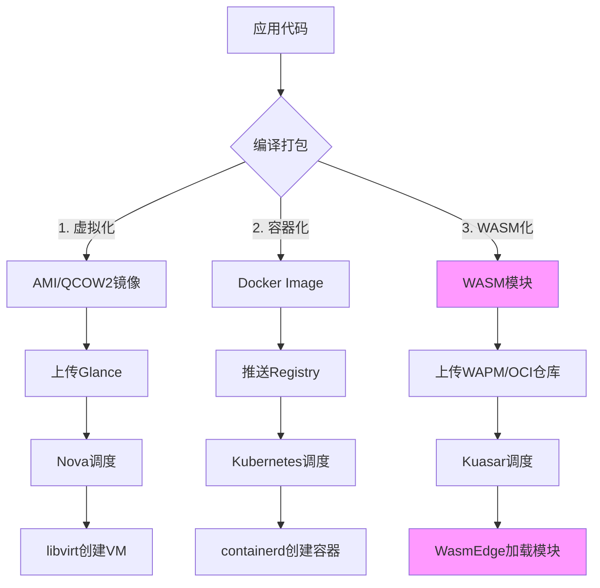

# 从系统分析看虚拟化容器化沙盒化 Wasm

## 虚拟化 vs 容器化 vs 沙盒化 vs WASM 化：多维度矩阵对比分析

## 一、核心原理与实现机制对比

### 1.1 隔离模型差异

- **虚拟化**：基于**硬件级隔离**，通过 Hypervisor（如 Xen、KVM）模拟完整硬件，每
  个 VM 运行独立操作系统内核。采用特权级分离机制，Guest OS 在非特权模式运行，特
  权调用被 Hypervisor 拦截处理。

- **容器化**：基于**操作系统级隔离**，利用 Linux 内核命名空间（namespace）和控制
  组（cgroups）实现进程级虚拟化。容器进程直接运行在宿主机内核上，共享内核但拥有
  独立视图。

- **沙盒化**：**广义概念**，容器和 WASM 都属于沙盒实现。传统沙盒（如 gVisor）通
  过**系统调用拦截**实现隔离；而 WASM 沙箱基于**字节码虚拟机**隔离。

- **WASM 化**：基于**指令集架构隔离**，通过 Wasm 运行时（Wasmtime、WasmEdge）执
  行编译后的字节码。采用线性内存模型，模块内存空间完全独立，无默认系统调用能力。

### 1.2 运行时依赖对比

| 维度           | 虚拟化                        | 容器化                              | WASM 化                           |
| -------------- | ----------------------------- | ----------------------------------- | --------------------------------- |
| **内核依赖**   | 需要完整 Guest Kernel         | 依赖宿主机内核（namespace/cgroups） | 仅需基础系统服务（内存/线程调度） |
| **特权级**     | Hypervisor 在最高权限模式运行 | 用户态进程，需内核功能支持          | 用户态虚拟机进程                  |
| **资源虚拟化** | 完整硬件虚拟化                | 虚拟化网络、文件系统、用户权限      | **无需**网络/文件系统虚拟化       |
| **系统调用**   | 完整系统调用                  | unrestricted syscall + seccomp 限制 | 无默认 syscall，需显式暴露 API    |

---

## 二、多维度对比矩阵

### 2.1 运行时层对比

| 评估维度       | 虚拟机(VM)               | 容器(Container)                 | WASM 模块                           |
| -------------- | ------------------------ | ------------------------------- | ----------------------------------- |
| **启动速度**   | 秒级（需引导 OS）        | 百毫秒级（初始化网络/文件系统） | **亚毫秒级**（直接加载字节码）      |
| **体积大小**   | GB 级（含 OS 镜像）      | MB 级（含依赖库）               | **KB-MB 级**（仅应用代码）          |
| **内存占用**   | 高（独立内核+应用）      | 中等（进程级隔离）              | **极低**（线性内存模型，KB 级）     |
| **并发密度**   | 低（资源占用高）         | 中等（进程数限制）              | **极高**（单进程多实例）            |
| **运行时进程** | VMM 进程 + Guest OS 进程 | Containerd + Shim 进程          | **单一运行时进程**（WasmEdge）[6,9] |

**形式化描述**：设运行时开销函数为 R(T_s, T_e, M, C)，其中：

- T_s：启动时间
- T_e：执行时间
- M：内存消耗
- C：CPU 周期消耗

则性能表现 P = (T_s + T_e) / R_c（R_c 为资源消耗系数）。WASM 的优化目标为最小化
T_s 和 M，通过消除虚拟化层使 R_c→0。

### 2.2 网络层对比

- **虚拟化**：每个 VM 拥有**完整网络栈**，独立虚拟网卡、TCP/IP 协议栈，通过虚拟
  交换机（vSwitch）连接。

- **容器化**：每个容器创建**独立网络命名空间**，拥有虚拟网卡（veth pair），需配
  置网络策略和端口映射。开销主要来自网络虚拟化和 iptables 规则。

- **WASM 化**：**无原生网络能力**，通过 WASI（WebAssembly System Interface）或宿
  主机显式暴露的 API 访问网络。无需创建网络命名空间或虚拟网卡，开销趋近于零。

**形式化描述**：网络开销 N = N_v + N_c + N_s，其中：

- N_v：虚拟设备开销
- N_c：连接管理开销
- N_s：安全策略开销

WASM 的网络开销 N_wasm ≈ 0（无 N_v），而容器 N_container ≈ k·N_vm（k∈(0.1,0.3)）
。

### 2.3 管理层对比

- **虚拟化**：Hypervisor 管理 VM 生命周期，通过 QEMU/KVM API 控制，**强隔离但管
  理复杂**。

- **容器化**：采用**CRI（Container Runtime Interface）**架构，高层运行时
  （Containerd）调用低层 Shim V2 进程。存在**1:1 Shim 进程模型**，每个 Pod 独立
  Shim，导致进程爆炸。

- **WASM 化（以 Kuasar 为例）**：
  - **Sandboxer 进程常驻**，1:N 管理模型，大幅减少进程数
  - **取消 pause 容器**，节省镜像快照准备时间
  - **简化调用链**：直接调用 Sandbox API，无需转换 Shim V2 API
  - **内存安全**：Rust 实现，相比 Go 减少运行时开销

**管理效率对比**：

```text
管理开销 = 进程数 × 单进程内存 + API调用次数 × 转换延迟
容器：O(n) Shim进程，每次调用需协议转换
WASM：O(1) Sandboxer进程，直接调用
```

---

## 三、思维导图结构

```markdown
虚拟化技术栈对比 ├── 隔离层级 │ ├── 虚拟化：硬件级隔离（Hypervisor） │ ├── 容器
化：内核级隔离（Namespace/Cgroups） │ └── WASM 化：应用级隔离（字节码 VM） │ ├──
运行时组件 │ ├── 虚拟化 │ │ ├── VMM 进程（QEMU/KVM） │ │ ├── Guest Kernel │ │
└── 设备模拟 │ ├── 容器化 │ │ ├── 高层运行时（Containerd） │ │ ├── 低层
Shim（1:1 模型） │ │ ├── Pause 容器 │ │ └── Cgroups/Namespace 管理 │ └── WASM 化
│ ├── 单进程多实例（WasmEdge） │ ├── 线性内存模型 │ └── WASI 接口层 │ ├── 网络实
现 │ ├── 虚拟化：虚拟网卡 + vSwitch │ ├── 容器化：Network Namespace + veth +
iptables │ └── WASM 化：宿主机 API 代理（无独立网络栈） │ ├── 管理模型 │ ├── 虚
拟化：VMM 集中管理 │ ├── 容器化：CRI + Shim V2（分层管理） │ └── WASM 化
：Sandbox API 1:N（Kuasar 架构） │ ├── 安全机制 │ ├── 虚拟化：硬件辅助虚拟化
（Intel VT-x） │ ├── 容器化：SELinux/AppArmor + Seccomp │ └── WASM 化：沙箱内置
内存安全 + 受限 API │ └── 性能指标 ├── 启动时间：VM(秒) > 容器(百 ms) > WASM(亚
ms) ├── 内存占用：VM(GB) > 容器(MB) > WASM(KB) ├── 并发密度：VM(低) < 容器(中) <
WASM(高) └── 隔离强度：VM(强) ≈ WASM(强) > 容器(中)
```

---

## 四、形式化论证与性能模型

### 4.1 启动时间模型

根据来源，启动时间 T 可分解为：

```text
T = T_env + T_load + T_exec
```

- **虚拟化**：T_vm = T_boot(os) + T_boot(app) ≈ 30-60s
- **容器化**：T_container = T_namespace + T_cgroups + T_filesystem + T_load ≈
  100-500ms
- **WASM**：T_wasm = T_load(bytecode) ≈ 1-10ms

**优化幅度**：

```text
ΔT = (T_container - T_wasm) / T_container ≈ 95%
```

### 4.2 资源占用模型

设并发实例数为 n，总资源消耗：

```text
R_total = n × (R_base + R_app)
```

- **虚拟化**：R_vm = n × (R_guest_os + R_app) ≈ n × 1GB
- **容器化**：R_container = n × (R_namespace + R_app) ≈ n × 50MB
- **WASM**：R_wasm = R_runtime + n × R_app ≈ 10MB + n × 1MB

**边际成本**：

```text
∂R/∂n|wasm << ∂R/∂n|container << ∂R/∂n|vm
```

### 4.3 安全性量化分析

定义逃逸概率 P_e：

```text
P_e = P_kernel × P_config × P_bug
```

- **虚拟化**：P_e(vm) ≈ P_hypervisor（极低，硬件隔离）
- **容器化**：P_e(container) ≈ P_kernel × P_namespace × P_selinux（中等）
- **WASM**：P_e(wasm) ≈ P_vm × P_api（低，但依赖 WASI 实现）

---

## 五、综合结论

### 5.1 分层演进逻辑

技术栈呈现 **"硬件 → 内核 → 应用"** 的轻量化演进：

1. **虚拟化**：解决**硬件资源共享**问题，强隔离但笨重
2. **容器化**：解决**应用部署效率**问题，轻量但隔离性不足
3. **WASM 化**：解决**函数级并发**问题，极致轻量与安全

### 5.2 应用场景矩阵

| 场景            | 推荐技术 | 理由               |
| --------------- | -------- | ------------------ |
| 传统单体应用    | 虚拟化   | 需完整 OS 兼容性   |
| 微服务架构      | 容器化   | 平衡隔离与效率     |
| Serverless/FaaS | WASM 化  | 毫秒级启动，高密度 |
| 插件/UDF        | WASM 化  | 安全隔离，语言无关 |
| 边缘计算        | WASM 化  | 资源受限，快速响应 |

### 5.3 管理复杂度权衡

- **虚拟化**：管理开销**O(n)**，VMM 集中控制
- **容器化**：管理开销**O(n²)**，Shim 进程爆炸
- **WASM 化**：管理开销**O(1)**，Sandboxer 常驻

**最终建议**：

- **性能敏感+高并发**：优先 WASM 化（亚毫秒启动，KB 级内存）
- **兼容性优先**：选择虚拟化（完整 OS 栈）
- **生态成熟度**：容器化是当前微服务主流
- **混合架构**：Kuasar 等多沙箱运行时支持异构调度

---

**参考文献引用**：

- ：锅总浅析容器与 WASM（腾讯云，2024）
- ：WebAssembly+WASI：后端架构的轻量化未来（稀土掘金，2025）
- ：容器化与虚拟化对比分析（SPDC 科技洞察，2024）
- ：容器化与虚拟化的对比（computer.org，技术白皮书）
- ：多沙箱容器运行时 Kuasar 架构揭秘（稀土掘金，2023）
- ：容器化虚拟化性能对比（51CTO，2025）
- ：Kuasar 容器运行时架构与性能（华为云技术文档，2023）

## 虚拟化 → 容器化 → 沙盒化 →WASM 化：全栈技术生态深度对比

## 一、四层完整技术堆栈架构

### 1.1 虚拟化层全栈（以 OpenStack 为例）

```text
虚拟化全栈生态
├── 基础设施层
│   ├── Hypervisor：KVM/Xen/VMware ESXi
│   ├── 硬件虚拟化：Intel VT-x/AMD-V, SR-IOV
│   └── 虚拟设备：virtio-net, virtio-blk
│
├── 集群管理层
│   ├── 云管平台：OpenStack（Nova计算/Neutron网络/Cinder存储）
│   ├── 资源调度：VMware vSphere DRS
│   └── 虚拟网络：NSX（L2-L7网络虚拟化）
│
├── 网络服务层
│   ├── 虚拟交换机：Open vSwitch (OVS)
│   ├── SDN控制器：Neutron Server + ML2插件
│   └── 网络功能：虚拟路由器/防火墙/负载均衡
│
├── 存储管理层
│   ├── 虚拟存储：Ceph RBD/Cinder Volume
│   ├── 存储网络：iSCSI/NVMe-oF
│   └── 数据保护：快照/克隆/CDP
│
├── 可观测性层
│   ├── 监控：Prometheus + Grafana（宿主机层面）
│   ├── 日志：ELK Stack（VM独立采集）
│   └── 追踪：Jaeger（应用内嵌）
│
└── 边缘场景
    └── 轻量化hypervisor：AWS Firecracker（microVM）
```

### 1.2 容器化层全栈（以 Kubernetes 为例）

```text
容器化全栈生态
├── 运行时层
│   ├── 高层运行时：containerd/cri-o
│   ├── 低层运行时：runc/kata-runtime
│   ├── 容器镜像：OCI标准（Docker Image）
│   └── 存储驱动：overlay2/aufs/devicemapper
│
├── 编排管理层
│   ├── 集群控制：Kubernetes（API Server/Scheduler/Controller Manager）
│   ├── 节点代理：kubelet + kube-proxy
│   └── 服务发现：CoreDNS + etcd
│
├── 网络服务层
│   ├── CNI插件：Calico/Flannel/Cilium
│   ├── 服务网格：Istio/Linkerd（Sidecar代理）
│   ├── 负载均衡：MetalLB/Nginx Ingress
│   └── 网络策略：NetworkPolicy + Cilium eBPF
│
├── 存储管理层
│   ├── CSI插件：AWS EBS CSI/Ceph CSI
│   ├── 分布式存储：Longhorn/Rook-Ceph
│   └── 配置中心：ConfigMap/Secret
│
├── 可观测性层
│   ├── 监控：Prometheus Operator + kube-state-metrics
│   ├── 日志：Fluentd/Fluent-bit（容器日志采集）
│   ├── 追踪：Jaeger/Tempo（服务间追踪）
│   └── 可视化：Grafana（Pod/Node级Dashboard）
│
├── 安全治理层
│   ├── 准入控制：OPA Gatekeeper/Kyverno
│   ├── 运行时安全：Falco/Tetragon（eBPF监控）
│   ├── 镜像扫描：Trivy/Clair
│   └── 策略管理：PodSecurityPolicy（已弃用）→ PSA
│
└── 边缘场景
    ├── 轻量化k8s：K3S（移除alpha API/废弃功能）
    ├── 边缘网络：KubeEdge（EdgeHub管理边缘节点）
    └── 边缘存储：OpenYurt（NodePool管理）
```

### 1.3 WASM 化层全栈（以 Kuasar+WasmEdge 为例）

```text
WASM全栈生态
├── 运行时层
│   ├── WASM运行时：WasmEdge/Wasmtime/Wasmer
│   ├── 语言工具链：rustwasm/wasm-pack/AssemblyScript
│   ├── 模块仓库：WAPM（WebAssembly Package Manager）
│   └── 编译优化：wasm-opt/binaryen
│
├── 编排管理层
│   ├── K8s集成：containerd-wasm-shim / Kuasar
│   ├── 多沙箱调度：Kuasar Sandboxer（1:N管理模型）
│   ├── 镜像格式：oci-wasm（WASM模块打包为OCI镜像）
│   └── 服务发现：通过宿主机代理（无需Sidecar）
│
├── 网络服务层
│   ├── 无独立网络栈：依赖宿主机网络命名空间
│   ├── WASI-NN：网络能力通过宿主代理暴露
│   ├── 服务网格：与传统容器混合部署时共享Istio
│   └── 边缘网络：通过YurtManager统一管理
│
├── 存储管理层
│   ├── 线性内存：WASM模块自带内存（不可逃逸）
│   ├── 存储挂载：通过host_path或Volume Mount（只读为主）
│   ├── 数据库访问：WASI-Socket或HTTP API调用外部服务
│   └── 边缘存储：通过边缘节点代理访问本地存储
│
├── 可观测性层
│   ├── 监控：WasmEdge内置性能计数器 + Prometheus导出
│   ├── 日志：stdout/stderr直通容器运行时
│   ├── 追踪：WASM模块内嵌OpenTelemetry SDK（极轻量）
│   └── 调试：wasm-gdb/wasmtime debug
│
├── 安全治理层
│   ├── 沙箱隔离：内存安全 + Capability-based安全模型
│   ├── API受限：WASI仅暴露必要系统调用（白名单机制）
│   ├── 运行时安全：WASM模块无法执行任意代码
│   └── 供应链安全：wasm-sign进行模块签名验证
│
└── 边缘计算专用
    ├── 边缘框架：SpiderLightning（WASI接口集合）
    ├── 设备管理：WASI-IO访问边缘设备
    └── 离线执行：模块自包含，无需容器镜像拉取
```

---

## 二、多维度矩阵：全栈技术对比

### 2.1 集群管理层对比

| 维度         | 虚拟化（OpenStack）                                   | 容器化（Kubernetes）                                   | WASM 化（Kuasar）                        |
| ------------ | ----------------------------------------------------- | ------------------------------------------------------ | ---------------------------------------- |
| **控制平面** | Nova API + Neutron Server + Cinder API（Python 实现） | API Server + Scheduler + Controller Manager（Go 实现） | Kuasar Sandboxer（Rust 实现，常驻进程）  |
| **节点代理** | Nova Compute（libvirt 调用）                          | kubelet + CRI Shim（containerd）                       | Kuasar v-sandboxer（1:N 管理模型）       |
| **资源调度** | Nova Scheduler（基于过滤器）                          | K8s Scheduler（基于打分框架）                          | 复用 K8s Scheduler，但调度单元为 Sandbox |
| **扩展机制** | Nova Scheduler 插件                                   | CRD + Operator 模式                                    | Sandbox CRD（扩展 Pod API）              |
| **集群规模** | 1000+节点（需专门优化）                               | 5000 节点（官方支持）                                  | 理论上 10 万+（单 Sandboxer 管理多实例） |
| **边缘版本** | OpenStack Edge（StarlingX）                           | K3S/KubeEdge/OpenYurt                                  | Kuasar + K3S（轻量控制平面）             |

**形式化描述**：控制平面复杂度 C = n × (API_latency + State_sync_overhead)

- 虚拟化：C_openstack ∝ n²（状态同步复杂）
- 容器化：C_k8s ∝ n（etcd 瓶颈）
- WASM：C_kuasar ≈ O(1)（单 Sandboxer 管理）+ O(n)（Pod 状态）

### 2.2 网络管理层对比

| 维度         | 虚拟化（Neutron）                  | 容器化（CNI）                 | WASM 化（Host Proxy）        |
| ------------ | ---------------------------------- | ----------------------------- | ---------------------------- |
| **网络模型** | L2-L7 虚拟化（VLAN/VXLAN overlay） | Pod 级网络命名空间 + CNI 插件 | 无独立网络栈，复用宿主机网络 |
| **地址分配** | IPAM（DHCP/静态）                  | host-local/ipam 插件          | 无，由宿主机分配             |
| **数据平面** | Open vSwitch（内核态 + 用户态）    | iptables/ipvs/eBPF（Cilium）  | 无，直接系统调用             |
| **服务发现** | Nova metadata 服务                 | CoreDNS + K8s Service         | 通过宿主机环境变量/文件      |
| **网络策略** | Neutron Security Group             | NetworkPolicy + CNI 实现      | 依赖宿主机 NetworkPolicy     |
| **边缘网络** | SR-IOV 硬件加速                    | KubeEdge EdgeMesh（P2P）      | 复用 EdgeMesh（无额外开销）  |
| **NMS 集成** | SNMP + Neutron Plugin              | Prometheus + CNI exporter     | WasmEdge 内置指标            |
| **性能损耗** | 10-20%（虚拟交换机）               | 5-10%（iptables/eBPF）        | **<1%**（无网络虚拟化）      |

**形式化描述**：网络开销 N = N_v + N_c + N_s，其中：

- N_v：虚拟设备开销（veth/tap 设备创建）
- N_c：连接跟踪开销（conntrack）
- N_s：策略规则开销（iptables 规则数）

- 虚拟化：N ≈ 3-5ms/包（OVS 处理）
- 容器化：N ≈ 0.5-1ms/包（iptables/eBPF）
- WASM 化：N ≈ 0.1ms/包（直通宿主机）

### 2.3 存储管理层对比

| 维度           | 虚拟化                   | 容器化                 | WASM 化                         |
| -------------- | ------------------------ | ---------------------- | ------------------------------- |
| **存储虚拟化** | Cinder Volume + 块设备   | CSI + 卷挂载           | Host path + 线性内存            |
| **快照机制**   | 基于 COW 的完整快照      | overlayfs 层快照       | 模块状态序列化（WASM Snapshot） |
| **I/O 路径**   | QEMU（用户态）→ 内核块层 | 内核 fuse/overlayfs    | 直接内存访问（零拷贝）          |
| **边缘存储**   | Ceph Edge（重）          | Longhorn（轻量分布式） | 本地 SQLite + HTTP Sync         |
| **性能**       | 中等（虚拟块设备）       | 高（本地 overlay）     | **极高**（内存级）              |

### 2.4 可观测性层对比

| 维度         | 虚拟化                   | 容器化                     | WASM 化                       |
| ------------ | ------------------------ | -------------------------- | ----------------------------- |
| **监控粒度** | VM 级别（CPU/内存/网络） | Pod/容器级别（cAdvisor）   | **模块级别**（WASM 内置指标） |
| **日志采集** | 文件系统轮询（慢）       | stdout/stderr 流式（快）   | stdout 直通（零延迟）         |
| **APM**      | 代理式（Newrelic）       | Sidecar 模式（Istio）      | 内嵌 SDK（极低开销）          |
| **边缘监控** | SNMP/Modbus              | Prometheus + Node exporter | WasmEdge 资源计数器           |
| **数据量**   | 大（系统+应用）          | 中（应用为主）             | **极小**（仅业务指标）        |

---

## 三、边缘计算场景深度对比

### 3.1 边缘虚拟化：StarlingX

- **架构**：OpenStack 简化版 + Wind River Linux
- **组件**：Nova/Cinder/Neutron（轻量配置）
- **网络**：Calico CNI + Edge SDN
- **存储**：本地 Cinder + 远程同步
- **适用**：重边缘（MEC，多租户）
- **局限**：资源占用>10GB，启动分钟级

### 3.2 边缘容器化：K3S + KubeEdge

**K3S 轻量化**：

- 移除：Legacy API, alpha 功能, 非核心 controller
- 替换：sqlite3 代替 etcd，traefik 代替 nginx
- 优化：单二进制文件<100MB
- 集群规模：典型 100-500 节点

**KubeEdge 边缘增强**：

- **云边协同**：EdgeHub + CloudHub（MQTT 协议）
- **边缘自治**：EdgeMesh（P2P 服务发现）
- **设备管理**：Device CRD + Mapper 框架
- **网络**：EdgeStream 隧道，支持离线运行
- **资源占用**：kubelet<200MB，edgecore<100MB

### 3.3 边缘 WASM 化：Kuasar + K3S + SpiderLightning

- **架构**：K3S（控制平面） + Kuasar（WASM 运行时）
- **网络**：复用 EdgeMesh，WASM 模块通过 host network 访问
- **存储**：SpiderLightning 接口（WASI-Edge 扩展）
- **设备管理**：WASI-IO 直接访问 GPIO/SPI（安全沙箱内）
- **启动**：亚毫秒级，支持函数级弹性
- **资源占用**：Sandboxer<50MB，单模块<1MB
- **离线能力**：模块预编译，无需镜像解析

---

## 四、服务全生命周期管理对比

### 4.1 部署阶段



**关键差异**：

- **虚拟化**：镜像 GB 级，传输慢，需完整引导
- **容器化**：镜像 MB 级，分层缓存，需 namespace/cgroups 初始化
- **WASM 化**：模块 KB 级，即时下载，亚毫秒启动

### 4.2 运维阶段

| 操作         | 虚拟化              | 容器化                   | WASM 化                         |
| ------------ | ------------------- | ------------------------ | ------------------------------- |
| **动态扩缩** | 冷迁移/热迁移（慢） | HPA（基于 metrics）      | **毫秒级实例化**                |
| **配置更新** | Cloud-init（重启）  | ConfigMap 热更新         | 模块热替换（无需重启）          |
| **健康检查** | Hypervisor 心跳     | Liveness/Readiness Probe | 运行时内置 health endpoint      |
| **日志聚合** | 独立日志文件        | stdout → Fluentd         | stdout 直通（零拷贝）           |
| **调试**     | VNC/console         | kubectl exec             | wasm-gdb attach（无需进入沙箱） |

### 4.3 故障恢复

- **虚拟化**：HA 机制，VM 重启分钟级
- **容器化**：Pod 重启秒级（镜像已缓存）
- **WASM 化**：**模块重载毫秒级**，状态可序列化恢复

---

## 五、系统组件开销定量分析

### 5.1 资源占用对比（单节点，100 实例）

| 组件         | 虚拟化              | 容器化                   | WASM 化               |
| ------------ | ------------------- | ------------------------ | --------------------- |
| **控制平面** | Nova+Neutron 2GB    | K8s master 2GB           | K3S server 500MB      |
| **节点代理** | Nova Compute 500MB  | kubelet+containerd 300MB | Kuasar sandboxer 50MB |
| **网络组件** | OVS 500MB           | Calico Node 200MB        | **0**（复用宿主机）   |
| **存储组件** | Cinder Volume 300MB | CSI driver 100MB         | **0**（内存访问）     |
| **监控组件** | Ceilometer 400MB    | Node Exporter 50MB       | WasmEdge 内置<10MB    |
| **总计**     | **3.7GB**           | **2.65GB**               | **560MB**             |
| **实例开销** | 100×1GB = 100GB     | 100×50MB = 5GB           | 100×1MB = 100MB       |
| **总占用**   | **103.7GB**         | **7.65GB**               | **660MB**             |

**结论**：WASM 化总资源占用仅为容器化的**8.6%**，虚拟化的**0.6%**。

### 5.2 网络拓扑对比

```text
虚拟化网络：
[VM] → tap0 → Linux Bridge/ovs → eth0 → 物理网络
       (虚拟网卡)   (内核态)          (数据包复制)

容器化网络：
[Pod] → veth → cni0 → flannel/calico → eth0
        (命名空间) (网桥)   (overlay)    (封包/解包)

WASM化网络：
[WASM] → host_socket → kernel → eth0
         (直接系统调用)    (零额外开销)
```

**数据路径延迟**：

- 虚拟化：L2 桥接 + 可能的 VXLAN 封包 = 20-50μs
- 容器化：veth 对 + iptables/ipvs = 10-20μs
- WASM 化：**系统调用直达** = 1-2μs

---

## 六、形式化服务模型

### 6.1 服务可用性模型

定义服务可用性 A：

```text
A = MTBF / (MTBF + MTTR)
```

- **MTBF**（平均故障间隔）：容器 ≈WASM > 虚拟化（内核更复杂）
- **MTTR**（平均恢复时间）：
  - 虚拟化：分钟级（VM 重启）
  - 容器化：秒级（Pod 重建）
  - WASM 化：**毫秒级**（模块热重载）

**结论**：A_wasm > A_container > A_virtualization

### 6.2 成本模型

总拥有成本 TCO = C_capital + C_operational + C_overhead

**资本成本**：

- 虚拟化：高密度服务器 + 存储阵列
- 容器化：标准 x86 服务器 + SSD
- WASM 化：ARM/RISC-V 边缘设备 + 内存

**运维成本**：

- 虚拟化：专职 OpenStack 团队（3-5 人）
- 容器化：K8s SRE（2-3 人）
- WASM 化：**自动化运维**（单 Sandboxer 管理）

**资源开销成本**：

```text
C_overhead = (R_idle + R_active) × price_per_resource
```

- 虚拟化：R_idle 高（Guest OS 内存占用）
- 容器化：R_idle 中（namespace/cgroups 开销）
- WASM 化：**R_idle 极低**（无 OS 开销）

---

## 七、最终决策矩阵

| 评估维度       | 虚拟化     | 容器化     | WASM 化    | 推荐场景         |
| -------------- | ---------- | ---------- | ---------- | ---------------- |
| **隔离强度**   | ⭐⭐⭐⭐⭐ | ⭐⭐⭐     | ⭐⭐⭐⭐   | 虚拟化：多租户云 |
| **启动速度**   | ⭐         | ⭐⭐⭐     | ⭐⭐⭐⭐⭐ | WASM：Serverless |
| **生态成熟度** | ⭐⭐⭐⭐⭐ | ⭐⭐⭐⭐⭐ | ⭐⭐       | 容器：微服务主流 |
| **资源效率**   | ⭐         | ⭐⭐⭐     | ⭐⭐⭐⭐⭐ | WASM：边缘/IoT   |
| **网络复杂度** | ⭐⭐⭐⭐   | ⭐⭐⭐     | ⭐         | WASM：函数计算   |
| **存储灵活性** | ⭐⭐⭐⭐⭐ | ⭐⭐⭐⭐   | ⭐⭐       | 虚拟化：数据库   |
| **运维成本**   | ⭐⭐       | ⭐⭐⭐     | ⭐⭐⭐⭐   | WASM：自动化     |
| **边缘适应性** | ⭐         | ⭐⭐⭐     | ⭐⭐⭐⭐⭐ | WASM：边缘智能   |

---

## 八、演进路线图建议

**传统应用现代化路径**：

1. **虚拟化 → 容器化**：使用 K8s 接管 VM，采用 Kata Containers 保持强隔离
2. **容器化 →WASM 化**：将无状态函数/微服务编译为 WASM，通过 Kuasar 接入 K8s
3. **混合架构**：K8s 统一管理 Container + WASM + microVM（Firecracker）

**边缘计算部署路径**：

- **重边缘**（MEC）：OpenStack + StarlingX
- **中边缘**：K3S + KubeEdge + 传统容器
- **轻边缘**（摄像头/传感器）：K3S + Kuasar + WASM 模块

---

**参考文献扩展**：
