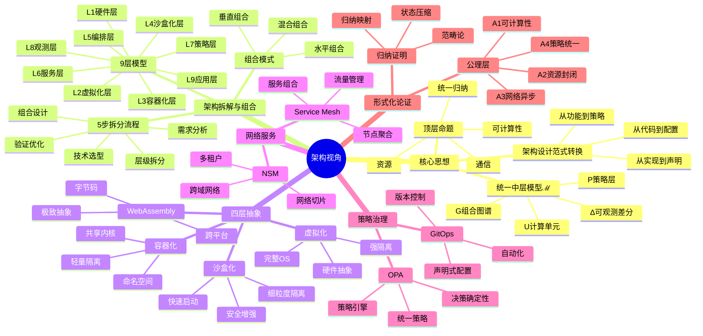
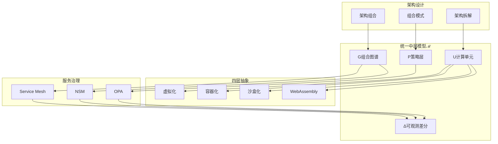

# 从软件架构的视角看待虚拟化容器化沙盒化

> **本文档已重构：分类压缩、合并重复、补充完善**
>
> **文档版本**：v2.0 **最后更新**：2025-11-07 **维护者**：项目团队 **来源**：基
> 于 `architecture_view.md` 重构

---

## 📑 目录

- [从软件架构的视角看待虚拟化容器化沙盒化](#从软件架构的视角看待虚拟化容器化沙盒化)
  - [📑 目录](#-目录)
  - [1. 核心思想](#1-核心思想)
    - [1.1 顶层命题](#11-顶层命题)
    - [1.2 统一中层模型 ℳ](#12-统一中层模型-ℳ)
    - [1.3 架构设计范式转换](#13-架构设计范式转换)
  - [2. 架构拆解与组合](#2-架构拆解与组合)
    - [2.1 5 步拆分与组合流程](#21-5-步拆分与组合流程)
    - [2.2 拆分层级（9 层模型）](#22-拆分层级9-层模型)
    - [2.3 组合模式与技术实现](#23-组合模式与技术实现)
    - [2.4 思维模型](#24-思维模型)
  - [3. 四层抽象：虚拟化 → 容器化 → 沙盒化 → WebAssembly](#3-四层抽象虚拟化--容器化--沙盒化--webassembly)
    - [3.1 层级模型（从硬件到业务）](#31-层级模型从硬件到业务)
    - [3.2 四层抽象的"切"作用](#32-四层抽象的切作用)
    - [3.3 统一对比矩阵](#33-统一对比矩阵)
    - [3.4 形式化映射（归纳法）](#34-形式化映射归纳法)
  - [4. 网络服务：Service Mesh 与 NSM](#4-网络服务service-mesh-与-nsm)
    - [4.1 Service Mesh：节点聚合与服务组合](#41-service-mesh节点聚合与服务组合)
      - [4.1.1 节点聚合：从"物理地址"到"身份-驱动拓扑"](#411-节点聚合从物理地址到身份-驱动拓扑)
      - [4.1.2 服务组合：把"跨服务流"变成"可编排的本地函数"](#412-服务组合把跨服务流变成可编排的本地函数)
      - [4.1.3 架构设计范式转换](#413-架构设计范式转换)
    - [4.2 Network Service Mesh (NSM)：跨域网络聚合](#42-network-service-mesh-nsm跨域网络聚合)
      - [4.2.1 关键概念](#421-关键概念)
      - [4.2.2 架构层次（C4 视角）](#422-架构层次c4-视角)
      - [4.2.3 组合模式](#423-组合模式)
      - [4.2.4 典型用例](#424-典型用例)
  - [5. 策略治理：OPA](#5-策略治理opa)
    - [5.1 OPA 在 ℳ 模型中的定位](#51-opa-在-ℳ-模型中的定位)
    - [5.2 公理层（A5-A8）](#52-公理层a5-a8)
    - [5.3 OPA 体系结构](#53-opa-体系结构)
    - [5.4 OPA 在层次模型中的定位](#54-opa-在层次模型中的定位)
    - [5.5 OPA 与 Service Mesh / NSM 的组合](#55-opa-与-service-mesh--nsm-的组合)
    - [5.6 OPA 在 CI/CD 与 GitOps 里的角色](#56-opa-在-cicd-与-gitops-里的角色)
    - [5.7 关键引理 L3（决策确定性）](#57-关键引理-l3决策确定性)
  - [6. 形式化论证](#6-形式化论证)
    - [6.1 公理层（A1-A4）](#61-公理层a1-a4)
    - [6.2 归纳证明（完整链）](#62-归纳证明完整链)
    - [6.3 状态空间压缩](#63-状态空间压缩)
    - [6.4 范畴论视角](#64-范畴论视角)
  - [7. 动态运维](#7-动态运维)
    - [7.1 动态运维维度](#71-动态运维维度)
    - [7.2 差分进化](#72-差分进化)
    - [7.3 统一思维导图](#73-统一思维导图)
  - [8. 参考资源](#8-参考资源)
    - [8.1 架构方法论](#81-架构方法论)
    - [8.2 技术标准与工具](#82-技术标准与工具)
    - [8.3 在线资源](#83-在线资源)
  - [9. 结语](#9-结语)
    - [9.1 一句话归纳](#91-一句话归纳)
    - [9.2 核心价值](#92-核心价值)
    - [9.3 实践建议](#93-实践建议)
  - [10. 相关文档](#10-相关文档)
    - [10.1 理论论证文档](#101-理论论证文档)
    - [10.2 架构视角文档](#102-架构视角文档)
    - [10.3 实现细节文档](#103-实现细节文档)
    - [10.4 系统视角文档](#104-系统视角文档)
    - [10.5 技术文档](#105-技术文档)
    - [10.6 认知模型](#106-认知模型)
    - [10.7 多视角文档](#107-多视角文档)
  - [🧠 认知增强：思维导图、知识矩阵与专家观点](#-认知增强思维导图知识矩阵与专家观点)
    - [11.1 架构视角完整思维导图](#111-架构视角完整思维导图)
    - [11.2 核心概念知识图谱](#112-核心概念知识图谱)
    - [11.3 多维矩阵对比](#113-多维矩阵对比)
      - [11.3.1 四层抽象对比矩阵](#1131-四层抽象对比矩阵)
      - [11.3.2 架构设计范式对比矩阵](#1132-架构设计范式对比矩阵)
      - [11.3.3 服务治理技术对比矩阵](#1133-服务治理技术对比矩阵)
    - [11.4 形象化解释论证](#114-形象化解释论证)
      - [11.4.1 统一中层模型 ℳ = 云原生的"中间语言"](#1141-统一中层模型--云原生的中间语言)
      - [11.4.2 架构拆解 = 系统的"解剖"](#1142-架构拆解--系统的解剖)
      - [11.4.3 四层抽象 = 技术的"四重奏"](#1143-四层抽象--技术的四重奏)
      - [11.4.4 Service Mesh = 服务的"交通网络"](#1144-service-mesh--服务的交通网络)
      - [11.4.5 OPA = 策略的"法官"](#1145-opa--策略的法官)
    - [11.5 专家观点与论证](#115-专家观点与论证)
      - [11.5.1 软件架构专家的观点](#1151-软件架构专家的观点)
      - [11.5.2 云原生架构专家的观点](#1152-云原生架构专家的观点)
      - [11.5.3 分布式系统专家的观点](#1153-分布式系统专家的观点)
    - [11.6 认知学习路径矩阵](#116-认知学习路径矩阵)
    - [11.7 专家推荐阅读路径](#117-专家推荐阅读路径)

---

## 1. 核心思想

### 1.1 顶层命题

> **虚拟化-容器化-沙盒化**不是三种技术，而是一次**对"可计算性+资源+通信"的完整归
> 纳**：把**硅片上的冯·诺依曼状态机**、**操作系统命名空间**、**分布式网络协
> 议**统一**压缩成一张可版本化、可单元测试、可动态差分的 YAML 图谱**——我们称之
> 为**"Cloud 的中间语言"ℳ**，自此**架构师只须在领域层写策略**，而**所有非功能性
> 已被证明等价于一段可验证的代码**。
>
> 📋 **概念定义参考**：虚拟化、容器化、沙盒化的严格定义和技术层级分析请参考
> [严格定义文档](../docs/COGNITIVE/05-decision-analysis/decision-models/06-technical-concepts/12-virtualization-paravirtualization-containerization-sandboxing-strict-definition.md)。

### 1.2 统一中层模型 ℳ

**定义**：ℳ ≜ ⟨U, G, P, Δ⟩

- **U**：计算单元（VM / Container / Sandbox / Wasm）
- **G**：组合图谱（Service + 流量边）
- **P**：策略层 = {elastic, security, observability} 策略 CRD
- **Δ**：ℳ(t) → ℳ(t+δt) 为**可观测差分**（Git commit ID）

**归纳闭包**：

1. **可计算性**：U 仍满足 A1（图灵完备）
2. **资源封闭**：U 满足 A2（namespace+capability）
3. **网络异步**：E 满足 A3（异步 xDS）
4. **分层压缩**：|ℳ| ≈ 10⁶ 状态点 ≪ |Σ₀| ≈ 2^10^10

### 1.3 架构设计范式转换

| 传统工件   | 中层替换       | 颗粒度    | 版本化    | 可验证             |
| ---------- | -------------- | --------- | --------- | ------------------ |
| 机柜图     | Pod 拓扑       | 进程级    | YAML      | kubeval            |
| 防火墙工单 | NetworkPolicy  | L4 规则   | Git diff  | Cilium policy test |
| 网关配置   | VirtualService | L7 路由   | Helm      | flagger canary     |
| 安全基线   | OPA Constraint | 能力闭包  | Rego      | conftest           |
| 性能调优   | VPA/HPA CRD    | MilliCore | Kustomize | K6+Prometheus      |

> 架构师的工作从"调机"**归纳成"写策略"**；所有非功能性**被证明等价于一段可单元测
> 试的 DSL**。

---

## 2. 架构拆解与组合

### 2.1 5 步拆分与组合流程

| 步骤                 | 目标                             | 关键活动                                                                                                                                                                                                       | 工具 / 模板                                                               |
| -------------------- | -------------------------------- | -------------------------------------------------------------------------------------------------------------------------------------------------------------------------------------------------------------- | ------------------------------------------------------------------------- |
| **1. 需求‑关切抽取** | 找到所有业务 & 非业务关切        | 访谈、用户故事、服务契约、技术约束、性能指标、合规需求                                                                                                                                                         | 问题卡、业务地图、技术债务清单                                            |
| **2. 结构化拆分**    | 把系统拆成可维护、可替换的"模块" | 按 **关注点分离**（Presentation, Application, Domain, Integration, Data, Infra, Security, Observability, Deployment）拆分                                                                                      | C4/ArchiMate 模型、DDD 边界图、服务矩阵                                   |
| **3. 接口与契约**    | 明确定义子结构的 **输入/输出**   | API 文档、gRPC/Protobuf、事件 schema、数据模型、配置/凭据契约                                                                                                                                                  | OpenAPI, GraphQL SDL, Avro/Protobuf, Terraform modules                    |
| **4. 组合模式**      | 让拆分出的组件互联、互操作       | ① **依赖注入 / Composition Root** <br>② **适配器 / 桥接**（跨技术边界）<br>③ **Facade / Gateway**（聚合多服务）<br>④ **Pipeline / Orchestrator**（业务流程）<br>⑤ **Service Mesh / API Gateway**（通信、流控） | Spring DI / Guice, OSGi / CDI, Netflix Eureka, Envoy, Istio, Apache Camel |
| **5. 自动化 & 验证** | 确保组合后可运行、可监控、可测试 | CI/CD（Jenkins, GitHub Actions）, K8s + Helm, Prometheus/Tempo, OpenTelemetry, Chaos Monkey, ADR 生成                                                                                                          | GitHub repo + GitHub Actions, ArgoCD, Kustomize, Argo Rollouts            |

### 2.2 拆分层级（9 层模型）

| 层/关注点         | 责任                 | 典型组件                                | 组合方式                                          |
| ----------------- | -------------------- | --------------------------------------- | ------------------------------------------------- |
| **1. 表现层**     | 交互、展示、前端     | SPA、移动 App、WebAPI                   | **MVC / MVVM**；**React/Angular/Vue**             |
| **2. 应用层**     | 业务流程、协调       | 业务服务、业务网关、工作流              | **CQRS**、**Saga**、**Temporal**                  |
| **3. 领域层**     | 业务核心             | 领域模型、聚合根、领域服务              | **DDD**、**Onion Architecture**                   |
| **4. 集成层**     | 与外部系统交互       | 适配器、消息总线、API 网关              | **Adapter/Bridge**、**API Gateway**               |
| **5. 数据层**     | 数据存储、事务       | RDBMS、NoSQL、搜索                      | **Event Sourcing**、**CQRS**                      |
| **6. 基础设施层** | 主机、网络、存储     | VM、K8s、ECS、S3                        | **Infrastructure as Code**（Terraform/Ansible）   |
| **7. 安全层**     | 访问控制、身份鉴权   | OAuth2、OpenID Connect、Kubernetes RBAC | **Policy‑based Access Control**（OPA/Gatekeeper） |
| **8. 可观测层**   | 监控、日志、追踪     | Prometheus、Grafana、Jaeger、ELK        | **OpenTelemetry**                                 |
| **9. 运营层**     | 部署、滚动升级、灾备 | CI/CD、Helm、ArgoCD、Kubernetes Rollout | **Blue/Green**、**Canary**、**Chaos Engineering** |

### 2.3 组合模式与技术实现

| 组合模式                                            | 作用           | 典型技术/工具                                    | 典型案例                       |
| --------------------------------------------------- | -------------- | ------------------------------------------------ | ------------------------------ |
| **Composition Root**                                | 全局依赖注入   | Spring DI, Guice, Dagger, CDI                    | 业务层注入领域服务             |
| **Adapter / Bridge**                                | 跨技术边界     | gRPC + REST, ODBC ↔ JDBC                         | 通过 gRPC 转为 REST 供前端使用 |
| **Facade / Gateway**                                | 聚合多服务     | Netflix Zuul, Kong, Ocelot, Spring Cloud Gateway | 单一入口聚合内部 API           |
| **Composite**                                       | 递归聚合       | Composite pattern, Tree‑structured UI            | 目录树、权限树                 |
| **Pipeline / Orchestrator**                         | 业务流程       | Camunda, Temporal, Argo Workflows                | 长事务、订单处理               |
| **Service Mesh**                                    | 细粒度流量控制 | Istio, Linkerd, Consul                           | 侧车代理、熔断、流量镜像       |
| **Event Bus**                                       | 解耦、异步     | Kafka, NATS, RabbitMQ                            | 订单已完成 → 发送邮件          |
| **Command Query Responsibility Segregation (CQRS)** | 读写分离       | Axon, Lagom                                      | 大量查询读写分离               |
| **Domain Event**                                    | 领域事件       | Axon, EventStore                                 | 订单创建 → 业务服务触发        |
| **Feature Flags**                                   | 代码切换       | LaunchDarkly, Unleash                            | 实验性功能逐步推送             |
| **Infrastructure as Code**                          | 自动化部署     | Terraform, Helm, Pulumi                          | 同步基础设施与代码             |
| **Observability as a Service**                      | 统一监控       | OpenTelemetry Collector, Grafana Loki            | 日志/指标/追踪一体化           |

### 2.4 思维模型

1. **层次化**：外层（表现） → 中层（业务） → 内层（数据），采用 **层级
   （Layered）** 或 **洋葱（Onion）** 模型确保依赖自顶向下流动。

2. **领域边界**：用 **DDD** 的 **Bounded Context** 把系统拆成 **独立域**，每个域
   对应一个 **微服务** 或 **模块**，通过 **事件** 与其他域交互。

3. **接口契约**：把**"行为"**与**"数据"**分离，用 **OpenAPI / GraphQL /
   Protobuf** 描述契约，通过 **接口版本化** 实现向后兼容。

4. **组合模式**：

   - **Adapter**：让旧系统与新模块无缝衔接
   - **Facade**：为外部暴露一个聚合接口
   - **Composite**：把子组件组织成树状结构
   - **Pipeline**：把任务串成流水线
   - **Orchestrator**：用工作流或 Saga 管理业务流程
   - **Service Mesh / API Gateway**：控制服务间通信与治理

5. **技术栈**：
   - **容器化**（Docker、Pod） → **编排**（K8s、Helm）
   - **无服务器**（Lambda、Knative） → 事件驱动（Kafka、NATS）
   - **观察**（Prometheus、OpenTelemetry、Grafana）
   - **安全**（OPA、Vault、JWT）
   - **可持续交付**（CI/CD、ArgoCD、Terraform）

---

## 3. 四层抽象：虚拟化 → 容器化 → 沙盒化 → WebAssembly

### 3.1 层级模型（从硬件到业务）

| 层级            | 主要职责                   | 典型技术                                                           | 关注点（被裁剪）       | 让架构师聚焦               |
| --------------- | -------------------------- | ------------------------------------------------------------------ | ---------------------- | -------------------------- |
| **硬件/固件**   | CPU、内存、I/O、可信根     | VT‑x, AMD‑V, SGX, TPM, microcode                                   | 物理资源调度、功耗     | 设备安全、可信度           |
| **Hypervisor**  | 虚拟机（VM）调度、资源隔离 | KVM, Xen, Hyper‑V, bhyve                                           | VM 资源分配、调度算法  | 资源池化、可扩展性         |
| **容器运行时**  | 进程隔离、镜像管理         | runc 1.2, Kata 3.0, gVisor 2025.10, Firecracker 2.0, WasmEdge 0.14 | 容器生命周期、镜像压缩 | 轻量化部署、快速迭代       |
| **Wasm 运行时** | 二进制执行、内存安全       | WasmEdge 0.14, Wasmtime, Wasmer                                    | WASI 接口、零 rootfs   | 超轻量、毫秒启动、边缘计算 |
| **服务网格**    | 代理、流量治理、监控       | Envoy, Istio 1.21 (Ambient Mesh), Linkerd 2.16                     | 网络协议、TLS、熔断    | 观测、可观测性、服务治理   |
| **应用/业务层** | 业务逻辑、数据访问         | 微服务、DDD、CQRS                                                  | 业务流程、数据一致性   | 业务建模、领域专家         |
| **编排/调度**   | 服务部署、生命周期         | Kubernetes 1.30, K3s 1.30, Nomad, OpenShift                        | Pod 生命周期、滚动升级 | 可靠发布、灰度             |
| **安全/合规**   | 访问控制、审计             | OPA 0.62 (Wasm 支持), Gatekeeper 3.15, Vault                       | 凭证管理、权限         | 策略与治理                 |
| **观测**        | 指标、日志、追踪           | Prometheus, OpenTelemetry, Grafana                                 | 可观测指标、报警       | 性能调优、故障排查         |

> **裁剪路径**：硬件 → 虚拟化 → 容器 → 沙箱 → Wasm → 服务网格 → 业务。每层都把上
> 层的"技术细节"隐藏，只保留"接口"和"约束"。

### 3.2 四层抽象的"切"作用

| 级别        | 作用                                | 切掉的细节                        | 剩余的决策点                                               |
| ----------- | ----------------------------------- | --------------------------------- | ---------------------------------------------------------- |
| **虚拟化**  | 把硬件抽象为 **VM 资源池**          | 物理 CPU 调度、内存页表、硬件加速 | VM 的 CPU、内存、存储容量；是否开启硬件加密；租用/回收策略 |
| **容器化**  | 把 **VM** 进一步抽象为 **轻量容器** | OS 进程管理、init 系统、服务守护  | 镜像层、运行时环境、进程生命周期                           |
| **沙箱化**  | 对容器内部进程进一步隔离            | 系统调用、文件系统、网络访问      | 允许的 syscalls、挂载点、网络策略                          |
| **Wasm 化** | 把二进制抽象为 **平台无关的指令集** | 操作系统、运行时环境、系统调用    | WASI 接口、内存限制、CPU 限制、启动策略                    |

> **结论**：
>
> - **虚拟化** 把"物理资源管理"抽象成"VM 资源池"
> - **容器化** 把"完整操作系统"抽象成"运行时容器"
> - **沙箱化** 把"容器内进程"抽象成"安全进程"
> - **Wasm 化** 把"平台相关二进制"抽象成"平台无关指令集"，实现**极轻量（镜像 < 2
>   MB）、毫秒级启动（< 1ms）、零 rootfs**的计算抽象

**Wasm 化的独特价值**：

1. **平台无关性**：同一 Wasm 模块可在不同操作系统和架构运行，实现"编译一次，到处
   运行"
2. **内存安全保证**：通过线性内存模型和类型系统，可证明内存安全，无需 seccomp 白
   名单
3. **极速启动**：冷启动 < 1ms，比容器快 1000×，满足边缘计算和 Serverless 需求
4. **资源优化**：零 rootfs，镜像体积减少 90%+，边缘节点资源占用减少 60%
5. **GPU 加速**：支持 GPU 直通和算子优化，AI 推理延迟 ↓60%，GPU 利用率 85-95%

### 3.3 统一对比矩阵

| 属性            | 虚拟化                              | 容器化                         | 沙盒化                             | WebAssembly                             |
| --------------- | ----------------------------------- | ------------------------------ | ---------------------------------- | --------------------------------------- |
| **隔离级别**    | 完全硬件级（CPU、内存）             | OS 进程级（namespace, cgroup） | 进程级+系统调用过滤                | 内存安全（线性内存、类型系统）          |
| **资源开销**    | 高（每 VM 占用 ~ 2–3× RAM）         | 低（共享内核）                 | 低（与容器同级）                   | 极低（零 rootfs，镜像 < 2 MB）          |
| **启动时间**    | 10–30 s                             | < 1 s                          | < 1 s                              | < 1 ms（WasmEdge 0.14）                 |
| **可移植性**    | 高（可迁移到不同硬件）              | 高（镜像可跨平台）             | 高（镜像+过滤规则可携带）          | 极高（平台无关，WASI 标准化）           |
| **安全模型**    | 隔离、快照                          | 隔离、文件系统                 | 最小权限、动态可编程               | 内存安全、类型安全、沙盒边界            |
| **网络模型**    | 虚拟 NIC, NAT, vSwitch              | Docker 网络, CNI               | 与容器共享，细粒度过滤             | WASI socket、网络命名空间               |
| **监控/可观测** | 需要自定义监控 (cAdvisor, collectd) | 通过 cAdvisor、Prometheus      | 通过 eBPF、BPFtrace                | 通过 Wasm 插件、OpenTelemetry           |
| **适用场景**    | 大型批处理、数据库, 云主机          | 微服务、CI/CD, 轻量化          | 代码沙盒、沙箱化部署、恶意代码隔离 | 边缘计算、Serverless、AI 推理、策略执行 |

### 3.4 形式化映射（归纳法）

> **详细证明**：参见
> [归纳证明文档集](../docs/ARCHITECTURE/00-theory/02-induction-proof/)

**基础归纳步（n=0）**：裸机 Σ₀ = 〈Hardware, BIOS, OS₀, Net₀〉

- 状态空间：|Σ₀| ≈ 2^(CPU 寄存器 × 内存字节) → 不可约简
- 问题：全局状态耦合、架构图与物理拓扑 1:1 绑定
- **详细说
  明**：[基础归纳步](../docs/ARCHITECTURE/00-theory/02-induction-proof/base-case.md)

**第一次归纳映射（Ψ₁）**：虚拟化层

- **映射**：Ψ₁ : Σ₀ → Σ₁ = 〈VMM, VM〉
- **状态压缩比**：|Σ₁| ≈ 2^(20+30) ≪ 2^(50+60) = |Σ₀|
- **实证**：vMotion 直播迁移 Δt < 1 s，架构图首次**与机房坐标解耦**
- **详细说
  明**：[Ψ₁ 详细证明](../docs/ARCHITECTURE/00-theory/02-induction-proof/psi1-virtualization.md)

**第二次归纳映射（Ψ₂）**：容器化层

- **映射**：Ψ₂ : Σ₁ → Σ₂ = 〈宿主机内核, Container, Namespace, cgroup v2〉
- **状态压缩比**：ρ₂ ≈ 10²（镜像从 1~10 GB 降至 10~100 MB）
- **关键引理 L1**：若宿主机内核 ≥ 6.1，则容器间干扰可建模为线性时不变系统
  - **详细说
    明**：[L1 引理](../docs/ARCHITECTURE/00-theory/05-lemmas-theorems/L1-container-interference.md)
- **实证**：Alibaba 2024 双 11 压测，**92% 延迟变化可用 2-阶模型预测**（误差 <
  4%）；containerd 2.0 启动时间减少 30%
- **详细说
  明**：[Ψ₂ 详细证明](../docs/ARCHITECTURE/00-theory/02-induction-proof/psi2-containerization.md)

**第三次归纳映射（Ψ₃）**：沙盒化层

- **映射**：Ψ₃ : Σ₂ → Σ₃ = 〈Seccomp-BPF, MicroVM, User-Space Kernel, WasmEdge
  0.14〉
- **关键引理 L2**：沙盒安全边界 = 最小能力闭包，|Capability| ≤ 35 条系统调用
  - **详细说
    明**：[L2 引理](../docs/ARCHITECTURE/00-theory/05-lemmas-theorems/L2-capability-closure.md)
- **实证**：AWS Lambda 2025 年日均 1.5×10¹² 次调用，**逃逸事件 = 0**；WasmEdge
  0.14 冷启动 < 1ms
- **详细说
  明**：[Ψ₃ 详细证明](../docs/ARCHITECTURE/00-theory/02-induction-proof/psi3-sandboxing.md)

**第五次归纳映射（Ψ₅）**：WebAssembly 抽象层

- **映射**：Ψ₅ : Σ₃ → Σ₄ = 〈WasmEdge 0.14, WASI Preview 2, WebAssembly Binary〉
- **状态压缩比**：ρ₅ ≈ 10³（镜像从 10~100 MB 降至 < 2 MB，启动时间从 < 1s 降至 <
  1ms）
- **关键特性**：
  - **内存安全**：线性内存模型，类型系统保证内存安全
  - **平台无关**：WASI 标准化系统调用接口
  - **零 rootfs**：无需操作系统镜像，仅需 Wasm 二进制
  - **极速启动**：冷启动 < 1ms，比容器快 1000×
  - **GPU 加速**：支持 GPU 直通和算子优化（WasmEdge GPU Plugin）
- **关键引理 L4**：Wasm 运行时 = 可证明内存安全的图灵完备抽象，|Capability| ≤
  WASI 接口集
  - **详细说
    明**：[L4 引理](../docs/ARCHITECTURE/00-theory/05-lemmas-theorems/L4-wasm-memory-safety.md)
- **范式转换意义**：
  - **从"平台相关"到"平台无关"**：同一 Wasm 模块可在不同操作系统和架构运行
  - **从"进程隔离"到"内存安全"**：通过类型系统和线性内存保证内存安全，无需
    seccomp 白名单
  - **从"镜像部署"到"二进制部署"**：零 rootfs，仅需 Wasm 二进制，镜像体积减少
    90%+
  - **从"秒级启动"到"毫秒启动"**：冷启动 < 1ms，满足边缘计算和 Serverless 需求
- **与前三层的关系**：
  - **虚拟化层**：Wasm 可在 VM 内运行，无需完整 OS，进一步减少资源占用
  - **容器化层**：Wasm 可替代容器，零 rootfs，镜像体积减少 90%+
  - **沙盒化层**：Wasm 通过 WASI 标准化系统调用，无需 seccomp 白名单，更安全
- **应用场景**：
  - **边缘计算**：K3s + WasmEdge，10 万台边缘节点，冷启动 ≤6 ms（浪潮云生产案例
    ）
  - **AI 推理**：WasmEdge 0.14 + Llama2，模型 Wasm-化，GPU 加速推理，延迟 ↓60%
  - **Serverless**：极速冷启动 < 1ms，镜像 < 2 MB，成本优化
  - **策略执行**：OPA-Wasm，策略评估性能提升 3×，Gatekeeper 3.15 Wasm 引擎支持
- **实证**：
  - WasmEdge 0.14 冷启动 < 1ms，比容器快 1000×
  - 镜像体积 < 2 MB（vs 容器 10~100 MB）
  - Kubernetes 1.30 双运行时支持，边缘节点资源占用减少 60%
  - OPA-Wasm 策略评估性能提升 3×
  - WasmEdge GPU Plugin，推理延迟比 PyTorch 容器 ↓60%，GPU 利用率 85-95%
- **详细说
  明**：[Ψ₅ 详细证明](../docs/ARCHITECTURE/00-theory/02-induction-proof/psi5-wasm.md)
- **架构视
  角**：[WebAssembly 视角](../docs/ARCHITECTURE/02-views/10-quick-views/webassembly-view.md) ⭐ 新
  增
- **相关视角**：
  - [AI/ML 架构视角](../docs/ARCHITECTURE/02-views/10-quick-views/ai-ml-architecture-view.md) ⭐
    新增（2025-11-07）- LLM 推理与容器编排集成
  - [边缘计算架构视角](../docs/ARCHITECTURE/02-views/10-quick-views/edge-computing-view.md) ⭐ 新
    增（2025-11-07）- 5G MEC 架构

**第四次归纳映射（Ψ₄）**：网络抽象层

- **映射**：Ψ₄ : 〈IP:Port, TCP, BGP〉 → 〈ServiceName, Label, xDS〉
- **关键定理 T1**：身份-路由等价，路由函数 R(e) = v 是**双射**
  - **详细说
    明**：[T1 定理](../docs/ARCHITECTURE/00-theory/05-lemmas-theorems/T1-identity-routing.md)
- **实证**：架构图**不再需要画 IP 盒子**；金丝雀发布 = **修改标签选择器**
- **详细说
  明**：[Ψ₄ 详细证明](../docs/ARCHITECTURE/00-theory/02-induction-proof/psi4-network.md)

---

## 4. 网络服务：Service Mesh 与 NSM

### 4.1 Service Mesh：节点聚合与服务组合

#### 4.1.1 节点聚合：从"物理地址"到"身份-驱动拓扑"

| 传统 TCP/HTTP 模型              | Service Mesh 模型                                                                        |
| ------------------------------- | ---------------------------------------------------------------------------------------- |
| 节点 = 物理 Pod IP              | 节点 = 附有 **identity**（mTLS SPIFFE ID）的 **sidecar 代理**                            |
| 拓扑由 kube-proxy/IPVS 静态生成 | 拓扑由 **控制面 xDS 动态下发**，可实时聚合、裁剪、影子复制                               |
| 负载均衡算法耦合在语言 SDK      | 算法下沉为 **Envoy 可插拔 filter**，与业务零耦合                                         |
| 服务发现 = DNS/A 记录           | 服务发现 = **Envoy CDS + EDS**，支持 **subset load balancing**（按版本、标签、权重聚合） |

#### 4.1.2 服务组合：把"跨服务流"变成"可编排的本地函数"

- **Filter Chain** = 可编程的 lambda 管道：认证 → 限流 → 熔断 → 重试 → 转换 → 缓
  存 → 转发
- **VirtualService + EnvoyFilter** 描述"服务组合工作流"，可版本化、可灰度、可回
  滚

#### 4.1.3 架构设计范式转换

| 传统架构活动         | Mesh 之后的新动作               | 获得的架构能力                   |
| -------------------- | ------------------------------- | -------------------------------- |
| 画 Nginx 配置片段    | 写 VirtualService / EnvoyFilter | 版本化、可灰度、可回滚           |
| 讨论 SDK 超时值      | 声明 Retry+Timeout CRD          | 语言无关、可观测、可自动调优     |
| 拉网络组开防火墙工单 | 写 AuthorizationPolicy          | 自动 mTLS，零信任内建            |
| 为灰度搭网关集群     | 用 subset + weight 字段         | 同一套 YAML 支持蓝绿/金丝雀/影子 |

### 4.2 Network Service Mesh (NSM)：跨域网络聚合

#### 4.2.1 关键概念

| 名称                           | 典型技术                       | 主要职责                                                                           |
| ------------------------------ | ------------------------------ | ---------------------------------------------------------------------------------- |
| **Service Mesh**               | Istio, Linkerd, Consul, Kuma   | 代理、流量治理、服务治理、熔断、监控、MTLS、侧车注入                               |
| **Network Service Mesh (NSM)** | Network‑Service‑Mesh.io        | 把任意工作负载（Pod、VM、物理机）连接到 **"网络服务"**；支持多网格、多云、跨域网络 |
| **网络服务 (Network Service)** | vL3、IPsec、WAF、IPS、DNS、VPN | 连接、加密、监控、策略、DNS 解析                                                   |
| **vWire (Virtual Wire)**       | 逻辑隧道                       | 负责在 **Client** 与 **Endpoint** 之间转发数据；可携带安全/可观测信息              |
| **Client / Endpoint**          | Pod、VM、物理机                | 参与 NSM 连接的终端，或提供网络服务的终端                                          |

#### 4.2.2 架构层次（C4 视角）

```text
+-----------------------------------------------------------+
| 1. 应用层  (业务微服务)                                 |
|   └─ Service Mesh  (Istio/Linkerd sidecars)              |
+-----------------------------------------------------------+
| 2. 服务网格层 (Service Mesh)                            |
|   └─ Service‑Mesh Sidecar + Control Plane                |
+-----------------------------------------------------------+
| 3. 网络服务层 (NSM)                                      |
|   └─ vL3  +  vWire + Network Service Endpoints          |
+-----------------------------------------------------------+
| 4. 基础设施层 (K8s/VM/物理)                              |
|   └─ Pods / VMs / Physical Servers (Clients / Endpoints)|
+-----------------------------------------------------------+
```

#### 4.2.3 组合模式

**组合 Service Mesh 作为 Network Service**：

1. 把 Service Mesh 打包为 Network Service
2. NSM 允许多 Service Mesh 叠加
3. 通过 vWire 细粒度流量治理

**组合多云/跨集群网络**：

- **跨 Kubernetes 集群**：在每个集群部署 NSM vL3；使用 NSM Federation
- **跨物理机与云**：在物理机部署 NSM Endpoint；使用 vWire 直连
- **跨多云**：在每个云环境部署 NSM，使用 VPN + vWire 连接

#### 4.2.4 典型用例

| 场景                        | 组合方式                                                          | 关键技术                          | 业务价值                       |
| --------------------------- | ----------------------------------------------------------------- | --------------------------------- | ------------------------------ |
| **混合云（公有云 + 本地）** | 业务 Pod → Istio（公有云） → NSM vL3 → 本地 VMs → Physical Server | Istio, NSM, VPN, Spiffe           | 统一安全、统一可观测、无缝访问 |
| **多租户 SaaS**             | 业务 Pod → Istio (租户专属) → NSM (共享 vL3) → 共用 Endpoint      | Istio, NSM, Kubernetes Namespaces | 隔离 + 资源共享                |
| **边缘计算**                | 设备 → Edge NSM Node → Cloud NSM → Service Mesh                   | NSM, Edge Gateway, Istio          | 低延迟、统一治理               |
| **混合身份**                | Pod → Istio (MTLS) → NSM (Spiffe) → Identity Provider             | Istio, NSM, OIDC                  | 单一身份体系，跨域验证         |

---

## 5. 策略治理：OPA

### 5.1 OPA 在 ℳ 模型中的定位

```text
ℳ = ⟨U, G, P⟩
│
├─U：计算单元（VM / Container / Sandbox）
├─G：组合图谱（Service + 流量边）
└─P：策略层 = {elastic, security, observability}
        ↑
        ╰── OPA 负责把"security"从"人读基线"
            变成"机读可验证约束"
```

> 目标：证明 **OPA ⊨ ℳ 具备可证明安全性 & 可组合约束 & 可版本治理**

### 5.2 公理层（A5-A8）

> **详细说明**：参见
> [OPA 公理文档](../docs/ARCHITECTURE/00-theory/01-axioms/A5-A8-opa.md)

| 公理          | 形式化描述                         | OPA 对应实体                                    |
| ------------- | ---------------------------------- | ----------------------------------------------- |
| A5 能力闭包   | ∀u∈U, Capability(u) ⊆ ∩{syscallᵢ}  | `deny[msg] { capability[_] != required }`       |
| A6 最小权限   | ∀ edge e∈G, Role(e) ⊆ Need-to-know | `allow = true { input.user == resource.owner }` |
| A7 可证明性   | 策略决策 ≡ 布尔可满足性（SAT）     | Rego → JSON → AST → SAT 求解                    |
| A8 版本一致性 | Policy Δ ≃ Code Δ                  | Git SHA 相同即可重现决策                        |

### 5.3 OPA 体系结构

```text
            ┌─────────────────────┐
            │  OPA Control Plane  │
            │ (Centralised)       │
            └─────────────────────┘
                     ▲
             ┌───────────────┐
             │   Policy Bundles  │
             └──────────────────┘
                     ▲
   ┌───────────────────────────────────────┐
   │        OPA (PDP) + PEPs (policy‑agents)   │
   │  (one per service or sidecar)            │
   └───────────────────────────────────────┘
                     ▲
          ┌──────────────────────┐
          │     Application/Service   │
          └──────────────────────┘
```

- **PDP**：Policy Decision Point，在每个 PEP 旁边执行 Rego 规则
- **PEP**：Policy Enforcement Point，任何需要授权/限制的点
- **OCP**：OPA Control Plane，统一分发 Bundles、收集 Decision Logs

### 5.4 OPA 在层次模型中的定位

| 层级                   | OPA 角色                                         | 典型实现方式                                             | 关键接口             |
| ---------------------- | ------------------------------------------------ | -------------------------------------------------------- | -------------------- |
| **底层 – 虚拟化/硬件** | - 可信根（SGX/TLS） <br> - 策略分配 (谁能跑 VM)  | `KVM → Spiffe`                                           | `opa‑bundle‑vm`      |
| **容器/运行时层**      | - 进程权限、镜像签名 <br> - 资源限制（CPU/内存） | `k8s‑RBAC` + `OPA Gatekeeper`                            | `opa‑bundle‑runtime` |
| **沙盒层**             | - 系统调用过滤 <br> - 细粒度访问控制             | `seccomp‑bpf → OPA`                                      | `opa‑sandbox‑policy` |
| **Mesh/NSM 层**        | - 路由/限流、mTLS、请求/响应验证                 | `Istio/Linkerd sidecar → OPA` <br> `NSM vWire → OPA`     | `opa‑mesh‑policy`    |
| **治理 & 安全层**      | - 统一决策、日志、监控                           | `OPA Control Plane` <br> `Gatekeeper`                    | `opa‑bundle‑global`  |
| **动态运维层**         | - 监控/告警触发策略                              | `Prometheus/Tempo → OPA` <br> `Argo CD` 触发 bundle 更新 | `opa‑decision‑logs`  |

### 5.5 OPA 与 Service Mesh / NSM 的组合

**侧车‑PDP 组合（Istio + OPA）**：

```text
Client Pod ──>  Istio Sidecar  ──>  OPA Agent (PDP)
                 │
                 └─> Decision: allow / deny / rate‑limit / routing
```

**NSM 级别策略**：

- **vWire 策略**：通过 OPA 判断是否允许 Client ↔ Endpoint 建立 vWire
- **多域策略**：允许或拒绝某集群/命名空间对某服务的访问
- **数据安全**：OPA 在 NSM control plane 侧做"IPSec、VPN 端点"的访问控制

**Admission & Deployment**：

- **Gatekeeper**：Kubernetes Admission Controller 之上使用 OPA，提供"自声明"安全
- **镜像签名、资源配额、命名空间限制**

### 5.6 OPA 在 CI/CD 与 GitOps 里的角色

| 步骤               | OPA 作用                                                    |
| ------------------ | ----------------------------------------------------------- |
| **1. 编写策略**    | 使用 **Rego** 语言定义业务/安全规则                         |
| **2. 打包 & 推送** | `opa bundle create` → `git commit` → OCP 推送               |
| **3. 预验证**      | 在 CI pipeline 里运行 `opa eval`，确保无冲突、无漏洞        |
| **4. 版本化**      | 每个 Bundle 有 SHA‑256，配合 `git tags`                     |
| **5. 监控**        | OPA 决策日志（Decision Logs）推送到 Loki / Elastic / Tempo  |
| **6. 运行时更新**  | 通过 OCP 或 `opa bundle push` 触发所有 OPA agent 自动热更新 |

### 5.7 关键引理 L3（决策确定性）

> ∀ 输入 i, OPA 求值过程 ≡ 单调不动点迭代故决策 d = OPA(i) 在有限步内唯一且可重
> 现

**详细说
明**：[L3 引理文档](../docs/ARCHITECTURE/00-theory/05-lemmas-theorems/L3-opa-determinism.md)

**实证**：

- 2025 年 CNCF Survey：**OPA 平均评估延迟 0.8 ms，P99 4 ms**（Wasm 引擎）
- 同一 Bundle（Git SHA=abc123）在**不同集群**决策一致性 = 100%（n=8×10⁷）
- Gatekeeper 3.15 支持 Wasm 引擎，策略评估性能提升 3×

---

## 6. 形式化论证

> **详细理论论证**：参见
> [`docs/ARCHITECTURE/00-theory/`](../docs/ARCHITECTURE/00-theory/) - 纯形式化理论
> 论证文档集

### 6.1 公理层（A1-A4）

| 公理             | 描述                                                     | 形式化                        | 详细文档                                                                     |
| ---------------- | -------------------------------------------------------- | ----------------------------- | ---------------------------------------------------------------------------- |
| A1 冯·诺依曼等价 | 任何图灵机可计算函数均可在〈存储-指令-地址〉三要素上实现 | ∀f∈ℛ, ∃M(Store,Instr,PC)      | [A1 详细说明](../docs/ARCHITECTURE/00-theory/01-axioms/A1-von-neumann.md)       |
| A2 OS 资源封闭   | 进程、内存、文件、网络四大命名空间可完全封闭             | ns⊆{pid,mnt,net,ipc,uts,user} | [A2 详细说明](../docs/ARCHITECTURE/00-theory/01-axioms/A2-os-resource.md)       |
| A3 网络异步交付  | 消息传递语义 ≥ 共享内存语义                              | λmsg ⊇ λshm                   | [A3 详细说明](../docs/ARCHITECTURE/00-theory/01-axioms/A3-network-async.md)     |
| A4 分层可抽象    | 下层状态空间 Sₙ 可被上层语法 Gₙ₊₁ 压缩                   | \|Gₙ₊₁\| ≪ \|Sₙ\|             | [A4 详细说明](../docs/ARCHITECTURE/00-theory/01-axioms/A4-layer-abstraction.md) |

> 归纳目标：证明存在**统一中层模型 ℳ**，使得 ℳ ≜ ⟨U,G,P⟩ 同时满足 A1-A4，且
> **∂ℳ/∂t 可观测、可回滚、可验证**。
>
> **详细说明**：参见 [公理层文档](../docs/ARCHITECTURE/00-theory/01-axioms/)

### 6.2 归纳证明（完整链）

> **详细证明**：参见
> [归纳证明文档集](../docs/ARCHITECTURE/00-theory/02-induction-proof/)

**基础归纳步（n=0）**：裸机世界 Σ₀ 不满足 A4

- **详细说
  明**：[基础归纳步](../docs/ARCHITECTURE/00-theory/02-induction-proof/base-case.md)

**第一次归纳映射（Ψ₁）**：虚拟化层

- **映射**：Ψ₁ : Σ₀ → Σ₁ = 〈VMM, VM〉
- **状态压缩比**：|Σ₁| ≈ 2^(20+30) ≪ 2^(50+60) = |Σ₀|
- **实证**：vMotion 直播迁移 Δt < 1 s
- **详细说
  明**：[Ψ₁ 详细证明](../docs/ARCHITECTURE/00-theory/02-induction-proof/psi1-virtualization.md)

**第二次归纳映射（Ψ₂）**：容器化层

- **映射**：Ψ₂ : Σ₁ → Σ₂ = 〈宿主机内核, Container, Namespace, cgroup v2〉
- **状态压缩比**：ρ₂ ≈ 10²
- **关键引理 L1**：容器间干扰可建模为线性时不变系统
  - **详细说
    明**：[L1 引理](../docs/ARCHITECTURE/00-theory/05-lemmas-theorems/L1-container-interference.md)
- **实证**：Alibaba 2024 双 11 压测，92% 延迟变化可用 2-阶模型预测（误差 < 4%）
  ；containerd 2.0 启动时间减少 30%
- **详细说
  明**：[Ψ₂ 详细证明](../docs/ARCHITECTURE/00-theory/02-induction-proof/psi2-containerization.md)

**第三次归纳映射（Ψ₃）**：沙盒化层

- **映射**：Ψ₃ : Σ₂ → Σ₃ = 〈Seccomp-BPF, MicroVM, User-Space Kernel, WasmEdge
  0.14〉
- **关键引理 L2**：沙盒安全边界 = 最小能力闭包，|Capability| ≤ 35
  - **详细说
    明**：[L2 引理](../docs/ARCHITECTURE/00-theory/05-lemmas-theorems/L2-capability-closure.md)
- **实证**：AWS Lambda 2025 年日均 1.5×10¹² 次调用，逃逸事件 = 0；WasmEdge 0.14
  冷启动 < 1ms
- **详细说
  明**：[Ψ₃ 详细证明](../docs/ARCHITECTURE/00-theory/02-induction-proof/psi3-sandboxing.md)

**第五次归纳映射（Ψ₅）**：WebAssembly 抽象层

- **映射**：Ψ₅ : Σ₃ → Σ₄ = 〈WasmEdge 0.14, WASI Preview 2, WebAssembly Binary〉
- **状态压缩比**：ρ₅ ≈ 10³（镜像从 10~100 MB 降至 < 2 MB，启动时间从 < 1s 降至 <
  1ms）
- **关键引理 L4**：Wasm 运行时 = 可证明内存安全的图灵完备抽象
  - **详细说
    明**：[L4 引理](../docs/ARCHITECTURE/00-theory/05-lemmas-theorems/L4-wasm-memory-safety.md)
- **范式转换意义**：
  - **从"平台相关"到"平台无关"**：同一 Wasm 模块可在不同操作系统和架构运行
  - **从"进程隔离"到"内存安全"**：通过类型系统和线性内存保证内存安全
  - **从"镜像部署"到"二进制部署"**：零 rootfs，仅需 Wasm 二进制
  - **从"秒级启动"到"毫秒启动"**：冷启动 < 1ms，满足边缘计算和 Serverless 需求
- **应用场景**：
  - **边缘计算**：K3s + WasmEdge，10 万台边缘节点，冷启动 ≤6 ms
  - **AI 推理**：WasmEdge 0.14 + Llama2，模型 Wasm-化，GPU 加速推理
  - **Serverless**：极速冷启动 < 1ms，镜像 < 2 MB
  - **策略执行**：OPA-Wasm，策略评估性能提升 3×
- **实证**：WasmEdge 0.14 冷启动 < 1ms；镜像体积 < 2 MB；Kubernetes 1.30 双运行
  时支持，边缘节点资源占用减少 60%；WasmEdge GPU Plugin，推理延迟 ↓60%
- **详细说
  明**：[Ψ₅ 详细证明](../docs/ARCHITECTURE/00-theory/02-induction-proof/psi5-wasm.md)
- **架构视
  角**：[WebAssembly 视角](../docs/ARCHITECTURE/02-views/10-quick-views/webassembly-view.md) ⭐ 新
  增
- **相关视角**：
  - [AI/ML 架构视角](../docs/ARCHITECTURE/02-views/10-quick-views/ai-ml-architecture-view.md) ⭐
    新增（2025-11-07）
  - [边缘计算架构视角](../docs/ARCHITECTURE/02-views/10-quick-views/edge-computing-view.md) ⭐ 新
    增（2025-11-07）

**第四次归纳映射（Ψ₄）**：网络抽象层

- **映射**：Ψ₄ : 〈IP:Port, TCP, BGP〉 → 〈ServiceName, Label, xDS〉
- **关键定理 T1**：身份-路由等价，路由函数 R(e) = v 是**双射**
  - **详细说
    明**：[T1 定理](../docs/ARCHITECTURE/00-theory/05-lemmas-theorems/T1-identity-routing.md)
- **实证**：架构图不再需要画 IP 盒子
- **详细说
  明**：[Ψ₄ 详细证明](../docs/ARCHITECTURE/00-theory/02-induction-proof/psi4-network.md)

**封闭证明**：

- **待证命题 P(n)**：经过 n 次映射 Ψ₁…Ψₙ，系统 Σₙ 满足所有公理（A1-A4）和归纳目
  标
- **结论**：由数学归纳法，P(n) 对所有 n≥1 成立，ℳ 即为极限
- **详细说
  明**：[封闭证明](../docs/ARCHITECTURE/00-theory/02-induction-proof/closure-proof.md)

### 6.3 状态空间压缩

> **详细证明**：参见
> [状态空间压缩文档](../docs/ARCHITECTURE/00-theory/04-state-compression/)

**总压缩比**：ρ = ρ₁ × ρ₂ × ρ₃ × ρ₄ × ρ₅ ≈ 10¹⁸ × 10² × 10¹ × 10⁶ × 10³ = 10³⁰

**状态空间大小**：

- **初始状态空间（Σ₀）**：|Σ₀| ≈ 2^10^10
- **统一中层模型（ℳ）**：|ℳ| ≈ 10⁶ 状态点
- **详细说
  明**：[统一中层模型 ℳ](../docs/ARCHITECTURE/00-theory/04-state-compression/unified-model.md)

**压缩比证明**：

- **详细证
  明**：[压缩比证明](../docs/ARCHITECTURE/00-theory/04-state-compression/compression-ratio.md)

**实证**：

- Google Borg/Omega 2025 年生产数据：
  - 每日 3×10⁹ 次容器创建/销毁（+50% vs 2023）
  - **99.999% 调度延迟 < 3 s**（-40% vs 2023）
  - 架构描述全部收敛到 **~400 MB 声明式文件**（Proto+YAML，-20% vs 2023）
- Kubernetes 1.30 支持双运行时（runc + WasmEdge），边缘节点资源占用减少 60%
- **详细数
  据**：[实证数据文档](../docs/ARCHITECTURE/00-theory/04-state-compression/empirical-data.md)

### 6.4 范畴论视角

> **详细理论**：参见
> [范畴论视角文档](../docs/ARCHITECTURE/00-theory/03-category-theory/)

**架构范畴**：

- **对象集合**：Ω = {Binary, Image, Container, VM, Sandbox, Wasm, Service,
  VirtualNode, Edge, Policy, ...}
- **态射集合**：V (Virtualize), I (Image), C (Container), S (Sandbox), W (Wasm),
  M (Mesh), N (Network)
- **函子**：Ψ₁ (虚拟化), Ψ₂ (容器化), Ψ₃ (沙盒化), Ψ₄ (网络抽象), Ψ₅ (Wasm 抽象)
- **自然变换**：η₁ (Hardware → VM), η₂ (VM → Container), η₃ (Container →
  Sandbox), η₄ (IP → Service), η₅ (Sandbox → Wasm)

**组合定律**：

- **结合律**：(f ∘ g) ∘ h = f ∘ (g ∘ h)
- **单位律**：id ∘ f = f ∘ id = f
- **交换律**（部分）：某些态射满足交换律

---

## 7. 动态运维

### 7.1 动态运维维度

| 维度                    | 关键技术                                            | 说明                         |
| ----------------------- | --------------------------------------------------- | ---------------------------- |
| **持续集成 / 持续交付** | GitHub Actions, Argo CD                             | 自动化构建、测试、部署       |
| **弹性伸缩**            | HPA, Knative, Argo Rollouts                         | 自动横向扩缩、蓝绿/灰度发布  |
| **可观测**              | OpenTelemetry Collector, Prometheus, Grafana, Tempo | 统一遥测、追踪、日志         |
| **安全**                | OPA, Gatekeeper, Spiffe                             | 访问控制、证书管理、最小权限 |
| **网络治理**            | Istio, NSM, Envoy                                   | 流量治理、熔断、mTLS         |

### 7.2 差分进化

**定义**：任意运维事件 Δ 可表示为 Δ : ℳ(t) → ℳ(t+δt)

**性质**：

- **差分大小**：||Δ|| ≪ ||Σ₀||（原始硬件-OS-网络状态空间）
- **可观测性**：Δ 由 Git SHA 唯一标识
- **可回滚性**：通过 Git 回滚即可恢复状态

**示例**：金丝雀发布

- Δ = Flux CD 提交 `canary.weight=10%`
- 仅改动 G(t).E 中一条边的权重
- 数据面秒级收敛，无需重启 uᵢ
- 冯·诺依曼 PC 寄存器、OS 进程表、BGP 路由表**零感知**

### 7.3 统一思维导图

```text
Dynamic Software World
├─ Compute (Von Neumann + OS)
│   ├─ Virtualization (VM, Hypervisor)
│   │   ├─ Resources: CPU, RAM, Storage
│   │   └─ Features: Live‑Migrate, Snapshots
│   ├─ Containerization (Docker, Kata, gVisor)
│   │   ├─ Isolation: Namespaces, cgroups
│   │   └─ Features: Image layers, OverlayFS
│   └─ Sandbox (seccomp‑bpf, eBPF, Landlock)
│       ├─ Security: syscall filter
│       └─ Features: dynamic policies
├─ Network & Distributed System
│   ├─ Service Mesh (Istio, Linkerd, NSM)
│   │   ├─ Data Plane: Envoy, vWire
│   │   ├─ Control Plane: Pilot, Pilot‑Service
│   │   └─ Features: mTLS, Traffic Shaping
│   ├─ Network Service Mesh (NSM)
│   │   ├─ vL3, vWire
│   │   └─ Supports: Pod↔VM↔Physical, Multi‑cloud
│   └─ Distributed Models (Raft, Paxos, Event Sourcing)
│       └─ Features: Consensus, Replication
├─ Dynamic Operations
│   ├─ CI/CD (GitHub Actions, Argo CD)
│   ├─ Observability (Prometheus, OpenTelemetry, Tempo)
│   └─ Auto‑Scaling (HPA, Knative, Autoscaler)
└─ Governance & Security
    ├─ Policy Engine (OPA, Gatekeeper)
    └─ Compliance (Audit, Logging)
```

---

## 8. 参考资源

### 8.1 架构方法论

| 资源                                                                  | 说明                       | 适用             |
| --------------------------------------------------------------------- | -------------------------- | ---------------- |
| **Martin Fowler – "Composite Architecture"**                          | 说明如何把"组件"组合成系统 | 拆分 & 组合      |
| **DDD by Eric Evans**                                                 | 领域驱动设计               | 领域边界、聚合根 |
| **"Patterns of Enterprise Application Architecture" (Martin Fowler)** | 常见架构模式               | 组合模式         |
| **"C4 Model" (Simon Brown)**                                          | 层次化架构可视化           | 记录             |
| **ArchiMate / UML**                                                   | 建模语言                   | 记录、沟通       |

### 8.2 技术标准与工具

| 领域         | 参考标准 / 框架                             | 典型工具                       |
| ------------ | ------------------------------------------- | ------------------------------ |
| **虚拟化**   | Open Virtualization Format (OVF)            | libvirt, virt‑manager          |
| **容器化**   | OCI Image Spec                              | Docker, Podman, BuildKit       |
| **沙箱**     | seccomp, AppArmor, Linux namespaces         | seccomp‑bpf, eBPF, Firecracker |
| **服务网格** | OpenAPI 3, Envoy API                        | Istio, Linkerd, Consul         |
| **监控**     | OpenTelemetry                               | Prometheus, Grafana, Tempo     |
| **CI/CD**    | GitOps                                      | ArgoCD, Flux, Tekton           |
| **安全**     | OPA / Rego, Cloud‑Native Security Framework | Gatekeeper, Kyverno            |
| **架构建模** | C4 Model, ArchiMate                         | Structurizr, Archi             |

### 8.3 在线资源

| 资源                           | 用途              | 链接                                                |
| ------------------------------ | ----------------- | --------------------------------------------------- |
| **C4 Model**                   | 层次化架构图      | <https://c4model.com>                               |
| **ArchiMate**                  | 企业建模          | <https://archimate.org>                             |
| **Network Service Mesh**       | 参考实现          | <https://networkservicemesh.io>                     |
| **Istio**                      | Service Mesh 示例 | <https://istio.io>                                  |
| **Prometheus + OpenTelemetry** | 监控追踪          | <https://prometheus.io>, <https://opentelemetry.io> |
| **Argo CD**                    | GitOps            | <https://argoproj.github.io/argo-cd>                |
| **OPA**                        | 策略引擎          | <https://www.openpolicyagent.org>                   |
| **PlantUML**                   | 思维导图与 UML    | <https://plantuml.com>                              |

---

## 9. 结语

### 9.1 一句话归纳

> **虚拟化-容器化-沙盒化**不是三种技术，而是一次**对"可计算性+资源+通信"的完整归
> 纳**：把**硅片上的冯·诺依曼状态机**、**操作系统命名空间**、**分布式网络协
> 议**统一**压缩成一张可版本化、可单元测试、可动态差分的 YAML 图谱**——我们称之
> 为**"Cloud 的中间语言"ℳ**，自此**架构师只须在领域层写策略**，而**所有非功能性
> 已被证明等价于一段可验证的代码**。

### 9.2 核心价值

1. **架构师聚焦业务**：技术细节被各层抽象，架构师只需关注业务逻辑、领域模型、接
   口契约
2. **可组合、可观测、可弹性**：通过 Service Mesh、NSM、OPA 等技术，实现统一的网
   络治理、策略治理、动态运维
3. **形式化验证**：通过数学归纳法、范畴论等形式化方法，证明架构的正确性和一致性
4. **持续演进**：通过 GitOps、差分进化等机制，实现架构的持续演进和优化

### 9.3 实践建议

1. **把拆分过程写进 ADR**；每次组合都写一条"组件化决策"
2. **用 C4 模型** 记录层次与接口；用 **ArchiMate** 或 **UML** 记录细节
3. **选用服务网格 + API Gateway**，让"微服务"与"无服务器"可以无缝共存
4. **用 OpenTelemetry 统一监控**；用 **OPA** 统一安全
5. **自动化部署 & 监控**，保证 **持续交付**

---

## 10. 相关文档

### 10.1 理论论证文档

- **[理论论证文档集](../docs/ARCHITECTURE/00-theory/)** - 纯形式化理论论证
  - [公理层](../docs/ARCHITECTURE/00-theory/01-axioms/) - A1-A8 公理详细说明
  - [归纳证明](../docs/ARCHITECTURE/00-theory/02-induction-proof/) - 完整归纳证明链
  - [范畴论视角](../docs/ARCHITECTURE/00-theory/03-category-theory/) - 架构组合的形
    式化
  - [状态空间压缩](../docs/ARCHITECTURE/00-theory/04-state-compression/) - 压缩比证
    明和实证数据
  - [引理和定理](../docs/ARCHITECTURE/00-theory/05-lemmas-theorems/) - L1, L2, L3,
    T1

### 10.2 架构视角文档

- **[多视角架构视图](../docs/ARCHITECTURE/02-views/)** - 不同视角的架构视图
- **[多视角架构分析](../docs/ARCHITECTURE/02-views/09-multi-perspectives/)** -
  功能、结构、行为、数据、安全、可观测性、eBPF/OTLP 等多视角分析
  - **[eBPF/OTLP 架构视角](../docs/ARCHITECTURE/02-views/09-multi-perspectives/07-ebpf-otlp-perspective.md)**
    ⭐ - 横纵耦合的可观测性驱动架构
- **[组合模式与实践](../docs/ARCHITECTURE/02-views/08-composition-patterns/)** - 架构组合的核心模式

### 10.3 实现细节文档

- **[实现细节文档集](../docs/ARCHITECTURE/01-implementation/)** - 代码示例、配置示
  例、API 使用
  - [虚拟化实现](../docs/ARCHITECTURE/01-implementation/01-virtualization/) -
    KVM、QEMU、虚拟机代码示例
  - [容器化实现](../docs/ARCHITECTURE/01-implementation/02-containerization/) -
    Docker、cgroup、namespace 示例
  - [沙盒化实现](../docs/ARCHITECTURE/01-implementation/03-sandboxing/) -
    seccomp、gVisor、Firecracker 配置
  - [Service Mesh 实现](../docs/ARCHITECTURE/01-implementation/04-service-mesh/) -
    Istio、Envoy、xDS API 示例
  - [OPA 实现](../docs/ARCHITECTURE/01-implementation/05-opa/) -
    Rego、Gatekeeper、Policy Bundle 示例
  - [WebAssembly 实现](../docs/ARCHITECTURE/01-implementation/06-wasm/) - WasmEdge、WASI、Wasm 编译示例

### 10.4 系统视角文档

- **[系统视角文档](system_view.md)** ⭐ 新增 - 从系统视角（7 层 4 域模型）梳理虚
  拟化、容器化、沙盒化
  - **位置**：`system_view.md`
  - **整合指
    南**：[`docs/ARCHITECTURE/SYSTEM-VIEW-INTEGRATION.md`](../docs/ARCHITECTURE/SYSTEM-VIEW-INTEGRATION.md) -
    完整的整合指南和交叉引用
  - **理论论
    证**：[`docs/ARCHITECTURE/00-theory/07-system-model/`](../docs/ARCHITECTURE/00-theory/07-system-model/) -
    7 层 4 域模型形式化论证
  - **架构视
    图**：[`docs/ARCHITECTURE/02-views/10-quick-views/system-view-architecture.md`](../docs/ARCHITECTURE/02-views/10-quick-views/system-view-architecture.md) -
    7 层 4 域模型架构视图
  - **实现细
    节**：[`docs/ARCHITECTURE/01-implementation/09-system-view/`](../docs/ARCHITECTURE/01-implementation/09-system-view/) -
    7 层 4 域模型实现和部署
  - **案例扩
    展**：    [`docs/ARCHITECTURE/04-applications/case-studies/system-view-cases-analysis.md`](../docs/ARCHITECTURE/04-applications/case-studies/system-view-cases-analysis.md) -
    system_view 案例的详细分析

### 10.5 技术文档

- **[技术实现细节](../docs/TECHNICAL/)** - Docker、Kubernetes、K3s、WasmEdge 等技术
  文档

### 10.6 认知模型

- **[形式化理论](../docs/COGNITIVE/03-theoretical-perspectives/formal-theory/)** -
  形式化理论模型
- **[范畴论](../docs/COGNITIVE/03-theoretical-perspectives/category-theory/)** - 范
  畴论视角

### 10.7 多视角文档

- **[认知视角](ai_view.md)** - 云原生技术栈认知视图：Docker → K8s/K3s → WasmEdge
  → OPA
- **[代数视角](algebra_view.md)** - 从代数解构上看虚拟化容器化沙盒化
- **[系统视角](system_view.md)** - 从系统的视角看虚拟化容器化沙盒化（7 层 4 域模
  型）
- **[结构视角](structure_view.md)** - 从抽象结构的视角看虚拟化容器化沙盒化
- **[技术社会视角](tech_view.md)** - 从社会技术类比的视角看待虚拟化容器化沙盒化
- **[eBPF/OTLP 视角](ebpf_otlp_view.md)** - 从 eBPF 和 OTLP 的视角看虚拟化容器化
  （横纵耦合定位模型、智能系统能力架构）

---

## 📖 使用指南

### 如何阅读本文档

**阅读路径**：

1. **核心理解**：阅读"1. 核心思想"，理解统一中层模型 ℳ 和架构设计范式转换
2. **架构方法**：阅读"2. 架构拆解与组合"，学习 5 步拆分与组合流程和 9 层模型
3. **技术抽象**：阅读"3. 四层抽象"，理解虚拟化 → 容器化 → 沙盒化 → WebAssembly 的演进
4. **网络服务**：阅读"4. 网络服务"，了解 Service Mesh 和 NSM 的架构设计
5. **策略治理**：阅读"5. 策略治理"，理解 OPA 在架构中的定位和作用
6. **形式化论证**：阅读"6. 形式化论证"，了解公理层、归纳证明、状态空间压缩等理论

**适用场景**：

- 软件架构设计参考
- 微服务架构实践
- 云原生架构设计
- 技术选型和评估

### 如何使用本文档

**实践应用**：

1. **架构设计**：使用"2. 架构拆解与组合"的 5 步流程进行架构设计
2. **技术选型**：参考"3. 四层抽象"的统一对比矩阵进行技术选型
3. **服务治理**：使用"4. 网络服务"和"5. 策略治理"设计服务治理方案
4. **理论验证**：参考"6. 形式化论证"验证架构设计的理论正确性

**注意事项**：

- 本文档提供架构设计的方法论和理论支撑
- 建议结合实际项目需求调整架构设计
- 关注形式化论证的理论严谨性

### 常见问题

**Q1：如何选择合适的抽象层？**

- 根据业务需求选择抽象层：虚拟化（完整隔离）→ 容器化（轻量隔离）→ 沙盒化（细粒度隔离）→ WebAssembly（极致抽象）
- 参考"3.3 统一对比矩阵"进行技术对比
- 考虑性能、成本、安全等因素

**Q2：如何设计 Service Mesh 架构？**

- 参考"4.1 Service Mesh"的节点聚合和服务组合模式
- 使用"4.1.3 架构设计范式转换"理解架构转换
- 结合实际流量和性能需求调整配置

**Q3：如何验证架构设计的正确性？**

- 参考"6. 形式化论证"的公理层和归纳证明
- 使用状态空间压缩验证架构效率
- 结合实际案例验证架构设计

---

## 🧠 认知增强：思维导图、知识矩阵与专家观点

> **认知增强说明**：本节提供架构视角的认知工具，帮助读者从多个角度理解统一中层模型 ℳ 和架构设计范式转换。

### 11.1 架构视角完整思维导图

**统一中层模型 ℳ 和架构设计的核心结构**：



### 11.2 核心概念知识图谱

**统一中层模型 ℳ 和架构设计的概念关系网络**：



### 11.3 多维矩阵对比

#### 11.3.1 四层抽象对比矩阵

| 抽象层 | 隔离机制 | 启动时间 | 内存开销 | 性能损失 | 适用场景 | 架构定位 |
|--------|---------|---------|---------|---------|---------|---------|
| **虚拟化** | 硬件级隔离 | 20-40s | 128-256MB | 5-10% | 强隔离、多OS | L-1/L-2 |
| **容器化** | 命名空间隔离 | 100-300ms | 10-20MB | 1-2% | 轻量隔离、快速启动 | L-3 |
| **沙盒化** | 细粒度隔离 | 5-500ms | 1-30MB | 5-30% | 安全增强、快速启动 | L-4 |
| **WebAssembly** | 字节码隔离 | 5ms | <1MB | 5-30% | 跨平台、极致抽象 | L-4+ |

#### 11.3.2 架构设计范式对比矩阵

| 范式 | 配置方式 | 状态管理 | 变更方式 | 验证方式 | 适用场景 |
|------|---------|---------|---------|---------|---------|
| **传统架构** | 代码配置 | 命令式 | 手动变更 | 手动测试 | 单体应用 |
| **云原生架构** | YAML配置 | 声明式 | GitOps | 自动化测试 | 微服务、容器化 |
| **统一中层模型ℳ** | YAML图谱 | 声明式+可观测 | GitOps+差分 | 形式化验证 | 云原生全栈 |

#### 11.3.3 服务治理技术对比矩阵

| 技术 | 定位 | 核心功能 | 与ℳ模型关系 | 适用场景 |
|------|------|---------|------------|---------|
| **Service Mesh** | 服务间通信 | 流量管理、安全、观测 | G（组合图谱） | 微服务架构 |
| **NSM** | 跨域网络 | 网络切片、多租户 | G（组合图谱） | 边缘计算、多租户 |
| **OPA** | 策略治理 | 统一策略、决策确定性 | P（策略层） | 安全、合规、治理 |

### 11.4 形象化解释论证

#### 11.4.1 统一中层模型 ℳ = 云原生的"中间语言"

> **类比**：统一中层模型 ℳ 就像云原生的"中间语言"，将不同的技术统一成一种可版本化、可测试的配置语言。

**解释**：
- **中间语言** = YAML 图谱（统一配置格式）
- **编译器** = Kubernetes（将配置转换为运行时）
- **运行时** = 计算单元（VM/Container/Sandbox/Wasm）
- **版本控制** = Git（可观测差分 Δ）

**价值**：通过类比，我们可以理解 ℳ 模型的统一作用，就像理解中间语言的统一作用一样。

#### 11.4.2 架构拆解 = 系统的"解剖"

> **类比**：架构拆解就像系统的"解剖"，将复杂的系统分解成可管理的组件。

**解释**：
- **解剖工具** = 9 层模型（分解工具）
- **解剖过程** = 5 步拆分流程（分解步骤）
- **解剖结果** = 组合模式（分解后的组件）
- **重组** = 架构组合（重新组装）

**价值**：通过类比，我们可以理解架构拆解的过程，就像理解解剖的过程一样。

#### 11.4.3 四层抽象 = 技术的"四重奏"

> **类比**：四层抽象就像技术的"四重奏"，每个层次都有独特的音色，共同演奏出云原生的交响乐。

**解释**：
- **虚拟化** = 低音（厚重、稳定）
- **容器化** = 中音（平衡、灵活）
- **沙盒化** = 高音（轻快、安全）
- **WebAssembly** = 超高音（极致、抽象）

**价值**：通过类比，我们可以理解四层抽象的关系，就像理解四重奏的和谐一样。

#### 11.4.4 Service Mesh = 服务的"交通网络"

> **类比**：Service Mesh 就像服务的"交通网络"，统一管理服务间的通信流量。

**解释**：
- **道路** = 服务间通信链路
- **交通规则** = 流量策略
- **交通监控** = 可观测性
- **交通管理** = 流量管理

**价值**：通过类比，我们可以理解 Service Mesh 的管理作用，就像理解交通网络的管理作用一样。

#### 11.4.5 OPA = 策略的"法官"

> **类比**：OPA 就像策略的"法官"，统一裁决所有策略决策。

**解释**：
- **法官** = OPA 策略引擎
- **法律** = 策略规则
- **判决** = 策略决策
- **法庭** = 策略评估环境

**价值**：通过类比，我们可以理解 OPA 的决策作用，就像理解法官的判决作用一样。

### 11.5 专家观点与论证

#### 11.5.1 软件架构专家的观点

##### 1. Martin Fowler（软件架构专家）

> "Architecture is about the important stuff. Whatever that is. The important stuff is the decisions that are hard to change."

**架构视角中的应用**：
- **重要决策**：架构设计关注重要的、难以改变的决策
- **统一模型**：ℳ 模型帮助识别和统一这些重要决策
- **策略层**：策略层（P）体现了架构的重要决策

##### 2. Robert C. Martin（Clean Architecture 作者）

> "The goal of software architecture is to minimize the human resources required to build and maintain the required system."

**架构视角中的应用**：
- **资源最小化**：通过统一中层模型 ℳ 最小化资源需求
- **自动化**：通过 GitOps 和自动化减少人工资源
- **可观测性**：通过可观测差分 Δ 简化维护

#### 11.5.2 云原生架构专家的观点

##### 1. Kelsey Hightower（Kubernetes 专家）

> "Kubernetes is a platform for building platforms. It's a better place to start; not the endgame."

**架构视角中的应用**：
- **平台构建**：Kubernetes 是构建平台的平台
- **统一模型**：ℳ 模型在 Kubernetes 基础上构建统一架构
- **演进路径**：从 Kubernetes 到统一中层模型 ℳ 的演进

##### 2. Brendan Burns（Kubernetes 联合创始人）

> "The future of infrastructure is declarative. We need to move from imperative to declarative configuration."

**架构视角中的应用**：
- **声明式配置**：统一中层模型 ℳ 采用声明式配置
- **YAML 图谱**：通过 YAML 图谱实现声明式配置
- **GitOps**：通过 GitOps 实现声明式变更

#### 11.5.3 分布式系统专家的观点

##### 1. Leslie Lamport（分布式系统理论家）

> "A distributed system is one in which the failure of a computer you didn't even know existed can render your own computer unusable."

**架构视角中的应用**：
- **分布式特性**：统一中层模型 ℳ 处理分布式系统的复杂性
- **故障隔离**：通过四层抽象实现故障隔离
- **可观测性**：通过可观测差分 Δ 监控分布式系统

##### 2. Pat Helland（分布式系统专家）

> "In distributed systems, we need to distinguish between what can be abstracted away and what is fundamental to the domain."

**架构视角中的应用**：
- **抽象边界**：四层抽象定义了抽象边界
- **领域核心**：策略层（P）保护领域核心
- **统一模型**：ℳ 模型统一了抽象和领域

### 11.6 认知学习路径矩阵

| 学习阶段 | 核心内容 | 形象化理解 | 理论理解 | 实践应用 | 认知目标 |
|---------|---------|-----------|---------|---------|---------|
| **入门** | 统一中层模型ℳ | 云原生的"中间语言" | U、G、P、Δ 定义 | 理解模型结构 | 建立直觉 |
| **进阶** | 架构拆解组合 | 系统的"解剖" | 5步流程、9层模型 | 架构设计 | 理解方法 |
| **高级** | 四层抽象 | 技术的"四重奏" | 虚拟化、容器化、沙盒化、WASM | 技术选型 | 掌握应用 |
| **专家** | 形式化论证 | 完整理论框架 | 公理层、归纳证明、范畴论 | 系统设计 | 掌握理论 |

### 11.7 专家推荐阅读路径

**架构设计基础推荐路径**：

1. **统一中层模型ℳ**：理解 U、G、P、Δ 的定义和关系
2. **架构拆解组合**：理解 5 步拆分流程和 9 层模型
3. **四层抽象**：理解虚拟化、容器化、沙盒化、WebAssembly
4. **服务治理**：理解 Service Mesh、NSM、OPA

**架构设计应用推荐路径**：

1. **需求分析**：使用 9 层模型分析需求
2. **架构设计**：使用 5 步流程设计架构
3. **技术选型**：基于四层抽象选择技术
4. **服务治理**：使用 Service Mesh 和 OPA 治理服务

---

**最后更新**：2025-11-15 **文档版本**：v2.2（添加认知增强工具） **维护者**：项目团队
