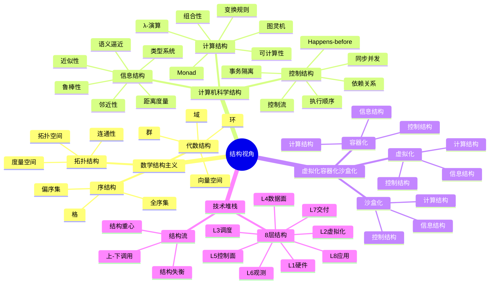
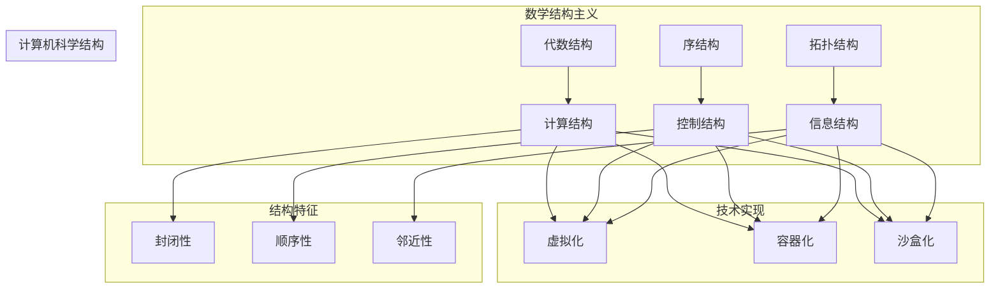

# 从抽象结构的视角看虚拟化容器化沙盒化

> **文档版本**：v1.0 **最后更新**：2025-11-07 **维护者**：项目团队

## 目录

- [从抽象结构的视角看虚拟化容器化沙盒化](#从抽象结构的视角看虚拟化容器化沙盒化)
  - [目录](#目录)
  - [引言](#引言)
  - [一、数学结构主义的启示](#一数学结构主义的启示)
  - [二、计算机科学中的“结构”分类](#二计算机科学中的结构分类)
  - [三、三类结构的深入分析](#三三类结构的深入分析)
    - [1. 计算结构（Computational Structure）—— 代数视角](#1-计算结构computational-structure-代数视角)
      - [核心特征](#核心特征)
      - [典型实例](#典型实例)
      - [哲学意义](#哲学意义)
    - [2. 控制结构（Control Structure）—— 序视角](#2-控制结构control-structure-序视角)
      - [核心特征](#核心特征-1)
      - [典型实例](#典型实例-1)
      - [哲学意义](#哲学意义-1)
    - [3. 信息结构（Information Structure）—— 拓扑/近似视角](#3-信息结构information-structure-拓扑近似视角)
      - [核心特征](#核心特征-2)
      - [典型实例](#典型实例-2)
      - [哲学意义](#哲学意义-2)
  - [四、三类结构的交互与复合](#四三类结构的交互与复合)
  - [五、结构分类的意义与论证](#五结构分类的意义与论证)
    - [1. **统一视角**：跨越子领域](#1-统一视角跨越子领域)
    - [2. **指导设计**：结构决定性质](#2-指导设计结构决定性质)
    - [3. **类比数学**：可形式化](#3-类比数学可形式化)
    - [4. **揭示深层联系**](#4-揭示深层联系)
  - [六、结论：计算机科学的结构主义宣言](#六结论计算机科学的结构主义宣言)
  - [七、延伸思考](#七延伸思考)
  - [参考文献（推荐深入）](#参考文献推荐深入)
  - [第一部分：虚拟化容器化沙盒化的结构分析](#第一部分虚拟化容器化沙盒化的结构分析)
    - [0. 先给三件套一个最小定义](#0-先给三件套一个最小定义)
    - [1. 用“结构主义三棱镜”再剖一次](#1-用结构主义三棱镜再剖一次)
    - [2. 画成“结构三角形”](#2-画成结构三角形)
    - [3. 再看“复合结构”——它们如何杂交](#3-再看复合结构它们如何杂交)
    - [4. 一条“结构主义”选型格言](#4-一条结构主义选型格言)
    - [5. 小结口诀](#5-小结口诀)
  - [第二部分：技术堆栈结构分析](#第二部分技术堆栈结构分析)
    - [0. 统一坐标系（再刻一次）](#0-统一坐标系再刻一次)
    - [1. 把“云-管-端”整条栈切成 8 层](#1-把云-管-端整条栈切成-8-层)
    - [2. 每层“结构重心”扫描图](#2-每层结构重心扫描图)
    - [3. 把“上-下”调用链画成“结构流”](#3-把上-下调用链画成结构流)
    - [4. 横向对标：同一层不同实现如何搬动重心](#4-横向对标同一层不同实现如何搬动重心)
    - [5. 结构失衡 = 故障模式](#5-结构失衡--故障模式)
    - [6. 选型/迁移口诀（结构版）](#6-选型迁移口诀结构版)
    - [7. 一张总图收束](#7-一张总图收束)
    - [8. 结论：技术堆栈不是“汉堡层”，而是“三轴张力网”](#8-结论技术堆栈不是汉堡层而是三轴张力网)
  - [相关文档](#相关文档)
    - [多视角文档](#多视角文档)
    - [文档目录](#文档目录)
    - [结构视角相关文档](#结构视角相关文档)
  - [延伸阅读](#延伸阅读)
  - [🧠 认知增强：思维导图、知识矩阵与专家观点](#-认知增强思维导图知识矩阵与专家观点)
    - [8.1 结构视角完整思维导图](#81-结构视角完整思维导图)
    - [8.2 核心概念知识图谱](#82-核心概念知识图谱)
    - [8.3 多维矩阵对比](#83-多维矩阵对比)
      - [8.3.1 三元结构对比矩阵](#831-三元结构对比矩阵)
      - [8.3.2 结构特征对比矩阵](#832-结构特征对比矩阵)
      - [8.3.3 技术堆栈结构重心对比矩阵](#833-技术堆栈结构重心对比矩阵)
    - [8.4 形象化解释论证](#84-形象化解释论证)
      - [8.4.1 计算结构 = 技术的"积木块"](#841-计算结构--技术的积木块)
      - [8.4.2 控制结构 = 系统的"时间轴"](#842-控制结构--系统的时间轴)
      - [8.4.3 信息结构 = 知识的"地图"](#843-信息结构--知识的地图)
      - [8.4.4 三元结构 = 系统的"三原色"](#844-三元结构--系统的三原色)
      - [8.4.5 结构失衡 = 系统的"失衡状态"](#845-结构失衡--系统的失衡状态)
    - [8.5 专家观点与论证](#85-专家观点与论证)
      - [8.5.1 结构主义数学家的观点](#851-结构主义数学家的观点)
        - [1. Nicolas Bourbaki（布尔巴基学派）](#1-nicolas-bourbaki布尔巴基学派)
        - [2. Alexander Grothendieck（现代数学结构主义）](#2-alexander-grothendieck现代数学结构主义)
      - [8.5.2 计算机科学结构主义专家的观点](#852-计算机科学结构主义专家的观点)
        - [1. Christopher Strachey（编程语言理论家）](#1-christopher-strachey编程语言理论家)
        - [2. Robin Milner（类型论和并发理论专家）](#2-robin-milner类型论和并发理论专家)
      - [8.5.3 系统架构专家的观点](#853-系统架构专家的观点)
        - [1. David Parnas（软件工程专家）](#1-david-parnas软件工程专家)
        - [2. Mary Shaw 和 David Garlan（软件架构专家）](#2-mary-shaw-和-david-garlan软件架构专家)
    - [8.6 认知学习路径矩阵](#86-认知学习路径矩阵)
    - [8.7 专家推荐阅读路径](#87-专家推荐阅读路径)

---

## 引言

你提到的"数学结构"——代数结构、序结构、拓扑结构——是数学中对"结构"的经典划分方式，
源自布尔巴基学派（Bourbaki）的"母结构"思想。这种结构主义视角，对于理解计算机科学
中的概念、语言和系统，具有深刻的启发意义。

我们可以借鉴这种"结构主义"方法，对**计算机科学**进行类似的**结构分类与论证**，构
建一个"计算机科学的结构论"框架。

---

## 一、数学结构主义的启示

布尔巴基将数学结构分为三大类：

| 结构类型     | 核心概念     | 例子                       |
| ------------ | ------------ | -------------------------- |
| **代数结构** | 运算与封闭性 | 群、环、域、向量空间       |
| **序结构**   | 顺序与比较   | 偏序集、全序集、格         |
| **拓扑结构** | 邻近与连续性 | 拓扑空间、度量空间、连通性 |

这些结构不是孤立的，而是可以**复合**（如“拓扑群”=拓扑+群）。

---

## 二、计算机科学中的“结构”分类

我们提出一个对应的三元结构框架，用于分析计算机科学的核心概念：

| 结构类型                                | 计算机科学对应 | 核心问题                                       | 典型实例                                             |
| --------------------------------------- | -------------- | ---------------------------------------------- | ---------------------------------------------------- |
| **计算结构**（Computational Structure） | 代数结构的类比 | **可计算性**、**变换规则**、**组合性**         | λ-演算、图灵机、有限自动机、代数数据类型             |
| **控制结构**（Control Structure）       | 序结构的类比   | **执行顺序**、**依赖关系**、**同步与并发**     | 程序控制流、事件顺序、并发模型、Happens-before 关系  |
| **信息结构**（Information Structure）   | 拓扑结构的类比 | **邻近性**、**近似性**、**鲁棒性**、**连续性** | 类型系统、语义逼近、距离度量、误差容忍、拓扑数据结构 |

> 注：这里的“拓扑”是广义的，指“信息空间”中的邻近性与连续性，而非经典点集拓扑。

---

## 三、三类结构的深入分析

### 1. 计算结构（Computational Structure）—— 代数视角

> 类比：代数结构（群、环、幺半群）

#### 核心特征

- **封闭性**：操作作用于对象后仍在系统内（如函数组合）
- **结合律**：计算顺序可重组（如函数复合、Monad 结合律）
- **单位元**：空操作、恒等函数、return/unit
- **可组合性**：小部件可组合成大系统（模块化、函数式编程）

#### 典型实例

| 概念                | 结构         | 代数解释                                                                         |
| ------------------- | ------------ | -------------------------------------------------------------------------------- | --------------------------------------------------- |
| λ-演算              | 代数系统     | 变量绑定 → 抽象；应用 → 二元运算；β-归约 → 重写规则                              |
| 代数数据类型（ADT） | 初始代数     | `List a = Nil                                                                    | Cons a (List a)`是函子`F(X) = 1 + a × X` 的初始代数 |
| Monad               | 幺半群       | `join :: M (M a) → M a` 是乘法，`return :: a → M a` 是单位元，满足结合律与单位律 |
| 图灵机              | 状态变换系统 | 状态转移函数：δ: Q × Γ → Q × Γ × {L,R}，构成状态空间上的“作用”                   |

#### 哲学意义

计算结构关注的是**“什么可以被计算”**以及**“如何通过规则组合出复杂行为”**。这是计
算机科学的“语法”层面。

---

### 2. 控制结构（Control Structure）—— 序视角

> 类比：序结构（偏序、全序、格）

#### 核心特征

- **顺序性**：语句执行的先后关系
- **依赖性**：数据依赖、控制依赖
- **并发性**：事件间的偏序关系（非全序）
- **同步机制**：通过屏障、锁、消息等建立序关系

#### 典型实例

| 概念                      | 序结构         | 序解释                                               |
| ------------------------- | -------------- | ---------------------------------------------------- |
| 程序控制流图（CFG）       | 有向图（偏序） | 基本块之间构成偏序，循环引入非良序                   |
| Happens-before 关系       | 偏序集         | Lamport 定义：若 a → b，则 a 在因果上先于 b          |
| 并发模型（如 CSP、Actor） | 消息序         | 消息传递构成分布式偏序，无全局时钟                   |
| 事务隔离级别              | 序一致性       | 可串行化 = 找到一个等价的全序执行                    |
| 死锁避免                  | 序的良基性     | 资源分配图无环 ⇔ 存在全序扩展（Dijkstra 银行家算法） |

#### 哲学意义

控制结构回答**“何时发生”**与**“以何顺序发生”**。它引入**时间维度**（逻辑时间或物
理时间），是计算机科学的“语义”与“时序逻辑”层面。

> 注：在分布式系统中，**没有全局时钟**，因此必须依赖**偏序**（如向量时钟）来捕捉
> 因果关系。

---

### 3. 信息结构（Information Structure）—— 拓扑/近似视角

> 类比：拓扑结构（邻近、连续性、鲁棒性）

#### 核心特征

- **邻近性**：信息之间的“相似”或“可达”
- **连续性**：小扰动不导致大变化（鲁棒性）
- **逼近性**：用有限表示无限（如浮点近似实数）
- **抽象层次**：从具体值到类型、规范、语义

#### 典型实例

| 概念                                | 信息结构             | 拓扑/近似解释                                                               |
| ----------------------------------- | -------------------- | --------------------------------------------------------------------------- |
| 类型系统                            | 信息空间的“形状”     | 类型是信息空间的子集，良类型程序 ≈ 连续映射（Curry-Howard 下，证明 ≈ 程序） |
| 抽象解释（Abstract Interpretation） | Galois 连接          | 具体域与抽象域之间的逼近关系，构成伴随函子对                                |
| 容错计算                            | 鲁棒性               | 输入小扰动 ⇒ 输出小变化（数值稳定性、纠错码）                               |
| 拓扑数据结构（如 Mapper、持续同调） | 数据的“形状”         | 用拓扑方法分析高维数据（TDA: Topological Data Analysis）                    |
| 域名理论（Domain Theory）           | 有向完全偏序（dcpo） | 用“部分信息”逼近“完全信息”，解决递归定义（不动点语义）                      |
| 机器学习中的嵌入空间                | 度量拓扑             | 词向量、图像嵌入：语义相近 ⇒ 距离近（拓扑保持映射）                         |

#### 哲学意义

信息结构关注**“信息如何被表示、近似、压缩与保护”**。它处理**不确定性、近似、误差
与抽象**，是计算机科学的“稳健性与语义逼近”层面。

---

## 四、三类结构的交互与复合

正如数学中可以有“拓扑群”（拓扑+代数），计算机科学中结构也是**复合**的：

| 复合结构           | 组成                | 例子                                         |
| ------------------ | ------------------- | -------------------------------------------- |
| **函数式并发模型** | 计算结构 + 控制结构 | 纯函数（代数） + Actor 模型（消息序）        |
| **类型化 λ-演算**  | 计算结构 + 信息结构 | λ-演算（代数） + 类型系统（信息拓扑）        |
| **拓扑持续计算**   | 信息结构 + 控制结构 | 在动态数据流上维护拓扑特征（如持续同调更新） |
| **反应式编程**     | 控制结构 + 信息结构 | 时间变化的数据流（控制） + 信号近似（信息）  |

> 结构复合 ⇒ 系统复杂性与表达能力提升。

---

## 五、结构分类的意义与论证

### 1. **统一视角**：跨越子领域

- 无论操作系统、编程语言、AI、分布式系统，均可归入：
  - **如何计算？**（计算结构）
  - **何时执行？**（控制结构）
  - **如何表示与逼近？**（信息结构）

### 2. **指导设计**：结构决定性质

- 选择**纯函数式**（强计算结构） ⇒ 易于推理，但需处理控制结构（如 Monad 栈）
- 引入**全局锁序**（控制结构） ⇒ 避免死锁，但牺牲并发度
- 使用**类型系统**（信息结构） ⇒ 提前捕获错误，但增加复杂度

### 3. **类比数学**：可形式化

- 计算结构 → 可用**范畴论**建模（如笛卡尔闭范畴 ⇒ λ-演算）
- 控制结构 → 可用**偏序集、事件结构（Event Structures）**建模
- 信息结构 → 可用**域名理论、度量空间、拓扑斯（Topos）**建模

### 4. **揭示深层联系**

- **Curry-Howard 同构**：计算结构（程序） ↔ 信息结构（证明）
- **分布式一致性**：控制结构（偏序） + 信息结构（容错逼近） ⇒ CAP 定理是“序”与“
  信息一致性”的权衡
- **神经网络可解释性**：信息结构（嵌入空间拓扑） + 计算结构（函数复合） ⇒ 分析决
  策边界

---

## 六、结论：计算机科学的结构主义宣言

> 计算机科学不是“编程技术”的集合，而是**关于信息变换、控制与表示的结构科学**。

我们提出：

> **计算机科学 = 计算结构 ⊕ 控制结构 ⊕ 信息结构**

这三类结构构成其**本体论骨架**。理解它们，就是理解：

- 程序为何能组合？→ **计算结构**
- 并发为何复杂？→ **控制结构**
- 为何需要类型与抽象？→ **信息结构**

正如数学不因“解题”而存在，而因“结构之美”而永恒；计算机科学也不因“代码”而伟大，而
因**驾驭复杂性之结构**而深远。

---

## 七、延伸思考

| 问题                 | 结构视角                                                           |
| -------------------- | ------------------------------------------------------------------ |
| 量子计算是哪种结构？ | 新计算结构（非经典幺正变换） + 新信息结构（希尔伯特空间拓扑）      |
| AI 可解释性缺什么？  | 缺乏“信息结构”的拓扑透明性（黑盒无邻近性保证）                     |
| 软件危机的根源？     | 三类结构失衡：重计算（功能），轻控制（并发 bug），弱信息（无抽象） |

---

## 参考文献（推荐深入）

1. Goguen, J. A. — _A Categorical Manifesto_（范畴论视角下的计算结构）
2. Winskel, G. — _The Formal Semantics of Programming Languages_（事件结构与控制
   ）
3. Abramsky, S. — _Domain Theory in Logical Form_（信息结构与拓扑）
4. Lamport, L. — _Time, Clocks, and the Ordering of Events_（分布式控制结构）
5. Edelsbrunner, H. — _Computational Topology_（信息结构的拓扑方法）
6. Pierce, B. — _Types and Programming Languages_（类型作为信息结构）

---

如你所见，**计算机科学并非“应用数学”的附庸，而是拥有自身结构本体论的独立学科**。
它以**计算**为骨，以**控制**为脉，以**信息**为血—— 三者交织，构成数字宇宙的**三
位一体结构**。

> 我们不是在写代码，我们是在**构建结构**—— 让思想在硅基上，有序、可组合、且鲁棒
> 地**运行**。

把"虚拟化 / 容器化 / 沙盒化"再放进上一轮的"三元结构"天平称一次，你会发现它们其
实**共用同一套机制**，只是**在三大结构上的取舍比例不同**—— 像极了"拓扑群" vs"李
群"：材料一样，骨架不同。

---

## 第一部分：虚拟化容器化沙盒化的结构分析

> 📋 **概念定义参考**：虚拟化、容器化、沙盒化的严格定义和技术层级分析请参考
> [严格定义文档](../docs/COGNITIVE/05-decision-analysis/decision-models/06-technical-concepts/12-virtualization-paravirtualization-containerization-sandboxing-strict-definition.md)。

### 0. 先给三件套一个最小定义

| 概念                    | 一句话定义                                          | 核心目的                                     |
| ----------------------- | --------------------------------------------------- | -------------------------------------------- |
| 虚拟化 Virtualization   | 把**硬件指令集+资源**做成**可多路复用的抽象**       | 让多台“机器”互不感知地跑在同一物理机上       |
| 容器化 Containerization | 把**操作系统调用+命名空间**做成**可多路复用的抽象** | 让多组进程以为自己独占整个 Linux             |
| 沙盒化 Sandboxing       | 把**权限+可见性**做成**可受限的抽象**               | 让同一把用户态二进制跑在**最小可行上下文**里 |

---

### 1. 用“结构主义三棱镜”再剖一次

| 结构维度                     | 虚拟化                                                                                                                           | 容器化                                                                                                                                                     | 沙盒化                                                                                                                              |
| ---------------------------- | -------------------------------------------------------------------------------------------------------------------------------- | ---------------------------------------------------------------------------------------------------------------------------------------------------------- | ----------------------------------------------------------------------------------------------------------------------------------- |
| **计算结构** (Computational) | • 指令集级**完全封闭** • 客户机指令被**动态二进制翻译**或硬件捕获 • 状态=寄存器+内存+设备，**可快照**                            | • 系统调用级**半封闭** • 进程继续发**原生指令**，只有**syscall 被重定向** • 状态 ≈ cgroup+namespace+rootfs，**可镜像**                                     | • **用户态指令零修改** • 仅把**危险 syscall 子集**过滤/仿真 • 状态 ≈ 过滤表+文件系统视图，**轻量**                                  |
| **控制结构** (Control)       | • **强序保证**：VM-Exit/Entry 形成**全局同步点** • 客户机内部再并发，**Host 可透明抢占** • 迁移=**停机-拷贝-恢复**，序被**冻结** | • **弱序**：namespace 隔离**PID/IPC/Net** 名字空间，**但时钟一致** • cgroup 仅做**统计与冻结**，不重塑序 • 镜像层**只读共享**，写时复制**序局部化**        | • **最小序干预**： – seccomp-bpf：**系统调用偏序过滤** – pledge/unveil：**能力降序** • 通常**不迁移**，序无需全局冻结               |
| **信息结构** (Information)   | • **完全信息伪装**：ACPI 表/PCI 拓扑/CPUID 皆可**伪造** • 内存与磁盘**字节级隔离** • 代价：**冗余内核+镜像**                     | • **部分信息伪装**： – `/proc`、`/sys` 视图被**重新挂载** – 但**内核版本相同**，**系统调用语义一致** • 镜像分层=**信息拓扑的“近似”**：只读层+写层=**开集** | • **最小信息欺骗**： – 仅**文件系统 chroot/namespace** – 返回**ENOENT** 而不是**伪造内容** • 错误码**保持原有语义**，**不扭曲拓扑** |

一句话总结： **虚拟化“重计算”、容器化“折中”、沙盒化“轻信息”**。

---

### 2. 画成“结构三角形”

把三条技术摆在**等边三角形**顶点，越靠近某顶点表示**在该结构上投入最重**：

```text
                   计算结构
                      ^
                      |  虚拟化
                      |
                      |
   沙盒化 <-----------+-----------> 容器化
   (信息结构)         |         (控制+计算折中)
                      |
                      |
                   控制结构
```

• **虚拟化**几乎垂直拉高“计算结构”轴： – 硬件级状态机完整克隆； – 控制与信息可伪
装，但**首要保证计算语义一致**。

• **容器化**落在**计算-控制边缘**： – 仍需 syscall 级**重定向**（控制）， – 但不
需要指令级仿真（计算轻一半）。

• **沙盒化**紧贴**信息结构**角： – 计算零修改，控制只加**过滤点**， – 核心在**最
小可见性/最小权限**——**信息拓扑的“开覆盖”最小化**。

---

### 3. 再看“复合结构”——它们如何杂交

| 杂交案例             | 计算                                | 控制                                  | 信息                                    | 一句话点评                 |
| -------------------- | ----------------------------------- | ------------------------------------- | --------------------------------------- | -------------------------- |
| **KVM+QEMU**         | 硬件虚拟化                          | 用户态事件循环                        | 可选 virtio-**fs** 缓存一致性           | 经典“**计算结构主导**”     |
| **gVisor**           | 用户态**Sentry** 重新实现 Linux ABI | 内部**独立调度器**⇒ 控制再分层        | 仅暴露**fake /proc**                    | **计算+控制**双高，信息轻  |
| **Firecracker**      | KVM 指令级                          | **微 VM** 极短退出路径                | **设备树极简**                          | 把虚拟化**往信息结构压薄** |
| **Docker + seccomp** | 容器级                              | **控制结构双层**：namespace + seccomp | **信息视图再裁剪**                      | 容器套沙盒，**结构叠加**   |
| **WASM 沙盒**        | **字节码验证**（计算结构轻量伪装）  | **Capabilities 表**（控制）           | **线性内存**+**导入函数白名单**（信息） | 三轴都**中度**，故可跨平台 |

---

### 4. 一条“结构主义”选型格言

> **“你要多假的机器？”** – 想要**完全假的机器**→ 虚拟化（计算结构爆表） – 想
> 要**差不多假的机器**→ 容器化（计算-控制折中） – 只想**别让程序坏事**→ 沙盒化（
> 信息结构优先）

---

### 5. 小结口诀

```text
虚拟化：重计算，全局序，信息全造假；
容器化： syscall 换名字，镜像分层像拓扑；
沙盒化：不动计算，只剪权限，最小邻近集。
```

用这三根杠杆去量任何“隔离/安全/密度”需求，你很快就能说出： **“到底是要一个新宇宙
，还是只要一道栅栏。”**

把"结构主义三棱镜"转过来，**让光线直射技术堆栈**—— 这一次我们不谈抽象口号，而
是**把"计算-控制-信息"三根轴直接钉在每一层软硬件上**，让你能**一张表看出整条栈到
底在哪一维堆了重量**，并且**为什么换层往往意味着结构重心的迁移**。

---

## 第二部分：技术堆栈结构分析

### 0. 统一坐标系（再刻一次）

| 维度         | 关键问句                     | 常用形式化工具                  | 典型失败模式                   |
| ------------ | ---------------------------- | ------------------------------- | ------------------------------ |
| **计算结构** | “指令/函数能不能原样跑？”    | 代数、范畴、幺半群、状态机      | 指令陷阱、ABI 断裂、API 不兼容 |
| **控制结构** | “事件/线程/中断按啥序发生？” | 偏序、Happens-before、事件结构  | 死锁、竞态、TTO reorder        |
| **信息结构** | “进程看到的世界长啥样？”     | 拓扑、度量、Domain Theory、开集 | 信息泄漏、TOCTOU、侧信道       |

---

### 1. 把“云-管-端”整条栈切成 8 层

```text
  Layer 8｜Workload  (业务代码)
  Layer 7｜Language Runtime  (JVM / CPython / V8)
  Layer 6｜User-Space LibOS  (gVisor / Nabla / WASM-Sandbox)
  Layer 5｜Container Engine  (runc / containerd / LXC)
  Layer 4｜Host OS / Kernel  (Linux / Windows / Zircon)
  Layer 3｜Hypervisor  (KVM / Xen / Hyper-V / ESXi)
  Layer 2｜Firmware / SMM  (UEFI / PI / SMM / BMC)
  Layer 1｜Silicon  (CPU / GPU / TEE / FPGA)
```

---

### 2. 每层“结构重心”扫描图

| 层级               | 计算结构权重 | 控制结构权重 | 信息结构权重 | 典型机制 & 备注                                                    |
| ------------------ | ------------ | ------------ | ------------ | ------------------------------------------------------------------ |
| **L8 业务代码**    | ★★★☆         | ★★☆          | ★★           | 纯函数 ⇧ 计算；事件驱动 ⇧ 控制；配置 ⇧ 信息                        |
| **L7 语言运行时**  | ★★★          | ★★★          | ★★           | Bytecode/JIT 保计算；GC⇧ 控制；ClassLoader⇧ 信息                   |
| **L6 LibOS**       | ★★★          | ★★★☆         | ★★           | 重实现 ABI→ 计算；独立调度 → 控制；/proc 伪造 → 信息               |
| **L5 容器引擎**    | ★★           | ★★★★         | ★★★          | runc 不做指令仿真；namespace/cgroup 全是控制；rootfs 挂载=信息视图 |
| **L4 Host Kernel** | ★★           | ★★★          | ★★★          | syscall 是计算入口；调度=控制；VFS=信息拓扑                        |
| **L3 Hypervisor**  | ★★★★         | ★★★          | ★★           | VM-Exit/Entry 保指令语义；vCPU 调度=控制；virtio 设备=信息         |
| **L2 Firmware**    | ★★           | ★★★☆         | ★★★          | SMM 中断处理=控制；ACPI 表=信息；无高级计算                        |
| **L1 Silicon**     | ★★★★★        | ★★★          | ★            | 指令退休保计算；缓存一致性协议=控制；cache 侧信道=信息泄漏         |

> ★ 越多=该层在该维度**投入的逻辑/硬件复杂度越高**。

---

### 3. 把“上-下”调用链画成“结构流”

```text
  L8 业务函数
    │ ① 编译/解释
    ▼
  L7 Bytecode + Runtime
    │ ② 系统调用
    ▼
  L4 Host Kernel  ←─── 也可能被 L6 LibOS 截胡（③）
    │ ④ KVM ioctl
    ▼
  L3 Hypervisor
    │ ⑤ VM-Exit
    ▼
  L1 CPU 硬件
```

• **① 计算结构下传**：高级语义 → 字节码 → 机器码，**代数结构保持**（函数复合律）
。 • **②→④ 控制结构转折**：用户态 → 内核态 →VM-Exit，**全局序插入同步点**。 •
**③ 信息结构短路**：gVisor 把 syscall 截在用户态，**让 L8 看到“假内核”**——信息视
图被提前伪造，**不再信任下层**。

---

### 4. 横向对标：同一层不同实现如何搬动重心

| 案例                      | 计算                         | 控制                                | 信息                            | 一句话                                   |
| ------------------------- | ---------------------------- | ----------------------------------- | ------------------------------- | ---------------------------------------- |
| **KVM vs Xen**            | 都 ★★★★                      | Xen 老版本需 Dom0 调度 ⇒ 控制 ★★★★☆ | KVM 重用 Host VFS⇒ 信息 ★★★     | Xen 更早“控制结构”更重                   |
| **Docker vs LXC**         | 同级                         | Docker 引入**layer DAG**⇒ 控制 ★★★☆ | 镜像仓库 ⇒ 信息 ★★★★            | Docker 把“信息结构”商品化                |
| **gVisor vs Firecracker** | Sentry 重实现 ABI⇒ 计算 ★★★★ | 独立调度 ⇒ 控制 ★★★★                | 极简设备 ⇒ 信息 ★★              | Firecracker 把计算交给 KVM，**信息压薄** |
| **WASM vs JVM**           | 字节码验证 ⇒ 计算 ★★★        | 无 GC 抢占 ⇒ 控制 ★★                | 线性内存=**显式开集**⇒ 信息 ★★★ | WASM 用“受限信息结构”换**可移植安全**    |

---

### 5. 结构失衡 = 故障模式

| 故障                | 哪根轴断了     | 实例                                                |
| ------------------- | -------------- | --------------------------------------------------- |
| Meltdown            | 信息结构崩溃   | 用户态“开集”越界读到内核页 →**信息拓扑穿孔**        |
| Spectre             | 控制结构被利用 | 预测执行**微指令序**≠**架构序**→**控制偏序被重排**  |
| Docker rm -rf /     | 计算结构未隔离 | chroot 逃逸 →**计算语义**仍可触碰宿主机             |
| Java STW 卡顿       | 控制结构单点   | GC 全局暂停 →**事件序**被**大块同步点**堵住         |
| 浮点 nondeterminism | 计算/信息失衡  | 80-bit x87 寄存器 →**同一源代码**给出**不同近似值** |

---

### 6. 选型/迁移口诀（结构版）

> “**向下买计算，向上买控制，向边买信息**”

• 需要**指令级兼容**→**往下走**：KVM/TEE • 需要**毫秒级热迁移**→**控制轴加
码**：Firecracker 微 VM • 需要**镜像秒级分发**→**信息轴优化**：Docker 分层+压缩
• 需要**最小攻击面**→**信息轴剪枝**：seccomp + unveil + 线性内存

---

### 7. 一张总图收束

```text
        计算结构
           ↑
           │  L3 Hypervisor
           │  L7 JVM JIT
           │  L6 gVisor Sentry
           │
  L2 SMM ←─┼──→ L5 cgroup
           │      ↗
           │     ╱
  L8 ←-----+----╱--------→ L4 VFS
  business  ╱   information
           ╱
  L1 Silicon ───→ 侧信道
           ↘
            控制结构
```

• 纵=**跨层下传**；横=**同层取舍**；斜=**复合杂交**。 • 任何新提案
（Rust-VM、Wasm-microkernel、RISC-V 沙盒指令）只要**画一次三轴雷达图**，就能立刻
看出它和旧栈**谁重了谁轻了**。

---

### 8. 结论：技术堆栈不是“汉堡层”，而是“三轴张力网”

> **“层”只是工程分工，** > **“结构”才是本质复杂度。**

• **加一层** ≠ **多一功能**，而是**把某根轴的复杂度**推到**更易维护的边界**。 •
**换栈** = **重新分配三维重量**—— 向下（硬件）买**计算保证**， 向上（策略）
买**控制灵活**， 向边（视图/镜像/仓库）买**信息效率**。

记住这张“结构雷达”，下次再看到“**我们用 WebAssembly 替容器**”或者“**我们写了个
Unikernel**”时，你只需问三句：

1. 指令语义谁保证？——**计算轴**
2. 事件序谁拍板？——**控制轴**
3. 进程看见的世界真假多少？——**信息轴**

三句答完， **栈的斤两就称清楚了。**

---

## 相关文档

### 多视角文档

- **[认知视角](ai_view.md)** - 云原生技术栈认知视图：Docker → K8s/K3s → WasmEdge
  → OPA
- **[代数视角](algebra_view.md)** - 从代数解构上看虚拟化容器化沙盒化
- **[架构视角](architecture_view.md)** - 从软件架构的视角看待虚拟化容器化沙盒化
- **[系统视角](system_view.md)** - 从系统的视角看虚拟化容器化沙盒化（7 层 4 域模
  型）
- **[技术社会视角](tech_view.md)** - 从社会技术类比的视角看待虚拟化容器化沙盒化
- **[eBPF/OTLP 视角](ebpf_otlp_view.md)** - 从 eBPF 和 OTLP 的视角看虚拟化容器化
  （横纵耦合定位模型、智能系统能力架构）

### 文档目录

- **[文档总览](../docs/README.md)** - 完整的文档体系说明
- **[架构视图文档](../docs/ARCHITECTURE/README.md)** - 架构视角的详细文档
- **[认知模型文档](../docs/COGNITIVE/README.md)** - 认知层面的分析文档
- **[技术规格文档](../docs/TECHNICAL/README.md)** - 技术实现细节

### 结构视角相关文档

- **[结构视角文档集](../docs/COGNITIVE/03-theoretical-perspectives/structural-perspective/)** -
  结构视角的详细文档
- **[结构视角架构视图](../docs/ARCHITECTURE/02-views/09-multi-perspectives/02-structural-perspective.md)** -
  结构视角的架构视图

---

## 延伸阅读

本文档提供了结构视角的核心思想。如需深入了解，请参考：

- **[结构视角详细文档集](../docs/COGNITIVE/03-theoretical-perspectives/structural-perspective/README.md)**
  ⭐ - 基于本文档的详细扩展，包含：

  - 结构主义基础理论（数学结构主义启示、三元结构框架、结构分类）
  - 三类结构的深入分析（计算结构、控制结构、信息结构）
  - 结构交互与复合（复合结构、结构间关系）
  - 虚拟化容器化沙盒化的结构分析（结构主义三棱镜、复合技术、选型原则）
  - 技术堆栈结构分析（8 层结构、结构流、故障模式）
  - 实践应用（设计指南、案例研究）

- **[相关架构文档](../docs/ARCHITECTURE/)** - 架构视角的技术分析
- **[相关认知模型](../docs/COGNITIVE/)** - 其他认知框架和理论模型

---

## 🧠 认知增强：思维导图、知识矩阵与专家观点

> **认知增强说明**：本节提供结构视角的认知工具，帮助读者从多个角度理解三元结构模型和结构主义思想。

### 8.1 结构视角完整思维导图

**三元结构模型的核心结构**：



### 8.2 核心概念知识图谱

**三元结构模型的概念关系网络**：



### 8.3 多维矩阵对比

#### 8.3.1 三元结构对比矩阵

| 结构类型 | 数学类比 | 核心特征 | 典型实例 | 虚拟化 | 容器化 | 沙盒化 |
|---------|---------|---------|---------|--------|--------|--------|
| **计算结构** | 代数结构 | 封闭性、结合律、单位元、可组合性 | λ-演算、Monad、图灵机 | 状态变换系统 | 进程组合 | 字节码执行 |
| **控制结构** | 序结构 | 顺序性、依赖性、并发性、同步机制 | 控制流、Happens-before、事务隔离 | 调度序、迁移序 | 调度序、生命周期 | 执行序、安全序 |
| **信息结构** | 拓扑结构 | 邻近性、近似性、鲁棒性、连续性 | 类型系统、语义逼近、距离度量 | 资源拓扑、网络拓扑 | 命名空间拓扑 | 能力模型、安全域 |

#### 8.3.2 结构特征对比矩阵

| 特征 | 计算结构 | 控制结构 | 信息结构 | 数学表示 | 技术映射 |
|------|---------|---------|---------|---------|---------|
| **核心问题** | 可计算性、变换规则 | 执行顺序、依赖关系 | 邻近性、近似性 | - | - |
| **数学基础** | 群、环、幺半群 | 偏序、全序、格 | 拓扑空间、度量空间 | - | - |
| **典型操作** | 函数组合、Monad | 顺序执行、同步 | 类型检查、近似匹配 | `f ∘ g` | `a → b → c` |
| **组合性** | 高（函数组合） | 中（顺序组合） | 低（拓扑组合） | `(f ∘ g) ∘ h = f ∘ (g ∘ h)` | - |
| **虚拟化体现** | 状态变换、资源映射 | 调度序、迁移序 | 资源拓扑、网络拓扑 | `Φ: P → V` | - |
| **容器化体现** | 进程组合、镜像组合 | 调度序、生命周期 | 命名空间拓扑 | `Ψ: P → C` | - |
| **沙盒化体现** | 字节码执行、能力组合 | 执行序、安全序 | 能力模型、安全域 | `Ω: C → Sandbox` | - |

#### 8.3.3 技术堆栈结构重心对比矩阵

| 层级 | 计算结构重心 | 控制结构重心 | 信息结构重心 | 结构失衡风险 |
|------|------------|------------|------------|------------|
| **L1 硬件** | CPU指令执行 | 中断序、DMA序 | 内存拓扑、NUMA | 低 |
| **L2 虚拟化** | 状态变换 | 调度序、迁移序 | 资源拓扑 | 中 |
| **L3 调度** | 资源分配 | 调度序、依赖序 | 节点拓扑 | 中 |
| **L4 数据面** | 数据变换 | 消息序、事务序 | 网络拓扑、存储拓扑 | 高 |
| **L5 控制面** | 状态计算 | 一致性序、共识序 | 元数据拓扑 | 高 |
| **L6 观测** | 数据聚合 | 时间序、因果序 | 观测拓扑 | 中 |
| **L7 交付** | 构建组合 | 流水线序 | 依赖拓扑 | 中 |
| **L8 应用** | 业务逻辑 | 业务序 | 业务拓扑 | 低 |

### 8.4 形象化解释论证

#### 8.4.1 计算结构 = 技术的"积木块"

> **类比**：计算结构就像技术的"积木块"，可以组合成复杂的系统。

**解释**：

- **封闭性** = 积木块可以组合，但不会变成其他东西
- **结合律** = 组合顺序可以改变，但结果相同
- **单位元** = 空积木块（不改变结果）
- **可组合性** = 小积木块可以组合成大积木块

**价值**：通过计算结构，我们可以理解技术的组合性，就像理解积木块的组合方式一样。

#### 8.4.2 控制结构 = 系统的"时间轴"

> **类比**：控制结构就像系统的"时间轴"，定义了事件发生的顺序。

**解释**：

- **顺序性** = 时间轴上的先后顺序
- **依赖性** = 事件之间的依赖关系
- **并发性** = 时间轴上的并行事件
- **同步机制** = 时间轴上的同步点

**价值**：通过控制结构，我们可以理解系统的执行顺序，就像理解时间轴上的事件顺序一样。

#### 8.4.3 信息结构 = 知识的"地图"

> **类比**：信息结构就像知识的"地图"，定义了概念之间的邻近关系。

**解释**：

- **邻近性** = 地图上距离近的概念
- **近似性** = 地图上相似的概念
- **鲁棒性** = 地图上的容错能力
- **连续性** = 地图上的连续路径

**价值**：通过信息结构，我们可以理解概念之间的关系，就像理解地图上的地理位置关系一样。

#### 8.4.4 三元结构 = 系统的"三原色"

> **类比**：三元结构就像系统的"三原色"，可以组合成所有颜色。

**解释**：

- **计算结构** = 红色（基础计算能力）
- **控制结构** = 绿色（执行顺序）
- **信息结构** = 蓝色（信息关系）
- **复合结构** = 三原色组合（如黄色=红+绿）

**价值**：通过三元结构，我们可以理解系统的本质特征，就像理解颜色的本质一样。

#### 8.4.5 结构失衡 = 系统的"失衡状态"

> **类比**：结构失衡就像系统的"失衡状态"，需要调整才能恢复平衡。

**解释**：

- **计算结构失衡** = 计算能力不足或过剩
- **控制结构失衡** = 执行顺序混乱或死锁
- **信息结构失衡** = 信息关系错误或丢失

**价值**：通过结构失衡分析，我们可以诊断系统问题，就像诊断身体失衡一样。

### 8.5 专家观点与论证

#### 8.5.1 结构主义数学家的观点

##### 1. Nicolas Bourbaki（布尔巴基学派）

> "Mathematics is the science of structures. The fundamental structures of mathematics are algebraic structures, order structures, and topological structures."

**结构视角中的应用**：

- **结构分类**：将计算机科学的结构分为计算结构、控制结构、信息结构
- **结构复合**：理解不同结构的复合方式
- **结构统一**：通过结构统一理解不同技术

##### 2. Alexander Grothendieck（现代数学结构主义）

> "The notion of structure is fundamental in mathematics. It allows us to understand complex systems by identifying their underlying patterns and relationships."

**结构视角中的应用**：

- **模式识别**：通过结构识别技术系统的模式
- **关系理解**：理解技术之间的关系
- **系统理解**：通过结构理解复杂系统

#### 8.5.2 计算机科学结构主义专家的观点

##### 1. Christopher Strachey（编程语言理论家）

> "The structure of a program reflects the structure of the problem it solves. Understanding program structure is essential for understanding program behavior."

**结构视角中的应用**：

- **程序结构**：通过结构理解程序的组织方式
- **问题结构**：理解问题与程序结构的对应关系
- **行为理解**：通过结构理解程序行为

##### 2. Robin Milner（类型论和并发理论专家）

> "Type systems provide a structural view of computation. They allow us to reason about program behavior through structural properties."

**结构视角中的应用**：

- **类型结构**：通过类型系统理解计算结构
- **结构推理**：通过结构属性推理程序行为
- **结构验证**：通过结构验证程序正确性

#### 8.5.3 系统架构专家的观点

##### 1. David Parnas（软件工程专家）

> "The structure of a software system should reflect its decomposition into modules. Good structure makes systems easier to understand, modify, and maintain."

**结构视角中的应用**：

- **模块结构**：通过结构理解系统的模块化
- **系统理解**：通过结构理解系统组织
- **系统维护**：通过结构简化系统维护

##### 2. Mary Shaw 和 David Garlan（软件架构专家）

> "Software architecture is about the structure of software systems. It defines the components, their relationships, and the principles governing their design and evolution."

**结构视角中的应用**：

- **架构结构**：通过结构理解软件架构
- **组件关系**：理解组件之间的结构关系
- **设计原则**：通过结构指导设计原则

### 8.6 认知学习路径矩阵

| 学习阶段 | 核心内容 | 形象化理解 | 数学理解 | 实践应用 | 认知目标 |
|---------|---------|-----------|---------|---------|---------|
| **入门** | 三元结构 | 系统的"三原色" | 代数、序、拓扑 | 理解结构分类 | 建立直觉 |
| **进阶** | 结构特征 | 积木块、时间轴、地图 | 封闭性、顺序性、邻近性 | 结构分析 | 理解特征 |
| **高级** | 结构复合 | 三原色组合 | 结构复合、结构交互 | 结构设计 | 掌握应用 |
| **专家** | 结构主义 | 结构主义思想 | 数学结构主义、计算机科学结构 | 系统设计 | 掌握理论 |

### 8.7 专家推荐阅读路径

**结构主义基础推荐路径**：

1. **数学结构主义**：理解代数、序、拓扑三大结构
2. **计算机科学结构**：理解计算、控制、信息三大结构
3. **结构复合**：理解结构的复合方式
4. **结构应用**：理解结构在技术中的应用

**系统分析应用推荐路径**：

1. **结构识别**：识别系统中的计算、控制、信息结构
2. **结构分析**：分析结构的特征和关系
3. **结构设计**：基于结构设计系统架构
4. **结构优化**：通过结构优化系统性能

---

**更新时间**：2025-11-15 **版本**：v1.1（添加认知增强工具）
